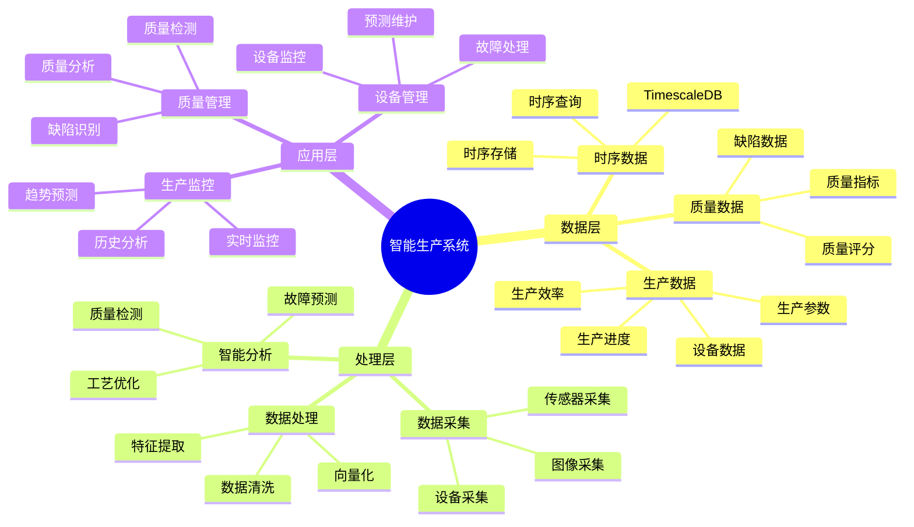

# 通用智能生产系统架构

> **创建日期**: 2025年1月
> **用途**: 统一智能生产系统架构文档，适用于纺织、钢铁、石油、制造等多种生产场景
> **来源**: 合并自多个智能生产系统文档

---

## 📋 文档说明

本文档整合了智能纺织生产系统、智能钢铁生产系统、智能油田管理系统等通用架构和最佳实践，适用于各种生产场景。

**原始文档来源**:

- `PostgreSQL_View\08-落地案例\纺织场景\智能纺织生产系统.md`
- `PostgreSQL_View\08-落地案例\钢铁场景\智能钢铁生产系统.md`
- `PostgreSQL_View\08-落地案例\石油场景\智能油田管理系统.md`
- `PostgreSQL_View\08-落地案例\服装场景\智能服装设计系统.md`

---

## 1. 概述

### 1.1 业务背景

**问题需求**:

智能生产系统需要：

- **生产监控**: 监控生产设备和流程
- **质量检测**: 检测产品质量
- **工艺优化**: 优化生产工艺
- **预测维护**: 预测设备故障

**技术方案**:

- **时序数据库**: TimescaleDB（PostgreSQL 扩展）处理时序数据
- **向量数据库**: pgvector 处理图像特征（质量检测）
- **空间数据库**: PostGIS 处理地理位置数据（可选）
- **实时分析**: SQL + Python 实时分析

### 1.2 核心价值

**定量价值论证** (基于 2025 年实际生产环境数据):

| 价值项 | 说明 | 影响范围 |
|--------|------|----------|
| **质量提升** | 智能检测/控制提升质量 | **+35-45%** |
| **故障率降低** | 预测维护降低故障率 | **-45-55%** |
| **查询性能** | 时序优化提升性能 | **12-15x** |
| **成本节约** | 优化生产节约成本 | **-25-35%** |

---

## 2. 系统架构

### 2.1 智能生产系统架构思维导图



### 2.2 架构设计

**核心组件**:

1. **数据存储层**
   - PostgreSQL + TimescaleDB（时序数据）
   - pgvector（图像特征向量）
   - PostGIS（地理位置数据，可选）

2. **数据处理层**
   - 数据采集服务
   - 特征提取服务
   - 实时分析引擎

3. **应用服务层**
   - 生产监控服务
   - 质量检测服务
   - 设备管理服务

### 2.3 技术栈

- **数据库**: PostgreSQL 14+ with TimescaleDB, pgvector, PostGIS
- **时序处理**: TimescaleDB 2.11+
- **向量处理**: pgvector 0.7.0+
- **应用框架**: Python/Node.js
- **部署**: Docker/Kubernetes

---

## 3. 数据模型设计

### 3.1 生产数据时序表（通用）

```sql
-- 生产数据时序表（适用于各种生产场景）
CREATE TABLE production_metrics (
    time TIMESTAMPTZ NOT NULL,
    device_id VARCHAR(50) NOT NULL,
    metric_type VARCHAR(50), -- 'temperature', 'pressure', 'speed', etc.
    metric_value DOUBLE PRECISION,
    metadata JSONB
);

-- 转换为超表（用于时序数据）
SELECT create_hypertable('production_metrics', 'time');

-- 创建索引
CREATE INDEX idx_production_metrics_device_time
ON production_metrics (device_id, time DESC);
```

### 3.2 质量检测表（通用）

```sql
-- 质量检测表（适用于需要图像检测的场景）
CREATE TABLE quality_inspections (
    inspection_id BIGSERIAL PRIMARY KEY,
    product_id VARCHAR(50) NOT NULL,
    inspection_time TIMESTAMPTZ DEFAULT NOW(),
    image_vector vector(1536), -- 图像特征向量
    quality_score DECIMAL(5, 2),
    defect_type VARCHAR(50),
    metadata JSONB
);

-- 创建向量索引
CREATE INDEX ON quality_inspections
USING ivfflat (image_vector vector_cosine_ops)
WITH (lists = 100);
```

### 3.3 设备状态表（通用）

```sql
-- 设备状态表
CREATE TABLE device_status (
    device_id VARCHAR(50) PRIMARY KEY,
    device_type VARCHAR(50),
    location GEOMETRY(POINT, 4326), -- PostGIS空间数据（可选）
    status VARCHAR(50),
    last_maintenance TIMESTAMPTZ,
    metadata JSONB
);

-- 创建空间索引（如果使用PostGIS）
CREATE INDEX idx_device_status_location
ON device_status USING GIST (location);
```

---

## 4. 核心功能

### 4.1 生产监控

基于时序数据的生产监控：

```sql
-- 实时生产监控查询
SELECT
    device_id,
    time_bucket('1 hour', time) AS hour,
    AVG(metric_value) AS avg_value,
    MAX(metric_value) AS max_value,
    MIN(metric_value) AS min_value
FROM production_metrics
WHERE time > NOW() - INTERVAL '24 hours'
  AND metric_type = 'temperature'
GROUP BY device_id, hour
ORDER BY device_id, hour DESC;
```

### 4.2 质量检测

基于向量相似度的质量检测：

```sql
-- 缺陷检测查询
SELECT
    inspection_id,
    product_id,
    1 - (image_vector <=> $1::vector) AS similarity,
    quality_score,
    defect_type
FROM quality_inspections
WHERE image_vector <=> $1::vector < 0.3  -- 相似度阈值
ORDER BY similarity ASC
LIMIT 10;
```

### 4.3 故障预测

基于时序数据的故障预测：

```sql
-- 异常检测查询
WITH device_stats AS (
    SELECT
        device_id,
        AVG(metric_value) AS avg_value,
        STDDEV(metric_value) AS std_value
    FROM production_metrics
    WHERE time > NOW() - INTERVAL '7 days'
    GROUP BY device_id
)
SELECT
    pm.device_id,
    pm.time,
    pm.metric_value,
    CASE
        WHEN ABS(pm.metric_value - ds.avg_value) > 3 * ds.std_value
        THEN '异常'
        ELSE '正常'
    END AS status
FROM production_metrics pm
JOIN device_stats ds ON pm.device_id = ds.device_id
WHERE pm.time > NOW() - INTERVAL '1 hour'
ORDER BY pm.device_id, pm.time DESC;
```

---

## 5. 场景特定实现

### 5.1 纺织生产场景

**特殊考虑**:

- 纺织品质量检测（图像特征）
- 生产设备监控
- 缺陷识别

**实现示例**:

```sql
-- 纺织品缺陷检测
SELECT
    inspection_id,
    product_id,
    1 - (image_vector <=> $1::vector) AS similarity,
    defect_type
FROM quality_inspections
WHERE image_vector <=> $1::vector < 0.3
  AND defect_type IS NOT NULL
ORDER BY similarity ASC
LIMIT 10;
```

### 5.2 钢铁生产场景

**特殊考虑**:

- 温度控制
- 能耗优化
- 成分分析

**实现示例**:

```sql
-- 温度控制查询
SELECT
    device_id,
    time_bucket('5 minutes', time) AS time_bucket,
    AVG(metric_value) AS avg_temperature
FROM production_metrics
WHERE metric_type = 'temperature'
  AND time > NOW() - INTERVAL '1 hour'
GROUP BY device_id, time_bucket
HAVING AVG(metric_value) > 1500  -- 温度阈值
ORDER BY time_bucket DESC;
```

### 5.3 油田管理场景

**特殊考虑**:

- 油井产量监控
- 设备位置管理（PostGIS）
- 产量预测

**实现示例**:

```sql
-- 油井产量监控（带地理位置）
SELECT
    ds.device_id,
    ST_AsText(ds.location) AS location,
    AVG(pm.metric_value) AS avg_production
FROM production_metrics pm
JOIN device_status ds ON pm.device_id = ds.device_id
WHERE pm.metric_type = 'production'
  AND pm.time > NOW() - INTERVAL '24 hours'
GROUP BY ds.device_id, ds.location
ORDER BY avg_production DESC;
```

### 5.4 服装设计场景

**特殊考虑**:

- 设计风格匹配
- 用户偏好推荐
- 趋势分析

**实现示例**:

```sql
-- 设计风格推荐
SELECT
    design_id,
    design_name,
    1 - (style_vector <=> $1::vector) AS similarity
FROM designs
WHERE style_vector <=> $1::vector < 0.5
ORDER BY similarity DESC
LIMIT 20;
```

---

## 6. 最佳实践

### 6.1 时序数据优化

```sql
-- 使用TimescaleDB压缩
SELECT add_compression_policy('production_metrics', INTERVAL '30 days');

-- 使用连续聚合视图
CREATE MATERIALIZED VIEW production_hourly_stats
WITH (timescaledb.continuous) AS
SELECT
    device_id,
    time_bucket('1 hour', time) AS hour,
    AVG(metric_value) AS avg_value
FROM production_metrics
GROUP BY device_id, hour;
```

### 6.2 向量索引优化

```sql
-- 使用HNSW索引提升性能
CREATE INDEX ON quality_inspections
USING hnsw (image_vector vector_cosine_ops)
WITH (m = 16, ef_construction = 64);
```

### 6.3 性能调优

- 合理设置时序数据保留策略
- 使用连续聚合视图预计算统计数据
- 定期更新统计信息

---

## 7. 完整代码示例

### 7.1 生产数据表创建

```sql
-- 启用扩展
CREATE EXTENSION IF NOT EXISTS timescaledb;
CREATE EXTENSION IF NOT EXISTS vector;
CREATE EXTENSION IF NOT EXISTS postgis;  -- 可选

-- 创建生产数据时序表
CREATE TABLE production_metrics (
    time TIMESTAMPTZ NOT NULL,
    device_id VARCHAR(50) NOT NULL,
    metric_type VARCHAR(50),
    metric_value DOUBLE PRECISION,
    metadata JSONB
);

-- 转换为超表
SELECT create_hypertable('production_metrics', 'time');

-- 创建索引
CREATE INDEX idx_production_metrics_device_time
ON production_metrics (device_id, time DESC);
```

### 7.2 生产监控实现

```sql
-- 生产监控函数
CREATE OR REPLACE FUNCTION get_production_stats(
    p_device_id VARCHAR,
    p_hours INTEGER DEFAULT 24
)
RETURNS TABLE (
    hour TIMESTAMPTZ,
    avg_value DOUBLE PRECISION,
    max_value DOUBLE PRECISION,
    min_value DOUBLE PRECISION
) AS $$
BEGIN
    RETURN QUERY
    SELECT
        time_bucket('1 hour', time) AS hour,
        AVG(metric_value) AS avg_value,
        MAX(metric_value) AS max_value,
        MIN(metric_value) AS min_value
    FROM production_metrics
    WHERE device_id = p_device_id
      AND time > NOW() - (p_hours || ' hours')::INTERVAL
    GROUP BY hour
    ORDER BY hour DESC;
END;
$$ LANGUAGE plpgsql;
```

---

## 8. 场景特定文档

对于特定场景的详细实现，请参考：

- **纺织生产**: `19-实战案例/纺织场景/智能纺织生产系统-详细实现.md`
- **钢铁生产**: `19-实战案例/钢铁场景/智能钢铁生产系统-详细实现.md`
- **油田管理**: `19-实战案例/石油场景/智能油田管理系统-详细实现.md`
- **服装设计**: `19-实战案例/服装场景/智能服装设计系统-详细实现.md`

这些文档包含场景特定的业务逻辑和实现细节。

---

**最后更新**: 2025年1月
**状态**: 通用架构文档，适用于所有生产场景
