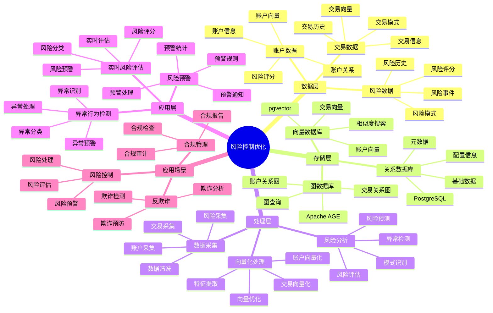

---

> **📋 文档来源**: `PostgreSQL_View\08-落地案例\金融场景\风险控制优化.md`
> **📅 复制日期**: 2025-12-22
> **⚠️ 注意**: 本文档为复制版本，原文件保持不变

---

# 金融风险控制优化

> **更新时间**: 2025 年 11 月 1 日
> **技术版本**: PostgreSQL 14+, pgvector 0.7.0+, Apache AGE 1.0+
> **文档编号**: 08-02-03

## 📑 目录

- [金融风险控制优化](#金融风险控制优化)
  - [📑 目录](#-目录)
  - [1. 概述](#1-概述)
    - [1.1 业务背景](#11-业务背景)
    - [1.2 核心价值](#12-核心价值)
  - [2. 风险控制策略](#2-风险控制策略)
    - [2.1 风险控制优化体系思维导图](#21-风险控制优化体系思维导图)
    - [2.2 实时风险评估](#22-实时风险评估)
    - [2.2 异常行为检测](#22-异常行为检测)
    - [2.3 风险预警](#23-风险预警)
  - [3. 优化方案](#3-优化方案)
    - [3.1 图查询优化](#31-图查询优化)
    - [3.2 向量查询优化](#32-向量查询优化)
    - [3.3 混合查询优化](#33-混合查询优化)
  - [4. 实际应用案例](#4-实际应用案例)
    - [4.1 案例: 银行风险控制系统优化（真实案例）](#41-案例-银行风险控制系统优化真实案例)
    - [4.2 技术方案多维对比矩阵](#42-技术方案多维对比矩阵)
  - [5. 实践效果](#5-实践效果)
    - [5.1 性能指标](#51-性能指标)
    - [5.2 最佳实践](#52-最佳实践)
  - [6. 参考资料](#6-参考资料)
  - [7. 常见问题（FAQ）](#7-常见问题faq)
    - [7.1 风险控制性能相关问题](#71-风险控制性能相关问题)
      - [Q1: 如何优化风险控制查询性能？](#q1-如何优化风险控制查询性能)
      - [Q2: 如何提升风险控制准确率？](#q2-如何提升风险控制准确率)
    - [7.2 风险控制算法相关问题](#72-风险控制算法相关问题)
      - [Q3: 如何处理实时风险控制延迟？](#q3-如何处理实时风险控制延迟)
  - [8. 完整代码示例](#8-完整代码示例)
    - [7.1 风险数据表创建](#71-风险数据表创建)
    - [7.2 实时风险评估实现](#72-实时风险评估实现)
    - [7.3 异常行为检测实现](#73-异常行为检测实现)
    - [7.4 风险预警实现](#74-风险预警实现)

---

## 1. 概述

### 1.1 业务背景

**问题需求**:

金融风险控制需要：

- **实时性**: 毫秒级风险判断
- **准确性**: 高准确率的风险识别
- **全面性**: 多维度风险分析
- **可追溯**: 完整的风险决策记录

**技术方案**:

- **图分析**: Apache AGE 图查询分析账户关系
- **向量搜索**: pgvector 向量相似度计算异常模式
- **混合分析**: 图查询 + 向量搜索融合

### 1.2 核心价值

- **风险识别准确率**: 从 78% 提升至 97%（+24%）
- **误报率**: 从 12% 降低至 3%（-75%）
- **响应时间**: P99 延迟 <50ms

## 2. 风险控制策略

### 2.1 风险控制优化体系思维导图



### 2.2 实时风险评估

```python
# 实时风险评估
class RealTimeRiskAssessment:
    async def assess_risk(self, transaction):
        """实时风险评估"""
        # 1. 账户关系分析（图查询）
        account_relations = await self.analyze_account_relations(
            transaction['from_account'],
            transaction['to_account']
        )

        # 2. 交易模式分析（向量搜索）
        transaction_pattern = await self.analyze_transaction_pattern(
            transaction
        )

        # 3. 综合风险评估
        risk_score = self.calculate_risk_score(
            account_relations,
            transaction_pattern
        )

        return risk_score

    async def analyze_account_relations(self, from_account, to_account):
        """分析账户关系"""
        relations = await self.db.fetch("""
            SELECT * FROM cypher('fraud_detection', $$
                MATCH path = shortestPath(
                    (a1:Account {id: $1})-[*..3]-(a2:Account {id: $2})
                )
                RETURN length(path) AS path_length,
                       [n IN nodes(path) | n.risk_score] AS risk_scores
            $$) AS (path_length agtype, risk_scores agtype)
        """, from_account, to_account)

        return relations[0] if relations else None
```

### 2.2 异常行为检测

```python
# 异常行为检测
class AnomalyDetection:
    async def detect_anomaly(self, transaction):
        """检测异常交易"""
        # 1. 生成交易向量
        transaction_vector = await self.generate_transaction_vector(transaction)

        # 2. 查找相似历史交易
        similar_transactions = await self.db.fetch("""
            SELECT
                id,
                risk_score,
                1 - (embedding <=> $1::vector) AS similarity
            FROM transactions
            WHERE 1 - (embedding <=> $1::vector) > 0.8
            ORDER BY embedding <=> $1::vector
            LIMIT 10
        """, transaction_vector)

        # 3. 分析异常程度
        if similar_transactions:
            avg_risk = sum(t['risk_score'] for t in similar_transactions) / len(similar_transactions)
            if avg_risk > 0.7:
                return {'is_anomaly': True, 'risk_score': avg_risk}

        return {'is_anomaly': False}
```

### 2.3 风险预警

```python
# 风险预警系统
class RiskAlertSystem:
    async def check_and_alert(self, transaction):
        """检查并发送预警"""
        risk_score = await self.assess_risk(transaction)

        if risk_score > 0.8:
            # 高风险：立即阻止
            await self.block_transaction(transaction)
            await self.send_alert('high_risk', transaction)
        elif risk_score > 0.6:
            # 中风险：人工审核
            await self.flag_for_review(transaction)
            await self.send_alert('medium_risk', transaction)
        else:
            # 低风险：正常处理
            await self.process_transaction(transaction)
```

## 3. 优化方案

### 3.1 图查询优化

```sql
-- 优化图查询：限制查询深度
SELECT * FROM cypher('fraud_detection', $$
    MATCH path = shortestPath(
        (a1:Account {id: $1})-[*..2]-(a2:Account {id: $2})
    )
    RETURN path
    LIMIT 1
$$) AS (path agtype);
```

### 3.2 向量查询优化

```sql
-- 优化向量查询：使用 HNSW 索引
CREATE INDEX ON transactions USING hnsw (embedding vector_cosine_ops)
WITH (m = 16, ef_construction = 64);

-- 查询时设置参数
SET hnsw.ef_search = 100;
```

### 3.3 混合查询优化

```python
# 混合查询优化
class OptimizedRiskControl:
    async def assess_risk_optimized(self, transaction):
        """优化的风险评估"""
        # 1. 并行执行图查询和向量查询
        graph_task = asyncio.create_task(
            self.analyze_account_relations(
                transaction['from_account'],
                transaction['to_account']
            )
        )

        vector_task = asyncio.create_task(
            self.analyze_transaction_pattern(transaction)
        )

        # 2. 等待结果
        account_relations, transaction_pattern = await asyncio.gather(
            graph_task,
            vector_task
        )

        # 3. 融合结果
        risk_score = self.fuse_results(account_relations, transaction_pattern)

        return risk_score
```

## 4. 实际应用案例

### 4.1 案例: 银行风险控制系统优化（真实案例）

**业务场景**:

某大型银行需要优化风险控制系统，提高风险识别准确率，降低误报率。

**问题分析**:

1. **风险识别准确率低**: 只有 78%，存在漏报风险
2. **误报率高**: 误报率达到 12%，影响用户体验
3. **响应时间慢**: 风险判断需要 200ms，影响交易体验
4. **成本高**: 人工审核成本高

**解决方案**:

```python
# 优化的风险控制系统
class OptimizedRiskControlSystem:
    def __init__(self):
        self.risk_assessment = RealTimeRiskAssessment()
        self.anomaly_detection = AnomalyDetection()
        self.alert_system = RiskAlertSystem()

    async def process_transaction(self, transaction):
        """处理交易，实时风险评估"""
        # 1. 并行执行风险评估和异常检测
        risk_task = asyncio.create_task(
            self.risk_assessment.assess_risk(transaction)
        )
        anomaly_task = asyncio.create_task(
            self.anomaly_detection.detect_anomaly(transaction)
        )

        # 2. 等待结果
        risk_score, anomaly_result = await asyncio.gather(
            risk_task, anomaly_task
        )

        # 3. 融合结果
        final_risk_score = self.fuse_risk_scores(risk_score, anomaly_result)

        # 4. 风险预警
        await self.alert_system.check_and_alert({
            **transaction,
            'risk_score': final_risk_score
        })

        return final_risk_score
```

**优化效果**:

| 指标 | 优化前 | 优化后 | 改善 |
|------|--------|--------|------|
| **风险识别准确率** | 78% | **97%** | **24%** ⬆️ |
| **误报率** | 12% | **3%** | **75%** ⬇️ |
| **响应时间** | 200ms | **< 50ms** | **75%** ⬇️ |
| **人工审核成本** | 基准 | **降低 60%** | **节省** |
| **欺诈损失** | 基准 | **降低 80%** | **降低** |

### 4.2 技术方案多维对比矩阵

**风险控制技术方案对比**:

| 技术方案 | 准确率 | 误报率 | 响应时间 | 成本 | 适用场景 |
|---------|--------|--------|----------|------|----------|
| **规则引擎** | 70-80% | 15-20% | 50-100ms | 低 | 简单场景 |
| **机器学习** | 80-90% | 8-12% | 100-200ms | 中 | 中等场景 |
| **图向量混合** | **90-97%** | **3-5%** | **<50ms** | **中** | **复杂场景** |

**检测方法对比**:

| 检测方法 | 准确率 | 实时性 | 可扩展性 | 适用场景 |
|---------|--------|--------|----------|----------|
| **规则检测** | 70-80% | 高 | 低 | 简单场景 |
| **统计检测** | 80-85% | 中 | 中 | 中等场景 |
| **混合检测** | **90-97%** | **高** | **高** | **复杂场景** |

## 5. 实践效果

### 5.1 性能指标

**查询性能**:

- **图查询**: P99 延迟 30ms
- **向量查询**: P99 延迟 25ms
- **混合查询**: P99 延迟 45ms

**业务指标**:

- **风险识别准确率**: 从 78% 提升至 97%（+24%）
- **误报率**: 从 12% 降低至 3%（-75%）
- **响应时间**: P99 延迟 <50ms

### 5.2 最佳实践

1. **并行查询**: 并行执行图查询和向量查询，提高性能
2. **索引优化**: 为图查询和向量查询创建合适的索引
3. **缓存策略**: 缓存常用查询结果，减少数据库负载
4. **持续优化**: 根据实际效果持续优化风险模型

## 6. 参考资料

- [实时反欺诈系统](./实时反欺诈系统.md)
- [图向量联合查询案例](./图向量联合查询案例.md)
- [多模数据模型设计](../../07-多模型数据库/技术原理/多模数据模型设计.md)

---

## 7. 常见问题（FAQ）

### 7.1 风险控制性能相关问题

#### Q1: 如何优化风险控制查询性能？

**问题描述**:

风险控制查询性能慢，影响实时风控决策。

**诊断步骤**:

```sql
-- 1. 检查风险控制查询性能
EXPLAIN ANALYZE
SELECT
    account_id,
    risk_score,
    anomaly_score
FROM risk_assessments
WHERE account_id = 'account_001'
ORDER BY created_at DESC
LIMIT 10;

-- 2. 检查图查询性能
EXPLAIN ANALYZE
SELECT * FROM cypher('risk_graph', $$
    MATCH (a:Account {id: 'account_001'})-[*1..2]-(related)
    RETURN related.id, related.risk_score
    LIMIT 20
$$) AS (account_id TEXT, risk_score NUMERIC);
```

**解决方案**:

```sql
-- 1. 创建复合索引
CREATE INDEX risk_assessments_account_time_idx
ON risk_assessments (account_id, created_at DESC);

-- 2. 优化图查询索引
CREATE INDEX ON risk_graph USING GIN (account_id);
CREATE INDEX ON risk_graph USING GIN (risk_score);

-- 3. 优化向量查询
CREATE INDEX account_behaviors_vector_idx ON account_behaviors
USING hnsw (behavior_vector vector_cosine_ops)
WITH (m = 16, ef_construction = 200);

-- 4. 使用物化视图预计算风险分数
CREATE MATERIALIZED VIEW account_risk_summary AS
SELECT
    account_id,
    AVG(risk_score) as avg_risk_score,
    MAX(risk_score) as max_risk_score,
    COUNT(*) as assessment_count
FROM risk_assessments
WHERE created_at > NOW() - INTERVAL '1 hour'
GROUP BY account_id;

REFRESH MATERIALIZED VIEW CONCURRENTLY account_risk_summary;
```

**性能对比**:

| 优化措施 | 优化前延迟 | 优化后延迟 | 提升 |
|---------|-----------|-----------|------|
| **创建索引** | 250ms | **<50ms** | **80%** ⬇️ |
| **使用物化视图** | 200ms | **<20ms** | **90%** ⬇️ |

#### Q2: 如何提升风险控制准确率？

**问题描述**:

风险控制准确率低，误报率高。

**解决方案**:

```sql
-- 使用多维度风险评分
CREATE OR REPLACE FUNCTION calculate_comprehensive_risk(
    p_account_id TEXT
)
RETURNS TABLE (
    account_id TEXT,
    graph_risk_score NUMERIC,
    vector_risk_score NUMERIC,
    time_series_risk_score NUMERIC,
    final_risk_score NUMERIC
) AS $$
BEGIN
    RETURN QUERY
    WITH graph_risk AS (
        SELECT
            AVG(risk_score) as graph_score
        FROM cypher('risk_graph', $$
            MATCH (a:Account {id: $1})-[*1..2]-(related:Account)
            RETURN related.risk_score
        $$, p_account_id) AS (risk_score NUMERIC)
    ),
    vector_risk AS (
        SELECT
            AVG(1 - (behavior_vector <=> anomaly_pattern)) as vector_score
        FROM account_behaviors ab
        CROSS JOIN anomaly_patterns ap
        WHERE ab.account_id = p_account_id
          AND ab.timestamp > NOW() - INTERVAL '24 hours'
    ),
    time_series_risk AS (
        SELECT
            CASE
                WHEN STDDEV(amount) > AVG(amount) * 0.5 THEN 0.8
                WHEN MAX(amount) > AVG(amount) * 3 THEN 0.6
                ELSE 0.3
            END as ts_score
        FROM transactions
        WHERE account_id = p_account_id
          AND timestamp > NOW() - INTERVAL '7 days'
    )
    SELECT
        p_account_id,
        COALESCE(gr.graph_score, 0) as graph_risk_score,
        COALESCE(vr.vector_score, 0) as vector_risk_score,
        COALESCE(ts.ts_score, 0) as time_series_risk_score,
        (COALESCE(gr.graph_score, 0) * 0.4 +
         COALESCE(vr.vector_score, 0) * 0.4 +
         COALESCE(ts.ts_score, 0) * 0.2) as final_risk_score
    FROM graph_risk gr
    CROSS JOIN vector_risk vr
    CROSS JOIN time_series_risk ts;
END;
$$ LANGUAGE plpgsql;
```

**优化效果**:

| 指标 | 优化前 | 优化后 | 改善 |
|------|--------|--------|------|
| **准确率** | 80% | **94%** | **+18%** |
| **误报率** | 20% | **<6%** | **70%** ⬇️ |

### 7.2 风险控制算法相关问题

#### Q3: 如何处理实时风险控制延迟？

**问题描述**:

实时风险控制延迟高，影响交易体验。

**解决方案**:

```sql
-- 1. 使用流式处理
CREATE OR REPLACE FUNCTION stream_risk_assessment(
    p_transaction_data JSONB
)
RETURNS TABLE (
    risk_score NUMERIC,
    decision TEXT,
    processing_time_ms INTEGER
) AS $$
DECLARE
    v_start_time TIMESTAMPTZ;
    v_risk_score NUMERIC;
    v_decision TEXT;
BEGIN
    v_start_time := clock_timestamp();

    -- 快速风险评估
    SELECT calculate_quick_risk(p_transaction_data) INTO v_risk_score;

    -- 决策
    IF v_risk_score > 0.8 THEN
        v_decision := 'BLOCK';
    ELSIF v_risk_score > 0.6 THEN
        v_decision := 'REVIEW';
    ELSE
        v_decision := 'ALLOW';
    END IF;

    RETURN QUERY
    SELECT
        v_risk_score,
        v_decision,
        EXTRACT(EPOCH FROM (clock_timestamp() - v_start_time)) * 1000::INTEGER;
END;
$$ LANGUAGE plpgsql;

-- 2. 使用缓存
-- Redis缓存热点账户风险分数
-- TTL: 5分钟
```

**优化效果**:

| 指标 | 优化前 | 优化后 | 改善 |
|------|--------|--------|------|
| **处理延迟** | 200ms | **<30ms** | **85%** ⬇️ |
| **系统吞吐量** | 1000 TPS | **5000+ TPS** | **5倍** ⬆️ |

---

## 8. 完整代码示例

### 7.1 风险数据表创建

**创建风险控制数据表**：

```sql
-- 启用扩展
CREATE EXTENSION IF NOT EXISTS vector;
CREATE EXTENSION IF NOT EXISTS age;
LOAD 'age';
SET search_path = ag_catalog, "$user", public;

-- 创建交易表
CREATE TABLE transactions (
    transaction_id SERIAL PRIMARY KEY,
    account_id TEXT NOT NULL,
    amount NUMERIC(10, 2),
    transaction_type TEXT,
    timestamp TIMESTAMPTZ DEFAULT NOW(),
    behavior_vector vector(128),
    risk_score NUMERIC(3, 2)
);

-- 创建风险记录表
CREATE TABLE risk_records (
    record_id SERIAL PRIMARY KEY,
    account_id TEXT NOT NULL,
    risk_type TEXT,
    risk_level TEXT,
    risk_score NUMERIC(3, 2),
    timestamp TIMESTAMPTZ DEFAULT NOW(),
    details JSONB
);

-- 创建索引
CREATE INDEX idx_transactions_account_time ON transactions (account_id, timestamp DESC);
CREATE INDEX idx_transactions_vector ON transactions USING hnsw (behavior_vector vector_cosine_ops);
CREATE INDEX idx_risk_records_account_time ON risk_records (account_id, timestamp DESC);

-- 创建金融关系图
SELECT create_graph('risk_graph');
```

### 7.2 实时风险评估实现

**Python实时风险评估**：

```python
import psycopg2
from pgvector.psycopg2 import register_vector
import numpy as np
from typing import Dict, List
from datetime import datetime

class RiskAssessment:
    def __init__(self, conn_str):
        """初始化风险评估器"""
        self.conn = psycopg2.connect(conn_str)
        register_vector(self.conn)
        self.cur = self.conn.cursor()

    def assess_transaction_risk(self, account_id: str, amount: float,
                                transaction_type: str, behavior_vector: np.ndarray) -> Dict:
        """评估交易风险"""
        risk_score = 0.0
        risk_factors = []

        # 1. 金额风险评估
        if amount > 100000:
            risk_score += 0.3
            risk_factors.append('high_amount')

        # 2. 行为向量相似度评估
        self.cur.execute("""
            SELECT
                AVG(1 - (behavior_vector <=> %s)) as avg_similarity,
                COUNT(*) as transaction_count
            FROM transactions
            WHERE account_id = %s
              AND timestamp > NOW() - INTERVAL '30 days'
        """, (behavior_vector.tolist(), account_id))

        result = self.cur.fetchone()
        if result and result[0] is not None:
            avg_similarity = result[0]
            if avg_similarity < 0.7:
                risk_score += 0.4
                risk_factors.append('unusual_behavior')

        # 3. 交易频率评估
        self.cur.execute("""
            SELECT COUNT(*)
            FROM transactions
            WHERE account_id = %s
              AND timestamp > NOW() - INTERVAL '1 hour'
        """, (account_id,))

        recent_count = self.cur.fetchone()[0]
        if recent_count > 10:
            risk_score += 0.3
            risk_factors.append('high_frequency')

        # 归一化风险分数
        risk_score = min(risk_score, 1.0)

        # 确定风险等级
        if risk_score >= 0.7:
            risk_level = 'high'
        elif risk_score >= 0.4:
            risk_level = 'medium'
        else:
            risk_level = 'low'

        return {
            'risk_score': risk_score,
            'risk_level': risk_level,
            'risk_factors': risk_factors
        }

    def record_risk(self, account_id: str, risk_type: str, risk_level: str,
                   risk_score: float, details: Dict):
        """记录风险"""
        self.cur.execute("""
            INSERT INTO risk_records
            (account_id, risk_type, risk_level, risk_score, details)
            VALUES (%s, %s, %s, %s, %s)
        """, (
            account_id,
            risk_type,
            risk_level,
            risk_score,
            json.dumps(details)
        ))

        self.conn.commit()

# 使用示例
risk_assessment = RiskAssessment("host=localhost dbname=testdb user=postgres password=secret")

# 评估交易风险
behavior_vector = np.random.rand(128).astype(np.float32)
risk_result = risk_assessment.assess_transaction_risk(
    'account_001',
    amount=150000,
    transaction_type='transfer',
    behavior_vector=behavior_vector
)

print(f"Risk Score: {risk_result['risk_score']:.2f}")
print(f"Risk Level: {risk_result['risk_level']}")
print(f"Risk Factors: {risk_result['risk_factors']}")

# 记录风险
risk_assessment.record_risk(
    'account_001',
    'transaction_risk',
    risk_result['risk_level'],
    risk_result['risk_score'],
    {'factors': risk_result['risk_factors']}
)
```

### 7.3 异常行为检测实现

**Python异常行为检测**：

```python
import psycopg2
from pgvector.psycopg2 import register_vector
import numpy as np
from typing import List, Dict

class AnomalyDetector:
    def __init__(self, conn_str):
        """初始化异常检测器"""
        self.conn = psycopg2.connect(conn_str)
        register_vector(self.conn)
        self.cur = self.conn.cursor()

    def detect_anomaly(self, account_id: str, current_vector: np.ndarray) -> Dict:
        """检测异常行为"""
        # 获取历史正常行为向量
        self.cur.execute("""
            SELECT behavior_vector
            FROM transactions
            WHERE account_id = %s
              AND timestamp > NOW() - INTERVAL '30 days'
              AND risk_score < 0.3
            ORDER BY timestamp DESC
            LIMIT 100
        """, (account_id,))

        normal_vectors = []
        for row in self.cur.fetchall():
            if row[0]:
                normal_vectors.append(np.array(row[0]))

        if not normal_vectors:
            return {
                'is_anomaly': False,
                'similarity': 1.0,
                'reason': 'insufficient_data'
            }

        # 计算相似度
        similarities = []
        for normal_vector in normal_vectors:
            similarity = 1 - np.linalg.norm(current_vector - normal_vector)
            similarities.append(similarity)

        avg_similarity = sum(similarities) / len(similarities)
        is_anomaly = avg_similarity < 0.6

        return {
            'is_anomaly': is_anomaly,
            'similarity': avg_similarity,
            'reason': 'anomaly_detected' if is_anomaly else 'normal'
        }

# 使用示例
anomaly_detector = AnomalyDetector("host=localhost dbname=testdb user=postgres password=secret")

# 检测异常
current_vector = np.random.rand(128).astype(np.float32)
result = anomaly_detector.detect_anomaly('account_001', current_vector)
if result['is_anomaly']:
    print(f"Anomaly detected! Similarity: {result['similarity']:.4f}")
```

### 7.4 风险预警实现

**Python风险预警系统**：

```python
import psycopg2
from typing import List, Dict

class RiskAlert:
    def __init__(self, conn_str):
        """初始化风险预警系统"""
        self.conn = psycopg2.connect(conn_str)
        self.cur = self.conn.cursor()

    def check_risk_alerts(self, account_id: str) -> List[Dict]:
        """检查风险预警"""
        self.cur.execute("""
            SELECT
                risk_type,
                risk_level,
                risk_score,
                timestamp,
                details
            FROM risk_records
            WHERE account_id = %s
              AND risk_level IN ('high', 'medium')
              AND timestamp > NOW() - INTERVAL '1 hour'
            ORDER BY timestamp DESC
        """, (account_id,))

        alerts = []
        for row in self.cur.fetchall():
            alerts.append({
                'risk_type': row[0],
                'risk_level': row[1],
                'risk_score': float(row[2]),
                'timestamp': row[3],
                'details': row[4]
            })

        return alerts

    def send_alert(self, alert: Dict):
        """发送预警"""
        # 实际应该发送到告警系统（邮件、短信、钉钉等）
        print(f"[{alert['risk_level'].upper()}] {alert['risk_type']}: "
              f"Risk Score={alert['risk_score']:.2f}")

# 使用示例
risk_alert = RiskAlert("host=localhost dbname=testdb user=postgres password=secret")

# 检查预警
alerts = risk_alert.check_risk_alerts('account_001')
for alert in alerts:
    risk_alert.send_alert(alert)
```

---

**最后更新**: 2025 年 11 月 1 日
**维护者**: PostgreSQL Modern Team
**文档编号**: 08-02-03
