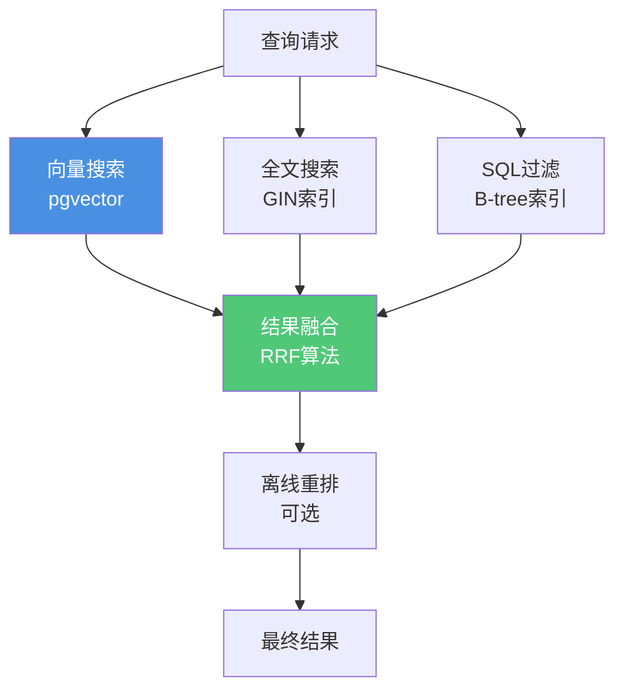

# 向量检索与混合查询-落地指南（Runbook）

> **文档编号**: RUNBOOK-04
> **最后更新**: 2025年1月
> **技术版本**: PostgreSQL 18+ / pgvector 0.8.0+
> **用途**: PostgreSQL向量检索与混合查询生产落地指南

## 📑 目录

- [向量检索与混合查询-落地指南（Runbook）](#向量检索与混合查询-落地指南runbook)
  - [📑 目录](#-目录)
  - [1. 目标与范围](#1-目标与范围)
    - [1.1 目标](#11-目标)
    - [1.2 架构设计](#12-架构设计)
  - [2. 前置条件](#2-前置条件)
    - [2.1 环境要求](#21-环境要求)
    - [2.2 扩展安装](#22-扩展安装)
    - [2.3 数据准备](#23-数据准备)
  - [3. 部署步骤](#3-部署步骤)
    - [3.1 创建向量索引](#31-创建向量索引)
    - [3.2 在线查询实现](#32-在线查询实现)
    - [3.3 离线重排（可选）](#33-离线重排可选)
  - [4. 运行参数优化](#4-运行参数优化)
    - [4.1 查询参数](#41-查询参数)
    - [4.2 内存参数](#42-内存参数)
    - [4.3 并发控制](#43-并发控制)
  - [5. 性能验证](#5-性能验证)
    - [5.1 性能指标](#51-性能指标)
    - [5.2 性能测试](#52-性能测试)
    - [5.3 性能监控](#53-性能监控)
  - [6. 故障诊断](#6-故障诊断)
    - [6.1 常见问题](#61-常见问题)
  - [7. 最佳实践](#7-最佳实践)
    - [7.1 索引选择](#71-索引选择)
    - [7.2 查询优化](#72-查询优化)
    - [7.3 性能调优](#73-性能调优)

---

## 1. 目标与范围

### 1.1 目标

**核心目标**：

- ✅ 建立"向量召回 + 结构化过滤 + 全文权重"的混合检索流水线
- ✅ 支持在线查询与离线重排
- ✅ 实现高性能向量检索（<100ms P95延迟）
- ✅ 支持大规模向量数据（1M+向量）

**业务场景**：

- 语义搜索
- 推荐系统
- 相似内容检索
- RAG系统

### 1.2 架构设计

**混合检索架构**：



---

## 2. 前置条件

### 2.1 环境要求

**PostgreSQL版本**：

- PostgreSQL 15+（推荐PostgreSQL 18）
- pgvector扩展 0.8.0+

**硬件要求**：

- CPU: 8核心+
- 内存: 32GB+（用于向量索引）
- 存储: NVMe SSD（高性能I/O）

### 2.2 扩展安装

**安装pgvector**：

```bash
# 1. 安装依赖
sudo apt-get install -y build-essential git postgresql-server-dev-18

# 2. 克隆pgvector仓库
git clone --branch v0.8.0 https://github.com/pgvector/pgvector.git
cd pgvector

# 3. 编译安装
make
sudo make install
```

**启用扩展**：

```sql
-- 在数据库中启用pgvector（带错误处理）
DO $$
BEGIN
    BEGIN
        IF NOT EXISTS (SELECT 1 FROM pg_extension WHERE extname = 'vector') THEN
            CREATE EXTENSION IF NOT EXISTS vector;
            RAISE NOTICE '扩展 vector 创建成功';
        ELSE
            RAISE NOTICE '扩展 vector 已存在';
        END IF;
    EXCEPTION
        WHEN duplicate_object THEN
            RAISE NOTICE '扩展已存在';
        WHEN OTHERS THEN
            RAISE WARNING '创建扩展失败: %', SQLERRM;
            RAISE;
    END;
END $$;

-- 验证安装（带性能测试）
EXPLAIN (ANALYZE, BUFFERS, TIMING)
SELECT * FROM pg_extension WHERE extname = 'vector';

EXPLAIN (ANALYZE, BUFFERS, TIMING)
SELECT extversion FROM pg_extension WHERE extname = 'vector';
```

### 2.3 数据准备

**创建向量表**：

```sql
-- 创建文档表（带错误处理）
DO $$
BEGIN
    BEGIN
        IF NOT EXISTS (SELECT 1 FROM information_schema.tables WHERE table_name = 'documents') THEN
            CREATE TABLE documents (
                id SERIAL PRIMARY KEY,
                content TEXT NOT NULL,
                embedding vector(1536),  -- OpenAI text-embedding-3-small
                category_id INT,
                created_at TIMESTAMPTZ DEFAULT NOW(),
                metadata JSONB
            );
            RAISE NOTICE '表 documents 创建成功';
        ELSE
            RAISE NOTICE '表 documents 已存在';
        END IF;
    EXCEPTION
        WHEN duplicate_table THEN
            RAISE NOTICE '表已存在';
        WHEN undefined_object THEN
            RAISE WARNING 'VECTOR类型不存在，请先安装pgvector扩展';
        WHEN OTHERS THEN
            RAISE WARNING '创建表失败: %', SQLERRM;
            RAISE;
    END;
END $$;

-- 创建全文搜索索引（带错误处理）
DO $$
BEGIN
    BEGIN
        IF EXISTS (SELECT 1 FROM information_schema.tables WHERE table_name = 'documents') THEN
            IF NOT EXISTS (
                SELECT 1 FROM pg_indexes
                WHERE tablename = 'documents' AND indexname LIKE '%to_tsvector%'
            ) THEN
                CREATE INDEX ON documents
                USING GIN(to_tsvector('english', content));
                RAISE NOTICE '全文搜索索引创建成功';
            ELSE
                RAISE NOTICE '全文搜索索引已存在';
            END IF;
        END IF;
    EXCEPTION
        WHEN duplicate_table THEN
            RAISE NOTICE '索引已存在';
        WHEN OTHERS THEN
            RAISE WARNING '创建全文搜索索引失败: %', SQLERRM;
            RAISE;
    END;
END $$;

-- 创建B-tree索引（结构化过滤）（带错误处理）
DO $$
BEGIN
    BEGIN
        IF EXISTS (SELECT 1 FROM information_schema.tables WHERE table_name = 'documents') THEN
            IF NOT EXISTS (
                SELECT 1 FROM pg_indexes
                WHERE tablename = 'documents' AND indexname LIKE '%category_id%'
            ) THEN
                CREATE INDEX ON documents (category_id, created_at);
                RAISE NOTICE 'B-tree索引创建成功';
            ELSE
                RAISE NOTICE 'B-tree索引已存在';
            END IF;
        END IF;
    EXCEPTION
        WHEN duplicate_table THEN
            RAISE NOTICE '索引已存在';
        WHEN OTHERS THEN
            RAISE WARNING '创建B-tree索引失败: %', SQLERRM;
            RAISE;
    END;
END $$;
```

---

## 3. 部署步骤

### 3.1 创建向量索引

**HNSW索引（推荐）**：

```sql
-- 创建HNSW索引（带错误处理）
DO $$
BEGIN
    BEGIN
        IF EXISTS (SELECT 1 FROM information_schema.tables WHERE table_name = 'documents') AND
           EXISTS (SELECT 1 FROM pg_extension WHERE extname = 'vector') THEN
            IF NOT EXISTS (
                SELECT 1 FROM pg_indexes
                WHERE tablename = 'documents' AND indexname = 'docs_hnsw_idx'
            ) THEN
                CREATE INDEX CONCURRENTLY docs_hnsw_idx
                ON documents
                USING hnsw(embedding vector_cosine_ops)
                WITH (
                    m = 32,              -- 每个节点的连接数（16-64）
                    ef_construction = 128  -- 构建时的候选数（64-200）
                );
                RAISE NOTICE 'HNSW索引创建成功';
            ELSE
                RAISE NOTICE 'HNSW索引已存在';
            END IF;
        ELSE
            RAISE NOTICE '表不存在或pgvector扩展未安装，跳过HNSW索引创建';
        END IF;
    EXCEPTION
        WHEN duplicate_table THEN
            RAISE NOTICE '索引已存在';
        WHEN OTHERS THEN
            RAISE WARNING '创建HNSW索引失败: %', SQLERRM;
            RAISE;
    END;
END $$;

-- 验证索引（带性能测试）
EXPLAIN (ANALYZE, BUFFERS, TIMING)
SELECT
    indexname,
    indexdef
FROM pg_indexes
WHERE tablename = 'documents' AND indexname = 'docs_hnsw_idx';
```

**IVFFlat索引（大规模数据）**：

```sql
-- 创建IVFFlat索引（适用于>1M向量）（带错误处理）
DO $$
BEGIN
    BEGIN
        IF EXISTS (SELECT 1 FROM information_schema.tables WHERE table_name = 'documents') AND
           EXISTS (SELECT 1 FROM pg_extension WHERE extname = 'vector') THEN
            IF NOT EXISTS (
                SELECT 1 FROM pg_indexes
                WHERE tablename = 'documents' AND indexname = 'docs_ivfflat_idx'
            ) THEN
                -- 注意：IVFFlat需要先有数据才能创建
                -- 创建前需要ANALYZE
                ANALYZE documents;

                CREATE INDEX CONCURRENTLY docs_ivfflat_idx
                ON documents
                USING ivfflat(embedding vector_cosine_ops)
                WITH (
                    lists = 1000  -- lists = sqrt(rows) / 1000
                );
                RAISE NOTICE 'IVFFlat索引创建成功';
            ELSE
                RAISE NOTICE 'IVFFlat索引已存在';
            END IF;
        ELSE
            RAISE NOTICE '表不存在或pgvector扩展未安装，跳过IVFFlat索引创建';
        END IF;
    EXCEPTION
        WHEN duplicate_table THEN
            RAISE NOTICE '索引已存在';
        WHEN OTHERS THEN
            RAISE WARNING '创建IVFFlat索引失败: %', SQLERRM;
            RAISE;
    END;
END $$;
```

### 3.2 在线查询实现

**基础向量查询**：

```sql
-- 1. 准备查询向量（带错误处理）
-- 2. 向量相似度搜索（带性能测试）
EXPLAIN (ANALYZE, BUFFERS, TIMING)
WITH query_vec AS (
    SELECT embedding('text-embedding-3-small', 'user query')::vector(1536) AS vec
)
SELECT
    id,
    content,
    1 - (embedding <=> query_vec.vec) AS similarity
FROM documents, query_vec
WHERE embedding <=> query_vec.vec < 0.3  -- 相似度阈值
ORDER BY embedding <=> query_vec.vec
LIMIT 50;
```

**结构化过滤 + 向量搜索**：

```sql
-- 混合查询：结构化过滤 + 向量搜索（带性能测试）
EXPLAIN (ANALYZE, BUFFERS, TIMING)
WITH query_vec AS (
    SELECT embedding('text-embedding-3-small', 'user query')::vector(1536) AS vec
)
SELECT
    id,
    content,
    1 - (embedding <=> query_vec.vec) AS similarity
FROM documents, query_vec
WHERE category_id = 1                    -- 结构化过滤
  AND created_at >= NOW() - INTERVAL '7 days'  -- 时间过滤
  AND embedding <=> query_vec.vec < 0.3  -- 向量过滤
ORDER BY embedding <=> query_vec.vec
LIMIT 50;
```

**全文搜索 + 向量融合**：

```sql
-- 全文搜索 + 向量融合（RRF算法）（带性能测试）
EXPLAIN (ANALYZE, BUFFERS, TIMING)
WITH query_vec AS (
    SELECT embedding('text-embedding-3-small', 'user query')::vector(1536) AS vec
),
text_results AS (
    SELECT
        id,
        ts_rank(to_tsvector('english', content), plainto_tsquery('english', 'user query')) AS text_score
    FROM documents
    WHERE to_tsvector('english', content) @@ plainto_tsquery('english', 'user query')
    ORDER BY text_score DESC
    LIMIT 500
),
vector_results AS (
    SELECT
        id,
        1 - (embedding <=> query_vec.vec) AS vector_score
    FROM documents, query_vec
    WHERE embedding <=> query_vec.vec < 0.3
    ORDER BY embedding <=> query_vec.vec
    LIMIT 500
),
combined AS (
    SELECT
        COALESCE(v.id, t.id) AS id,
        COALESCE(v.vector_score, 0) * 0.6 + COALESCE(t.text_score, 0) * 0.4 AS combined_score
    FROM vector_results v
    FULL OUTER JOIN text_results t ON v.id = t.id
)
SELECT
    d.id,
    d.content,
    c.combined_score
FROM combined c
JOIN documents d ON c.id = d.id
ORDER BY c.combined_score DESC
LIMIT 50;
```

### 3.3 离线重排（可选）

**重排实现**：

```sql
-- 使用更复杂的模型进行重排（带错误处理）
CREATE OR REPLACE FUNCTION rerank_results(
    p_candidate_ids INT[],
    p_query_text TEXT
)
RETURNS TABLE(id INT, score DECIMAL) AS $$
DECLARE
    v_query_vec vector(1536);
BEGIN
    BEGIN
        -- 生成查询向量
        SELECT embedding('text-embedding-3-large', p_query_text)::vector(1536)
        INTO v_query_vec;

        IF v_query_vec IS NULL THEN
            RAISE EXCEPTION '无法生成查询向量';
        END IF;

        -- 重排
        RETURN QUERY
        SELECT
            d.id,
            1 - (d.embedding <=> v_query_vec) AS score
        FROM documents d
        WHERE d.id = ANY(p_candidate_ids)
        ORDER BY d.embedding <=> v_query_vec
        LIMIT 100;
    EXCEPTION
        WHEN OTHERS THEN
            RAISE WARNING '重排失败: %', SQLERRM;
            RAISE;
    END;
END;
$$ LANGUAGE plpgsql;
```

---

## 4. 运行参数优化

### 4.1 查询参数

**ef_search参数（HNSW）**：

```sql
-- 设置ef_search（查询时的候选数）（带错误处理）
DO $$
BEGIN
    BEGIN
        SET LOCAL hnsw.ef_search = 100;  -- 默认40，提高召回率
        RAISE NOTICE 'ef_search参数设置成功';
    EXCEPTION
        WHEN OTHERS THEN
            RAISE WARNING '设置ef_search参数失败: %', SQLERRM;
            RAISE;
    END;
END $$;

-- 查询（带性能测试）
EXPLAIN (ANALYZE, BUFFERS, TIMING)
SELECT * FROM documents
WHERE embedding <=> query_vec < 0.3
ORDER BY embedding <=> query_vec
LIMIT 10;
```

**probes参数（IVFFlat）**：

```sql
-- 设置probes（IVFFlat查询参数）（带错误处理）
DO $$
BEGIN
    BEGIN
        SET LOCAL ivfflat.probes = 10;  -- 默认1，提高召回率
        RAISE NOTICE 'probes参数设置成功';
    EXCEPTION
        WHEN OTHERS THEN
            RAISE WARNING '设置probes参数失败: %', SQLERRM;
            RAISE;
    END;
END $$;

-- 查询（带性能测试）
EXPLAIN (ANALYZE, BUFFERS, TIMING)
SELECT * FROM documents
WHERE embedding <=> query_vec < 0.3
ORDER BY embedding <=> query_vec
LIMIT 10;
```

**参数选择指南**：

| 参数 | 默认值 | 推荐范围 | 说明 |
|------|--------|---------|------|
| **hnsw.ef_search** | 40 | 40-200 | 越大查询越慢但召回率越高 |
| **ivfflat.probes** | 1 | 1-100 | 越大查询越慢但召回率越高 |

### 4.2 内存参数

**work_mem优化**：

```sql
-- 向量查询需要更多内存（带错误处理）
DO $$
BEGIN
    BEGIN
        SET work_mem = '64MB';  -- 默认4MB，向量查询建议64MB+
        RAISE NOTICE 'work_mem参数设置成功';
    EXCEPTION
        WHEN OTHERS THEN
            RAISE WARNING '设置work_mem参数失败: %', SQLERRM;
            RAISE;
    END;
END $$;

-- 会话级设置（带错误处理）
DO $$
BEGIN
    BEGIN
        IF EXISTS (SELECT 1 FROM pg_roles WHERE rolname = 'app_user') THEN
            ALTER ROLE app_user SET work_mem = '64MB';
            RAISE NOTICE 'app_user的work_mem参数设置成功';
        ELSE
            RAISE WARNING '角色 app_user 不存在，跳过设置';
        END IF;
    EXCEPTION
        WHEN insufficient_privilege THEN
            RAISE WARNING '权限不足，无法设置角色参数';
        WHEN OTHERS THEN
            RAISE WARNING '设置角色参数失败: %', SQLERRM;
            RAISE;
    END;
END $$;
```

**shared_buffers**：

```conf
# postgresql.conf
shared_buffers = 8GB  # 25% of RAM，向量索引需要更多缓存
```

### 4.3 并发控制

**连接池配置**：

```ini
# pgbouncer.ini
[databases]
ai_db = host=localhost port=5432 dbname=ai_db

[pgbouncer]
pool_mode = transaction
max_client_conn = 1000
default_pool_size = 25
reserve_pool_size = 5
```

---

## 5. 性能验证

### 5.1 性能指标

**关键指标**：

| 指标 | 目标值 | 测量方法 |
|------|--------|---------|
| **P50延迟** | <50ms | EXPLAIN ANALYZE |
| **P95延迟** | <100ms | EXPLAIN ANALYZE |
| **P99延迟** | <200ms | EXPLAIN ANALYZE |
| **召回率@10** | >0.9 | 与暴力搜索对比 |
| **QPS** | >1000 | 压力测试 |

### 5.2 性能测试

**基准测试**：

```sql
-- 1. 准备测试数据（带错误处理）
DO $$
BEGIN
    BEGIN
        IF EXISTS (SELECT 1 FROM information_schema.tables WHERE table_name = 'documents') THEN
            -- 注意：这里只是示例，实际使用时应该分批插入
            RAISE NOTICE '开始准备测试数据（示例：插入1000条记录）...';
            INSERT INTO documents (content, embedding)
            SELECT
                'Document ' || generate_series(1, 1000),
                (SELECT array_agg(random())::vector(1536) FROM generate_series(1, 1536))
            FROM generate_series(1, 1000);
            RAISE NOTICE '测试数据插入成功';
        ELSE
            RAISE WARNING '表 documents 不存在，跳过测试数据插入';
        END IF;
    EXCEPTION
        WHEN OTHERS THEN
            RAISE WARNING '插入测试数据失败: %', SQLERRM;
            RAISE;
    END;
END $$;

-- 2. 生成查询向量（带错误处理）
-- 3. 性能测试
EXPLAIN (ANALYZE, BUFFERS, VERBOSE, TIMING)
WITH query_vec AS (
    SELECT (SELECT array_agg(random())::vector(1536) FROM generate_series(1, 1536)) AS vec
)
SELECT id, content, embedding <=> query_vec.vec AS distance
FROM documents, query_vec
ORDER BY embedding <=> query_vec.vec
LIMIT 10;
```

**召回率测试**：

```sql
-- 1. 暴力搜索（真值）（带错误处理）
DO $$
BEGIN
    BEGIN
        DROP TABLE IF EXISTS ground_truth;
        CREATE TEMP TABLE ground_truth AS
        SELECT id, embedding <=> query_vec AS distance
        FROM documents, (SELECT query_vec) qv
        ORDER BY embedding <=> query_vec
        LIMIT 100;
        RAISE NOTICE 'ground_truth表创建成功';
    EXCEPTION
        WHEN OTHERS THEN
            RAISE WARNING '创建ground_truth表失败: %', SQLERRM;
            RAISE;
    END;
END $$;

-- 2. 索引搜索（带错误处理）
DO $$
BEGIN
    BEGIN
        DROP TABLE IF EXISTS index_results;
        CREATE TEMP TABLE index_results AS
        SELECT id, embedding <=> query_vec AS distance
        FROM documents, (SELECT query_vec) qv
        WHERE embedding <=> query_vec < 0.3
        ORDER BY embedding <=> query_vec
        LIMIT 100;
        RAISE NOTICE 'index_results表创建成功';
    EXCEPTION
        WHEN OTHERS THEN
            RAISE WARNING '创建index_results表失败: %', SQLERRM;
            RAISE;
    END;
END $$;
```

-- 3. 计算召回率
SELECT
    COUNT(*) FILTER (WHERE gt.id IS NOT NULL)::float / COUNT(*) AS recall_at_100
FROM index_results ir
LEFT JOIN ground_truth gt ON ir.id = gt.id;
```

### 5.3 性能监控

**监控查询**：

```sql
-- 1. 查询性能统计（带性能测试）
EXPLAIN (ANALYZE, BUFFERS, TIMING)
SELECT
    queryid,
    LEFT(query, 100) AS query_preview,
    calls,
    mean_exec_time,
    max_exec_time,
    stddev_exec_time
FROM pg_stat_statements
WHERE query LIKE '%embedding%'
ORDER BY total_exec_time DESC
LIMIT 10;

-- 2. 索引使用统计（带性能测试）
EXPLAIN (ANALYZE, BUFFERS, TIMING)
SELECT
    schemaname,
    tablename,
    indexname,
    idx_scan,
    idx_tup_read
FROM pg_stat_user_indexes
WHERE indexname LIKE '%hnsw%' OR indexname LIKE '%ivfflat%';
```

---

## 6. 故障诊断

### 6.1 常见问题

**问题1：查询慢**

**症状**：

- 查询延迟 > 500ms
- CPU使用率高

**诊断**：

```sql
-- 检查查询计划
EXPLAIN (ANALYZE, BUFFERS, VERBOSE)
SELECT * FROM documents
WHERE embedding <=> query_vec < 0.3
ORDER BY embedding <=> query_vec
LIMIT 10;

-- 检查索引使用
SELECT * FROM pg_stat_user_indexes
WHERE tablename = 'documents';
```

**解决**：

- 调整ef_search/probes参数
- 优化索引参数（m, ef_construction）
- 增加work_mem
- 使用连接池

**问题2：召回率低**

**症状**：

- 召回率 < 0.8
- 相关结果未返回

**诊断**：

```sql
-- 对比暴力搜索和索引搜索
-- 见性能验证章节
```

**解决**：

- 增加ef_search/probes参数
- 优化索引参数
- 调整相似度阈值

**问题3：内存溢出**

**症状**：

- 查询失败，内存不足
- OOM错误

**诊断**：

```sql
-- 检查work_mem使用（带错误处理）
DO $$
DECLARE
    work_mem_value text;
BEGIN
    BEGIN
        SHOW work_mem INTO work_mem_value;
        RAISE NOTICE '当前work_mem值: %', work_mem_value;
    EXCEPTION
        WHEN OTHERS THEN
            RAISE WARNING '获取work_mem值失败: %', SQLERRM;
            RAISE;
    END;
END $$;

-- 检查查询内存使用（带性能测试）
EXPLAIN (ANALYZE, BUFFERS, VERBOSE, TIMING)
SELECT * FROM documents
WHERE embedding <=> query_vec < 0.3
ORDER BY embedding <=> query_vec
LIMIT 10;
```

**解决**：

- 增加work_mem
- 减少LIMIT数量
- 分批查询

---

## 7. 最佳实践

### 7.1 索引选择

**索引选择指南**：

| 数据规模 | 推荐索引 | 参数配置 |
|---------|---------|---------|
| **<100K** | HNSW | m=16, ef_construction=64 |
| **100K-1M** | HNSW | m=32, ef_construction=128 |
| **>1M** | IVFFlat | lists=sqrt(rows)/1000 |

### 7.2 查询优化

**优化策略**：

- ✅ 先结构化过滤，再向量搜索
- ✅ 合理设置相似度阈值
- ✅ 使用LIMIT限制结果数
- ✅ 避免全表扫描

### 7.3 性能调优

**调优步骤**：

1. 建立性能基线
2. 识别瓶颈（CPU/内存/I/O）
3. 优化索引参数
4. 优化查询参数
5. 验证性能提升

---

**最后更新**: 2025年1月
**维护者**: PostgreSQL Modern Team
**文档编号**: RUNBOOK-04
