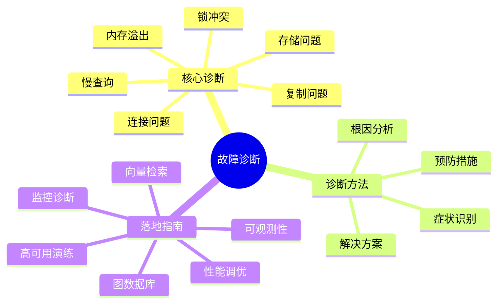
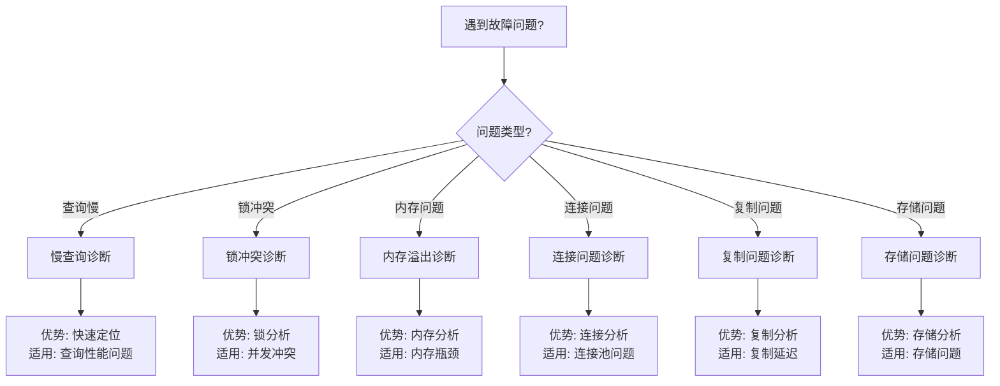

---

> **📋 文档来源**: `PostgreSQL\runbook\README.md`
> **📅 复制日期**: 2025-12-22
> **⚠️ 注意**: 本文档为复制版本，原文件保持不变

---

# 20-故障诊断案例

> **文档总数**: 18个诊断文档
> **覆盖类型**: 慢查询、锁冲突、内存溢出、连接问题、复制问题、存储问题等
> **版本覆盖**: PostgreSQL 18.x (推荐) ⭐ | 17.x (推荐) | 16.x (兼容)
> **最后更新**: 2025年1月

---

## 📊 知识体系思维导图

---

## 📊 故障诊断决策树

---

## 📊 故障类型对比矩阵

| 故障类型 | 频率 | 影响 | 诊断难度 | 解决难度 | 预防措施 |
|---------|------|------|---------|---------|---------|
| **慢查询** | ⭐⭐⭐⭐⭐ | ⭐⭐⭐⭐ | ⭐⭐ | ⭐⭐⭐ | ⭐⭐⭐⭐ |
| **锁冲突** | ⭐⭐⭐⭐ | ⭐⭐⭐⭐ | ⭐⭐⭐ | ⭐⭐⭐ | ⭐⭐⭐⭐ |
| **内存溢出** | ⭐⭐⭐ | ⭐⭐⭐⭐⭐ | ⭐⭐⭐ | ⭐⭐⭐⭐ | ⭐⭐⭐⭐ |
| **连接问题** | ⭐⭐⭐ | ⭐⭐⭐ | ⭐⭐ | ⭐⭐ | ⭐⭐⭐⭐⭐ |
| **复制问题** | ⭐⭐⭐ | ⭐⭐⭐⭐ | ⭐⭐⭐ | ⭐⭐⭐ | ⭐⭐⭐⭐ |
| **存储问题** | ⭐⭐ | ⭐⭐⭐⭐⭐ | ⭐⭐⭐⭐ | ⭐⭐⭐⭐ | ⭐⭐⭐⭐ |

---

## 📚 通用文档

- **[故障诊断通用模板](./故障诊断通用模板.md)** - 统一故障诊断文档格式和最佳实践

---

## 📋 诊断案例分类

### 核心诊断案例

1. **[01-慢查询诊断.md](./01-慢查询诊断.md)** - 慢查询问题诊断和解决
2. **[02-锁冲突诊断.md](./02-锁冲突诊断.md)** - 锁冲突问题诊断和解决
3. **[03-内存溢出诊断.md](./03-内存溢出诊断.md)** - 内存溢出问题诊断和解决
4. **[04-连接问题诊断.md](./04-连接问题诊断.md)** - 连接问题诊断
5. **[05-复制问题诊断.md](./05-复制问题诊断.md)** - 复制问题诊断
6. **[06-存储问题诊断.md](./06-存储问题诊断.md)** - 存储问题诊断

### 落地指南

- **[01-性能调优-变更闭环.md](./01-性能调优-变更闭环.md)** - 性能调优变更闭环流程
- **[02-监控与诊断-落地指南.md](./02-监控与诊断-落地指南.md)** - 监控与诊断落地指南
- **[03-集群与高可用-演练SOP.md](./03-集群与高可用-演练SOP.md)** - 集群与高可用演练SOP
- **[04-向量检索与混合查询-落地指南.md](./04-向量检索与混合查询-落地指南.md)** - 向量检索落地指南
- **[05-图数据库与Cypher-落地指南.md](./05-图数据库与Cypher-落地指南.md)** - 图数据库落地指南
- **[06-日志与可观测性-落地指南.md](./06-日志与可观测性-落地指南.md)** - 日志与可观测性落地指南

---

## 📊 诊断文档结构

所有诊断文档遵循 **[故障诊断通用模板](./故障诊断通用模板.md)** 的标准格式：

1. **症状描述** - 问题表现和错误信息
2. **诊断步骤** - 问题定位、根因分析、验证确认
3. **解决方案** - 立即措施和长期措施
4. **预防措施** - 监控告警和最佳实践

---

**最后更新**: 2025年1月
