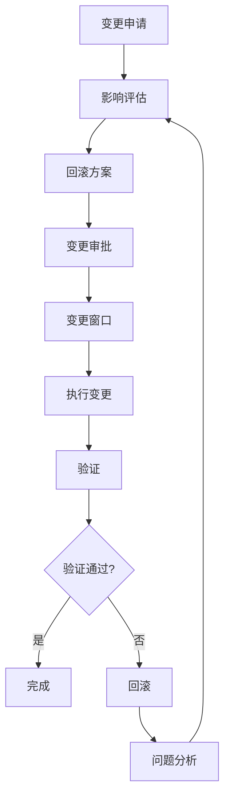

# Runbook：变更与回滚（PostgreSQL 18+）

> **文档编号**: RUNBOOK-变更回滚
> **最后更新**: 2025年1月
> **技术版本**: PostgreSQL 18+
> **用途**: PostgreSQL变更管理与回滚生产指南

## 📑 目录

- [Runbook：变更与回滚（PostgreSQL 18+）](#runbook变更与回滚postgresql-18)
  - [📑 目录](#-目录)
  - [1. 范围](#1-范围)
  - [2. 原则](#2-原则)
    - [2.1 核心原则](#21-核心原则)
    - [2.2 变更窗口](#22-变更窗口)
  - [3. 变更流程](#3-变更流程)
    - [3.1 变更流程](#31-变更流程)
    - [3.2 变更步骤](#32-变更步骤)
  - [4. 回滚策略](#4-回滚策略)
    - [4.1 参数回滚](#41-参数回滚)
    - [4.2 DDL回滚](#42-ddl回滚)
    - [4.3 索引回滚](#43-索引回滚)
  - [5. 检查清单](#5-检查清单)
    - [5.1 变更前检查](#51-变更前检查)
    - [5.2 变更中检查](#52-变更中检查)
    - [5.3 变更后检查](#53-变更后检查)
  - [6. 演练频率](#6-演练频率)
    - [6.1 演练计划](#61-演练计划)
    - [6.2 演练内容](#62-演练内容)
  - [7. 变更类型详解](#7-变更类型详解)
    - [7.1 参数变更](#71-参数变更)
    - [7.2 DDL变更](#72-ddl变更)
    - [7.3 版本升级](#73-版本升级)
  - [8. 最佳实践](#8-最佳实践)
    - [8.1 变更管理最佳实践](#81-变更管理最佳实践)
    - [8.2 回滚最佳实践](#82-回滚最佳实践)

---

## 1. 范围

**变更类型**：

| 变更类型 | 说明 | 风险等级 |
|---------|------|---------|
| **参数变更** | postgresql.conf参数调整 | 中 |
| **DDL变更** | 表结构、索引变更 | 高 |
| **索引变更** | 创建、重建、删除索引 | 中 |
| **分区变更** | 分区表结构调整 | 高 |
| **版本升级** | PostgreSQL主版本升级 | 高 |
| **扩展变更** | 扩展安装、升级 | 中 |

**变更范围**：

- 单实例变更
- 集群变更（主从）
- 多实例变更（分片）

---

## 2. 原则

### 2.1 核心原则

**变更原则**：

1. **蓝绿/金丝雀部署**：
   - 优先对读流量试点
   - 逐步扩大范围
   - 验证无问题后全量

2. **可回滚**：
   - 保留旧结构与数据路径
   - 影子索引/表
   - 一键回滚脚本

3. **可观测**：
   - 变更前后指标对比
   - 实时监控
   - 告警设置

### 2.2 变更窗口

**变更时间选择**：

- ✅ 业务低峰期
- ✅ 只读期
- ✅ 维护窗口
- ❌ 业务高峰期
- ❌ 重要活动期间

**变更通知**：

- 提前1周通知
- 变更前1小时提醒
- 变更后确认

---

## 3. 变更流程

### 3.1 变更流程

**标准变更流程**：



### 3.2 变更步骤

**步骤1：评审**（变更前1周）

**影响评估**：

- 影响范围分析
- 性能影响评估
- 业务影响评估

**回滚路径**：

- 回滚方案设计
- 回滚脚本准备
- 回滚测试

**验证计划**：

- 功能验证
- 性能验证
- 一致性验证

**步骤2：变更窗口**（变更执行）

**准备阶段**：

- 冻结长事务
- 通知相关人员
- 准备监控

**执行阶段**：

- 分批执行
- 幂等脚本
- 错误即停

**步骤3：验证**（变更后）

**功能验证**：

```sql
-- 验证功能正常
SELECT count(*) FROM critical_table;
SELECT * FROM critical_function();
```

**性能验证**：

```sql
-- 对比变更前后性能
EXPLAIN (ANALYZE, BUFFERS)
SELECT * FROM critical_table WHERE ...;
```

**一致性验证**：

```sql
-- 验证数据一致性
SELECT count(*) FROM table1;
SELECT count(*) FROM table2;
```

**步骤4：回滚**（如需要）

**回滚条件**：

- 功能异常
- 性能严重下降
- 数据不一致

**回滚步骤**：

- 执行回滚脚本
- 验证回滚结果
- 问题分析

---

## 4. 回滚策略

### 4.1 参数回滚

**参数变更**：

```sql
-- 1. 保存原配置
SELECT name, setting FROM pg_settings
WHERE name IN ('shared_buffers', 'work_mem', 'max_connections')
ORDER BY name;

-- 2. 变更参数
ALTER SYSTEM SET shared_buffers = '16GB';
SELECT pg_reload_conf();

-- 3. 验证
SHOW shared_buffers;

-- 4. 回滚（如需要）
ALTER SYSTEM SET shared_buffers = '8GB';
SELECT pg_reload_conf();
```

**回滚脚本**：

```bash
#!/bin/bash
# rollback_params.sh

# 恢复原配置
psql -c "ALTER SYSTEM SET shared_buffers = '8GB';"
psql -c "ALTER SYSTEM SET work_mem = '4MB';"
psql -c "SELECT pg_reload_conf();"

# 验证
psql -c "SHOW shared_buffers;"
psql -c "SHOW work_mem;"
```

### 4.2 DDL回滚

**DDL变更策略**：

```sql
-- 1. 创建新表（保留旧表）
CREATE TABLE documents_new (
    LIKE documents INCLUDING ALL,
    new_column TEXT
);

-- 2. 数据迁移
INSERT INTO documents_new
SELECT *, 'default_value' AS new_column
FROM documents;

-- 3. 切换表
BEGIN;
ALTER TABLE documents RENAME TO documents_old;
ALTER TABLE documents_new RENAME TO documents;
COMMIT;

-- 4. 回滚（如需要）
BEGIN;
ALTER TABLE documents RENAME TO documents_new;
ALTER TABLE documents_old RENAME TO documents;
COMMIT;
```

**视图桥接**：

```sql
-- 使用视图桥接新旧表
CREATE VIEW documents_view AS
SELECT
    id,
    content,
    COALESCE(new_column, 'default') AS new_column
FROM documents_old
UNION ALL
SELECT * FROM documents_new;
```

### 4.3 索引回滚

**在线索引创建**：

```sql
-- 1. 创建新索引（CONCURRENTLY，不锁表）
CREATE INDEX CONCURRENTLY documents_new_idx
ON documents (new_column);

-- 2. 验证索引
SELECT * FROM pg_indexes
WHERE indexname = 'documents_new_idx';

-- 3. 切换索引（通过查询计划器自动选择）
-- 或手动指定索引
SET enable_seqscan = off;
SET enable_indexscan = on;

-- 4. 删除旧索引（如需要）
DROP INDEX CONCURRENTLY documents_old_idx;
```

**影子索引策略**：

```sql
-- 1. 创建影子索引
CREATE INDEX CONCURRENTLY documents_shadow_idx
ON documents (column_name);

-- 2. 验证性能
EXPLAIN (ANALYZE, BUFFERS)
SELECT * FROM documents WHERE column_name = 'value';

-- 3. 切换索引（重命名）
ALTER INDEX documents_old_idx RENAME TO documents_idx_backup;
ALTER INDEX documents_shadow_idx RENAME TO documents_idx;

-- 4. 回滚（如需要）
ALTER INDEX documents_idx RENAME TO documents_shadow_idx;
ALTER INDEX documents_idx_backup RENAME TO documents_idx;
```

---

## 5. 检查清单

### 5.1 变更前检查

**变更前检查清单**：

- [ ] 变更脚本已干跑（非生产环境）且通过
- [ ] 受影响对象与依赖清单已确认（视图/触发器/函数/订阅）
- [ ] 监控看板与门限已设定（前/中/后对比）
- [ ] 回滚脚本与步骤已校验
- [ ] 变更窗口已确定（低峰期）
- [ ] 相关人员已通知
- [ ] 备份已完成
- [ ] 变更影响评估已完成

### 5.2 变更中检查

**变更中检查清单**：

- [ ] 变更步骤按计划执行
- [ ] 监控指标正常
- [ ] 无错误日志
- [ ] 性能指标正常
- [ ] 功能验证通过

### 5.3 变更后检查

**变更后检查清单**：

- [ ] 功能验证通过
- [ ] 性能验证通过
- [ ] 数据一致性验证通过
- [ ] 监控指标正常
- [ ] 无告警
- [ ] 文档已更新

---

## 6. 演练频率

### 6.1 演练计划

**演练频率**：

| 演练类型 | 频率 | 时长 | 人员 |
|---------|------|------|------|
| **桌面演练** | 每周 | 30分钟 | DBA团队 |
| **部分演练** | 每月 | 1小时 | DBA+开发 |
| **全面演练** | 每季度 | 4小时 | 全团队 |

### 6.2 演练内容

**桌面演练**：

- 讨论变更步骤
- 熟悉回滚流程
- 检查清单审查

**部分演练**：

- 恢复单个数据库
- 验证回滚步骤
- 性能测试

**全面演练**：

- 完整灾难恢复
- 验证RTO/RPO
- 端到端测试

---

## 7. 变更类型详解

### 7.1 参数变更

**PostgreSQL 18参数变更**：

```sql
-- 1. 异步I/O配置（PostgreSQL 18新特性）
ALTER SYSTEM SET io_method = 'io_uring';  -- Linux only
SELECT pg_reload_conf();

-- 2. WAL压缩（PostgreSQL 18新特性）
ALTER SYSTEM SET wal_compression = 'lz4';
SELECT pg_reload_conf();

-- 3. 内存参数
ALTER SYSTEM SET shared_buffers = '16GB';
ALTER SYSTEM SET effective_cache_size = '48GB';
SELECT pg_reload_conf();
```

**变更验证**：

```sql
-- 验证参数变更
SHOW io_method;
SHOW wal_compression;
SHOW shared_buffers;

-- 验证性能
EXPLAIN (ANALYZE, BUFFERS)
SELECT * FROM large_table LIMIT 1000;
```

### 7.2 DDL变更

**表结构变更**：

```sql
-- 1. 添加列（PostgreSQL 18支持更快）
ALTER TABLE documents
ADD COLUMN new_column TEXT DEFAULT 'default_value';

-- 2. 修改列类型
ALTER TABLE documents
ALTER COLUMN content TYPE TEXT;

-- 3. 添加约束
ALTER TABLE documents
ADD CONSTRAINT check_content_length
CHECK (length(content) > 0);
```

**分区变更**：

```sql
-- 1. 添加分区（PostgreSQL 18优化）
CREATE TABLE documents_202501 PARTITION OF documents
FOR VALUES FROM ('2025-01-01') TO ('2025-02-01');

-- 2. 删除分区
DROP TABLE documents_202412;
```

### 7.3 版本升级

**PostgreSQL 18升级**：

```bash
# 1. 使用pg_upgrade（PostgreSQL 18保留统计信息）
pg_upgrade \
  --old-bindir /usr/lib/postgresql/17/bin \
  --new-bindir /usr/lib/postgresql/18/bin \
  --old-datadir /var/lib/postgresql/17/data \
  --new-datadir /var/lib/postgresql/18/data \
  --check

# 2. 执行升级
pg_upgrade \
  --old-bindir /usr/lib/postgresql/17/bin \
  --new-bindir /usr/lib/postgresql/18/bin \
  --old-datadir /var/lib/postgresql/17/data \
  --new-datadir /var/lib/postgresql/18/data

# 3. 验证升级
/usr/lib/postgresql/18/bin/postgres --version
```

**零停机升级**：

```bash
# 1. 升级从库
# 2. 切换主从
# 3. 升级原主库
# 4. 切换回来
```

---

## 8. 最佳实践

### 8.1 变更管理最佳实践

**变更原则**：

- ✅ 小步快跑
- ✅ 充分测试
- ✅ 可回滚
- ✅ 可观测

**变更流程**：

- ✅ 标准化流程
- ✅ 检查清单
- ✅ 审批机制
- ✅ 文档记录

### 8.2 回滚最佳实践

**回滚准备**：

- ✅ 回滚脚本准备
- ✅ 回滚测试
- ✅ 回滚时间窗口
- ✅ 回滚影响评估

**回滚执行**：

- ✅ 快速回滚
- ✅ 验证回滚结果
- ✅ 问题分析
- ✅ 改进措施

---

**最后更新**: 2025年1月
**维护者**: PostgreSQL Modern Team
**文档编号**: RUNBOOK-变更回滚
