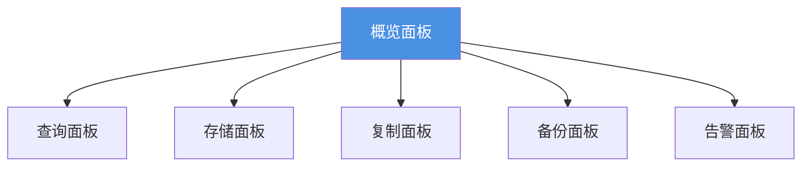
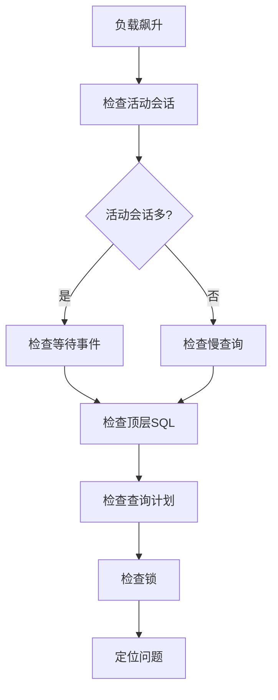
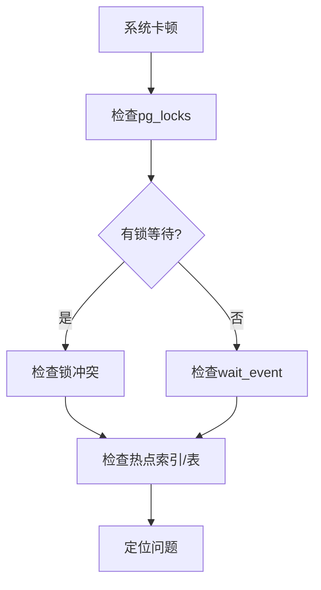
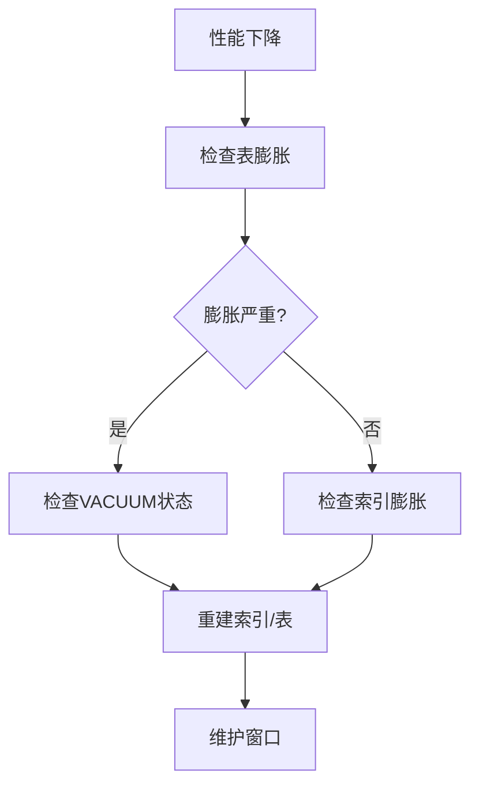

# Runbook：监控与可观测（PostgreSQL 18+）

> **文档编号**: RUNBOOK-监控可观测
> **最后更新**: 2025年1月
> **技术版本**: PostgreSQL 18+
> **用途**: PostgreSQL监控与可观测性生产指南

## 📑 目录

- [Runbook：监控与可观测（PostgreSQL 18+）](#runbook监控与可观测postgresql-18)
  - [📑 目录](#-目录)
  - [1. 目标](#1-目标)
  - [2. 指标基线](#2-指标基线)
    - [2.1 实例指标](#21-实例指标)
    - [2.2 存储/IO指标](#22-存储io指标)
    - [2.3 查询指标](#23-查询指标)
    - [2.4 自治任务指标](#24-自治任务指标)
    - [3.2 概览面板](#32-概览面板)
    - [3.3 查询面板](#33-查询面板)
    - [3.4 存储面板](#34-存储面板)
  - [4. 故障定位路径](#4-故障定位路径)
    - [4.1 负载飙升定位](#41-负载飙升定位)
    - [4.2 卡顿定位](#42-卡顿定位)
    - [4.3 膨胀定位](#43-膨胀定位)
  - [5. 告警门限](#5-告警门限)
    - [5.1 告警规则](#51-告警规则)
    - [5.2 告警分级](#52-告警分级)
  - [6. 标准查询片段](#6-标准查询片段)
    - [6.1 Top SQL查询](#61-top-sql查询)
    - [6.2 等待事件分布](#62-等待事件分布)
    - [6.3 Autovacuum积压](#63-autovacuum积压)
  - [7. 可观测性三大支柱](#7-可观测性三大支柱)
    - [7.1 指标（Metrics）](#71-指标metrics)
    - [7.2 日志（Logs）](#72-日志logs)
    - [7.3 追踪（Traces）](#73-追踪traces)
  - [8. 最佳实践](#8-最佳实践)
    - [8.1 监控最佳实践](#81-监控最佳实践)
    - [8.2 可观测性最佳实践](#82-可观测性最佳实践)

---

## 1. 目标

**监控目标**：

- ✅ 建立性能与健康监控基线
- ✅ 覆盖指标、告警与故障定位路径
- ✅ 实现可观测性（Observability）
- ✅ 支持快速故障定位和恢复

**可观测性定义**：

- **指标（Metrics）**：数值型数据，反映系统状态
- **日志（Logs）**：事件记录，提供上下文信息
- **追踪（Traces）**：请求链路，端到端追踪

---

## 2. 指标基线

### 2.1 实例指标

**连接指标**：

```sql
-- 当前连接数（带性能测试）
EXPLAIN (ANALYZE, BUFFERS, TIMING)
SELECT count(*) AS total_connections FROM pg_stat_activity;

-- 活动连接数（带性能测试）
EXPLAIN (ANALYZE, BUFFERS, TIMING)
SELECT count(*) AS active_connections
FROM pg_stat_activity
WHERE state = 'active';

-- 等待连接数（带性能测试）
EXPLAIN (ANALYZE, BUFFERS, TIMING)
SELECT count(*) AS waiting_connections
FROM pg_stat_activity
WHERE wait_event_type IS NOT NULL;

-- 连接使用率（带性能测试）
EXPLAIN (ANALYZE, BUFFERS, TIMING)
SELECT
    count(*)::float / current_setting('max_connections')::float * 100 AS connection_usage_percent
FROM pg_stat_activity
LIMIT 100;
```

**事务指标**：

```sql
-- 事务提交率（带性能测试）
EXPLAIN (ANALYZE, BUFFERS, TIMING)
SELECT
    datname,
    xact_commit,
    xact_rollback,
    round(100.0 * xact_commit / NULLIF(xact_commit + xact_rollback, 0), 2) AS commit_rate
FROM pg_stat_database
WHERE datname NOT IN ('template0', 'template1', 'postgres')
LIMIT 100;
```

**检查点指标**：

```sql
-- 检查点统计（带性能测试）
EXPLAIN (ANALYZE, BUFFERS, TIMING)
SELECT
    checkpoints_timed,
    checkpoints_req,
    checkpoint_write_time,
    checkpoint_sync_time,
    buffers_checkpoint,
    buffers_clean,
    maxwritten_clean
FROM pg_stat_bgwriter
LIMIT 100;
```

**WAL指标**：

```sql
-- WAL统计（带性能测试）
EXPLAIN (ANALYZE, BUFFERS, TIMING)
SELECT
    datname,
    xlog_bytes,
    xlog_bytes_written
FROM pg_stat_database
WHERE datname NOT IN ('template0', 'template1', 'postgres')
LIMIT 100;
```

### 2.2 存储/IO指标

**I/O统计（PostgreSQL 18）**：

```sql
-- I/O统计（PostgreSQL 18新特性）（带性能测试）
EXPLAIN (ANALYZE, BUFFERS, TIMING)
SELECT
    object,
    context,
    reads,
    writes,
    extends,
    fsyncs,
    fsync_write_time,
    write_time
FROM pg_stat_io
ORDER BY reads + writes DESC
LIMIT 100;
```

**表/索引膨胀**：

```sql
-- 表膨胀统计（带性能测试）
EXPLAIN (ANALYZE, BUFFERS, TIMING)
SELECT
    schemaname,
    tablename,
    pg_size_pretty(pg_total_relation_size(schemaname||'.'||tablename)) AS total_size,
    pg_size_pretty(pg_relation_size(schemaname||'.'||tablename)) AS table_size,
    n_live_tup,
    n_dead_tup,
    round(100.0 * n_dead_tup / NULLIF(n_live_tup + n_dead_tup, 0), 2) AS dead_tuple_ratio
FROM pg_stat_user_tables
WHERE n_dead_tup > 1000
ORDER BY n_dead_tup DESC
LIMIT 20;
```

### 2.3 查询指标

**查询统计（pg_stat_statements）**：

```sql
-- Top慢查询（带性能测试）
EXPLAIN (ANALYZE, BUFFERS, TIMING)
SELECT
    queryid,
    LEFT(query, 100) AS query_preview,
    calls,
    total_exec_time,
    mean_exec_time,
    max_exec_time,
    stddev_exec_time,
    rows,
    100.0 * shared_blks_hit / NULLIF(shared_blks_hit + shared_blks_read, 0) AS cache_hit_ratio
FROM pg_stat_statements
WHERE query NOT LIKE '%pg_stat_statements%'
ORDER BY total_exec_time DESC
LIMIT 20;
```

**查询计划变化**：

```sql
-- 查询计划统计（带性能测试）
EXPLAIN (ANALYZE, BUFFERS, TIMING)
SELECT
    queryid,
    LEFT(query, 100) AS query_preview,
    plans,
    total_plan_time,
    mean_plan_time,
    calls,
    total_exec_time
FROM pg_stat_statements
WHERE plans > 1
ORDER BY total_plan_time DESC
LIMIT 20;
```

### 2.4 自治任务指标

**VACUUM/ANALYZE进度**：

```sql
-- Autovacuum进度（带性能测试）
EXPLAIN (ANALYZE, BUFFERS, TIMING)
SELECT
    schemaname,
    tablename,
    n_dead_tup,
    last_vacuum,
    last_autovacuum,
    last_analyze,
    last_autoanalyze,
    CASE
        WHEN last_autovacuum IS NULL THEN 'Never'
        WHEN last_autovacuum < NOW() - INTERVAL '7 days' THEN 'Stale'
        ELSE 'Recent'
    END AS vacuum_status
FROM pg_stat_user_tables
ORDER BY n_dead_tup DESC
LIMIT 20;
```

**Autovacuum积压**：

```sql
-- Autovacuum积压（带性能测试）
EXPLAIN (ANALYZE, BUFFERS, TIMING)
SELECT
    schemaname,
    tablename,
    n_dead_tup,
    n_live_tup,
    round(100.0 * n_dead_tup / NULLIF(n_live_tup + n_dead_tup, 0), 2) AS dead_ratio,
    CASE
        WHEN n_dead_tup > 1000000 THEN 'Critical'
        WHEN n_dead_tup > 100000 THEN 'Warning'
        ELSE 'Normal'
    END AS backlog_level
FROM pg_stat_user_tables
WHERE n_dead_tup > 10000
ORDER BY n_dead_tup DESC
LIMIT 100;
```

```

---

## 3. 仪表板建议

### 3.1 仪表板结构

**六大板块**：



### 3.2 概览面板

**关键指标**：

| 指标 | PromQL查询 | 说明 |
|------|-----------|------|
| **连接数** | `sum(pg_stat_database_numbackends)` | 当前连接数 |
| **QPS** | `sum(rate(pg_stat_database_xact_commit[5m]))` | 每秒查询数 |
| **缓存命中率** | `(sum(rate(pg_stat_database_blks_hit[5m])) / sum(rate(pg_stat_database_blks_hit[5m] + pg_stat_database_blks_read[5m]))) * 100` | 缓存命中率 |
| **TPS** | `sum(rate(pg_stat_database_xact_commit[5m]))` | 每秒事务数 |

### 3.3 查询面板

**查询性能指标**：

```promql
# Top 10慢查询
topk(10,
  sum(rate(pg_stat_statements_total_exec_time[5m])) by (queryid)
)

# 查询延迟分布
histogram_quantile(0.95,
  sum(rate(pg_stat_statements_exec_time_bucket[5m])) by (le, queryid)
)

# 查询错误率
sum(rate(pg_stat_statements_calls{state="error"}[5m]))
/ sum(rate(pg_stat_statements_calls[5m]))
```

### 3.4 存储面板

**存储指标**：

```promql
# 数据库大小
sum(pg_database_size_bytes) by (datname)

# 表大小Top 10
topk(10,
  sum(pg_table_size_bytes) by (schemaname, tablename)
)

# 索引大小
sum(pg_index_size_bytes) by (schemaname, indexname)
```

---

## 4. 故障定位路径

### 4.1 负载飙升定位

**定位流程**：



**诊断SQL**：

```sql
-- 1. 检查活动会话（带性能测试）
EXPLAIN (ANALYZE, BUFFERS, TIMING)
SELECT
    pid,
    usename,
    application_name,
    state,
    wait_event_type,
    wait_event,
    query_start,
    now() - query_start AS duration,
    LEFT(query, 100) AS query_preview
FROM pg_stat_activity
WHERE state != 'idle'
ORDER BY duration DESC
LIMIT 100;

-- 2. 检查等待事件分布（带性能测试）
EXPLAIN (ANALYZE, BUFFERS, TIMING)
SELECT
    wait_event_type,
    wait_event,
    count(*) AS count
FROM pg_stat_activity
WHERE wait_event_type IS NOT NULL
GROUP BY wait_event_type, wait_event
ORDER BY count DESC
LIMIT 100;

-- 3. 检查顶层SQL（带性能测试）
EXPLAIN (ANALYZE, BUFFERS, TIMING)
SELECT
    queryid,
    LEFT(query, 200) AS query_preview,
    calls,
    total_exec_time,
    mean_exec_time
FROM pg_stat_statements
ORDER BY total_exec_time DESC
LIMIT 10;
```

### 4.2 卡顿定位

**定位流程**：



**诊断SQL**：

```sql
-- 1. 检查锁等待（带性能测试）
EXPLAIN (ANALYZE, BUFFERS, TIMING)
SELECT
    blocked_locks.pid AS blocked_pid,
    blocking_locks.pid AS blocking_pid,
    blocked_activity.query AS blocked_query,
    blocking_activity.query AS blocking_query
FROM pg_catalog.pg_locks blocked_locks
JOIN pg_catalog.pg_stat_activity blocked_activity ON blocked_activity.pid = blocked_locks.pid
JOIN pg_catalog.pg_locks blocking_locks ON blocking_locks.locktype = blocked_locks.locktype
JOIN pg_catalog.pg_stat_activity blocking_activity ON blocking_activity.pid = blocking_locks.pid
WHERE NOT blocked_locks.granted
LIMIT 100;

-- 2. 检查热点表（带性能测试）
EXPLAIN (ANALYZE, BUFFERS, TIMING)
SELECT
    schemaname,
    tablename,
    seq_scan,
    seq_tup_read,
    idx_scan,
    n_tup_ins,
    n_tup_upd,
    n_tup_del
FROM pg_stat_user_tables
ORDER BY seq_scan DESC
LIMIT 20;
```

### 4.3 膨胀定位

**定位流程**：



**诊断SQL**：

```sql
-- 1. 检查表膨胀（带性能测试）
EXPLAIN (ANALYZE, BUFFERS, TIMING)
SELECT
    schemaname,
    tablename,
    pg_size_pretty(pg_total_relation_size(schemaname||'.'||tablename)) AS total_size,
    n_live_tup,
    n_dead_tup,
    round(100.0 * n_dead_tup / NULLIF(n_live_tup + n_dead_tup, 0), 2) AS dead_ratio
FROM pg_stat_user_tables
WHERE n_dead_tup > 10000
ORDER BY n_dead_tup DESC
LIMIT 100;

-- 2. 检查VACUUM状态（带性能测试）
EXPLAIN (ANALYZE, BUFFERS, TIMING)
SELECT
    schemaname,
    tablename,
    last_vacuum,
    last_autovacuum,
    last_analyze,
    last_autoanalyze
FROM pg_stat_user_tables
WHERE last_autovacuum < NOW() - INTERVAL '7 days'
ORDER BY n_dead_tup DESC
LIMIT 100;
```

---

## 5. 告警门限

### 5.1 告警规则

**Prometheus告警规则**：

```yaml
groups:
  - name: postgresql_critical
    interval: 30s
    rules:
      # 连接使用率告警
      - alert: PostgreSQLHighConnectionUsage
        expr: |
          (sum(pg_stat_database_numbackends{datname!~"template.*|postgres"})
          / on() pg_settings_max_connections) * 100 > 80
        for: 5m
        labels:
          severity: warning
        annotations:
          summary: "PostgreSQL连接使用率过高"
          description: "连接使用率: {{ $value }}%"

      # 复制延迟告警
      - alert: PostgreSQLReplicationLag
        expr: |
          pg_replication_lag_seconds > 60
        for: 5m
        labels:
          severity: warning
        annotations:
          summary: "PostgreSQL复制延迟过高"
          description: "复制延迟: {{ $value }}秒"

      # WAL积压告警
      - alert: PostgreSQLWALBacklog
        expr: |
          pg_wal_lsn_diff(pg_current_wal_lsn(), pg_replication_slots_confirmed_flush_lsn) > 1073741824
        for: 10m
        labels:
          severity: warning
        annotations:
          summary: "PostgreSQL WAL积压"
          description: "WAL积压: {{ $value }} bytes"

      # 慢查询比例告警
      - alert: PostgreSQLHighSlowQueryRatio
        expr: |
          (sum(rate(pg_stat_statements_calls{mean_exec_time>1000}[5m]))
          / sum(rate(pg_stat_statements_calls[5m]))) * 100 > 10
        for: 5m
        labels:
          severity: warning
        annotations:
          summary: "PostgreSQL慢查询比例过高"
          description: "慢查询比例: {{ $value }}%"

      # 磁盘使用率告警
      - alert: PostgreSQLHighDiskUsage
        expr: |
          (pg_database_size_bytes / pg_database_size_limit_bytes) * 100 > 80
        for: 5m
        labels:
          severity: warning
        annotations:
          summary: "PostgreSQL磁盘使用率过高"
          description: "磁盘使用率: {{ $value }}%"
```

### 5.2 告警分级

**告警级别**：

| 级别 | 阈值 | 响应时间 | 处理方式 |
|------|------|---------|---------|
| **Critical** | 严重问题 | 立即 | 24/7待命 |
| **Warning** | 潜在问题 | 1小时内 | 工作时间 |
| **Info** | 信息提示 | 24小时内 | 定期审查 |

---

## 6. 标准查询片段

### 6.1 Top SQL查询

**Top慢查询**：

```sql
-- Top SQL（需启用pg_stat_statements）（带性能测试）
EXPLAIN (ANALYZE, BUFFERS, TIMING)
SELECT
    queryid,
    LEFT(query, 200) AS query_preview,
    calls,
    total_exec_time,
    mean_exec_time,
    max_exec_time,
    rows,
    100.0 * shared_blks_hit / NULLIF(shared_blks_hit + shared_blks_read, 0) AS cache_hit_ratio
FROM pg_stat_statements
WHERE query NOT LIKE '%pg_stat_statements%'
ORDER BY total_exec_time DESC
LIMIT 20;
```

**Top查询（按调用次数）**：

```sql
-- Top查询（按调用次数）（带性能测试）
EXPLAIN (ANALYZE, BUFFERS, TIMING)
SELECT
    queryid,
    LEFT(query, 200) AS query_preview,
    calls,
    mean_exec_time,
    total_exec_time
FROM pg_stat_statements
ORDER BY calls DESC
LIMIT 20;
```

### 6.2 等待事件分布

**等待事件统计**：

```sql
-- 等待事件分布（带性能测试）
EXPLAIN (ANALYZE, BUFFERS, TIMING)
SELECT
    wait_event_type,
    wait_event,
    count(*) AS count,
    round(100.0 * count(*) / (SELECT count(*) FROM pg_stat_activity), 2) AS percentage
FROM pg_stat_activity
WHERE wait_event_type IS NOT NULL
GROUP BY wait_event_type, wait_event
ORDER BY count DESC
LIMIT 100;
```

**活动会话等待**：

```sql
-- 活动会话等待（带性能测试）
EXPLAIN (ANALYZE, BUFFERS, TIMING)
SELECT
    pid,
    usename,
    application_name,
    wait_event_type,
    wait_event,
    state,
    query_start,
    now() - query_start AS wait_duration
FROM pg_stat_activity
WHERE wait_event_type IS NOT NULL
ORDER BY wait_duration DESC
LIMIT 100;
```

### 6.3 Autovacuum积压

**Autovacuum积压检查**：

```sql
-- Autovacuum积压（示意）（带性能测试）
EXPLAIN (ANALYZE, BUFFERS, TIMING)
SELECT
    schemaname,
    tablename,
    n_dead_tup,
    n_live_tup,
    round(100.0 * n_dead_tup / NULLIF(n_live_tup + n_dead_tup, 0), 2) AS dead_ratio,
    last_vacuum,
    last_autovacuum,
    CASE
        WHEN last_autovacuum IS NULL THEN 'Never'
        WHEN last_autovacuum < NOW() - INTERVAL '7 days' THEN 'Stale'
        ELSE 'Recent'
    END AS vacuum_status
FROM pg_stat_user_tables
WHERE n_dead_tup > 10000
ORDER BY n_dead_tup DESC
LIMIT 100;
WHERE n_dead_tup > 10000
ORDER BY n_dead_tup DESC
LIMIT 20;
```

---

## 7. 可观测性三大支柱

### 7.1 指标（Metrics）

**Prometheus指标**：

```promql
# 连接数
pg_stat_database_numbackends

# 事务统计
pg_stat_database_xact_commit
pg_stat_database_xact_rollback

# 查询统计
pg_stat_statements_total_exec_time
pg_stat_statements_calls

# I/O统计（PostgreSQL 18）
pg_stat_io_reads
pg_stat_io_writes
```

### 7.2 日志（Logs）

**Loki日志查询**：

```logql
# PostgreSQL日志
{job="postgresql"}

# 错误日志
{job="postgresql", level="ERROR"}

# 慢查询日志
{job="postgresql"} |~ "duration: [5-9][0-9]{3,}"
```

### 7.3 追踪（Traces）

**OpenTelemetry追踪**：

```python
# Python应用追踪
from opentelemetry import trace
from opentelemetry.instrumentation.psycopg2 import Psycopg2Instrumentor

tracer = trace.get_tracer(__name__)
Psycopg2Instrumentor().instrument()

with tracer.start_as_current_span("database_query"):
    cursor.execute("SELECT * FROM documents")
```

---

## 8. 最佳实践

### 8.1 监控最佳实践

**指标选择**：

- ✅ 核心指标优先
- ✅ 业务指标结合
- ✅ 避免指标爆炸
- ✅ 定期审查指标

**告警设置**：

- ✅ 合理阈值
- ✅ 避免告警风暴
- ✅ 分级告警
- ✅ 告警关联

### 8.2 可观测性最佳实践

**三大支柱整合**：

- ✅ 指标+日志关联
- ✅ 日志+追踪关联
- ✅ 端到端追踪
- ✅ 统一视图

**故障定位**：

- ✅ 快速定位
- ✅ 根因分析
- ✅ 问题解决
- ✅ 经验总结

---

**最后更新**: 2025年1月
**维护者**: PostgreSQL Modern Team
**文档编号**: RUNBOOK-监控可观测
