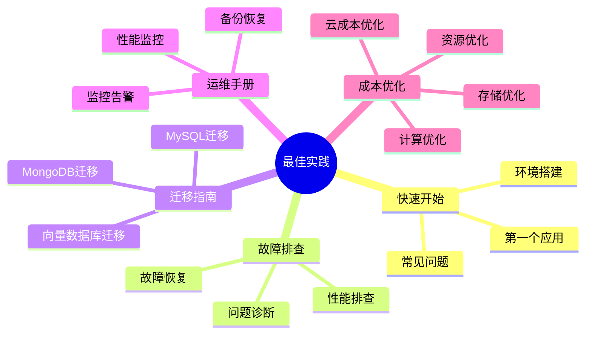
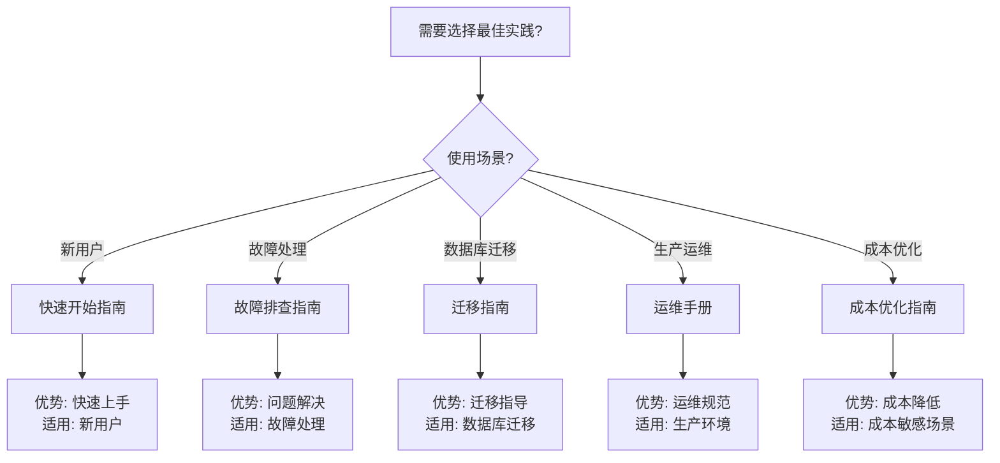

# 21-最佳实践

> **文档总数**: 20+个最佳实践文档
> **覆盖领域**: 快速开始、故障排查、迁移指南、运维手册、成本优化
> **版本覆盖**: PostgreSQL 18.x (推荐) ⭐ | 17.x (推荐) | 16.x (兼容)
> **最后更新**: 2025年1月

---

## 📊 知识体系思维导图

---

## 📋 主题说明

本主题整合所有PostgreSQL最佳实践相关内容，包括快速开始指南、故障排查方法、迁移指南和运维手册。

---

## 📚 文档分类

### 快速开始

帮助您快速上手PostgreSQL和相关扩展：

1. **[环境搭建指南](./快速开始/环境搭建指南.md)** - PostgreSQL、pgvector、TimescaleDB、Apache AGE等扩展的安装和配置
2. **[第一个向量搜索应用](./快速开始/第一个向量搜索应用.md)** - 从零开始构建向量搜索应用
3. **[常见问题解答](./快速开始/常见问题解答.md)** - 快速开始过程中的常见问题

### 故障排查

系统故障诊断和问题解决：

1. **[常见问题诊断](./故障排查/常见问题诊断.md)** - 常见问题的诊断和解决方法
2. **[性能问题排查](./故障排查/性能问题排查.md)** - 性能问题的排查流程和优化建议
3. **[故障恢复流程](./故障排查/故障恢复流程.md)** - 故障恢复的标准流程和最佳实践

### 迁移指南

从其他数据库迁移到PostgreSQL：

1. **[从MySQL迁移](./迁移指南/从MySQL迁移.md)** - MySQL到PostgreSQL的完整迁移指南
2. **[从MongoDB迁移](./迁移指南/从MongoDB迁移.md)** - MongoDB到PostgreSQL的迁移方案
3. **[从专用向量数据库迁移](./迁移指南/从专用向量数据库迁移.md)** - 向量数据库迁移到PostgreSQL+pgvector

### 运维手册

生产环境的运维最佳实践：

1. **[备份与恢复](./运维手册/备份与恢复.md)** - 备份策略和恢复流程
2. **[性能监控](./运维手册/性能监控.md)** - 性能监控指标和方法
3. **[监控与告警](./运维手册/监控与告警.md)** - 监控体系建设和告警配置

### 成本优化

PostgreSQL成本优化最佳实践：

1. **[成本优化/README.md](./成本优化/README.md)** - 成本优化子主题
2. **[成本优化/成本优化完整指南.md](./成本优化/成本优化完整指南.md)** - 成本优化完整指南
3. **[成本优化/云成本优化.md](./成本优化/云成本优化.md)** - 云成本优化详解
4. **[成本优化/资源使用优化.md](./成本优化/资源使用优化.md)** - 资源使用优化详解
5. **[成本优化/存储成本优化.md](./成本优化/存储成本优化.md)** - 存储成本优化详解
6. **[成本优化/计算成本优化.md](./成本优化/计算成本优化.md)** - 计算成本优化详解
7. **[成本优化/成本监控与分析.md](./成本优化/成本监控与分析.md)** - 成本监控与分析指南

---

## 📊 最佳实践选型决策树

---

## 📊 最佳实践分类对比矩阵

| 实践类别 | 文档数 | 适用对象 | 重要性 | 更新频率 |
| --- | --- | --- | --- | --- |
| **快速开始** | 3个 | 新用户 | ⭐⭐⭐⭐⭐ | 高 |
| **故障排查** | 3个 | 运维人员 | ⭐⭐⭐⭐⭐ | 高 |
| **迁移指南** | 3个 | 迁移团队 | ⭐⭐⭐⭐ | 中 |
| **运维手册** | 3个 | 运维人员 | ⭐⭐⭐⭐⭐ | 高 |
| **成本优化** | 7个 | 成本管理 | ⭐⭐⭐⭐ | 中 |

---

## 🎯 使用建议

### 新用户

1. 从 [环境搭建指南](./快速开始/环境搭建指南.md) 开始
2. 学习 [第一个向量搜索应用](./快速开始/第一个向量搜索应用.md)
3. 遇到问题时查看 [常见问题解答](./快速开始/常见问题解答.md)

### 运维人员

1. 学习 [备份与恢复](./运维手册/备份与恢复.md)
2. 配置 [监控与告警](./运维手册/监控与告警.md)
3. 掌握 [故障恢复流程](./故障排查/故障恢复流程.md)

### 迁移场景

1. 根据源数据库选择对应的迁移指南
2. 参考 [常见问题诊断](./故障排查/常见问题诊断.md) 解决迁移过程中的问题

---

## 📊 文档来源

本主题整合了以下源目录的文档：

- `BEST-PRACTICES.md`
- `PostgreSQL/08-工具资源/08.04-最佳实践总结.md`
- `PostgreSQL_View/09-实践指南/`

**原则**: 所有文档均为复制，原文件保持不变。

---

## 🔗 相关文档

- [12-监控与诊断](../12-监控与诊断/README.md) - 监控工具和诊断方法
- [20-故障诊断案例](../20-故障诊断案例/README.md) - 故障诊断案例库
- [24-迁移指南](../24-迁移指南/README.md) - 版本迁移和数据迁移

---

**最后更新**: 2025年1月
**状态**: ✅ 文档整合完成
