---

> **📋 文档来源**: `PostgreSQL\08-工具资源\08.01-质量检查工具.md`
> **📅 复制日期**: 2025-12-22
> **⚠️ 注意**: 本文档为复制版本，原文件保持不变

---

# 质量检查工具：PostgreSQL知识库自动化质量保证

> **版本**: v1.0
> **最后更新**: 2025-01-15
> **难度**: ⭐⭐⭐
> **应用场景**: 文档质量检查、CI/CD集成、自动化测试

---

## 📑 目录

- [1.1 工具目标](#11-工具目标)
- [1.2 检查范围](#12-检查范围)
- [1.3 工具特点](#13-工具特点)
- [2.1 链接与锚点检查](#21-链接与锚点检查)
- [2.2 Markdown规范检查](#22-markdown规范检查)
- [2.3 术语一致性检查](#23-术语一致性检查)
- [2.4 交叉引用完整性检查](#24-交叉引用完整性检查)
- [2.5 代码可运行性检查](#25-代码可运行性检查)
- [2.6 思维导图](#26-思维导图)
- [3.1 链接检查工具](#31-链接检查工具)
- [3.2 Markdown规范检查工具](#32-markdown规范检查工具)
- [3.3 术语检查工具](#33-术语检查工具)
- [3.4 综合检查工具](#34-综合检查工具)
- [4.1 安装与配置](#41-安装与配置)
- [4.2 基本使用](#42-基本使用)
- [4.3 高级用法](#43-高级用法)
- [4.4 CI/CD集成](#44-cicd集成)
- [5.1 工具方案对比](#51-工具方案对比)
- [5.2 检查策略对比](#52-检查策略对比)
- [6.1 本地开发检查](#61-本地开发检查)
- [6.2 CI/CD流水线集成](#62-cicd流水线集成)
- [6.3 批量修复工具](#63-批量修复工具)
- [8.1 官方文档](#81-官方文档)
- [8.2 网络资源](#82-网络资源)
- [8.3 相关文档](#83-相关文档)
---

## 一、概述

### 1.1 工具目标

质量检查工具旨在建立自动化、可重复的文档质量检查流程，确保PostgreSQL知识库的文档质量达到国际一流标准。

**核心目标**：

- **一致性保证**：确保文档与样例的一致性
- **可达性保证**：确保所有链接和引用可达
- **国际化质量**：确保中英文内容对齐和术语一致
- **自动化流程**：形成可重复的自动化检查流程

### 1.2 检查范围

质量检查工具覆盖以下检查范围：

1. **链接与锚点检查**
   - 内部相对链接有效性
   - Mermaid图表锚点
   - 代码块引用锚点
   - 外部链接可达性

1. **Markdown规范检查**
   - 标题层级规范
   - 空行规则
   - 列表格式
   - 围栏代码块规则
   - 表格格式

1. **术语一致性检查**
   - 英中对齐
   - 大小写规范
   - 缩写一致性
   - 术语表比对

1. **交叉引用完整性**
   - INDEX.md与各章节互链
   - 文档间交叉引用
   - 引用完整性验证

1. **代码可运行性检查**
   - SQL语法校验
   - 命令格式校验
   - 静态分析

### 1.3 工具特点

- **自动化**：支持CI/CD集成，自动化检查
- **可配置**：支持自定义检查规则和阈值
- **可扩展**：支持插件化扩展检查功能
- **报告详细**：生成详细的JSON/CSV报告
- **渐进修复**：支持自动修复和渐进式修复

---

## 二、核心功能

### 2.1 链接与锚点检查

**检查内容**：

- **内部链接**：检查相对路径链接是否存在
- **锚点链接**：检查标题锚点是否正确
- **外部链接**：检查外部链接可达性（可选）
- **图片链接**：检查图片文件是否存在

**检查规则**：

```python
# 链接检查规则
LINK_CHECK_RULES = {
    'internal_links': {
        'required': True,
        'check_existence': True,
        'check_anchors': True
    },
    'external_links': {
        'required': False,
        'check_reachability': False,  # 默认不检查，可配置
        'timeout': 5
    },
    'image_links': {
        'required': True,
        'check_existence': True,
        'allowed_formats': ['.png', '.jpg', '.svg', '.gif']
    }
}
```

### 2.2 Markdown规范检查

**检查内容**：

- **标题层级**：检查标题层级是否连续（如不能从H1跳到H3）
- **空行规则**：检查标题前后、列表前后的空行
- **列表格式**：检查列表缩进和格式
- **代码块**：检查围栏代码块格式
- **表格格式**：检查表格对齐和格式

**Markdown规则**：

```yaml
markdown_rules:
  MD001:  # 标题层级
    level: error
    description: "标题层级必须连续"

  MD009:  # 行尾空格
    level: warning
    description: "行尾不应有空格"

  MD031:  # 围栏代码块
    level: error
    description: "围栏代码块前后应有空行"

  MD032:  # 列表前后空行
    level: error
    description: "列表前后应有空行"
```

### 2.3 术语一致性检查

**检查内容**：

- **术语表比对**：与术语表进行比对
- **英中对齐**：检查中英文术语是否对齐
- **大小写规范**：检查术语大小写是否一致
- **缩写一致性**：检查缩写是否一致

**术语表格式**：

```csv
term_en,term_cn,abbreviation,notes
PostgreSQL,PostgreSQL,PG,数据库系统
Materialized View,物化视图,MV,预计算视图
Write-Ahead Logging,预写式日志,WAL,事务日志机制
```

### 2.4 交叉引用完整性检查

**检查内容**：

- **INDEX.md引用**：检查INDEX.md中引用的文档是否存在
- **文档间引用**：检查文档间的交叉引用是否完整
- **引用格式**：检查引用格式是否正确

**检查规则**：

```python
# 交叉引用检查规则
CROSS_REF_CHECK_RULES = {
    'index_file': 'INDEX.md',
    'check_existence': True,
    'check_format': True,
    'allowed_formats': [
        r'\[.*?\]\(.*?\)',  # Markdown链接
        r'`.*?`',            # 代码引用
    ]
}
```

### 2.5 代码可运行性检查

**检查内容**：

- **SQL语法**：检查SQL语法是否正确
- **命令格式**：检查命令行格式是否正确
- **静态分析**：进行静态代码分析

**检查规则**：

```python
# 代码检查规则
CODE_CHECK_RULES = {
    'sql_syntax': {
        'enabled': True,
        'validator': 'pg_validate_sql'
    },
    'command_format': {
        'enabled': True,
        'validators': ['bash', 'psql']
    },
    'static_analysis': {
        'enabled': False,  # 可选
        'tools': ['sqlfluff']
    }
}
```

### 2.6 思维导图

```mermaid
graph TD
    A[质量检查工具] --> B[链接检查]
    A --> C[Markdown检查]
    A --> D[术语检查]
    A --> E[交叉引用检查]
    A --> F[代码检查]

    B --> B1[内部链接]
    B --> B2[锚点链接]
    B --> B3[外部链接]
    B --> B4[图片链接]

    C --> C1[标题层级]
    C --> C2[空行规则]
    C --> C3[列表格式]
    C --> C4[代码块格式]

    D --> D1[术语表比对]
    D --> D2[英中对齐]
    D --> D3[大小写规范]
    D --> D4[缩写一致性]

    E --> E1[INDEX.md引用]
    E --> E2[文档间引用]
    E --> E3[引用格式]

    F --> F1[SQL语法]
    F --> F2[命令格式]
    F --> F3[静态分析]
```



---

## 三、工具实现

### 3.1 链接检查工具

**Python实现示例**：

```python
#!/usr/bin/env python3
"""
链接检查工具
检查Markdown文档中的链接有效性
"""

import re
import os
import json
from pathlib import Path
from typing import List, Dict, Tuple
from urllib.parse import urlparse

class LinkChecker:
    def __init__(self, root_dir: str, report_file: str = None):
        self.root_dir = Path(root_dir)
        self.report_file = report_file
        self.errors = []
        self.warnings = []

    def check_file(self, file_path: Path) -> List[Dict]:
        """检查单个文件的链接"""
        issues = []

        try:
            content = file_path.read_text(encoding='utf-8')
        except Exception as e:
            issues.append({
                'type': 'error',
                'file': str(file_path),
                'message': f'无法读取文件: {e}'
            })
            return issues

        # 提取所有链接
        link_pattern = r'\[([^\]]+)\]\(([^\)]+)\)'
        links = re.findall(link_pattern, content)

        for text, url in links:
            issue = self._check_link(file_path, url, text)
            if issue:
                issues.append(issue)

        return issues

    def _check_link(self, file_path: Path, url: str, text: str) -> Dict:
        """检查单个链接"""
        parsed = urlparse(url)

        # 外部链接
        if parsed.scheme in ('http', 'https'):
            # 可选：检查外部链接可达性
            return None

        # 内部链接（相对路径）
        if url.startswith('#'):
            # 锚点链接
            return self._check_anchor(file_path, url, text)
        else:
            # 文件链接
            return self._check_file_link(file_path, url, text)

    def _check_anchor(self, file_path: Path, anchor: str, text: str) -> Dict:
        """检查锚点链接"""
        anchor_id = anchor[1:].lower().replace(' ', '-')

        # 读取文件内容
        try:
            content = file_path.read_text(encoding='utf-8')
        except:
            return None

        # 提取所有标题
        heading_pattern = r'^#{1,6}\s+(.+)$'
        headings = re.findall(heading_pattern, content, re.MULTILINE)

        # 检查锚点是否存在
        for heading in headings:
            heading_id = heading.lower().replace(' ', '-')
            if heading_id == anchor_id:
                return None

        return {
            'type': 'error',
            'file': str(file_path),
            'link': anchor,
            'text': text,
            'message': f'锚点不存在: {anchor}'
        }

    def _check_file_link(self, file_path: Path, url: str, text: str) -> Dict:
        """检查文件链接"""
        # 解析相对路径
        if url.startswith('/'):
            target_path = self.root_dir / url[1:]
        else:
            target_path = (file_path.parent / url).resolve()

        # 检查文件是否存在
        if not target_path.exists():
            return {
                'type': 'error',
                'file': str(file_path),
                'link': url,
                'text': text,
                'message': f'文件不存在: {url}'
            }

        # 检查是否是Markdown文件
        if target_path.suffix == '.md' and not target_path.is_file():
            return {
                'type': 'error',
                'file': str(file_path),
                'link': url,
                'text': text,
                'message': f'不是文件: {url}'
            }

        return None

    def check_all(self, extensions: List[str] = ['.md']) -> Dict:
        """检查所有文件"""
        all_issues = []

        for ext in extensions:
            for file_path in self.root_dir.rglob(f'*{ext}'):
                issues = self.check_file(file_path)
                all_issues.extend(issues)

        # 生成报告
        report = {
            'total_files': len(list(self.root_dir.rglob('*.md'))),
            'total_issues': len(all_issues),
            'errors': [i for i in all_issues if i['type'] == 'error'],
            'warnings': [i for i in all_issues if i['type'] == 'warning']
        }

        if self.report_file:
            with open(self.report_file, 'w', encoding='utf-8') as f:
                json.dump(report, f, indent=2, ensure_ascii=False)

        return report

if __name__ == '__main__':
    import argparse

    parser = argparse.ArgumentParser(description='链接检查工具')
    parser.add_argument('--root', required=True, help='根目录')
    parser.add_argument('--ext', default='.md', help='文件扩展名')
    parser.add_argument('--report', help='报告文件路径')

    args = parser.parse_args()

    checker = LinkChecker(args.root, args.report)
    report = checker.check_all([args.ext])

    print(f"检查完成: {report['total_issues']} 个问题")
    print(f"错误: {len(report['errors'])}")
    print(f"警告: {len(report['warnings'])}")
```

### 3.2 Markdown规范检查工具

**Python实现示例**：

```python
#!/usr/bin/env python3
"""
Markdown规范检查工具
检查Markdown文档格式规范
"""

import re
from pathlib import Path
from typing import List, Dict

class MarkdownLinter:
    def __init__(self, rules: List[str] = None):
        self.rules = rules or ['MD001', 'MD009', 'MD031', 'MD032']
        self.issues = []

    def check_file(self, file_path: Path) -> List[Dict]:
        """检查单个文件"""
        issues = []

        try:
            lines = file_path.read_text(encoding='utf-8').split('\n')
        except Exception as e:
            return [{
                'type': 'error',
                'file': str(file_path),
                'message': f'无法读取文件: {e}'
            }]

        # MD001: 标题层级检查
        if 'MD001' in self.rules:
            issues.extend(self._check_heading_levels(file_path, lines))

        # MD009: 行尾空格检查
        if 'MD009' in self.rules:
            issues.extend(self._check_trailing_spaces(file_path, lines))

        # MD031: 围栏代码块检查
        if 'MD031' in self.rules:
            issues.extend(self._check_fenced_code_blocks(file_path, lines))

        # MD032: 列表前后空行检查
        if 'MD032' in self.rules:
            issues.extend(self._check_list_spacing(file_path, lines))

        return issues

    def _check_heading_levels(self, file_path: Path, lines: List[str]) -> List[Dict]:
        """检查标题层级"""
        issues = []
        prev_level = 0

        for i, line in enumerate(lines, 1):
            match = re.match(r'^(#{1,6})\s+', line)
            if match:
                level = len(match.group(1))
                if level > prev_level + 1:
                    issues.append({
                        'type': 'error',
                        'file': str(file_path),
                        'line': i,
                        'rule': 'MD001',
                        'message': f'标题层级跳跃: H{prev_level} -> H{level}'
                    })
                prev_level = level

        return issues

    def _check_trailing_spaces(self, file_path: Path, lines: List[str]) -> List[Dict]:
        """检查行尾空格"""
        issues = []

        for i, line in enumerate(lines, 1):
            if line.rstrip() != line:
                issues.append({
                    'type': 'warning',
                    'file': str(file_path),
                    'line': i,
                    'rule': 'MD009',
                    'message': '行尾有空格'
                })

        return issues

    def _check_fenced_code_blocks(self, file_path: Path, lines: List[str]) -> List[Dict]:
        """检查围栏代码块"""
        issues = []
        in_code_block = False

        for i, line in enumerate(lines, 1):
            if line.strip().startswith('```'):
                if not in_code_block:
                    # 代码块开始，检查前一行是否为空
                    if i > 1 and lines[i-2].strip():
                        issues.append({
                            'type': 'error',
                            'file': str(file_path),
                            'line': i,
                            'rule': 'MD031',
                            'message': '代码块前应有空行'
                        })
                in_code_block = not in_code_block
            elif in_code_block and line.strip().startswith('```'):
                # 代码块结束，检查下一行是否为空
                if i < len(lines) and lines[i].strip():
                    issues.append({
                        'type': 'error',
                        'file': str(file_path),
                        'line': i,
                        'rule': 'MD031',
                        'message': '代码块后应有空行'
                    })

        return issues

    def _check_list_spacing(self, file_path: Path, lines: List[str]) -> List[Dict]:
        """检查列表前后空行"""
        issues = []
        list_pattern = r'^\s*[-*+]\s+'

        for i, line in enumerate(lines, 1):
            if re.match(list_pattern, line):
                # 检查前一行是否为空（除非是列表的第一项）
                if i > 1 and not re.match(list_pattern, lines[i-2]) and lines[i-2].strip():
                    issues.append({
                        'type': 'error',
                        'file': str(file_path),
                        'line': i,
                        'rule': 'MD032',
                        'message': '列表前应有空行'
                    })

        return issues

    def fix_file(self, file_path: Path) -> bool:
        """自动修复文件"""
        # 实现自动修复逻辑
        pass
```

### 3.3 术语检查工具

**Python实现示例**：

```python
#!/usr/bin/env python3
"""
术语检查工具
检查文档中的术语一致性
"""

import csv
import re
from pathlib import Path
from typing import List, Dict, Set

class TermChecker:
    def __init__(self, glossary_file: str):
        self.glossary = self._load_glossary(glossary_file)
        self.issues = []

    def _load_glossary(self, glossary_file: str) -> Dict:
        """加载术语表"""
        glossary = {}

        with open(glossary_file, 'r', encoding='utf-8') as f:
            reader = csv.DictReader(f)
            for row in reader:
                term_en = row.get('term_en', '').strip()
                term_cn = row.get('term_cn', '').strip()
                abbreviation = row.get('abbreviation', '').strip()

                if term_en:
                    glossary[term_en.lower()] = {
                        'en': term_en,
                        'cn': term_cn,
                        'abbr': abbreviation
                    }

        return glossary

    def check_file(self, file_path: Path) -> List[Dict]:
        """检查单个文件的术语"""
        issues = []

        try:
            content = file_path.read_text(encoding='utf-8')
        except Exception as e:
            return [{
                'type': 'error',
                'file': str(file_path),
                'message': f'无法读取文件: {e}'
            }]

        # 检查术语使用
        for term_key, term_info in self.glossary.items():
            # 检查英文术语
            if term_info['en'] in content:
                # 检查是否有中文对照
                if term_info['cn'] and term_info['cn'] not in content:
                    issues.append({
                        'type': 'warning',
                        'file': str(file_path),
                        'term': term_info['en'],
                        'message': f'术语 "{term_info["en"]}" 缺少中文对照 "{term_info["cn"]}"'
                    })

            # 检查缩写一致性
            if term_info['abbr']:
                # 检查缩写使用是否一致
                abbr_pattern = rf'\b{re.escape(term_info["abbr"])}\b'
                if re.search(abbr_pattern, content, re.IGNORECASE):
                    # 检查是否首次出现时给出了全称
                    pass  # 实现检查逻辑

        return issues
```

### 3.4 综合检查工具

**Python实现示例**：

```python
#!/usr/bin/env python3
"""
综合质量检查工具
整合所有检查功能
"""

from pathlib import Path
from link_checker import LinkChecker
from markdown_linter import MarkdownLinter
from term_checker import TermChecker
import json

class QualityChecker:
    def __init__(self, root_dir: str, config: dict = None):
        self.root_dir = Path(root_dir)
        self.config = config or {}
        self.report = {
            'link_check': {},
            'markdown_check': {},
            'term_check': {},
            'summary': {}
        }

    def run_all_checks(self):
        """运行所有检查"""
        # 链接检查
        if self.config.get('enable_link_check', True):
            link_checker = LinkChecker(
                str(self.root_dir),
                self.config.get('link_report_file')
            )
            self.report['link_check'] = link_checker.check_all()

        # Markdown检查
        if self.config.get('enable_markdown_check', True):
            linter = MarkdownLinter(
                self.config.get('markdown_rules', ['MD001', 'MD009', 'MD031', 'MD032'])
            )
            all_issues = []
            for file_path in self.root_dir.rglob('*.md'):
                issues = linter.check_file(file_path)
                all_issues.extend(issues)

            self.report['markdown_check'] = {
                'total_issues': len(all_issues),
                'errors': [i for i in all_issues if i['type'] == 'error'],
                'warnings': [i for i in all_issues if i['type'] == 'warning']
            }

        # 术语检查
        if self.config.get('enable_term_check', True):
            glossary_file = self.config.get('glossary_file')
            if glossary_file and Path(glossary_file).exists():
                term_checker = TermChecker(glossary_file)
                all_issues = []
                for file_path in self.root_dir.rglob('*.md'):
                    issues = term_checker.check_file(file_path)
                    all_issues.extend(issues)

                self.report['term_check'] = {
                    'total_issues': len(all_issues),
                    'errors': [i for i in all_issues if i['type'] == 'error'],
                    'warnings': [i for i in all_issues if i['type'] == 'warning']
                }

        # 生成摘要
        self.report['summary'] = self._generate_summary()

    def _generate_summary(self) -> dict:
        """生成检查摘要"""
        total_errors = (
            len(self.report['link_check'].get('errors', [])) +
            len(self.report['markdown_check'].get('errors', [])) +
            len(self.report['term_check'].get('errors', []))
        )

        total_warnings = (
            len(self.report['link_check'].get('warnings', [])) +
            len(self.report['markdown_check'].get('warnings', [])) +
            len(self.report['term_check'].get('warnings', []))
        )

        return {
            'total_errors': total_errors,
            'total_warnings': total_warnings,
            'passed': total_errors == 0
        }

    def save_report(self, report_file: str):
        """保存报告"""
        with open(report_file, 'w', encoding='utf-8') as f:
            json.dump(self.report, f, indent=2, ensure_ascii=False)
```

---

## 四、使用指南

### 4.1 安装与配置

**安装依赖**：

```bash
# 安装Python依赖
pip install -r requirements.txt

# requirements.txt
# markdown
# pyyaml
# requests  # 用于外部链接检查（可选）
```

**配置文件**：

```yaml
# quality_check_config.yaml
quality_check:
  root_dir: "."
  output_dir: "out"

  link_check:
    enabled: true
    check_external: false
    timeout: 5

  markdown_check:
    enabled: true
    rules:
      - MD001
      - MD009
      - MD031
      - MD032
    auto_fix: false

  term_check:
    enabled: true
    glossary_file: "tools/glossary.csv"

  report:
    format: "json"  # json, csv, html
    file: "out/quality_report.json"
```

### 4.2 基本使用

**命令行使用**：

```bash
# 全目录链接检查
python tools/link_checker.py --root . --ext .md --report out/link_report.json

# Markdown规则检查
python tools/md_lint.py --root . --rules MD031,MD032,MD009 --fix

# 术语比对
python tools/term_check.py --root . --glossary tools/glossary.csv --report out/term_report.csv

# 综合检查
python tools/quality_checker.py --root . --config quality_check_config.yaml
```

### 4.3 高级用法

**增量检查**：

```bash
# 只检查改动的文件
python tools/quality_checker.py \
  --root . \
  --changed-files file1.md file2.md \
  --report out/incremental_report.json
```

**自定义规则**：

```python
# 自定义检查规则
from quality_checker import QualityChecker

config = {
    'enable_link_check': True,
    'enable_markdown_check': True,
    'markdown_rules': ['MD001', 'MD009'],  # 只检查特定规则
    'glossary_file': 'custom_glossary.csv'
}

checker = QualityChecker('.', config)
checker.run_all_checks()
checker.save_report('out/custom_report.json')
```

### 4.4 CI/CD集成

**GitHub Actions示例**：

```yaml
# .github/workflows/quality-check.yml
name: Quality Check

on:
  pull_request:
    paths:
      - '**.md'
  push:
    branches:
      - main

jobs:
  quality-check:
    runs-on: ubuntu-latest
    steps:
      - uses: actions/checkout@v3

      - name: Set up Python
        uses: actions/setup-python@v4
        with:
          python-version: '3.9'

      - name: Install dependencies
        run: |
          pip install -r requirements.txt

      - name: Run quality checks
        run: |
          python tools/quality_checker.py \
            --root . \
            --config quality_check_config.yaml \
            --report out/quality_report.json

      - name: Upload report
        uses: actions/upload-artifact@v3
        with:
          name: quality-report
          path: out/quality_report.json

      - name: Check results
        run: |
          python tools/check_report.py \
            --report out/quality_report.json \
            --fail-on-error
```

---

## 五、知识矩阵对比

### 5.1 工具方案对比

| 维度 | 自定义工具 | markdownlint | Vale | 推荐场景 |
|------|-----------|-------------|------|---------|
| **定制化** | ⭐⭐⭐⭐⭐ 完全定制 | ⭐⭐⭐ 中等 | ⭐⭐⭐⭐ 高 | 自定义工具最灵活 |
| **易用性** | ⭐⭐⭐ 中等 | ⭐⭐⭐⭐⭐ 简单 | ⭐⭐⭐⭐ 简单 | markdownlint最易用 |
| **功能完整性** | ⭐⭐⭐⭐ 完整 | ⭐⭐⭐⭐ 完整 | ⭐⭐⭐⭐⭐ 最完整 | Vale功能最完整 |
| **CI/CD集成** | ⭐⭐⭐⭐ 良好 | ⭐⭐⭐⭐⭐ 优秀 | ⭐⭐⭐⭐⭐ 优秀 | 三者都支持 |
| **维护成本** | ⭐⭐ 高 | ⭐⭐⭐⭐ 低 | ⭐⭐⭐ 中 | markdownlint维护成本最低 |
| **适用场景** | 特定需求 | 通用Markdown | 技术文档 | 根据需求选择 |

### 5.2 检查策略对比

| 策略 | 全量检查 | 增量检查 | 抽样检查 | 推荐场景 |
|------|---------|---------|---------|---------|
| **检查完整性** | ⭐⭐⭐⭐⭐ 完整 | ⭐⭐⭐⭐ 良好 | ⭐⭐⭐ 中等 | 全量检查最完整 |
| **检查速度** | ⭐⭐ 慢 | ⭐⭐⭐⭐⭐ 快 | ⭐⭐⭐⭐ 较快 | 增量检查最快 |
| **资源消耗** | ⭐⭐ 高 | ⭐⭐⭐⭐ 低 | ⭐⭐⭐⭐⭐ 最低 | 抽样检查资源消耗最低 |
| **适用场景** | 定期全检 | PR检查 | 快速预览 | 根据场景选择 |

---

## 六、实践案例

### 6.1 本地开发检查

**开发前检查**：

```bash
#!/bin/bash
# pre-commit-check.sh

echo "运行质量检查..."

# 运行所有检查
python tools/quality_checker.py \
  --root . \
  --config quality_check_config.yaml \
  --report out/pre_commit_report.json

# 检查是否有错误
python tools/check_report.py \
  --report out/pre_commit_report.json \
  --fail-on-error

if [ $? -ne 0 ]; then
    echo "质量检查失败，请修复错误后重试"
    exit 1
fi

echo "质量检查通过"
```

### 6.2 CI/CD流水线集成

**GitLab CI示例**：

```yaml
# .gitlab-ci.yml
stages:
  - quality-check

quality-check:
  stage: quality-check
  image: python:3.9
  script:
    - pip install -r requirements.txt
    - python tools/quality_checker.py --root . --report out/report.json
    - python tools/check_report.py --report out/report.json --fail-on-error
  artifacts:
    reports:
      junit: out/report.xml
    paths:
      - out/report.json
  only:
    - merge_requests
    - main
```

### 6.3 批量修复工具

**自动修复示例**：

```python
#!/usr/bin/env python3
"""
批量修复工具
自动修复可修复的问题
"""

from pathlib import Path
from markdown_linter import MarkdownLinter

def batch_fix(root_dir: str):
    """批量修复文件"""
    root = Path(root_dir)
    linter = MarkdownLinter()

    fixed_count = 0
    for file_path in root.rglob('*.md'):
        if linter.fix_file(file_path):
            fixed_count += 1
            print(f"已修复: {file_path}")

    print(f"共修复 {fixed_count} 个文件")

if __name__ == '__main__':
    import sys
    batch_fix(sys.argv[1] if len(sys.argv) > 1 else '.')
```

---

## 七、最佳实践

1. **CI集成**
   - PR必须通过"链接/Markdown/术语"三类检查
   - 关键错误阻断合并
   - 警告允许但需要记录

1. **报告留痕**
   - 输出JSON/CSV报告
   - 存档于`out/`目录
   - 保留历史报告用于趋势分析

1. **渐进修复**
   - 允许警告等级
   - 关键错误必须修复
   - 支持自动修复功能

1. **范围化检查**
   - 仅检查改动集以提速
   - 支持增量检查
   - 定期全量检查

1. **国际化联动**
   - 与`08.03`规范联动
   - 双语条目同步检查
   - 术语表统一管理

---

## 八、参考资源

### 8.1 官方文档

- [Markdown规范](https://daringfireball.net/projects/markdown/)
- [CommonMark规范](https://commonmark.org/)
- [markdownlint规则](https://github.com/DavidAnson/markdownlint)

### 8.2 网络资源

- [Vale文档](https://docs.errata.ai/vale/about)
- [markdownlint-cli](https://github.com/igorshubovych/markdownlint-cli)
- [链接检查工具](https://github.com/linkchecker/linkchecker)

### 8.3 相关文档

- `INDEX.md`（交叉引用源）
- `08.03-国际化标准指南.md`（术语/格式）
- `PostgreSQL质量保证机制.md`（质量保证框架）

---

**维护者**: Data-Science Team
**最后更新**: 2025-01-15
**版本**: 1.0
