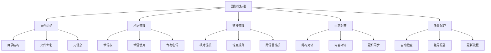

---

> **📋 文档来源**: `PostgreSQL\08-工具资源\08.03-国际化标准指南.md`
> **📅 复制日期**: 2025-12-22
> **⚠️ 注意**: 本文档为复制版本，原文件保持不变

---

# 国际化标准指南：PostgreSQL知识库双语支持规范

> **版本**: v1.0
> **最后更新**: 2025-01-15
> **难度**: ⭐⭐⭐
> **应用场景**: 多语言文档、国际化项目、知识库维护

---

## 📑 目录

- [国际化标准指南：PostgreSQL知识库双语支持规范](#国际化标准指南postgresql知识库双语支持规范)
  - [📑 目录](#-目录)
  - [一、概述](#一概述)
    - [1.1 国际化目标](#11-国际化目标)
    - [1.2 适用范围](#12-适用范围)
    - [1.3 核心原则](#13-核心原则)
  - [二、核心概念](#二核心概念)
    - [2.1 国际化与本地化](#21-国际化与本地化)
    - [2.2 双语对照](#22-双语对照)
    - [2.3 术语一致性](#23-术语一致性)
    - [2.4 思维导图](#24-思维导图)
  - [三、文件组织规范](#三文件组织规范)
    - [3.1 目录结构](#31-目录结构)
    - [3.2 文件命名](#32-文件命名)
    - [3.3 元信息规范](#33-元信息规范)
  - [四、术语管理](#四术语管理)
    - [4.1 术语表维护](#41-术语表维护)
    - [4.2 术语使用规范](#42-术语使用规范)
    - [4.3 专有名词处理](#43-专有名词处理)
  - [五、链接与锚点](#五链接与锚点)
    - [5.1 链接规范](#51-链接规范)
    - [5.2 锚点规则](#52-锚点规则)
    - [5.3 跨语言链接](#53-跨语言链接)
  - [六、内容对齐](#六内容对齐)
    - [6.1 结构对齐](#61-结构对齐)
    - [6.2 内容对齐](#62-内容对齐)
    - [6.3 更新同步](#63-更新同步)
  - [七、知识矩阵对比](#七知识矩阵对比)
    - [7.1 国际化方案对比](#71-国际化方案对比)
    - [7.2 术语管理方案对比](#72-术语管理方案对比)
  - [八、实践案例](#八实践案例)
    - [8.1 文档创建流程](#81-文档创建流程)
    - [8.2 术语添加流程](#82-术语添加流程)
    - [8.3 链接检查流程](#83-链接检查流程)
  - [九、质量保证](#九质量保证)
    - [9.1 自动化检查](#91-自动化检查)
    - [9.2 差异报告](#92-差异报告)
    - [9.3 更新流程](#93-更新流程)
  - [十、最佳实践](#十最佳实践)
  - [十一、参考资源](#十一参考资源)
    - [11.1 官方文档](#111-官方文档)
    - [11.2 网络资源](#112-网络资源)
    - [11.3 相关文档](#113-相关文档)

---

## 一、概述

### 1.1 国际化目标

国际化标准指南旨在建立PostgreSQL知识库的多语言支持规范，确保中英文内容对齐、链接可达、术语一致与可维护性。

**核心目标**：

- **内容对齐**：确保中英文内容结构一致、内容对应
- **链接可达**：确保所有链接和锚点正确有效
- **术语一致**：确保术语翻译和使用的一致性
- **可维护性**：建立可维护的国际化工作流程

### 1.2 适用范围

本指南适用于：

- **文档编写**：所有PostgreSQL知识库文档
- **术语管理**：术语表的创建和维护
- **链接管理**：文档间链接和跨语言链接
- **质量检查**：国际化质量检查和验证

### 1.3 核心原则

**国际化核心原则**：

1. **一致性原则**：术语、格式、结构保持一致
1. **可访问性原则**：所有链接和锚点必须可达
1. **可维护性原则**：建立自动化工具和流程
1. **质量标准原则**：确保翻译质量和准确性

---

## 二、核心概念

### 2.1 国际化与本地化

**国际化**（Internationalization, i18n）是指设计和开发应用程序时，使其能够轻松适应不同语言和地区的过程。

**本地化**（Localization, l10n）是指将应用程序适配到特定语言和地区的过程。

**在知识库中的应用**：

- **国际化**：设计支持多语言的文档结构和格式
- **本地化**：将内容翻译为中文和英文版本

### 2.2 双语对照

**双语对照**是指同时提供中文和英文两种语言的内容，确保两种语言的内容对应一致。

**双语对照要求**：

- **结构一致**：中英文文档结构必须一致
- **内容对应**：中英文内容必须对应
- **术语统一**：术语翻译必须统一
- **链接互通**：提供跨语言链接

### 2.3 术语一致性

**术语一致性**是指在整个知识库中，同一概念使用相同的术语，确保术语翻译和使用的一致性。

**术语一致性要求**：

- **首次出现**：首次出现时给出中英对照和缩写
- **统一使用**：后续使用保持统一
- **术语表管理**：维护统一的术语表
- **自动检查**：使用工具自动检查术语一致性

### 2.4 思维导图



---

## 三、文件组织规范

### 3.1 目录结构

**标准目录结构**：

```text
PostgreSQL/
├── 01-核心基础/              # 中文文档
│   ├── 01-核心基础/01.02-系统架构/01.01-系统架构与设计原理.md
│   └── ...
├── en-US/                    # 英文文档
│   └── 01-core-fundamentals/
│       ├── 01.01-system-architecture.md
│       └── ...
├── tools/                    # 工具目录
│   ├── glossary.csv         # 术语表
│   └── i18n-check.py        # 国际化检查工具
└── ...
```

**目录结构要求**：

- **结构镜像**：中文与英文目录结构对齐
- **路径对应**：中英文文档路径一一对应
- **命名规范**：遵循统一的命名规范

### 3.2 文件命名

**中文文件命名规范**：

```text
格式：XX.XX-主题.md
示例：
- 01-核心基础/01.02-系统架构/01.01-系统架构与设计原理.md
- 01.02-数据模型.md
- 02.01-查询优化.md
```

**英文文件命名规范**：

```text
格式：XX.XX-topic.md（小写，连字符分隔）
示例：
- 01.01-system-architecture.md
- 01.02-data-model.md
- 02.01-query-optimization.md
```

**命名规则**：

- **序号一致**：中英文文件序号必须一致
- **主题对应**：中英文主题必须对应
- **格式规范**：遵循统一的格式规范
- **避免特殊字符**：避免使用特殊字符和空格

### 3.3 元信息规范

**文档元信息格式**：

```markdown
---
title: "系统架构与设计原理"
title_en: "System Architecture and Design Principles"
language: "zh-CN"
last_updated: "2025-01-15"
version: "1.0"
---

# 系统架构与设计原理

> **版本**: PostgreSQL 18.x
> **最后更新**: 2025-01-15
> **语言**: 中文 | [English](../01-核心基础/01.02-系统架构/01.01-系统架构与设计原理.md)
```

**元信息要求**：

- **标题双语**：提供中英文标题
- **语言标识**：明确标识文档语言
- **更新日期**：记录最后更新日期
- **版本号**：记录文档版本号
- **跨语言链接**：提供对应的英文/中文链接

---

## 四、术语管理

### 4.1 术语表维护

**术语表格式**（CSV）：

```csv
term_en,term_cn,abbreviation,definition_en,definition_cn,notes
PostgreSQL,PostgreSQL,PG,"Open-source relational database management system","开源关系数据库管理系统",
Materialized View,物化视图,MV,"Pre-computed view stored as a table","预计算并存储为表的视图",
Write-Ahead Logging,预写式日志,WAL,"Logging mechanism that writes changes to log before applying to database","在应用到数据库之前将更改写入日志的机制",
ACID,ACID,,"Atomicity, Consistency, Isolation, Durability","原子性、一致性、隔离性、持久性",
MVCC,多版本并发控制,,"Multi-Version Concurrency Control","多版本并发控制",
```

**术语表字段说明**：

- **term_en**：英文术语（必填）
- **term_cn**：中文术语（必填）
- **abbreviation**：缩写（可选）
- **definition_en**：英文定义（可选）
- **definition_cn**：中文定义（可选）
- **notes**：备注（可选）

### 4.2 术语使用规范

**首次出现规范**：

```markdown
## 1. 概述

**物化视图**（Materialized View, MV）是PostgreSQL中预先计算并存储查询结果的机制。

**预写式日志**（Write-Ahead Logging, WAL）是PostgreSQL的事务日志机制。
```

**后续使用规范**：

```markdown
物化视图可以显著提升查询性能。

WAL机制保证了数据的持久性。
```

**术语使用要求**：

- **首次出现**：必须给出中英对照和缩写
- **后续使用**：可以使用中文术语或缩写
- **一致性**：同一文档中术语使用保持一致
- **准确性**：术语翻译必须准确

### 4.3 专有名词处理

**PostgreSQL专有名词**：

- **保持原样**：PostgreSQL、SQL、ACID等保持英文
- **官方译名**：使用PostgreSQL官方中文文档的译名
- **注记说明**：首次出现时给出注记说明

**示例**：

```markdown
**PostgreSQL**（读作"Post-Gres-Q-L"）是一个开源的关系数据库管理系统。

**ACID**（Atomicity, Consistency, Isolation, Durability）是事务的四个基本特性。
```

---

## 五、链接与锚点

### 5.1 链接规范

**相对链接规范**：

```markdown
<!-- 正确：使用相对路径 -->
[系统架构](../01-核心基础/01.02-系统架构/01.01-系统架构与设计原理.md)
[查询优化](../02-查询与优化/02.01-查询优化器/02.01-查询优化器原理.md)

<!-- 错误：使用绝对路径或硬编码域名 -->
[系统架构](https://example.com/01-核心基础/01.02-系统架构/01.01-系统架构与设计原理.md)
```

**链接要求**：

- **相对路径**：使用相对链接，避免硬编码域名
- **路径正确**：确保链接路径正确
- **格式统一**：使用统一的链接格式

### 5.2 锚点规则

**锚点生成规则**：

```markdown
# 系统架构与设计原理
<!-- 锚点：系统架构与设计原理 -->

## 1. 概述
<!-- 锚点：1-概述 -->

### 1.1 核心组件
<!-- 锚点：11-核心组件 -->
```

**锚点规则**：

- **标题转小写**：标题转换为小写
- **空格替换**：空格替换为连字符`-`
- **移除标点**：移除标点符号
- **中文支持**：支持中文标题锚点

**锚点链接示例**：

```markdown
[跳转到概述](#1-概述)
[跳转到核心组件](#11-核心组件)
```

### 5.3 跨语言链接

**跨语言链接格式**：

```markdown
## 语言与国际化

- **中文版本**：本文档
- **English Version**: [System Architecture](../01-核心基础/01.02-系统架构/01.01-系统架构与设计原理.md)
```

**跨语言链接要求**：

- **位置统一**：在文档开头或"语言与国际化"区段
- **格式统一**：使用统一的链接格式
- **链接有效**：确保跨语言链接有效

---

## 六、内容对齐

### 6.1 结构对齐

**结构对齐要求**：

- **标题层级**：中英文文档标题层级必须一致
- **章节顺序**：中英文文档章节顺序必须一致
- **目录结构**：中英文文档目录结构必须一致

**结构对齐检查**：

```python
#!/usr/bin/env python3
"""
结构对齐检查工具
检查中英文文档结构是否对齐
"""

import re
from pathlib import Path
from typing import List, Dict

class StructureAligner:
    def __init__(self, zh_file: Path, en_file: Path):
        self.zh_file = zh_file
        self.en_file = en_file

    def extract_structure(self, file_path: Path) -> List[Dict]:
        """提取文档结构"""
        structure = []

        try:
            content = file_path.read_text(encoding='utf-8')
        except Exception as e:
            print(f"无法读取文件 {file_path}: {e}")
            return structure

        # 提取标题
        heading_pattern = r'^(#{1,6})\s+(.+)$'
        for match in re.finditer(heading_pattern, content, re.MULTILINE):
            level = len(match.group(1))
            text = match.group(2).strip()
            structure.append({
                'level': level,
                'text': text
            })

        return structure

    def compare_structures(self) -> List[Dict]:
        """比较文档结构"""
        zh_structure = self.extract_structure(self.zh_file)
        en_structure = self.extract_structure(self.en_file)

        differences = []

        # 比较标题层级
        min_len = min(len(zh_structure), len(en_structure))
        for i in range(min_len):
            if zh_structure[i]['level'] != en_structure[i]['level']:
                differences.append({
                    'type': 'level_mismatch',
                    'index': i,
                    'zh': zh_structure[i],
                    'en': en_structure[i]
                })

        # 检查长度差异
        if len(zh_structure) != len(en_structure):
            differences.append({
                'type': 'length_mismatch',
                'zh_count': len(zh_structure),
                'en_count': len(en_structure)
            })

        return differences
```

### 6.2 内容对齐

**内容对齐要求**：

- **章节对应**：中英文文档章节必须对应
- **内容完整**：中英文文档内容必须完整
- **信息一致**：关键信息必须一致

### 6.3 更新同步

**更新同步流程**：

1. **识别变更**：识别中文或英文文档的变更
1. **标记待同步**：标记需要同步的章节
1. **翻译更新**：更新对应的翻译
1. **验证对齐**：验证中英文文档对齐

---

## 七、知识矩阵对比

### 7.1 国际化方案对比

| 维度 | 双语对照 | 单语言+翻译 | 机器翻译 | 推荐场景 |
|------|---------|-----------|---------|---------|
| **质量** | ⭐⭐⭐⭐⭐ 高 | ⭐⭐⭐⭐ 良好 | ⭐⭐ 低 | 双语对照质量最高 |
| **成本** | ⭐⭐ 高 | ⭐⭐⭐ 中 | ⭐⭐⭐⭐⭐ 低 | 机器翻译成本最低 |
| **维护性** | ⭐⭐⭐⭐ 良好 | ⭐⭐⭐ 中等 | ⭐⭐⭐⭐⭐ 简单 | 机器翻译维护最简单 |
| **一致性** | ⭐⭐⭐⭐⭐ 高 | ⭐⭐⭐ 中等 | ⭐⭐ 低 | 双语对照一致性最高 |
| **适用场景** | 高质量文档 | 一般文档 | 快速翻译 | 根据需求选择 |

### 7.2 术语管理方案对比

| 维度 | CSV术语表 | 数据库术语表 | 配置文件 | 推荐场景 |
|------|---------|------------|---------|---------|
| **易用性** | ⭐⭐⭐⭐⭐ 简单 | ⭐⭐⭐ 中等 | ⭐⭐⭐⭐ 良好 | CSV最易用 |
| **可扩展性** | ⭐⭐⭐ 中等 | ⭐⭐⭐⭐⭐ 优秀 | ⭐⭐⭐⭐ 良好 | 数据库最可扩展 |
| **查询性能** | ⭐⭐ 低 | ⭐⭐⭐⭐⭐ 优秀 | ⭐⭐⭐ 中等 | 数据库查询最快 |
| **维护成本** | ⭐⭐⭐⭐⭐ 低 | ⭐⭐⭐ 中等 | ⭐⭐⭐⭐ 良好 | CSV维护成本最低 |
| **适用场景** | 小型项目 | 大型项目 | 中型项目 | 根据规模选择 |

---

## 八、实践案例

### 8.1 文档创建流程

**创建双语文档流程**：

```bash
# 1. 创建中文文档
touch "01-核心基础/01.02-系统架构/01.01-系统架构与设计原理.md"

# 2. 创建对应的英文文档
touch "01-核心基础/01.02-系统架构/01.01-系统架构与设计原理.md"

# 3. 添加元信息和跨语言链接
# 在中文文档中添加：
# - **English Version**: [System Architecture](../01-核心基础/01.02-系统架构/01.01-系统架构与设计原理.md)

# 在英文文档中添加：
# - **中文版本**: [系统架构](../01-核心基础/01.02-系统架构/01.01-系统架构与设计原理.md)

# 4. 检查结构对齐
python tools/i18n-check.py --structure \
  --zh "01-核心基础/01.02-系统架构/01.01-系统架构与设计原理.md" \
  --en "01-核心基础/01.02-系统架构/01.01-系统架构与设计原理.md"
```

### 8.2 术语添加流程

**添加新术语流程**：

```bash
# 1. 编辑术语表
vim tools/glossary.csv

# 2. 添加新术语
# term_en,term_cn,abbreviation,definition_en,definition_zh,notes
# Materialized View,物化视图,MV,"Pre-computed view","预计算视图",

# 3. 验证术语格式
python tools/term-check.py --validate tools/glossary.csv

# 4. 检查文档中的术语使用
python tools/term-check.py --check \
  --glossary tools/glossary.csv \
  --root .
```

### 8.3 链接检查流程

**检查链接有效性**：

```bash
# 1. 检查所有链接
python tools/link-checker.py \
  --root . \
  --ext .md \
  --report out/link_report.json

# 2. 检查跨语言链接
python tools/i18n-check.py --cross-links \
  --zh-root . \
  --en-root en-US

# 3. 修复链接错误
python tools/link-checker.py --fix \
  --root . \
  --report out/link_report.json
```

---

## 九、质量保证

### 9.1 自动化检查

**国际化质量检查工具**：

```python
#!/usr/bin/env python3
"""
国际化质量检查工具
检查文档的国际化质量
"""

import json
from pathlib import Path
from typing import Dict, List

class I18nQualityChecker:
    def __init__(self, root_dir: str):
        self.root_dir = Path(root_dir)
        self.issues = []

    def check_structure_alignment(self):
        """检查结构对齐"""
        # 实现结构对齐检查
        pass

    def check_term_consistency(self, glossary_file: str):
        """检查术语一致性"""
        # 实现术语一致性检查
        pass

    def check_cross_links(self):
        """检查跨语言链接"""
        # 实现跨语言链接检查
        pass

    def generate_report(self, report_file: str):
        """生成检查报告"""
        report = {
            'total_issues': len(self.issues),
            'errors': [i for i in self.issues if i['type'] == 'error'],
            'warnings': [i for i in self.issues if i['type'] == 'warning']
        }

        with open(report_file, 'w', encoding='utf-8') as f:
            json.dump(report, f, indent=2, ensure_ascii=False)
```

### 9.2 差异报告

**生成差异报告**：

```python
#!/usr/bin/env python3
"""
差异报告生成工具
生成中英文文档差异报告
"""

class DiffReporter:
    def generate_diff_report(self, zh_root: str, en_root: str) -> Dict:
        """生成差异报告"""
        zh_files = set(self._list_md_files(zh_root))
        en_files = set(self._list_md_files(en_root))

        # 找出缺失的文件
        missing_zh = en_files - zh_files
        missing_en = zh_files - en_files

        return {
            'missing_zh': list(missing_zh),
            'missing_en': list(missing_en),
            'total_zh': len(zh_files),
            'total_en': len(en_files)
        }
```

### 9.3 更新流程

**PR更新流程**：

```markdown
    ## PR模板

    ### 国际化检查清单

    - [ ] 已更新术语表（如适用）
    - [ ] 已添加跨语言链接
    - [ ] 已检查结构对齐
    - [ ] 已检查术语一致性

    ### 受影响文件

    **中文文件**：
    - `01-核心基础/01.02-系统架构/01.01-系统架构与设计原理.md`

    **英文文件**：
    - `01-核心基础/01.02-系统架构/01.01-系统架构与设计原理.md`

    ### 检查结果

    ```bash
    # 运行国际化检查
    python tools/i18n-check.py --all --report out/i18n_report.json
    ```

```

---

## 十、最佳实践

1. **文件组织**
   - 保持中英文目录结构镜像
   - 使用统一的文件命名规范
   - 添加完整的元信息

1. **术语管理**
   - 维护统一的术语表
   - 首次出现给出中英对照
   - 使用工具检查术语一致性

1. **链接管理**
   - 使用相对链接
   - 遵循锚点规则
   - 提供跨语言链接

1. **内容对齐**
   - 保持结构对齐
   - 确保内容对应
   - 及时同步更新

1. **质量保证**
   - 使用自动化检查工具
   - 定期生成差异报告
   - 建立更新流程

---

## 十一、参考资源

### 11.1 官方文档

- [Unicode标准](https://www.unicode.org/)
- [ISO 639语言代码](https://www.iso.org/iso-639-language-codes.html)
- [ISO 3166国家代码](https://www.iso.org/iso-3166-country-codes.html)

### 11.2 网络资源

- [国际化最佳实践](https://www.w3.org/International/)
- [术语管理指南](https://www.w3.org/International/questions/qa-terminology)
- [多语言内容管理](https://www.w3.org/International/techniques/developing-specs)

### 11.3 相关文档

- `08.01-质量检查工具.md`（术语/链接检查）
- `08.02-知识图谱构建.md`（知识对齐）
- `PostgreSQL国际化Wiki标准与知识规范对齐指南.md`

---

**维护者**: Data-Science Team
**最后更新**: 2025-01-15
**版本**: 1.0
