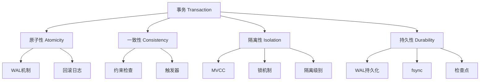
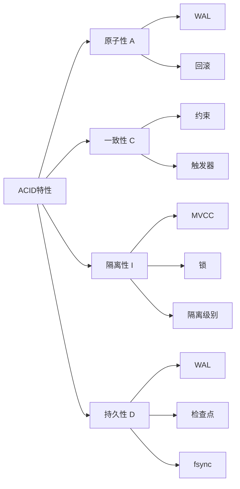
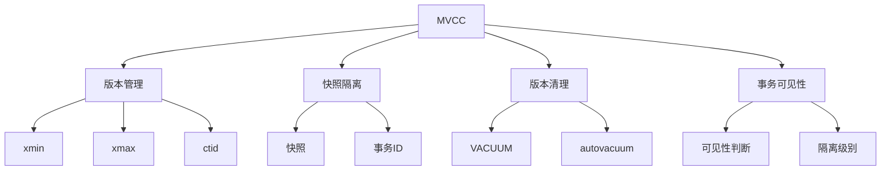
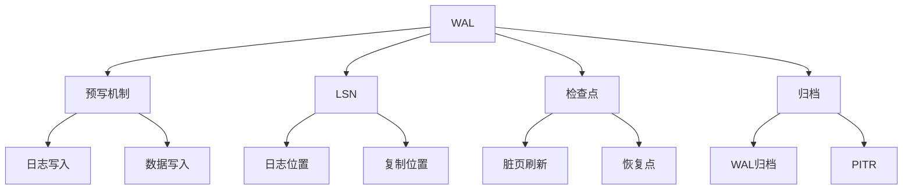
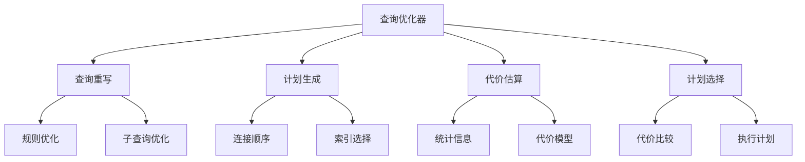
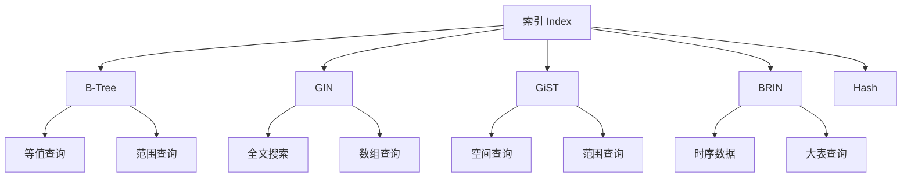
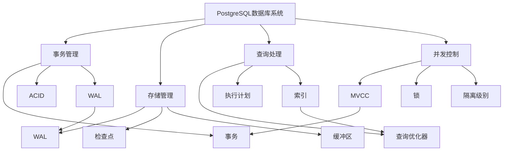
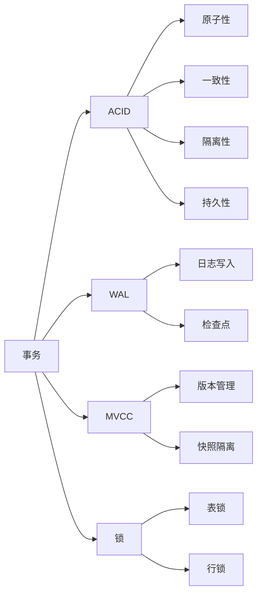
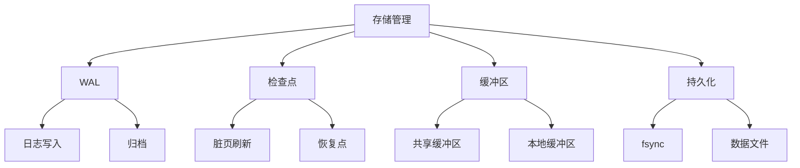
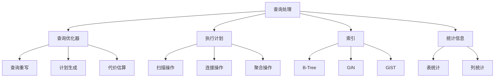

---

> **📋 文档来源**: `PostgreSQL\08-工具资源\08.06-概念定义与属性关系库.md`
> **📅 复制日期**: 2025-12-22
> **⚠️ 注意**: 本文档为复制版本，原文件保持不变

---

# PostgreSQL概念定义与属性关系库

> **版本**: v1.0
> **最后更新**: 2025-01-15
> **难度**: ⭐⭐⭐⭐
> **应用场景**: 知识体系构建、概念理解、关系分析

---

## 📑 目录

- [PostgreSQL概念定义与属性关系库](#postgresql概念定义与属性关系库)
  - [📑 目录](#-目录)
  - [一、概述](#一概述)
    - [1.1 概念库目标](#11-概念库目标)
    - [1.2 概念分类](#12-概念分类)
    - [1.3 使用指南](#13-使用指南)
  - [二、核心概念定义](#二核心概念定义)
    - [2.1 事务（Transaction）](#21-事务transaction)
      - [2.1.1 概念定义](#211-概念定义)
      - [2.1.2 形式化定义](#212-形式化定义)
      - [2.1.3 核心属性](#213-核心属性)
      - [2.1.4 属性关系图](#214-属性关系图)
      - [2.1.5 相关概念](#215-相关概念)
    - [2.2 ACID特性](#22-acid特性)
      - [2.2.1 概念定义](#221-概念定义)
      - [2.2.2 形式化定义](#222-形式化定义)
      - [2.2.3 核心属性](#223-核心属性)
      - [2.2.4 属性关系图](#224-属性关系图)
    - [2.3 MVCC（多版本并发控制）](#23-mvcc多版本并发控制)
      - [2.3.1 概念定义](#231-概念定义)
      - [2.3.2 形式化定义](#232-形式化定义)
      - [2.3.3 核心属性](#233-核心属性)
      - [2.3.4 属性关系图](#234-属性关系图)
      - [2.3.5 相关概念](#235-相关概念)
    - [2.4 WAL（预写日志）](#24-wal预写日志)
      - [2.4.1 概念定义](#241-概念定义)
      - [2.4.2 形式化定义](#242-形式化定义)
      - [2.4.3 核心属性](#243-核心属性)
      - [2.4.4 属性关系图](#244-属性关系图)
    - [2.5 查询优化器（Query Optimizer）](#25-查询优化器query-optimizer)
      - [2.5.1 概念定义](#251-概念定义)
      - [2.5.2 形式化定义](#252-形式化定义)
      - [2.5.3 核心属性](#253-核心属性)
      - [2.5.4 属性关系图](#254-属性关系图)
    - [2.6 索引（Index）](#26-索引index)
      - [2.6.1 概念定义](#261-概念定义)
      - [2.6.2 形式化定义](#262-形式化定义)
      - [2.6.3 核心属性](#263-核心属性)
      - [2.6.4 属性关系图](#264-属性关系图)
    - [2.7 分区（Partitioning）](#27-分区partitioning)
      - [2.7.1 概念定义](#271-概念定义)
      - [2.7.2 形式化定义](#272-形式化定义)
      - [2.7.3 核心属性](#273-核心属性)
    - [2.8 复制（Replication）](#28-复制replication)
      - [2.8.1 概念定义](#281-概念定义)
      - [2.8.2 核心属性](#282-核心属性)
    - [2.9 锁（Lock）](#29-锁lock)
      - [2.9.1 概念定义](#291-概念定义)
      - [2.9.2 核心属性](#292-核心属性)
    - [2.10 检查点（Checkpoint）](#210-检查点checkpoint)
      - [2.10.1 概念定义](#2101-概念定义)
      - [2.10.2 核心属性](#2102-核心属性)
  - [三、概念关系图谱](#三概念关系图谱)
    - [3.1 核心概念关系图](#31-核心概念关系图)
    - [3.2 事务相关概念关系](#32-事务相关概念关系)
    - [3.3 存储相关概念关系](#33-存储相关概念关系)
    - [3.4 查询相关概念关系](#34-查询相关概念关系)
  - [四、属性关系矩阵](#四属性关系矩阵)
    - [4.1 概念属性对比](#41-概念属性对比)
    - [4.2 概念依赖关系](#42-概念依赖关系)
  - [五、参考资源](#五参考资源)
    - [5.1 官方文档](#51-官方文档)
    - [5.2 相关文档](#52-相关文档)
    - [5.3 学术论文](#53-学术论文)

---

## 一、概述

### 1.1 概念库目标

PostgreSQL概念定义与属性关系库旨在提供PostgreSQL核心概念的标准化定义、属性关系和概念间的关系映射，支持知识体系构建和概念理解。

**核心目标**：

- **标准化定义**：提供中英文标准定义
- **形式化描述**：提供数学形式化定义
- **关系映射**：建立概念间的关系网络
- **属性分析**：分析概念的属性和特征

### 1.2 概念分类

**核心概念分类**：

1. **事务管理类**：事务、ACID、隔离级别、并发控制
2. **存储管理类**：WAL、检查点、缓冲区、持久化
3. **查询处理类**：查询优化器、执行计划、统计信息
4. **索引结构类**：B-Tree、GIN、GiST、BRIN
5. **高可用类**：复制、流复制、逻辑复制、故障转移

### 1.3 使用指南

**如何使用本概念库**：

1. **概念查找**：通过目录快速定位概念
2. **关系分析**：通过关系图谱理解概念间关系
3. **属性对比**：通过属性矩阵对比不同概念
4. **深入学习**：通过参考资源深入学习

---

## 二、核心概念定义

### 2.1 事务（Transaction）

#### 2.1.1 概念定义

**中文定义**：事务是数据库中的逻辑工作单元，由一系列数据库操作组成，具有ACID特性（原子性、一致性、隔离性、持久性）。事务要么全部成功执行，要么全部回滚，保证数据库的一致性状态。

**English Definition**: A transaction is a logical unit of work in a database, consisting of a sequence of database operations, with ACID properties (Atomicity, Consistency, Isolation, Durability). A transaction either fully succeeds or fully rolls back, ensuring database consistency.

#### 2.1.2 形式化定义

```latex
% 事务的形式化定义
\newcommand{\trans}{\mathcal{T}}
\newcommand{\op}{\mathcal{O}}
\newcommand{\state}{\mathcal{S}}

% 事务定义
\trans = \{\op_1, \op_2, \ldots, \op_n\}

% 事务状态转换
\state_{\text{begin}} \xrightarrow{\op_1} \state_1 \xrightarrow{\op_2} \cdots \xrightarrow{\op_n} \state_{\text{commit}}

% 原子性
\text{Atomicity}(\trans) \Leftrightarrow \forall \op_i \in \trans, \op_i \text{ 成功} \Rightarrow \trans \text{ 提交}
```

#### 2.1.3 核心属性

| 属性 | 说明 | 实现机制 |
|------|------|---------|
| **原子性** | 事务不可分割 | WAL、回滚日志 |
| **一致性** | 事务前后状态一致 | 约束检查、触发器 |
| **隔离性** | 并发事务相互隔离 | MVCC、锁机制 |
| **持久性** | 提交结果永久保存 | WAL、fsync |

#### 2.1.4 属性关系图



#### 2.1.5 相关概念

- **上位概念**：数据库操作、逻辑工作单元
- **下位概念**：BEGIN、COMMIT、ROLLBACK、SAVEPOINT
- **平行概念**：并发控制、事务日志、分布式事务

---

### 2.2 ACID特性

#### 2.2.1 概念定义

**中文定义**：ACID是数据库事务的四个基本特性，包括原子性（Atomicity）、一致性（Consistency）、隔离性（Isolation）和持久性（Durability）。这些特性确保数据库事务的可靠性和一致性。

**English Definition**: ACID is the four fundamental properties of database transactions: Atomicity, Consistency, Isolation, and Durability. These properties ensure the reliability and consistency of database transactions.

#### 2.2.2 形式化定义

```latex
% ACID特性的形式化定义
\begin{align}
\text{Atomicity: } & \forall \trans, \trans \text{ 要么完全执行，要么完全不执行} \\
\text{Consistency: } & \forall \trans, \state_{\text{before}} \models \text{constraints} \Rightarrow \state_{\text{after}} \models \text{constraints} \\
\text{Isolation: } & \forall \trans_1, \trans_2, \trans_1 \parallel \trans_2 \equiv \trans_1; \trans_2 \text{ 或 } \trans_2; \trans_1 \\
\text{Durability: } & \forall \trans, \commit(\trans) \Rightarrow \text{结果永久保存}
\end{align}
```

#### 2.2.3 核心属性

| 特性 | 定义 | PostgreSQL实现 |
|------|------|---------------|
| **A - 原子性** | 事务不可分割 | WAL、回滚段 |
| **C - 一致性** | 数据完整性约束 | 约束、触发器 |
| **I - 隔离性** | 并发事务隔离 | MVCC、锁 |
| **D - 持久性** | 提交结果永久 | WAL、fsync |

#### 2.2.4 属性关系图



---

### 2.3 MVCC（多版本并发控制）

#### 2.3.1 概念定义

**中文定义**：MVCC（Multi-Version Concurrency Control）是一种并发控制机制，通过为每个数据项维护多个版本来实现并发访问。每个事务看到数据的一致性快照，读操作不会阻塞写操作，写操作不会阻塞读操作。

**English Definition**: MVCC (Multi-Version Concurrency Control) is a concurrency control mechanism that maintains multiple versions of each data item to enable concurrent access. Each transaction sees a consistent snapshot of data, where read operations don't block write operations and vice versa.

#### 2.3.2 形式化定义

```latex
% MVCC的形式化定义
\newcommand{\version}{\mathcal{V}}
\newcommand{\snapshot}{\mathcal{S}}
\newcommand{\xid}{\text{xid}}

% 版本定义
\version = \{v_1, v_2, \ldots, v_n\}

% 每个版本 v_i = (data_i, xmin_i, xmax_i)
% 其中：
% - data_i: 版本数据
% - xmin_i: 创建版本的事务ID
% - xmax_i: 删除版本的事务ID

% 快照定义
\snapshot(\xid) = \{v_i \mid \xmin_i \leq \xid < \xmax_i\}
```

#### 2.3.3 核心属性

| 属性 | 说明 | 优势 |
|------|------|------|
| **版本管理** | 每个数据项维护多个版本 | 支持并发读写 |
| **快照隔离** | 事务看到一致性快照 | 避免读阻塞 |
| **版本清理** | VACUUM清理旧版本 | 控制存储增长 |
| **事务可见性** | 基于事务ID判断可见性 | 实现隔离级别 |

#### 2.3.4 属性关系图



#### 2.3.5 相关概念

- **上位概念**：并发控制、隔离机制
- **下位概念**：行版本、事务快照、VACUUM
- **平行概念**：锁机制、时间戳排序

---

### 2.4 WAL（预写日志）

#### 2.4.1 概念定义

**中文定义**：WAL（Write-Ahead Logging）是一种日志记录机制，要求所有数据修改必须先写入日志，然后才能写入数据文件。WAL确保数据库的持久性和可恢复性，支持故障恢复和复制。

**English Definition**: WAL (Write-Ahead Logging) is a logging mechanism that requires all data modifications to be written to the log before being written to data files. WAL ensures database durability and recoverability, supporting crash recovery and replication.

#### 2.4.2 形式化定义

```latex
% WAL的形式化定义
\newcommand{\wal}{\mathcal{W}}
\newcommand{\logentry}{\mathcal{L}}

% WAL协议
\text{WAL Protocol: } \forall \text{ write}(data), \text{ write}(\logentry) \rightarrow \text{ write}(data)

% 日志条目
\logentry = (\text{op}, \text{data}, \text{LSN}, \text{timestamp})

% 持久性保证
\text{Durability} \Leftrightarrow \forall \logentry, \text{ fsync}(\logentry) \text{ before commit}
```

#### 2.4.3 核心属性

| 属性 | 说明 | 作用 |
|------|------|------|
| **预写机制** | 先写日志后写数据 | 保证持久性 |
| **LSN（日志序列号）** | 日志位置标识 | 支持恢复和复制 |
| **检查点** | 定期刷新脏页 | 控制恢复时间 |
| **归档** | 保存历史WAL | 支持PITR |

#### 2.4.4 属性关系图



---

### 2.5 查询优化器（Query Optimizer）

#### 2.5.1 概念定义

**中文定义**：查询优化器是数据库系统的核心组件，负责将SQL查询转换为高效的执行计划。优化器通过代价模型评估不同的执行策略，选择代价最低的执行计划。

**English Definition**: The query optimizer is a core component of database systems that transforms SQL queries into efficient execution plans. The optimizer evaluates different execution strategies using a cost model and selects the plan with the lowest cost.

#### 2.5.2 形式化定义

```latex
% 查询优化器的形式化定义
\newcommand{\query}{\mathcal{Q}}
\newcommand{\plan}{\mathcal{P}}
\newcommand{\cost}{\text{cost}}

% 查询优化问题
\text{Optimize}(\query) = \arg\min_{\plan \in \text{Plans}(\query)} \cost(\plan)

% 代价函数
\cost(\plan) = \sum_{i=1}^{n} \cost(\op_i) + \cost(\text{IO}) + \cost(\text{CPU})
```

#### 2.5.3 核心属性

| 属性 | 说明 | 实现 |
|------|------|------|
| **查询重写** | SQL语法树转换 | 规则优化 |
| **计划生成** | 生成候选执行计划 | 动态规划 |
| **代价估算** | 评估计划代价 | 统计信息 |
| **计划选择** | 选择最优计划 | 代价比较 |

#### 2.5.4 属性关系图



---

### 2.6 索引（Index）

#### 2.6.1 概念定义

**中文定义**：索引是数据库中用于加速查询的数据结构，通过维护数据的有序组织来快速定位数据。PostgreSQL支持多种索引类型，包括B-Tree、GIN、GiST、BRIN等。

**English Definition**: An index is a data structure in databases used to accelerate queries by maintaining an ordered organization of data for fast data location. PostgreSQL supports multiple index types, including B-Tree, GIN, GiST, BRIN, etc.

#### 2.6.2 形式化定义

```latex
% 索引的形式化定义
\newcommand{\index}{\mathcal{I}}
\newcommand{\key}{\mathcal{K}}
\newcommand{\value}{\mathcal{V}}

% 索引定义
\index = \{(\key_i, \value_i) \mid i = 1, 2, \ldots, n\}

% 索引查找
\text{Lookup}(\index, \key) = \value_i \text{ where } \key_i = \key
```

#### 2.6.3 核心属性

| 属性 | 说明 | 索引类型 |
|------|------|---------|
| **查找速度** | O(log n)查找复杂度 | B-Tree |
| **存储开销** | 额外的存储空间 | 所有类型 |
| **维护成本** | 插入/更新/删除成本 | 所有类型 |
| **适用场景** | 不同查询模式 | 类型相关 |

#### 2.6.4 属性关系图



---

### 2.7 分区（Partitioning）

#### 2.7.1 概念定义

**中文定义**：分区是将大表分割成多个较小的物理表的技术，每个分区存储表的一部分数据。分区可以提高查询性能、简化数据管理，并支持分区裁剪优化。

**English Definition**: Partitioning is a technique that divides large tables into multiple smaller physical tables, where each partition stores a portion of the table's data. Partitioning improves query performance, simplifies data management, and supports partition pruning optimization.

#### 2.7.2 形式化定义

```latex
% 分区的形式化定义
\newcommand{\table}{\mathcal{T}}
\newcommand{\partition}{\mathcal{P}}

% 分区定义
\table = \bigcup_{i=1}^{n} \partition_i

% 分区裁剪
\text{Prune}(\query, \table) = \{\partition_i \mid \text{满足查询条件}\}
```

#### 2.7.3 核心属性

| 属性 | 说明 | 优势 |
|------|------|------|
| **分区键** | 用于分区的列 | 支持范围/列表/哈希分区 |
| **分区裁剪** | 查询时跳过无关分区 | 提高查询性能 |
| **并行处理** | 分区间并行查询 | 提高并发性能 |
| **数据管理** | 独立管理分区 | 简化维护 |

---

### 2.8 复制（Replication）

#### 2.8.1 概念定义

**中文定义**：复制是将数据库数据从一个主服务器复制到一个或多个备用服务器的过程。PostgreSQL支持物理复制和逻辑复制，用于高可用、负载均衡和灾难恢复。

**English Definition**: Replication is the process of copying database data from a primary server to one or more standby servers. PostgreSQL supports physical replication and logical replication for high availability, load balancing, and disaster recovery.

#### 2.8.2 核心属性

| 属性 | 说明 | 类型 |
|------|------|------|
| **物理复制** | 复制WAL数据 | 流复制 |
| **逻辑复制** | 复制逻辑变更 | 逻辑复制 |
| **同步/异步** | 复制模式 | 性能vs一致性 |
| **故障转移** | 自动切换 | 高可用 |

---

### 2.9 锁（Lock）

#### 2.9.1 概念定义

**中文定义**：锁是数据库系统中用于控制并发访问的机制，通过锁定资源来防止并发事务之间的冲突。PostgreSQL支持多种锁类型和锁模式，包括表锁、行锁、页锁等。

**English Definition**: A lock is a mechanism in database systems used to control concurrent access by locking resources to prevent conflicts between concurrent transactions. PostgreSQL supports multiple lock types and modes, including table locks, row locks, page locks, etc.

#### 2.9.2 核心属性

| 属性 | 说明 | 类型 |
|------|------|------|
| **锁粒度** | 锁定范围 | 表/页/行 |
| **锁模式** | 共享/排他 | 兼容性矩阵 |
| **死锁检测** | 自动检测死锁 | 死锁避免 |
| **锁超时** | 锁等待超时 | 避免长时间等待 |

---

### 2.10 检查点（Checkpoint）

#### 2.10.1 概念定义

**中文定义**：检查点是数据库系统定期将内存中的脏页刷新到磁盘的操作，用于控制恢复时间和WAL文件大小。检查点确保数据库可以在故障后从检查点位置快速恢复。

**English Definition**: A checkpoint is a periodic operation in database systems that flushes dirty pages from memory to disk, used to control recovery time and WAL file size. Checkpoints ensure the database can quickly recover from the checkpoint position after a crash.

#### 2.10.2 核心属性

| 属性 | 说明 | 配置 |
|------|------|------|
| **检查点频率** | 检查点间隔 | checkpoint_timeout |
| **WAL大小** | 触发检查点的WAL大小 | max_wal_size |
| **脏页刷新** | 刷新脏页到磁盘 | checkpoint_completion_target |
| **恢复时间** | 从检查点恢复的时间 | 与WAL大小相关 |

---

## 三、概念关系图谱

### 3.1 核心概念关系图



### 3.2 事务相关概念关系



### 3.3 存储相关概念关系



### 3.4 查询相关概念关系



---

## 四、属性关系矩阵

### 4.1 概念属性对比

| 概念 | 复杂度 | 性能影响 | 存储开销 | 维护成本 | 适用场景 |
|------|--------|---------|---------|---------|---------|
| **事务** | ⭐⭐⭐ | ⭐⭐⭐⭐ | ⭐ | ⭐⭐ | 所有场景 |
| **MVCC** | ⭐⭐⭐⭐⭐ | ⭐⭐⭐⭐⭐ | ⭐⭐⭐ | ⭐⭐⭐ | 高并发场景 |
| **WAL** | ⭐⭐⭐⭐ | ⭐⭐⭐ | ⭐⭐ | ⭐⭐ | 持久化需求 |
| **索引** | ⭐⭐⭐ | ⭐⭐⭐⭐⭐ | ⭐⭐⭐⭐ | ⭐⭐⭐ | 查询优化 |
| **分区** | ⭐⭐⭐⭐ | ⭐⭐⭐⭐ | ⭐ | ⭐⭐⭐ | 大表场景 |
| **复制** | ⭐⭐⭐⭐ | ⭐⭐ | ⭐⭐ | ⭐⭐⭐⭐ | 高可用场景 |

### 4.2 概念依赖关系

| 概念 | 依赖概念 | 被依赖概念 | 关系强度 |
|------|---------|-----------|---------|
| **事务** | - | ACID、WAL、MVCC | ⭐⭐⭐⭐⭐ |
| **ACID** | 事务 | WAL、MVCC、锁 | ⭐⭐⭐⭐⭐ |
| **MVCC** | 事务、WAL | 隔离级别、VACUUM | ⭐⭐⭐⭐⭐ |
| **WAL** | - | 事务、检查点、复制 | ⭐⭐⭐⭐⭐ |
| **查询优化器** | 统计信息 | 索引、执行计划 | ⭐⭐⭐⭐ |
| **索引** | 表 | 查询优化器、执行计划 | ⭐⭐⭐⭐ |
| **分区** | 表 | 查询优化器 | ⭐⭐⭐ |
| **复制** | WAL | 高可用、负载均衡 | ⭐⭐⭐⭐ |

---

## 五、参考资源

### 5.1 官方文档

- [PostgreSQL官方文档](https://www.postgresql.org/docs/)
- [PostgreSQL概念](https://www.postgresql.org/docs/current/tutorial-concepts.html)

### 5.2 相关文档

- `01-核心基础/01.04-事务管理与ACID特性.md`
- `01-核心基础/01.05-并发控制与MVCC机制.md`
- `01-核心基础/01.06-存储管理与数据持久化.md`
- `02-查询处理/02.01-查询优化器原理.md`
- `02-查询处理/02.02-索引结构与优化.md`

### 5.3 学术论文

1. Berenson, H., et al. (1995). A critique of ANSI SQL isolation levels. ACM SIGMOD Record.
2. Cahill, M. J., et al. (2008). Serializable isolation for snapshot databases. ACM SIGMOD.
3. Graefe, G. (1995). The Cascades framework for query optimization. IEEE Data Engineering Bulletin.

---

**维护者**: Data-Science Team
**最后更新**: 2025-01-15
**版本**: 1.0
