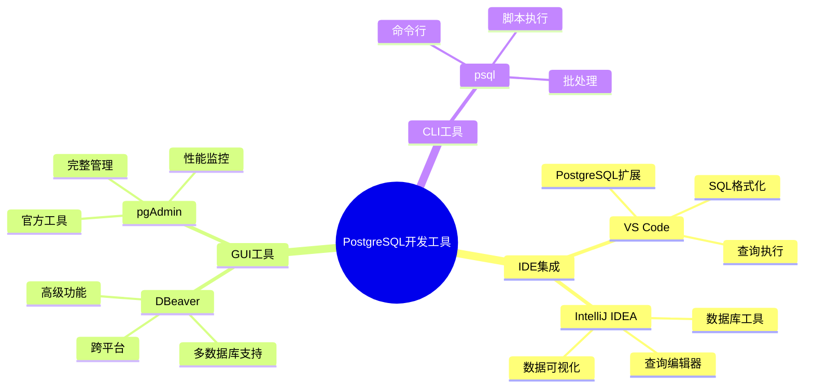
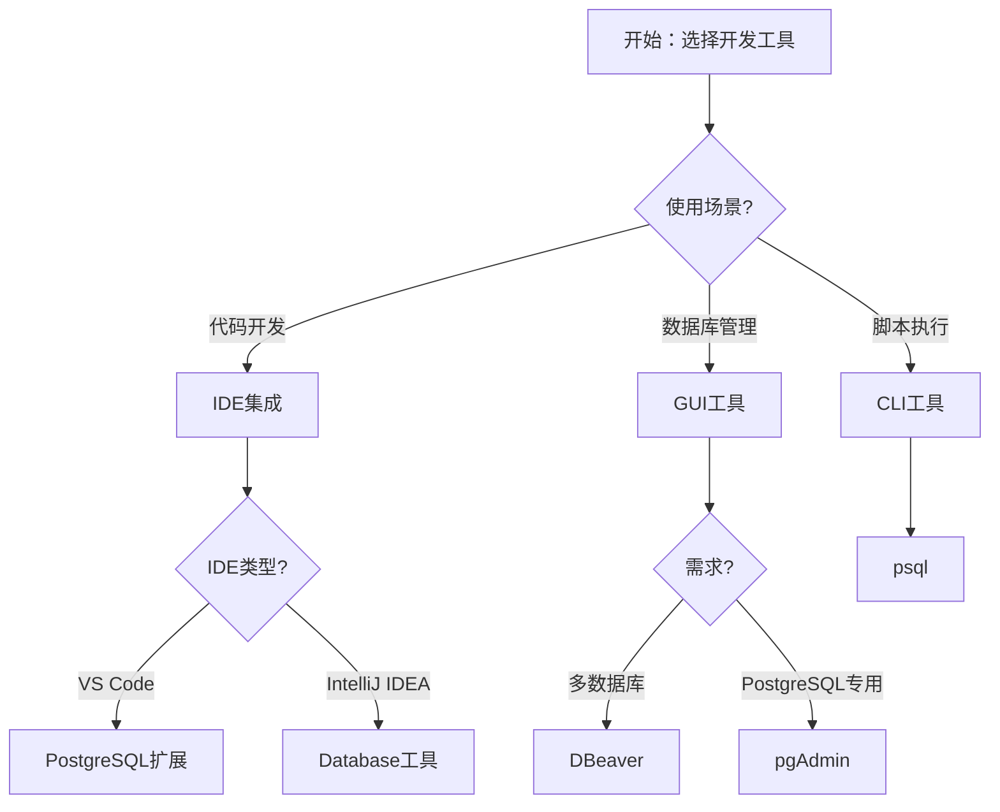

# PostgreSQL开发工具与IDE集成指南

## 元数据

- **文档版本**: v1.0
- **创建日期**: 2025-01
- **技术栈**: PostgreSQL 17+/18+ | VS Code | IntelliJ IDEA | DBeaver | pgAdmin | 开发工具
- **难度级别**: ⭐⭐⭐ (中级)
- **预计阅读**: 150分钟
- **前置要求**: 熟悉PostgreSQL基础、开发工具基础

---

## 📋 完整目录

- [PostgreSQL开发工具与IDE集成指南](#postgresql开发工具与ide集成指南)
  - [元数据](#元数据)
  - [📋 完整目录](#-完整目录)
  - [1. 开发工具概述](#1-开发工具概述)
    - [1.1 工具分类](#11-工具分类)
    - [1.2 工具选型决策流程图](#12-工具选型决策流程图)
  - [2. VS Code集成](#2-vs-code集成)
    - [2.1 PostgreSQL扩展安装](#21-postgresql扩展安装)
    - [2.2 连接配置](#22-连接配置)
    - [2.3 查询执行](#23-查询执行)
  - [3. IntelliJ IDEA集成](#3-intellij-idea集成)
    - [3.1 数据库工具配置](#31-数据库工具配置)
    - [3.2 查询编辑器](#32-查询编辑器)
    - [3.3 数据可视化](#33-数据可视化)
  - [4. DBeaver集成](#4-dbeaver集成)
    - [4.1 连接配置](#41-连接配置)
    - [4.2 高级功能](#42-高级功能)
  - [5. pgAdmin集成](#5-pgadmin集成)
    - [5.1 安装配置](#51-安装配置)
    - [5.2 管理功能](#52-管理功能)
  - [6. 工具对比与选型](#6-工具对比与选型)
    - [6.1 功能对比矩阵](#61-功能对比矩阵)
    - [6.2 选型决策](#62-选型决策)
  - [7. 综合选型案例](#7-综合选型案例)
  - [📚 参考资源](#-参考资源)
  - [📝 更新日志](#-更新日志)

---

## 1. 开发工具概述

### 1.1 工具分类

**开发工具分类**:



### 1.2 工具选型决策流程图



---

## 2. VS Code集成

### 2.1 PostgreSQL扩展安装

**安装步骤**:

```bash
# 在VS Code中安装PostgreSQL扩展
# 扩展名称: PostgreSQL (by Chris Kolkman)
# 扩展ID: ckolkman.vscode-postgres

# 或使用命令行
code --install-extension ckolkman.vscode-postgres
```

**扩展功能**:
- SQL语法高亮
- 代码补全
- 查询执行
- 结果可视化
- 连接管理

### 2.2 连接配置

**配置示例**:

```json
// .vscode/settings.json
{
  "postgres.connections": [
    {
      "host": "localhost",
      "port": 5432,
      "database": "mydb",
      "username": "postgres",
      "password": "password",
      "name": "Local PostgreSQL"
    }
  ]
}
```

### 2.3 查询执行

**使用方式**:

```sql
-- 在VS Code中执行SQL查询
-- 1. 打开SQL文件
-- 2. 选择查询语句
-- 3. 右键选择"Execute Query"
-- 4. 查看结果

SELECT * FROM users WHERE id > 100;
```

---

## 3. IntelliJ IDEA集成

### 3.1 数据库工具配置

**配置步骤**:

1. 打开Database工具窗口
2. 添加PostgreSQL数据源
3. 配置连接参数
4. 测试连接

**连接配置**:

```yaml
# IntelliJ IDEA数据库配置
Host: localhost
Port: 5432
Database: mydb
User: postgres
Password: password
Driver: PostgreSQL
```

### 3.2 查询编辑器

**功能特性**:
- SQL语法高亮
- 代码补全
- 查询执行
- 结果表格
- 导出功能

---

## 4. DBeaver集成

### 4.1 连接配置

**连接步骤**:

1. 新建数据库连接
2. 选择PostgreSQL
3. 配置连接参数
4. 测试连接

**高级配置**:

```properties
# DBeaver连接配置
Host: localhost
Port: 5432
Database: mydb
Username: postgres
Password: password
Show all databases: true
Show system databases: false
```

### 4.2 高级功能

**功能列表**:
- ER图生成
- 数据导入导出
- SQL脚本执行
- 数据对比
- 备份恢复

---

## 5. pgAdmin集成

### 5.1 安装配置

**安装方式**:

```bash
# Ubuntu/Debian
sudo apt-get install pgadmin4

# CentOS/RHEL
sudo yum install pgadmin4

# macOS
brew install pgadmin4

# Windows
# 下载安装包从官网
```

### 5.2 管理功能

**功能特性**:
- 服务器管理
- 数据库管理
- 表管理
- 查询工具
- 性能监控
- 备份恢复

---

## 6. 工具对比与选型

### 6.1 功能对比矩阵

| 功能 | VS Code | IntelliJ IDEA | DBeaver | pgAdmin |
|------|---------|---------------|---------|---------|
| **SQL编辑** | ✅ | ✅ | ✅ | ✅ |
| **查询执行** | ✅ | ✅ | ✅ | ✅ |
| **数据可视化** | ✅ | ✅ | ✅ | ✅ |
| **ER图** | ❌ | ✅ | ✅ | ✅ |
| **性能监控** | ❌ | ❌ | ✅ | ✅ |
| **备份恢复** | ❌ | ❌ | ✅ | ✅ |
| **多数据库** | ❌ | ✅ | ✅ | ❌ |
| **免费** | ✅ | ❌ | ✅ | ✅ |

### 6.2 选型决策

**选型建议**:

- ✅ **VS Code**: 轻量级开发、代码编辑
- ✅ **IntelliJ IDEA**: Java开发、企业级IDE
- ✅ **DBeaver**: 多数据库管理、跨平台
- ✅ **pgAdmin**: PostgreSQL专用、完整管理

---

## 7. 综合选型案例

### 7.1 案例1：开发团队工具选型

**业务背景**:
- 开发团队
- 多数据库支持
- 代码开发

**选型方案**:

```text
开发环境：
- VS Code + PostgreSQL扩展（代码开发）
- DBeaver（数据库管理）

生产环境：
- pgAdmin（PostgreSQL管理）
- psql（脚本执行）
```

---

## 📚 参考资源

### 官方文档

- [VS Code PostgreSQL扩展](https://marketplace.visualstudio.com/items?itemName=ckolkman.vscode-postgres)
- [IntelliJ IDEA数据库工具](https://www.jetbrains.com/help/idea/connecting-to-a-database.html)
- [DBeaver文档](https://dbeaver.com/docs/)
- [pgAdmin文档](https://www.pgadmin.org/docs/)

### 相关文档

- [工具脚本集合](./README.md)

---

## 📝 更新日志

- **2025-01**: 初始版本创建
  - 完成VS Code集成
  - 完成IntelliJ IDEA集成
  - 完成DBeaver集成
  - 完成pgAdmin集成
  - 完成工具对比与选型

---

**最后更新**: 2025年1月
**状态**: ✅ 完成
