---

> **📋 文档来源**: `PostgreSQL\08-工具资源\PostgreSQL知识图谱.md`
> **📅 复制日期**: 2025-12-22
> **⚠️ 注意**: 本文档为复制版本，原文件保持不变

---

# PostgreSQL知识图谱

## 1. 概述

### 1.1 知识图谱目标

构建PostgreSQL完整的概念关系图谱，实现知识的结构化组织和语义化表示，支持智能查询和知识发现。

### 1.2 知识图谱范围

- 核心概念关系映射
- 技术依赖关系分析
- 应用场景关联
- 性能特征关联
- 最佳实践推荐

## 2. 概念关系模型

### 2.1 核心概念层次结构

```mermaid
graph TD
    A[PostgreSQL数据库系统] --> B[系统架构]
    A --> C[数据模型]
    A --> D[查询处理]
    A --> E[事务管理]
    A --> F[存储管理]
    A --> G[安全机制]

    B --> B1[进程模型]
    B --> B2[内存管理]
    B --> B3[存储系统]
    B --> B4[网络协议]

    C --> C1[关系数据模型]
    C --> C2[SQL语言]
    C --> C3[索引结构]
    C --> C4[扩展系统]

    D --> D1[查询优化]
    D --> D2[执行计划]
    D --> D3[并发控制]
    D --> D4[流式处理]

    E --> E1[ACID性质]
    E --> E2[隔离级别]
    E --> E3[分布式事务]
    E --> E4[故障恢复]

    F --> F1[缓冲区管理]
    F --> F2[WAL日志]
    F --> F3[检查点]
    F --> F4[备份恢复]

    G --> G1[访问控制]
    G --> G2[数据加密]
    G --> G3[审计日志]
    G --> G4[行级安全]
```



### 2.2 技术依赖关系

```mermaid
graph LR
    A[应用层] --> B[SQL接口]
    B --> C[查询优化器]
    C --> D[执行引擎]
    D --> E[存储引擎]
    E --> F[文件系统]

    G[事务管理器] --> D
    H[锁管理器] --> D
    I[WAL管理器] --> E
    J[缓冲区管理器] --> E
```



## 3. 知识图谱实现

### 3.1 概念实体定义

```sql
-- 概念实体表
CREATE TABLE concepts (
    concept_id SERIAL PRIMARY KEY,
    concept_name VARCHAR(200) UNIQUE NOT NULL,
    concept_type VARCHAR(50), -- 'core', 'advanced', 'application'
    definition_zh TEXT,
    definition_en TEXT,
    formal_definition TEXT, -- LaTeX格式
    complexity_level INTEGER, -- 1-5级复杂度
    created_at TIMESTAMP DEFAULT CURRENT_TIMESTAMP
);

-- 概念关系表
CREATE TABLE concept_relations (
    relation_id SERIAL PRIMARY KEY,
    source_concept_id INTEGER REFERENCES concepts(concept_id),
    target_concept_id INTEGER REFERENCES concepts(concept_id),
    relation_type VARCHAR(50), -- 'depends_on', 'implements', 'extends', 'uses'
    relation_strength DECIMAL(3,2), -- 关系强度 0-1
    description TEXT,
    created_at TIMESTAMP DEFAULT CURRENT_TIMESTAMP
);

-- 应用场景表
CREATE TABLE application_scenarios (
    scenario_id SERIAL PRIMARY KEY,
    scenario_name VARCHAR(200),
    description TEXT,
    complexity_level INTEGER,
    performance_requirements JSONB,
    created_at TIMESTAMP DEFAULT CURRENT_TIMESTAMP
);

-- 概念-场景关联表
CREATE TABLE concept_scenario_mapping (
    mapping_id SERIAL PRIMARY KEY,
    concept_id INTEGER REFERENCES concepts(concept_id),
    scenario_id INTEGER REFERENCES application_scenarios(scenario_id),
    relevance_score DECIMAL(3,2), -- 相关性评分 0-1
    usage_pattern TEXT,
    created_at TIMESTAMP DEFAULT CURRENT_TIMESTAMP
);
```

### 3.2 知识图谱查询

```sql
-- 查询概念依赖关系
WITH RECURSIVE concept_dependencies AS (
    -- 基础查询：直接依赖
    SELECT
        c1.concept_name as source,
        c2.concept_name as target,
        cr.relation_type,
        1 as depth,
        ARRAY[c1.concept_id, c2.concept_id] as path
    FROM concept_relations cr
    JOIN concepts c1 ON cr.source_concept_id = c1.concept_id
    JOIN concepts c2 ON cr.target_concept_id = c2.concept_id
    WHERE c1.concept_name = '查询优化'

    UNION ALL

    -- 递归查询：间接依赖
    SELECT
        cd.source,
        c3.concept_name,
        cr2.relation_type,
        cd.depth + 1,
        cd.path || c3.concept_id
    FROM concept_dependencies cd
    JOIN concept_relations cr2 ON cd.target = cr2.source_concept_id
    JOIN concepts c3 ON cr2.target_concept_id = c3.concept_id
    WHERE cd.depth < 3
    AND c3.concept_id != ALL(cd.path)
)
SELECT DISTINCT source, target, relation_type, depth
FROM concept_dependencies
ORDER BY depth, target;
```

### 3.3 智能推荐系统

```sql
-- 基于概念相似性的推荐
WITH concept_similarity AS (
    SELECT
        c1.concept_id as concept1,
        c2.concept_id as concept2,
        COUNT(DISTINCT cr1.target_concept_id) as common_dependencies,
        COUNT(DISTINCT cr1.target_concept_id) + COUNT(DISTINCT cr2.target_concept_id) as total_dependencies
    FROM concepts c1
    CROSS JOIN concepts c2
    LEFT JOIN concept_relations cr1 ON c1.concept_id = cr1.source_concept_id
    LEFT JOIN concept_relations cr2 ON c2.concept_id = cr2.source_concept_id
    WHERE c1.concept_id != c2.concept_id
    GROUP BY c1.concept_id, c2.concept_id
    HAVING COUNT(DISTINCT cr1.target_concept_id) > 0
)
SELECT
    c1.concept_name as source_concept,
    c2.concept_name as recommended_concept,
    cs.common_dependencies::DECIMAL / cs.total_dependencies as similarity_score
FROM concept_similarity cs
JOIN concepts c1 ON cs.concept1 = c1.concept_id
JOIN concepts c2 ON cs.concept2 = c2.concept_id
WHERE c1.concept_name = '事务管理'
ORDER BY similarity_score DESC
LIMIT 10;
```

## 4. 应用场景分析

### 4.1 学习路径推荐

```sql
-- 基于复杂度的学习路径
WITH learning_path AS (
    SELECT
        concept_id,
        concept_name,
        complexity_level,
        ROW_NUMBER() OVER (ORDER BY complexity_level, concept_name) as learning_order
    FROM concepts
    WHERE concept_type = 'core'
)
SELECT
    learning_order,
    concept_name,
    complexity_level,
    CASE
        WHEN complexity_level <= 2 THEN '基础概念'
        WHEN complexity_level <= 3 THEN '进阶概念'
        ELSE '高级概念'
    END as difficulty_level
FROM learning_path
ORDER BY learning_order;
```

### 4.2 性能优化建议

```sql
-- 基于应用场景的性能优化建议
SELECT
    cs.scenario_name,
    c.concept_name,
    csm.relevance_score,
    csm.usage_pattern,
    as2.performance_requirements
FROM concept_scenario_mapping csm
JOIN concepts c ON csm.concept_id = c.concept_id
JOIN application_scenarios cs ON csm.scenario_id = cs.scenario_id
JOIN application_scenarios as2 ON cs.scenario_id = as2.scenario_id
WHERE c.concept_name IN ('索引结构', '查询优化', '并发控制')
AND csm.relevance_score > 0.7
ORDER BY cs.scenario_name, csm.relevance_score DESC;
```

## 5. 知识图谱可视化

### 5.1 概念关系图

```python
import networkx as nx
import matplotlib.pyplot as plt

def create_concept_graph():
    """创建概念关系图"""
    G = nx.DiGraph()

    # 添加节点
    concepts = [
        'PostgreSQL', '系统架构', '数据模型', '查询处理',
        '事务管理', '存储管理', '安全机制', '索引结构',
        '查询优化', '并发控制', 'WAL日志', '缓冲区管理'
    ]

    for concept in concepts:
        G.add_node(concept)

    # 添加边
    edges = [
        ('PostgreSQL', '系统架构'),
        ('PostgreSQL', '数据模型'),
        ('PostgreSQL', '查询处理'),
        ('PostgreSQL', '事务管理'),
        ('PostgreSQL', '存储管理'),
        ('PostgreSQL', '安全机制'),
        ('查询处理', '查询优化'),
        ('查询处理', '索引结构'),
        ('事务管理', '并发控制'),
        ('存储管理', 'WAL日志'),
        ('存储管理', '缓冲区管理')
    ]

    G.add_edges_from(edges)

    # 绘制图形
    plt.figure(figsize=(12, 8))
    pos = nx.spring_layout(G, k=1, iterations=50)
    nx.draw(G, pos, with_labels=True, node_color='lightblue',
            node_size=2000, font_size=10, font_weight='bold',
            arrows=True, edge_color='gray', arrowsize=20)
    plt.title('PostgreSQL概念关系图')
    plt.show()
```

### 5.2 依赖关系分析

```python
def analyze_dependencies():
    """分析概念依赖关系"""
    # 计算入度和出度
    in_degrees = dict(G.in_degree())
    out_degrees = dict(G.out_degree())

    # 找出核心概念（高入度）
    core_concepts = sorted(in_degrees.items(), key=lambda x: x[1], reverse=True)[:5]

    # 找出基础概念（高出度）
    foundational_concepts = sorted(out_degrees.items(), key=lambda x: x[1], reverse=True)[:5]

    print("核心概念（被依赖最多）:")
    for concept, degree in core_concepts:
        print(f"  {concept}: {degree}")

    print("\n基础概念（依赖最多）:")
    for concept, degree in foundational_concepts:
        print(f"  {concept}: {degree}")
```

## 6. 知识图谱应用

### 6.1 智能问答系统

```python
def intelligent_qa(question):
    """智能问答系统"""
    # 概念识别
    concepts = extract_concepts(question)

    # 关系查询
    relationships = query_relationships(concepts)

    # 答案生成
    answer = generate_answer(concepts, relationships)

    return answer

def extract_concepts(question):
    """从问题中提取概念"""
    # 使用NLP技术识别PostgreSQL相关概念
    concepts = []
    for concept in all_concepts:
        if concept.lower() in question.lower():
            concepts.append(concept)
    return concepts
```

### 6.2 学习路径规划

```python
def plan_learning_path(target_concept, current_knowledge):
    """规划学习路径"""
    # 计算知识差距
    knowledge_gap = calculate_knowledge_gap(target_concept, current_knowledge)

    # 生成学习路径
    learning_path = generate_learning_path(knowledge_gap)

    # 优化学习顺序
    optimized_path = optimize_learning_order(learning_path)

    return optimized_path
```

## 7. 知识图谱维护

### 7.1 自动更新机制

```python
def update_knowledge_graph():
    """更新知识图谱"""
    # 检测新概念
    new_concepts = detect_new_concepts()

    # 更新关系
    updated_relations = update_relations()

    # 验证一致性
    validate_consistency()

    # 生成更新报告
    generate_update_report()
```

### 7.2 质量监控

```python
def monitor_knowledge_quality():
    """监控知识图谱质量"""
    metrics = {
        'completeness': calculate_completeness(),
        'consistency': calculate_consistency(),
        'accuracy': calculate_accuracy(),
        'coverage': calculate_coverage()
    }

    return metrics
```

## 8. 总结

PostgreSQL知识图谱建立了完整的知识组织体系：

1. **结构化知识表示**: 概念、关系、属性的结构化组织
2. **智能查询支持**: 支持复杂的知识查询和推理
3. **学习路径规划**: 基于知识图谱的学习路径推荐
4. **应用场景关联**: 概念与实际应用场景的关联分析
5. **持续更新机制**: 自动化的知识图谱维护和更新

通过知识图谱，用户可以更好地理解PostgreSQL的知识体系，发现概念间的关联关系，规划学习路径，并获得智能化的知识服务。
