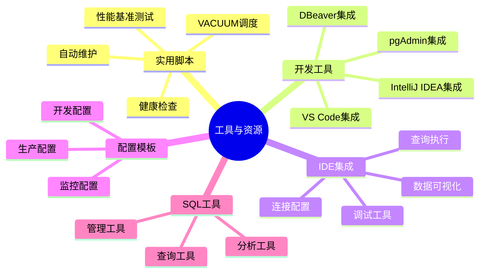
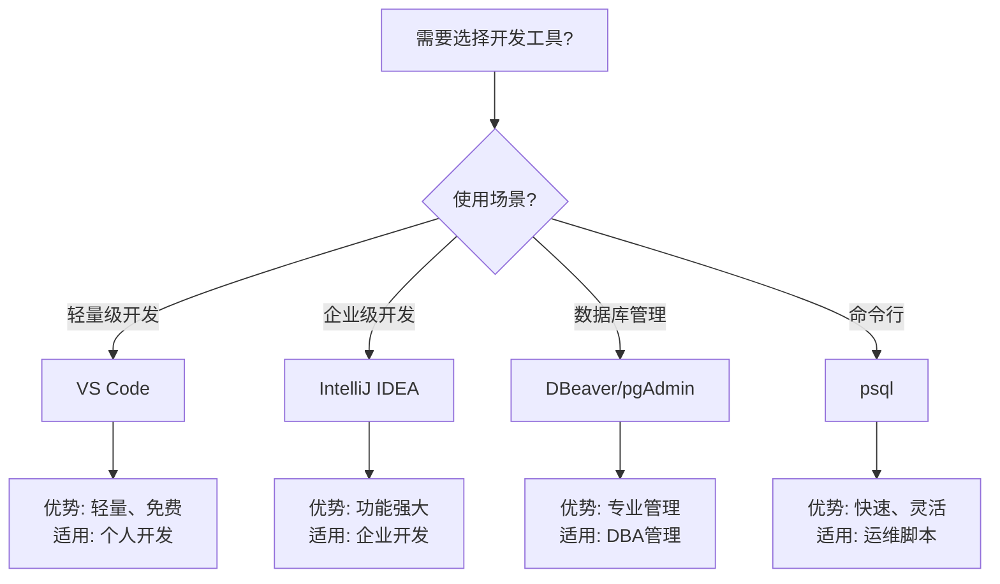

---

> **📋 文档来源**: `scripts\README.md`
> **📅 复制日期**: 2025-12-22
> **⚠️ 注意**: 本文档为复制版本，原文件保持不变

---

# 22-工具与资源

> **文档总数**: 10+个文档
> **覆盖领域**: 实用脚本、开发工具、IDE集成、配置模板、SQL工具
> **版本覆盖**: PostgreSQL 18.x (推荐) ⭐ | 17.x (推荐) | 16.x (兼容)
> **最后更新**: 2025年1月

---

## 📊 知识体系思维导图



---

# PostgreSQL 18 实用脚本集合

本目录包含生产级的PostgreSQL管理脚本，覆盖性能测试、健康检查、自动维护等场景。

---

## 📂 脚本列表

### 1. performance-benchmark.sh

**全面性能基准测试脚本**

```bash
# 运行完整基准测试
chmod +x performance-benchmark.sh
./performance-benchmark.sh

# 自定义配置
SCALE=50 CLIENTS=20 ./performance-benchmark.sh
```

**测试内容**:

- ✅ pgbench标准基准测试
- ✅ OLTP性能测试（插入、查询、更新）
- ✅ PostgreSQL 18特性测试（异步I/O、Skip Scan）
- ✅ 并发性能测试
- ✅ 自动生成测试报告

**输出**: `benchmark_report_YYYYMMDD_HHMMSS.md`

---

### 2. health-check-advanced.py

**PostgreSQL 18高级健康检查**

```bash
# 基础检查
python3 health-check-advanced.py --dbname mydb

# JSON输出
python3 health-check-advanced.py --dbname mydb --json

# 远程数据库
python3 health-check-advanced.py \
    --host prod-db.example.com \
    --port 5432 \
    --dbname production \
    --user dba_user \
    --password secret
```

**检查项目**:

- ✅ PostgreSQL版本
- ✅ PostgreSQL 18新特性配置（异步I/O、Skip Scan）
- ✅ 连接数使用率
- ✅ 缓存命中率
- ✅ 表膨胀检测
- ✅ 锁等待检测
- ✅ 长事务检测
- ✅ 复制状态
- ✅ 磁盘空间
- ✅ 重要扩展安装情况

**退出码**:

- `0`: 所有检查通过
- `1`: 有警告项
- `2`: 有严重问题
- `3`: 执行错误

---

### 3. vacuum-scheduler.py

**智能VACUUM调度器**

```bash
# DRY-RUN模式（查看计划）
python3 vacuum-scheduler.py --dbname mydb --dry-run

# 自动执行VACUUM
python3 vacuum-scheduler.py --dbname mydb --auto

# 深度VACUUM
python3 vacuum-scheduler.py --dbname mydb --auto --deep

# VACUUM FULL（会锁表，维护窗口使用）
python3 vacuum-scheduler.py --dbname mydb --auto --full
```

**功能**:

- ✅ 自动分析表膨胀情况
- ✅ 按优先级分类（严重/高/普通/低）
- ✅ 智能调度VACUUM操作
- ✅ 生成cron任务建议
- ✅ DRY-RUN模式预览

**优先级分类**:

- 🔴 **严重**: 死元组>20% 或 >100K行
- 🟠 **高**: 死元组10-20% 或 >50K行
- 🟡 **普通**: 死元组5-10% 或 >10K行
- 🟢 **低**: 死元组<5%

---

## 🔧 通用配置

### 环境变量

```bash
# 设置默认连接参数
export PGHOST=localhost
export PGPORT=5432
export PGUSER=postgres
export PGDATABASE=mydb
export PGPASSWORD=your_password

# 使用.pgpass文件（推荐）
echo "localhost:5432:*:postgres:password" > ~/.pgpass
chmod 600 ~/.pgpass
```

### 依赖安装

```bash
# Python依赖
pip3 install psycopg2-binary

# PostgreSQL客户端工具
# Ubuntu/Debian
sudo apt-get install postgresql-client

# CentOS/RHEL
sudo yum install postgresql

# macOS
brew install postgresql
```

---

## 📅 定时任务配置

### Crontab示例

```bash
# 编辑crontab
crontab -e

# 每日凌晨3点健康检查
0 3 * * * /usr/bin/python3 /path/to/health-check-advanced.py --dbname mydb --json >> /var/log/pg-health.log 2>&1

# 每日凌晨4点智能VACUUM
0 4 * * * /usr/bin/python3 /path/to/vacuum-scheduler.py --dbname mydb --auto >> /var/log/pg-vacuum.log 2>&1

# 每周日凌晨2点性能基准测试
0 2 * * 0 /path/to/performance-benchmark.sh >> /var/log/pg-benchmark.log 2>&1

# 每月1日凌晨1点深度维护
0 1 1 * * /usr/bin/python3 /path/to/vacuum-scheduler.py --dbname mydb --auto --deep >> /var/log/pg-maintenance.log 2>&1
```

### Systemd定时器

```ini
# /etc/systemd/system/pg-health-check.service
[Unit]
Description=PostgreSQL Health Check

[Service]
Type=oneshot
ExecStart=/usr/bin/python3 /opt/scripts/health-check-advanced.py --dbname mydb
User=postgres

# /etc/systemd/system/pg-health-check.timer
[Unit]
Description=PostgreSQL Health Check Timer

[Timer]
OnCalendar=daily
OnCalendar=03:00
Persistent=true

[Install]
WantedBy=timers.target

# 启用
sudo systemctl enable pg-health-check.timer
sudo systemctl start pg-health-check.timer
```

---

## 📊 监控集成

### Prometheus集成

```python
# 导出健康检查指标到Prometheus
from prometheus_client import CollectorRegistry, Gauge, push_to_gateway

registry = CollectorRegistry()

# 定义指标
cache_hit_ratio = Gauge('pg_cache_hit_ratio', 'Cache hit ratio', registry=registry)
connections_usage = Gauge('pg_connections_usage', 'Connections usage percentage', registry=registry)

# 推送到Pushgateway
push_to_gateway('localhost:9091', job='postgresql_health', registry=registry)
```

### Grafana仪表板

导入预配置的Grafana仪表板:

- `../configs/grafana-dashboards/postgresql-health.json`
- `../configs/grafana-dashboards/postgresql-performance.json`

---

## 🛡️ 安全最佳实践

### 1. 凭证管理

```bash
# 使用.pgpass（推荐）
echo "hostname:port:database:username:password" > ~/.pgpass
chmod 600 ~/.pgpass

# 环境变量（临时）
export PGPASSWORD=secret
python3 script.py
unset PGPASSWORD

# 密钥管理（生产）
# 使用Vault、AWS Secrets Manager等
```

### 2. 最小权限

```sql
-- 健康检查用户（只读）
CREATE USER health_check_user WITH PASSWORD 'password';
GRANT CONNECT ON DATABASE mydb TO health_check_user;
GRANT pg_monitor TO health_check_user;

-- VACUUM用户
CREATE USER vacuum_user WITH PASSWORD 'password';
GRANT CONNECT ON DATABASE mydb TO vacuum_user;
GRANT ALL PRIVILEGES ON ALL TABLES IN SCHEMA public TO vacuum_user;
```

### 3. 审计日志

```bash
# 记录所有脚本执行
exec > >(tee -a /var/log/pg-scripts.log)
exec 2>&1

echo "[$(date)] 开始执行 $0"
# ... 脚本内容 ...
echo "[$(date)] 执行完成"
```

---

## 🐛 故障排查

### 常见问题

**1. 连接失败**

```bash
# 检查PostgreSQL是否运行
systemctl status postgresql

# 检查连接配置
psql -h localhost -p 5432 -U postgres -c "SELECT 1;"

# 检查pg_hba.conf
sudo cat /etc/postgresql/18/main/pg_hba.conf
```

**2. 权限不足**

```bash
# 检查用户权限
psql -c "\du username"

# 授予必要权限
psql -c "GRANT pg_monitor TO username;"
```

**3. 脚本执行错误**

```bash
# 启用详细日志
python3 -v script.py --dbname mydb

# 查看PostgreSQL日志
tail -f /var/log/postgresql/postgresql-18-main.log
```

---

## 📖 相关文档

- [性能调优实战指南](../02-查询与优化/02.06-性能调优/README.md) - 性能调优完整指南
- [生产环境检查清单](../11-部署架构/README.md) - 部署架构与检查清单
- [VACUUM增强完整指南](../04-存储与恢复/README.md) - 存储与恢复相关
- [工具与资源](./README.md) - 工具脚本集合

---

## 🤝 贡献指南

欢迎提交新脚本或改进建议！

**脚本要求**:

- ✅ 生产级质量
- ✅ 完整的错误处理
- ✅ 详细的帮助文档
- ✅ 单元测试（可选）
- ✅ 性能优化

---

## 📄 许可证

这些脚本遵循项目整体许可证，可自由使用、修改和分发。

---

**维护**: 定期更新以支持PostgreSQL新版本
**支持**: 欢迎提Issue反馈问题

---

---

## 📚 开发工具集成

- **[PostgreSQL开发工具与IDE集成指南.md](./PostgreSQL开发工具与IDE集成指南.md)** ⭐⭐⭐⭐⭐ ⭐ 新增
  - VS Code集成（PostgreSQL扩展、连接配置、查询执行）
  - IntelliJ IDEA集成（数据库工具、查询编辑器、数据可视化）
  - DBeaver集成（连接配置、高级功能）
  - pgAdmin集成（安装配置、管理功能）
  - 工具对比与选型（功能对比矩阵、选型决策）
  - 综合选型案例（开发团队工具选型）
  - **字数**: 约20,000字
  - **状态**: ✅ 已完成

---

---

## 📊 开发工具选型决策树



---

## 📊 开发工具对比矩阵

| 工具 | 类型 | 功能 | 易用性 | 成本 | 适用场景 |
| --- | --- | --- | --- | --- | --- |
| **VS Code** | IDE | ⭐⭐⭐ | ⭐⭐⭐⭐⭐ | 免费 | 轻量级开发 |
| **IntelliJ IDEA** | IDE | ⭐⭐⭐⭐⭐ | ⭐⭐⭐⭐ | 付费 | 企业级开发 |
| **DBeaver** | 数据库工具 | ⭐⭐⭐⭐ | ⭐⭐⭐⭐ | 免费 | 数据库管理 |
| **pgAdmin** | 数据库工具 | ⭐⭐⭐ | ⭐⭐⭐⭐⭐ | 免费 | PostgreSQL专用 |
| **psql** | 命令行 | ⭐⭐⭐⭐ | ⭐⭐⭐ | 免费 | 运维脚本 |

---

*让PostgreSQL管理自动化！*
