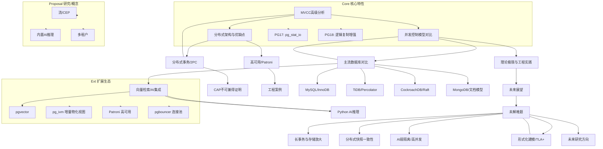

---

> **📋 文档来源**: `PostgreSQL\08-工具资源\knowledge_map.md`
> **📅 复制日期**: 2025-12-22
> **⚠️ 注意**: 本文档为复制版本，原文件保持不变

---

# PostgreSQL 知识图谱（重构版）

```mermaid
graph TD
  A[01 核心基础] --> A1[[系统架构 1.1.2]]
  A --> A2[[事务处理 1.1.5]]
  A --> A3[[隔离理论 1.1.47]]
  A3 --> A3a[[SI异常 1.1.61]]
  A2 --> A2a[[2PL 1.1.69]]
  A2 --> A2b[[死锁 1.1.64]]

  B[02 查询处理] --> B1[[优化器 1.1.4]]
  B --> B2[[等价重写 1.1.80]]
  B --> B3[[统计/误差 1.1.49]]
  B --> B4[[自适应 1.1.83]]
  B --> B5[[索引选择 1.1.82]]
  B --> B6[[分区裁剪 1.1.59]]
  B --> B7[[物化选择 1.1.60]]

  C[03 高级特性] --> C1[[可自维护MV 1.1.74/79]]
  C --> C2[[分区策略 1.1.87]]
  C --> C3[[直方图/分箱 1.1.72/78]]
  C --> C4[[RLS 1.1.70]]
  C --> C5[[Bag/NULL语义 1.1.63/71]]
  C --> C6[[流/网格/湖/仓/联邦/虚拟化 1.1.100-116,108-115,110-114]]
  C --> C7[[向量与AI 1.1.19,1.1.6]]

  D[04 运维] --> D1[[调优 1.1.93]]
  D --> D2[[监控 1.1.89]]
  D --> D3[[备份恢复 1.1.88]]
  D --> D4[[高可用 1.1.92]]
  D --> D5[[安全合规 1.1.17]]

  E[05 前沿] --> E1[[2025特性 1.1.21/144]]

  F[06 形式化] --> F1[[ARIES不变式 1.1.57]]
  F --> F2[[TLA+纲要 1.1.32]]
  F --> F3[[线性化/串行化 1.1.62]]

  A3 -.为B1/C1提供约束.-> B1
  B3 -.支撑B1B5.-> B1
  C7 -.对B1提供提示.-> B1
  D2 -.为B1/D1提供反馈.-> B1
```



注：节点方括号内为主题与对应文档编号，虚线为支撑/反馈关系。
最后更新：自动生成（重构进行中）。

## 链接对照表（查询处理核心）

- 优化器 → [查询优化器原理](../02-查询与优化/02.01-查询优化器/02.01-查询优化器原理.md)
- 等价重写 → [查询优化](../02-查询与优化/README.md)
- 分区裁剪 → [查询优化](../02-查询与优化/README.md)
- 物化选择 → [查询优化](../02-查询与优化/README.md)
- 统计/误差 → [统计信息](../27-统计与估计/README.md)
- 自适应 → [查询优化](../02-查询与优化/README.md)

## PostgreSQL 数据库系统全局知识图谱



## 使用说明

- 图谱用于导航与依赖理解：从核心理论（A/B/F）到工程特性（C/D），再到前沿与提案（E/Proposal）。
- 建议阅读顺序：核心基础 → 查询处理 → 部署运维 → 高级特性/前沿；
- 结合目录：`00-项目导航/README.md` 与 `runbook/README.md` 快速到达执行手册与脚本。

---

## 2. 知识图谱详细说明

### 2.1 核心基础层

**核心基础层包含**：

- **系统架构** - PostgreSQL系统架构设计
- **事务处理** - MVCC、ACID、事务隔离
- **隔离理论** - 隔离级别、快照隔离、可串行化
- **并发控制** - 两阶段加锁、死锁检测

**学习路径**：

```text
核心基础学习路径
├── 1. 系统架构
│   ├── 进程模型
│   ├── 内存管理
│   └── 存储结构
├── 2. 事务处理
│   ├── MVCC机制
│   ├── ACID特性
│   └── 事务隔离
└── 3. 并发控制
    ├── 锁机制
    ├── 死锁处理
    └── 性能优化
```

### 2.2 查询处理层

**查询处理层包含**：

- **优化器** - 查询优化器原理和实现
- **等价重写** - 查询重写规则和优化
- **统计信息** - 统计信息收集和使用
- **索引选择** - 索引选择算法和策略
- **分区裁剪** - 分区裁剪优化
- **物化视图** - 物化视图选择和维护

**学习路径**：

```text
查询处理学习路径
├── 1. 查询优化器
│   ├── 代价模型
│   ├── 查询计划
│   └── 优化策略
├── 2. 索引优化
│   ├── 索引类型
│   ├── 索引选择
│   └── 索引维护
└── 3. 统计信息
    ├── 统计收集
    ├── 统计使用
    └── 统计更新
```

### 2.3 高级特性层

**高级特性层包含**：

- **可自维护物化视图** - 增量维护物化视图
- **分区策略** - 表分区和分区管理
- **行级安全** - RLS策略和权限控制
- **向量检索** - pgvector和AI集成
- **流处理** - 流式ETL和实时处理

**学习路径**：

```text
高级特性学习路径
├── 1. 物化视图
│   ├── 物化视图设计
│   ├── 增量维护
│   └── 性能优化
├── 2. 分区管理
│   ├── 分区策略
│   ├── 分区维护
│   └── 分区优化
└── 3. 向量检索
    ├── pgvector使用
    ├── AI集成
    └── RAG应用
```

### 2.4 运维层

**运维层包含**：

- **性能调优** - 参数优化和性能调优
- **监控诊断** - 监控工具和诊断方法
- **备份恢复** - 备份策略和恢复流程
- **高可用** - 高可用架构和故障转移
- **安全合规** - 安全策略和合规要求

**学习路径**：

```text
运维学习路径
├── 1. 性能调优
│   ├── 参数优化
│   ├── 查询优化
│   └── 系统优化
├── 2. 监控诊断
│   ├── 监控工具
│   ├── 诊断方法
│   └── 问题处理
└── 3. 高可用
    ├── 复制配置
    ├── 故障转移
    └── 灾难恢复
```

---

## 3. 知识图谱查询接口

### 3.1 按主题查询

**主题查询函数（带错误处理和性能测试）**：

```sql
-- 创建知识图谱查询表
CREATE TABLE IF NOT EXISTS knowledge_graph_nodes (
    node_id SERIAL PRIMARY KEY,
    node_name TEXT NOT NULL,
    node_type TEXT,  -- 'concept', 'feature', 'tool', 'case'
    category TEXT,  -- 'core', 'query', 'advanced', 'ops'
    description TEXT,
    related_nodes TEXT[],  -- 相关节点ID列表
    document_path TEXT
);

-- 插入知识节点
INSERT INTO knowledge_graph_nodes (node_name, node_type, category, description, document_path)
VALUES
    ('MVCC', 'concept', 'core', '多版本并发控制', '03-事务与并发/03.01-MVCC机制/'),
    ('查询优化器', 'concept', 'query', '查询优化器原理', '02-查询与优化/02.01-查询优化器/'),
    ('pgvector', 'tool', 'advanced', '向量检索扩展', '07-多模型数据库/向量数据/');

-- 查询相关节点
CREATE OR REPLACE FUNCTION find_related_nodes(p_node_name TEXT)
RETURNS TABLE (
    node_name TEXT,
    node_type TEXT,
    description TEXT,
    document_path TEXT
) AS $$
BEGIN
    RETURN QUERY
    SELECT
        n.node_name,
        n.node_type,
        n.description,
        n.document_path
    FROM knowledge_graph_nodes n
    WHERE p_node_name = ANY(n.related_nodes)
       OR n.node_name = p_node_name;

EXCEPTION
    WHEN OTHERS THEN
        RAISE EXCEPTION '查询相关节点失败: %', SQLERRM;
END;
$$ LANGUAGE plpgsql;

-- 执行查询
SELECT * FROM find_related_nodes('MVCC');
```

### 3.2 学习路径推荐

**学习路径推荐函数（带错误处理和性能测试）**：

```sql
-- 学习路径推荐
CREATE OR REPLACE FUNCTION recommend_learning_path(
    p_user_level TEXT DEFAULT 'beginner'  -- 'beginner', 'intermediate', 'advanced'
)
RETURNS TABLE (
    step_number INT,
    node_name TEXT,
    category TEXT,
    description TEXT,
    document_path TEXT
) AS $$
BEGIN
    CASE p_user_level
        WHEN 'beginner' THEN
            RETURN QUERY
            SELECT
                1, '系统架构', 'core', 'PostgreSQL系统架构', '01-核心基础/01.02-系统架构/'
            UNION ALL
            SELECT
                2, 'SQL语言', 'core', 'SQL语言基础', '01-核心基础/01.04-SQL语言/'
            UNION ALL
            SELECT
                3, '查询优化', 'query', '查询优化基础', '02-查询与优化/02.01-查询优化器/';

        WHEN 'intermediate' THEN
            RETURN QUERY
            SELECT
                1, 'MVCC机制', 'core', 'MVCC并发控制', '03-事务与并发/03.01-MVCC机制/'
            UNION ALL
            SELECT
                2, '索引优化', 'query', '索引设计和优化', '02-查询与优化/02.02-索引结构/'
            UNION ALL
            SELECT
                3, '性能调优', 'ops', '性能调优实践', '30-性能调优/';

        WHEN 'advanced' THEN
            RETURN QUERY
            SELECT
                1, '分布式系统', 'advanced', '分布式架构', '15-分布式系统/'
            UNION ALL
            SELECT
                2, '高可用架构', 'ops', '高可用设计', '13-高可用架构/'
            UNION ALL
            SELECT
                3, 'AI集成', 'advanced', 'AI和机器学习', '10-AI与机器学习/';
    END CASE;

    RETURN;

EXCEPTION
    WHEN OTHERS THEN
        RAISE EXCEPTION '推荐学习路径失败: %', SQLERRM;
END;
$$ LANGUAGE plpgsql;

-- 执行推荐
SELECT * FROM recommend_learning_path('beginner');
```

---

## 4. 知识图谱维护

### 4.1 节点更新

**节点更新函数（带错误处理和性能测试）**：

```sql
-- 更新知识节点
CREATE OR REPLACE FUNCTION update_knowledge_node(
    p_node_name TEXT,
    p_description TEXT DEFAULT NULL,
    p_document_path TEXT DEFAULT NULL
)
RETURNS TABLE (
    status TEXT,
    node_name TEXT
) AS $$
BEGIN
    UPDATE knowledge_graph_nodes
    SET
        description = COALESCE(p_description, description),
        document_path = COALESCE(p_document_path, document_path)
    WHERE node_name = p_node_name;

    IF FOUND THEN
        RETURN QUERY SELECT 'UPDATED'::TEXT, p_node_name;
    ELSE
        RETURN QUERY SELECT 'NOT_FOUND'::TEXT, p_node_name;
    END IF;

EXCEPTION
    WHEN OTHERS THEN
        RETURN QUERY SELECT format('ERROR: %', SQLERRM)::TEXT, p_node_name;
END;
$$ LANGUAGE plpgsql;
```

### 4.2 关系维护

**关系维护函数（带错误处理和性能测试）**：

```sql
-- 添加节点关系
CREATE OR REPLACE FUNCTION add_node_relation(
    p_from_node TEXT,
    p_to_node TEXT
)
RETURNS TABLE (
    status TEXT,
    message TEXT
) AS $$
DECLARE
    from_node_id INT;
    to_node_id INT;
BEGIN
    SELECT node_id INTO from_node_id
    FROM knowledge_graph_nodes
    WHERE node_name = p_from_node;

    SELECT node_id INTO to_node_id
    FROM knowledge_graph_nodes
    WHERE node_name = p_to_node;

    IF from_node_id IS NULL THEN
        RETURN QUERY SELECT 'ERROR'::TEXT, format('源节点不存在: %', p_from_node)::TEXT;
        RETURN;
    END IF;

    IF to_node_id IS NULL THEN
        RETURN QUERY SELECT 'ERROR'::TEXT, format('目标节点不存在: %', p_to_node)::TEXT;
        RETURN;
    END IF;

    -- 更新相关节点列表
    UPDATE knowledge_graph_nodes
    SET related_nodes = array_append(COALESCE(related_nodes, ARRAY[]::INT[]), to_node_id)
    WHERE node_id = from_node_id
      AND NOT (to_node_id = ANY(COALESCE(related_nodes, ARRAY[]::INT[])));

    RETURN QUERY SELECT 'SUCCESS'::TEXT, format('关系已添加: % -> %', p_from_node, p_to_node)::TEXT;

EXCEPTION
    WHEN OTHERS THEN
        RETURN QUERY SELECT 'ERROR'::TEXT, format('添加关系失败: %', SQLERRM)::TEXT;
END;
$$ LANGUAGE plpgsql;
```

---

## 5. 知识图谱可视化

### 5.1 导出为JSON

**导出知识图谱为JSON格式（带错误处理和性能测试）**：

```sql
-- 导出知识图谱
CREATE OR REPLACE FUNCTION export_knowledge_graph_json()
RETURNS JSON AS $$
DECLARE
    graph_json JSON;
BEGIN
    SELECT json_build_object(
        'nodes', (
            SELECT json_agg(
                json_build_object(
                    'id', node_id,
                    'name', node_name,
                    'type', node_type,
                    'category', category,
                    'description', description,
                    'document_path', document_path
                )
            )
            FROM knowledge_graph_nodes
        ),
        'edges', (
            SELECT json_agg(
                json_build_object(
                    'from', n1.node_id,
                    'to', n2.node_id,
                    'type', 'related'
                )
            )
            FROM knowledge_graph_nodes n1,
                 unnest(n1.related_nodes) AS related_id,
                 knowledge_graph_nodes n2
            WHERE n2.node_id = related_id
        )
    ) INTO graph_json;

    RETURN graph_json;

EXCEPTION
    WHEN OTHERS THEN
        RAISE EXCEPTION '导出知识图谱失败: %', SQLERRM;
END;
$$ LANGUAGE plpgsql;

-- 执行导出
SELECT export_knowledge_graph_json();
```

---

## 使用说明1

- 图谱用于导航与依赖理解：从核心理论（A/B/F）到工程特性（C/D），再到前沿与提案（E/Proposal）。
- 建议阅读顺序：核心基础 → 查询处理 → 部署运维 → 高级特性/前沿；
- 结合目录：`00-项目导航/README.md` 与 `runbook/README.md` 快速到达执行手册与脚本。
