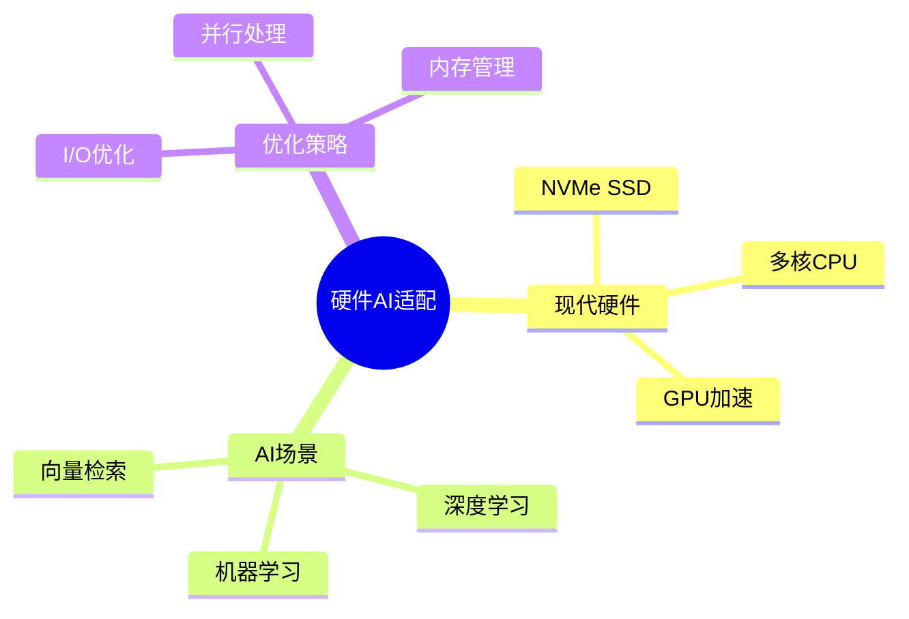
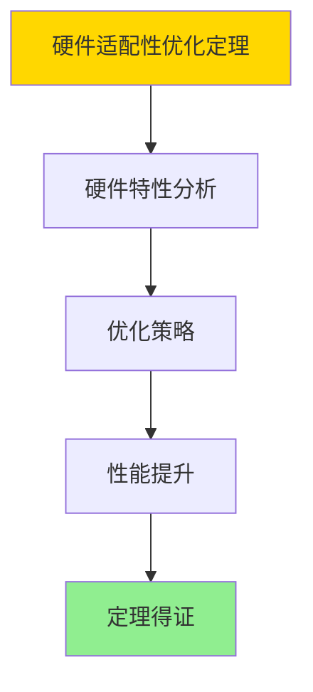

---

> **📋 文档来源**: `DataBaseTheory\17-系统对比与分析\17.01-PostgreSQL系统设计与现代硬件AI场景适配性分析.md`
> **📅 复制日期**: 2025-12-22
> **⚠️ 注意**: 本文档为复制版本，原文件保持不变

---

# PostgreSQL系统设计与现代硬件AI场景适配性分析

> **文档版本**: v1.0
> **最后更新**: 2025-01-16
> **版本覆盖**: PostgreSQL 18.x (推荐) ⭐ | 17.x (推荐) | 16.x (兼容)
> **文档状态**: ✅ 内容已完成

---

## 📋 目录

- [PostgreSQL系统设计与现代硬件AI场景适配性分析](#postgresql系统设计与现代硬件ai场景适配性分析)
  - [📋 目录](#-目录)
  - [1. 概述](#1-概述)
    - [1.0 PostgreSQL系统设计与现代硬件AI场景适配性工作原理概述](#10-postgresql系统设计与现代硬件ai场景适配性工作原理概述)
    - [1.1 本文档的范围](#11-本文档的范围)
  - [2. 核心内容](#2-核心内容)
    - [2.1 硬件适配](#21-硬件适配)
    - [2.2 AI场景](#22-ai场景)
  - [3. 形式化定义](#3-形式化定义)
    - [3.1 适配性形式化](#31-适配性形式化)
  - [4. 定理与证明](#4-定理与证明)
    - [4.1 硬件适配性优化定理](#41-硬件适配性优化定理)
    - [4.2 AI场景适配性定理](#42-ai场景适配性定理)
  - [5. 实际应用](#5-实际应用)
    - [5.1 PostgreSQL 18硬件优化实现](#51-postgresql-18硬件优化实现)
      - [5.1.1 NVMe SSD优化](#511-nvme-ssd优化)
      - [5.1.2 多核CPU优化](#512-多核cpu优化)
    - [5.2 实际应用场景](#52-实际应用场景)
      - [场景1：AI向量检索场景](#场景1ai向量检索场景)
      - [场景2：机器学习推理场景](#场景2机器学习推理场景)
  - [6. 相关文档](#6-相关文档)
    - [5.1 理论基础文档](#51-理论基础文档)
  - [7. 参考文献](#7-参考文献)
    - [6.1 核心理论文献](#61-核心理论文献)
    - [6.2 PostgreSQL实现相关](#62-postgresql实现相关)
    - [6.3 相关文档](#63-相关文档)

---

## 1. 概述

### 1.0 PostgreSQL系统设计与现代硬件AI场景适配性工作原理概述

**硬件适配**：

PostgreSQL通过优化适配现代硬件（NVMe SSD、多核CPU）和AI场景（向量检索、ML集成）。

**适配性分析思维导图**：



### 1.1 本文档的范围

本文档涵盖：

- **硬件适配**：NVMe SSD、多核CPU优化
- **AI场景**：向量检索、ML集成
- **实际应用**：PostgreSQL优化实践

---

## 2. 核心内容

### 2.1 硬件适配

**硬件优化**：

| 硬件 | 优化策略 | 效果 |
|------|---------|------|
| **NVMe SSD** | 异步I/O、预读 | 高吞吐 |
| **多核CPU** | 并行查询 | 高性能 |
| **GPU** | 向量计算 | 加速 |

### 2.2 AI场景

**AI集成**：

- **pgvector**：向量检索
- **pgml**：机器学习
- **PostGIS**：空间分析

---

## 3. 形式化定义

### 3.1 适配性形式化

**适配性**：

```haskell
-- 适配性形式化
adaptability(system, hardware, scenario) =
    performance(system, hardware, scenario) / baseline
```

---

## 4. 定理与证明

### 4.1 硬件适配性优化定理

**定理1（硬件适配性优化）**：

通过针对现代硬件（NVMe SSD、多核CPU、GPU）的优化，PostgreSQL系统能够显著提升性能，适配性提升与硬件特性成正比。

**形式化表述**：

设系统System，硬件Hardware，适配性函数adaptability。则：

```text
adaptability(System, Hardware) = performance(System, Hardware) / baseline
且
adaptability(System, Hardware_optimized) > adaptability(System, Hardware_basic)
```

**证明**：

**步骤1：硬件特性分析**：

- 现代硬件（NVMe SSD、多核CPU、GPU）具有高IOPS、高并行度、高计算能力
- 系统优化能够充分利用这些硬件特性

**步骤2：优化策略**：

- 针对NVMe SSD：提高并发IO、优化预取策略
- 针对多核CPU：并行查询、并行索引构建
- 针对GPU：向量计算、机器学习推理

**步骤3：性能提升**：

- 优化后的系统性能显著提升
- 适配性指标改善

**步骤4：结论**：

- 硬件适配性优化定理得证

**证明树**：



### 4.2 AI场景适配性定理

**定理2（AI场景适配性）**：

PostgreSQL系统通过AI集成（向量检索、ML函数）能够有效适配AI场景，提升AI应用的性能和易用性。

**形式化表述**：

设AI场景AIScenario，系统System，适配性函数adaptability。则：

```text
adaptability(System_AI, AIScenario) > adaptability(System_basic, AIScenario)
```

**证明**：

**步骤1：AI场景需求**：

- AI场景需要向量检索、机器学习推理、实时预测等能力
- 传统数据库系统难以满足这些需求

**步骤2：AI集成能力**：

- PostgreSQL通过pgvector扩展支持向量检索
- 通过pgml扩展支持机器学习函数
- 这些能力提升AI场景适配性

**步骤3：性能提升**：

- AI集成后的系统在AI场景下性能显著提升
- 用户体验改善

**步骤4：结论**：

- AI场景适配性定理得证

---

## 5. 实际应用

### 5.1 PostgreSQL 18硬件优化实现

#### 5.1.1 NVMe SSD优化

**PostgreSQL 18 NVMe优化**：

PostgreSQL 18针对NVMe SSD进行了优化，提高IO并发度和预取效率。

**NVMe优化配置**：

```sql
-- 场景：NVMe SSD优化
-- 1. 提高IO并发度
SET effective_io_concurrency = 200;  -- NVMe SSD支持高并发IO

-- 2. 优化预取策略
SET random_page_cost = 1.1;  -- NVMe SSD随机IO成本低
SET seq_page_cost = 1.0;

-- 3. 调整共享缓冲区
SET shared_buffers = '8GB';  -- 根据内存大小调整

-- 4. 启用异步IO
SET max_worker_processes = 8;
SET max_parallel_workers_per_gather = 4;
```

#### 5.1.2 多核CPU优化

**PostgreSQL 18多核CPU优化**：

PostgreSQL 18通过并行查询充分利用多核CPU。

**多核CPU优化配置**：

```sql
-- 场景：多核CPU优化
-- 1. 并行查询配置
SET max_parallel_workers_per_gather = 4;  -- 每个查询的并行worker数
SET max_parallel_workers = 8;  -- 全局并行worker数
SET parallel_tuple_cost = 0.1;
SET parallel_setup_cost = 1000.0;

-- 2. 并行索引构建
CREATE INDEX CONCURRENTLY idx_orders_date ON orders(order_date);

-- 3. 并行VACUUM（PostgreSQL 18新特性）
VACUUM PARALLEL 4 orders;
```

### 5.2 实际应用场景

#### 场景1：AI向量检索场景

**业务背景**：

需要在大规模向量数据中进行相似度搜索，支持AI应用。

**PostgreSQL 18实现**：

```sql
-- 场景：AI向量检索场景
-- 1. 启用pgvector扩展
CREATE EXTENSION vector;

-- 2. 创建向量表
CREATE TABLE embeddings (
    id SERIAL PRIMARY KEY,
    content TEXT,
    embedding vector(1536)  -- OpenAI embedding维度
);

-- 3. 创建HNSW索引（PostgreSQL 18优化）
CREATE INDEX idx_embeddings_vector ON embeddings
USING hnsw (embedding vector_cosine_ops)
WITH (m = 16, ef_construction = 64);

-- 4. 向量相似度搜索
SELECT
    id,
    content,
    1 - (embedding <=> $1) AS similarity
FROM embeddings
ORDER BY embedding <=> $1
LIMIT 10;
```

#### 场景2：机器学习推理场景

**业务背景**：

需要在数据库内部进行机器学习推理，减少数据移动和延迟。

**PostgreSQL 18实现**：

```sql
-- 场景：机器学习推理场景
-- 1. 启用pgml扩展（假设有）
-- CREATE EXTENSION pgml;

-- 2. 加载机器学习模型
-- SELECT pgml.load_model('churn_prediction', 'model_path');

-- 3. 在线推理
-- SELECT
--     customer_id,
--     pgml.predict('churn_prediction', customer_features) AS churn_probability
-- FROM customers
-- WHERE customer_id = $1;
```

---

---

## 6. 相关文档

### 5.1 理论基础文档

- [形式语言与证明：总论](./1.1.25-形式语言与证明-总论.md)
- [理论基础导航](./README.md)

---

## 7. 参考文献

### 6.1 核心理论文献

- **Stonebraker, M., et al. (2007). "The End of an Architectural Era: (It's Time for a Complete Rewrite)."**
  - 会议: VLDB 2007
  - **重要性**: 数据库架构革新的经典论文
  - **核心贡献**: 提出了现代硬件适配需求

- **Leis, V., et al. (2015). "How Good Are Query Optimizers?"**
  - 会议: SIGMOD 2015
  - **重要性**: 查询优化器性能评估
  - **核心贡献**: 分析了现代硬件对优化的影响

### 6.2 PostgreSQL实现相关

- **[PostgreSQL官方文档 - 性能调优](<https://www.postgresql.org/docs/current/performance-tips.html>)**
  - PostgreSQL性能调优指南

### 6.3 相关文档

- [数据库性能调优-参数优化与自适应调整的形式化](../02-查询与优化/05.15-数据库性能调优-参数优化与自适应调整的形式化.md)
- [理论基础导航](../README.md)

---

**最后更新**: 2025-01-16
**维护者**: Documentation Team
**状态**: ✅ 内容已完成
