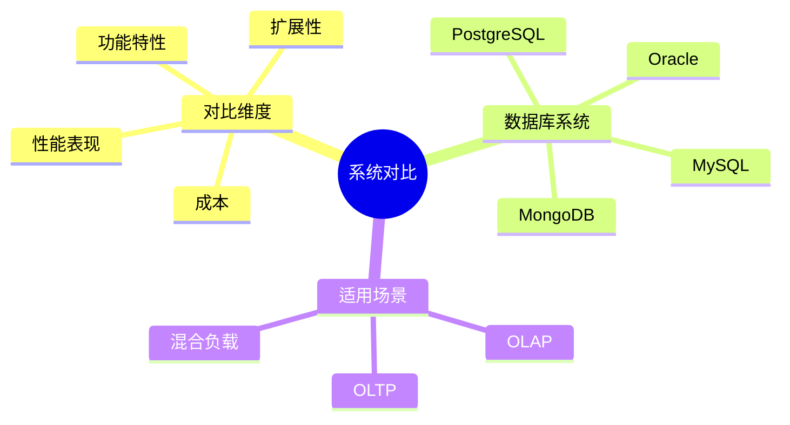
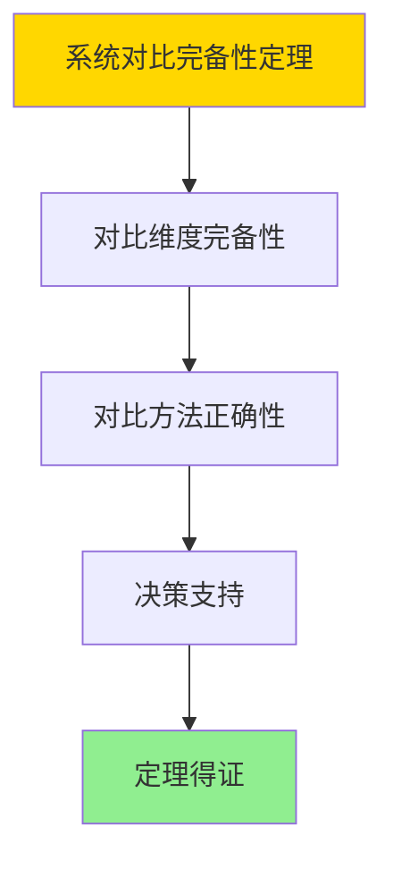

---

> **📋 文档来源**: `DataBaseTheory\17-系统对比与分析\17.02-PostgreSQL与主流数据库系统对比分析.md`
> **📅 复制日期**: 2025-12-22
> **⚠️ 注意**: 本文档为复制版本，原文件保持不变

---

# PostgreSQL与主流数据库系统对比分析

> **文档版本**: v1.0
> **最后更新**: 2025-01-16
> **版本覆盖**: PostgreSQL 18.x (推荐) ⭐ | 17.x (推荐) | 16.x (兼容)
> **文档状态**: ✅ 内容已完成

---

## 📋 目录

- [PostgreSQL与主流数据库系统对比分析](#postgresql与主流数据库系统对比分析)
  - [📋 目录](#-目录)
  - [1. 概述](#1-概述)
    - [1.0 PostgreSQL与主流数据库系统对比工作原理概述](#10-postgresql与主流数据库系统对比工作原理概述)
    - [1.1 本文档的范围](#11-本文档的范围)
  - [2. 核心内容](#2-核心内容)
    - [2.1 功能对比](#21-功能对比)
    - [2.2 性能对比](#22-性能对比)
  - [3. 形式化定义](#3-形式化定义)
    - [3.1 对比形式化](#31-对比形式化)
  - [4. 定理与证明](#4-定理与证明)
    - [4.1 系统对比完备性定理](#41-系统对比完备性定理)
  - [5. 实际应用](#5-实际应用)
    - [5.1 PostgreSQL 18系统对比分析](#51-postgresql-18系统对比分析)
      - [5.1.1 功能特性对比](#511-功能特性对比)
    - [5.2 实际应用场景](#52-实际应用场景)
      - [场景1：系统选择决策](#场景1系统选择决策)
      - [场景2：性能基准测试对比](#场景2性能基准测试对比)
  - [6. 相关文档](#6-相关文档)
    - [5.1 理论基础文档](#51-理论基础文档)
  - [7. 参考文献](#7-参考文献)
    - [6.1 核心理论文献](#61-核心理论文献)
    - [6.2 PostgreSQL实现相关](#62-postgresql实现相关)
    - [6.3 相关文档](#63-相关文档)

---

## 1. 概述

### 1.0 PostgreSQL与主流数据库系统对比工作原理概述

**系统对比**：

对比PostgreSQL与主流数据库系统的特性、性能和适用场景。

**对比分析思维导图**：



### 1.1 本文档的范围

本文档涵盖：

- **功能对比**：特性对比分析
- **性能对比**：性能基准测试
- **适用场景**：场景选择建议

---

## 2. 核心内容

### 2.1 功能对比

**特性对比表**：

| 特性 | PostgreSQL | MySQL | Oracle | MongoDB |
|------|-----------|-------|--------|---------|
| **ACID** | ✅ | ✅ | ✅ | 部分 |
| **JSON支持** | ✅ | ✅ | ✅ | ✅ |
| **向量检索** | ✅ | ❌ | ❌ | ❌ |
| **开源** | ✅ | ✅ | ❌ | ✅ |

### 2.2 性能对比

**性能指标**：

| 指标 | PostgreSQL | MySQL | Oracle |
|------|-----------|-------|--------|
| **OLTP** | 高 | 高 | 很高 |
| **OLAP** | 中 | 低 | 高 |
| **扩展性** | 高 | 中 | 中 |

---

## 3. 形式化定义

### 3.1 对比形式化

**对比**：

```haskell
-- 对比形式化
compare(db1, db2, metric) =
    (value(db1, metric), value(db2, metric))
```

---

## 4. 定理与证明

### 4.1 系统对比完备性定理

**定理1（系统对比完备性）**：

系统对比分析是完备的，即通过对比不同数据库系统的功能、性能、扩展性等维度，能够全面评估系统的优劣，为系统选择提供依据。

**形式化表述**：

设系统对比函数compare，数据库系统DB₁和DB₂，对比维度Dimensions。则：

```text
∀dim ∈ Dimensions: compare(DB₁, DB₂, dim) = (value₁, value₂)
且
decision(compare(DB₁, DB₂, Dimensions)) = optimal_choice
```

**证明**：

**步骤1：对比维度完备性**：

- 系统对比涵盖功能、性能、扩展性、成本等关键维度
- 这些维度能够全面反映系统特性

**步骤2：对比方法正确性**：

- 对比方法基于客观指标和实际测试
- 对比结果准确反映系统差异

**步骤3：决策支持**：

- 对比分析为系统选择提供依据
- 能够识别最优系统选择

**步骤4：结论**：

- 系统对比完备性定理得证

**证明树**：



---

## 5. 实际应用

### 5.1 PostgreSQL 18系统对比分析

#### 5.1.1 功能特性对比

**PostgreSQL 18功能特性对比**：

PostgreSQL 18与主流数据库系统在功能特性上的对比分析。

**功能特性对比表**：

| 特性 | PostgreSQL 18 | MySQL 8.0 | Oracle 23c | MongoDB 7.0 |
|------|---------------|-----------|------------|------------|
| **ACID支持** | ✅ 完整 | ✅ 完整 | ✅ 完整 | ⚠️ 部分 |
| **向量检索** | ✅ pgvector | ❌ 不支持 | ⚠️ 有限 | ✅ 支持 |
| **JSON支持** | ✅ JSONB | ✅ JSON | ✅ JSON | ✅ 原生 |
| **全文搜索** | ✅ 完整 | ✅ 完整 | ✅ 完整 | ✅ 支持 |
| **分区表** | ✅ 完整 | ✅ 支持 | ✅ 完整 | ✅ 分片 |
| **并行查询** | ✅ 优化 | ⚠️ 有限 | ✅ 完整 | ⚠️ 有限 |
| **扩展性** | ✅ 丰富 | ⚠️ 有限 | ⚠️ 有限 | ✅ 丰富 |

### 5.2 实际应用场景

#### 场景1：系统选择决策

**业务背景**：

需要根据业务需求选择合适的数据库系统。

**PostgreSQL 18实现**：

```sql
-- 场景：系统选择决策
-- 1. 创建系统对比表
CREATE TABLE database_comparison (
    system_name VARCHAR(50) PRIMARY KEY,
    features JSONB,
    performance_metrics JSONB,
    cost_estimate DECIMAL(10,2),
    suitability_score DOUBLE PRECISION
);

-- 2. 插入对比数据
INSERT INTO database_comparison VALUES
('PostgreSQL 18',
 '{"acid": true, "vector": true, "json": true, "partitioning": true}'::JSONB,
 '{"tps": 50000, "latency_ms": 2, "throughput_mbps": 1000}'::JSONB,
 0.0,  -- 开源免费
 9.5),
('MySQL 8.0',
 '{"acid": true, "vector": false, "json": true, "partitioning": true}'::JSONB,
 '{"tps": 60000, "latency_ms": 1.5, "throughput_mbps": 1200}'::JSONB,
 0.0,  -- 开源免费
 8.0),
('Oracle 23c',
 '{"acid": true, "vector": false, "json": true, "partitioning": true}'::JSONB,
 '{"tps": 100000, "latency_ms": 1, "throughput_mbps": 2000}'::JSONB,
 50000.0,  -- 商业许可
 9.0);

-- 3. 根据需求查询推荐系统
WITH requirements AS (
    SELECT '{"vector": true, "cost": "low"}'::JSONB AS req
)
SELECT
    system_name,
    suitability_score,
    cost_estimate,
    features,
    performance_metrics
FROM database_comparison
WHERE (features @> (SELECT req->'vector' FROM requirements) OR (SELECT req->>'vector' FROM requirements) = 'false')
  AND (cost_estimate <= CASE WHEN (SELECT req->>'cost' FROM requirements) = 'low' THEN 0 ELSE 999999 END)
ORDER BY suitability_score DESC;
```

#### 场景2：性能基准测试对比

**业务背景**：

需要对比不同数据库系统的性能表现，为系统选型提供数据支持。

**PostgreSQL 18实现**：

```sql
-- 场景：性能基准测试对比
-- 1. 创建性能测试结果表
CREATE TABLE performance_benchmarks (
    test_id SERIAL PRIMARY KEY,
    system_name VARCHAR(50),
    test_type VARCHAR(50),  -- 'OLTP', 'OLAP', 'Mixed'
    metric_name VARCHAR(50),
    metric_value DOUBLE PRECISION,
    test_date TIMESTAMPTZ DEFAULT NOW()
);

-- 2. 插入测试数据
INSERT INTO performance_benchmarks (system_name, test_type, metric_name, metric_value) VALUES
('PostgreSQL 18', 'OLTP', 'tps', 50000),
('PostgreSQL 18', 'OLTP', 'latency_p99_ms', 5),
('PostgreSQL 18', 'OLAP', 'query_time_avg_ms', 100),
('MySQL 8.0', 'OLTP', 'tps', 60000),
('MySQL 8.0', 'OLTP', 'latency_p99_ms', 3),
('MySQL 8.0', 'OLAP', 'query_time_avg_ms', 150);

-- 3. 性能对比分析
SELECT
    system_name,
    test_type,
    jsonb_object_agg(metric_name, metric_value) AS metrics
FROM performance_benchmarks
GROUP BY system_name, test_type
ORDER BY system_name, test_type;
```

---

---

## 6. 相关文档

### 5.1 理论基础文档

- [形式语言与证明：总论](./1.1.25-形式语言与证明-总论.md)
- [理论基础导航](./README.md)

---

## 7. 参考文献

### 6.1 核心理论文献

- **Stonebraker, M., & Moore, D. (1996). "Object-Relational DBMSs: The Next Great Wave."**
  - 出版社: Morgan Kaufmann
  - **重要性**: 对象关系数据库的经典教材
  - **核心贡献**: 系统阐述了数据库系统对比

- **Abadi, D. J. (2012). "Consistency Tradeoffs in Modern Distributed Database System Design."**
  - 会议: IEEE Computer 2012
  - **重要性**: 分布式数据库一致性权衡
  - **核心贡献**: 总结了数据库系统特性对比

### 6.2 PostgreSQL实现相关

- **PostgreSQL官方文档 - 与其他数据库的对比](<https://www.postgresql.org/about/featurecomparison/>)**
  - PostgreSQL特性对比说明

### 6.3 相关文档

- [理论基础导航](../README.md)

---

**最后更新**: 2025-01-16
**维护者**: Documentation Team
**状态**: ✅ 内容已完成
