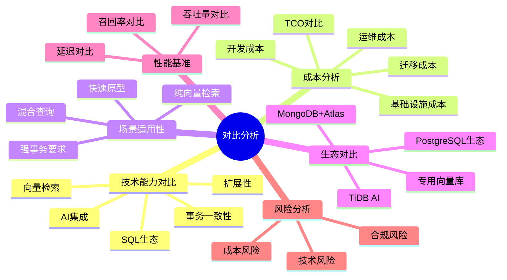
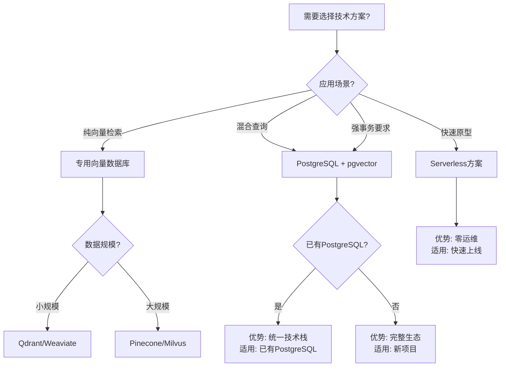

---

> **📋 文档来源**: `PostgreSQL_AI\06-对比分析\README.md`
> **📅 复制日期**: 2025-12-22
> **⚠️ 注意**: 本文档为复制版本，原文件保持不变

---

# 23-对比分析

> **文档总数**: 6个核心文档
> **覆盖领域**: 技术能力对比、TCO成本分析、场景适用性、生态对比、性能基准、风险分析
> **版本覆盖**: PostgreSQL 18.x (推荐) ⭐ | 17.x (推荐) | 16.x (兼容)
> **最后更新**: 2025年1月

---

## 📊 知识体系思维导图

---

## 📊 技术方案选型决策树

---

## 📊 技术方案对比矩阵

| 技术方案 | 向量检索 | 事务一致性 | SQL生态 | 扩展性 | 成本 | 适用场景 |
| --- | --- | --- | --- | --- | --- | --- |
| **PostgreSQL + pgvector** | ⭐⭐⭐⭐ | ⭐⭐⭐⭐⭐ | ⭐⭐⭐⭐⭐ | ⭐⭐⭐⭐ | 中 | 混合查询、强事务 |
| **专用向量数据库** | ⭐⭐⭐⭐⭐ | ⭐⭐ | ⭐ | ⭐⭐⭐⭐⭐ | 中-高 | 纯向量检索 |
| **MongoDB + Atlas** | ⭐⭐⭐ | ⭐⭐⭐ | ⭐⭐⭐ | ⭐⭐⭐⭐ | 中-高 | 文档+向量 |
| **TiDB AI** | ⭐⭐⭐⭐ | ⭐⭐⭐⭐ | ⭐⭐⭐⭐ | ⭐⭐⭐⭐⭐ | 高 | 分布式+向量 |

---

## 📋 主题概述

PostgreSQL AI方案与传统方案、替代方案的对比分析，包括技术能力、成本效益、场景适用性等多维度对比。

## 🎯 核心子主题

### 1. 技术能力对比矩阵

- **状态**: ✅ 已完成
- **文档**: [技术能力对比矩阵.md](./技术能力对比矩阵.md)
- **内容**:
  - 向量检索性能对比
  - 事务一致性对比
  - SQL生态对比
  - 扩展性对比
  - AI集成能力对比
  - 混合查询能力对比
- **关联**: [25-理论体系](../25-理论体系/), [19-实战案例](../19-实战案例/)

### 2. TCO总拥有成本分析

- **状态**: ✅ 已完成
- **文档**: [TCO总拥有成本分析.md](./TCO总拥有成本分析.md)
- **内容**:
  - 基础设施成本
  - 开发人力成本
  - 运维人力成本
  - 数据迁移成本
  - 3年TCO对比
- **关联**: [19-实战案例](../19-实战案例/), [21-最佳实践](../21-最佳实践/)

### 3. 场景适用性决策矩阵

- **状态**: ✅ 已完成
- **文档**: [场景适用性决策矩阵.md](./场景适用性决策矩阵.md)
- **内容**:
  - 纯向量检索场景
  - 混合查询场景
  - 强事务要求场景
  - 快速原型场景
  - 决策阈值分析
- **关联**: [19-实战案例](../19-实战案例/), [21-最佳实践](../21-最佳实践/)

### 4. 生态对比分析

- **状态**: ✅ 已完成
- **文档**: [生态对比分析.md](./生态对比分析.md)
- **内容**:
  - PostgreSQL生态 vs 专用向量库
  - PostgreSQL生态 vs MongoDB+Atlas
  - PostgreSQL生态 vs TiDB AI
  - 社区成熟度对比
  - 生态对比思维导图
- **关联**: [01-核心基础](../01-核心基础/), [ROADMAP-2025.md](../../ROADMAP-2025.md)

### 5. 性能基准对比

- **状态**: ✅ 已完成
- **文档**: [性能基准对比.md](./性能基准对比.md)
- **内容**:
  - 向量检索延迟对比
  - 吞吐量对比
  - 召回率对比
  - 混合查询性能对比
- **关联**: [01-核心基础](../01-核心基础/), [19-实战案例](../19-实战案例/)

### 6. 风险与约束条件

- **状态**: ✅ 已完成
- **文档**: [风险与约束条件.md](./风险与约束条件.md)
- **内容**:
  - 向量规模约束
  - 模型延迟约束
  - 团队技能约束
  - 合规约束
  - 风险决策矩阵
  - 风险与约束思维导图
  - 风险决策树
- **关联**: [21-最佳实践](../21-最佳实践/)

## 🔗 主题关联

**依赖主题**:

- ← [25-理论体系](../25-理论体系/) - 对比基于理论框架
- ← [19-实战案例](../19-实战案例/) - 对比使用案例数据

**被依赖主题**:

- → [21-最佳实践](../21-最佳实践/) - 对比指导选型

## 📚 对标资源

### 市场分析

- Gartner Database Market Analysis
- DB-Engines Ranking
- Vector Database Comparison

### 基准测试

- ann-benchmarks
- TPC Benchmarks
- 企业级性能测试报告

### 学术论文

- Scalable Vector Search Survey (ACM Computing Surveys 2023)

## 🚀 后续计划

- [ ] 更新技术能力对比矩阵
- [ ] 补充TCO成本分析
- [ ] 更新场景适用性决策矩阵
- [ ] 补充性能基准对比数据
- [ ] 完善风险分析

---

**最后更新**: 2025年1月
**维护者**: PostgreSQL Modern Team
**主题编号**: AI-06-00
