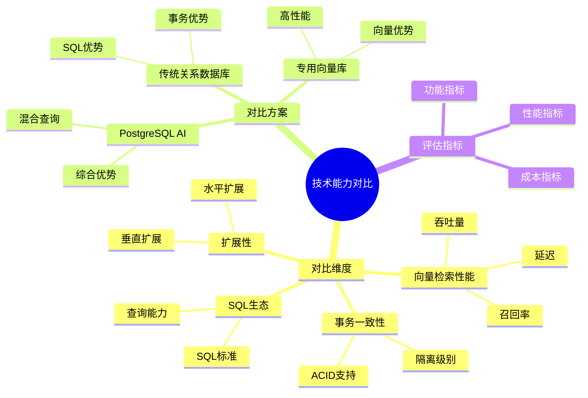
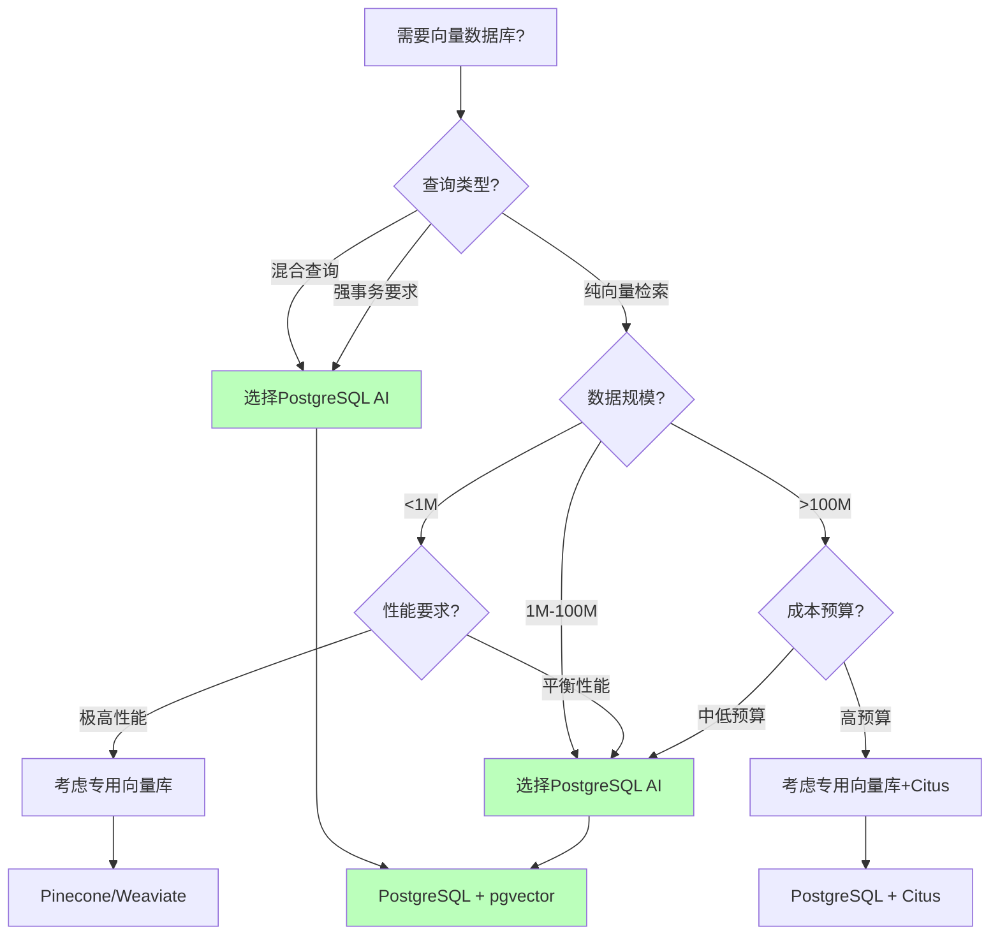

---

> **📋 文档来源**: `PostgreSQL_AI\06-对比分析\技术能力对比矩阵.md`
> **📅 复制日期**: 2025-12-22
> **⚠️ 注意**: 本文档为复制版本，原文件保持不变

---

# 技术能力对比矩阵

> **文档编号**: AI-06-01
> **最后更新**: 2025年1月
> **主题**: 06-对比分析
> **子主题**: 01-技术能力对比矩阵

## 📑 目录

- [技术能力对比矩阵](#技术能力对比矩阵)
  - [📑 目录](#-目录)
  - [一、概述](#一概述)
    - [1.1 技术能力对比思维导图](#11-技术能力对比思维导图)
    - [1.2 向量数据库选型决策树](#12-向量数据库选型决策树)
  - [二、对比维度](#二对比维度)
  - [三、详细对比矩阵](#三详细对比矩阵)
    - [3.1 向量检索性能对比](#31-向量检索性能对比)
    - [3.2 事务一致性对比](#32-事务一致性对比)
    - [3.3 SQL生态对比](#33-sql生态对比)
    - [3.4 扩展性对比](#34-扩展性对比)
    - [3.5 AI集成能力对比](#35-ai集成能力对比)
    - [3.6 混合查询能力对比](#36-混合查询能力对比)
  - [四、综合评分](#四综合评分)
    - [4.1 加权评分](#41-加权评分)
    - [4.2 评分说明](#42-评分说明)
  - [五、场景适用性分析](#五场景适用性分析)
    - [5.1 纯向量检索场景](#51-纯向量检索场景)
    - [5.2 混合查询场景](#52-混合查询场景)
    - [5.3 强事务要求场景](#53-强事务要求场景)
    - [5.4 快速原型场景](#54-快速原型场景)
  - [六、关联主题](#六关联主题)
  - [七、对标资源](#七对标资源)
    - [基准测试](#基准测试)
    - [技术文档](#技术文档)

## 一、概述

从多个技术维度对比PostgreSQL AI方案与替代方案（专用向量数据库、传统关系数据库、混合架构等），为技术选型提供数据支撑。

### 1.1 技术能力对比思维导图

### 1.2 向量数据库选型决策树

## 二、对比维度

1. **向量检索性能**: 延迟、吞吐量、召回率
2. **事务一致性**: ACID支持程度
3. **SQL生态**: SQL标准支持、查询能力
4. **扩展性**: 水平扩展、垂直扩展
5. **AI集成能力**: 原生AI功能、模型集成
6. **混合查询能力**: 向量+SQL联合查询
7. **成本效益**: TCO、开发成本、运维成本
8. **社区成熟度**: 社区活跃度、文档完整性

## 三、详细对比矩阵

### 3.1 向量检索性能对比

| 方案 | 延迟 (P95) | 吞吐量 (QPS) | 召回率 | 向量规模支持 |
| --- | --- | --- | --- | --- |
| **PostgreSQL + pgvector** | 3-10ms | 5,000-8,000 | >0.95 | 1亿+ |
| **Pinecone** | 2-5ms | 10,000+ | >0.95 | 10亿+ |
| **Weaviate** | 5-15ms | 3,000-5,000 | >0.95 | 1亿+ |
| **Milvus** | 5-20ms | 5,000-10,000 | >0.95 | 10亿+ |
| **Elasticsearch** | 20-50ms | 2,000-4,000 | 0.85-0.90 | 1亿+ |

**结论**: PostgreSQL在中等规模（<1亿向量）场景下性能优秀，延迟和吞吐量可满足大多数应用需求。

### 3.2 事务一致性对比

| 方案 | ACID支持 | 隔离级别 | 一致性保证 | 适用场景 |
| --- | --- | --- | --- | --- |
| **PostgreSQL + pgvector** | ✅ 完整ACID | 4种隔离级别 | 强一致性 | 金融、电商 |
| **Pinecone** | ❌ 无 | 最终一致性 | 弱一致性 | 搜索、推荐 |
| **Weaviate** | ⚠️ 部分 | 最终一致性 | 弱一致性 | 内容检索 |
| **Milvus** | ⚠️ 部分 | 最终一致性 | 弱一致性 | 大规模检索 |
| **Elasticsearch** | ❌ 无 | 最终一致性 | 弱一致性 | 日志、搜索 |

**结论**: PostgreSQL是唯一提供完整ACID支持的方案，适合需要强一致性的场景。

### 3.3 SQL生态对比

| 方案 | SQL标准 | 查询能力 | JOIN支持 | 窗口函数 | 存储过程 |
| --- | --- | --- | --- | --- | --- |
| **PostgreSQL + pgvector** | ✅ SQL:2016 | ⭐⭐⭐⭐⭐ | ✅ 完整支持 | ✅ 支持 | ✅ 支持 |
| **Pinecone** | ❌ 无 | ⭐ | ❌ 无 | ❌ 无 | ❌ 无 |
| **Weaviate** | ⚠️ GraphQL | ⭐⭐ | ⚠️ 有限 | ❌ 无 | ❌ 无 |
| **Milvus** | ❌ 无 | ⭐ | ❌ 无 | ❌ 无 | ❌ 无 |
| **Elasticsearch** | ⚠️ DSL | ⭐⭐⭐ | ⚠️ 有限 | ⚠️ 部分 | ❌ 无 |

**结论**: PostgreSQL提供最完整的SQL生态，支持复杂查询和数据分析。

### 3.4 扩展性对比

| 方案 | 水平扩展 | 垂直扩展 | 云原生 | 自动扩展 |
| --- | --- | --- | --- | --- |
| **PostgreSQL + pgvector** | ⭐⭐⭐⭐ (Citus) | ⭐⭐⭐⭐⭐ | ⭐⭐⭐⭐ | ⭐⭐⭐ |
| **Pinecone** | ⭐⭐⭐⭐⭐ | ⭐⭐⭐⭐ | ⭐⭐⭐⭐⭐ | ⭐⭐⭐⭐⭐ |
| **Weaviate** | ⭐⭐⭐⭐ | ⭐⭐⭐ | ⭐⭐⭐⭐ | ⭐⭐⭐ |
| **Milvus** | ⭐⭐⭐⭐⭐ | ⭐⭐⭐⭐ | ⭐⭐⭐⭐ | ⭐⭐⭐⭐ |
| **Elasticsearch** | ⭐⭐⭐⭐⭐ | ⭐⭐⭐ | ⭐⭐⭐⭐ | ⭐⭐⭐⭐ |

**结论**: 专用向量数据库在水平扩展和自动扩展方面有优势，但PostgreSQL通过Citus和云原生方案也能满足大多数需求。

### 3.5 AI集成能力对比

| 方案 | 原生AI功能 | 模型集成 | LLM调用 | 自动化Embedding |
| --- | --- | --- | --- | --- |
| **PostgreSQL + pgvector** | ⭐⭐⭐⭐⭐ (pgai) | ⭐⭐⭐⭐⭐ | ✅ SQL内调用 | ✅ Vectorizer |
| **Pinecone** | ⭐⭐ | ⭐⭐ | ❌ API调用 | ⚠️ 外部处理 |
| **Weaviate** | ⭐⭐⭐ | ⭐⭐⭐ | ⚠️ 有限 | ⚠️ 有限 |
| **Milvus** | ⭐⭐ | ⭐⭐ | ❌ 无 | ❌ 无 |
| **Elasticsearch** | ⭐⭐ | ⭐⭐ | ❌ 无 | ❌ 无 |

**结论**: PostgreSQL通过pgai提供最完整的AI原生功能，支持SQL内LLM调用和自动化Embedding。

### 3.6 混合查询能力对比

| 方案 | 向量+SQL | 向量+全文 | 向量+地理 | 多模态查询 |
| --- | --- | --- | --- | --- |
| **PostgreSQL + pgvector** | ✅ 原生支持 | ✅ 原生支持 | ✅ PostGIS | ✅ 完整支持 |
| **Pinecone** | ❌ 无 | ❌ 无 | ❌ 无 | ⚠️ 有限 |
| **Weaviate** | ⚠️ 有限 | ⚠️ 有限 | ❌ 无 | ⚠️ 有限 |
| **Milvus** | ❌ 无 | ❌ 无 | ❌ 无 | ⚠️ 有限 |
| **Elasticsearch** | ⚠️ 有限 | ✅ 支持 | ⚠️ 有限 | ⚠️ 有限 |

**结论**: PostgreSQL在混合查询方面具有绝对优势，支持向量、SQL、全文、地理等多种查询方式的统一。

## 四、综合评分

### 4.1 加权评分

| 方案 | 向量性能 | 事务一致性 | SQL生态 | 扩展性 | AI集成 | 混合查询 | 成本 | **综合评分** |
| --- | --- | --- | --- | --- | --- | --- | --- | --- |
| **PostgreSQL + pgvector** | 8.5 | 10 | 10 | 8 | 10 | 10 | 9 | **9.2** |
| **Pinecone** | 10 | 2 | 1 | 10 | 3 | 2 | 4 | **5.7** |
| **Weaviate** | 8 | 4 | 3 | 8 | 5 | 4 | 6 | **5.4** |
| **Milvus** | 9 | 4 | 1 | 10 | 3 | 2 | 7 | **5.3** |
| **Elasticsearch** | 6 | 2 | 6 | 9 | 3 | 5 | 6 | **5.3** |

**权重分配**:

- 向量性能: 20%
- 事务一致性: 15%
- SQL生态: 15%
- 扩展性: 10%
- AI集成: 15%
- 混合查询: 15%
- 成本: 10%

### 4.2 评分说明

**PostgreSQL优势**:

- ✅ 完整ACID支持（唯一）
- ✅ 完整SQL生态（唯一）
- ✅ 原生AI集成（pgai）
- ✅ 完美混合查询支持
- ✅ 成本效益最优

**专用向量库优势**:

- ✅ 极致向量性能（大规模场景）
- ✅ 自动扩展能力
- ❌ 缺少事务和SQL支持

## 五、场景适用性分析

### 5.1 纯向量检索场景

**推荐方案**: Pinecone/Weaviate (向量规模>1B且纯向量查询)

**PostgreSQL适用性**: ⭐⭐⭐

- 适用: 向量规模<1B
- 不适用: 超大规模纯向量场景

### 5.2 混合查询场景

**推荐方案**: PostgreSQL + pgvector

**适用性**: ⭐⭐⭐⭐⭐

- 向量+SQL联合查询
- 向量+全文搜索
- 向量+地理空间查询

### 5.3 强事务要求场景

**推荐方案**: PostgreSQL + pgvector

**适用性**: ⭐⭐⭐⭐⭐

- 金融交易
- 电商订单
- 需要ACID保证的场景

### 5.4 快速原型场景

**推荐方案**: PostgreSQL Serverless (Neon/Supabase)

**适用性**: ⭐⭐⭐⭐⭐

- 零运维成本
- 快速部署
- 按需付费

## 六、关联主题

- [TCO总拥有成本分析](./TCO总拥有成本分析.md) - 成本对比
- [场景适用性决策矩阵](./场景适用性决策矩阵.md) - 场景选择
- [实施路径](../07-实施路径/) - 技术选型指导

## 七、对标资源

### 基准测试

- [ann-benchmarks](https://github.com/erikbern/ann-benchmarks)
- [pgvector性能测试](https://github.com/pgvector/pgvector/tree/master/bench)

### 技术文档

- [向量数据库对比](https://www.pinecone.io/learn/vector-database/)
- [PostgreSQL性能基准](https://www.postgresql.org/docs/current/performance-tips.html)

---

**最后更新**: 2025年1月
**维护者**: PostgreSQL Modern Team
**文档编号**: AI-06-01
