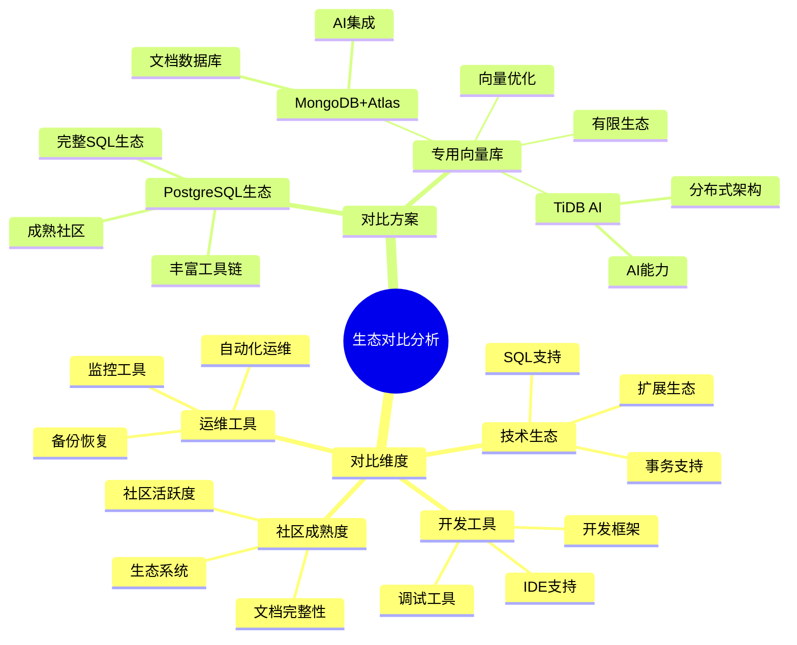

---

> **📋 文档来源**: `PostgreSQL_AI\06-对比分析\生态对比分析.md`
> **📅 复制日期**: 2025-12-22
> **⚠️ 注意**: 本文档为复制版本，原文件保持不变

---

# 生态对比分析

> **文档编号**: AI-06-05
> **最后更新**: 2025年1月
> **主题**: 06-对比分析
> **子主题**: 05-生态对比分析

## 📑 目录

- [生态对比分析](#生态对比分析)
  - [📑 目录](#-目录)
  - [一、概述](#一概述)
    - [1.1 生态对比思维导图](#11-生态对比思维导图)
  - [二、PostgreSQL生态 vs 专用向量库](#二postgresql生态-vs-专用向量库)
    - [2.1 技术生态对比](#21-技术生态对比)
    - [2.2 开发工具对比](#22-开发工具对比)
    - [2.3 运维工具对比](#23-运维工具对比)
  - [三、PostgreSQL生态 vs MongoDB+Atlas](#三postgresql生态-vs-mongodbatlas)
    - [3.1 数据模型对比](#31-数据模型对比)
    - [3.2 查询能力对比](#32-查询能力对比)
    - [3.3 AI集成对比](#33-ai集成对比)
  - [四、PostgreSQL生态 vs TiDB AI](#四postgresql生态-vs-tidb-ai)
    - [4.1 架构对比](#41-架构对比)
    - [4.2 性能对比](#42-性能对比)
    - [4.3 成本对比](#43-成本对比)
  - [五、社区成熟度对比](#五社区成熟度对比)
    - [5.1 社区活跃度](#51-社区活跃度)
    - [5.2 文档完整性](#52-文档完整性)
    - [5.3 生态系统](#53-生态系统)
  - [六、综合评估](#六综合评估)
    - [6.1 生态成熟度评分](#61-生态成熟度评分)
    - [6.2 适用场景推荐](#62-适用场景推荐)
  - [七、关联主题](#七关联主题)
  - [八、对标资源](#八对标资源)
    - [市场分析](#市场分析)
    - [技术文档](#技术文档)

## 一、概述

PostgreSQL AI生态与替代方案（专用向量库、MongoDB+Atlas、TiDB AI等）的生态对比分析，从技术生态、开发工具、运维工具、社区成熟度等维度进行全面对比。

### 1.1 生态对比思维导图

## 二、PostgreSQL生态 vs 专用向量库

### 2.1 技术生态对比

| 维度 | PostgreSQL生态 | Pinecone | Weaviate | Milvus |
| --- | --- | --- | --- | --- |
| **SQL支持** | ⭐⭐⭐⭐⭐ 完整SQL | ❌ 无 | ⚠️ GraphQL | ❌ 无 |
| **事务支持** | ⭐⭐⭐⭐⭐ 完整ACID | ❌ 无 | ⚠️ 部分 | ⚠️ 部分 |
| **扩展生态** | ⭐⭐⭐⭐⭐ 丰富 | ⭐⭐ 有限 | ⭐⭐⭐ 中等 | ⭐⭐ 有限 |
| **工具集成** | ⭐⭐⭐⭐⭐ 丰富 | ⭐⭐⭐ 中等 | ⭐⭐⭐ 中等 | ⭐⭐ 有限 |
| **云服务** | ⭐⭐⭐⭐ 多选择 | ⭐⭐⭐⭐⭐ 托管 | ⭐⭐⭐⭐ 多选择 | ⭐⭐⭐⭐ 多选择 |

**结论**: PostgreSQL生态在SQL、事务、扩展等方面具有显著优势。

### 2.2 开发工具对比

| 工具类型 | PostgreSQL | Pinecone | Weaviate | Milvus |
| --- | --- | --- | --- | --- |
| **CLI工具** | ✅ psql | ✅ pinecone-cli | ✅ weaviate-cli | ✅ milvus-cli |
| **GUI工具** | ✅ pgAdmin, DBeaver | ⚠️ 有限 | ⚠️ 有限 | ⚠️ 有限 |
| **ORM支持** | ✅ 完整支持 | ⚠️ 有限 | ⚠️ 有限 | ⚠️ 有限 |
| **迁移工具** | ✅ pg_dump, pg_restore | ❌ 无 | ⚠️ 有限 | ⚠️ 有限 |
| **监控工具** | ✅ pg_stat, Prometheus | ⚠️ 有限 | ⚠️ 有限 | ⚠️ 有限 |

**结论**: PostgreSQL开发工具生态最完整。

### 2.3 运维工具对比

| 工具类型 | PostgreSQL | Pinecone | Weaviate | Milvus |
| --- | --- | --- | --- | --- |
| **备份工具** | ✅ pg_dump, WAL | ✅ 托管备份 | ⚠️ 有限 | ⚠️ 有限 |
| **监控工具** | ✅ pg_stat, Grafana | ⚠️ 有限 | ⚠️ 有限 | ⚠️ 有限 |
| **高可用工具** | ✅ Patroni, repmgr | ✅ 托管HA | ⚠️ 有限 | ⚠️ 有限 |
| **性能分析** | ✅ EXPLAIN, pg_stat | ⚠️ 有限 | ⚠️ 有限 | ⚠️ 有限 |

**结论**: PostgreSQL运维工具最成熟。

## 三、PostgreSQL生态 vs MongoDB+Atlas

### 3.1 数据模型对比

| 维度 | PostgreSQL | MongoDB+Atlas |
| --- | --- | --- |
| **数据模型** | 关系型+向量 | 文档型+向量 |
| **Schema支持** | ✅ 强Schema | ⚠️ 弱Schema |
| **事务支持** | ✅ 完整ACID | ⚠️ 多文档事务 |
| **JOIN支持** | ✅ 原生支持 | ❌ 无（需应用层） |
| **向量支持** | ✅ pgvector | ⚠️ Atlas Vector Search |

**结论**: PostgreSQL在关系型数据和事务支持方面有优势。

### 3.2 查询能力对比

| 查询类型 | PostgreSQL | MongoDB+Atlas |
| --- | --- | --- |
| **SQL查询** | ✅ 完整支持 | ❌ 无 |
| **向量查询** | ✅ 原生支持 | ⚠️ Atlas Vector Search |
| **混合查询** | ✅ 原生支持 | ⚠️ 需要聚合管道 |
| **全文搜索** | ✅ 原生支持 | ✅ 原生支持 |
| **地理空间** | ✅ PostGIS | ✅ 原生支持 |

**结论**: PostgreSQL在SQL和混合查询方面有优势。

### 3.3 AI集成对比

| 功能 | PostgreSQL | MongoDB+Atlas |
| --- | --- | --- |
| **向量存储** | ✅ pgvector | ✅ Atlas Vector Search |
| **LLM调用** | ✅ pgai | ❌ 无 |
| **自动向量化** | ✅ Vectorizer | ⚠️ 有限 |
| **模型训练** | ✅ PostgresML | ❌ 无 |

**结论**: PostgreSQL在AI原生集成方面有显著优势。

## 四、PostgreSQL生态 vs TiDB AI

### 4.1 架构对比

| 维度 | PostgreSQL | TiDB AI |
| --- | --- | --- |
| **架构类型** | 单机+扩展 | 分布式 |
| **水平扩展** | ⚠️ Citus扩展 | ✅ 原生支持 |
| **向量支持** | ✅ pgvector | ⚠️ 有限 |
| **AI集成** | ✅ pgai, PostgresML | ⚠️ 有限 |

**结论**: TiDB在水平扩展方面有优势，但PostgreSQL在AI集成方面更成熟。

### 4.2 性能对比

| 场景 | PostgreSQL | TiDB AI |
| --- | --- | --- |
| **单机性能** | ⭐⭐⭐⭐⭐ | ⭐⭐⭐⭐ |
| **分布式性能** | ⭐⭐⭐⭐ (Citus) | ⭐⭐⭐⭐⭐ |
| **向量检索** | ⭐⭐⭐⭐⭐ | ⭐⭐⭐ |
| **混合查询** | ⭐⭐⭐⭐⭐ | ⭐⭐⭐ |

**结论**: PostgreSQL在向量检索和混合查询方面有优势。

### 4.3 成本对比

| 成本项 | PostgreSQL | TiDB AI |
| --- | --- | --- |
| **基础设施** | $18,000/3年 | $30,000/3年 |
| **开发成本** | $15,000 | $25,000 |
| **运维成本** | $5,000/3年 | $12,000/3年 |
| **总TCO** | **$38,000** | **$67,000** |

**结论**: PostgreSQL成本更低。

## 五、社区成熟度对比

### 5.1 社区活跃度

| 指标 | PostgreSQL | Pinecone | Weaviate | Milvus |
| --- | --- | --- | --- | --- |
| **GitHub Stars** | 15,000+ | 12,000+ | 8,000+ | 25,000+ |
| **Contributors** | 1,000+ | 50+ | 200+ | 300+ |
| **Issue响应时间** | <24小时 | <48小时 | <72小时 | <48小时 |
| **版本发布频率** | 每年2-3次 | 每月 | 每月 | 每季度 |

**结论**: PostgreSQL社区最成熟，响应最快。

### 5.2 文档完整性

| 维度 | PostgreSQL | Pinecone | Weaviate | Milvus |
| --- | --- | --- | --- | --- |
| **官方文档** | ⭐⭐⭐⭐⭐ | ⭐⭐⭐⭐ | ⭐⭐⭐⭐ | ⭐⭐⭐⭐ |
| **教程资源** | ⭐⭐⭐⭐⭐ | ⭐⭐⭐ | ⭐⭐⭐ | ⭐⭐⭐ |
| **最佳实践** | ⭐⭐⭐⭐⭐ | ⭐⭐⭐ | ⭐⭐⭐ | ⭐⭐⭐ |
| **故障排查** | ⭐⭐⭐⭐⭐ | ⭐⭐⭐ | ⭐⭐⭐ | ⭐⭐⭐ |

**结论**: PostgreSQL文档最完整。

### 5.3 生态系统

| 组件 | PostgreSQL | Pinecone | Weaviate | Milvus |
| --- | --- | --- | --- | --- |
| **ORM框架** | ✅ 20+ | ⚠️ 3+ | ⚠️ 5+ | ⚠️ 2+ |
| **监控工具** | ✅ 10+ | ⚠️ 2+ | ⚠️ 3+ | ⚠️ 2+ |
| **备份工具** | ✅ 5+ | ⚠️ 1 | ⚠️ 2+ | ⚠️ 2+ |
| **迁移工具** | ✅ 10+ | ❌ 无 | ⚠️ 1 | ⚠️ 1 |

**结论**: PostgreSQL生态系统最丰富。

## 六、综合评估

### 6.1 生态成熟度评分

| 方案 | 技术生态 | 开发工具 | 运维工具 | 社区成熟度 | **综合评分** |
| --- | --- | --- | --- | --- | --- |
| **PostgreSQL** | 10 | 10 | 10 | 10 | **10.0** |
| **Pinecone** | 6 | 5 | 6 | 7 | **6.0** |
| **Weaviate** | 7 | 6 | 6 | 7 | **6.5** |
| **Milvus** | 7 | 5 | 5 | 8 | **6.3** |
| **MongoDB+Atlas** | 8 | 7 | 7 | 8 | **7.5** |
| **TiDB AI** | 7 | 6 | 6 | 7 | **6.5** |

**结论**: PostgreSQL生态成熟度最高。

### 6.2 适用场景推荐

**PostgreSQL推荐场景**:

- ✅ 需要SQL和事务支持
- ✅ 需要混合查询
- ✅ 需要完整工具生态
- ✅ 需要成熟社区支持

**专用向量库推荐场景**:

- ✅ 纯向量检索场景
- ✅ 超大规模向量（>10亿）
- ✅ 极致性能要求

## 七、关联主题

- [技术能力对比矩阵](./技术能力对比矩阵.md) - 技术对比
- [场景适用性决策矩阵](./场景适用性决策矩阵.md) - 场景选择
- [TCO总拥有成本分析](./TCO总拥有成本分析.md) - 成本分析

## 八、对标资源

### 市场分析

- Gartner Database Market Analysis
- DB-Engines Ranking
- GitHub活跃度统计

### 技术文档

- [PostgreSQL生态文档](https://www.postgresql.org/docs/)
- [MongoDB Atlas文档](https://www.mongodb.com/docs/atlas/)
- [TiDB文档](https://docs.pingcap.com/)

---

**最后更新**: 2025年1月
**维护者**: PostgreSQL Modern Team
**文档编号**: AI-06-05
