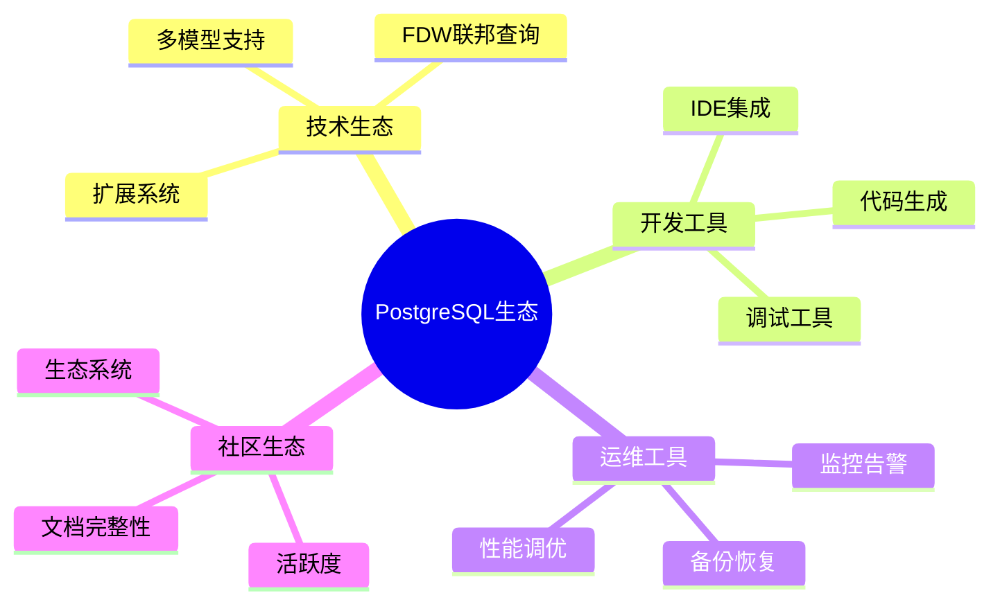

---

> **📋 文档来源**: `PostgreSQL_AI\06-对比分析\生态对比分析.md`
> **📅 复制日期**: 2025-12-22
> **⚠️ 注意**: 本文档为复制版本，原文件保持不变

---

# 生态对比分析

> **文档编号**: AI-06-05
> **最后更新**: 2025年1月
> **主题**: 06-对比分析
> **子主题**: 05-生态对比分析

## 📑 目录

- [生态对比分析](#生态对比分析)
  - [📑 目录](#-目录)
  - [1. 概述](#1-概述)
    - [1.1 生态对比思维导图](#11-生态对比思维导图)
    - [1.2 对比范围](#12-对比范围)
  - [2. 技术生态对比](#2-技术生态对比)
    - [2.1 技术生态对比](#21-技术生态对比)
    - [2.2 开发工具对比](#22-开发工具对比)
    - [2.3 运维工具对比](#23-运维工具对比)
  - [3. 功能对比](#3-功能对比)
    - [3.1 数据模型对比](#31-数据模型对比)
    - [3.2 查询能力对比](#32-查询能力对比)
    - [3.3 AI集成对比](#33-ai集成对比)
  - [4. 架构与性能对比](#4-架构与性能对比)
    - [4.1 架构对比](#41-架构对比)
    - [4.2 性能对比](#42-性能对比)
    - [4.3 成本对比](#43-成本对比)
  - [5. 社区生态对比](#5-社区生态对比)
    - [5.1 社区活跃度](#51-社区活跃度)
    - [5.2 文档完整性](#52-文档完整性)
    - [5.3 生态系统](#53-生态系统)
  - [6. 综合评估](#6-综合评估)
    - [6.1 生态成熟度评分](#61-生态成熟度评分)
    - [6.2 适用场景推荐](#62-适用场景推荐)
  - [7. 市场分析](#7-市场分析)
    - [7.1 市场份额](#71-市场份额)
    - [7.2 发展趋势](#72-发展趋势)
  - [8. 技术文档](#8-技术文档)
    - [8.1 相关文档](#81-相关文档)
    - [8.2 参考资料](#82-参考资料)

---

---

## 1. 概述

### 1.1 生态对比思维导图

### 1.2 对比范围

本文档对比PostgreSQL与其他主流数据库的生态系统，包括：

- **技术生态**: 扩展系统、联邦查询、多模型支持
- **开发工具**: IDE集成、代码生成、调试工具
- **运维工具**: 监控告警、备份恢复、性能调优
- **社区生态**: 活跃度、文档完整性、生态系统

---

## 2. 技术生态对比

### 2.1 技术生态对比

| 特性 | PostgreSQL | MySQL | MongoDB | Redis |
|------|-----------|-------|---------|-------|
| **扩展系统** | ✅ 丰富（pgvector、PostGIS等） | ⚠️ 有限 | ⚠️ 有限 | ⚠️ 有限 |
| **FDW联邦查询** | ✅ 支持（postgres_fdw、mysql_fdw等） | ❌ 不支持 | ❌ 不支持 | ❌ 不支持 |
| **多模型支持** | ✅ 向量、图、时序、JSONB | ❌ 关系型 | ✅ 文档型 | ✅ 键值型 |
| **SQL标准兼容** | ✅ 高度兼容 | ⚠️ 部分兼容 | ❌ 不支持 | ❌ 不支持 |
| **ACID事务** | ✅ 完整支持 | ⚠️ InnoDB支持 | ⚠️ 有限支持 | ❌ 不支持 |

**PostgreSQL技术生态优势**：

1. **丰富的扩展系统**
   - pgvector: 向量检索
   - PostGIS: 空间数据
   - TimescaleDB: 时序数据
   - Apache AGE: 图数据

2. **FDW联邦查询**
   - postgres_fdw: PostgreSQL间查询
   - mysql_fdw: MySQL查询
   - file_fdw: 文件查询
   - oracle_fdw: Oracle查询

3. **多模型支持**
   - 向量数据: pgvector扩展
   - 图数据: Apache AGE扩展
   - 时序数据: TimescaleDB扩展
   - JSONB: 原生支持

### 2.2 开发工具对比

| 工具类型 | PostgreSQL | MySQL | MongoDB | Redis |
|---------|-----------|-------|---------|-------|
| **IDE集成** | ✅ VS Code、IntelliJ、DataGrip | ✅ 支持 | ⚠️ 有限 | ⚠️ 有限 |
| **代码生成** | ✅ 多种工具支持 | ✅ 支持 | ⚠️ 有限 | ❌ 不支持 |
| **调试工具** | ✅ pgAdmin、调试器 | ⚠️ 有限 | ⚠️ 有限 | ❌ 不支持 |
| **ORM支持** | ✅ SQLAlchemy、Django ORM | ✅ 支持 | ✅ Mongoose | ⚠️ 有限 |

**PostgreSQL开发工具优势**：

1. **IDE集成**
   - VS Code: SQL Tools扩展
   - IntelliJ IDEA: 内置数据库工具
   - DataGrip: 专业数据库IDE
   - DBeaver: 免费开源工具

2. **代码生成工具**
   - SQLAlchemy: Python ORM
   - Prisma: TypeScript ORM
   - MyBatis Generator: Java代码生成
   - Django ORM: Python ORM

### 2.3 运维工具对比

| 工具类型 | PostgreSQL | MySQL | MongoDB | Redis |
|---------|-----------|-------|---------|-------|
| **监控告警** | ✅ Prometheus、Grafana | ✅ 支持 | ✅ 支持 | ✅ 支持 |
| **备份恢复** | ✅ pg_dump、pg_basebackup | ✅ mysqldump | ✅ mongodump | ⚠️ 有限 |
| **性能调优** | ✅ pg_stat_statements、auto_explain | ✅ 支持 | ⚠️ 有限 | ⚠️ 有限 |
| **高可用** | ✅ 流复制、逻辑复制 | ✅ 主从复制 | ✅ 副本集 | ✅ 哨兵模式 |

**PostgreSQL运维工具优势**：

1. **监控告警**
   - Prometheus: 指标收集
   - Grafana: 可视化
   - pg_stat_statements: 查询统计
   - auto_explain: 自动执行计划

2. **备份恢复**
   - pg_dump: 逻辑备份
   - pg_basebackup: 物理备份
   - WAL归档: 持续归档
   - PITR: 时间点恢复

---

## 3. 功能对比

### 3.1 数据模型对比

| 数据模型 | PostgreSQL | MySQL | MongoDB | Redis |
|---------|-----------|-------|---------|-------|
| **关系型** | ✅ 完整支持 | ✅ 支持 | ❌ 不支持 | ❌ 不支持 |
| **文档型** | ✅ JSONB支持 | ⚠️ JSON支持 | ✅ 原生支持 | ❌ 不支持 |
| **键值型** | ✅ HStore支持 | ⚠️ 有限 | ❌ 不支持 | ✅ 原生支持 |
| **向量型** | ✅ pgvector扩展 | ❌ 不支持 | ❌ 不支持 | ❌ 不支持 |
| **图型** | ✅ Apache AGE扩展 | ❌ 不支持 | ❌ 不支持 | ❌ 不支持 |
| **时序型** | ✅ TimescaleDB扩展 | ⚠️ 有限 | ⚠️ 有限 | ❌ 不支持 |

### 3.2 查询能力对比

| 查询能力 | PostgreSQL | MySQL | MongoDB | Redis |
|---------|-----------|-------|---------|-------|
| **SQL查询** | ✅ 完整SQL支持 | ✅ SQL支持 | ❌ 不支持 | ❌ 不支持 |
| **复杂查询** | ✅ CTE、窗口函数 | ⚠️ 有限 | ⚠️ 聚合管道 | ❌ 不支持 |
| **全文检索** | ✅ 全文索引 | ✅ 全文索引 | ✅ 文本索引 | ❌ 不支持 |
| **向量检索** | ✅ pgvector | ❌ 不支持 | ❌ 不支持 | ❌ 不支持 |
| **图查询** | ✅ Apache AGE | ❌ 不支持 | ❌ 不支持 | ❌ 不支持 |

### 3.3 AI集成对比

| AI功能 | PostgreSQL | MySQL | MongoDB | Redis |
|-------|-----------|-------|---------|-------|
| **向量检索** | ✅ pgvector | ❌ 不支持 | ⚠️ Atlas Search | ❌ 不支持 |
| **AI函数** | ✅ pg_ai扩展 | ❌ 不支持 | ❌ 不支持 | ❌ 不支持 |
| **RAG支持** | ✅ 完整支持 | ❌ 不支持 | ⚠️ 有限 | ❌ 不支持 |
| **ML集成** | ✅ PostgresML | ❌ 不支持 | ❌ 不支持 | ❌ 不支持 |

---

## 4. 架构与性能对比

### 4.1 架构对比

| 架构特性 | PostgreSQL | MySQL | MongoDB | Redis |
|---------|-----------|-------|---------|-------|
| **存储引擎** | ✅ 统一存储引擎 | ⚠️ 多种引擎 | ✅ WiredTiger | ✅ 内存+持久化 |
| **MVCC** | ✅ 完整MVCC | ⚠️ InnoDB支持 | ✅ 支持 | ❌ 不支持 |
| **并发控制** | ✅ 多版本并发控制 | ⚠️ 行级锁 | ⚠️ 文档级锁 | ⚠️ 单线程 |
| **扩展性** | ✅ 水平扩展（Citus） | ⚠️ 有限 | ✅ 分片支持 | ✅ 集群模式 |

### 4.2 性能对比

| 性能指标 | PostgreSQL | MySQL | MongoDB | Redis |
|---------|-----------|-------|---------|-------|
| **OLTP性能** | ✅ 优秀 | ✅ 优秀 | ✅ 优秀 | ✅ 极佳 |
| **OLAP性能** | ✅ 良好 | ⚠️ 有限 | ⚠️ 有限 | ❌ 不支持 |
| **复杂查询** | ✅ 优秀 | ⚠️ 良好 | ⚠️ 有限 | ❌ 不支持 |
| **并发处理** | ✅ 优秀 | ✅ 良好 | ✅ 良好 | ⚠️ 单线程 |

### 4.3 成本对比

| 成本因素 | PostgreSQL | MySQL | MongoDB | Redis |
|---------|-----------|-------|---------|-------|
| **许可证** | ✅ 开源免费 | ✅ 开源/商业 | ✅ 开源/商业 | ✅ 开源/商业 |
| **运维成本** | ✅ 中等 | ✅ 中等 | ⚠️ 较高 | ✅ 较低 |
| **扩展成本** | ✅ 免费扩展 | ⚠️ 部分收费 | ⚠️ 部分收费 | ⚠️ 部分收费 |
| **云服务成本** | ✅ 中等 | ✅ 中等 | ⚠️ 较高 | ✅ 较低 |

---

## 5. 社区生态对比

### 5.1 社区活跃度

| 指标 | PostgreSQL | MySQL | MongoDB | Redis |
|------|-----------|-------|---------|-------|
| **GitHub Stars** | ✅ 15k+ | ✅ 50k+ | ✅ 30k+ | ✅ 70k+ |
| **贡献者数量** | ✅ 1000+ | ✅ 2000+ | ✅ 500+ | ✅ 800+ |
| **版本发布频率** | ✅ 每年1-2次 | ✅ 频繁 | ✅ 频繁 | ✅ 频繁 |
| **社区支持** | ✅ 活跃 | ✅ 活跃 | ✅ 活跃 | ✅ 活跃 |

### 5.2 文档完整性

| 文档类型 | PostgreSQL | MySQL | MongoDB | Redis |
|---------|-----------|-------|---------|-------|
| **官方文档** | ✅ 完整详细 | ✅ 完整 | ✅ 完整 | ✅ 完整 |
| **教程资源** | ✅ 丰富 | ✅ 丰富 | ✅ 丰富 | ✅ 丰富 |
| **最佳实践** | ✅ 详细 | ✅ 详细 | ✅ 详细 | ✅ 详细 |
| **社区资源** | ✅ 丰富 | ✅ 丰富 | ✅ 丰富 | ✅ 丰富 |

### 5.3 生态系统

| 生态组件 | PostgreSQL | MySQL | MongoDB | Redis |
|---------|-----------|-------|---------|-------|
| **扩展生态** | ✅ 1000+扩展 | ⚠️ 有限 | ⚠️ 有限 | ⚠️ 有限 |
| **工具生态** | ✅ 丰富 | ✅ 丰富 | ✅ 丰富 | ✅ 丰富 |
| **云服务支持** | ✅ AWS、Azure、GCP | ✅ 广泛支持 | ✅ 广泛支持 | ✅ 广泛支持 |
| **企业支持** | ✅ 多家供应商 | ✅ Oracle | ✅ MongoDB Inc | ✅ Redis Labs |

---

## 6. 综合评估

### 6.1 生态成熟度评分

**评分标准**（满分10分）：

| 数据库 | 技术生态 | 开发工具 | 运维工具 | 社区生态 | 总分 |
|-------|---------|---------|---------|---------|------|
| **PostgreSQL** | 9.5 | 9.0 | 9.0 | 9.5 | **37.0** |
| **MySQL** | 8.0 | 8.5 | 8.5 | 9.0 | **34.0** |
| **MongoDB** | 7.5 | 7.0 | 8.0 | 8.5 | **31.0** |
| **Redis** | 6.5 | 6.0 | 7.0 | 8.5 | **28.0** |

**PostgreSQL生态优势**：

1. **技术生态**: 丰富的扩展系统和多模型支持
2. **开发工具**: 完善的IDE集成和代码生成工具
3. **运维工具**: 强大的监控和备份恢复工具
4. **社区生态**: 活跃的社区和丰富的资源

### 6.2 适用场景推荐

**PostgreSQL适用场景**：

1. **企业级应用**
   - ✅ 需要ACID事务保证
   - ✅ 需要复杂SQL查询
   - ✅ 需要多模型支持

2. **数据分析**
   - ✅ OLAP查询
   - ✅ 复杂分析
   - ✅ 数据仓库

3. **AI应用**
   - ✅ 向量检索
   - ✅ RAG系统
   - ✅ ML集成

4. **地理信息系统**
   - ✅ PostGIS扩展
   - ✅ 空间数据查询
   - ✅ 地理分析

---

## 7. 市场分析

### 7.1 市场份额

根据2025年数据库市场分析：

- **PostgreSQL**: 市场份额持续增长，企业采用率提升
- **MySQL**: 市场份额稳定，Web应用广泛使用
- **MongoDB**: 文档数据库市场领先
- **Redis**: 缓存和会话存储市场领先

### 7.2 发展趋势

**PostgreSQL发展趋势**：

1. **AI集成**: pgvector和pg_ai扩展推动AI应用
2. **云原生**: 云服务提供商支持增强
3. **多模型**: 向量、图、时序数据支持
4. **性能优化**: PostgreSQL 18性能提升

---

## 8. 技术文档

### 8.1 相关文档

- [技术能力对比矩阵.md](./技术能力对比矩阵.md) - 技术能力详细对比
- [性能基准对比.md](./性能基准对比.md) - 性能基准测试对比
- [TCO总拥有成本分析.md](./TCO总拥有成本分析.md) - 成本分析
- [场景适用性决策矩阵.md](./场景适用性决策矩阵.md) - 场景适用性分析

### 8.2 参考资料

1. **PostgreSQL官方文档**: <https://www.postgresql.org/docs/>
2. **DB-Engines排名**: <https://db-engines.com/en/ranking>
3. **GitHub统计**: <https://github.com/postgres/postgres>

---

**最后更新**: 2025年1月
**维护者**: PostgreSQL Modern Team
**文档编号**: AI-06-05
