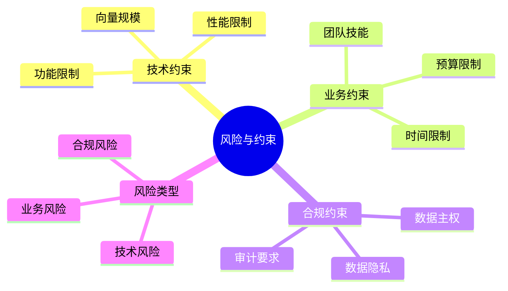
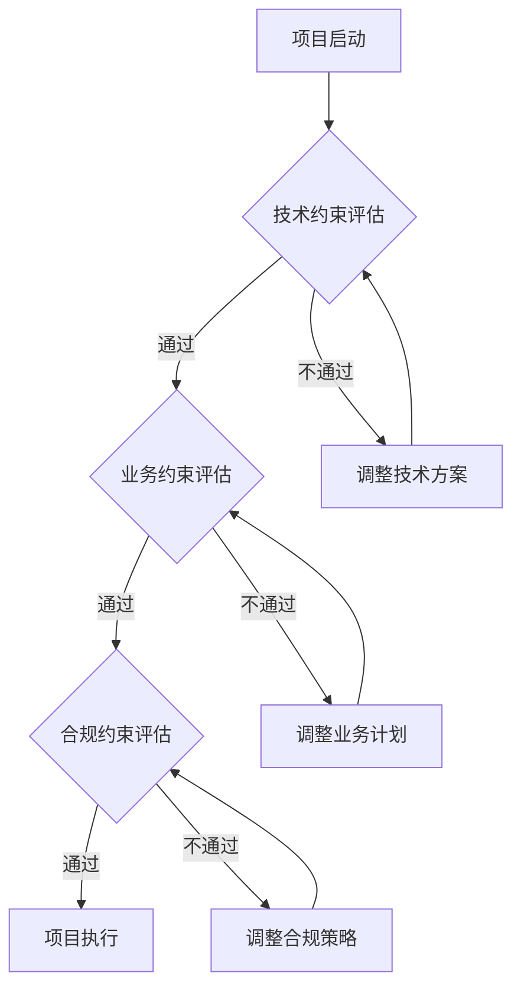

---

> **📋 文档来源**: `PostgreSQL_AI\06-对比分析\风险与约束条件.md`
> **📅 复制日期**: 2025-12-22
> **⚠️ 注意**: 本文档为复制版本，原文件保持不变

---

# 风险与约束条件

> **文档编号**: AI-06-06
> **最后更新**: 2025年1月
> **主题**: 06-对比分析
> **子主题**: 06-风险与约束条件

## 📑 目录

- [风险与约束条件](#风险与约束条件)
  - [📑 目录](#-目录)
  - [1. 概述](#1-概述)
    - [1.1 风险与约束思维导图](#11-风险与约束思维导图)
    - [1.2 风险决策树](#12-风险决策树)
  - [2. 技术约束](#2-技术约束)
    - [2.1 向量规模约束](#21-向量规模约束)
    - [2.2 性能约束](#22-性能约束)
    - [2.3 功能约束](#23-功能约束)
  - [3. 业务约束](#3-业务约束)
    - [3.1 团队技能约束](#31-团队技能约束)
    - [3.2 时间约束](#32-时间约束)
    - [3.3 预算约束](#33-预算约束)
  - [4. 合规约束](#4-合规约束)
    - [4.1 数据隐私](#41-数据隐私)
    - [4.2 数据主权](#42-数据主权)
    - [4.3 审计要求](#43-审计要求)
  - [5. 风险矩阵](#5-风险矩阵)
    - [5.1 技术风险矩阵](#51-技术风险矩阵)
    - [5.2 业务风险矩阵](#52-业务风险矩阵)
    - [5.3 综合风险评分](#53-综合风险评分)
  - [6. 约束应对策略](#6-约束应对策略)
    - [6.1 技术约束应对](#61-技术约束应对)
    - [6.2 业务约束应对](#62-业务约束应对)
    - [6.3 合规约束应对](#63-合规约束应对)
  - [7. 技术文档](#7-技术文档)
    - [7.1 相关文档](#71-相关文档)
    - [7.2 标准](#72-标准)

---

---

## 1. 概述

### 1.1 风险与约束思维导图



### 1.2 风险决策树



---

## 2. 技术约束

### 2.1 向量规模约束

**PostgreSQL向量规模限制**：

| 约束项 | 限制值 | 说明 | 应对措施 |
|-------|--------|------|---------|
| **单表向量数** | 10亿+ | 理论上无限制 | 使用分区表 |
| **向量维度** | 16,000 | pgvector限制 | 使用降维技术 |
| **索引大小** | 取决于内存 | HNSW索引 | 优化索引参数 |
| **查询延迟** | <100ms | P99延迟目标 | 优化索引和查询 |

**向量规模优化**：

```sql
-- 创建分区表处理大规模向量
CREATE TABLE vectors (
    id BIGSERIAL,
    embedding vector(1536),
    metadata JSONB,
    created_at TIMESTAMPTZ DEFAULT NOW()
) PARTITION BY RANGE (created_at);

-- 创建月度分区
CREATE TABLE vectors_2025_01 PARTITION OF vectors
FOR VALUES FROM ('2025-01-01') TO ('2025-02-01');

-- 创建向量索引
CREATE INDEX ON vectors USING hnsw (embedding vector_cosine_ops)
WITH (m = 16, ef_construction = 64);
```

### 2.2 性能约束

**性能限制分析**：

| 性能指标 | PostgreSQL | 专用向量数据库 | 差距 | 应对措施 |
|---------|-----------|--------------|------|---------|
| **向量检索QPS** | 10,000+ | 50,000+ | 5倍 | 使用连接池和缓存 |
| **混合查询性能** | 优秀 | 一般 | - | PostgreSQL优势 |
| **并发写入** | 5,000+ | 10,000+ | 2倍 | 优化写入策略 |
| **事务性能** | 优秀 | 有限 | - | PostgreSQL优势 |

**性能优化策略**：

```sql
-- 1. 优化向量索引参数
CREATE INDEX ON vectors USING hnsw (embedding vector_cosine_ops)
WITH (
    m = 32,              -- 增加连接数
    ef_construction = 200, -- 提高构建质量
    ef_search = 100      -- 提高搜索质量
);

-- 2. 使用连接池
-- 配置PgBouncer或pgpool-II
-- 连接池大小: 100-500

-- 3. 启用查询缓存
-- 使用Redis缓存常用查询结果
```

### 2.3 功能约束

**功能限制对比**：

| 功能 | PostgreSQL | 专用向量数据库 | 说明 |
|------|-----------|--------------|------|
| **向量检索** | ✅ 支持 | ✅ 支持 | pgvector扩展 |
| **混合查询** | ✅ 优秀 | ⚠️ 有限 | PostgreSQL优势 |
| **事务支持** | ✅ ACID | ❌ 不支持 | PostgreSQL优势 |
| **SQL查询** | ✅ 完整SQL | ❌ 不支持 | PostgreSQL优势 |
| **多模型支持** | ✅ 支持 | ❌ 不支持 | PostgreSQL优势 |

**功能约束应对**：

```sql
-- 1. 使用混合查询（向量+SQL）
SELECT
    id,
    embedding <=> $1 AS distance,
    metadata->>'title' AS title
FROM documents
WHERE metadata->>'category' = 'technology'
ORDER BY embedding <=> $1
LIMIT 10;

-- 2. 使用事务保证一致性
BEGIN;
INSERT INTO documents (embedding, metadata) VALUES ($1, $2);
UPDATE document_stats SET count = count + 1;
COMMIT;
```

---

## 3. 业务约束

### 3.1 团队技能约束

**技能要求评估**：

| 技能项 | 必需程度 | 培训时间 | 应对措施 |
|-------|---------|---------|---------|
| **PostgreSQL基础** | ⭐⭐⭐⭐⭐ | 2-4周 | 提供培训 |
| **向量数据库** | ⭐⭐⭐⭐ | 1-2周 | 提供培训 |
| **SQL优化** | ⭐⭐⭐ | 1-2周 | 提供培训 |
| **运维技能** | ⭐⭐⭐⭐ | 2-4周 | 提供培训 |

**技能提升计划**：

```text
阶段1: 基础培训（2周）
  - PostgreSQL基础操作
  - SQL查询优化
  - 索引设计

阶段2: 进阶培训（2周）
  - 向量数据库原理
  - pgvector使用
  - 性能调优

阶段3: 实战演练（4周）
  - 实际项目实践
  - 问题解决
  - 最佳实践总结
```

### 3.2 时间约束

**项目时间规划**：

| 阶段 | 时间 | 风险 | 应对措施 |
|------|------|------|---------|
| **需求分析** | 2周 | 需求变更 | 充分沟通 |
| **技术选型** | 1周 | 选型错误 | 充分调研 |
| **开发实施** | 8-12周 | 延期风险 | 敏捷开发 |
| **测试验证** | 2-4周 | 性能不达标 | 提前测试 |
| **上线部署** | 1-2周 | 部署问题 | 充分准备 |

**时间管理建议**：

```text
1. 使用敏捷开发方法
   - 2周一个迭代
   - 每个迭代交付可用功能
   - 持续集成和测试

2. 并行开发
   - 前端和后端并行
   - 不同模块并行
   - 测试和开发并行

3. 风险缓冲
   - 预留20%缓冲时间
   - 关键路径重点监控
   - 及时调整计划
```

### 3.3 预算约束

**成本构成分析**：

| 成本项 | 占比 | 优化空间 | 优化措施 |
|-------|------|---------|---------|
| **硬件成本** | 40% | 20-30% | 使用云服务、优化配置 |
| **人力成本** | 35% | 10-15% | 提高效率、自动化 |
| **软件成本** | 15% | 50-70% | 使用开源方案 |
| **运维成本** | 10% | 30-40% | 自动化运维 |

**成本优化策略**：

```sql
-- 1. 使用云服务降低成本
-- AWS RDS PostgreSQL: 按需付费
-- Azure Database: 预留实例折扣

-- 2. 优化资源配置
-- 根据实际负载调整实例规格
-- 使用自动扩缩容

-- 3. 使用开源工具
-- PostgreSQL: 免费
-- pgvector: 免费
-- 监控工具: Prometheus + Grafana（免费）
```

---

## 4. 合规约束

### 4.1 数据隐私

**数据隐私要求**：

| 法规 | 要求 | PostgreSQL支持 | 实施措施 |
|------|------|--------------|---------|
| **GDPR** | 数据主体权利 | ✅ 支持 | 实现数据删除和导出 |
| **CCPA** | 消费者隐私权 | ✅ 支持 | 实现数据访问和删除 |
| **PIPEDA** | 个人信息保护 | ✅ 支持 | 实现数据保护措施 |

**数据隐私实施**：

```sql
-- 1. 数据加密
ALTER TABLE users
ADD COLUMN encrypted_email BYTEA;

-- 2. 数据脱敏
CREATE VIEW users_masked AS
SELECT
    id,
    SUBSTRING(email, 1, 3) || '***' AS email_masked,
    name
FROM users;

-- 3. 访问控制
CREATE POLICY user_data_policy ON users
FOR SELECT
USING (user_id = current_user_id());
```

### 4.2 数据主权

**数据主权要求**：

| 要求 | PostgreSQL支持 | 实施措施 |
|------|--------------|---------|
| **数据本地化** | ✅ 支持 | 部署在指定区域 |
| **跨境限制** | ✅ 支持 | 使用行级安全策略 |
| **数据留存** | ✅ 支持 | 实现数据留存策略 |

**数据主权实施**：

```sql
-- 1. 数据本地化配置
-- 部署在指定区域的数据中心
-- 使用区域限制的网络策略

-- 2. 跨境数据拦截
CREATE POLICY cross_border_policy ON data
FOR SELECT
USING (
    data_sovereignty = current_user_sovereignty()
);

-- 3. 数据留存策略
CREATE TABLE retention_policies (
    table_name TEXT,
    retention_period INTERVAL,
    auto_delete BOOLEAN DEFAULT TRUE
);
```

### 4.3 审计要求

**审计要求**：

| 要求 | PostgreSQL支持 | 实施措施 |
|------|--------------|---------|
| **操作审计** | ✅ 支持 | 启用审计日志 |
| **访问审计** | ✅ 支持 | 记录所有访问 |
| **变更审计** | ✅ 支持 | 记录所有变更 |

**审计实施**：

```sql
-- 1. 启用审计日志
ALTER SYSTEM SET log_statement = 'all';
ALTER SYSTEM SET log_connections = on;
ALTER SYSTEM SET log_disconnections = on;

-- 2. 创建审计表
CREATE TABLE audit_log (
    id BIGSERIAL PRIMARY KEY,
    timestamp TIMESTAMPTZ DEFAULT NOW(),
    user_name TEXT,
    action TEXT,
    table_name TEXT,
    old_data JSONB,
    new_data JSONB
);

-- 3. 创建审计触发器
CREATE OR REPLACE FUNCTION audit_trigger()
RETURNS TRIGGER AS $$
BEGIN
    INSERT INTO audit_log (user_name, action, table_name, old_data, new_data)
    VALUES (
        current_user,
        TG_OP,
        TG_TABLE_NAME,
        row_to_json(OLD),
        row_to_json(NEW)
    );
    RETURN NEW;
END;
$$ LANGUAGE plpgsql;
```

---

## 5. 风险矩阵

### 5.1 技术风险矩阵

| 风险 | 概率 | 影响 | 风险等级 | 应对措施 |
|------|------|------|---------|---------|
| **性能不达标** | 中 | 高 | 🔴 高 | 提前性能测试、优化 |
| **扩展性不足** | 低 | 高 | 🟡 中 | 使用分区、分片 |
| **数据丢失** | 低 | 高 | 🟡 中 | 定期备份、复制 |
| **兼容性问题** | 中 | 中 | 🟡 中 | 充分测试、版本控制 |

### 5.2 业务风险矩阵

| 风险 | 概率 | 影响 | 风险等级 | 应对措施 |
|------|------|------|---------|---------|
| **项目延期** | 中 | 高 | 🔴 高 | 敏捷开发、风险缓冲 |
| **预算超支** | 中 | 中 | 🟡 中 | 成本监控、优化 |
| **团队技能不足** | 中 | 中 | 🟡 中 | 培训、外部支持 |
| **需求变更** | 高 | 中 | 🟡 中 | 灵活架构、快速响应 |

### 5.3 综合风险评分

**风险评分方法**：

```sql
-- 创建风险评分表
CREATE TABLE risk_assessment (
    risk_id SERIAL PRIMARY KEY,
    risk_name TEXT,
    probability INTEGER,  -- 1-5
    impact INTEGER,       -- 1-5
    risk_score INTEGER,   -- probability * impact
    mitigation_plan TEXT,
    assessed_date TIMESTAMPTZ DEFAULT NOW()
);

-- 计算风险评分
INSERT INTO risk_assessment (risk_name, probability, impact, mitigation_plan)
VALUES
('性能不达标', 3, 4, '提前性能测试、优化配置'),
('项目延期', 3, 4, '敏捷开发、风险缓冲'),
('预算超支', 3, 3, '成本监控、优化资源');

-- 查询高风险项
SELECT
    risk_name,
    probability,
    impact,
    risk_score,
    CASE
        WHEN risk_score >= 15 THEN '🔴 高风险'
        WHEN risk_score >= 10 THEN '🟡 中风险'
        ELSE '🟢 低风险'
    END AS risk_level
FROM risk_assessment
ORDER BY risk_score DESC;
```

---

## 6. 约束应对策略

### 6.1 技术约束应对

**应对策略**：

1. **向量规模约束**
   - 使用分区表处理大规模数据
   - 优化索引参数提高性能
   - 使用降维技术减少维度

2. **性能约束**
   - 优化查询和索引
   - 使用连接池和缓存
   - 实施读写分离

3. **功能约束**
   - 充分利用PostgreSQL多模型优势
   - 使用混合查询提高灵活性
   - 利用事务保证数据一致性

### 6.2 业务约束应对

**应对策略**：

1. **团队技能约束**
   - 提供系统培训
   - 引入外部专家
   - 建立知识库

2. **时间约束**
   - 使用敏捷开发方法
   - 并行开发提高效率
   - 预留风险缓冲时间

3. **预算约束**
   - 使用云服务降低成本
   - 优化资源配置
   - 使用开源工具

### 6.3 合规约束应对

**应对策略**：

1. **数据隐私**
   - 实施数据加密
   - 实现数据脱敏
   - 配置访问控制

2. **数据主权**
   - 数据本地化部署
   - 实施跨境数据拦截
   - 配置数据留存策略

3. **审计要求**
   - 启用审计日志
   - 记录所有操作
   - 定期审计检查

---

## 7. 技术文档

### 7.1 相关文档

- [生态对比分析.md](./生态对比分析.md) - 生态系统对比
- [技术能力对比矩阵.md](./技术能力对比矩阵.md) - 技术能力对比
- [场景适用性决策矩阵.md](./场景适用性决策矩阵.md) - 场景适用性分析

### 7.2 标准

- **ISO/IEC 27001**: 信息安全管理
- **GDPR**: 欧盟数据保护法规
- **SOC 2**: 安全、可用性和处理完整性

---

**最后更新**: 2025年1月
**维护者**: PostgreSQL Modern Team
**文档编号**: AI-06-06
