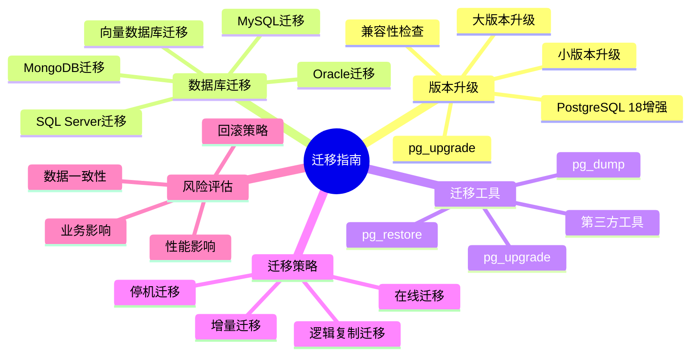
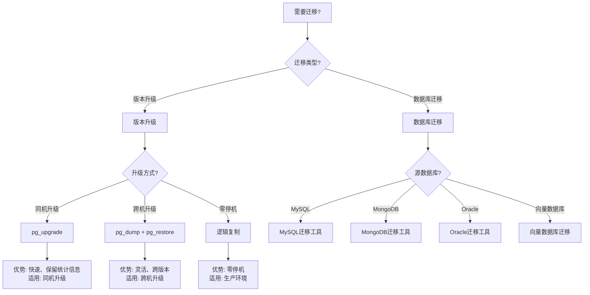

# 24-迁移指南

> **文档总数**: 4个文档
> **覆盖领域**: 版本迁移、数据迁移、升级指南、兼容性
> **版本覆盖**: PostgreSQL 18.x (推荐) ⭐ | 17.x (推荐) | 16.x (兼容)

---

## 📊 知识体系思维导图

---

## 📋 主题说明

本主题整合所有PostgreSQL迁移指南相关内容，包括版本升级迁移、数据迁移、升级工具使用、兼容性检查等。

---

## 📊 迁移方案选型决策树

---

## 📊 迁移方案对比矩阵

| 迁移方案 | 速度 | 停机时间 | 数据完整性 | 复杂度 | 适用场景 |
|---------|------|---------|-----------|--------|---------|
| **pg_upgrade** | ⭐⭐⭐⭐⭐ | 短 | ⭐⭐⭐⭐⭐ | ⭐⭐ | 同机版本升级 |
| **pg_dump + pg_restore** | ⭐⭐⭐ | 长 | ⭐⭐⭐⭐⭐ | ⭐⭐⭐ | 跨机升级、迁移 |
| **逻辑复制** | ⭐⭐⭐⭐ | 极短 | ⭐⭐⭐⭐ | ⭐⭐⭐⭐ | 零停机升级 |
| **第三方工具** | ⭐⭐⭐ | 中 | ⭐⭐⭐⭐ | ⭐⭐⭐⭐ | 跨数据库迁移 |

---

## 🎯 使用建议

### 版本升级

1. 查看版本迁移指南了解升级步骤
2. 使用pg_upgrade工具进行升级
3. 进行兼容性检查和测试

### 数据迁移

1. 参考数据迁移指南
2. 选择合适的迁移工具
3. 进行数据验证

---

## 📚 核心文档

### 数据库迁移

- **[从MySQL迁移.md](./从MySQL迁移.md)** - MySQL到PostgreSQL的完整迁移指南
- **[从MongoDB迁移.md](./从MongoDB迁移.md)** - MongoDB到PostgreSQL的迁移方案
- **[从专用向量数据库迁移.md](./从专用向量数据库迁移.md)** - 向量数据库迁移到PostgreSQL+pgvector

### 迁移与升级场景分析

- **[数据库迁移与升级场景分析指南.md](./数据库迁移与升级场景分析指南.md)** ⭐⭐⭐⭐⭐ ⭐ 新增
  - 版本升级场景分析（大版本升级策略、升级风险评估）
  - 数据库迁移场景（Oracle、MySQL、SQL Server到PostgreSQL迁移）
  - 迁移工具对比与选型（pg_dump vs pg_upgrade vs 第三方工具）
  - 迁移风险评估场景（数据一致性、性能影响、业务影响）
  - **字数**: 约28,000字
  - **状态**: ✅ 已完成

---

## 📚 文档来源

本主题整合了以下源目录的文档：

- `PostgreSQL/02-版本特性/02.03-版本对比与迁移指南.md`
- `PostgreSQL培训/00-项目文件/PostgreSQL版本迁移完整指南.md`
- `docs/01-PostgreSQL18/10-pg_upgrade升级完整指南.md`
- `PostgreSQL_View/09-实践指南/迁移指南/`

**原则**: 所有文档均为复制，原文件保持不变。

---

## 🔗 相关文档

- [18-版本特性](../18-版本特性/README.md) - PostgreSQL版本特性
- [21-最佳实践/迁移指南/](../21-最佳实践/迁移指南/) - 从其他数据库迁移指南

---

**最后更新**: 2025年1月
**状态**: ✅ 文档整合完成
