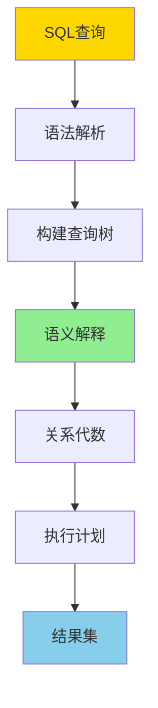
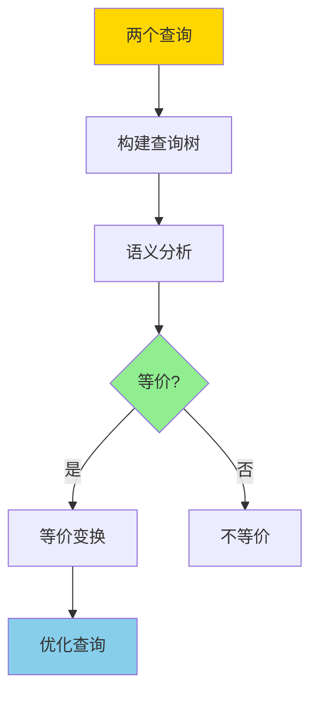

---

> **📋 文档来源**: `DataBaseTheory\01-形式化方法与基础理论\01.06-查询语言的形式语义与等价律.md`
> **📅 复制日期**: 2025-12-22
> **⚠️ 注意**: 本文档为复制版本，原文件保持不变

---

# 查询语言的形式语义与等价律

> **文档版本**: v1.0
> **最后更新**: 2025-01-16
> **版本覆盖**: PostgreSQL 18.x (推荐) ⭐ | 17.x (推荐) | 16.x (兼容)
> **文档状态**: 🟡 框架已创建，内容待完善

---

## 📋 目录

- [查询语言的形式语义与等价律](#查询语言的形式语义与等价律)
  - [📋 目录](#-目录)
  - [1. 概述](#1-概述)
    - [1.0 查询语言形式语义工作原理概述](#10-查询语言形式语义工作原理概述)
    - [1.1 本文档的范围](#11-本文档的范围)
  - [2. 核心内容](#2-核心内容)
    - [2.1 SQL语法形式化](#21-sql语法形式化)
    - [2.2 查询语义形式化](#22-查询语义形式化)
    - [2.3 查询等价律](#23-查询等价律)
  - [3. 形式化定义](#3-形式化定义)
    - [3.1 查询语法形式化](#31-查询语法形式化)
    - [3.2 查询语义形式化](#32-查询语义形式化)
    - [3.3 等价性形式化](#33-等价性形式化)
  - [4. 定理与证明](#4-定理与证明)
    - [4.1 选择下推定理](#41-选择下推定理)
    - [4.2 投影下推定理](#42-投影下推定理)
  - [5. 实际应用](#5-实际应用)
    - [5.1 PostgreSQL查询优化](#51-postgresql查询优化)
    - [5.2 等价性验证](#52-等价性验证)
    - [5.3 查询优化器应用](#53-查询优化器应用)
  - [6. 相关文档](#6-相关文档)
    - [6.1 理论基础文档](#61-理论基础文档)
  - [7. 参考文献](#7-参考文献)
    - [7.1 核心理论文献](#71-核心理论文献)
    - [7.2 查询优化相关](#72-查询优化相关)
    - [7.3 PostgreSQL实现相关](#73-postgresql实现相关)
    - [7.4 相关文档](#74-相关文档)

---

## 1. 概述

### 1.0 查询语言形式语义工作原理概述

**查询语言形式语义**：

查询语言的形式语义为SQL查询提供严格的数学定义，包括语法、语义和等价性规则。本文档提供查询语言的形式语义定义和等价性证明。

**查询语义架构**：



**等价性判定流程**：



### 1.1 本文档的范围

本文档涵盖：

- **形式语义**：SQL查询的形式语义定义
- **等价律**：查询等价的判定规则和证明
- **查询重写**：基于等价性的查询优化
- **实际应用**：形式语义在查询优化器中的应用

---

## 2. 核心内容

### 2.1 SQL语法形式化

**SQL语法（BNF）**：

```bnf
<query> ::= <select> <from> [<where>] [<group_by>] [<having>] [<order_by>]
<select> ::= SELECT [DISTINCT] <select_list>
<from> ::= FROM <table_list>
<where> ::= WHERE <condition>
<group_by> ::= GROUP BY <column_list>
<having> ::= HAVING <condition>
<order_by> ::= ORDER BY <sort_list>
```

### 2.2 查询语义形式化

**查询语义函数**：

```haskell
-- 查询语义
· : Query → Database → Relation

-- SELECT语义
SELECT cols FROM table WHERE cond(DB) =
    σ_cond(π_cols(table))

-- JOIN语义
SELECT * FROM t1 JOIN t2 ON p(DB) =
    t1 ⋈_p t2
```

### 2.3 查询等价律

**基本等价律**：

```haskell
-- 选择下推
σ_cond(R ⋈ S) ≡ σ_cond(R) ⋈ S  (如果cond只涉及R)

-- 投影下推
π_cols(R ⋈ S) ≡ π_cols(R) ⋈ π_cols(S)

-- 连接交换
R ⋈ S ≡ S ⋈ R

-- 连接结合
(R ⋈ S) ⋈ T ≡ R ⋈ (S ⋈ T)
```

---

## 3. 形式化定义

### 3.1 查询语法形式化

**查询语法树**：

```haskell
-- 查询树
data QueryTree =
    Select [Column] QueryTree
  | From Table
  | Where Condition QueryTree
  | Join QueryTree QueryTree JoinCondition
  | GroupBy [Column] QueryTree
  | OrderBy [Column] QueryTree
```

### 3.2 查询语义形式化

**语义解释函数**：

```haskell
-- 语义解释
· : QueryTree → Database → Relation

Select cols q(DB) = π_cols(q(DB))
From table(DB) = DB[table]
Where cond q(DB) = σ_cond(q(DB))
Join q1 q2 cond(DB) = q1(DB) ⋈_cond q2(DB)
```

### 3.3 等价性形式化

**查询等价**：

```haskell
-- 查询等价
Q1 ≡ Q2 iff forall DB: Q1(DB) = Q2(DB)
```

---

## 4. 定理与证明

### 4.1 选择下推定理

**定理**：如果选择条件只涉及关系R的属性，则可以将选择下推到连接之前。

**证明**：

1. 设 Q = σ_cond(R ⋈ S)，且cond只涉及R的属性
2. 根据选择与连接的交换律：σ_cond(R ⋈ S) = σ_cond(R) ⋈ S
3. 因此可以下推选择操作

### 4.2 投影下推定理

**定理**：投影可以下推到连接之前，只要保留连接所需的属性。

**证明**：

1. 设 Q = π_cols(R ⋈_cond S)
2. 设cols_R = cols ∩ attributes(R)，cols_S = cols ∩ attributes(S)
3. 根据投影与连接的交换律：π_cols(R ⋈ S) = π_cols(π_cols_R(R) ⋈ π_cols_S(S))
4. 因此可以下推投影操作

---

## 5. 实际应用

### 5.1 PostgreSQL查询优化

**查询重写示例**：

```sql
-- 数据准备：创建订单表和客户表
CREATE TABLE IF NOT EXISTS customers (
    id SERIAL PRIMARY KEY,
    name VARCHAR(100) NOT NULL,
    city VARCHAR(50)
);

CREATE TABLE IF NOT EXISTS orders (
    id SERIAL PRIMARY KEY,
    customer_id INTEGER REFERENCES customers(id),
    total DECIMAL(10, 2) NOT NULL,
    order_date DATE NOT NULL DEFAULT CURRENT_DATE
);

-- 插入示例数据
INSERT INTO customers (name, city) VALUES
    ('Alice', 'NYC'),
    ('Bob', 'LA'),
    ('Charlie', 'NYC')
ON CONFLICT DO NOTHING;

INSERT INTO orders (customer_id, total, order_date) VALUES
    (1, 1500.00, '2024-01-15'),
    (1, 800.00, '2024-01-20'),
    (2, 1200.00, '2024-01-18'),
    (3, 500.00, '2024-01-22')
ON CONFLICT DO NOTHING;

-- 原始查询
SELECT o.id, c.name
FROM orders o
JOIN customers c ON o.customer_id = c.id
WHERE o.total > 1000;

-- 优化后的查询（选择下推）
SELECT o.id, c.name
FROM (
    SELECT id, customer_id FROM orders WHERE total > 1000
) o
JOIN customers c ON o.customer_id = c.id;
```

### 5.2 等价性验证

**使用EXPLAIN验证等价性**：

```sql
-- 数据准备（orders表已创建）

-- 原始查询计划
EXPLAIN SELECT * FROM orders WHERE total > 1000;

-- 等价查询计划
EXPLAIN SELECT * FROM (SELECT * FROM orders) WHERE total > 1000;

-- 两个查询应该产生相同的执行计划（经过优化后）
-- 查询优化器会自动应用投影消除规则，将嵌套子查询优化为直接查询
```

### 5.3 查询优化器应用

**PostgreSQL查询优化器使用等价律**：

```sql
-- 数据准备：创建产品表
CREATE TABLE IF NOT EXISTS products (
    id SERIAL PRIMARY KEY,
    name VARCHAR(100) NOT NULL,
    price DECIMAL(10, 2) NOT NULL
);

-- 修改orders表添加product_id（如果不存在）
ALTER TABLE orders ADD COLUMN IF NOT EXISTS product_id INTEGER REFERENCES products(id);

-- 插入示例数据
INSERT INTO products (name, price) VALUES
    ('Product A', 100.00),
    ('Product B', 200.00),
    ('Product C', 150.00)
ON CONFLICT DO NOTHING;

UPDATE orders SET product_id = 1 WHERE id = 1;
UPDATE orders SET product_id = 2 WHERE id = 2;
UPDATE orders SET product_id = 3 WHERE id = 3;
UPDATE orders SET product_id = 1 WHERE id = 4;

UPDATE customers SET city = 'New York' WHERE name IN ('Alice', 'Charlie');

-- 查询优化器会自动应用等价律
-- 例如：选择下推、投影下推、连接顺序优化等

-- 查看优化后的查询计划
EXPLAIN (ANALYZE, BUFFERS, VERBOSE)
SELECT o.id, c.name, p.name
FROM orders o
JOIN customers c ON o.customer_id = c.id
JOIN products p ON o.product_id = p.id
WHERE o.total > 1000 AND c.city = 'New York';
```

---

## 6. 相关文档

### 6.1 理论基础文档

- [形式语言与证明：总论](./01.05-形式语言与证明-总论.md)
- [理论基础导航](../README.md)

---

## 7. 参考文献

### 7.1 核心理论文献

- **Abiteboul, S., et al. (1995). "Foundations of Databases."**
  - 出版社: Addison-Wesley
  - **重要性**: 数据库理论的经典教材
  - **核心贡献**: 提供了查询语言的形式语义定义

- **Ullman, J. D. (1988). "Principles of Database and Knowledge-Base Systems."**
  - 出版社: Computer Science Press
  - **重要性**: 数据库系统原理的经典教材
  - **核心贡献**: 系统阐述了查询优化和等价性理论

### 7.2 查询优化相关

- **Chaudhuri, S. (1998). "An Overview of Query Optimization in Relational Systems."**
  - 会议: PODS 1998
  - **重要性**: 查询优化的综述性论文
  - **核心贡献**: 总结了查询优化的主要技术

### 7.3 PostgreSQL实现相关

- **[PostgreSQL官方文档 - 查询规划](<https://www.postgresql.org/docs/current/planner-optimizer.html>)**
  - PostgreSQL查询优化器实现说明

### 7.4 相关文档

- [查询重写等价性-基于同构的充分必要条件](../../02-查询与优化/05.10-查询重写等价性-基于同构的充分必要条件.md)
- [形式语言与证明-总论](./01.05-形式语言与证明-总论.md)
- [理论基础导航](../README.md)

---

**最后更新**: 2025-01-16
**维护者**: Documentation Team
**状态**: 🟡 框架已创建，内容待完善
