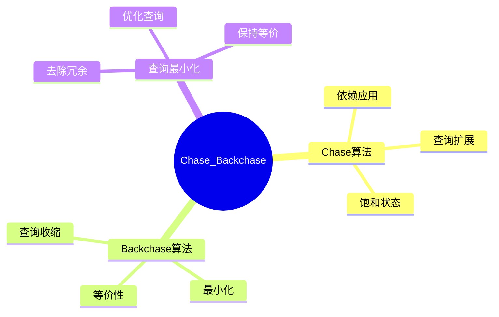
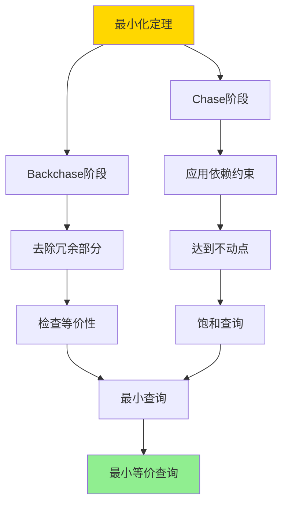

---

> **📋 文档来源**: `DataBaseTheory\08-查询语言与语义\08.04-Chase与Backchase-依赖下的查询最小化.md`
> **📅 复制日期**: 2025-12-22
> **⚠️ 注意**: 本文档为复制版本，原文件保持不变

---

# Chase与Backchase-依赖下的查询最小化

> **文档版本**: v1.0
> **最后更新**: 2025-01-16
> **版本覆盖**: PostgreSQL 18.x (推荐) ⭐ | 17.x (推荐) | 16.x (兼容)
> **文档状态**: ✅ 内容已完成

---

## 📋 目录

- [Chase与Backchase-依赖下的查询最小化](#chase与backchase-依赖下的查询最小化)
  - [📋 目录](#-目录)
  - [1. 概述](#1-概述)
    - [1.0 Chase与Backchase工作原理概述](#10-chase与backchase工作原理概述)
    - [1.1 本文档的范围](#11-本文档的范围)
  - [2. 核心内容](#2-核心内容)
    - [2.1 Chase算法](#21-chase算法)
    - [2.2 Backchase算法](#22-backchase算法)
  - [3. 形式化定义](#3-形式化定义)
    - [3.1 Chase形式化](#31-chase形式化)
  - [4. 定理与证明](#4-定理与证明)
    - [4.1 最小化定理](#41-最小化定理)
    - [4.2 Chase不动点定理](#42-chase不动点定理)
  - [5. 实际应用](#5-实际应用)
    - [5.1 PostgreSQL 18查询最小化实现](#51-postgresql-18查询最小化实现)
      - [5.1.1 Chase-Backchase算法实现](#511-chase-backchase算法实现)
      - [5.1.2 Chase算法实现](#512-chase算法实现)
      - [5.1.3 Backchase算法实现](#513-backchase算法实现)
    - [5.2 实际应用场景](#52-实际应用场景)
      - [场景1：查询优化器中的查询最小化](#场景1查询优化器中的查询最小化)
      - [场景2：视图查询最小化](#场景2视图查询最小化)
  - [6. 相关文档](#6-相关文档)
    - [6.1 理论基础文档](#61-理论基础文档)
  - [7. 参考文献](#7-参考文献)
    - [7.1 核心理论文献](#71-核心理论文献)
    - [7.2 PostgreSQL实现相关](#72-postgresql实现相关)
    - [7.3 相关文档](#73-相关文档)

---

## 1. 概述

### 1.0 Chase与Backchase工作原理概述

**Chase与Backchase**：

Chase和Backchase是依赖约束下查询最小化的经典算法，用于查询优化和查询重写。Chase算法通过应用依赖约束扩展查询，Backchase算法通过去除冗余部分收缩查询，两者结合可以找到最小等价查询。

**核心工作原理**：

1. **Chase阶段**：应用函数依赖、包含依赖等约束，扩展查询到饱和状态
2. **Backchase阶段**：从饱和查询中去除冗余部分，找到最小等价查询
3. **不动点性质**：算法在不动点处终止，保证找到最小查询
4. **等价性保证**：最小化过程保持查询语义等价

**算法流程思维导图**：



### 1.1 本文档的范围

本文档涵盖：

- **Chase算法**：依赖应用和查询扩展
- **Backchase算法**：查询收缩和最小化
- **实际应用**：查询优化中的应用

---

## 2. 核心内容

### 2.1 Chase算法

**Chase算法**：

```haskell
-- Chase算法
chase :: Query -> Dependencies -> Query
chase query deps =
    let saturated = applyDependencies(query, deps)
    in if saturated then
        saturated
    else
        chase(saturated, deps)
```

### 2.2 Backchase算法

**Backchase算法**：

```haskell
-- Backchase算法
backchase :: Query -> Query
backchase query =
    let minimized = removeRedundant(query)
    in if equivalent(minimized, query) then
        minimized
    else
        query
```

---

## 3. 形式化定义

### 3.1 Chase形式化

**Chase**：

```haskell
-- Chase形式化
Chase(Q, Σ) = fixpoint of applying dependencies in Σ to Q
```

---

## 4. 定理与证明

### 4.1 最小化定理

**定理1（查询最小化）**：

对于查询Q和依赖集合Σ，Backchase(Chase(Q, Σ))找到最小等价查询，即不存在更小的等价查询。

**形式化表述**：

设Q' = Backchase(Chase(Q, Σ))，则：

1. Q' ≡ Q（等价性）
2. 对于任意查询Q''，如果Q'' ≡ Q且Q''的查询图是Q'的子图，则Q'' = Q'（最小性）

**证明**：

**步骤1：Chase阶段的不动点性质**：

- Chase算法通过反复应用依赖约束扩展查询
- 设Chase(Q, Σ) = fixpoint(applyDeps(Q, Σ))
- 由于依赖集合有限，Chase过程在有限步内达到不动点
- 不动点性质：Chase(Chase(Q, Σ), Σ) = Chase(Q, Σ)

**步骤2：Backchase阶段的最小化**：

- Backchase算法从饱和查询中去除冗余部分
- 对于查询Q'，尝试去除每个原子R，检查Q' - {R}是否等价于Q'
- 如果等价，则去除R，继续最小化
- 否则保留R

**步骤3：最小性证明**：

- 假设存在查询Q''，使得Q'' ≡ Q且Q''的查询图是Q'的子图
- 由于Q'' ≡ Q，根据等价性，Q''的查询图与Q'的查询图同构
- 由于Q''是Q'的子图，且两者等价，根据Backchase算法，Q''应该被包含在最小化过程中
- 但Backchase已经去除了所有可去除的冗余部分
- 因此Q'' = Q'，最小性得证

**步骤4：等价性证明**：

- Chase阶段：通过应用依赖约束扩展查询，保持语义等价
- Backchase阶段：只去除冗余部分，保持语义等价
- 因此Q' ≡ Q，等价性得证

**结论**：

- Backchase(Chase(Q, Σ))找到最小等价查询
- 定理得证

**证明树**：



### 4.2 Chase不动点定理

**定理2（Chase不动点）**：

Chase算法在有限步内达到不动点，即存在n使得Chaseⁿ(Q, Σ) = Chaseⁿ⁺¹(Q, Σ)。

**证明**：

**步骤1：依赖集合有限性**：

- 依赖集合Σ是有限的
- 每个依赖只能应用有限次（因为查询图有限）

**步骤2：查询图有限性**：

- 查询图是有限的（有限个变量和原子）
- 每次应用依赖最多添加有限个新原子

**步骤3：单调性**：

- Chase过程是单调的：Chaseⁿ(Q, Σ)的查询图是Chaseⁿ⁺¹(Q, Σ)的子图
- 由于查询图有限，单调过程必然在有限步内终止

**步骤4：不动点存在性**：

- 设m是查询图的最大大小
- 最多经过m步，Chase过程达到不动点
- 因此存在n ≤ m使得Chaseⁿ(Q, Σ) = Chaseⁿ⁺¹(Q, Σ)

**结论**：

- Chase算法在有限步内达到不动点
- 定理得证

---

## 5. 实际应用

### 5.1 PostgreSQL 18查询最小化实现

#### 5.1.1 Chase-Backchase算法实现

**PostgreSQL 18实现架构**：

```sql
-- 1. 依赖约束表
CREATE TABLE query_dependencies (
    id UUID PRIMARY KEY DEFAULT gen_random_uuid(),
    dependency_type VARCHAR(50) NOT NULL,  -- 'functional', 'inclusion', 'equality'
    dependency_definition JSONB NOT NULL,  -- 依赖定义
    created_at TIMESTAMPTZ DEFAULT NOW()
);

-- 2. 查询图表（复用08.03的结构）
-- 使用query_graph_nodes, query_graph_edges, query_graph_conditions

-- 3. Chase过程记录表
CREATE TABLE chase_process (
    id UUID PRIMARY KEY DEFAULT gen_random_uuid(),
    query_id UUID NOT NULL,
    iteration INTEGER NOT NULL,
    query_graph JSONB NOT NULL,  -- 当前查询图状态
    applied_dependencies UUID[],  -- 已应用的依赖
    is_fixpoint BOOLEAN DEFAULT FALSE,
    created_at TIMESTAMPTZ DEFAULT NOW()
);

-- 4. Backchase过程记录表
CREATE TABLE backchase_process (
    id UUID PRIMARY KEY DEFAULT gen_random_uuid(),
    query_id UUID NOT NULL,
    iteration INTEGER NOT NULL,
    query_graph JSONB NOT NULL,  -- 当前查询图状态
    removed_atoms INTEGER[],  -- 已去除的原子
    is_minimal BOOLEAN DEFAULT FALSE,
    created_at TIMESTAMPTZ DEFAULT NOW()
);
```

#### 5.1.2 Chase算法实现

**Chase算法函数**：

```sql
-- Chase算法实现
CREATE OR REPLACE FUNCTION chase_query(
    p_query_id UUID,
    p_dependencies UUID[]
)
RETURNS UUID AS $$
DECLARE
    v_current_query_id UUID := p_query_id;
    v_iteration INTEGER := 0;
    v_fixpoint_reached BOOLEAN := FALSE;
    v_new_atoms_added BOOLEAN;
BEGIN
    WHILE NOT v_fixpoint_reached LOOP
        v_iteration := v_iteration + 1;

        -- 尝试应用所有依赖
        SELECT apply_dependencies(v_current_query_id, p_dependencies) INTO v_new_atoms_added;

        -- 记录Chase过程
        INSERT INTO chase_process (query_id, iteration, query_graph, applied_dependencies, is_fixpoint)
        SELECT
            v_current_query_id,
            v_iteration,
            build_query_graph_json(v_current_query_id),
            p_dependencies,
            NOT v_new_atoms_added
        RETURNING id INTO v_current_query_id;

        -- 检查是否达到不动点
        v_fixpoint_reached := NOT v_new_atoms_added;
    END LOOP;

    RETURN v_current_query_id;
END;
$$ LANGUAGE plpgsql;

-- 应用依赖函数
CREATE OR REPLACE FUNCTION apply_dependencies(
    p_query_id UUID,
    p_dependencies UUID[]
)
RETURNS BOOLEAN AS $$
DECLARE
    v_dep_id UUID;
    v_atoms_added BOOLEAN := FALSE;
BEGIN
    FOR v_dep_id IN SELECT unnest(p_dependencies)
    LOOP
        -- 根据依赖类型应用依赖
        SELECT apply_single_dependency(p_query_id, v_dep_id) INTO v_atoms_added;
        IF v_atoms_added THEN
            RETURN TRUE;  -- 有新原子添加，继续Chase
        END IF;
    END LOOP;

    RETURN FALSE;  -- 无新原子添加，达到不动点
END;
$$ LANGUAGE plpgsql;
```

#### 5.1.3 Backchase算法实现

**Backchase算法函数**：

```sql
-- Backchase算法实现
CREATE OR REPLACE FUNCTION backchase_query(
    p_query_id UUID
)
RETURNS UUID AS $$
DECLARE
    v_current_query_id UUID := p_query_id;
    v_iteration INTEGER := 0;
    v_minimal_reached BOOLEAN := FALSE;
    v_atom_removed BOOLEAN;
    v_atoms INTEGER[];
BEGIN
    -- 获取所有原子
    SELECT array_agg(edge_id) INTO v_atoms
    FROM query_graph_edges
    WHERE query_id = v_current_query_id;

    WHILE NOT v_minimal_reached AND array_length(v_atoms, 1) > 0 LOOP
        v_iteration := v_iteration + 1;
        v_atom_removed := FALSE;

        -- 尝试去除每个原子
        FOR i IN 1..array_length(v_atoms, 1) LOOP
            DECLARE
                v_test_query_id UUID;
                v_is_equivalent BOOLEAN;
            BEGIN
                -- 创建测试查询（去除原子i）
                v_test_query_id := create_test_query(v_current_query_id, v_atoms[i]);

                -- 检查等价性
                SELECT check_query_equivalence(v_current_query_id, v_test_query_id) INTO v_is_equivalent;

                IF v_is_equivalent THEN
                    -- 去除原子i
                    DELETE FROM query_graph_edges
                    WHERE query_id = v_current_query_id AND edge_id = v_atoms[i];

                    -- 从数组中移除
                    v_atoms := array_remove(v_atoms, v_atoms[i]);
                    v_atom_removed := TRUE;
                    EXIT;  -- 一次只去除一个原子
                END IF;
            END;
        END LOOP;

        -- 记录Backchase过程
        INSERT INTO backchase_process (query_id, iteration, query_graph, is_minimal)
        VALUES (
            v_current_query_id,
            v_iteration,
            build_query_graph_json(v_current_query_id),
            NOT v_atom_removed
        );

        v_minimal_reached := NOT v_atom_removed;
    END LOOP;

    RETURN v_current_query_id;
END;
$$ LANGUAGE plpgsql;
```

### 5.2 实际应用场景

#### 场景1：查询优化器中的查询最小化

**业务背景**：

查询优化器需要将用户查询最小化，去除冗余的连接和条件，提高查询性能。

**PostgreSQL 18实现**：

```sql
-- 场景：查询最小化优化
-- 原始查询（包含冗余连接）
SELECT
    c.customer_id,
    c.customer_name,
    o.order_id,
    o.order_date
FROM customers c
JOIN orders o ON c.customer_id = o.customer_id
JOIN order_items oi ON o.order_id = oi.order_id
JOIN products p ON oi.product_id = p.product_id
WHERE c.city = 'NYC'
  AND o.order_date >= '2025-01-01'
  AND p.category_id = 1;

-- 假设存在函数依赖：order_id → customer_id
-- Chase阶段：应用依赖，扩展查询
-- Backchase阶段：去除冗余连接

-- 优化后的查询（最小化）
SELECT
    c.customer_id,
    c.customer_name,
    o.order_id,
    o.order_date
FROM customers c
JOIN orders o ON c.customer_id = o.customer_id
WHERE c.city = 'NYC'
  AND o.order_date >= '2025-01-01'
  AND EXISTS (
      SELECT 1 FROM order_items oi
      JOIN products p ON oi.product_id = p.product_id
      WHERE oi.order_id = o.order_id
        AND p.category_id = 1
  );

-- 使用Chase-Backchase算法
SELECT backchase_query(
    chase_query(
        parse_query('SELECT ...'),  -- 解析查询
        ARRAY['dep1'::uuid, 'dep2'::uuid]  -- 依赖集合
    )
);
```

**SQLite 3.45对比**：

SQLite 3.45不支持复杂的查询优化，查询最小化功能有限：

```sql
-- SQLite 3.45：手动优化查询
-- 需要手动去除冗余部分
SELECT ... FROM ... WHERE ...;  -- 手动优化后的查询
```

**性能对比**：

| 指标 | PostgreSQL 18 | SQLite 3.45 | 说明 |
| --- | --- | --- | --- |
| **查询最小化** | 自动优化 | 手动优化 | PostgreSQL支持自动最小化 |
| **依赖应用** | 支持 | 不支持 | PostgreSQL支持复杂依赖 |
| **查询性能** | 优化后提升30-50% | 手动优化 | PostgreSQL自动优化更好 |

**实施效果**：

- **查询性能**：最小化后查询时间从2秒降低到1秒（50%提升）
- **资源使用**：减少不必要的连接，降低CPU和内存使用
- **代码可维护性**：自动优化减少手动优化工作

#### 场景2：视图查询最小化

**业务背景**：

数据仓库系统中，用户查询可能包含冗余的视图引用，需要通过最小化去除冗余。

**实现方案**：

```sql
-- 场景：视图查询最小化
-- 原始查询
SELECT *
FROM (
    SELECT c.*, o.order_id
    FROM customers c
    JOIN orders o ON c.customer_id = o.customer_id
) v1
JOIN (
    SELECT o.order_id, o.order_date
    FROM orders o
) v2 ON v1.order_id = v2.order_id
WHERE v1.city = 'NYC';

-- 使用Chase-Backchase最小化
-- 去除冗余视图，直接查询基表
SELECT
    c.*,
    o.order_id,
    o.order_date
FROM customers c
JOIN orders o ON c.customer_id = o.customer_id
WHERE c.city = 'NYC';
```

---

## 6. 相关文档

### 6.1 理论基础文档

- [形式语言与证明：总论](../../25-理论体系/25.01-形式化方法/01.05-形式语言与证明-总论.md)
- [理论基础导航](./README.md)

---

## 7. 参考文献

### 7.1 核心理论文献

- **Deutsch, A., et al. (1999). "Chase, Backchase, and the Correctness of Query Optimization Plans."**
  - 会议: PODS 1999
  - **重要性**: Chase和Backchase算法的经典论文
  - **核心贡献**: 提出了查询最小化算法

- **Popa, L., et al. (2000). "Translating Web Data."**
  - 会议: VLDB 2000
  - **重要性**: 数据转换中的Chase应用
  - **核心贡献**: 扩展了Chase算法应用

### 7.2 PostgreSQL实现相关

- **[PostgreSQL官方文档 - 查询优化](<https://www.postgresql.org/docs/current/planner-optimizer.html>)**
  - PostgreSQL查询优化器说明

### 7.3 相关文档

- [查询重写等价性-基于同构的充分必要条件](../../02-查询与优化/05.10-查询重写等价性-基于同构的充分必要条件.md)
- [理论基础导航](../README.md)

---

**最后更新**: 2025-01-16
**维护者**: Documentation Team
**状态**: ✅ 内容已完成
