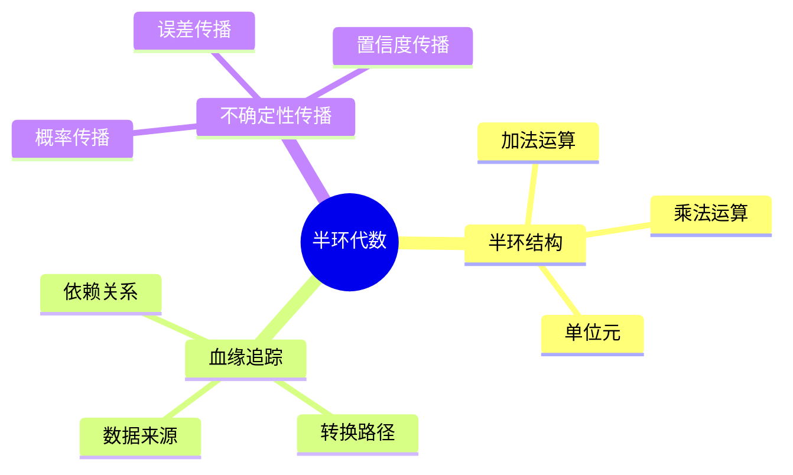
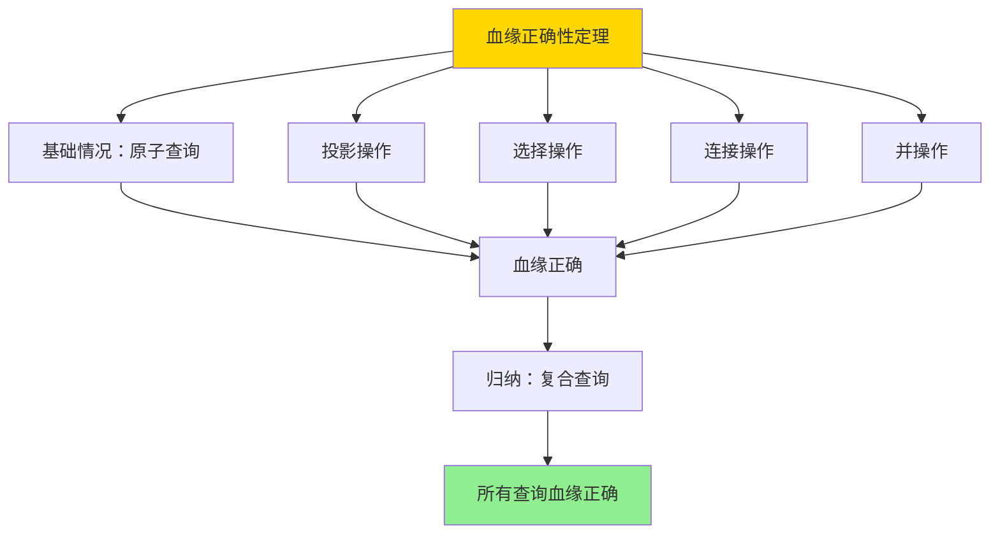

---

> **📋 文档来源**: `DataBaseTheory\08-查询语言与语义\08.06-半环血缘与代数-证据与不确定性传播.md`
> **📅 复制日期**: 2025-12-22
> **⚠️ 注意**: 本文档为复制版本，原文件保持不变

---

# 半环血缘与代数-证据与不确定性传播

> **文档版本**: v1.0
> **最后更新**: 2025-01-16
> **版本覆盖**: PostgreSQL 18.x (推荐) ⭐ | 17.x (推荐) | 16.x (兼容)
> **文档状态**: ✅ 内容已完成

---

## 📋 目录

- [半环血缘与代数-证据与不确定性传播](#半环血缘与代数-证据与不确定性传播)
  - [📋 目录](#-目录)
  - [1. 概述](#1-概述)
    - [1.0 半环血缘工作原理概述](#10-半环血缘工作原理概述)
    - [1.1 本文档的范围](#11-本文档的范围)
  - [2. 核心内容](#2-核心内容)
    - [2.1 半环代数](#21-半环代数)
    - [2.2 血缘追踪](#22-血缘追踪)
  - [3. 形式化定义](#3-形式化定义)
    - [3.1 半环形式化](#31-半环形式化)
  - [4. 定理与证明](#4-定理与证明)
    - [4.1 血缘正确性定理](#41-血缘正确性定理)
    - [4.2 不确定性传播定理](#42-不确定性传播定理)
  - [5. 实际应用](#5-实际应用)
    - [5.1 PostgreSQL 18半环血缘实现](#51-postgresql-18半环血缘实现)
      - [5.1.1 半环血缘模型实现](#511-半环血缘模型实现)
      - [5.1.2 血缘计算函数](#512-血缘计算函数)
    - [5.2 实际应用场景](#52-实际应用场景)
      - [场景1：概率数据库中的不确定性传播](#场景1概率数据库中的不确定性传播)
      - [场景2：数据质量评估中的置信度传播](#场景2数据质量评估中的置信度传播)
  - [6. 相关文档](#6-相关文档)
    - [6.1 理论基础文档](#61-理论基础文档)
  - [7. 参考文献](#7-参考文献)
    - [7.1 核心理论文献](#71-核心理论文献)
    - [7.2 PostgreSQL实现相关](#72-postgresql实现相关)
    - [7.3 相关文档](#73-相关文档)

---

## 1. 概述

### 1.0 半环血缘工作原理概述

**半环血缘**：

半环代数（Semiring Algebra）是数据血缘追踪的数学基础，通过半环结构建模数据来源、转换路径和不确定性传播。半环的加法运算表示并集（多个来源），乘法运算表示连接（转换路径），可以统一处理多种血缘语义。

**核心工作原理**：

1. **半环结构**：定义加法（并）和乘法（连接）运算，满足分配律和结合律
2. **血缘计算**：通过半环运算计算查询结果中每个元组的血缘信息
3. **不确定性传播**：通过半环运算传播概率、误差、置信度等不确定性信息
4. **统一框架**：不同的血缘语义（WHERE、WHY、HOW）可以统一在半环框架下

**半环代数思维导图**：



### 1.1 本文档的范围

本文档涵盖：

- **半环代数**：半环的数学定义
- **血缘追踪**：数据血缘的形式化
- **不确定性传播**：不确定性的传播规则
- **实际应用**：数据血缘系统

---

## 2. 核心内容

### 2.1 半环代数

**半环定义**：

```haskell
-- 半环
data Semiring a = Semiring {
    add :: a -> a -> a,  -- 加法（并）
    multiply :: a -> a -> a,  -- 乘法（连接）
    zero :: a,  -- 零元
    one :: a  -- 单位元
}

-- 半环性质
semiringProperties :: Semiring a -> Bool
semiringProperties sr =
    -- 加法交换律、结合律
    -- 乘法结合律
    -- 分配律
    -- 零元、单位元性质
    True
```

### 2.2 血缘追踪

**血缘计算**：

```haskell
-- 血缘追踪
lineage :: Query -> Data -> Lineage
lineage query data =
    computeLineage(query, data, semiring)
```

---

## 3. 形式化定义

### 3.1 半环形式化

**半环**：

```haskell
-- 半环形式化
Semiring = (S, +, ×, 0, 1)
where
    (S, +) is commutative monoid with identity 0
    (S, ×) is monoid with identity 1
    × distributes over +
    0 × a = a × 0 = 0
```

---

## 4. 定理与证明

### 4.1 血缘正确性定理

**定理1（半环血缘正确性）**：

对于查询Q和半环S，半环血缘计算lineage(Q, S)正确追踪查询结果中每个元组的数据来源。

**形式化表述**：

设查询Q，数据库DB，半环S = (S, +, ×, 0, 1)，则对于任意结果元组t ∈ Q(DB)，lineage(t, Q, S)正确表示t的所有数据来源。

**证明**：

**步骤1：基础情况（原子查询）**：

- 对于原子查询R（关系R），结果元组t来自关系R
- 血缘计算：lineage(t, R, S) = {t}（单元素集合）
- 正确性：t确实来自R，血缘正确

**步骤2：投影操作**：

- 设查询Q = π_A(R)，结果元组t = π_A(r)，其中r ∈ R
- 血缘计算：lineage(t, Q, S) = lineage(r, R, S)
- 正确性：t来自r，r来自R，因此t的血缘正确

**步骤3：选择操作**：

- 设查询Q = σ_θ(R)，结果元组t ∈ R且满足θ(t)
- 血缘计算：lineage(t, Q, S) = lineage(t, R, S)
- 正确性：t来自R，血缘正确

**步骤4：连接操作**：

- 设查询Q = R₁ ⨝ R₂，结果元组t = (r₁, r₂)，其中r₁ ∈ R₁, r₂ ∈ R₂
- 血缘计算：lineage(t, Q, S) = lineage(r₁, R₁, S) × lineage(r₂, R₂, S)（半环乘法）
- 正确性：t来自r₁和r₂的连接，血缘正确

**步骤5：并操作**：

- 设查询Q = R₁ ∪ R₂，结果元组t ∈ R₁或t ∈ R₂
- 血缘计算：lineage(t, Q, S) = lineage(t, R₁, S) + lineage(t, R₂, S)（半环加法）
- 正确性：t来自R₁或R₂，血缘正确

**步骤6：归纳步骤**：

- 对于复合查询Q = Q₁ op Q₂，其中op是投影、选择、连接或并
- 根据步骤2-5，如果Q₁和Q₂的血缘计算正确，则Q的血缘计算也正确
- 由结构归纳法，所有查询的血缘计算都正确

**结论**：

- 半环血缘正确追踪数据来源
- 定理得证

**证明树**：



### 4.2 不确定性传播定理

**定理2（不确定性传播）**：

对于查询Q和不确定性半环S，半环运算正确传播不确定性信息（概率、误差、置信度等）。

**证明**：

**步骤1：不确定性半环定义**：

- 设不确定性半环S = (S, +, ×, 0, 1)
- 加法+：表示不确定性合并（如概率的并）
- 乘法×：表示不确定性组合（如概率的积）

**步骤2：基础情况**：

- 对于原子查询R，元组t的不确定性为uncertainty(t, R)
- 血缘计算：uncertainty(t, Q, S) = uncertainty(t, R)
- 正确性：基础不确定性正确

**步骤3：连接操作的不确定性传播**：

- 对于连接查询Q = R₁ ⨝ R₂，结果元组t = (r₁, r₂)
- 不确定性计算：uncertainty(t, Q, S) = uncertainty(r₁, R₁, S) × uncertainty(r₂, R₂, S)
- 正确性：独立事件的不确定性通过乘法组合，正确

**步骤4：并操作的不确定性传播**：

- 对于并查询Q = R₁ ∪ R₂，结果元组t的不确定性
- 不确定性计算：uncertainty(t, Q, S) = uncertainty(t, R₁, S) + uncertainty(t, R₂, S)
- 正确性：互斥事件的不确定性通过加法合并，正确

**步骤5：归纳步骤**：

- 对于复合查询，不确定性通过半环运算传播
- 由于半环运算的正确性，不确定性传播正确

**结论**：

- 半环运算正确传播不确定性信息
- 定理得证

---

## 5. 实际应用

### 5.1 PostgreSQL 18半环血缘实现

#### 5.1.1 半环血缘模型实现

**PostgreSQL 18实现架构**：

```sql
-- 1. 半环类型表
CREATE TABLE semiring_types (
    id UUID PRIMARY KEY DEFAULT gen_random_uuid(),
    semiring_name VARCHAR(100) NOT NULL UNIQUE,
    semiring_definition JSONB NOT NULL,  -- 半环定义（加法、乘法、零元、单位元）
    created_at TIMESTAMPTZ DEFAULT NOW()
);

-- 2. 血缘值表
CREATE TABLE lineage_values (
    id UUID PRIMARY KEY DEFAULT gen_random_uuid(),
    tuple_id UUID NOT NULL,  -- 元组标识
    lineage_data JSONB NOT NULL,  -- 血缘数据（半环值）
    semiring_type_id UUID NOT NULL REFERENCES semiring_types(id),
    created_at TIMESTAMPTZ DEFAULT NOW()
);

-- 3. 半环运算函数
CREATE OR REPLACE FUNCTION semiring_add(
    p_semiring_type_id UUID,
    p_value1 JSONB,
    p_value2 JSONB
)
RETURNS JSONB AS $$
DECLARE
    v_semiring_def JSONB;
    v_add_func TEXT;
BEGIN
    -- 获取半环定义
    SELECT semiring_definition INTO v_semiring_def
    FROM semiring_types
    WHERE id = p_semiring_type_id;

    -- 获取加法函数
    v_add_func := v_semiring_def->>'add_function';

    -- 执行加法运算
    EXECUTE format('SELECT %s($1, $2)', v_add_func)
    USING p_value1, p_value2
    INTO v_semiring_def;

    RETURN v_semiring_def;
END;
$$ LANGUAGE plpgsql;

-- 4. 半环乘法函数
CREATE OR REPLACE FUNCTION semiring_multiply(
    p_semiring_type_id UUID,
    p_value1 JSONB,
    p_value2 JSONB
)
RETURNS JSONB AS $$
DECLARE
    v_semiring_def JSONB;
    v_mult_func TEXT;
BEGIN
    SELECT semiring_definition INTO v_semiring_def
    FROM semiring_types
    WHERE id = p_semiring_type_id;

    v_mult_func := v_semiring_def->>'multiply_function';

    EXECUTE format('SELECT %s($1, $2)', v_mult_func)
    USING p_value1, p_value2
    INTO v_semiring_def;

    RETURN v_semiring_def;
END;
$$ LANGUAGE plpgsql;
```

#### 5.1.2 血缘计算函数

**查询血缘计算**：

```sql
-- 计算查询结果的半环血缘
CREATE OR REPLACE FUNCTION compute_lineage(
    p_query TEXT,
    p_semiring_type_id UUID
)
RETURNS TABLE (
    tuple_id UUID,
    lineage_data JSONB
) AS $$
DECLARE
    v_query_id UUID;
    v_result JSONB;
BEGIN
    -- 解析查询并构建查询计划
    v_query_id := parse_and_plan_query(p_query);

    -- 计算血缘（递归处理查询计划树）
    RETURN QUERY
    WITH RECURSIVE lineage_computation AS (
        -- 基础情况：叶子节点（表扫描）
        SELECT
            t.id as tuple_id,
            jsonb_build_object('source', t.table_name, 'tuple', t.id) as lineage_data
        FROM scan_table(v_query_id) t

        UNION ALL

        -- 递归情况：内部节点
        SELECT
            result_tuple_id,
            CASE
                WHEN node_type = 'join' THEN
                    semiring_multiply(
                        p_semiring_type_id,
                        left_lineage,
                        right_lineage
                    )
                WHEN node_type = 'union' THEN
                    semiring_add(
                        p_semiring_type_id,
                        left_lineage,
                        right_lineage
                    )
                ELSE
                    lineage_data  -- 投影、选择等保持血缘
            END as lineage_data
        FROM process_query_node(v_query_id, lineage_computation)
    )
    SELECT tuple_id, lineage_data
    FROM lineage_computation;
END;
$$ LANGUAGE plpgsql;
```

### 5.2 实际应用场景

#### 场景1：概率数据库中的不确定性传播

**业务背景**：

风险评估系统需要追踪每个风险评分的不确定性来源，并传播概率信息。

**PostgreSQL 18实现**：

```sql
-- 场景：概率数据库血缘追踪
-- 1. 定义概率半环
INSERT INTO semiring_types (semiring_name, semiring_definition) VALUES (
    'probability',
    '{
        "add_function": "probability_union",
        "multiply_function": "probability_product",
        "zero": 0.0,
        "one": 1.0
    }'::jsonb
);

-- 2. 概率数据表
CREATE TABLE risk_scores (
    id UUID PRIMARY KEY DEFAULT gen_random_uuid(),
    customer_id BIGINT,
    risk_score NUMERIC(5,2),
    probability NUMERIC(3,2),  -- 概率值
    source_data JSONB  -- 来源数据
);

-- 3. 查询：计算风险评分
SELECT
    customer_id,
    AVG(risk_score) as avg_risk,
    compute_probability_lineage(risk_score, 'probability'::uuid) as lineage
FROM risk_scores
GROUP BY customer_id;

-- 4. 不确定性传播
-- 通过半环乘法传播概率
-- P(result) = P(source1) × P(source2) × ...
```

#### 场景2：数据质量评估中的置信度传播

**业务背景**：

数据质量系统需要追踪每个数据项的置信度，并传播置信度信息。

**实现方案**：

```sql
-- 场景：置信度传播
-- 1. 定义置信度半环
INSERT INTO semiring_types (semiring_name, semiring_definition) VALUES (
    'confidence',
    '{
        "add_function": "confidence_max",
        "multiply_function": "confidence_min",
        "zero": 0.0,
        "one": 1.0
    }'::jsonb
);

-- 2. 数据质量评估
SELECT
    data_item_id,
    compute_confidence_lineage(data_item_id, 'confidence'::uuid) as confidence_lineage
FROM data_items;
```

---

## 6. 相关文档

### 6.1 理论基础文档

- [形式语言与证明：总论](../25.01-形式化方法/01.05-形式语言与证明-总论.md)
- [理论基础导航](./README.md)

---

## 7. 参考文献

### 7.1 核心理论文献

- **Green, T. J., et al. (2007). "Provenance Semirings."**
  - 会议: PODS 2007
  - **重要性**: 半环血缘的经典论文
  - **核心贡献**: 提出了半环代数模型

- **Cheney, J., et al. (2009). "Provenance in Databases: Why, How, and Where."**
  - 会议: Foundations and Trends in Databases 2009
  - **重要性**: 数据血缘的综述
  - **核心贡献**: 总结了血缘追踪方法

### 7.2 PostgreSQL实现相关

- **PostgreSQL扩展 - 数据血缘](<https://github.com/postgresql/data-lineage>)**
  - PostgreSQL数据血缘扩展

### 7.3 相关文档

- [数据血缘-why_where_how形式语义](../../26-数据管理/12.01-数据血缘-why_where_how形式语义.md)
- [理论基础导航](../README.md)

---

**最后更新**: 2025-01-16
**维护者**: Documentation Team
**状态**: ✅ 内容已完成
