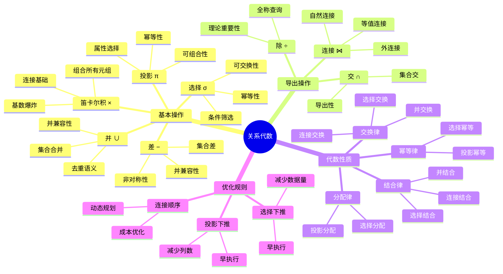
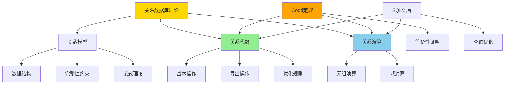
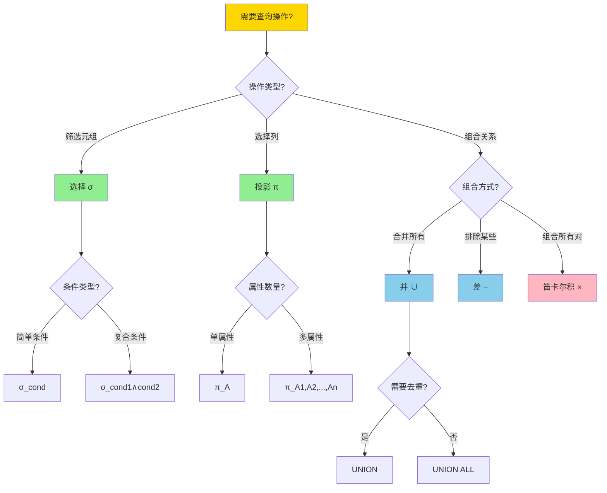
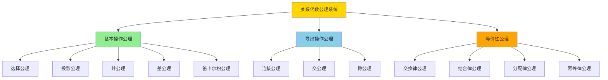
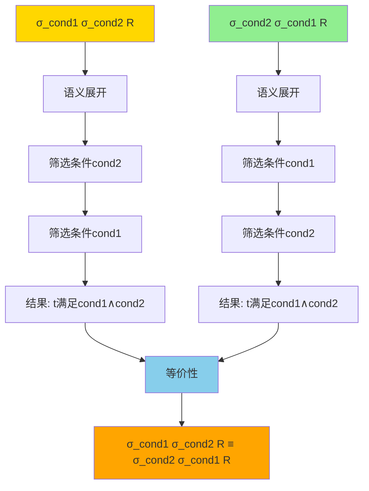
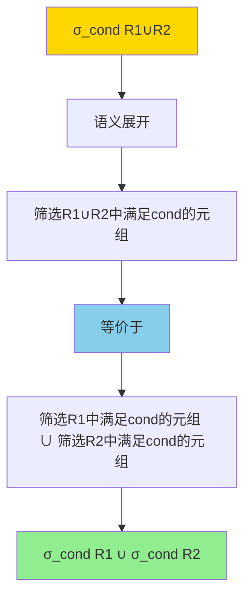
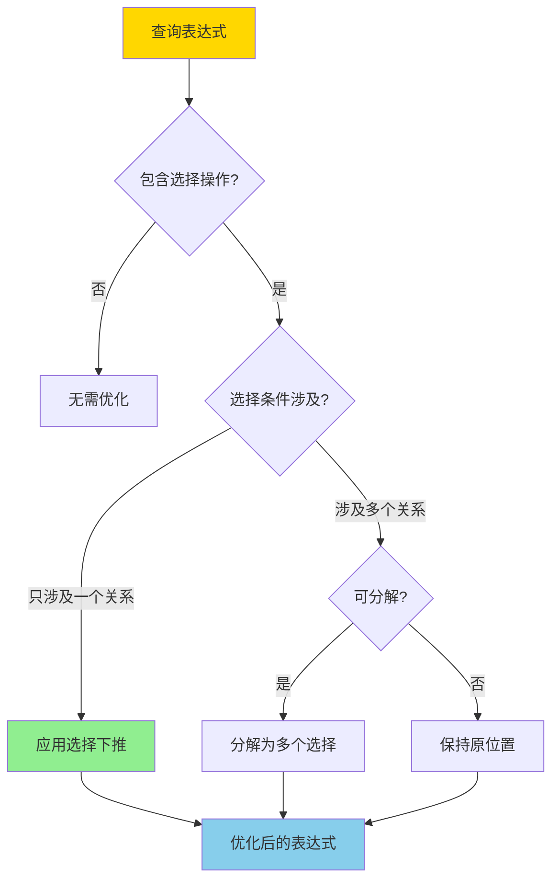
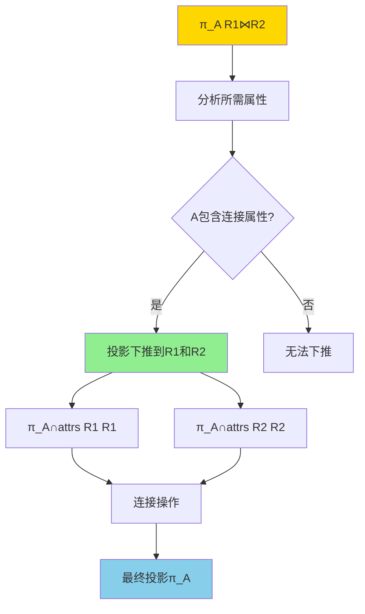
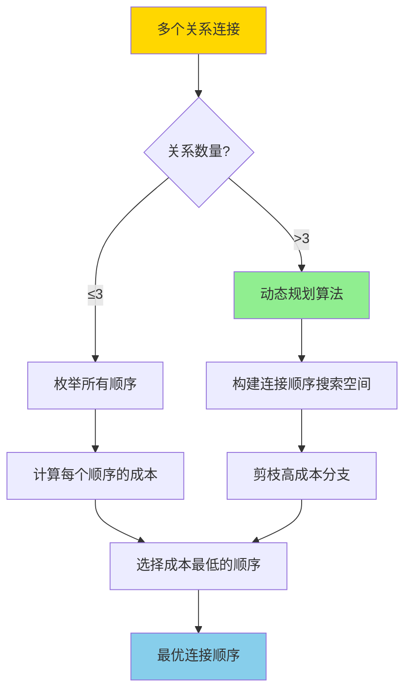

---
> **文档版本**: v1.0
> **最后更新**: 2025-01-11
> **版本覆盖**: PostgreSQL 18.x (推荐) ⭐ | 17.x (推荐) | 16.x (兼容)
> **文档状态**: ✅ 内容已完善

---

# 关系代数完整指南

## 📋 目录

- [关系代数完整指南](#关系代数完整指南)
  - [📋 目录](#-目录)
  - [1. 概述](#1-概述)
    - [1.0 关系代数知识体系思维导图](#10-关系代数知识体系思维导图)
    - [1.1 关系代数的定义](#11-关系代数的定义)
    - [1.2 关系代数在数据库理论中的地位](#12-关系代数在数据库理论中的地位)
    - [1.3 本文档的范围](#13-本文档的范围)
  - [2. 关系代数的基本操作](#2-关系代数的基本操作)
    - [2.0 基本操作对比矩阵与选择决策树](#20-基本操作对比矩阵与选择决策树)
    - [2.1 选择操作（Selection）](#21-选择操作selection)
    - [2.2 投影操作（Projection）](#22-投影操作projection)
    - [2.3 并操作（Union）](#23-并操作union)
    - [2.4 差操作（Difference）](#24-差操作difference)
    - [2.5 笛卡尔积（Cartesian Product）](#25-笛卡尔积cartesian-product)
  - [3. 关系代数的导出操作](#3-关系代数的导出操作)
    - [3.1 连接操作（Join）](#31-连接操作join)
    - [3.2 交操作（Intersection）](#32-交操作intersection)
    - [3.3 除操作（Division）](#33-除操作division)
  - [4. 关系代数的公理系统](#4-关系代数的公理系统)
    - [4.0 关系代数公理系统概述](#40-关系代数公理系统概述)
    - [4.1 基本操作公理](#41-基本操作公理)
    - [4.2 等价性公理](#42-等价性公理)
  - [5. 关系代数的性质与形式化证明](#5-关系代数的性质与形式化证明)
    - [5.1 交换律及其证明](#51-交换律及其证明)
    - [5.1.1 选择的交换律](#511-选择的交换律)
    - [5.1.2 连接的交换律](#512-连接的交换律)
    - [5.1.3 并的交换律](#513-并的交换律)
    - [5.2 结合律及其证明](#52-结合律及其证明)
    - [5.2.1 选择的结合律](#521-选择的结合律)
    - [5.2.2 连接的结合律](#522-连接的结合律)
    - [5.3 分配律及其证明](#53-分配律及其证明)
    - [5.3.1 选择对并的分配律](#531-选择对并的分配律)
    - [5.3.2 选择对差的分配律](#532-选择对差的分配律)
    - [5.3.3 投影对并的分配律](#533-投影对并的分配律)
    - [5.4 幂等律及其证明](#54-幂等律及其证明)
    - [5.4.1 选择的幂等律](#541-选择的幂等律)
    - [5.4.2 投影的幂等律](#542-投影的幂等律)
  - [6. 关系代数优化规则与证明](#6-关系代数优化规则与证明)
    - [6.1 选择下推规则](#61-选择下推规则)
    - [6.2 投影下推规则](#62-投影下推规则)
    - [6.3 连接顺序优化规则](#63-连接顺序优化规则)
  - [6. PostgreSQL中的关系代数应用](#6-postgresql中的关系代数应用)
  - [7. 相关文档](#7-相关文档)

---

## 1. 概述

### 1.0 关系代数知识体系思维导图



### 1.1 关系代数的定义

**关系代数**（Relational Algebra）是关系数据库的数学基础，由E.F. Codd在1970年提出。关系代数为关系数据库提供了一套完整的、封闭的操作集合，用于操作关系（表）并生成新的关系。

**关系代数的核心特征**：

- **封闭性**：所有操作的结果都是关系
- **过程式**：操作序列明确指定如何获取结果
- **理论基础**：为SQL查询提供数学基础
- **优化基础**：查询优化器基于关系代数进行优化

**关系代数形式化定义**：

关系代数是一个代数系统 $\mathcal{A} = (R, \Omega)$，其中：

- $R$ 是关系集合
- $\Omega = \{\sigma, \pi, \cup, -, \times, \bowtie, \cap, \div\}$ 是操作集合

### 1.2 关系代数在数据库理论中的地位

关系代数是关系数据库理论的三大支柱之一：

1. **关系模型**：数据如何组织（表、属性、元组）
2. **关系代数**：数据如何操作（查询语言）
3. **关系演算**：数据如何描述（声明式语言）

**关系数据库理论架构图**：



**关系代数与关系演算的多维对比矩阵**：

| 维度 | 关系代数 | 关系演算 | 说明 |
|------|---------|---------|------|
| **表示方式** | 过程式 | 声明式 | 关系代数描述"如何做"，关系演算描述"做什么" |
| **操作符** | 集合运算（σ, π, ∪, −, ×） | 逻辑公式（∧, ∨, ¬, ∃, ∀） | 不同的数学基础 |
| **表达能力** | 等价 | 等价 | Codd定理证明两者等价 |
| **可读性** | ⭐⭐⭐ | ⭐⭐⭐⭐⭐ | 关系演算更接近自然语言 |
| **实现难度** | ⭐⭐⭐ | ⭐⭐⭐⭐ | 关系代数更易实现 |
| **优化难度** | ⭐⭐ | ⭐⭐⭐⭐ | 关系代数优化规则更明确 |
| **理论基础** | 集合论 | 一阶逻辑 | 不同的数学基础 |
| **SQL对应** | SELECT-FROM-WHERE | WHERE子句条件 | SQL混合使用两者 |
| **查询规划** | 直接对应 | 需要转换 | 优化器通常转换为关系代数 |

### 1.3 本文档的范围

本文档全面介绍关系代数的：

- **基本操作**：选择、投影、并、差、笛卡尔积（形式化定义、性质、证明）
- **导出操作**：连接、交、除（导出性证明、应用场景）
- **代数性质**：交换律、结合律、分配律、幂等律（形式化证明）
- **优化规则**：选择下推、投影下推、连接顺序优化（规则证明、应用）
- **公理系统**：关系代数公理、推理规则
- **定理证明**：等价性定理、优化定理的形式化证明
- **PostgreSQL应用**：关系代数在PostgreSQL中的实际应用

---

## 2. 关系代数的基本操作

关系代数的基本操作是关系代数的核心，其他操作都可以通过这些基本操作组合得到。

**基本操作集合**：

1. **选择（Selection）**：σ
2. **投影（Projection）**：π
3. **并（Union）**：∪
4. **差（Difference）**：−
5. **笛卡尔积（Cartesian Product）**：×

### 2.0 基本操作对比矩阵与选择决策树

**关系代数基本操作多维对比矩阵**：

| 操作 | 符号 | 输入关系数 | 结果基数 | SQL对应 | 复杂度 | 应用频率 | 优化潜力 |
|------|------|-----------|---------|---------|--------|---------|---------|
| **选择** | σ | 1 | ≤ | WHERE | O(n) | ⭐⭐⭐⭐⭐ | ⭐⭐⭐⭐⭐ |
| **投影** | π | 1 | ≤ | SELECT列 | O(n) | ⭐⭐⭐⭐⭐ | ⭐⭐⭐⭐⭐ |
| **并** | ∪ | 2 | ≤ | UNION | O(n+m) | ⭐⭐⭐ | ⭐⭐ |
| **差** | − | 2 | ≤ | EXCEPT | O(n+m) | ⭐⭐ | ⭐⭐ |
| **笛卡尔积** | × | 2 | n×m | CROSS JOIN | O(n×m) | ⭐ | ⭐⭐⭐⭐ |

**关系代数操作选择决策树**：



### 2.1 选择操作（Selection）

**定义**：选择操作从关系中筛选满足条件的元组。

**符号**：σ_condition(R)

**形式化定义**：

```
σ_cond(R) = {t | t ∈ R ∧ cond(t)}
```

**SQL对应**：WHERE子句

**示例**：

```sql
-- 关系代数：σ_age>20(Students)
-- SQL等价：
SELECT * FROM Students WHERE age > 20;
```

**PostgreSQL示例**：

```sql
-- 创建示例表
CREATE TABLE students (
    id SERIAL PRIMARY KEY,
    name VARCHAR(100),
    age INTEGER,
    major VARCHAR(50)
);

-- 插入数据
INSERT INTO students (name, age, major) VALUES
    ('Alice', 20, 'CS'),
    ('Bob', 19, 'Math'),
    ('Charlie', 22, 'Physics');

-- 选择操作：σ_age>20(students)
SELECT * FROM students WHERE age > 20;
-- 结果：Charlie, 22, Physics
```

**选择操作的性质**：

- **幂等性**：σ_cond(σ_cond(R)) = σ_cond(R)
- **可交换性**：σ_cond1(σ_cond2(R)) = σ_cond2(σ_cond1(R))
- **可分解性**：σ_cond1∧cond2(R) = σ_cond1(σ_cond2(R))

### 2.2 投影操作（Projection）

**定义**：投影操作从关系中选择指定的属性列。

**符号**：π_attributes(R)

**形式化定义**：

```
π_A1,A2,...,An(R) = {t[A1,A2,...,An] | t ∈ R}
```

**SQL对应**：SELECT子句中的列列表

**示例**：

```sql
-- 关系代数：π_name,age(Students)
-- SQL等价：
SELECT name, age FROM Students;
```

**PostgreSQL示例**：

```sql
-- 投影操作：π_name,major(students)
SELECT name, major FROM students;
```

**投影操作的性质**：

- **幂等性**：π_attrs(π_attrs(R)) = π_attrs(R)
- **可交换性**：投影序列可以交换（如果属性相同）

### 2.3 并操作（Union）

**定义**：并操作合并两个关系的所有元组，去除重复。

**符号**：R1 ∪ R2

**前提条件**：R1和R2必须具有相同的属性集（并兼容）

**形式化定义**：

```
R1 ∪ R2 = {t | t ∈ R1 ∨ t ∈ R2}
```

**SQL对应**：UNION操作符

**示例**：

```sql
-- 关系代数：R1 ∪ R2
-- SQL等价：
SELECT * FROM R1
UNION
SELECT * FROM R2;
```

**PostgreSQL示例**：

```sql
-- 创建两个并兼容的表
CREATE TABLE students_fall (
    id INTEGER,
    name VARCHAR(100),
    major VARCHAR(50)
);

CREATE TABLE students_spring (
    id INTEGER,
    name VARCHAR(100),
    major VARCHAR(50)
);

-- 并操作
SELECT * FROM students_fall
UNION
SELECT * FROM students_spring;
```

### 2.4 差操作（Difference）

**定义**：差操作返回在R1中但不在R2中的元组。

**符号**：R1 − R2

**前提条件**：R1和R2必须具有相同的属性集（并兼容）

**形式化定义**：

```
R1 − R2 = {t | t ∈ R1 ∧ t ∉ R2}
```

**SQL对应**：EXCEPT操作符（PostgreSQL）

**示例**：

```sql
-- 关系代数：R1 − R2
-- SQL等价（PostgreSQL）：
SELECT * FROM R1
EXCEPT
SELECT * FROM R2;
```

**PostgreSQL示例**：

```sql
-- 差操作：找出只在fall学期但在spring学期不存在的学生
SELECT * FROM students_fall
EXCEPT
SELECT * FROM students_spring;
```

### 2.5 笛卡尔积（Cartesian Product）

**定义**：笛卡尔积返回两个关系的所有可能组合。

**符号**：R1 × R2

**形式化定义**：

```
R1 × R2 = {t1 ∪ t2 | t1 ∈ R1 ∧ t2 ∈ R2}
```

**SQL对应**：CROSS JOIN或没有WHERE条件的JOIN

**示例**：

```sql
-- 关系代数：R1 × R2
-- SQL等价：
SELECT * FROM R1 CROSS JOIN R2;
-- 或
SELECT * FROM R1, R2;
```

**PostgreSQL示例**：

```sql
-- 笛卡尔积：每个学生与每门课程的组合
SELECT * FROM students CROSS JOIN courses;
```

---

## 3. 关系代数的导出操作

导出操作可以通过基本操作组合得到，但在实际应用中非常重要。

### 3.1 连接操作（Join）

连接是关系代数中最常用的操作之一。

**等值连接（Equijoin）**：

```
R1 ⋈_θ R2 = σ_θ(R1 × R2)
```

其中θ是连接条件。

**自然连接（Natural Join）**：

自然连接在相同属性名上自动进行等值连接，并去除重复属性。

```
R1 ⋈ R2 = π_所有属性(σ_相同属性名相等(R1 × R2))
```

**SQL对应**：

- 等值连接：INNER JOIN ... ON condition
- 自然连接：NATURAL JOIN（PostgreSQL支持）

**PostgreSQL示例**：

```sql
-- 等值连接
SELECT * FROM students s
INNER JOIN enrollments e ON s.id = e.student_id;

-- 自然连接（如果students和enrollments有相同属性名）
SELECT * FROM students NATURAL JOIN enrollments;
```

### 3.2 交操作（Intersection）

**定义**：交操作返回同时在两个关系中的元组。

**符号**：R1 ∩ R2

**导出方式**：

```
R1 ∩ R2 = R1 − (R1 − R2)
```

**SQL对应**：INTERSECT操作符

**PostgreSQL示例**：

```sql
-- 交操作：找出同时在两个学期的学生
SELECT * FROM students_fall
INTERSECT
SELECT * FROM students_spring;
```

### 3.3 除操作（Division）

**定义**：除操作返回在R1中与R2的所有元组都关联的元组。

除操作在实际应用中较少使用，但理论上重要。

---

## 4. 关系代数的公理系统

### 4.0 关系代数公理系统概述

关系代数公理系统为关系代数操作提供形式化的数学基础。这些公理定义了关系代数操作的语义和性质。

**关系代数公理系统结构**：



### 4.1 基本操作公理

**公理4.1.1（选择存在性）**：

对于关系R和条件cond，选择操作σ_cond(R)总是存在，且：

```
∀R ∈ R, ∀cond: σ_cond(R) ∈ R
```

**公理4.1.2（投影存在性）**：

对于关系R和属性集A，投影操作π_A(R)总是存在，且：

```
∀R ∈ R, ∀A ⊆ attrs(R): π_A(R) ∈ R
```

**公理4.1.3（并兼容性）**：

关系R1和R2可以执行并操作，当且仅当：

```
R1 ∪ R2 定义 ⟺ attrs(R1) = attrs(R2)
```

**公理4.1.4（差兼容性）**：

关系R1和R2可以执行差操作，当且仅当：

```
R1 − R2 定义 ⟺ attrs(R1) = attrs(R2)
```

### 4.2 等价性公理

等价性公理定义了关系代数表达式的等价关系。

**公理4.2.1（等价关系）**：

关系代数表达式E1和E2等价，记作E1 ≡ E2，当且仅当：

```
E1 ≡ E2 ⟺ ∀DB: E1(DB) = E2(DB)
```

其中E(DB)表示表达式E在数据库DB上的语义。

---

## 5. 关系代数的性质与形式化证明

关系代数操作满足多种代数性质，这些性质是查询优化的理论基础。本节提供这些性质的形式化证明。

### 5.1 交换律及其证明

### 5.1.1 选择的交换律

**定理5.1.1（选择的交换律）**：

对于关系R和条件cond1、cond2，有：

```
σ_cond1(σ_cond2(R)) ≡ σ_cond2(σ_cond1(R))
```

**证明**：

```
σ_cond1(σ_cond2(R))(DB)
= {t | t ∈ σ_cond2(R)(DB) ∧ cond1(t) = TRUE}
= {t | t ∈ {s | s ∈ R(DB) ∧ cond2(s) = TRUE} ∧ cond1(t) = TRUE}
= {t | t ∈ R(DB) ∧ cond2(t) = TRUE ∧ cond1(t) = TRUE}
= {t | t ∈ R(DB) ∧ cond1(t) = TRUE ∧ cond2(t) = TRUE}
= {t | t ∈ {s | s ∈ R(DB) ∧ cond1(s) = TRUE} ∧ cond2(t) = TRUE}
= {t | t ∈ σ_cond1(R)(DB) ∧ cond2(t) = TRUE}
= σ_cond2(σ_cond1(R))(DB)

因此：σ_cond1(σ_cond2(R)) ≡ σ_cond2(σ_cond1(R))
```

**选择的交换律推理树**：



### 5.1.2 连接的交换律

**定理5.1.2（连接的交换律）**：

对于关系R1和R2，有：

```
R1 ⋈ R2 ≡ R2 ⋈ R1
```

**证明**：

连接操作是笛卡尔积和选择的组合：

```
R1 ⋈_θ R2 = σ_θ(R1 × R2)
R2 ⋈_θ R1 = σ_θ(R2 × R1)
```

由于笛卡尔积满足交换律（在属性重命名后），因此连接也满足交换律。

### 5.1.3 并的交换律

**定理5.1.3（并的交换律）**：

对于关系R1和R2，有：

```
R1 ∪ R2 ≡ R2 ∪ R1
```

**证明**：

```
R1 ∪ R2(DB)
= {t | t ∈ R1(DB) ∨ t ∈ R2(DB)}
= {t | t ∈ R2(DB) ∨ t ∈ R1(DB)}
= R2 ∪ R1(DB)

因此：R1 ∪ R2 ≡ R2 ∪ R1
```

### 5.2 结合律及其证明

### 5.2.1 选择的结合律

**定理5.2.1（选择的结合律）**：

对于关系R和条件cond1、cond2、cond3，有：

```
σ_cond1(σ_cond2(σ_cond3(R))) ≡ σ_cond1∧cond2∧cond3(R)
```

**证明**：

```
σ_cond1(σ_cond2(σ_cond3(R)))(DB)
= {t | t ∈ σ_cond2(σ_cond3(R))(DB) ∧ cond1(t) = TRUE}
= {t | t ∈ {s | s ∈ σ_cond3(R)(DB) ∧ cond2(s) = TRUE} ∧ cond1(t) = TRUE}
= {t | t ∈ {s | s ∈ {u | u ∈ R(DB) ∧ cond3(u) = TRUE} ∧ cond2(s) = TRUE} ∧ cond1(t) = TRUE}
= {t | t ∈ R(DB) ∧ cond3(t) = TRUE ∧ cond2(t) = TRUE ∧ cond1(t) = TRUE}
= {t | t ∈ R(DB) ∧ cond1∧cond2∧cond3(t) = TRUE}
= σ_cond1∧cond2∧cond3(R)(DB)

因此：σ_cond1(σ_cond2(σ_cond3(R))) ≡ σ_cond1∧cond2∧cond3(R)
```

### 5.2.2 连接的结合律

**定理5.2.2（连接的结合律）**：

对于关系R1、R2、R3，有：

```
(R1 ⋈ R2) ⋈ R3 ≡ R1 ⋈ (R2 ⋈ R3)
```

**证明**：

连接的结合律基于笛卡尔积的结合律和选择操作的结合律。

### 5.3 分配律及其证明

### 5.3.1 选择对并的分配律

**定理5.3.1（选择对并的分配律）**：

对于关系R1、R2和条件cond，有：

```
σ_cond(R1 ∪ R2) ≡ σ_cond(R1) ∪ σ_cond(R2)
```

**证明**：

```
σ_cond(R1 ∪ R2)(DB)
= {t | t ∈ R1 ∪ R2(DB) ∧ cond(t) = TRUE}
= {t | t ∈ (R1(DB) ∪ R2(DB)) ∧ cond(t) = TRUE}
= {t | (t ∈ R1(DB) ∨ t ∈ R2(DB)) ∧ cond(t) = TRUE}
= {t | (t ∈ R1(DB) ∧ cond(t) = TRUE) ∨ (t ∈ R2(DB) ∧ cond(t) = TRUE)}
= {t | t ∈ σ_cond(R1)(DB) ∨ t ∈ σ_cond(R2)(DB)}
= σ_cond(R1) ∪ σ_cond(R2)(DB)

因此：σ_cond(R1 ∪ R2) ≡ σ_cond(R1) ∪ σ_cond(R2)
```

**选择对并分配律的推理树**：



### 5.3.2 选择对差的分配律

**定理5.3.2（选择对差的分配律）**：

对于关系R1、R2和条件cond，有：

```
σ_cond(R1 − R2) ≡ σ_cond(R1) − σ_cond(R2)
```

**证明**：

```
σ_cond(R1 − R2)(DB)
= {t | t ∈ R1 − R2(DB) ∧ cond(t) = TRUE}
= {t | t ∈ (R1(DB) − R2(DB)) ∧ cond(t) = TRUE}
= {t | (t ∈ R1(DB) ∧ t ∉ R2(DB)) ∧ cond(t) = TRUE}
= {t | (t ∈ R1(DB) ∧ cond(t) = TRUE) ∧ (t ∉ R2(DB) ∨ cond(t) = FALSE)}
= {t | t ∈ σ_cond(R1)(DB) ∧ t ∉ σ_cond(R2)(DB)}
= σ_cond(R1) − σ_cond(R2)(DB)

因此：σ_cond(R1 − R2) ≡ σ_cond(R1) − σ_cond(R2)
```

### 5.3.3 投影对并的分配律

**定理5.3.3（投影对并的分配律）**：

对于关系R1、R2和属性集A，有：

```
π_A(R1 ∪ R2) ≡ π_A(R1) ∪ π_A(R2)
```

**证明**：

投影操作从每个元组中选择属性，因此对并操作可分配。

### 5.4 幂等律及其证明

### 5.4.1 选择的幂等律

**定理5.4.1（选择的幂等律）**：

对于关系R和条件cond，有：

```
σ_cond(σ_cond(R)) ≡ σ_cond(R)
```

**证明**：

```
σ_cond(σ_cond(R))(DB)
= {t | t ∈ σ_cond(R)(DB) ∧ cond(t) = TRUE}
= {t | t ∈ {s | s ∈ R(DB) ∧ cond(s) = TRUE} ∧ cond(t) = TRUE}
= {t | t ∈ R(DB) ∧ cond(t) = TRUE ∧ cond(t) = TRUE}
= {t | t ∈ R(DB) ∧ cond(t) = TRUE}
= σ_cond(R)(DB)

因此：σ_cond(σ_cond(R)) ≡ σ_cond(R)
```

### 5.4.2 投影的幂等律

**定理5.4.2（投影的幂等律）**：

对于关系R和属性集A，有：

```
π_A(π_A(R)) ≡ π_A(R)
```

**证明**：

投影操作的结果已经是属性集A的子集，再次投影到A不会改变结果。

---

## 6. 关系代数优化规则与证明

关系代数的代数性质为查询优化提供了理论基础。本节提供优化规则的形式化证明。

关系代数的代数性质为查询优化提供了理论基础。

### 6.1 选择下推规则

**优化规则6.1.1（选择下推）**：

对于关系R1、R2和条件cond，如果cond只涉及R1的属性，则：

```
σ_cond(R1 ⋈ R2) ≡ σ_cond(R1) ⋈ R2
```

**证明**：

基于选择对连接的分配律（当条件只涉及一个关系时）。

**选择下推决策树**：



**示例**：

```sql
-- 未优化
π_name(σ_age>20(students ⋈ enrollments))

-- 优化后（选择下推）
π_name(σ_age>20(students) ⋈ enrollments)
```

### 6.2 投影下推规则

**优化规则6.2.1（投影下推）**：

对于关系R1、R2和属性集A，如果A包含连接所需的属性，则：

```
π_A(R1 ⋈ R2) ≡ π_A(π_A∩attrs(R1)(R1) ⋈ π_A∩attrs(R2)(R2))
```

**原理**：投影操作可以减少数据量，尽早执行可以减少后续操作的数据量。

**投影下推推理树**：



### 6.3 连接顺序优化规则

**优化规则6.3.1（连接顺序优化）**：

对于多个连接，选择成本最低的连接顺序。

**原理**：不同的连接顺序可能导致不同的执行成本。优化器使用动态规划算法选择最优顺序。

**连接顺序优化决策树**：



---

## 6. PostgreSQL中的关系代数应用

PostgreSQL查询规划器将SQL查询转换为关系代数表达式树，然后应用优化规则。

**查询规划过程**：

1. SQL解析：将SQL转换为查询树
2. 关系代数转换：将查询树转换为关系代数表达式
3. 优化：应用关系代数优化规则
4. 执行计划生成：生成物理执行计划

---

## 7. 相关文档

- [关系代数与关系演算-科德定理与可表达性](../25.03-查询语义/08.02-关系代数与关系演算-科德定理与可表达性.md)
- [查询语言的形式语义与等价律](../25.01-形式化方法/01.06-查询语言的形式语义与等价律.md)
- [查询优化器](../../09-查询优化器/README.md)

---

**最后更新**: 2025年1月
**维护状态**: ✅ 持续更新
