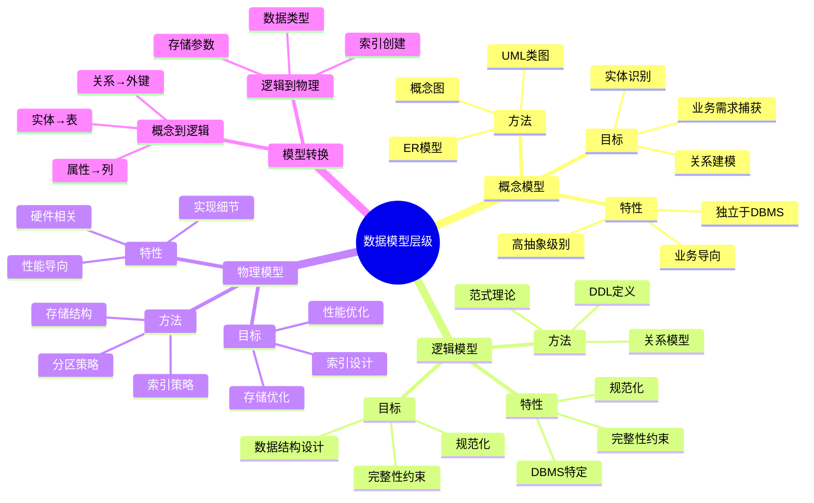
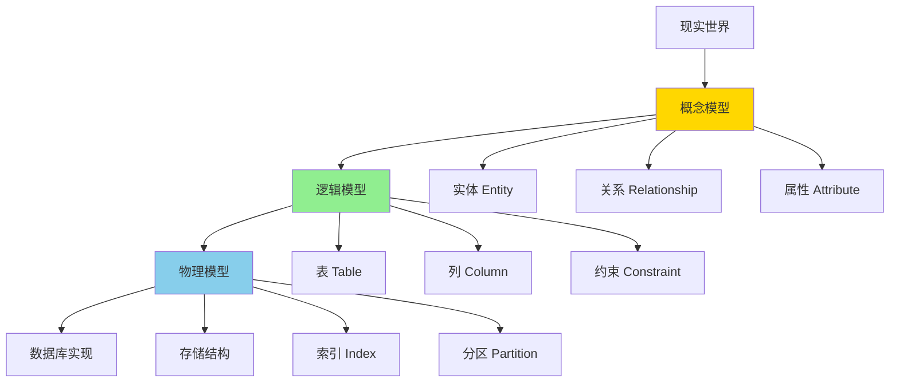
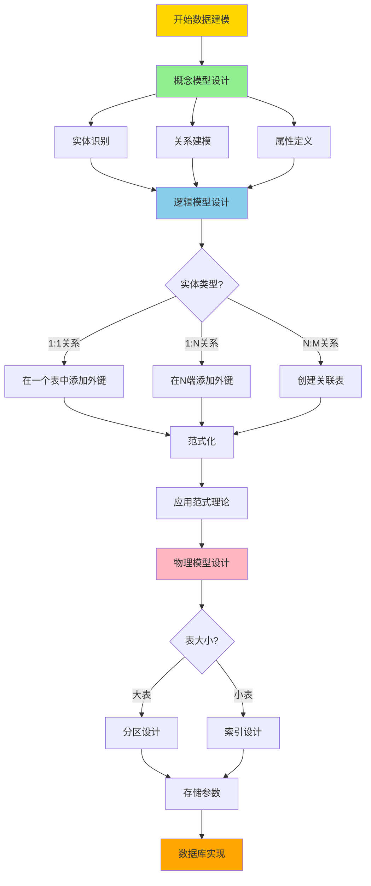
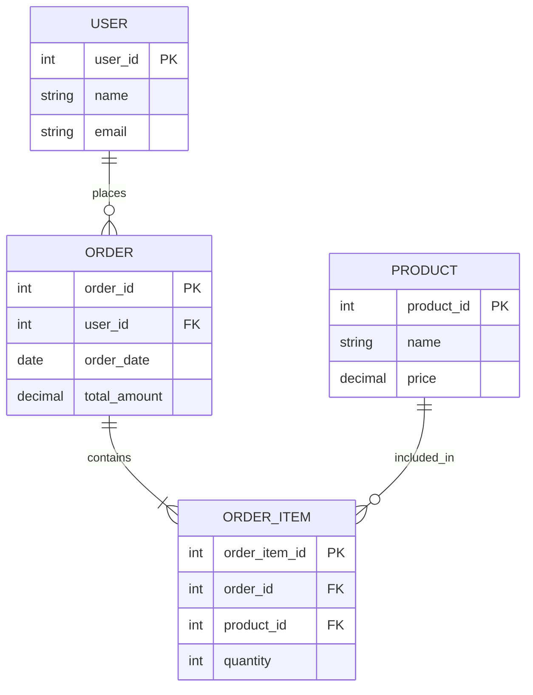
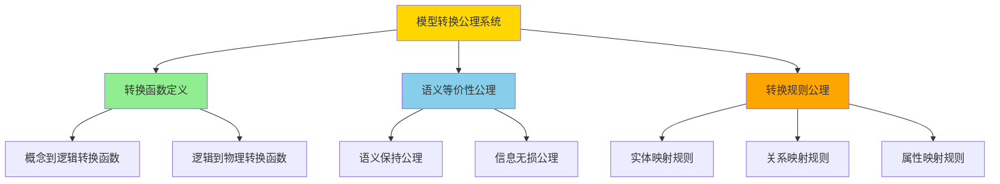
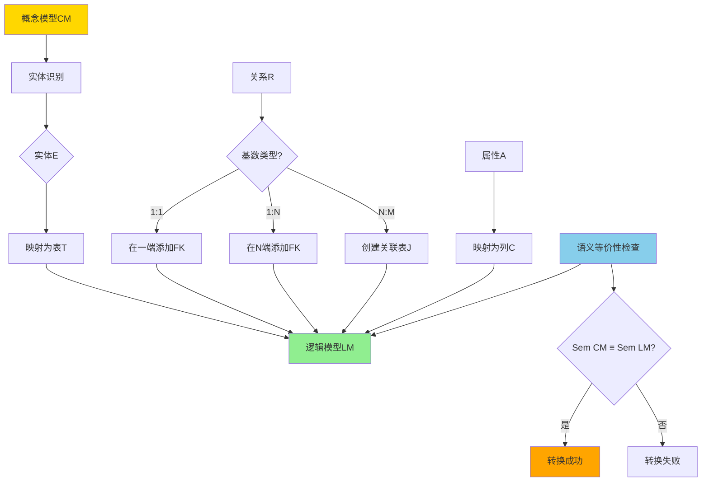
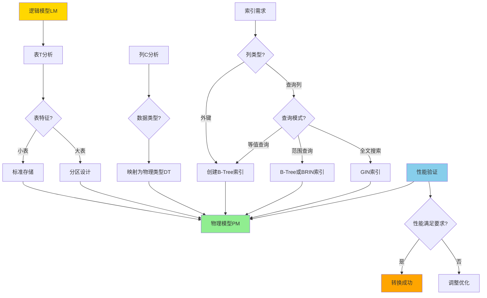

---
> **文档版本**: v1.0
> **最后更新**: 2025-01-11
> **版本覆盖**: PostgreSQL 18.x (推荐) ⭐ | 17.x (推荐) | 16.x (兼容)
> **文档状态**: ✅ 内容已完善

---

# 数据模型层级理论：概念模型、逻辑模型、物理模型

## 📋 目录

- [数据模型层级理论：概念模型、逻辑模型、物理模型](#数据模型层级理论概念模型逻辑模型物理模型)
  - [📋 目录](#-目录)
  - [1. 概述](#1-概述)
    - [1.0 数据模型层级知识体系思维导图](#10-数据模型层级知识体系思维导图)
    - [1.1 三层数据模型架构](#11-三层数据模型架构)
    - [1.2 ANSI/SPARC三层架构](#12-ansisparc三层架构)
    - [1.3 三层模型的关系与转换决策树](#13-三层模型的关系与转换决策树)
  - [2. 概念模型（Conceptual Model）](#2-概念模型conceptual-model)
    - [2.1 概念模型的定义](#21-概念模型的定义)
    - [2.2 概念模型的特性](#22-概念模型的特性)
    - [2.3 ER模型](#23-er模型)
    - [2.4 概念模型的设计原则](#24-概念模型的设计原则)
  - [3. 逻辑模型（Logical Model）](#3-逻辑模型logical-model)
    - [3.1 逻辑模型的定义](#31-逻辑模型的定义)
    - [3.2 逻辑模型的特性](#32-逻辑模型的特性)
    - [3.3 关系模型](#33-关系模型)
    - [3.4 范式理论](#34-范式理论)
    - [3.5 逻辑模型的设计原则](#35-逻辑模型的设计原则)
  - [4. 物理模型（Physical Model）](#4-物理模型physical-model)
    - [4.1 物理模型的定义](#41-物理模型的定义)
    - [4.2 物理模型的特性](#42-物理模型的特性)
    - [4.3 存储结构](#43-存储结构)
    - [4.4 索引设计](#44-索引设计)
    - [4.5 物理模型的设计原则](#45-物理模型的设计原则)
  - [5. 三层模型的转换：形式化定义与规则](#5-三层模型的转换形式化定义与规则)
    - [5.0 模型转换概述](#50-模型转换概述)
    - [5.1 概念模型到逻辑模型的转换](#51-概念模型到逻辑模型的转换)
    - [5.1.1 转换规则形式化定义](#511-转换规则形式化定义)
    - [5.2 逻辑模型到物理模型的转换](#52-逻辑模型到物理模型的转换)
    - [5.2.1 转换规则形式化定义](#521-转换规则形式化定义)
  - [6. PostgreSQL中的三层模型实现](#6-postgresql中的三层模型实现)
  - [7. 相关文档](#7-相关文档)

---

## 1. 概述

### 1.0 数据模型层级知识体系思维导图



### 1.1 三层数据模型架构

数据建模通常分为三个层次，每个层次关注不同的抽象级别：

1. **概念模型（Conceptual Model）**：业务层面的抽象
2. **逻辑模型（Logical Model）**：数据层面的设计
3. **物理模型（Physical Model）**：实现层面的优化

**三层数据模型多维对比矩阵**：

| 维度 | 概念模型 | 逻辑模型 | 物理模型 |
|------|---------|---------|---------|
| **抽象级别** | 最高 | 中等 | 最低 |
| **关注点** | 业务需求 | 数据结构 | 存储实现 |
| **用户群体** | 业务人员、分析师 | 数据库设计师 | 数据库管理员 |
| **工具** | ER图工具、UML | DDL、建模工具 | DDL、配置工具 |
| **DBMS依赖** | 无 | 部分依赖 | 完全依赖 |
| **变更频率** | 低 | 中 | 高 |
| **主要输出** | ER图、概念文档 | 表结构、约束 | 存储结构、索引 |
| **优化目标** | 业务准确性 | 数据完整性 | 查询性能 |
| **标准化程度** | 低（业务特定） | 中（范式化） | 高（技术标准） |

**三层架构图**：



### 1.2 ANSI/SPARC三层架构

ANSI/SPARC（American National Standards Institute/Standards Planning And Requirements Committee）提出了数据库系统的三层架构：

1. **外部层（External Level）**：用户视图
2. **概念层（Conceptual Level）**：全局逻辑视图
3. **内部层（Internal Level）**：物理存储视图

**ANSI/SPARC架构与数据建模的对应关系**：

- **外部层** ↔ 概念模型
- **概念层** ↔ 逻辑模型
- **内部层** ↔ 物理模型

### 1.3 三层模型的关系与转换决策树

**抽象层次**：

```
概念模型（最高抽象）
    ↓ 转换
逻辑模型（中等抽象）
    ↓ 转换
物理模型（最低抽象）
```

**关注点**：

- **概念模型**：关注"做什么"（What）
- **逻辑模型**：关注"如何组织"（How to organize）
- **物理模型**：关注"如何实现"（How to implement）

**三层模型转换决策树**：



---

## 2. 概念模型（Conceptual Model）

### 2.1 概念模型的定义

**概念模型**是对现实世界的业务领域的抽象表示，独立于任何特定的数据库管理系统。

**概念模型的目标**：

- 捕获业务需求和规则
- 识别核心实体和关系
- 建立业务概念的统一理解
- 作为业务人员和技术人员的沟通桥梁

### 2.2 概念模型的特性

**关键特性**：

1. **业务导向**：关注业务需求，而非技术实现
2. **独立于DBMS**：不依赖特定的数据库系统
3. **高抽象级别**：使用业务术语，而非技术术语
4. **完整性**：完整描述业务领域
5. **清晰性**：易于业务人员理解

### 2.3 ER模型

**实体关系模型（Entity-Relationship Model）**是概念建模的主要方法。

**ER模型的核心概念**：

1. **实体（Entity）**：现实世界中的对象
2. **属性（Attribute）**：实体的特征
3. **关系（Relationship）**：实体之间的联系
4. **基数（Cardinality）**：关系的数量约束

**ER模型示例**：



### 2.4 概念模型的设计原则

**设计原则**：

1. **实体识别**：识别业务中的核心实体
2. **关系建模**：准确描述实体之间的关系
3. **属性定义**：为每个实体定义必要的属性
4. **约束捕获**：捕获业务规则和约束
5. **可扩展性**：考虑未来的扩展需求

---

## 3. 逻辑模型（Logical Model）

### 3.1 逻辑模型的定义

**逻辑模型**是概念模型在特定数据模型（如关系模型）中的表示，但仍然独立于物理实现。

**逻辑模型的目标**：

- 将概念模型转换为数据结构
- 定义表、列、约束等
- 应用范式理论进行规范化
- 确保数据完整性

### 3.2 逻辑模型的特性

**关键特性**：

1. **数据模型特定**：基于特定数据模型（关系、层次、网络等）
2. **独立于存储**：不涉及物理存储细节
3. **规范化**：应用范式理论
4. **完整性约束**：定义完整性约束
5. **可优化**：可以进行逻辑优化

### 3.3 关系模型

**关系模型**是最常用的逻辑模型。

**关系模型的核心概念**：

1. **关系（Relation）**：表
2. **元组（Tuple）**：行
3. **属性（Attribute）**：列
4. **域（Domain）**：属性的取值范围
5. **键（Key）**：主键、外键等

**关系模型示例**：

```sql
-- 用户表（User实体）
CREATE TABLE users (
    user_id INTEGER PRIMARY KEY,
    name VARCHAR(100) NOT NULL,
    email VARCHAR(100) UNIQUE NOT NULL,
    created_at TIMESTAMP DEFAULT NOW()
);

-- 订单表（Order实体）
CREATE TABLE orders (
    order_id INTEGER PRIMARY KEY,
    user_id INTEGER NOT NULL REFERENCES users(user_id),
    order_date DATE NOT NULL,
    total_amount DECIMAL(10,2) NOT NULL CHECK (total_amount >= 0)
);

-- 订单项表（OrderItem实体，多对多关系）
CREATE TABLE order_items (
    order_item_id INTEGER PRIMARY KEY,
    order_id INTEGER NOT NULL REFERENCES orders(order_id),
    product_id INTEGER NOT NULL REFERENCES products(product_id),
    quantity INTEGER NOT NULL CHECK (quantity > 0),
    unit_price DECIMAL(10,2) NOT NULL
);
```

### 3.4 范式理论

**范式理论**用于规范化逻辑模型，消除数据冗余和异常。

**主要范式**：

1. **第一范式（1NF）**：每个属性都是原子值
2. **第二范式（2NF）**：消除部分函数依赖
3. **第三范式（3NF）**：消除传递函数依赖
4. **BCNF**：Boyce-Codd范式
5. **第四范式（4NF）**：消除多值依赖

### 3.5 逻辑模型的设计原则

**设计原则**：

1. **规范化**：应用范式理论
2. **完整性约束**：定义主键、外键、CHECK约束等
3. **数据完整性**：确保实体完整性和参照完整性
4. **可维护性**：设计清晰、易于维护
5. **性能考虑**：平衡规范化和性能需求

---

## 4. 物理模型（Physical Model）

### 4.1 物理模型的定义

**物理模型**描述数据在特定数据库管理系统中的实际存储方式。

**物理模型的目标**：

- 定义存储结构
- 设计索引策略
- 优化查询性能
- 管理存储空间

### 4.2 物理模型的特性

**关键特性**：

1. **DBMS特定**：依赖于特定的数据库管理系统
2. **性能导向**：关注存储和查询性能
3. **实现细节**：包含存储、索引、分区等细节
4. **可调优**：可以进行性能调优
5. **硬件相关**：考虑硬件特性

### 4.3 存储结构

**PostgreSQL存储结构**：

1. **表空间（Tablespace）**：表的存储位置
2. **页（Page）**：8KB的存储单元
3. **堆文件（Heap File）**：表数据存储
4. **TOAST（The Oversized-Attribute Storage Technique）**：大对象存储

**PostgreSQL示例**：

```sql
-- 创建表空间
CREATE TABLESPACE fast_storage LOCATION '/fast/disk/path';

-- 在指定表空间中创建表
CREATE TABLE orders (
    order_id SERIAL PRIMARY KEY,
    ...
) TABLESPACE fast_storage;

-- 设置存储参数
CREATE TABLE large_table (
    ...
) WITH (
    fillfactor = 90,
    autovacuum_enabled = true
);
```

### 4.4 索引设计

**索引类型**：

1. **B-Tree索引**：默认索引类型，支持等值查询和范围查询
2. **Hash索引**：等值查询
3. **GIN索引**：全文搜索、数组、JSONB
4. **GiST索引**：几何数据、全文搜索
5. **SP-GiST索引**：非平衡数据结构
6. **BRIN索引**：大表的范围查询

**索引设计示例**：

```sql
-- B-Tree索引（默认）
CREATE INDEX idx_user_email ON users(email);

-- 唯一索引
CREATE UNIQUE INDEX idx_user_email_unique ON users(email);

-- 部分索引
CREATE INDEX idx_active_users ON users(email) WHERE is_active = true;

-- 复合索引
CREATE INDEX idx_order_user_date ON orders(user_id, order_date);

-- GIN索引（JSONB）
CREATE INDEX idx_product_tags_gin ON products USING GIN(tags);

-- BRIN索引（时间序列）
CREATE INDEX idx_logs_timestamp_brin ON logs USING BRIN(created_at);
```

### 4.5 物理模型的设计原则

**设计原则**：

1. **索引策略**：为频繁查询的列创建索引
2. **分区策略**：对大表进行分区
3. **存储优化**：选择合适的存储参数
4. **性能监控**：监控查询性能
5. **容量规划**：规划存储容量

---

## 5. 三层模型的转换：形式化定义与规则

### 5.0 模型转换概述

模型转换是将一个抽象级别的模型转换为另一个抽象级别的模型的过程。转换必须保持语义等价性。

**模型转换公理系统**：



**形式化定义**：

设：

- $CM$ 为概念模型集合
- $LM$ 为逻辑模型集合
- $PM$ 为物理模型集合

转换函数：

- $T_{CL}: CM \rightarrow LM$：概念模型到逻辑模型的转换函数
- $T_{LP}: LM \rightarrow PM$：逻辑模型到物理模型的转换函数

语义等价性：

- $cm \in CM, lm \in LM$：$T_{CL}(cm) = lm \Rightarrow Sem(cm) \equiv Sem(lm)$
- $lm \in LM, pm \in PM$：$T_{LP}(lm) = pm \Rightarrow Sem(lm) \equiv Sem(pm)$

### 5.1 概念模型到逻辑模型的转换

### 5.1.1 转换规则形式化定义

**规则5.1.1（实体到表的映射）**：

对于概念模型中的实体E，逻辑模型中对应的表T定义为：

```
T = Table(name(E), Attributes(E), Keys(E))
```

其中：

- $name(E)$ 是实体E的名称
- $Attributes(E)$ 是实体E的属性集合
- $Keys(E)$ 是实体E的主键集合

**规则5.1.2（属性到列的映射）**：

对于实体E的属性A，逻辑模型中对应的列C定义为：

```
C = Column(name(A), type(A), constraints(A))
```

其中：

- $name(A)$ 是属性A的名称
- $type(A)$ 是属性A的数据类型
- $constraints(A)$ 是属性A的约束集合

**规则5.1.3（关系映射规则）**：

对于概念模型中的关系R，逻辑模型中的映射定义为：

```text
映射规则(R) =
  if cardinality(R) = 1:1 then
    在R的一端添加外键
  else if cardinality(R) = 1:N then
    在N端添加外键
  else if cardinality(R) = N:M then
    创建关联表
```

**概念到逻辑转换推理树**：



**转换规则**：

1. **实体 → 表**：每个实体转换为一个表
2. **属性 → 列**：实体的属性转换为表的列
3. **关系 → 外键/关联表**：
   - 1:1关系：在一个表中添加外键
   - 1:N关系：在N端添加外键
   - N:M关系：创建关联表
4. **主键标识**：为每个表定义主键
5. **约束定义**：定义完整性约束

**转换示例**：

```
概念模型：
- 实体：User, Order, Product
- 关系：User 1:N Order, Order N:M Product

逻辑模型：
- 表：users, orders, products, order_items
- 外键：orders.user_id → users.user_id
- 关联表：order_items (order_id, product_id)
```

**转换正确性证明**：

**定理5.1.1（实体到表转换的正确性）**：

对于概念模型中的实体E和转换后的表T，有：

```
∀e ∈ Instances(E), ∃t ∈ Instances(T): Sem(e) = Sem(t)
```

**证明**：

根据转换规则，表T包含实体E的所有属性，且主键保持唯一性，因此每个实体实例都能映射到唯一的表行。

### 5.2 逻辑模型到物理模型的转换

### 5.2.1 转换规则形式化定义

**规则5.2.1（数据类型映射）**：

对于逻辑模型中的列C，物理模型中的数据类型DT定义为：

```
DT = MapType(logical_type(C), constraints(C), performance_requirements)
```

其中映射考虑：

- 逻辑数据类型
- 约束要求（NOT NULL, UNIQUE等）
- 性能要求（存储空间、查询性能）

**规则5.2.2（索引创建规则）**：

对于逻辑模型中的表T，物理模型中的索引集合I定义为：

```
I = {Index(col) | col ∈ ForeignKeys(T) ∨ col ∈ QueryColumns(T)}
```

其中：

- $ForeignKeys(T)$ 是表T的外键列集合
- $QueryColumns(T)$ 是表T中频繁查询的列集合

**逻辑到物理转换推理树**：



**转换规则**：

1. **数据类型选择**：选择合适的数据类型
2. **索引创建**：为外键和查询列创建索引
3. **存储参数**：设置存储参数
4. **分区设计**：设计分区策略
5. **性能优化**：应用性能优化技术

**转换规则多维对比矩阵**：

| 转换方面 | 逻辑模型 | 物理模型 | 转换规则 | 优化目标 |
|---------|---------|---------|---------|---------|
| **数据类型** | 抽象类型（INTEGER） | 具体类型（BIGINT） | 根据数据范围选择 | 存储效率 |
| **索引** | 逻辑索引定义 | 物理索引实现 | 为外键和查询列创建 | 查询性能 |
| **存储** | 逻辑存储结构 | 物理存储结构 | 表空间、页结构 | 存储效率 |
| **分区** | 逻辑分区定义 | 物理分区实现 | 范围/列表/哈希分区 | 查询性能 |
| **约束** | 逻辑约束定义 | 物理约束实现 | 主键、外键、CHECK | 数据完整性 |

**转换示例**：

```sql
-- 逻辑模型：orders表
-- 物理模型实现：

CREATE TABLE orders (
    order_id BIGSERIAL PRIMARY KEY,  -- 使用BIGSERIAL而非INTEGER
    user_id BIGINT NOT NULL,
    order_date TIMESTAMPTZ NOT NULL DEFAULT NOW(),  -- 使用TIMESTAMPTZ
    total_amount NUMERIC(10,2) NOT NULL,

    -- 外键约束
    CONSTRAINT fk_order_user FOREIGN KEY (user_id)
        REFERENCES users(user_id) ON DELETE CASCADE,

    -- CHECK约束
    CONSTRAINT chk_total_amount CHECK (total_amount >= 0)
)
-- 存储参数
WITH (
    fillfactor = 90,
    autovacuum_enabled = true
)
-- 分区（如果表很大）
PARTITION BY RANGE (order_date);

-- 索引
CREATE INDEX idx_orders_user_id ON orders(user_id);
CREATE INDEX idx_orders_date ON orders(order_date);
CREATE INDEX idx_orders_user_date ON orders(user_id, order_date);
```

---

## 6. PostgreSQL中的三层模型实现

**PostgreSQL支持三层模型的完整实现**：

1. **概念模型**：使用ER图工具（如pgAdmin、DBeaver）设计
2. **逻辑模型**：使用DDL语句定义表结构
3. **物理模型**：使用存储参数、索引、分区等特性

**PostgreSQL特性支持**：

- **丰富的数据类型**：支持多种数据类型
- **强大的约束系统**：支持多种约束
- **灵活的索引类型**：支持多种索引类型
- **分区支持**：支持多种分区策略
- **表空间**：支持表空间管理

---

## 7. 相关文档

- [数据建模完整指南](../../17-数据模型设计/09.02-数据建模完整指南.md)
- [关系模型设计](../../17-数据模型设计/README.md)
- [完整性约束设计](../../17-数据模型设计/README.md)
- [索引设计](../../00-归档-项目管理文档/README.md)
- [分区设计](../../00-归档-项目管理文档/README.md)

---

**最后更新**: 2025年1月
**维护状态**: ✅ 持续更新
