---

> **📋 文档来源**: `MVCC-ACID-CAP\01-理论基础\README.md`
> **📅 复制日期**: 2025-12-22
> **⚠️ 注意**: 本文档为复制版本，原文件保持不变

---

# 25-理论体系

> **文档总数**: 60+个文档
> **覆盖领域**: MVCC-ACID-CAP理论、形式化方法、范畴论、查询语义、公理系统、形式化证明
> **版本覆盖**: PostgreSQL 18.x (推荐) ⭐ | 17.x (推荐) | 16.x (兼容)
> **最后更新**: 2025年1月
> **状态**: ✅ 已完成

---

## 📊 知识体系思维导图

```mermaid
mindmap
  root((理论体系))
    MVCC-ACID-CAP
      MVCC机制
      ACID特性
      CAP理论
      统一框架
    形式化方法
      形式化定义
      形式化证明
      定理证明
    范畴论
      JSONB范畴论
      向量数据范畴论
      模式映射
    查询语义
      查询语义定义
      查询优化语义
      执行语义
    公理系统
      MVCC公理
      ACID公理
      CAP公理
      同构性公理
```



---

## 📋 概述

## 📑 目录

- [25-理论体系](#25-理论体系)
  - [📊 知识体系思维导图](#-知识体系思维导图)
  - [📋 概述](#-概述)
  - [📑 目录](#-目录)
  - [📋 概述](#-概述-1)
  - [📚 目录结构](#-目录结构)
  - [🎯 核心主题](#-核心主题)
    - [PostgreSQL版本特性](#postgresql版本特性)
    - [事务模型](#事务模型)
    - [CAP理论](#cap理论)
    - [公理系统](#公理系统)
    - [形式化证明](#形式化证明)
  - [📊 文档统计](#-文档统计)
    - [按类别统计](#按类别统计)
    - [按状态统计](#按状态统计)
  - [📊 理论体系选型决策树](#-理论体系选型决策树)
  - [📊 理论体系对比矩阵](#-理论体系对比矩阵)
  - [🔗 相关文档](#-相关文档)
    - [多维度视角](#多维度视角)
    - [场景实践](#场景实践)
    - [形式化论证](#形式化论证)

---

## 📋 概述

本目录包含PostgreSQL MVCC-ACID-CAP的核心理论体系，从PostgreSQL版本特性、事务模型、CAP理论，到公理系统和形式化证明，建立了完整的理论基础。同时包含形式化方法、范畴论和查询语义的深度理论分析。

**理论体系目标**：

1. **版本特性** - PostgreSQL 17/18的新特性和改进
2. **事务模型** - 事务处理的理论和实践
3. **CAP理论** - 分布式系统的CAP定理和BASE理论
4. **公理系统** - MVCC-ACID-CAP的形式化公理定义
5. **形式化证明** - 基于公理的严格数学证明
6. **形式化方法** - TLA+、Coq、Isabelle等验证工具和方法
7. **范畴论** - 数据库结构的范畴论分析和模型转换
8. **查询语义** - SQL查询的形式语义和理论基础

---

## 📚 目录结构

```text
25-理论体系/
├── README.md                    # 本文档
├── PostgreSQL版本特性/          # PostgreSQL 17/18版本特性
│   ├── README.md
│   ├── pg17-vacuum-memory.md
│   ├── pg17-logical-replication.md
│   ├── pg18-aio.md
│   ├── pg18-virtual-columns.md
│   ├── pg18-完整特性分析.md
│   ├── PostgreSQL-MVCC实现细节.md
│   └── PostgreSQL17-vs-18-MVCC-ACID-CAP对比.md
├── 事务模型/                    # 事务模型理论
│   ├── README.md
│   ├── MVCC_Lock_Transaction/
│   │   ├── mvcc_lock00.md
│   │   └── mvcc_lock.md
│   ├── 两阶段提交深度分析.md
│   ├── XA事务深度分析.md
│   ├── 分布式事务协调.md
│   ├── 分布式事务最佳实践.md
│   ├── 分布式事务模式深度对比.md
│   ├── 隔离级别深度分析.md
│   └── 最终一致性.md
├── CAP理论/                     # CAP理论体系
│   ├── README.md
│   ├── CAP定理完整定义与证明.md
│   ├── CAP定理的批判性分析.md
│   ├── CAP理论的历史演进.md
│   ├── CAP与分布式系统设计.md
│   ├── CAP权衡决策框架.md
│   ├── BASE理论详解.md
│   ├── PACELC定理详解.md
│   ├── PostgreSQL18与CAP权衡-2025-12-04.md
│   ├── 一致性模型详解.md
│   ├── 可用性量化与测量.md
│   └── 分区容错实现机制.md
├── 公理系统/                    # 形式化公理定义
│   ├── README.md
│   ├── MVCC核心公理.md
│   ├── ACID公理系统.md
│   ├── CAP公理系统.md
│   └── 同构性公理.md
├── 形式化证明/                  # 数学证明体系
│   ├── README.md
│   ├── MVCC可见性定理证明.md
│   ├── 快照隔离定理证明.md
│   ├── 可串行化定理证明.md
│   ├── ACID属性定理证明.md
│   └── MVCC-ACID等价性证明.md
├── 25.01-形式化方法/            # 形式化验证方法
│   ├── README.md
│   ├── 01.01-形式化验证方法.md
│   ├── 01.02-学术研究前沿.md
│   ├── 01.03-范畴论基础.md
│   ├── 01.04-MVCC形式化验证.md
│   ├── 01.05-形式语言与证明-总论.md
│   ├── 01.06-查询语言的形式语义与等价律.md
│   └── 01.07-PostgreSQL18新特性完整分析.md
├── 25.02-范畴论/                # 范畴论在数据库中的应用
│   ├── README.md
│   ├── 02.01-JSONB范畴论分析.md
│   ├── 02.02-向量数据范畴论模型.md
│   ├── 02.03-关系知识图转换框架.md
│   └── 02.04-模式映射与范畴视角-函子与自然变换.md
└── 25.03-查询语义/              # 查询语言形式语义
    ├── README.md
    ├── 08.01-概率数据库与不确定性查询-可能世界语义.md
    ├── 08.02-关系代数与关系演算-科德定理与可表达性.md
    ├── 08.03-同态与查询包含-Containment_Equivalence判定.md
    ├── 08.04-Chase与Backchase-依赖下的查询最小化.md
    ├── 08.05-Datalog与递归查询-不动点语义与可计算性.md
    ├── 08.06-半环血缘与代数-证据与不确定性传播.md
    ├── 08.07-视图更新与可实现性-必要条件与构造.md
    ├── 08.08-CTE与递归查询-关系代数不动点语义.md
    ├── 08.09-外键与参照完整性-约束满足与级联正确性.md
    ├── 08.10-窗口聚合语义-稳定性与等价变换.md
    ├── 08.11-多重集语义-SQL与关系代数的bag形式化.md
    └── 08.12-外连接与NULL-三值逻辑的形式语义.md
```

---

## 🎯 核心主题

### PostgreSQL版本特性

- **PostgreSQL 17特性**
  - VACUUM内存管理改进
  - 逻辑复制故障转移控制

- **PostgreSQL 18特性**
  - 异步I/O子系统
  - 虚拟生成列

### 事务模型

- **两阶段提交（2PC）**
  - 2PC协议详解
  - 2PC与MVCC的交互

- **分布式事务**
  - XA事务标准
  - 分布式事务协调
  - 最终一致性

### CAP理论

- **CAP定理**
  - 一致性、可用性、分区容错的定义
  - CAP权衡决策框架

- **一致性模型**
  - 强一致性、最终一致性
  - 顺序一致性、因果一致性

- **BASE理论**
  - 基本可用、软状态、最终一致性

### 公理系统

- **MVCC核心公理**
  - 版本公理、可见性公理
  - 快照公理、版本链公理

- **ACID公理系统**
  - 原子性、一致性、隔离性、持久性公理

- **CAP公理系统**
  - 一致性、可用性、分区容错公理
  - CAP权衡公理

- **同构性公理**
  - MVCC-ACID-CAP结构同构公理
  - 映射公理、等价性公理

### 形式化证明

- **MVCC定理证明**
  - 可见性定理、快照隔离定理

- **ACID定理证明**
  - 原子性、一致性、隔离性、持久性定理

- **可串行化定理证明**
  - 可串行化判定定理、可串行化保证定理

- **等价性定理证明**
  - MVCC-ACID等价性定理

### 形式化方法

- **验证工具**
  - TLA+、Coq、Isabelle/HOL、Alloy

- **MVCC验证**
  - MVCC机制的形式化验证

- **查询语义**
  - 查询语言的形式语义和等价律

- **PostgreSQL 18新特性**
  - 新特性的完整形式化分析

### 范畴论

- **JSONB范畴论**
  - JSONB数据结构的范畴论分析

- **向量数据范畴论**
  - 向量数据的范畴论模型

- **关系知识图转换**
  - 关系模型与知识图的范畴转换

- **模式映射**
  - 数据库模式映射的范畴视角

### 查询语义

- **基础理论**
  - 关系代数、关系演算、科德定理

- **高级语义**
  - 概率查询、递归查询、查询包含判定

- **SQL特性语义**
  - 窗口函数、外连接、NULL语义、多重集语义

- **完整性约束**
  - 外键、参照完整性、视图更新语义

---

## 📊 文档统计

### 按类别统计

- **PostgreSQL版本特性**: 7个文档
- **事务模型**: 9个文档（包含MVCC_Lock子目录）
- **CAP理论**: 11个文档
- **公理系统**: 4个文档
- **形式化证明**: 5个文档
- **形式化方法**: 7个文档
- **范畴论**: 4个文档
- **查询语义**: 12个文档
- **索引文档**: 9个README

**总计**: 68个文档

### 按状态统计

- **已完成**: 68/68 (100%)

---

## 📊 理论体系选型决策树


---

## 📊 理论体系对比矩阵

| 理论体系 | 复杂度 | 实用性 | 数学深度 | 适用对象 |
| --- | --- | --- | --- | --- |
| **MVCC理论** | ⭐⭐⭐ | ⭐⭐⭐⭐⭐ | ⭐⭐⭐ | 所有开发者 |
| **ACID理论** | ⭐⭐ | ⭐⭐⭐⭐⭐ | ⭐⭐ | 所有开发者 |
| **CAP理论** | ⭐⭐⭐ | ⭐⭐⭐⭐ | ⭐⭐⭐ | 分布式开发者 |
| **形式化方法** | ⭐⭐⭐⭐⭐ | ⭐⭐ | ⭐⭐⭐⭐⭐ | 理论研究者 |
| **范畴论** | ⭐⭐⭐⭐⭐ | ⭐⭐ | ⭐⭐⭐⭐⭐ | 高级研究者 |
| **查询语义** | ⭐⭐⭐⭐ | ⭐⭐⭐ | ⭐⭐⭐⭐ | 查询优化研究者 |

---

## 🔗 相关文档

### 多维度视角

- [应用设计与开发](../16-应用设计与开发/README.md)
- [监控与诊断](../12-监控与诊断/README.md)
- [数据模型设计](../17-数据模型设计/README.md)

### 场景实践

- [电商系统](../../03-场景实践/电商系统/库存扣减完整案例.md)
- [金融系统](../../03-场景实践/金融系统/账户转账完整案例.md)
- [日志系统](../../03-场景实践/日志系统/高频写入完整案例.md)

### 形式化论证

- [形式化方法](./25.01-形式化方法/README.md) - 形式化验证方法、TLA+、Coq等工具
- [范畴论](./25.02-范畴论/README.md) - 数据库结构的范畴论分析
- [查询语义](./25.03-查询语义/README.md) - 查询语言的形式语义理论
- [公理系统](./公理系统/README.md) - MVCC-ACID-CAP形式化公理
- [形式化证明](./形式化证明/README.md) - 基于公理的数学证明体系
- [CAP理论](./CAP理论/README.md) - CAP同构性论证相关

---

**最后更新**: 2025年1月
**维护状态**: ✅ 持续更新
