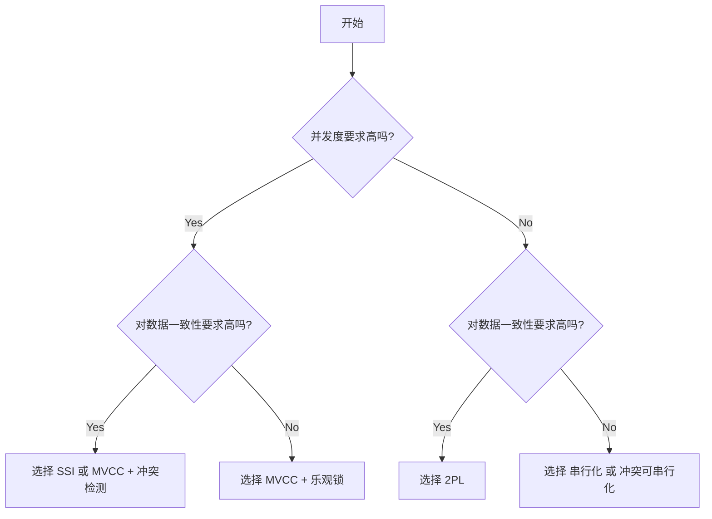
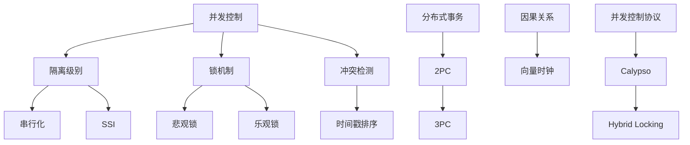
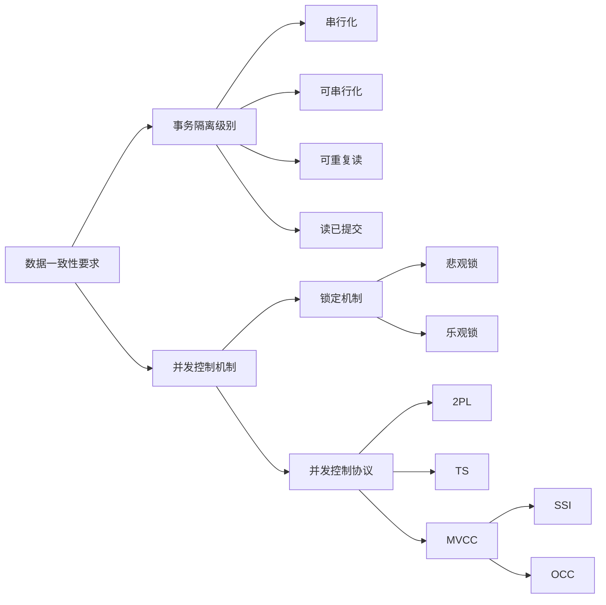
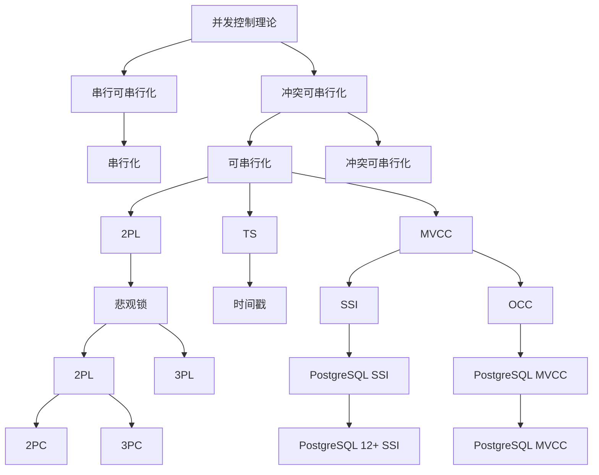
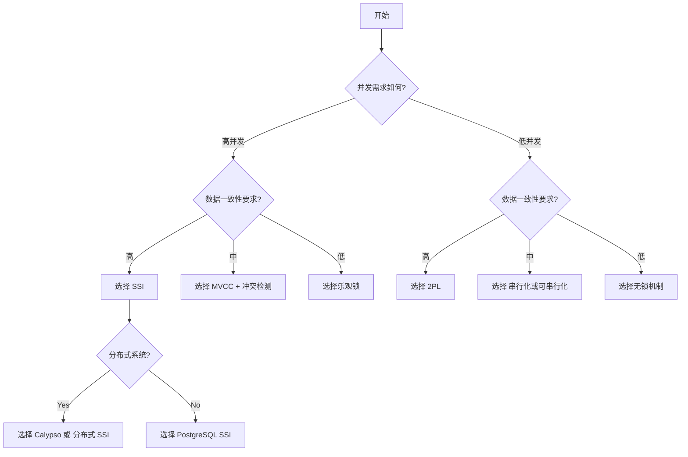
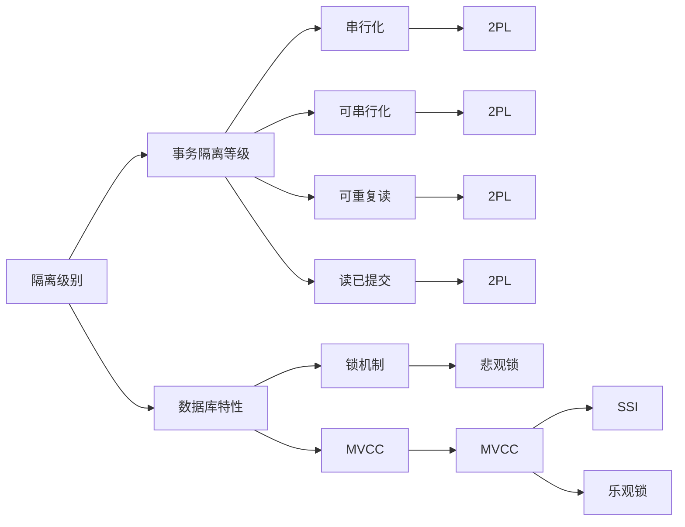
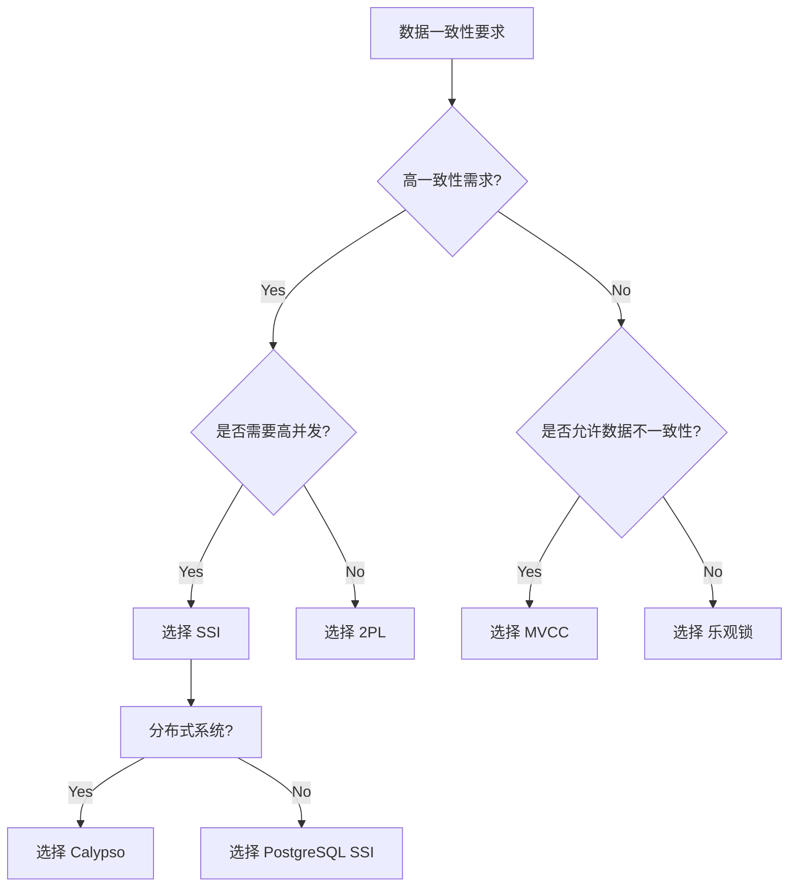

---

> **📋 文档来源**: `MVCC-ACID-CAP\25-理论体系\事务模型\MVCC_Lock_Transaction\mvcc_lock.md`
> **📅 复制日期**: 2025-12-22
> **⚠️ 注意**: 本文档为复制版本，原文件保持不变

---

# mvcc和lock

## PostgreSQL MVCC 与合并操作结果冲突的处理

PostgreSQL 的 MVCC (多版本并发控制) 机制在并发环境下保证了事务隔离性。然而，在一些复杂的操作，特别是当多个事务需要合并操作结果时，仍然可能发生版本冲突。理解 MVCC 的工作原理以及冲突产生的原因，才能有效地解决问题。

**1. MVCC 的基本原理**

- **版本链:** MVCC 的核心在于为每个事务创建快照（版本链）。当事务读取数据时，它读取的是在事务开始时存在的最新版本。
- **事务 ID (XID):**  每个事务都有一个唯一的事务 ID (XID)。数据行会记录创建或修改该行的 XID。
- **可见性规则:** 事务只能看到在它启动之前提交的事务所做的更改。如果一个事务尝试读取在它启动之后提交的更改，它会读取旧版本的数据。
- **并发读取:**  不同的事务可以并发读取相同的数据，而不会互相干扰。
- **写入冲突:**  如果两个事务尝试修改相同的数据行，其中一个事务必须先提交，另一个事务才能成功提交。否则，会发生冲突。

**2. 合并操作中版本冲突产生的原因**

常见的合并操作包括：

- **更新操作:** 多个事务同时尝试更新同一行数据。
- **删除操作:** 多个事务同时尝试删除同一行数据。
- **复杂更新:**  例如，根据其他行数据更新当前行，导致多个事务依赖相同的数据。

版本冲突可能发生在以下情况：

- **读脏数据 (Read Dirty):** 事务读取到其他未提交事务的更改。 (PostgreSQL 默认情况下不允许)
- **幻读 (Phantom Read):** 事务读取到其他事务新插入或删除的行。 (PostgreSQL 默认情况下使用 Serializable 隔离级别可以避免)
- **写冲突 (Write Conflict):**  多个事务并发修改同一行数据，导致其中一个事务回滚。  这是最常见的情况。
- **数据依赖导致的版本不一致:**  一个事务的更新依赖另一个事务的结果，导致数据版本不一致。

**3. 避免和处理版本冲突的方案**

PostgreSQL 提供了多种方案来避免和处理版本冲突：

**a) 事务隔离级别**

- **Read Committed (默认):** 允许事务读取已提交的数据，但无法避免幻读。  对于简单的合并操作，可能足够。
- **Repeatable Read:**  防止幻读，但可能导致读脏数据。
- **Serializable:**  提供最高级别的隔离，防止所有并发问题。  但会降低并发性能。   这是最安全的方案，但需要仔细评估性能影响。

**b) 乐观锁**

- **实现方式:** 在数据行中添加一个版本号或时间戳列。  事务读取数据时，记录版本号。  在提交更新时，检查版本号是否与读取时一致。如果不一致，说明数据已被其他事务修改，事务需要回滚或重试。
- **适用场景:**  适用于读多写少的场景。

**c) 悲观锁**

- **实现方式:**  在事务开始时，使用 `SELECT ... FOR UPDATE` 或 `SELECT ... FOR SHARE` 语句获取锁。  锁可以防止其他事务修改数据。
- **适用场景:**  适用于读少写多的场景，或者需要保证数据一致性的关键操作。  需要谨慎使用，避免死锁。

**d) Conflict Resolution Logic (冲突解决逻辑)**

- **实现方式:**  在应用程序中实现冲突解决逻辑。  例如，在更新数据时，比较当前数据和要更新的数据，如果冲突，则选择保留当前数据或更新后的数据，或者合并两个数据。
- **适用场景:**  适用于特定的业务场景，例如，如果两个事务同时更新同一行数据，可以选择保留最新的数据或合并两个数据。

**e) 使用 UPSERT (ON CONFLICT)**

- **功能:**  `INSERT ... ON CONFLICT DO UPDATE` 语句可以在插入数据时，如果遇到冲突，则更新现有数据。  这可以避免冲突，并简化代码。
- **适用场景:**  适用于需要更新或插入数据的场景。  可以指定冲突的目标 (例如，主键或唯一约束)，以及更新的目标列。

**f) 序列化冲突检测与重试**

- **实现**: 许多应用框架和数据库连接池提供自动重试机制。  当事务由于冲突而回滚时，框架会自动重试事务。
- **适用场景**:  适用于可以接受一定程度延迟的场景。

**4. 具体示例**

假设有两个事务同时尝试更新同一行数据：

```sql
-- 事务 1
BEGIN;
SELECT * FROM accounts WHERE id = 1; -- 读取数据
UPDATE accounts SET balance = balance + 100 WHERE id = 1;
COMMIT;

-- 事务 2
BEGIN;
SELECT * FROM accounts WHERE id = 1; -- 读取数据
UPDATE accounts SET balance = balance - 50 WHERE id = 1;
COMMIT;
```

如果两个事务并发执行，其中一个事务可能会回滚。

**使用乐观锁:**

```sql
-- 事务 1
BEGIN;
SELECT balance, version FROM accounts WHERE id = 1;
UPDATE accounts SET balance = balance + 100, version = version + 1 WHERE id = 1 AND version = <读取到的version>;
COMMIT;

-- 事务 2
BEGIN;
SELECT balance, version FROM accounts WHERE id = 1;
UPDATE accounts SET balance = balance - 50, version = version + 1 WHERE id = 1 AND version = <读取到的version>;
COMMIT;
```

如果其中一个事务读取的 version 与实际 version 不一致，则更新失败。

**5. 总结**

选择合适的冲突处理方案取决于具体的业务场景和并发需求。通常，可以使用以下原则：

- **避免冲突:**  尽可能减少并发冲突的可能性。
- **快速检测冲突:**  尽早检测冲突，避免长时间的等待和回滚。
- **优雅地处理冲突:**  提供合理的冲突解决逻辑，避免数据丢失或不一致。
- **监控和调优:**  监控并发冲突的频率和持续时间，并根据实际情况进行调优。

通过理解 MVCC 的工作原理和掌握各种冲突处理方案，可以有效地解决合并操作结果冲突问题，保证应用程序的可靠性和性能。

真正理解冲突和解决冲突的逻辑和机制，才是使用数据库的最好方式。
掌握这些，远比记住具体的 SQL 语法重要。

**为什么理解机制如此重要？**

- **性能优化：** 知道哪些操作会导致冲突，以及冲突带来的性能损耗，才能针对性地优化数据库设计和 SQL 语句。
- **可靠性保障：** 理解事务隔离级别和锁机制，才能确保数据的一致性和可靠性，避免数据丢失或损坏。
- **问题排查：** 当数据库出现性能问题或数据不一致时，才能快速定位问题所在，并采取有效的解决方案。
- **架构设计：** 在设计数据库架构时，才能根据业务需求和并发场景，选择合适的隔离级别和锁机制，构建高性能、高可靠的数据库系统。
- **避免过度设计：** 很多时候，我们为了追求高可靠性，过度使用了锁机制，导致性能下降。 只有真正理解冲突和解决冲突的逻辑，才能找到平衡点，避免过度设计。

**理解的核心概念：**

- **事务 (Transaction):**  一组操作的逻辑单元，要么全部成功，要么全部失败。
- **并发 (Concurrency):** 多个事务同时访问和修改数据库。
- **冲突 (Conflict):** 多个事务同时访问和修改相同的数据，导致数据不一致。
- **隔离级别 (Isolation Level):**  控制事务之间的隔离程度，避免并发冲突。
- **锁机制 (Locking Mechanism):**  控制事务对数据的访问权限，避免并发冲突。
- **MVCC (Multi-Version Concurrency Control):**  一种并发控制技术，允许多个事务同时读取和修改数据，而不会互相干扰。

**学习路径建议：**

1. **深入理解事务和并发的概念。**
2. **学习不同的隔离级别及其优缺点。**
3. **理解各种锁机制及其应用场景。**
4. **学习 MVCC 的工作原理。**
5. **通过实际案例，分析并发冲突的产生原因和解决方案。**
6. **阅读数据库官方文档和技术博客，了解最新的并发控制技术。**

总而言之，掌握并发控制技术，不仅可以提高数据库的性能和可靠性，还可以帮助你成为一名优秀的数据库工程师。
与其仅仅知道“怎么用”，不如理解“为什么这么用”，这才是真正掌握数据库技术的关键。

## 数据库并发控制的理论模型、形式化证明与扩展论证

结合前述建议，我们深入梳理数据库并发控制的理论模型、形式化证明与扩展论证。
这将涵盖从理论基础到实践应用的全方位分析。

**I. 理论模型基础**

1. **串行化 (Serialization):**  是并发控制的基石。假设事务是顺序执行的，避免并发冲突。  理想状态，但效率低。
2. **冲突可串行化 (Conflict Serializability):**  通过识别冲突操作来确定事务的执行顺序。冲突操作是指对同一数据项的读写操作。更实际的模型。
3. **时间戳排序 (Timestamp Ordering):**  为每个事务分配一个时间戳，并根据时间戳确定事务的执行顺序。  保证了事务执行顺序的一致性。
4. **多版本并发控制 (MVCC):**  维护数据多个版本，允许事务读取数据在特定时刻的状态。减少了锁争用，提高了并发性。
5. **两阶段锁协议 (2PL):**  在事务开始之前获取锁，在事务提交或回滚时释放锁。保证了可串行性，但可能导致死锁。
6. **乐观并发控制 (Optimistic Concurrency Control):**  假设冲突发生的概率较低，允许事务先执行，然后在提交时检查冲突。  适用于读多写少的场景。

**II. 形式化证明**

形式化证明旨在严格验证并发控制协议的正确性。常用的方法包括：

1. **基于状态机 (State Machine):**  将并发控制协议建模为状态机，并使用数学方法验证状态机的正确性。
2. **基于Petri网 (Petri Net):**  Petri网是一种图形化建模工具，可以用于描述并发系统。可以使用Petri网验证并发控制协议的正确性。
3. **基于逻辑 (Logic):**  使用逻辑语言描述并发控制协议，并使用逻辑推理验证协议的正确性。

**典型证明案例：Two-Phase Locking (2PL) 协议的正确性证明**

- **前提:** 假设 2PL 协议能够保证冲突操作按照顺序执行。
- **定理:** 2PL 协议保证并发执行的事务等价于某个串行执行的事务。
- **证明:**
    1. 2PL 协议保证在获取锁后，才能进行读写操作。
    2. 2PL 协议保证在释放锁之前，无法进行其他读写操作。
    3. 这些规则保证了冲突操作按照顺序执行。
    4. 因此，并发执行的事务等价于某个串行执行的事务。

**III. 扩展论证与现代模型**

现代数据库系统在并发控制方面进行了大量的扩展和改进：

1. **Serializable Snapshot Isolation (SSI):**  一种基于 MVCC 的隔离级别，可以提供可串行化的保证，同时减少锁争用。SSI 通过检测和解决冲突来保证可串行化。
2. **乐观并发控制与冲突检测:**  结合 MVCC 和冲突检测，在提交时检查是否有其他事务修改了相同的数据。冲突发生时，需要回滚并重试。
3. **分布式事务:**  在分布式数据库系统中，需要保证跨多个节点执行的事务的原子性、一致性、隔离性和持久性。常用的方法包括两阶段提交 (2PC) 和三阶段提交 (3PC)。
4. **向量时钟 (Vector Clock):**  一种分布式并发控制技术，可以跟踪事务之间的因果关系，并检测冲突。
5. **Calypso:** 一种基于 SSI 的并发控制协议，可以提高并发性和可伸缩性。
6. **Hybrid Locking:**  结合悲观锁和乐观锁的优势，在某些情况下使用悲观锁，在另一些情况下使用乐观锁。

**IV.  理论模型分析与论证**

| 理论模型 | 优点 | 缺点 | 适用场景 |
|---|---|---|---|
| 串行化 | 简单易懂 | 性能低 | 低并发场景 |
| 冲突可串行化 | 提高并发性 |  难以保证可串行性 | 中并发场景 |
| 时间戳排序 | 易于实现 | 可能导致死锁 | 中并发场景 |
| MVCC | 提高并发性，减少锁争用 | 复杂性高 | 高并发场景 |
| 2PL | 保证可串行性 | 可能导致死锁 | 对数据一致性要求高的场景 |
| SSI | 提高并发性，保证可串行性 | 复杂性高 | 高并发、对数据一致性有要求的场景 |

**V.  结论**

数据库并发控制是一个复杂的领域，需要综合考虑数据一致性、性能和可伸缩性等因素。
选择合适的并发控制协议需要根据具体的应用场景和业务需求进行分析和评估。

- **理论基础是关键：** 理解并发控制的理论模型是设计和优化并发控制协议的基础。
- **形式化证明是保证：** 形式化证明可以严格验证并发控制协议的正确性。
- **扩展论证是进步：** 持续的扩展论证可以推动并发控制技术的发展。

通过深入研究并发控制的理论、方法和技术，我们可以构建更加可靠、高效和可伸缩的数据库系统，满足日益增长的业务需求。

## 数据库并发控制理论主题全面梳理

以下将展开之前讨论过的所有理论主题，进行概念对比矩阵、属性关系梳理和决策树逻辑路径等梳理，以构建一个全面的知识体系。

**I. 核心概念对比矩阵**

| 特征/概念 | 串行化 | 冲突可串行化 | 时间戳排序 | MVCC | 2PL | SSI |
|---|---|---|---|---|---|---|
| **核心思想** | 顺序执行事务 | 识别冲突操作 | 根据时间戳排序 | 多版本管理数据 | 获取锁保证顺序 | 检测冲突保证串行 |
| **并发度** | 低 | 中 | 中 | 高 | 中 | 高 |
| **锁机制** | 无 | 无 | 无 | 无/少量 | 强 | 无/少量 |
| **死锁风险** | 无 | 低 | 中 | 低 | 高 | 低 |
| **冲突检测** | 无 | 有 | 有 | 有 | 有 | 有 |
| **实现复杂度** | 低 | 中 | 中 | 高 | 中 | 高 |
| **适用场景** | 低并发 | 中等并发 | 中等并发 | 高并发 | 对一致性要求高的场景 | 高并发，要求高一致性 |

**II. 属性关系梳理**

- **隔离级别:** 所有并发控制机制的目标都是实现不同级别的隔离。隔离级别越高，数据一致性越高，但并发度越低。
- **锁机制:** 锁是实现隔离的重要手段。不同的并发控制机制使用不同的锁机制。
- **冲突检测:** 冲突检测是保证数据一致性的关键。不同的并发控制机制使用不同的冲突检测方法。
- **死锁风险:** 死锁是并发控制的常见问题。不同的并发控制机制有不同的死锁风险。
- **MVCC与锁:** MVCC可以减少锁的使用，提高并发度。但MVCC需要维护多个版本的数据，增加了存储和管理的复杂性。
- **乐观锁与悲观锁:** 乐观锁假设冲突发生的概率较低，减少锁的使用。悲观锁假设冲突发生的概率较高，使用锁保证数据一致性。

**III. 决策树逻辑路径**



**IV. 扩展主题与关系梳理**

- **两阶段提交 (2PC):**  分布式事务协议，保证跨多个节点执行的事务的原子性。依赖于2PL。
- **三阶段提交 (3PC):**  改进的分布式事务协议，减少阻塞的可能性。
- **向量时钟 (Vector Clock):**  分布式并发控制技术，跟踪事务之间的因果关系，检测冲突。
- **Calypso:**  基于 SSI 的并发控制协议，提高并发性和可伸缩性。
- **乐观并发控制与冲突检测:**  结合 MVCC 和冲突检测，在提交时检查是否有其他事务修改了相同的数据。
- **Serializable Snapshot Isolation (SSI):**  一种基于 MVCC 的隔离级别，可以提供可串行化的保证，同时减少锁争用。
- **Hybrid Locking:** 结合悲观锁和乐观锁的优势，在某些情况下使用悲观锁，在另一些情况下使用乐观锁。

**V.  理论主题关系图**



**VI.  总结与最佳实践**

- **选择合适的并发控制机制需要根据具体的应用场景和业务需求进行分析和评估。**
- **在高并发场景下，应该选择MVCC或乐观锁等减少锁使用的机制。**
- **对数据一致性要求高的场景，应该选择2PL或SSI等保证可串行化的机制。**
- **在分布式系统中，应该选择2PC或3PC等分布式事务协议。**
- **持续监控和调优并发控制机制，以提高性能和可靠性。**

通过以上全面的梳理，可以构建一个完整的数据库并发控制知识体系，帮助开发者更好地理解并发控制的原理和技术，并选择合适的并发控制机制来构建高性能、高可靠的数据库系统。

# 数据库并发控制理论体系与实践应用深度梳理

## 一、理论基础框架

数据库并发控制的核心目标是解决多个事务同时访问和修改数据库时产生的冲突问题，确保数据的ACID特性。其理论基础可归纳为以下四个维度：

### 1.1 并发控制的核心理论

| 理论维度 | 主要理论 | 代表模型 | 本质思想 | 关键特性 |
|----------|----------|----------|----------|----------|
| **理论基础** | 串行可串行化 | 串行执行模型 | 事务顺序执行 | 完全一致性，低性能 |
| | 冲突可串行化 | 冲突图理论 | 按冲突操作排序 | 满足串行化条件即可 |
| **实现方法** | 两阶段锁协议 | 2PL | 获取锁→操作→释放锁 | 死锁风险高 |
| | 时间戳排序 | TS | 按时间戳排序 | 可能回滚事务 |
| | 多版本并发控制 | MVCC | 维护多版本数据 | 读写不阻塞 |
| | 乐观并发控制 | OCC | 先执行再检查 | 冲突概率低时高效 |
| **高级扩展** | 可串行化快照隔离 | SSI | 基于MVCC的串行化 | 低锁争用，高一致性 |
| | 分布式并发控制 | 向量时钟 | 跟踪因果关系 | 适用于分布式系统 |

### 1.2 关键概念关系



## 二、概念对比矩阵

### 2.1 理论模型综合对比

| 特征/概念 | 串行化 | 冲突可串行化 | 时间戳排序 | MVCC | 2PL | SSI | 乐观锁 | 乐观并发控制 |
|---|---|---|---|---|---|---|---|---|
| **理论基础** | 事务顺序执行 | 冲突操作排序 | 事务时间戳排序 | 多版本数据管理 | 锁获取与释放 | 基于MVCC的冲突检测 | 无锁并发 | 基于MVCC的冲突检测 |
| **并发性能** | 低 | 中 | 中 | 高 | 中 | 高 | 高 | 高 |
| **数据一致性** | 极高 | 高 | 高 | 中 | 极高 | 极高 | 中 | 高 |
| **实现复杂度** | 低 | 中 | 中 | 高 | 中 | 高 | 中 | 高 |
| **死锁风险** | 无 | 低 | 低 | 低 | 高 | 低 | 低 | 低 |
| **冲突检测** | 无 | 有 | 有 | 有 | 有 | 有 | 有 | 有 |
| **锁使用** | 无 | 无 | 无 | 无/少量 | 有 | 无/少量 | 无 | 无 |
| **写操作开销** | 低 | 中 | 中 | 高 | 高 | 高 | 低 | 低 |
| **读操作开销** | 低 | 中 | 中 | 高 | 低 | 低 | 低 | 低 |
| **适用场景** | 低并发 | 通用 | 非高并发 | 高并发 | 对一致性要求高的场景 | 高并发，高一致性 | 读多写少 | 读多写少场景 |

### 2.2 理论模型关系图



## 三、属性关系梳理

### 3.1 概念之间的关系链

1. **事务隔离级别与并发控制协议的关系**
   - 串行化隔离级别要求事务完全按照串行执行
   - 可串行化隔离级别允许并发执行，但保证等价于某串行执行
   - 可重复读隔离级别提供更强的隔离性，避免幻读
   - 读已提交隔离级别允许脏读，但避免脏写

2. **并发控制协议与实现技术的关系**
   - MVCC是实现并发控制的一种技术
   - SSI是MVCC的扩展，提供了串行化保证
   - 2PL是保证事务可串行性的协议
   - 乐观并发控制是MVCC的实现方式之一

3. **并发控制与分布式系统的关系**
   - 分布式系统中，事务需要跨节点执行
   - 2PC和3PC用于保证分布式事务的原子性
   - 向量时钟用于解决分布式系统中的并发控制问题
   - Calypso是基于SSl的分布式并发控制协议

### 3.2 关键属性分析

1. **数据一致性 vs. 并发性**
   - 传统数据库设计中的权衡：提高一致性通常会降低并发性
   - 现代数据库通过MVCC和SSl实现了"一致性与并发性兼得"
   - PostgreSQL通过SSI实现了接近串行化隔离级别的性能

2. **锁定机制的演进**
   - 早期：粗粒度锁（表级、页级）
   - 中期：细粒度锁（行级）
   - 现代：MVCC机制减少了对锁的依赖
   - 未来：更多基于时间戳或向量时钟的并发控制

3. **冲突检测与解决策略**
   - 检测时机：提交时检测 vs. 执行时检测
   - 解决策略：回滚重试、延迟更新、合并策略等
   - 检测精度：精确检测 vs. 概率性检测

## 四、决策树逻辑路径

### 4.1 基于业务需求的并发控制决策树



### 4.2 技术选型决策逻辑

#### 4.2.1 从隔离级别到并发控制协议



#### 4.2.2 从数据一致性到实现方案



## 五、理论模型的实践应用分析

### 5.1 PostgreSQL 的并发控制实现

#### 5.1.1 MVCC 实现机制

- **多版本管理**: 每行数据包含创建和删除版本号
- **可见性规则**: 根据事务ID确定数据是否可见
- **GC机制**: 后台线程回收已删除的数据
- **性能优势**: 读写不阻塞，高并发性能

#### 5.1.2 SSI 实现

- **冲突检测**: 在提交时检查是否发生冲突
- **检测方法**: 通过记录和检查依赖关系
- **性能影响**: 检测机制的开销
- **应用示例**: PostgreSQL 12+ 中的 SSI

### 5.2 企业级应用中的并发控制实践

#### 5.2.1 电商平台订单系统

- **高并发读写场景**: 需要支持大量订单操作
- **数据一致性要求**: 保证库存、订单等数据的准确性
- **解决方案**: 使用 MVCC+SSI 组合，确保高并发下的一致性
- **实现方式**:
  - 使用 PostgreSQL 14+ 的 SSI 功能
  - 配合乐观锁进行并发控制
  - 适当使用分布式事务

#### 5.2.2 金融系统

- **高一致性要求**: 金融交易要求严格的ACID特性
- **中等并发**: 相比电商系统，并发压力较低
- **解决方案**:
  - 使用 2PL 保证事务隔离
  - 适当使用 MVCC 减少锁争用
  - 结合分布式事务保证跨服务一致性
- **实现方式**:
  - 使用 PostgreSQL 的 2PL 机制
  - 采用两阶段提交保证分布式事务

## 六、理论模型与实践的映射

### 6.1 并发控制模型的实践应用映射

| 理论模型 | 实践应用场景 | 实现方法 | 适用场景 | 优势 | 局限性 |
|----------|--------------|----------|----------|------|--------|
| 串行化 | 小型单用户系统 | 顺序执行 | 低并发场景 | 简单可靠 | 低并发 |
| 可串行化 | 中等并发系统 | 2PL 或 SSI | 通用场景 | 一致性高 | 并发性中等 |
| 2PL | 高可靠性场景 | 悲观锁 | 金融系统 | 高一致性 | 低并发 |
| MVCC | 高并发系统 | 无锁机制 | 电商平台 | 高并发 | 数据版本管理复杂 |
| SSI | 高并发高一致性 | MVCC+冲突检测 | 金融、电商平台 | 高并发+高一致性 | 实现复杂 |
| 乐观锁 | 读多写少场景 | 基于版本号 | 知识库、推荐系统 | 高并发 | 需要冲突检测 |

### 6.2 理论到实践的转化路径

1. **理论模型 -> 系统设计**
   - 根据业务需求确定需要的隔离级别
   - 选择合适的并发控制协议
   - 设计数据库架构和事务边界

2. **系统设计 -> 实现**
   - 选择合适的数据库系统（如 PostgreSQL）
   - 配置适当的隔离级别
   - 适当使用锁机制或MVCC
   - 实现必要的冲突检测和解决逻辑

3. **实现 -> 优化**
   - 性能调优
   - 监控和日志
   - 定期评估并发控制效果

## 七、未来趋势与展望

### 7.1 新兴技术趋势

1. **向量化并发控制**
   - 基于向量时钟的并发控制
   - 分布式系统中的因果关系追踪
   - 降低分布式事务的性能开销

2. **AI 驱动的并发控制**
   - 使用机器学习预测并发冲突
   - 自动调优并发控制策略
   - 动态调整隔离级别

3. **新型硬件支持**
   - 基于硬件事务内存的并发控制
   - 处理器对并发控制的原生支持
   - 降低并发控制的软件开销

### 7.2 企业应用展望

1. **云原生数据库架构**
   - 自动扩展的并发控制机制
   - 分布式事务的优化
   - 云环境下的性能调优

2. **混合事务/分析处理 (HTAP)**
   - 同时支持OLTP和OLAP
   - 高性能并发控制
   - 数据分析与事务处理的平衡

3. **智能事务管理**
   - 基于业务场景的事务策略
   - 动态隔离级别调整
   - 自适应的并发控制策略

## 八、总结与最佳实践

### 8.1 关键结论

1. **理解理论是实践的基础**：深入理解并发控制理论是设计高效、可靠的数据库系统的基础。
2. **平衡一致性与性能**：在高并发环境下，需要在一致性与性能之间找到最佳平衡点。
3. **选择合适的工具**：根据业务需求选择合适的并发控制协议和实现方式。
4. **持续优化**：数据库并发控制需要持续监控和优化，以适应不断变化的业务需求。

### 8.2 实践建议

1. **确定业务需求**：明确业务场景下的并发需求和一致性要求。
2. **选择合适隔离级别**：根据需求选择适当的隔离级别。
3. **考虑MVCC优势**：在高并发场景下，优先考虑MVCC机制。
4. **应用冲突检测**：结合SSl和乐观锁机制，优化并发性能。
5. **持续监控**：通过监控工具评估并发控制效果，及时调整策略。
6. **避免过度设计**：选择合适复杂的方案，不要过度追求一致性而牺牲性能。

通过上述全面梳理，我们可以看到数据库并发控制是一个复杂的理论体系，它需要与实践紧密结合。只有理解其理论基础，并能够灵活应用到实际场景中，才能构建出高性能、高可靠的数据管理系统。特别是对于现代企业应用，如高并发的电商平台和金融系统，合理使用并发控制机制显得尤为重要。

在实际应用中，应根据业务场景的具体需求，综合考虑各种并发控制机制的优劣，选择最适合的方案，而非简单地选择"最先进"或"最强大"的机制。这正是"真正理解这些冲突和解决冲突的逻辑和机制，才是使用数据库的最好方式"这句话的真正含义。
