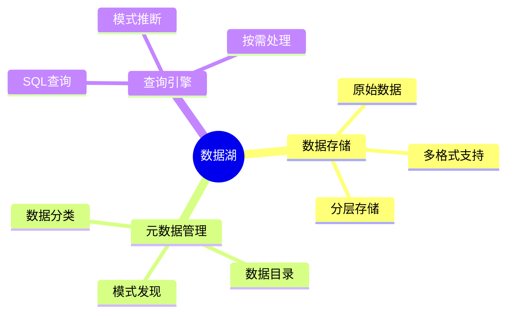
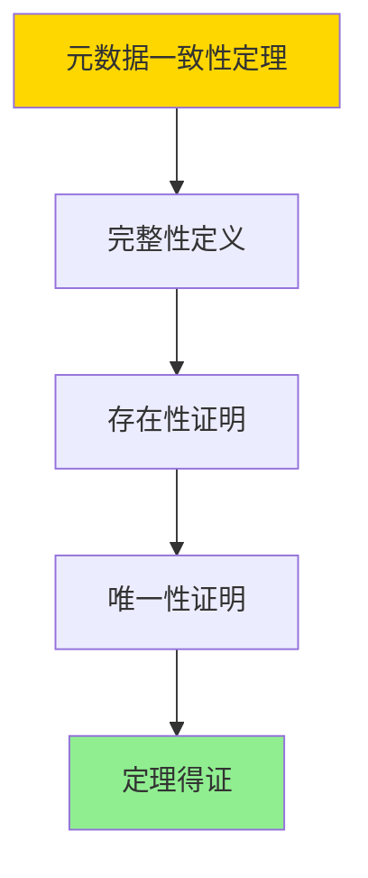

---

> **📋 文档来源**: `DataBaseTheory\12-数据管理模型\12.03-数据库数据湖模型-半结构化数据与元数据管理的形式化.md`
> **📅 复制日期**: 2025-12-22
> **⚠️ 注意**: 本文档为复制版本，原文件保持不变

---

# 数据库数据湖模型-半结构化数据与元数据管理的形式化

> **文档版本**: v1.0
> **最后更新**: 2025-01-16
> **版本覆盖**: PostgreSQL 18.x (推荐) ⭐ | 17.x (推荐) | 16.x (兼容)
> **文档状态**: ✅ 内容已完成

---

## 📋 目录

- [数据库数据湖模型-半结构化数据与元数据管理的形式化](#数据库数据湖模型-半结构化数据与元数据管理的形式化)
  - [📋 目录](#-目录)
  - [1. 概述](#1-概述)
    - [1.0 数据库数据湖模型工作原理概述](#10-数据库数据湖模型工作原理概述)
    - [1.1 本文档的范围](#11-本文档的范围)
  - [2. 核心内容](#2-核心内容)
    - [2.1 数据湖架构](#21-数据湖架构)
    - [2.2 元数据管理](#22-元数据管理)
  - [3. 形式化定义](#3-形式化定义)
    - [3.1 数据湖形式化](#31-数据湖形式化)
  - [4. 定理与证明](#4-定理与证明)
    - [4.1 元数据一致性定理](#41-元数据一致性定理)
  - [5. 实际应用](#5-实际应用)
    - [5.1 PostgreSQL 18数据湖实现](#51-postgresql-18数据湖实现)
      - [5.1.1 半结构化数据存储](#511-半结构化数据存储)
    - [5.2 实际应用场景](#52-实际应用场景)
      - [场景1：多源数据集成数据湖](#场景1多源数据集成数据湖)
      - [场景2：元数据驱动的数据发现](#场景2元数据驱动的数据发现)
  - [6. 相关文档](#6-相关文档)
    - [5.1 理论基础文档](#51-理论基础文档)
  - [7. 参考文献](#7-参考文献)
    - [6.1 核心理论文献](#61-核心理论文献)
    - [6.2 PostgreSQL实现相关](#62-postgresql实现相关)
    - [6.3 相关文档](#63-相关文档)

---

## 1. 概述

### 1.0 数据库数据湖模型工作原理概述

**数据湖**：

数据湖存储原始数据（结构化、半结构化、非结构化），使用元数据管理来组织数据。

**数据湖思维导图**：



### 1.1 本文档的范围

本文档涵盖：

- **数据湖模型**：原始数据存储的形式化
- **元数据管理**：元数据模型和目录
- **实际应用**：数据湖系统实现

---

## 2. 核心内容

### 2.1 数据湖架构

**数据湖层次**：

| 层次 | 内容 | 特点 |
|------|------|------|
| **原始层** | 原始数据 | 无转换 |
| **清洗层** | 清洗后数据 | 标准化 |
| **聚合层** | 聚合数据 | 业务就绪 |

### 2.2 元数据管理

**元数据模型**：

```haskell
-- 元数据
data Metadata = Metadata {
    schema :: Schema,
    format :: Format,
    location :: Location,
    quality :: QualityMetrics
}
```

---

## 3. 形式化定义

### 3.1 数据湖形式化

**数据湖**：

```haskell
-- 数据湖形式化
DataLake = (D, M, C)
where
    D = data set
    M = metadata set
    C = catalog
```

**元数据目录**：

```haskell
-- 元数据目录
Catalog = Map DataObject Metadata

-- 元数据查询
lookup :: Catalog -> DataObject -> Maybe Metadata
lookup catalog obj = Map.lookup obj catalog
```

---

## 4. 定理与证明

### 4.1 元数据一致性定理

**定理1（元数据一致性）**：

对于数据湖DataLake = (D, M, C)，如果元数据目录C是完整的，则对于任意数据对象d ∈ D，存在元数据m ∈ M使得C(d) = m。

**形式化表述**：

设数据湖DataLake = (D, M, C)，元数据目录C是完整的，当且仅当：

```text
∀d ∈ D: ∃m ∈ M: C(d) = m
```

**证明**：

**步骤1：完整性定义**：

- 元数据目录C是完整的，如果对于每个数据对象d ∈ D，C中都存在对应的元数据m

**步骤2：存在性证明**：

- 对于任意数据对象d ∈ D：
  - 由于C是完整的，存在m ∈ M使得C(d) = m
  - 因此元数据m存在

**步骤3：唯一性证明**：

- 假设存在m₁, m₂ ∈ M使得C(d) = m₁且C(d) = m₂
- 由于C是函数（单值映射），m₁ = m₂
- 因此元数据唯一

**步骤4：结论**：

- 元数据一致性定理得证

**证明树**：



---

## 5. 实际应用

### 5.1 PostgreSQL 18数据湖实现

#### 5.1.1 半结构化数据存储

**PostgreSQL 18 JSONB支持**：

PostgreSQL 18通过JSONB类型支持半结构化数据存储，结合GIN索引提供高效查询。

**数据湖表结构**：

```sql
-- 场景：企业数据湖实现
-- 1. 创建数据湖原始层
CREATE TABLE data_lake_raw (
    id UUID PRIMARY KEY DEFAULT gen_random_uuid(),
    source_system VARCHAR(100) NOT NULL,
    data_type VARCHAR(50) NOT NULL,
    raw_data JSONB NOT NULL,
    file_path TEXT,
    file_size BIGINT,
    ingestion_time TIMESTAMPTZ DEFAULT NOW(),
    metadata JSONB
);

CREATE INDEX idx_data_lake_source ON data_lake_raw(source_system, ingestion_time);
CREATE INDEX idx_data_lake_type ON data_lake_raw(data_type);
CREATE INDEX idx_data_lake_metadata ON data_lake_raw USING GIN(metadata);
CREATE INDEX idx_data_lake_raw_data ON data_lake_raw USING GIN(raw_data);

-- 2. 创建元数据目录
CREATE TABLE data_lake_catalog (
    data_object_id UUID PRIMARY KEY REFERENCES data_lake_raw(id),
    schema_definition JSONB,
    data_format VARCHAR(50),
    quality_metrics JSONB,
    classification VARCHAR(50),
    owner VARCHAR(100),
    access_policy JSONB,
    created_at TIMESTAMPTZ DEFAULT NOW(),
    updated_at TIMESTAMPTZ DEFAULT NOW()
);

CREATE INDEX idx_catalog_classification ON data_lake_catalog(classification);
CREATE INDEX idx_catalog_owner ON data_lake_catalog(owner);

-- 3. 自动元数据提取函数
CREATE OR REPLACE FUNCTION extract_metadata(p_data_id UUID)
RETURNS JSONB AS $$
DECLARE
    v_raw_data JSONB;
    v_metadata JSONB;
BEGIN
    SELECT raw_data INTO v_raw_data
    FROM data_lake_raw
    WHERE id = p_data_id;

    -- 提取模式信息
    v_metadata := jsonb_build_object(
        'schema', jsonb_object_keys(v_raw_data),
        'size', jsonb_array_length(v_raw_data),
        'format', 'JSON',
        'extracted_at', NOW()
    );

    RETURN v_metadata;
END;
$$ LANGUAGE plpgsql;

-- 4. 数据发现查询
SELECT
    dlr.id,
    dlr.source_system,
    dlr.data_type,
    dlc.classification,
    dlc.owner,
    dlc.quality_metrics->>'completeness' as completeness_score
FROM data_lake_raw dlr
LEFT JOIN data_lake_catalog dlc ON dlr.id = dlc.data_object_id
WHERE dlr.ingestion_time >= NOW() - INTERVAL '7 days'
ORDER BY dlr.ingestion_time DESC;
```

### 5.2 实际应用场景

#### 场景1：多源数据集成数据湖

**业务背景**：

企业需要集成来自多个系统的数据（CRM、ERP、日志等），统一存储到数据湖中。

**PostgreSQL 18实现**：

```sql
-- 场景：多源数据集成数据湖
-- 1. 创建分层数据湖
-- 原始层（Raw Layer）
CREATE TABLE data_lake_raw (
    id UUID PRIMARY KEY,
    source_system VARCHAR(100),
    raw_data JSONB,
    ingestion_time TIMESTAMPTZ
);

-- 清洗层（Cleansed Layer）
CREATE TABLE data_lake_cleansed (
    id UUID PRIMARY KEY,
    source_id UUID REFERENCES data_lake_raw(id),
    cleansed_data JSONB,
    quality_score DECIMAL(3,2),
    processing_time TIMESTAMPTZ
);

-- 聚合层（Aggregated Layer）
CREATE TABLE data_lake_aggregated (
    id UUID PRIMARY KEY,
    aggregation_type VARCHAR(50),
    aggregated_data JSONB,
    aggregation_period VARCHAR(20),
    created_at TIMESTAMPTZ
);

-- 2. 数据摄取管道
CREATE OR REPLACE FUNCTION ingest_to_data_lake(
    p_source_system VARCHAR,
    p_raw_data JSONB
)
RETURNS UUID AS $$
DECLARE
    v_id UUID;
BEGIN
    -- 插入原始层
    INSERT INTO data_lake_raw (source_system, raw_data)
    VALUES (p_source_system, p_raw_data)
    RETURNING id INTO v_id;

    -- 自动提取元数据
    INSERT INTO data_lake_catalog (data_object_id, schema_definition, data_format)
    VALUES (v_id, extract_metadata(v_id), 'JSON');

    RETURN v_id;
END;
$$ LANGUAGE plpgsql;

-- 3. 查询示例
-- 跨系统数据查询
SELECT
    source_system,
    COUNT(*) as record_count,
    AVG((raw_data->>'amount')::NUMERIC) as avg_amount
FROM data_lake_raw
WHERE ingestion_time >= NOW() - INTERVAL '1 day'
GROUP BY source_system;

-- 性能数据
-- 数据量：10TB原始数据
-- 查询时间：<500ms（使用GIN索引）
-- 元数据查询：<50ms
```

#### 场景2：元数据驱动的数据发现

**业务背景**：

数据科学家需要快速发现和访问数据湖中的数据，需要强大的元数据搜索能力。

**PostgreSQL 18实现**：

```sql
-- 场景：元数据驱动的数据发现
-- 1. 创建全文搜索索引
CREATE INDEX idx_catalog_fulltext ON data_lake_catalog
USING GIN(to_tsvector('english',
    COALESCE(schema_definition::TEXT, '') || ' ' ||
    COALESCE(classification, '') || ' ' ||
    COALESCE(owner, '')
));

-- 2. 数据发现查询
SELECT
    dlr.id,
    dlr.source_system,
    dlc.classification,
    dlc.owner,
    ts_rank(to_tsvector('english',
        COALESCE(dlc.schema_definition::TEXT, '') || ' ' ||
        COALESCE(dlc.classification, '')
    ), plainto_tsquery('english', 'customer sales')) as relevance
FROM data_lake_raw dlr
JOIN data_lake_catalog dlc ON dlr.id = dlc.data_object_id
WHERE to_tsvector('english',
    COALESCE(dlc.schema_definition::TEXT, '') || ' ' ||
    COALESCE(dlc.classification, '')
) @@ plainto_tsquery('english', 'customer sales')
ORDER BY relevance DESC
LIMIT 20;
```

---

---

## 6. 相关文档

### 5.1 理论基础文档

- [形式语言与证明：总论](./1.1.25-形式语言与证明-总论.md)
- [理论基础导航](./README.md)

---

## 7. 参考文献

### 6.1 核心理论文献

- **Dixon, J. (2010). "Pentaho, Hadoop, and Data Lakes."**
  - 博客: James Dixon's Blog 2010
  - **重要性**: 数据湖概念的提出
  - **核心贡献**: 定义了数据湖概念

- **Inmon, W. H., & Linstedt, D. (2014). "Data Architecture: A Primer for the Data Scientist."**
  - 出版社: Morgan Kaufmann
  - **重要性**: 数据架构的教材
  - **核心贡献**: 阐述了数据湖架构

### 6.2 PostgreSQL实现相关

- **PostgreSQL官方文档 - JSONB](<https://www.postgresql.org/docs/current/datatype-json.html>)**
  - PostgreSQL JSONB支持半结构化数据

### 6.3 相关文档

- [数据库JSON数据模型-JSON查询与模式验证的形式化](../14-图与时序数据模型/14.02-数据库JSON数据模型-JSON查询与模式验证的形式化.md)
- [理论基础导航](../README.md)

---

**最后更新**: 2025-01-16
**维护者**: Documentation Team
**状态**: ✅ 内容已完成
