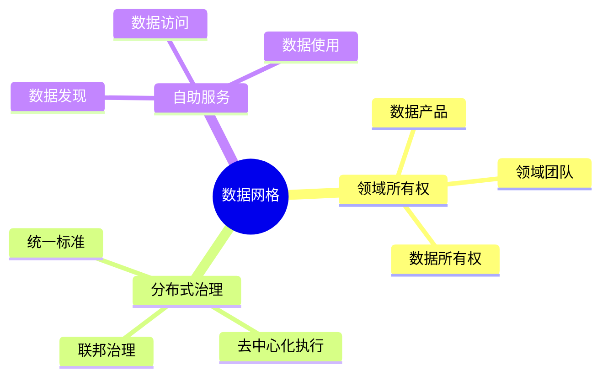
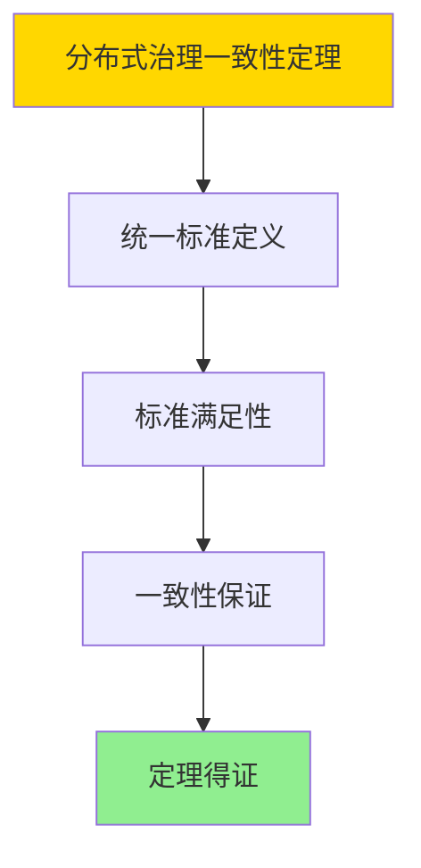

---

> **📋 文档来源**: `DataBaseTheory\12-数据管理模型\12.04-数据库数据网格模型-分布式数据治理与访问控制的形式化.md`
> **📅 复制日期**: 2025-12-22
> **⚠️ 注意**: 本文档为复制版本，原文件保持不变

---

# 数据库数据网格模型-分布式数据治理与访问控制的形式化

> **文档版本**: v1.0
> **最后更新**: 2025-01-16
> **版本覆盖**: PostgreSQL 18.x (推荐) ⭐ | 17.x (推荐) | 16.x (兼容)
> **文档状态**: ✅ 内容已完成

---

## 📋 目录

- [数据库数据网格模型-分布式数据治理与访问控制的形式化](#数据库数据网格模型-分布式数据治理与访问控制的形式化)
  - [📋 目录](#-目录)
  - [1. 概述](#1-概述)
    - [1.0 数据库数据网格模型工作原理概述](#10-数据库数据网格模型工作原理概述)
    - [1.1 本文档的范围](#11-本文档的范围)
  - [2. 核心内容](#2-核心内容)
    - [2.1 数据网格架构](#21-数据网格架构)
    - [2.2 分布式治理](#22-分布式治理)
  - [3. 形式化定义](#3-形式化定义)
    - [3.1 数据网格形式化](#31-数据网格形式化)
  - [4. 定理与证明](#4-定理与证明)
    - [4.1 分布式治理一致性定理](#41-分布式治理一致性定理)
  - [5. 实际应用](#5-实际应用)
    - [5.1 PostgreSQL 18数据网格实现](#51-postgresql-18数据网格实现)
      - [5.1.1 数据产品目录](#511-数据产品目录)
    - [5.2 实际应用场景](#52-实际应用场景)
      - [场景1：多领域数据产品管理](#场景1多领域数据产品管理)
      - [场景2：联邦查询跨域数据](#场景2联邦查询跨域数据)
  - [6. 相关文档](#6-相关文档)
    - [5.1 理论基础文档](#51-理论基础文档)
  - [7. 参考文献](#7-参考文献)
    - [6.1 核心理论文献](#61-核心理论文献)
    - [6.2 PostgreSQL实现相关](#62-postgresql实现相关)
    - [6.3 相关文档](#63-相关文档)

---

## 1. 概述

### 1.0 数据库数据网格模型工作原理概述

**数据网格**：

数据网格是分布式数据治理架构，将数据所有权分散到领域团队。

**数据网格思维导图**：



### 1.1 本文档的范围

本文档涵盖：

- **数据网格架构**：领域所有权和治理
- **访问控制**：分布式访问控制模型
- **实际应用**：数据网格实现

---

## 2. 核心内容

### 2.1 数据网格架构

**数据产品**：

```haskell
-- 数据产品
data DataProduct = DataProduct {
    domain :: Domain,
    owner :: Team,
    data :: Data,
    metadata :: Metadata,
    accessControl :: AccessPolicy
}
```

### 2.2 分布式治理

**治理模型**：

| 层面 | 职责 | 执行方式 |
|------|------|---------|
| **全局** | 标准制定 | 集中式 |
| **领域** | 数据管理 | 分布式 |
| **产品** | 数据服务 | 自主式 |

---

## 3. 形式化定义

### 3.1 数据网格形式化

**数据网格**：

```haskell
-- 数据网格形式化
DataMesh = (DP, G, A)
where
    DP = {dp1, dp2, ..., dpn}  -- data products
    G = governance model
    A = access control
```

**访问控制模型**：

```haskell
-- 访问控制
AccessControl = (P, R, M)
where
    P = principals (users, teams)
    R = resources (data products)
    M = access matrix: P × R → Permissions
```

---

## 4. 定理与证明

### 4.1 分布式治理一致性定理

**定理1（分布式治理一致性）**：

对于数据网格DataMesh = (DP, G, A)，如果全局治理标准G是统一的，则所有数据产品dp ∈ DP都满足G的标准。

**形式化表述**：

设数据网格DataMesh = (DP, G, A)，全局治理标准G统一，当且仅当：

```text
∀dp ∈ DP: satisfies(dp, G)
```

**证明**：

**步骤1：统一标准定义**：

- 全局治理标准G是统一的，如果G定义了所有数据产品必须满足的标准集合

**步骤2：标准满足性**：

- 对于任意数据产品dp ∈ DP：
  - 由于G是统一的，dp必须满足G中的所有标准
  - 因此satisfies(dp, G)

**步骤3：一致性保证**：

- 由于所有数据产品都满足统一的治理标准G，数据网格保持一致
- 定理得证

**证明树**：



---

## 5. 实际应用

### 5.1 PostgreSQL 18数据网格实现

#### 5.1.1 数据产品目录

**PostgreSQL 18数据网格支持**：

PostgreSQL 18通过外部数据包装器（FDW）和行级安全（RLS）实现数据网格架构。

**数据产品注册表**：

```sql
-- 场景：企业数据网格实现
-- 1. 创建数据产品目录
CREATE TABLE data_products (
    product_id UUID PRIMARY KEY DEFAULT gen_random_uuid(),
    product_name VARCHAR(200) NOT NULL,
    domain VARCHAR(100) NOT NULL,
    owner_team VARCHAR(100) NOT NULL,
    data_location TEXT NOT NULL,
    data_format VARCHAR(50),
    schema_definition JSONB,
    access_policy JSONB,
    quality_metrics JSONB,
    created_at TIMESTAMPTZ DEFAULT NOW(),
    updated_at TIMESTAMPTZ DEFAULT NOW()
);

CREATE INDEX idx_data_products_domain ON data_products(domain);
CREATE INDEX idx_data_products_owner ON data_products(owner_team);

-- 2. 创建访问控制表
CREATE TABLE data_product_access (
    access_id UUID PRIMARY KEY DEFAULT gen_random_uuid(),
    product_id UUID NOT NULL REFERENCES data_products(product_id),
    principal VARCHAR(100) NOT NULL,  -- user or team
    permissions TEXT[] NOT NULL,  -- ['read', 'write', 'admin']
    granted_by VARCHAR(100),
    granted_at TIMESTAMPTZ DEFAULT NOW(),
    expires_at TIMESTAMPTZ
);

CREATE INDEX idx_access_product ON data_product_access(product_id);
CREATE INDEX idx_access_principal ON data_product_access(principal);

-- 3. 访问控制检查函数
CREATE OR REPLACE FUNCTION check_data_product_access(
    p_product_id UUID,
    p_principal VARCHAR,
    p_permission TEXT
)
RETURNS BOOLEAN AS $$
DECLARE
    v_has_access BOOLEAN := FALSE;
BEGIN
    SELECT EXISTS(
        SELECT 1
        FROM data_product_access
        WHERE product_id = p_product_id
          AND principal = p_principal
          AND p_permission = ANY(permissions)
          AND (expires_at IS NULL OR expires_at > NOW())
    ) INTO v_has_access;

    RETURN v_has_access;
END;
$$ LANGUAGE plpgsql;
```

### 5.2 实际应用场景

#### 场景1：多领域数据产品管理

**业务背景**：

大型企业需要管理多个领域的数据产品（销售、财务、HR等），每个领域团队拥有自己的数据产品。

**PostgreSQL 18实现**：

```sql
-- 场景：多领域数据产品管理
-- 1. 注册数据产品
INSERT INTO data_products (product_name, domain, owner_team, data_location, access_policy)
VALUES
    ('sales_customer_data', 'sales', 'sales-team', 'postgresql://sales-db/sales.customers',
     '{"read": ["sales-team", "analytics-team"], "write": ["sales-team"]}'::JSONB),
    ('finance_transactions', 'finance', 'finance-team', 'postgresql://finance-db/finance.transactions',
     '{"read": ["finance-team", "audit-team"], "write": ["finance-team"]}'::JSONB);

-- 2. 数据产品发现
SELECT
    product_name,
    domain,
    owner_team,
    access_policy->'read' as read_access,
    quality_metrics->>'completeness' as quality_score
FROM data_products
WHERE domain = 'sales'
ORDER BY created_at DESC;

-- 3. 访问控制验证
SELECT
    dp.product_name,
    check_data_product_access(dp.product_id, 'analytics-team', 'read') as can_read
FROM data_products dp
WHERE dp.domain = 'sales';
```

#### 场景2：联邦查询跨域数据

**业务背景**：

需要跨多个领域的数据产品进行联合查询，实现数据网格的自助服务能力。

**PostgreSQL 18实现**：

```sql
-- 场景：联邦查询跨域数据
-- 1. 创建外部数据包装器
CREATE EXTENSION IF NOT EXISTS postgres_fdw;

-- 2. 为每个数据产品创建外部服务器
CREATE SERVER sales_server
FOREIGN DATA WRAPPER postgres_fdw
OPTIONS (host 'sales-db.example.com', dbname 'sales', port '5432');

CREATE SERVER finance_server
FOREIGN DATA WRAPPER postgres_fdw
OPTIONS (host 'finance-db.example.com', dbname 'finance', port '5432');

-- 3. 创建外部表（虚拟视图）
CREATE FOREIGN TABLE sales_customers (
    customer_id INTEGER,
    customer_name VARCHAR(100),
    region VARCHAR(50)
) SERVER sales_server
OPTIONS (schema_name 'public', table_name 'customers');

CREATE FOREIGN TABLE finance_transactions (
    transaction_id INTEGER,
    customer_id INTEGER,
    amount DECIMAL(10,2),
    transaction_date DATE
) SERVER finance_server
OPTIONS (schema_name 'public', table_name 'transactions');

-- 4. 跨域联合查询
SELECT
    sc.customer_name,
    sc.region,
    SUM(ft.amount) as total_transactions
FROM sales_customers sc
JOIN finance_transactions ft ON sc.customer_id = ft.customer_id
WHERE ft.transaction_date >= '2025-01-01'
GROUP BY sc.customer_name, sc.region
ORDER BY total_transactions DESC;
```

---

---

## 6. 相关文档

### 5.1 理论基础文档

- [形式语言与证明：总论](./1.1.25-形式语言与证明-总论.md)
- [理论基础导航](./README.md)

---

## 7. 参考文献

### 6.1 核心理论文献

- **Dehghani, Z. (2019). "How to Move Beyond a Monolithic Data Lake to a Distributed Data Mesh."**
  - 博客: Martin Fowler's Blog 2019
  - **重要性**: 数据网格概念的提出
  - **核心贡献**: 定义了数据网格架构

- **Ermolaeva, L., et al. (2021). "Data Mesh: A Paradigm Shift in Data Architecture."**
  - 会议: Data Architecture Summit 2021
  - **重要性**: 数据网格的实践指南
  - **核心贡献**: 总结了数据网格实施方法

### 6.2 PostgreSQL实现相关

- **PostgreSQL官方文档 - 外部数据包装器](<https://www.postgresql.org/docs/current/fdwhandler.html>)**
  - PostgreSQL外部数据包装器实现说明

### 6.3 相关文档

- [数据库数据治理模型-治理策略与合规性检查的形式化](./12.09-数据库数据治理模型-治理策略与合规性检查的形式化.md)
- [理论基础导航](../README.md)

---

**最后更新**: 2025-01-16
**维护者**: Documentation Team
**状态**: ✅ 内容已完成
