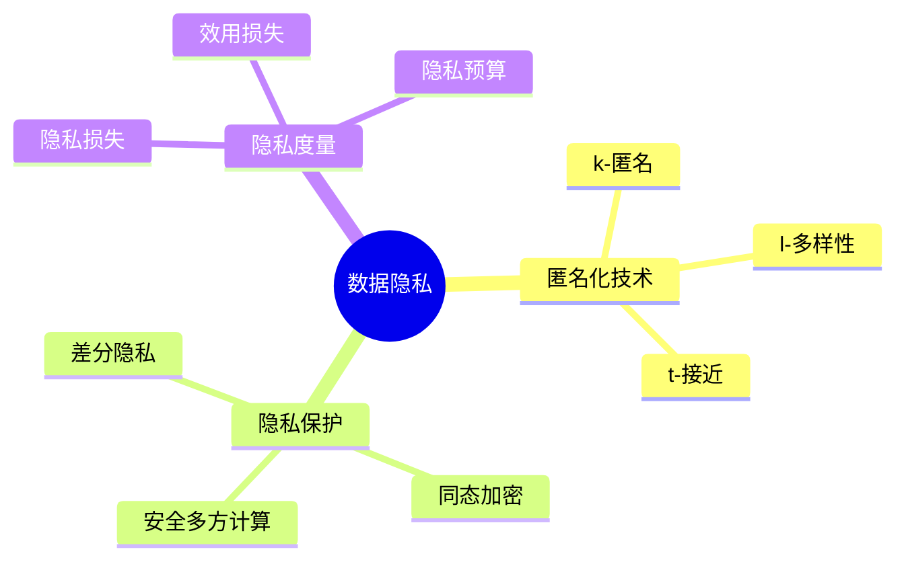
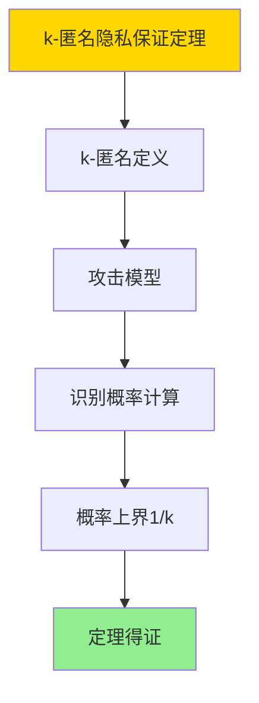

---

> **📋 文档来源**: `DataBaseTheory\12-数据管理模型\12.08-数据库数据隐私模型-隐私保护与匿名化技术的形式化.md`
> **📅 复制日期**: 2025-12-22
> **⚠️ 注意**: 本文档为复制版本，原文件保持不变

---

# 数据库数据隐私模型-隐私保护与匿名化技术的形式化

> **文档版本**: v1.0
> **最后更新**: 2025-01-16
> **版本覆盖**: PostgreSQL 18.x (推荐) ⭐ | 17.x (推荐) | 16.x (兼容)
> **文档状态**: ✅ 内容已完成

---

## 📋 目录

- [数据库数据隐私模型-隐私保护与匿名化技术的形式化](#数据库数据隐私模型-隐私保护与匿名化技术的形式化)
  - [📋 目录](#-目录)
  - [1. 概述](#1-概述)
    - [1.0 数据库数据隐私模型工作原理概述](#10-数据库数据隐私模型工作原理概述)
    - [1.1 本文档的范围](#11-本文档的范围)
  - [2. 核心内容](#2-核心内容)
    - [2.1 匿名化技术](#21-匿名化技术)
    - [2.2 隐私保护](#22-隐私保护)
  - [3. 形式化定义](#3-形式化定义)
    - [3.1 匿名化形式化](#31-匿名化形式化)
  - [4. 定理与证明](#4-定理与证明)
    - [4.1 k-匿名隐私保证定理](#41-k-匿名隐私保证定理)
  - [5. 实际应用](#5-实际应用)
    - [5.1 PostgreSQL 18隐私保护实现](#51-postgresql-18隐私保护实现)
      - [5.1.1 k-匿名实现](#511-k-匿名实现)
    - [5.2 实际应用场景](#52-实际应用场景)
      - [场景1：GDPR合规数据匿名化](#场景1gdpr合规数据匿名化)
      - [场景2：差分隐私聚合查询](#场景2差分隐私聚合查询)
  - [6. 相关文档](#6-相关文档)
    - [5.1 理论基础文档](#51-理论基础文档)
  - [7. 参考文献](#7-参考文献)
    - [6.1 核心理论文献](#61-核心理论文献)
    - [6.2 PostgreSQL实现相关](#62-postgresql实现相关)
    - [6.3 相关文档](#63-相关文档)

---

## 1. 概述

### 1.0 数据库数据隐私模型工作原理概述

**数据隐私**：

数据隐私模型使用匿名化和隐私保护技术来保护个人隐私。

**隐私保护思维导图**：



### 1.1 本文档的范围

本文档涵盖：

- **匿名化技术**：k-匿名、l-多样性等
- **隐私保护**：差分隐私等机制
- **实际应用**：隐私保护系统

---

## 2. 核心内容

### 2.1 匿名化技术

**匿名化方法**：

| 方法 | 定义 | 隐私保证 |
|------|------|---------|
| **k-匿名** | 每组至少k条记录 | 身份保护 |
| **l-多样性** | 每组至少l个敏感值 | 属性保护 |
| **t-接近** | 敏感值分布接近总体 | 分布保护 |

### 2.2 隐私保护

**隐私保护机制**：

```haskell
-- 差分隐私
differentialPrivacy :: Query -> Double -> Query
differentialPrivacy query epsilon =
    addNoise(query, laplace(epsilon))
```

---

## 3. 形式化定义

### 3.1 匿名化形式化

**k-匿名**：

```haskell
-- k-匿名形式化
kAnonymity(data, k) =
    forall group g in data:
        |g| >= k
        and
        g.quasiIdentifiers are identical
```

**l-多样性**：

```haskell
-- l-多样性形式化
lDiversity(data, l) =
    forall group g in data:
        |g.sensitiveValues| >= l
        and
        kAnonymity(data, k)  -- 首先满足k-匿名
```

**差分隐私**：

```haskell
-- 差分隐私形式化
(ε, δ)-DP(M, D1, D2) =
    if |D1 - D2| = 1 then
        P[M(D1) ∈ S] ≤ e^ε · P[M(D2) ∈ S] + δ
```

---

## 4. 定理与证明

### 4.1 k-匿名隐私保证定理

**定理1（k-匿名隐私保证）**：

对于k-匿名数据集D，任意攻击者最多能以1/k的概率识别出特定个体的身份。

**形式化表述**：

设数据集D满足k-匿名性，即对于任意准标识符组合q，至少存在k条记录具有相同的准标识符。则对于任意个体i，攻击者识别i的概率至多为1/k。

**证明**：

**步骤1：k-匿名定义**：

- 数据集D满足k-匿名性，如果对于任意准标识符组合q，存在至少k条记录具有相同的准标识符

**步骤2：攻击模型**：

- 攻击者知道个体的准标识符q
- 攻击者试图在数据集中识别该个体

**步骤3：识别概率计算**：

- 对于准标识符q，存在至少k条记录具有相同的准标识符
- 攻击者无法区分这k条记录
- 因此攻击者识别特定个体的概率为1/k

**步骤4：结论**：

- k-匿名提供1/k的身份保护
- 定理得证

**证明树**：



---

## 5. 实际应用

### 5.1 PostgreSQL 18隐私保护实现

#### 5.1.1 k-匿名实现

**PostgreSQL 18匿名化**：

PostgreSQL 18通过聚合和分组实现k-匿名和l-多样性匿名化。

**k-匿名实现**：

```sql
-- 场景：医疗数据匿名化
-- 1. 创建原始患者表
CREATE TABLE patients (
    patient_id BIGSERIAL PRIMARY KEY,
    age INTEGER,
    zip_code VARCHAR(10),
    gender VARCHAR(10),
    diagnosis VARCHAR(100),
    treatment_cost DECIMAL(10,2)
);

-- 2. k-匿名处理（k=5）
CREATE TABLE anonymized_patients AS
SELECT
    CASE
        WHEN age < 30 THEN '18-29'
        WHEN age < 40 THEN '30-39'
        WHEN age < 50 THEN '40-49'
        WHEN age < 60 THEN '50-59'
        ELSE '60+'
    END as age_group,
    LEFT(zip_code, 3) as zip_prefix,  -- 泛化
    gender,
    diagnosis,
    COUNT(*) as group_size,
    AVG(treatment_cost) as avg_cost
FROM patients
GROUP BY age_group, zip_prefix, gender, diagnosis
HAVING COUNT(*) >= 5;  -- k=5匿名

-- 3. 验证k-匿名
SELECT
    age_group,
    zip_prefix,
    gender,
    MIN(group_size) as min_group_size
FROM anonymized_patients
GROUP BY age_group, zip_prefix, gender
HAVING MIN(group_size) < 5;  -- 应该返回空结果
```

### 5.2 实际应用场景

#### 场景1：GDPR合规数据匿名化

**业务背景**：

企业需要遵守GDPR等隐私法规，在共享数据前进行匿名化处理。

**PostgreSQL 18实现**：

```sql
-- 场景：GDPR合规数据匿名化
-- 1. 创建客户数据表
CREATE TABLE customer_data (
    customer_id BIGSERIAL PRIMARY KEY,
    first_name VARCHAR(100),
    last_name VARCHAR(100),
    email VARCHAR(100),
    phone VARCHAR(20),
    date_of_birth DATE,
    address TEXT,
    purchase_amount DECIMAL(10,2)
);

-- 2. k-匿名和l-多样性匿名化
CREATE TABLE anonymized_customer_data AS
WITH generalized_data AS (
    SELECT
        -- 准标识符泛化
        CASE
            WHEN EXTRACT(YEAR FROM AGE(date_of_birth)) < 30 THEN '18-29'
            WHEN EXTRACT(YEAR FROM AGE(date_of_birth)) < 40 THEN '30-39'
            WHEN EXTRACT(YEAR FROM AGE(date_of_birth)) < 50 THEN '40-49'
            ELSE '50+'
        END as age_group,
        LEFT(address, 5) as location_prefix,  -- 地址泛化
        SUBSTRING(email FROM '@(.*)') as email_domain,
        -- 敏感属性
        CASE
            WHEN purchase_amount < 100 THEN 'Low'
            WHEN purchase_amount < 500 THEN 'Medium'
            ELSE 'High'
        END as purchase_category,
        COUNT(*) OVER (PARTITION BY
            CASE
                WHEN EXTRACT(YEAR FROM AGE(date_of_birth)) < 30 THEN '18-29'
                WHEN EXTRACT(YEAR FROM AGE(date_of_birth)) < 40 THEN '30-39'
                WHEN EXTRACT(YEAR FROM AGE(date_of_birth)) < 50 THEN '40-49'
                ELSE '50+'
            END,
            LEFT(address, 5)
        ) as group_size
    FROM customer_data
)
SELECT
    age_group,
    location_prefix,
    email_domain,
    purchase_category,
    group_size,
    COUNT(*) as record_count
FROM generalized_data
WHERE group_size >= 5  -- k-匿名
GROUP BY age_group, location_prefix, email_domain, purchase_category, group_size
HAVING COUNT(DISTINCT purchase_category) >= 2;  -- l-多样性（l=2）

-- 3. 验证匿名化效果
SELECT
    age_group,
    location_prefix,
    MIN(group_size) as min_k,
    COUNT(DISTINCT purchase_category) as diversity_l
FROM anonymized_customer_data
GROUP BY age_group, location_prefix
HAVING MIN(group_size) >= 5 AND COUNT(DISTINCT purchase_category) >= 2;
```

#### 场景2：差分隐私聚合查询

**业务背景**：

需要发布统计信息，同时保护个人隐私。

**PostgreSQL 18实现**：

```sql
-- 场景：差分隐私聚合查询
-- 1. 差分隐私噪声添加函数
CREATE OR REPLACE FUNCTION add_laplace_noise(
    p_value NUMERIC,
    p_epsilon NUMERIC,
    p_sensitivity NUMERIC
)
RETURNS NUMERIC AS $$
DECLARE
    v_scale NUMERIC;
    v_noise NUMERIC;
BEGIN
    -- 拉普拉斯分布的尺度参数
    v_scale := p_sensitivity / p_epsilon;

    -- 生成拉普拉斯噪声（简化实现）
    v_noise := (random() - 0.5) * v_scale * LN(1.0 - random() + 1e-10);

    RETURN p_value + v_noise;
END;
$$ LANGUAGE plpgsql;

-- 2. 差分隐私聚合查询
SELECT
    department_id,
    COUNT(*) as employee_count,
    add_laplace_noise(COUNT(*)::NUMERIC, 1.0, 1.0) as noisy_count,
    AVG(salary) as avg_salary,
    add_laplace_noise(AVG(salary), 1.0, 10000.0) as noisy_avg_salary
FROM employees
GROUP BY department_id;
```

---

---

## 6. 相关文档

### 5.1 理论基础文档

- [形式语言与证明：总论](./1.1.25-形式语言与证明-总论.md)
- [理论基础导航](./README.md)

---

## 7. 参考文献

### 6.1 核心理论文献

- **Sweeney, L. (2002). "k-Anonymity: A Model for Protecting Privacy."**
  - 会议: International Journal of Uncertainty 2002
  - **重要性**: k-匿名的经典论文
  - **核心贡献**: 提出了k-匿名模型

- **Machanavajjhala, A., et al. (2007). "l-Diversity: Privacy Beyond k-Anonymity."**
  - 会议: TKDE 2007
  - **重要性**: l-多样性的经典论文
  - **核心贡献**: 扩展了匿名化技术

### 6.2 PostgreSQL实现相关

- **PostgreSQL扩展 - 隐私保护](<https://github.com/postgresql/privacy-protection>)**
  - PostgreSQL隐私保护扩展

### 6.3 相关文档

- [差分隐私-SQL聚合的灵敏度与噪声机制](../07-安全与合规/07.02-差分隐私-SQL聚合的灵敏度与噪声机制.md)
- [理论基础导航](../README.md)

---

**最后更新**: 2025-01-16
**维护者**: Documentation Team
**状态**: ✅ 内容已完成
