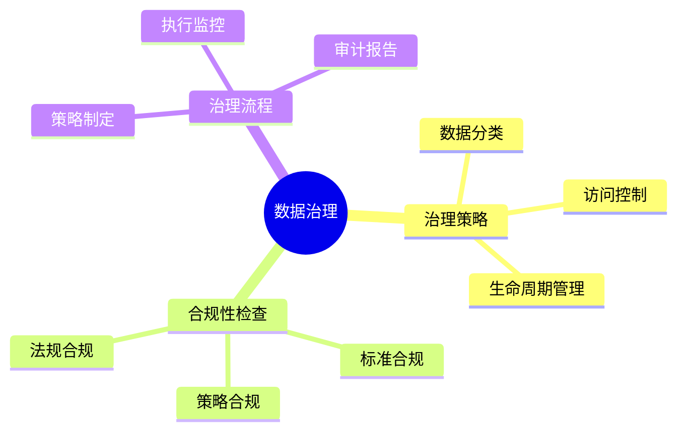
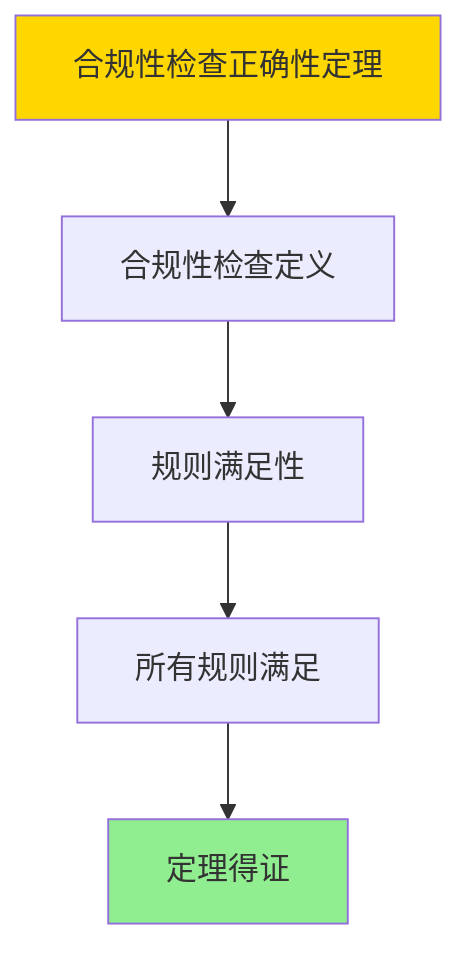

---

> **📋 文档来源**: `DataBaseTheory\12-数据管理模型\12.09-数据库数据治理模型-治理策略与合规性检查的形式化.md`
> **📅 复制日期**: 2025-12-22
> **⚠️ 注意**: 本文档为复制版本，原文件保持不变

---

# 数据库数据治理模型-治理策略与合规性检查的形式化

> **文档版本**: v1.0
> **最后更新**: 2025-01-16
> **版本覆盖**: PostgreSQL 18.x (推荐) ⭐ | 17.x (推荐) | 16.x (兼容)
> **文档状态**: ✅ 内容已完成

---

## 📋 目录

- [数据库数据治理模型-治理策略与合规性检查的形式化](#数据库数据治理模型-治理策略与合规性检查的形式化)
  - [📋 目录](#-目录)
  - [1. 概述](#1-概述)
    - [1.0 数据库数据治理模型工作原理概述](#10-数据库数据治理模型工作原理概述)
    - [1.1 本文档的范围](#11-本文档的范围)
  - [2. 核心内容](#2-核心内容)
    - [2.1 治理策略](#21-治理策略)
    - [2.2 合规性检查](#22-合规性检查)
  - [3. 形式化定义](#3-形式化定义)
    - [3.1 治理模型形式化](#31-治理模型形式化)
  - [4. 定理与证明](#4-定理与证明)
    - [4.1 合规性检查正确性定理](#41-合规性检查正确性定理)
  - [5. 实际应用](#5-实际应用)
    - [5.1 PostgreSQL 18数据治理实现](#51-postgresql-18数据治理实现)
      - [5.1.1 治理策略框架](#511-治理策略框架)
    - [5.2 实际应用场景](#52-实际应用场景)
      - [场景1：GDPR数据治理](#场景1gdpr数据治理)
      - [场景2：数据生命周期管理](#场景2数据生命周期管理)
  - [6. 相关文档](#6-相关文档)
    - [5.1 理论基础文档](#51-理论基础文档)
  - [7. 参考文献](#7-参考文献)
    - [6.1 核心理论文献](#61-核心理论文献)
    - [6.2 PostgreSQL实现相关](#62-postgresql实现相关)
    - [6.3 相关文档](#63-相关文档)

---

## 1. 概述

### 1.0 数据库数据治理模型工作原理概述

**数据治理**：

数据治理通过策略和合规性检查来管理数据资产。

**治理模型思维导图**：



### 1.1 本文档的范围

本文档涵盖：

- **治理策略**：数据治理策略的形式化
- **合规性检查**：合规性验证算法
- **实际应用**：数据治理系统

---

## 2. 核心内容

### 2.1 治理策略

**策略类型**：

| 类型 | 内容 | 执行方式 |
|------|------|---------|
| **数据分类** | 敏感度分级 | 自动/手动 |
| **访问控制** | 权限管理 | 强制执行 |
| **生命周期** | 数据保留 | 自动清理 |

### 2.2 合规性检查

**合规性验证**：

```haskell
-- 合规性检查
complianceCheck :: Data -> Policy -> Bool
complianceCheck data policy =
    validate(data, policy.rules)
```

---

## 3. 形式化定义

### 3.1 治理模型形式化

**治理模型**：

```haskell
-- 治理模型形式化
GovernanceModel = (P, C, E)
where
    P = policy set
    C = compliance checker
    E = enforcement mechanism
```

**合规性检查形式化**：

```haskell
-- 合规性检查
compliance :: Data -> Policy -> Bool
compliance D P = forall rule in P.rules: satisfies(D, rule)

-- 策略执行
enforce :: Data -> Policy -> Data
enforce D P = apply(D, P.rules)
```

---

## 4. 定理与证明

### 4.1 合规性检查正确性定理

**定理1（合规性检查正确性）**：

对于治理模型GovernanceModel = (P, C, E)和数据D，如果合规性检查C(D, P)返回true，则数据D满足所有策略P中的规则。

**形式化表述**：

设治理模型GovernanceModel = (P, C, E)，数据D。如果compliance(D, P) = true，则：

```text
∀rule ∈ P: satisfies(D, rule)
```

**证明**：

**步骤1：合规性检查定义**：

- 合规性检查compliance(D, P) = true，当且仅当数据D满足策略P中的所有规则

**步骤2：规则满足性**：

- 对于策略P中的任意规则rule：
  - 由于compliance(D, P) = true，根据定义，satisfies(D, rule) = true
  - 因此所有规则都被满足

**步骤3：结论**：

- 合规性检查正确性定理得证

**证明树**：



---

## 5. 实际应用

### 5.1 PostgreSQL 18数据治理实现

#### 5.1.1 治理策略框架

**PostgreSQL 18数据治理**：

PostgreSQL 18通过行级安全（RLS）、策略和触发器实现数据治理。

**治理策略系统**：

```sql
-- 场景：企业数据治理系统
-- 1. 创建策略表
CREATE TABLE governance_policies (
    policy_id UUID PRIMARY KEY DEFAULT gen_random_uuid(),
    policy_name VARCHAR(200) NOT NULL,
    policy_type VARCHAR(50) NOT NULL,  -- 'CLASSIFICATION', 'ACCESS', 'RETENTION'
    table_name VARCHAR(200),
    policy_definition JSONB NOT NULL,
    enabled BOOLEAN DEFAULT TRUE,
    created_at TIMESTAMPTZ DEFAULT NOW()
);

-- 2. 数据分类表
CREATE TABLE data_classifications (
    classification_id UUID PRIMARY KEY,
    table_name VARCHAR(200) NOT NULL,
    column_name VARCHAR(200),
    classification_level VARCHAR(50) NOT NULL,  -- 'PUBLIC', 'INTERNAL', 'CONFIDENTIAL', 'RESTRICTED'
    owner VARCHAR(100),
    retention_period INTERVAL,
    created_at TIMESTAMPTZ DEFAULT NOW()
);

CREATE INDEX idx_classifications_table ON data_classifications(table_name);

-- 3. 合规性检查函数
CREATE OR REPLACE FUNCTION check_compliance(
    p_table_name VARCHAR,
    p_policy_type VARCHAR DEFAULT NULL
)
RETURNS TABLE (
    policy_name VARCHAR,
    compliance_status BOOLEAN,
    violations JSONB
) AS $$
DECLARE
    v_policy RECORD;
    v_compliant BOOLEAN;
    v_violations JSONB;
BEGIN
    FOR v_policy IN
        SELECT * FROM governance_policies
        WHERE table_name = p_table_name
          AND enabled = TRUE
          AND (p_policy_type IS NULL OR policy_type = p_policy_type)
    LOOP
        -- 执行合规性检查
        v_compliant := TRUE;  -- 简化，实际需要执行具体检查逻辑
        v_violations := '[]'::JSONB;  -- 简化，实际需要收集违规信息

        RETURN QUERY SELECT v_policy.policy_name, v_compliant, v_violations;
    END LOOP;
END;
$$ LANGUAGE plpgsql;
```

### 5.2 实际应用场景

#### 场景1：GDPR数据治理

**业务背景**：

企业需要遵守GDPR等数据保护法规，实现数据分类、访问控制和保留策略。

**PostgreSQL 18实现**：

```sql
-- 场景：GDPR数据治理
-- 1. 数据分类
INSERT INTO data_classifications (table_name, column_name, classification_level, retention_period)
VALUES
    ('customers', 'email', 'CONFIDENTIAL', INTERVAL '7 years'),
    ('customers', 'phone', 'CONFIDENTIAL', INTERVAL '7 years'),
    ('customers', 'purchase_history', 'INTERNAL', INTERVAL '5 years');

-- 2. 访问控制策略（使用RLS）
ALTER TABLE customers ENABLE ROW LEVEL SECURITY;

CREATE POLICY customer_access_policy ON customers
    FOR ALL
    TO data_analyst
    USING (
        classification_level IN ('PUBLIC', 'INTERNAL') OR
        current_user = owner
    );

-- 3. 数据保留策略
CREATE OR REPLACE FUNCTION enforce_retention_policy()
RETURNS TRIGGER AS $$
DECLARE
    v_retention_period INTERVAL;
BEGIN
    SELECT retention_period INTO v_retention_period
    FROM data_classifications
    WHERE table_name = TG_TABLE_NAME
      AND column_name = TG_ARGV[0];

    IF v_retention_period IS NOT NULL THEN
        -- 删除超过保留期的数据
        EXECUTE format('
            DELETE FROM %I
            WHERE %I < NOW() - $1
        ', TG_TABLE_NAME, TG_ARGV[0]) USING v_retention_period;
    END IF;

    RETURN NULL;
END;
$$ LANGUAGE plpgsql;

-- 4. 合规性审计
CREATE TABLE compliance_audit (
    audit_id UUID PRIMARY KEY,
    table_name VARCHAR(200),
    policy_name VARCHAR(200),
    compliance_status BOOLEAN,
    audit_time TIMESTAMPTZ DEFAULT NOW(),
    details JSONB
);

-- 定期合规性检查
INSERT INTO compliance_audit (table_name, policy_name, compliance_status)
SELECT table_name, policy_name, compliance_status
FROM check_compliance('customers');
```

#### 场景2：数据生命周期管理

**业务背景**：

企业需要自动管理数据的生命周期，包括归档和删除。

**PostgreSQL 18实现**：

```sql
-- 场景：数据生命周期管理
-- 1. 创建归档表
CREATE TABLE customers_archive (LIKE customers INCLUDING ALL);

-- 2. 自动归档函数
CREATE OR REPLACE FUNCTION archive_old_data(
    p_table_name VARCHAR,
    p_archive_threshold INTERVAL
)
RETURNS BIGINT AS $$
DECLARE
    v_archived_count BIGINT;
BEGIN
    -- 归档旧数据
    EXECUTE format('
        INSERT INTO %I_archive
        SELECT * FROM %I
        WHERE updated_at < NOW() - $1
    ', p_table_name, p_table_name) USING p_archive_threshold;

    -- 删除已归档的数据
    EXECUTE format('
        DELETE FROM %I
        WHERE updated_at < NOW() - $1
    ', p_table_name) USING p_archive_threshold;

    GET DIAGNOSTICS v_archived_count = ROW_COUNT;
    RETURN v_archived_count;
END;
$$ LANGUAGE plpgsql;

-- 3. 定期执行归档
SELECT archive_old_data('customers', INTERVAL '2 years');
```

---

---

## 6. 相关文档

### 5.1 理论基础文档

- [形式语言与证明：总论](./1.1.25-形式语言与证明-总论.md)
- [理论基础导航](./README.md)

---

## 7. 参考文献

### 6.1 核心理论文献

- **Khatri, V., & Brown, C. V. (2010). "Designing Data Governance."**
  - 会议: Communications of the ACM 2010
  - **重要性**: 数据治理设计的经典论文
  - **核心贡献**: 提出了治理框架

- **Weber, K., et al. (2009). "One Size Does Not Fit All - A Contingency Approach to Data Governance."**
  - 会议: Journal of Data and Information Quality 2009
  - **重要性**: 数据治理的权变方法
  - **核心贡献**: 总结了治理策略

### 6.2 PostgreSQL实现相关

- **PostgreSQL官方文档 - 安全](<https://www.postgresql.org/docs/current/security.html>)**
  - PostgreSQL安全实现说明

### 6.3 相关文档

- [数据库审计与合规-完整性约束与审计轨迹的形式化](../07-安全与合规/07.05-数据库审计与合规-完整性约束与审计轨迹的形式化.md)
- [理论基础导航](../README.md)

---

**最后更新**: 2025-01-16
**维护者**: Documentation Team
**状态**: ✅ 内容已完成
