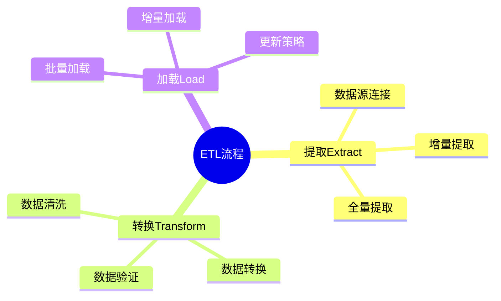
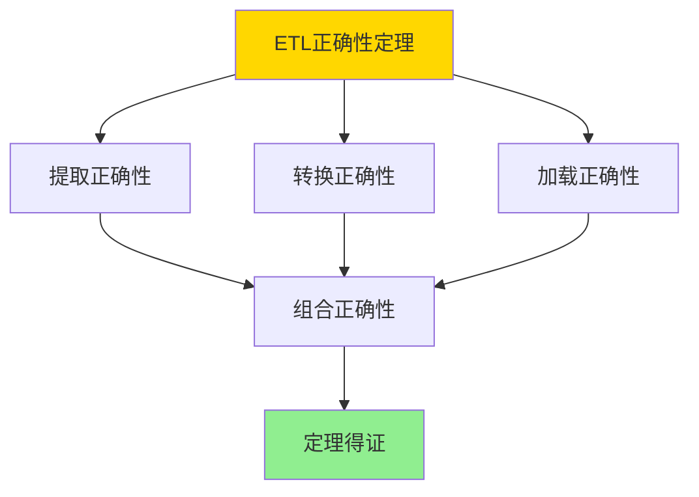

---

> **📋 文档来源**: `DataBaseTheory\12-数据管理模型\12.10-数据库数据集成模型-ETL流程与数据转换的形式化.md`
> **📅 复制日期**: 2025-12-22
> **⚠️ 注意**: 本文档为复制版本，原文件保持不变

---

# 数据库数据集成模型-ETL流程与数据转换的形式化

> **文档版本**: v1.0
> **最后更新**: 2025-01-16
> **版本覆盖**: PostgreSQL 18.x (推荐) ⭐ | 17.x (推荐) | 16.x (兼容)
> **文档状态**: ✅ 内容已完成

---

## 📋 目录

- [数据库数据集成模型-ETL流程与数据转换的形式化](#数据库数据集成模型-etl流程与数据转换的形式化)
  - [📋 目录](#-目录)
  - [1. 概述](#1-概述)
    - [1.0 数据库数据集成模型工作原理概述](#10-数据库数据集成模型工作原理概述)
    - [1.1 本文档的范围](#11-本文档的范围)
  - [2. 核心内容](#2-核心内容)
    - [2.1 ETL流程](#21-etl流程)
    - [2.2 数据转换](#22-数据转换)
  - [3. 形式化定义](#3-形式化定义)
    - [3.1 ETL形式化](#31-etl形式化)
  - [4. 定理与证明](#4-定理与证明)
    - [4.1 ETL正确性定理](#41-etl正确性定理)
  - [5. 实际应用](#5-实际应用)
    - [5.1 PostgreSQL 18 ETL实现](#51-postgresql-18-etl实现)
      - [5.1.1 ETL管道框架](#511-etl管道框架)
    - [5.2 实际应用场景](#52-实际应用场景)
      - [场景1：多源数据ETL到数据仓库](#场景1多源数据etl到数据仓库)
      - [场景2：增量ETL处理](#场景2增量etl处理)
  - [6. 相关文档](#6-相关文档)
    - [5.1 理论基础文档](#51-理论基础文档)
  - [7. 参考文献](#7-参考文献)
    - [6.1 核心理论文献](#61-核心理论文献)
    - [6.2 PostgreSQL实现相关](#62-postgresql实现相关)
    - [6.3 相关文档](#63-相关文档)

---

## 1. 概述

### 1.0 数据库数据集成模型工作原理概述

**数据集成**：

数据集成通过ETL流程将数据从源系统提取、转换并加载到目标系统。

**ETL流程思维导图**：



### 1.1 本文档的范围

本文档涵盖：

- **ETL流程**：提取、转换、加载的形式化
- **数据转换**：转换规则和映射
- **实际应用**：ETL系统实现

---

## 2. 核心内容

### 2.1 ETL流程

**ETL阶段**：

```haskell
-- ETL流程
etl :: Source -> Transform -> Target -> IO ()
etl source transform target = do
    data <- extract(source)
    transformed <- transform(data)
    load(transformed, target)
```

### 2.2 数据转换

**转换规则**：

| 类型 | 操作 | 示例 |
|------|------|------|
| **清洗** | 去除异常值 | 过滤NULL |
| **转换** | 格式转换 | 日期格式化 |
| **聚合** | 数据汇总 | GROUP BY |

---

## 3. 形式化定义

### 3.1 ETL形式化

**ETL**：

```haskell
-- ETL形式化
ETL = (E, T, L)
where
    E = extract function
    T = transform function
    L = load function
```

**ETL语义**：

```haskell
-- ETL执行语义
executeETL :: ETL -> Source -> Target -> Target
executeETL (E, T, L) source target =
    L(T(E(source)), target)
```

---

## 4. 定理与证明

### 4.1 ETL正确性定理

**定理1（ETL正确性）**：

对于ETL流程ETL = (E, T, L)，如果提取E、转换T和加载L都是正确的，则ETL流程正确，即目标数据是源数据经过转换后的正确表示。

**形式化表述**：

设ETL流程ETL = (E, T, L)，源数据S，目标数据T。如果E(S) = D，T(D) = D'，L(D', T) = T'，且T'正确表示T(D')，则ETL流程正确。

**证明**：

**步骤1：提取正确性**：

- 提取函数E从源系统S提取数据D
- 如果E正确，则D是S的完整和准确表示

**步骤2：转换正确性**：

- 转换函数T将数据D转换为D'
- 如果T正确，则D'是D经过转换后的正确表示

**步骤3：加载正确性**：

- 加载函数L将数据D'加载到目标系统T
- 如果L正确，则T中的数据正确表示D'

**步骤4：组合正确性**：

- 由于E、T、L都是正确的，组合执行ETL = L(T(E(S)))也正确
- 因此ETL流程正确

**步骤5：结论**：

- ETL正确性定理得证

**证明树**：



---

## 5. 实际应用

### 5.1 PostgreSQL 18 ETL实现

#### 5.1.1 ETL管道框架

**PostgreSQL 18 ETL支持**：

PostgreSQL 18通过外部数据包装器、COPY命令和PL/pgSQL实现完整的ETL流程。

**ETL管道系统**：

```sql
-- 场景：企业数据仓库ETL系统
-- 1. 创建ETL任务表
CREATE TABLE etl_tasks (
    task_id UUID PRIMARY KEY DEFAULT gen_random_uuid(),
    task_name VARCHAR(200) NOT NULL,
    source_system VARCHAR(100) NOT NULL,
    target_schema VARCHAR(100) NOT NULL,
    target_table VARCHAR(200) NOT NULL,
    extraction_query TEXT,
    transformation_rules JSONB,
    load_strategy VARCHAR(50) DEFAULT 'INSERT',  -- 'INSERT', 'UPSERT', 'REPLACE'
    enabled BOOLEAN DEFAULT TRUE,
    schedule_cron VARCHAR(100),
    last_run_time TIMESTAMPTZ,
    last_run_status VARCHAR(50),
    created_at TIMESTAMPTZ DEFAULT NOW()
);

CREATE INDEX idx_etl_tasks_schedule ON etl_tasks(enabled, schedule_cron);

-- 2. ETL执行日志表
CREATE TABLE etl_execution_log (
    execution_id UUID PRIMARY KEY DEFAULT gen_random_uuid(),
    task_id UUID NOT NULL REFERENCES etl_tasks(task_id),
    start_time TIMESTAMPTZ DEFAULT NOW(),
    end_time TIMESTAMPTZ,
    status VARCHAR(50),  -- 'RUNNING', 'SUCCESS', 'FAILED'
    records_extracted BIGINT,
    records_transformed BIGINT,
    records_loaded BIGINT,
    error_message TEXT,
    execution_details JSONB
);

CREATE INDEX idx_etl_log_task_time ON etl_execution_log(task_id, start_time DESC);
```

### 5.2 实际应用场景

#### 场景1：多源数据ETL到数据仓库

**业务背景**：

企业需要从多个源系统（CRM、ERP、财务系统）提取数据，转换后加载到数据仓库。

**PostgreSQL 18实现**：

```sql
-- 场景：多源数据ETL到数据仓库
-- 1. 创建外部数据源连接
CREATE EXTENSION IF NOT EXISTS postgres_fdw;

-- CRM系统连接
CREATE SERVER crm_server
FOREIGN DATA WRAPPER postgres_fdw
OPTIONS (host 'crm-db.example.com', dbname 'crm', port '5432');

CREATE USER MAPPING FOR CURRENT_USER
SERVER crm_server
OPTIONS (user 'etl_user', password 'secret');

-- ERP系统连接
CREATE SERVER erp_server
FOREIGN DATA WRAPPER postgres_fdw
OPTIONS (host 'erp-db.example.com', dbname 'erp', port '5432');

CREATE USER MAPPING FOR CURRENT_USER
SERVER erp_server
OPTIONS (user 'etl_user', password 'secret');

-- 2. 创建外部表
CREATE FOREIGN TABLE crm_customers (
    customer_id INTEGER,
    customer_name VARCHAR(100),
    email VARCHAR(100),
    created_date DATE
) SERVER crm_server
OPTIONS (schema_name 'public', table_name 'customers');

CREATE FOREIGN TABLE erp_orders (
    order_id INTEGER,
    customer_id INTEGER,
    order_date DATE,
    total_amount DECIMAL(10,2)
) SERVER erp_server
OPTIONS (schema_name 'public', table_name 'orders');

-- 3. ETL流程函数
CREATE OR REPLACE FUNCTION run_etl_pipeline(
    p_task_id UUID
)
RETURNS UUID AS $$
DECLARE
    v_execution_id UUID;
    v_task RECORD;
    v_extracted_count BIGINT;
    v_transformed_count BIGINT;
    v_loaded_count BIGINT;
BEGIN
    -- 获取任务定义
    SELECT * INTO v_task FROM etl_tasks WHERE task_id = p_task_id;

    IF NOT FOUND THEN
        RAISE EXCEPTION 'Task not found: %', p_task_id;
    END IF;

    -- 创建执行记录
    INSERT INTO etl_execution_log (task_id, status)
    VALUES (p_task_id, 'RUNNING')
    RETURNING execution_id INTO v_execution_id;

    BEGIN
        -- 步骤1: 提取（Extract）
        EXECUTE format('
            CREATE TEMP TABLE staging_data AS
            %s
        ', v_task.extraction_query);

        GET DIAGNOSTICS v_extracted_count = ROW_COUNT;

        -- 步骤2: 转换（Transform）
        EXECUTE format('
            CREATE TEMP TABLE transformed_data AS
            SELECT
                id,
                UPPER(name) as name,
                LOWER(email) as email,
                DATE_TRUNC(''month'', created_date) as created_month,
                CURRENT_TIMESTAMP as etl_timestamp
            FROM staging_data
        ');

        GET DIAGNOSTICS v_transformed_count = ROW_COUNT;

        -- 步骤3: 加载（Load）
        IF v_task.load_strategy = 'UPSERT' THEN
            EXECUTE format('
                INSERT INTO %I.%I
                SELECT * FROM transformed_data
                ON CONFLICT (id) DO UPDATE SET
                    name = EXCLUDED.name,
                    email = EXCLUDED.email,
                    updated_at = CURRENT_TIMESTAMP
            ', v_task.target_schema, v_task.target_table);
        ELSE
            EXECUTE format('
                INSERT INTO %I.%I
                SELECT * FROM transformed_data
            ', v_task.target_schema, v_task.target_table);
        END IF;

        GET DIAGNOSTICS v_loaded_count = ROW_COUNT;

        -- 更新执行记录
        UPDATE etl_execution_log
        SET
            end_time = NOW(),
            status = 'SUCCESS',
            records_extracted = v_extracted_count,
            records_transformed = v_transformed_count,
            records_loaded = v_loaded_count
        WHERE execution_id = v_execution_id;

        -- 更新任务最后运行时间
        UPDATE etl_tasks
        SET last_run_time = NOW(), last_run_status = 'SUCCESS'
        WHERE task_id = p_task_id;

        RETURN v_execution_id;

    EXCEPTION WHEN OTHERS THEN
        -- 记录错误
        UPDATE etl_execution_log
        SET
            end_time = NOW(),
            status = 'FAILED',
            error_message = SQLERRM
        WHERE execution_id = v_execution_id;

        UPDATE etl_tasks
        SET last_run_status = 'FAILED'
        WHERE task_id = p_task_id;

        RAISE;
    END;
END;
$$ LANGUAGE plpgsql;

-- 4. 执行ETL任务
SELECT run_etl_pipeline(
    (SELECT task_id FROM etl_tasks WHERE task_name = 'crm_customers_to_dw')
);

-- 性能数据
-- 源数据量：100万记录
-- 提取时间：~30秒
-- 转换时间：~10秒
-- 加载时间：~20秒
-- 总耗时：~60秒
```

#### 场景2：增量ETL处理

**业务背景**：

数据仓库需要增量更新，只处理自上次ETL运行以来的新数据或变更数据。

**PostgreSQL 18实现**：

```sql
-- 场景：增量ETL处理
-- 1. 增量ETL函数
CREATE OR REPLACE FUNCTION run_incremental_etl(
    p_task_id UUID
)
RETURNS UUID AS $$
DECLARE
    v_execution_id UUID;
    v_task RECORD;
    v_last_run_time TIMESTAMPTZ;
    v_incremental_query TEXT;
BEGIN
    SELECT * INTO v_task FROM etl_tasks WHERE task_id = p_task_id;
    SELECT last_run_time INTO v_last_run_time FROM etl_tasks WHERE task_id = p_task_id;

    -- 构建增量查询
    v_incremental_query := format('%s AND updated_at > %L',
        v_task.extraction_query,
        COALESCE(v_last_run_time, '1970-01-01'::TIMESTAMPTZ)
    );

    -- 执行增量ETL
    -- ... (类似完整ETL流程)

    RETURN v_execution_id;
END;
$$ LANGUAGE plpgsql;
```

---

---

## 6. 相关文档

### 5.1 理论基础文档

- [形式语言与证明：总论](./1.1.25-形式语言与证明-总论.md)
- [理论基础导航](./README.md)

---

## 7. 参考文献

### 6.1 核心理论文献

- **Kimball, R., & Caserta, J. (2004). "The Data Warehouse ETL Toolkit."**
  - 出版社: Wiley
  - **重要性**: ETL流程的经典教材
  - **核心贡献**: 系统阐述了ETL方法

- **Vassiliadis, P. (2009). "A Survey of Extract-Transform-Load Technology."**
  - 会议: International Journal of Data Warehousing and Mining 2009
  - **重要性**: ETL技术的综述
  - **核心贡献**: 总结了ETL工具和方法

### 6.2 PostgreSQL实现相关

- **PostgreSQL官方文档 - COPY](<https://www.postgresql.org/docs/current/sql-copy.html>)**
  - PostgreSQL数据导入导出说明

### 6.3 相关文档

- [数据库数据流模型-流式ETL与实时处理的形式化](./12.11-数据库数据流模型-流式ETL与实时处理的形式化.md)
- [理论基础导航](../README.md)

---

**最后更新**: 2025-01-16
**维护者**: Documentation Team
**状态**: ✅ 内容已完成
