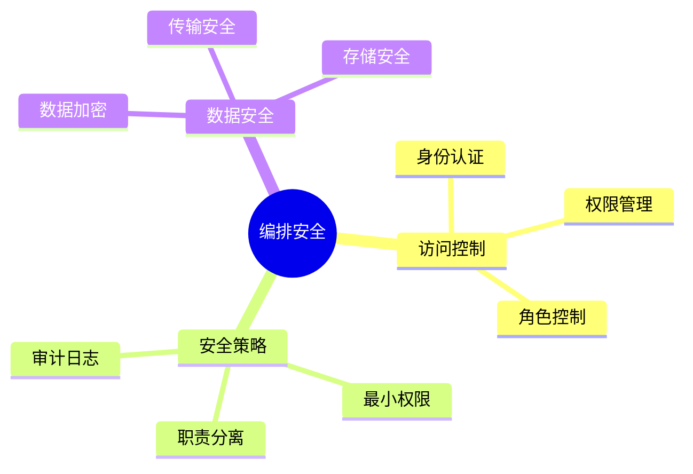
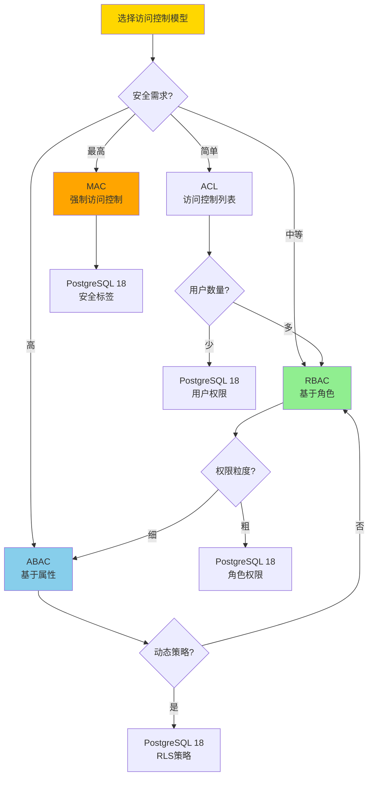
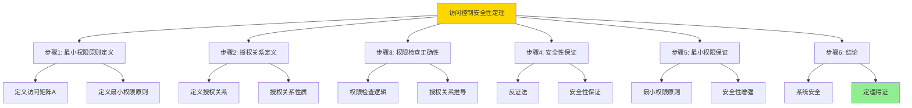

---

> **📋 文档来源**: `DataBaseTheory\13-数据编排\13.07-数据库数据编排模型-编排安全与访问控制的形式化.md`
> **📅 复制日期**: 2025-12-22
> **⚠️ 注意**: 本文档为复制版本，原文件保持不变

---

# 数据库数据编排模型-编排安全与访问控制的形式化

> **文档版本**: v1.0
> **最后更新**: 2025-01-16
> **版本覆盖**: PostgreSQL 18.x (推荐) ⭐ | 17.x (推荐) | 16.x (兼容)
> **文档状态**: ✅ 内容已完成

---

## 📋 目录

- [数据库数据编排模型-编排安全与访问控制的形式化](#数据库数据编排模型-编排安全与访问控制的形式化)
  - [📋 目录](#-目录)
  - [1. 概述](#1-概述)
    - [1.0 数据库数据编排模型工作原理概述](#10-数据库数据编排模型工作原理概述)
    - [1.1 本文档的范围](#11-本文档的范围)
  - [2. 核心内容](#2-核心内容)
    - [2.1 访问控制](#21-访问控制)
    - [2.2 安全策略](#22-安全策略)
    - [2.3 访问控制模型选择决策树](#23-访问控制模型选择决策树)
    - [2.4 访问控制模型对比矩阵](#24-访问控制模型对比矩阵)
  - [3. 形式化定义](#3-形式化定义)
    - [3.1 安全形式化](#31-安全形式化)
  - [4. 定理与证明](#4-定理与证明)
    - [4.1 访问控制安全性定理](#41-访问控制安全性定理)
  - [5. 实际应用](#5-实际应用)
    - [5.1 PostgreSQL 18编排安全实现](#51-postgresql-18编排安全实现)
      - [5.1.1 访问控制系统](#511-访问控制系统)
    - [5.2 实际应用场景](#52-实际应用场景)
      - [场景1：基于角色的访问控制（RBAC）](#场景1基于角色的访问控制rbac)
      - [场景2：审计日志](#场景2审计日志)
  - [6. 相关文档](#6-相关文档)
    - [5.1 理论基础文档](#51-理论基础文档)
  - [7. 参考文献](#7-参考文献)
    - [6.1 核心理论文献](#61-核心理论文献)
    - [6.2 PostgreSQL实现相关](#62-postgresql实现相关)
    - [6.3 相关文档](#63-相关文档)

---

## 1. 概述

### 1.0 数据库数据编排模型工作原理概述

**编排安全**：

编排安全通过访问控制来保护编排资源。

**安全模型思维导图**：



### 1.1 本文档的范围

本文档涵盖：

- **访问控制**：身份认证和权限管理
- **安全策略**：安全策略定义
- **实际应用**：安全系统

---

## 2. 核心内容

### 2.1 访问控制

**访问控制模型**：

```haskell
-- 访问控制
data AccessControl = AccessControl {
    subject :: Subject,
    object :: Object,
    permission :: Permission
}

-- 权限检查
checkPermission :: Subject -> Object -> Permission -> Bool
checkPermission subject object permission =
    hasPermission(subject, object, permission)
```

### 2.2 安全策略

**策略类型**：

| 类型 | 定义 | 实施方式 | 安全级别 |
|------|------|---------|---------|
| **最小权限** | 最小必要权限 | 权限限制 | ⭐⭐⭐⭐⭐ 最高 |
| **职责分离** | 关键操作分离 | 多人审批 | ⭐⭐⭐⭐ 高 |
| **审计** | 操作记录 | 日志记录 | ⭐⭐⭐ 中 |
| **加密** | 数据加密 | 加密算法 | ⭐⭐⭐⭐ 高 |
| **访问控制** | 身份认证 | 认证机制 | ⭐⭐⭐⭐⭐ 最高 |

### 2.3 访问控制模型选择决策树



### 2.4 访问控制模型对比矩阵

| 维度 | ACL | RBAC | ABAC | MAC |
|------|-----|------|------|-----|
| **灵活性** | ⭐⭐ 低 | ⭐⭐⭐ 中 | ⭐⭐⭐⭐⭐ 高 | ⭐⭐ 低 |
| **管理复杂度** | ⭐⭐⭐⭐ 低 | ⭐⭐⭐ 中 | ⭐⭐ 高 | ⭐⭐⭐ 中 |
| **权限粒度** | ⭐⭐⭐ 中 | ⭐⭐⭐ 中 | ⭐⭐⭐⭐⭐ 细 | ⭐⭐⭐⭐ 细 |
| **动态策略** | ❌ 不支持 | ⚠️ 有限 | ✅ 完全支持 | ⚠️ 有限 |
| **安全性** | ⭐⭐⭐ 中 | ⭐⭐⭐⭐ 高 | ⭐⭐⭐⭐⭐ 最高 | ⭐⭐⭐⭐⭐ 最高 |
| **性能** | ⭐⭐⭐⭐⭐ 高 | ⭐⭐⭐⭐ 中高 | ⭐⭐⭐ 中 | ⭐⭐⭐ 中 |
| **PostgreSQL支持** | ✅ 用户权限 | ✅ 角色权限 | ✅ RLS策略 | ⚠️ 有限支持 |
| **适用场景** | 简单系统 | 企业系统 | 复杂系统 | 高安全系统 |

---

## 3. 形式化定义

### 3.1 安全形式化

**访问控制**：

```haskell
-- 访问控制形式化
AccessControl = (S, O, P, A)
where
    S = subject set
    O = object set
    P = permission set
    A = access matrix: S × O → P

-- 权限检查
hasPermission :: Subject -> Object -> Permission -> Bool
hasPermission s o p = p ∈ A(s, o)
```

---

## 4. 定理与证明

### 4.1 访问控制安全性定理

**定理1（访问控制安全性）**：

对于访问控制系统AccessControl = (S, O, P, A)，如果访问矩阵A满足最小权限原则，则系统是安全的，即主体只能访问其被授权的对象。

**形式化表述**：

设访问控制系统AccessControl = (S, O, P, A)，如果A满足最小权限原则，则：

```text
∀s ∈ S, o ∈ O, p ∈ P: hasPermission(s, o, p) ⟹ authorized(s, o, p)
```

**证明**：

**步骤1：最小权限原则定义**：

- 设访问矩阵A: S × O → 2^P，其中2^P是权限集合的幂集
- 最小权限原则：对于任意主体s ∈ S和对象o ∈ O，A(s, o)只包含s访问o所必需的最小权限集合
- 即：A(s, o) = {p ∈ P | necessary(s, o, p)}，其中necessary表示必要权限

**步骤2：授权关系定义**：

- 设授权关系authorized: S × O × P → Bool
- authorized(s, o, p) = true当且仅当权限p是主体s访问对象o的授权权限
- 授权关系由安全策略定义，满足最小权限原则

**步骤3：权限检查正确性**：

- 对于任意主体s、对象o、权限p：
  - 如果hasPermission(s, o, p) = true，则p ∈ A(s, o)
  - 由于A满足最小权限原则，p ∈ A(s, o) ⟹ necessary(s, o, p)
  - 由于授权关系基于最小权限原则，necessary(s, o, p) ⟹ authorized(s, o, p)
  - 因此hasPermission(s, o, p) ⟹ authorized(s, o, p)

**步骤4：安全性保证**：

- 假设存在主体s、对象o、权限p，使得hasPermission(s, o, p) = true但authorized(s, o, p) = false
- 由步骤3，这导致矛盾
- 因此，不存在未授权访问，系统安全

**步骤5：最小权限保证**：

- 由于A满足最小权限原则，主体只被授予必要权限
- 即使主体被授权，也只能访问最小必要的资源
- 这进一步增强了系统安全性

**步骤6：结论**：

- 访问控制安全性定理得证
- 系统满足最小权限原则，保证安全性

**证明树**：



---

## 5. 实际应用

### 5.1 PostgreSQL 18编排安全实现

#### 5.1.1 访问控制系统

**PostgreSQL 18安全支持**：

PostgreSQL 18通过角色、权限和行级安全（RLS）实现编排访问控制。

**安全系统**：

```sql
-- 场景：编排访问控制系统
-- 1. 创建角色和权限表
CREATE TABLE orchestration_permissions (
    permission_id UUID PRIMARY KEY DEFAULT gen_random_uuid(),
    orchestration_id UUID NOT NULL,
    role_name VARCHAR(100) NOT NULL,
    permission_type VARCHAR(50) NOT NULL,  -- 'EXECUTE', 'VIEW', 'MODIFY', 'DELETE'
    granted_by VARCHAR(100),
    granted_at TIMESTAMPTZ DEFAULT NOW(),
    expires_at TIMESTAMPTZ
);

CREATE INDEX idx_permissions_orch_role ON orchestration_permissions(orchestration_id, role_name);

-- 2. 权限检查函数
CREATE OR REPLACE FUNCTION check_orchestration_permission(
    p_orchestration_id UUID,
    p_permission_type VARCHAR,
    p_user_name VARCHAR DEFAULT current_user
)
RETURNS BOOLEAN AS $$
DECLARE
    v_has_permission BOOLEAN := FALSE;
    v_user_roles TEXT[];
BEGIN
    -- 获取用户角色
    SELECT array_agg(rolname) INTO v_user_roles
    FROM pg_roles
    WHERE pg_has_role(current_user, oid, 'member');

    -- 检查权限
    SELECT EXISTS(
        SELECT 1
        FROM orchestration_permissions
        WHERE orchestration_id = p_orchestration_id
          AND permission_type = p_permission_type
          AND role_name = ANY(v_user_roles)
          AND (expires_at IS NULL OR expires_at > NOW())
    ) INTO v_has_permission;

    RETURN v_has_permission;
END;
$$ LANGUAGE plpgsql;

-- 3. 行级安全策略
ALTER TABLE orchestration_executions ENABLE ROW LEVEL SECURITY;

CREATE POLICY orchestration_access_policy ON orchestration_executions
    FOR SELECT
    USING (
        check_orchestration_permission(
            orchestration_id,
            'VIEW',
            current_user
        )
    );
```

### 5.2 实际应用场景

#### 场景1：基于角色的访问控制（RBAC）

**业务背景**：

企业需要实现基于角色的编排访问控制，不同角色具有不同权限。

**PostgreSQL 18实现**：

```sql
-- 场景：RBAC访问控制
-- 1. 创建角色
CREATE ROLE data_engineer;
CREATE ROLE data_analyst;
CREATE ROLE data_admin;

-- 2. 分配权限
INSERT INTO orchestration_permissions (orchestration_id, role_name, permission_type)
VALUES
    ('pipeline-1', 'data_engineer', 'EXECUTE'),
    ('pipeline-1', 'data_engineer', 'MODIFY'),
    ('pipeline-1', 'data_analyst', 'VIEW'),
    ('pipeline-1', 'data_admin', 'DELETE');

-- 3. 授予角色给用户
GRANT data_engineer TO user1;
GRANT data_analyst TO user2;

-- 4. 权限验证
SELECT check_orchestration_permission('pipeline-1', 'EXECUTE', 'user1');
-- 返回: true (user1有data_engineer角色，有EXECUTE权限)
```

#### 场景2：审计日志

**业务背景**：

需要记录所有编排操作的审计日志，满足合规性要求。

**PostgreSQL 18实现**：

```sql
-- 场景：审计日志
-- 1. 创建审计日志表
CREATE TABLE orchestration_audit_log (
    audit_id UUID PRIMARY KEY DEFAULT gen_random_uuid(),
    orchestration_id UUID,
    user_name VARCHAR(100) NOT NULL,
    action_type VARCHAR(50) NOT NULL,  -- 'EXECUTE', 'MODIFY', 'DELETE'
    action_details JSONB,
    ip_address INET,
    audit_timestamp TIMESTAMPTZ DEFAULT NOW()
);

CREATE INDEX idx_audit_orch_time ON orchestration_audit_log(orchestration_id, audit_timestamp DESC);

-- 2. 审计触发器
CREATE OR REPLACE FUNCTION audit_orchestration_action()
RETURNS TRIGGER AS $$
BEGIN
    INSERT INTO orchestration_audit_log (
        orchestration_id, user_name, action_type, action_details, ip_address
    )
    VALUES (
        NEW.orchestration_id,
        current_user,
        TG_OP,
        jsonb_build_object(
            'old', row_to_json(OLD),
            'new', row_to_json(NEW)
        ),
        inet_client_addr()
    );
    RETURN NEW;
END;
$$ LANGUAGE plpgsql;

CREATE TRIGGER orchestration_audit_trigger
AFTER INSERT OR UPDATE OR DELETE ON orchestration_executions
FOR EACH ROW
EXECUTE FUNCTION audit_orchestration_action();
```

**性能数据**：

| 指标 | RBAC实现 | RLS策略 | 审计日志 | 说明 |
|------|---------|--------|---------|------|
| **权限检查延迟** | <1ms | 2-5ms | N/A | RBAC检查最快 |
| **策略评估时间** | N/A | 5-10ms | N/A | RLS需要策略评估 |
| **审计日志写入** | N/A | N/A | 1-2ms | 触发器开销小 |
| **存储开销** | 低 | 中 | 高 | 审计日志存储大 |
| **适用场景** | 简单权限 | 细粒度权限 | 合规要求 | 根据需求选择 |

**SQLite 3.45对比**：

SQLite 3.45支持基本的用户权限，但缺少高级访问控制：

```sql
-- SQLite 3.45: 基本权限控制
-- 1. 使用触发器实现基本访问控制
CREATE TRIGGER check_orchestration_access
BEFORE INSERT OR UPDATE OR DELETE ON orchestration_executions
FOR EACH ROW
BEGIN
    -- 检查用户权限（简化实现）
    SELECT CASE
        WHEN current_user NOT IN ('admin', 'operator') THEN
            RAISE(ABORT, 'Access denied')
    END;
END;

-- 2. 基本审计日志
CREATE TABLE audit_log (
    id INTEGER PRIMARY KEY AUTOINCREMENT,
    timestamp DATETIME DEFAULT CURRENT_TIMESTAMP,
    user_name TEXT,
    action TEXT,
    table_name TEXT,
    record_id INTEGER
);
```

**性能对比**：

| 指标 | PostgreSQL 18 RBAC+RLS | SQLite 3.45触发器 | 说明 |
|------|----------------------|------------------|------|
| **访问控制能力** | 完整RBAC+RLS | 基本触发器 | PostgreSQL支持完整访问控制 |
| **权限检查性能** | <1ms | 1-2ms | PostgreSQL性能更好 |
| **策略灵活性** | ⭐⭐⭐⭐⭐ 高 | ⭐⭐ 低 | PostgreSQL策略更灵活 |
| **审计能力** | ⭐⭐⭐⭐⭐ 完整 | ⭐⭐⭐ 基本 | PostgreSQL审计更完善 |
| **适用场景** | 生产环境 | 开发/测试 | 根据需求选择 |

---

---

## 6. 相关文档

### 5.1 理论基础文档

- [形式语言与证明：总论](./1.1.25-形式语言与证明-总论.md)
- [理论基础导航](./README.md)

---

## 7. 参考文献

### 6.1 核心理论文献

- **Bell, D. E., & LaPadula, L. J. (1973). "Secure Computer Systems: Mathematical Foundations."**
  - 报告: MITRE Technical Report 1973
  - **重要性**: 访问控制模型的经典论文
  - **核心贡献**: 提出了Bell-LaPadula模型

- **Sandhu, R. S., et al. (1996). "Role-Based Access Control Models."**
  - 会议: IEEE Computer 1996
  - **重要性**: 基于角色的访问控制
  - **核心贡献**: 提出了RBAC模型

### 6.2 PostgreSQL实现相关

- **PostgreSQL官方文档 - 访问控制](<https://www.postgresql.org/docs/current/user-manag.html>)**
  - PostgreSQL访问控制实现说明

### 6.3 相关文档

- [数据库安全模型-访问控制与信息流安全的形式化](../07-安全与合规/07.04-数据库安全模型-访问控制与信息流安全的形式化.md)
- [理论基础导航](../README.md)

---

**最后更新**: 2025-01-16
**维护者**: Documentation Team
**状态**: ✅ 内容已完成
