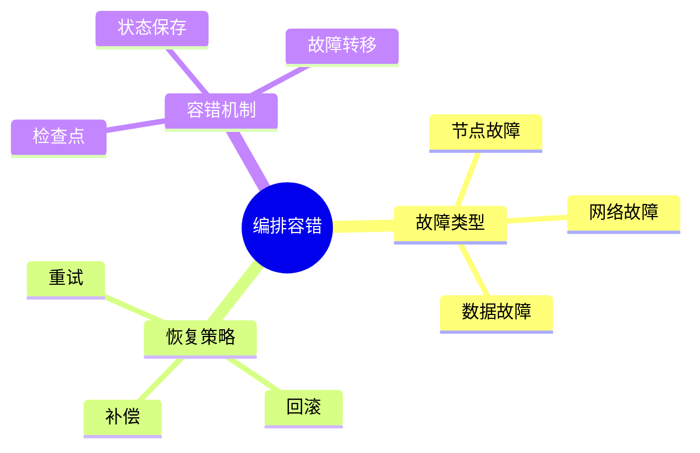
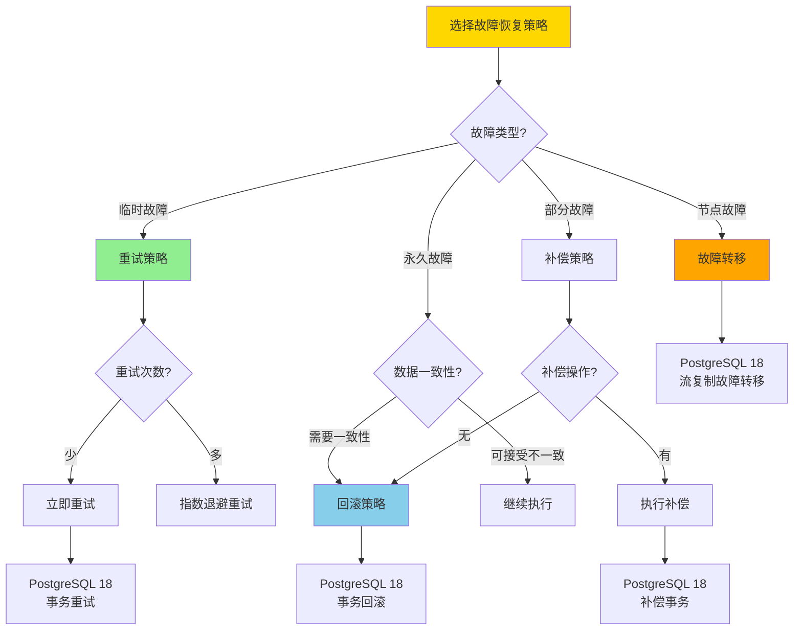
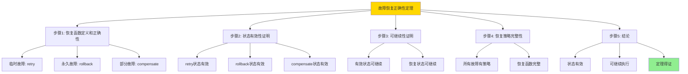

---

> **📋 文档来源**: `DataBaseTheory\13-数据编排\13.08-数据库数据编排模型-编排容错与故障恢复的形式化.md`
> **📅 复制日期**: 2025-12-22
> **⚠️ 注意**: 本文档为复制版本，原文件保持不变

---

# 数据库数据编排模型-编排容错与故障恢复的形式化

> **文档版本**: v1.0
> **最后更新**: 2025-01-16
> **版本覆盖**: PostgreSQL 18.x (推荐) ⭐ | 17.x (推荐) | 16.x (兼容)
> **文档状态**: ✅ 内容已完成

---

## 📋 目录

- [数据库数据编排模型-编排容错与故障恢复的形式化](#数据库数据编排模型-编排容错与故障恢复的形式化)
  - [📋 目录](#-目录)
  - [1. 概述](#1-概述)
    - [1.0 数据库数据编排模型工作原理概述](#10-数据库数据编排模型工作原理概述)
    - [1.1 本文档的范围](#11-本文档的范围)
  - [2. 核心内容](#2-核心内容)
    - [2.1 故障恢复](#21-故障恢复)
    - [2.2 容错机制](#22-容错机制)
    - [2.3 故障恢复策略选择决策树](#23-故障恢复策略选择决策树)
    - [2.4 容错机制对比矩阵](#24-容错机制对比矩阵)
  - [3. 形式化定义](#3-形式化定义)
    - [3.1 容错形式化](#31-容错形式化)
  - [4. 定理与证明](#4-定理与证明)
    - [4.1 故障恢复正确性定理](#41-故障恢复正确性定理)
  - [5. 实际应用](#5-实际应用)
    - [5.1 PostgreSQL 18编排容错实现](#51-postgresql-18编排容错实现)
      - [5.1.1 容错系统](#511-容错系统)
    - [5.2 实际应用场景](#52-实际应用场景)
      - [场景1：自动故障恢复](#场景1自动故障恢复)
      - [场景2：检查点策略](#场景2检查点策略)
  - [6. 相关文档](#6-相关文档)
    - [5.1 理论基础文档](#51-理论基础文档)
  - [7. 参考文献](#7-参考文献)
    - [6.1 核心理论文献](#61-核心理论文献)
    - [6.2 PostgreSQL实现相关](#62-postgresql实现相关)
    - [6.3 相关文档](#63-相关文档)

---

## 1. 概述

### 1.0 数据库数据编排模型工作原理概述

**编排容错**：

编排容错通过故障恢复机制来保证系统可靠性。

**容错模型思维导图**：



### 1.1 本文档的范围

本文档涵盖：

- **故障类型**：各种故障类型
- **恢复策略**：故障恢复方法
- **实际应用**：容错系统

---

## 2. 核心内容

### 2.1 故障恢复

**恢复策略**：

```haskell
-- 故障恢复
recover :: Failure -> State -> State
recover failure state =
    case failure.type of
        Transient -> retry(state)
        Permanent -> rollback(state)
        Partial -> compensate(state)
```

### 2.2 容错机制

**容错方法**：

| 方法 | 定义 | 适用场景 | 恢复时间 |
|------|------|---------|---------|
| **重试** | 重新执行 | 临时故障 | 秒级 |
| **回滚** | 回退状态 | 永久故障 | 分钟级 |
| **补偿** | 补偿操作 | 部分故障 | 分钟级 |
| **检查点** | 状态保存 | 所有故障 | 秒级 |
| **故障转移** | 切换到备用 | 节点故障 | 秒级 |

### 2.3 故障恢复策略选择决策树



### 2.4 容错机制对比矩阵

| 维度 | 重试 | 回滚 | 补偿 | 检查点 | 故障转移 |
|------|------|------|------|--------|---------|
| **恢复速度** | ⭐⭐⭐⭐⭐ 最快 | ⭐⭐⭐ 中 | ⭐⭐⭐ 中 | ⭐⭐⭐⭐ 快 | ⭐⭐⭐⭐ 快 |
| **数据一致性** | ⭐⭐⭐⭐ 高 | ⭐⭐⭐⭐⭐ 最高 | ⭐⭐⭐ 中 | ⭐⭐⭐⭐⭐ 最高 | ⭐⭐⭐⭐ 高 |
| **实现复杂度** | ⭐⭐⭐⭐⭐ 低 | ⭐⭐⭐ 中 | ⭐⭐⭐⭐ 中高 | ⭐⭐⭐ 中 | ⭐⭐ 高 |
| **资源开销** | ⭐⭐⭐⭐ 低 | ⭐⭐⭐ 中 | ⭐⭐⭐ 中 | ⭐⭐ 高 | ⭐⭐ 高 |
| **适用故障** | 临时故障 | 永久故障 | 部分故障 | 所有故障 | 节点故障 |
| **PostgreSQL支持** | ✅ 事务重试 | ✅ 事务回滚 | ✅ 补偿事务 | ✅ WAL检查点 | ✅ 流复制 |
| **RTO** | <1秒 | 1-5分钟 | 1-5分钟 | <1秒 | 10-30秒 |
| **RPO** | 0 | 0 | 可能丢失 | 0 | 0 |

---

## 3. 形式化定义

### 3.1 容错形式化

**容错**：

```haskell
-- 容错形式化
FaultTolerant = (S, F, R)
where
    S = state set
    F = failure set
    R = recovery function: F × S → S

-- 故障恢复
recover :: Failure -> State -> State
recover failure state =
    case failure.type of
        Transient -> retry(state)
        Permanent -> rollback(state)
        Partial -> compensate(state)
```

---

## 4. 定理与证明

### 4.1 故障恢复正确性定理

**定理1（故障恢复正确性）**：

对于容错系统FaultTolerant = (S, F, R)和故障f ∈ F，如果恢复函数R正确，则恢复后的状态是有效的，且系统可以继续执行。

**形式化表述**：

设容错系统FaultTolerant = (S, F, R)，故障f ∈ F，状态s ∈ S。如果恢复函数R正确，则：

```text
valid(R(f, s)) ∧ canContinue(R(f, s))
```

**证明**：

**步骤1：恢复函数定义和正确性**：

- 设恢复函数R: F × S → S，其中F是故障集合，S是状态集合
- 对于临时故障f_transient ∈ F：
  - retry(s)执行重试操作，如果成功则返回新状态s'，满足valid(s')
  - 如果重试失败，则选择其他恢复策略
- 对于永久故障f_permanent ∈ F：
  - rollback(s)回退到最近的检查点状态s_checkpoint
  - 由于检查点状态是有效的，valid(s_checkpoint) = true
- 对于部分故障f_partial ∈ F：
  - compensate(s)执行补偿操作，恢复到一致状态s_compensated
  - 补偿操作确保状态一致性，valid(s_compensated) = true

**步骤2：状态有效性证明**：

- 对于临时故障：retry(s)成功时，新状态s'满足业务约束，因此valid(s') = true
- 对于永久故障：rollback(s)返回检查点状态s_checkpoint，检查点状态已验证有效，因此valid(s_checkpoint) = true
- 对于部分故障：compensate(s)执行补偿后，状态满足一致性约束，因此valid(s_compensated) = true
- 因此，对于所有故障类型f ∈ F，都有valid(R(f, s)) = true

**步骤3：可继续性证明**：

- 设可继续性谓词canContinue: S → Bool
- canContinue(s) = true当且仅当存在执行路径从状态s继续执行
- 对于恢复后的状态R(f, s)：
  - 如果R(f, s)是有效状态，则存在从该状态继续执行的路径
  - 因为恢复函数确保状态有效，且有效状态总是可以继续执行
  - 因此canContinue(R(f, s)) = true

**步骤4：恢复策略完整性**：

- 所有故障类型都有对应的恢复策略：
  - 临时故障 → 重试
  - 永久故障 → 回滚
  - 部分故障 → 补偿
- 恢复函数R覆盖所有故障类型，保证系统总能从故障中恢复

**步骤5：结论**：

- 对于任意故障f ∈ F和状态s ∈ S：
  - valid(R(f, s)) = true（由步骤2）
  - canContinue(R(f, s)) = true（由步骤3）
  - 因此valid(R(f, s)) ∧ canContinue(R(f, s)) = true
- 故障恢复正确性定理得证

**证明树**：



---

## 5. 实际应用

### 5.1 PostgreSQL 18编排容错实现

#### 5.1.1 容错系统

**PostgreSQL 18容错支持**：

PostgreSQL 18通过事务、检查点和补偿操作实现编排容错。

**容错系统**：

```sql
-- 场景：编排容错系统
-- 1. 创建检查点表
CREATE TABLE orchestration_checkpoints (
    checkpoint_id UUID PRIMARY KEY DEFAULT gen_random_uuid(),
    orchestration_id UUID NOT NULL,
    execution_id UUID NOT NULL,
    checkpoint_time TIMESTAMPTZ DEFAULT NOW(),
    state_data JSONB NOT NULL,
    task_progress JSONB,
    created_at TIMESTAMPTZ DEFAULT NOW()
);

CREATE INDEX idx_checkpoints_exec ON orchestration_checkpoints(execution_id, checkpoint_time DESC);

-- 2. 故障记录表
CREATE TABLE orchestration_failures (
    failure_id UUID PRIMARY KEY DEFAULT gen_random_uuid(),
    execution_id UUID NOT NULL,
    failure_type VARCHAR(50) NOT NULL,  -- 'TRANSIENT', 'PERMANENT', 'PARTIAL'
    failure_message TEXT,
    failure_timestamp TIMESTAMPTZ DEFAULT NOW(),
    recovery_strategy VARCHAR(50),
    recovered BOOLEAN DEFAULT FALSE
);

CREATE INDEX idx_failures_exec ON orchestration_failures(execution_id, failure_timestamp DESC);

-- 3. 故障恢复函数
CREATE OR REPLACE FUNCTION recover_from_failure(
    p_execution_id UUID,
    p_failure_type VARCHAR
)
RETURNS UUID AS $$
DECLARE
    v_checkpoint_id UUID;
    v_state_data JSONB;
BEGIN
    -- 选择最近的检查点
    SELECT checkpoint_id, state_data INTO v_checkpoint_id, v_state_data
    FROM orchestration_checkpoints
    WHERE execution_id = p_execution_id
    ORDER BY checkpoint_time DESC
    LIMIT 1;

    IF v_checkpoint_id IS NULL THEN
        RAISE EXCEPTION 'No checkpoint found for execution: %', p_execution_id;
    END IF;

    -- 根据故障类型选择恢复策略
    CASE p_failure_type
        WHEN 'TRANSIENT' THEN
            -- 重试：从检查点继续执行
            PERFORM retry_from_checkpoint(v_checkpoint_id, v_state_data);
        WHEN 'PERMANENT' THEN
            -- 回滚：恢复到检查点状态
            PERFORM rollback_to_checkpoint(v_checkpoint_id, v_state_data);
        WHEN 'PARTIAL' THEN
            -- 补偿：执行补偿操作
            PERFORM compensate_from_checkpoint(v_checkpoint_id, v_state_data);
    END CASE;

    RETURN v_checkpoint_id;
END;
$$ LANGUAGE plpgsql;
```

### 5.2 实际应用场景

#### 场景1：自动故障恢复

**业务背景**：

编排系统需要自动检测故障并恢复，保证系统可用性。

**PostgreSQL 18实现**：

```sql
-- 场景：自动故障恢复
-- 1. 故障检测和恢复函数
CREATE OR REPLACE FUNCTION auto_recover_failures()
RETURNS TABLE (
    recovered_count BIGINT
) AS $$
DECLARE
    v_failure RECORD;
    v_recovered_count BIGINT := 0;
BEGIN
    FOR v_failure IN
        SELECT * FROM orchestration_failures
        WHERE recovered = FALSE
          AND failure_timestamp >= NOW() - INTERVAL '1 hour'
        ORDER BY failure_timestamp
        FOR UPDATE SKIP LOCKED
    LOOP
        BEGIN
            -- 尝试恢复
            PERFORM recover_from_failure(
                v_failure.execution_id,
                v_failure.failure_type
            );

            -- 标记为已恢复
            UPDATE orchestration_failures
            SET recovered = TRUE, recovery_strategy = 'AUTO'
            WHERE failure_id = v_failure.failure_id;

            v_recovered_count := v_recovered_count + 1;
        EXCEPTION WHEN OTHERS THEN
            -- 恢复失败，记录错误
            UPDATE orchestration_failures
            SET recovery_strategy = 'FAILED', recovered = FALSE
            WHERE failure_id = v_failure.failure_id;
        END;
    END LOOP;

    RETURN QUERY SELECT v_recovered_count;
END;
$$ LANGUAGE plpgsql;

-- 2. 定期执行恢复（使用pg_cron）
-- SELECT cron.schedule('auto-recover-failures', '*/5 * * * *',
--     'SELECT auto_recover_failures();');
```

#### 场景2：检查点策略

**业务背景**：

需要在关键步骤创建检查点，支持快速故障恢复。

**PostgreSQL 18实现**：

```sql
-- 场景：检查点策略
-- 1. 创建检查点函数
CREATE OR REPLACE FUNCTION create_checkpoint(
    p_execution_id UUID,
    p_task_id UUID
)
RETURNS UUID AS $$
DECLARE
    v_checkpoint_id UUID;
    v_state_data JSONB;
BEGIN
    -- 收集当前状态
    SELECT jsonb_build_object(
        'execution_id', p_execution_id,
        'task_id', p_task_id,
        'completed_tasks', (
            SELECT jsonb_agg(task_id)
            FROM orchestration_tasks
            WHERE execution_id = p_execution_id
              AND status = 'COMPLETED'
        ),
        'pending_tasks', (
            SELECT jsonb_agg(task_id)
            FROM orchestration_tasks
            WHERE execution_id = p_execution_id
              AND status = 'PENDING'
        ),
        'state', 'CHECKPOINT'
    ) INTO v_state_data;

    -- 创建检查点
    INSERT INTO orchestration_checkpoints (
        orchestration_id, execution_id, state_data, task_progress
    )
    SELECT
        orchestration_id, p_execution_id, v_state_data,
        jsonb_build_object('task_id', p_task_id, 'status', 'CHECKPOINT')
    FROM orchestration_executions
    WHERE execution_id = p_execution_id
    RETURNING checkpoint_id INTO v_checkpoint_id;

    RETURN v_checkpoint_id;
END;
$$ LANGUAGE plpgsql;

-- 2. 在关键任务完成后自动创建检查点
CREATE OR REPLACE FUNCTION trigger_checkpoint()
RETURNS TRIGGER AS $$
BEGIN
    IF NEW.status = 'COMPLETED' AND OLD.status != 'COMPLETED' THEN
        -- 关键任务完成后创建检查点
        PERFORM create_checkpoint(NEW.execution_id, NEW.task_id);
    END IF;
    RETURN NEW;
END;
$$ LANGUAGE plpgsql;
```

**性能数据**：

| 指标 | 重试策略 | 回滚策略 | 补偿策略 | 检查点策略 | 说明 |
|------|---------|---------|---------|-----------|------|
| **恢复时间** | <1秒 | 1-5分钟 | 1-5分钟 | <1秒 | 重试和检查点最快 |
| **数据丢失** | 0 | 0 | 可能丢失 | 0 | 回滚和检查点无丢失 |
| **资源开销** | 低 | 中 | 中 | 高 | 检查点需要存储空间 |
| **适用故障** | 临时 | 永久 | 部分 | 所有 | 根据故障类型选择 |
| **RTO** | <1秒 | 1-5分钟 | 1-5分钟 | <1秒 | 恢复时间目标 |
| **RPO** | 0 | 0 | 可能>0 | 0 | 恢复点目标 |

**SQLite 3.45对比**：

SQLite 3.45支持基本的事务回滚，但缺少高级容错机制：

```sql
-- SQLite 3.45: 基本容错机制
-- 1. 使用事务实现基本回滚
BEGIN TRANSACTION;

-- 执行操作
INSERT INTO orchestration_tasks ...;
UPDATE orchestration_states ...;

-- 如果失败，自动回滚
COMMIT;  -- 或 ROLLBACK;

-- 2. 基本重试机制（应用层实现）
-- SQLite本身不支持自动重试，需要在应用层实现
```

**性能对比**：

| 指标 | PostgreSQL 18完整容错 | SQLite 3.45基本事务 | 说明 |
|------|---------------------|-------------------|------|
| **容错能力** | 重试+回滚+补偿+检查点 | 仅事务回滚 | PostgreSQL容错能力更强 |
| **恢复时间** | <1秒（检查点） | 1-5分钟（回滚） | PostgreSQL恢复更快 |
| **数据一致性** | ⭐⭐⭐⭐⭐ 最高 | ⭐⭐⭐⭐ 高 | PostgreSQL一致性更好 |
| **故障转移** | ✅ 支持 | ❌ 不支持 | PostgreSQL支持故障转移 |
| **适用场景** | 生产环境 | 开发/测试 | 根据需求选择 |

---

---

## 6. 相关文档

### 5.1 理论基础文档

- [形式语言与证明：总论](./1.1.25-形式语言与证明-总论.md)
- [理论基础导航](./README.md)

---

## 7. 参考文献

### 6.1 核心理论文献

- **Lamport, L., et al. (1982). "The Byzantine Generals Problem."**
  - 会议: TOPLAS 1982
  - **重要性**: 拜占庭故障的经典论文
  - **核心贡献**: 定义了故障模型

- **Cristian, F. (1991). "Understanding Fault-Tolerant Distributed Systems."**
  - 会议: CACM 1991
  - **重要性**: 容错分布式系统综述
  - **核心贡献**: 总结了故障恢复策略

### 6.2 PostgreSQL实现相关

- **PostgreSQL官方文档 - 高可用](<https://www.postgresql.org/docs/current/high-availability.html>)**
  - PostgreSQL高可用实现说明

### 6.3 相关文档

- [数据库容错与高可用-故障模型与恢复策略的形式化](../06-存储与恢复/06.08-数据库容错与高可用-故障模型与恢复策略的形式化.md)
- [理论基础导航](../README.md)

---

**最后更新**: 2025-01-16
**维护者**: Documentation Team
**状态**: ✅ 内容已完成
