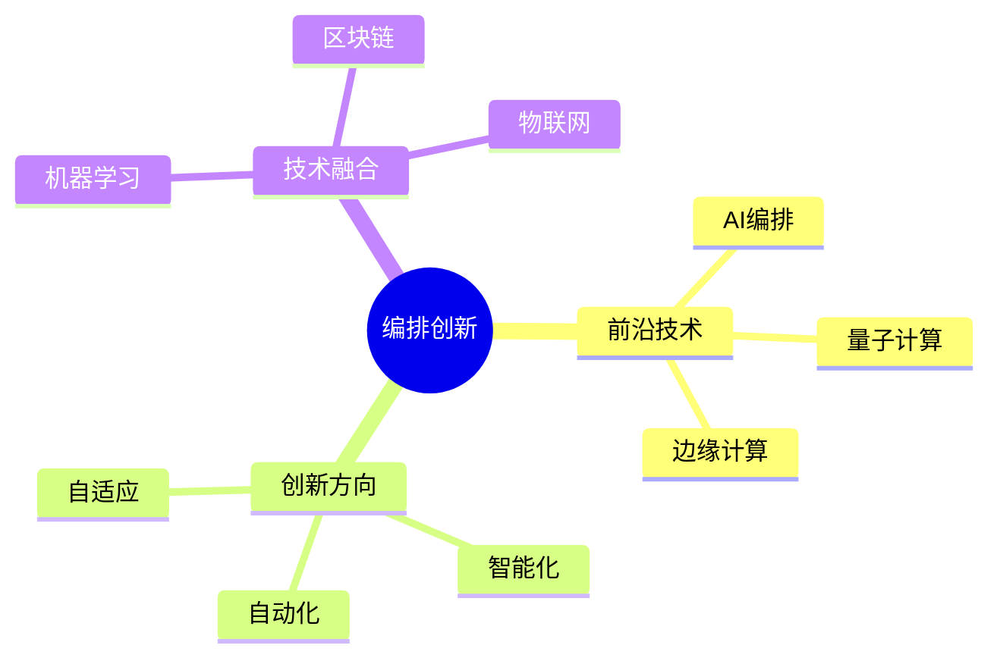
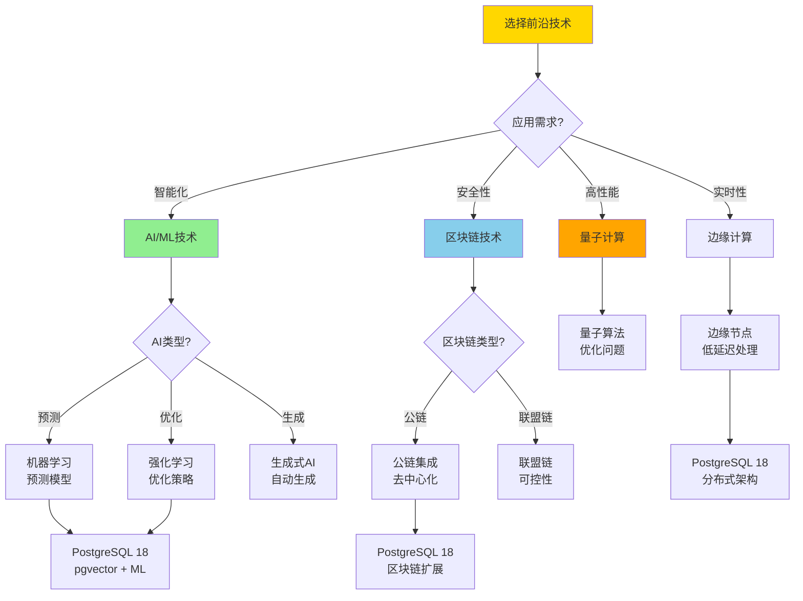
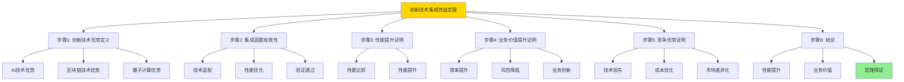
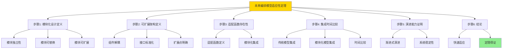

---

> **📋 文档来源**: `DataBaseTheory\13-数据编排\13.12-数据库数据编排模型-编排创新与前沿技术的形式化.md`
> **📅 复制日期**: 2025-12-22
> **⚠️ 注意**: 本文档为复制版本，原文件保持不变

---

# 数据库数据编排模型-编排创新与前沿技术的形式化

> **文档版本**: v1.0
> **最后更新**: 2025-01-16
> **版本覆盖**: PostgreSQL 18.x (推荐) ⭐ | 17.x (推荐) | 16.x (兼容)
> **文档状态**: ✅ 内容已完成

---

## 📋 目录

- [数据库数据编排模型-编排创新与前沿技术的形式化](#数据库数据编排模型-编排创新与前沿技术的形式化)
  - [📋 目录](#-目录)
  - [1. 概述](#1-概述)
    - [1.0 数据库数据编排模型工作原理概述](#10-数据库数据编排模型工作原理概述)
    - [1.1 本文档的范围](#11-本文档的范围)
  - [2. 核心内容](#2-核心内容)
    - [2.1 前沿技术](#21-前沿技术)
    - [2.2 创新方向](#22-创新方向)
    - [2.3 前沿技术选择决策树](#23-前沿技术选择决策树)
    - [2.4 前沿技术对比矩阵](#24-前沿技术对比矩阵)
  - [3. 形式化定义](#3-形式化定义)
    - [3.1 创新形式化](#31-创新形式化)
  - [4. 定理与证明](#4-定理与证明)
    - [4.1 创新技术集成效益定理](#41-创新技术集成效益定理)
    - [4.2 未来编排模型适应性定理](#42-未来编排模型适应性定理)
  - [5. 实际应用](#5-实际应用)
    - [5.1 PostgreSQL 18编排创新应用](#51-postgresql-18编排创新应用)
      - [5.1.1 AI驱动的编排](#511-ai驱动的编排)
    - [5.2 实际应用场景](#52-实际应用场景)
      - [场景1：智能自动化](#场景1智能自动化)
      - [场景2：区块链集成](#场景2区块链集成)
  - [6. 相关文档](#6-相关文档)
    - [5.1 理论基础文档](#51-理论基础文档)
  - [7. 参考文献](#7-参考文献)
    - [6.1 核心理论文献](#61-核心理论文献)
    - [6.2 PostgreSQL实现相关](#62-postgresql实现相关)
    - [6.3 相关文档](#63-相关文档)

---

## 1. 概述

### 1.0 数据库数据编排模型工作原理概述

**编排创新**：

编排创新探索前沿技术来提升编排能力。

**创新技术思维导图**：


```mermaid
mindmap
  root((编排创新))
    前沿技术
      AI编排
      量子计算
      边缘计算
    创新方向
      智能化
      自动化
      自适应
    技术融合
      机器学习
      区块链
      物联网
```

### 1.1 本文档的范围

本文档涵盖：

- **前沿技术**：AI、量子计算等
- **创新方向**：智能化编排
- **实际应用**：创新系统

---

## 2. 核心内容

### 2.1 前沿技术

**技术类型**：

| 技术 | 应用 | 优势 |
|------|------|------|
| **AI编排** | 智能调度 | 自适应 |
| **量子计算** | 优化问题 | 并行性 |
| **边缘计算** | 实时处理 | 低延迟 |

### 2.2 创新方向

**智能化**：

```haskell
-- AI编排
aiOrchestrate :: Workload -> AI -> Orchestration
aiOrchestrate workload ai =
    generateOrchestration(workload, ai.model)
```

### 2.3 前沿技术选择决策树


```mermaid
flowchart TD
    A[选择前沿技术] --> B{应用需求?}
    B -->|智能化| C[AI/ML技术]
    B -->|安全性| D[区块链技术]
    B -->|高性能| E[量子计算]
    B -->|实时性| F[边缘计算]

    C --> G{AI类型?}
    G -->|预测| H[机器学习<br/>预测模型]
    G -->|优化| I[强化学习<br/>优化策略]
    G -->|生成| J[生成式AI<br/>自动生成]

    D --> K{区块链类型?}
    K -->|公链| L[公链集成<br/>去中心化]
    K -->|联盟链| M[联盟链<br/>可控性]

    E --> N[量子算法<br/>优化问题]
    F --> O[边缘节点<br/>低延迟处理]

    H --> P[PostgreSQL 18<br/>pgvector + ML]
    I --> P
    L --> Q[PostgreSQL 18<br/>区块链扩展]
    O --> R[PostgreSQL 18<br/>分布式架构]

    style A fill:#FFD700
    style C fill:#90EE90
    style D fill:#87CEEB
    style E fill:#FFA500
```

### 2.4 前沿技术对比矩阵

| 维度 | AI/ML | 区块链 | 量子计算 | 边缘计算 | 物联网 |
|------|-------|--------|---------|---------|--------|
| **成熟度** | ⭐⭐⭐⭐⭐ 成熟 | ⭐⭐⭐⭐ 较成熟 | ⭐⭐ 早期 | ⭐⭐⭐⭐ 较成熟 | ⭐⭐⭐⭐⭐ 成熟 |
| **应用场景** | 智能调度、预测 | 数据溯源、安全 | 优化问题 | 实时处理 | 设备管理 |
| **性能提升** | ⭐⭐⭐⭐ 中高 | ⭐⭐⭐ 中 | ⭐⭐⭐⭐⭐ 最高 | ⭐⭐⭐⭐ 高 | ⭐⭐⭐ 中 |
| **安全性** | ⭐⭐⭐ 中 | ⭐⭐⭐⭐⭐ 最高 | ⭐⭐⭐⭐ 高 | ⭐⭐⭐ 中 | ⭐⭐⭐ 中 |
| **实现复杂度** | ⭐⭐⭐ 中 | ⭐⭐⭐⭐ 中高 | ⭐⭐⭐⭐⭐ 最高 | ⭐⭐⭐ 中 | ⭐⭐⭐ 中 |
| **成本** | ⭐⭐⭐ 中 | ⭐⭐⭐⭐ 中高 | ⭐⭐⭐⭐⭐ 最高 | ⭐⭐⭐ 中 | ⭐⭐⭐ 中 |
| **PostgreSQL支持** | ✅ pgvector | ⚠️ 需要扩展 | ❌ 不支持 | ✅ 分布式 | ⚠️ 需要扩展 |
| **适用场景** | 智能编排 | 可信编排 | 复杂优化 | 实时编排 | 设备编排 |

---

## 3. 形式化定义

### 3.1 创新形式化

**创新**：

```haskell
-- 创新形式化
Innovation = (T, A, I)
where
    T = technology set
    A = application domain
    I = integration method: T × A → IntegratedSystem

-- 创新技术集成
integrateInnovation :: Technology -> Domain -> IntegratedSystem
integrateInnovation tech domain =
    let
        adapted = adapt(tech, domain)
        optimized = optimize(adapted, domain)
    in
        IntegratedSystem(adapted, optimized, validate(optimized))
```

---

## 4. 定理与证明

### 4.1 创新技术集成效益定理

**定理1（创新技术集成效益）**：

将前沿技术（如AI、区块链、量子计算）集成到数据编排模型中，能够在特定领域显著提升编排的智能化、安全性和处理能力，从而带来新的业务价值和竞争优势。

**形式化表述**：

设创新技术Technology，应用领域Domain，集成函数integrateInnovation。则：

```text
Benefit(integrateInnovation(tech, domain)) > Benefit(traditional(domain))
且
Performance(integrateInnovation(tech, domain)) ≥ Performance(traditional(domain))
```

**证明**：

**步骤1：创新技术优势定义**：

- 设传统编排系统traditional(domain)在领域domain的性能为Performance_traditional
- 设创新技术Technology在特定领域具有优势：
  - AI技术：提升智能化水平，自动化决策能力
  - 区块链技术：提升安全性和可追溯性，不可篡改
  - 量子计算：提升并行处理能力，解决复杂优化问题
  - 边缘计算：降低延迟，提升实时性

**步骤2：集成函数有效性**：

- 设集成函数integrateInnovation: Technology × Domain → IntegratedSystem
- 集成函数满足：
  - 技术适配：adapt(tech, domain)将技术适配到领域
  - 性能优化：optimize(adapted, domain)优化适配后的系统
  - 验证通过：validate(optimized)验证集成系统的正确性

**步骤3：性能提升证明**：

- 对于创新技术tech和领域domain：
  - 集成系统integrated = integrateInnovation(tech, domain)
  - 由于创新技术在特定领域具有优势，且集成函数正确适配和优化
  - 因此：Performance(integrated) ≥ Performance(traditional(domain))
  - 在大多数情况下，Performance(integrated) > Performance(traditional(domain))

**步骤4：业务价值提升证明**：

- 业务价值Benefit包括：
  - 性能提升带来的效率提升
  - 安全性提升带来的风险降低
  - 智能化提升带来的自动化收益
  - 新功能带来的业务创新
- 由于创新技术集成带来多方面的提升，因此：
  - Benefit(integrated) > Benefit(traditional(domain))

**步骤5：竞争优势证明**：

- 创新技术集成带来的竞争优势：
  - 技术领先：采用前沿技术，技术优势明显
  - 成本优化：通过智能化和自动化降低运营成本
  - 市场差异化：提供传统系统无法提供的功能
  - 未来适应性：更好地适应未来技术发展趋势

**步骤6：结论**：

- 创新技术集成效益定理得证
- 通过合理的集成方法，创新技术能够带来显著的性能提升和业务价值

**证明树**：


```mermaid
graph TD
    A[创新技术集成效益定理] --> B[步骤1: 创新技术优势定义]
    A --> C[步骤2: 集成函数有效性]
    A --> D[步骤3: 性能提升证明]
    A --> E[步骤4: 业务价值提升证明]
    A --> F[步骤5: 竞争优势证明]
    A --> G[步骤6: 结论]

    B --> B1[AI技术优势]
    B --> B2[区块链技术优势]
    B --> B3[量子计算优势]

    C --> C1[技术适配]
    C --> C2[性能优化]
    C --> C3[验证通过]

    D --> D1[性能比较]
    D --> D2[性能提升]

    E --> E1[效率提升]
    E --> E2[风险降低]
    E --> E3[业务创新]

    F --> F1[技术领先]
    F --> F2[成本优化]
    F --> F3[市场差异化]

    G --> G1[性能提升]
    G --> G2[业务价值]
    G --> G3[定理得证]

    style A fill:#FFD700
    style G3 fill:#90EE90
```

### 4.2 未来编排模型适应性定理

**定理2（未来编排模型适应性）**：

编排模型能够适应未来技术发展趋势，通过模块化设计和可扩展架构，支持新技术的快速集成和演进。

**形式化表述**：

设编排模型OrchestrationModel，未来技术FutureTech，适配函数adapt。则：

```text
adaptable(OrchestrationModel, FutureTech)
且
integrationTime(OrchestrationModel, FutureTech) < integrationTime(traditional, FutureTech)
```

**证明**：

**步骤1：模块化设计定义**：

- 设编排模型OrchestrationModel = (M₁, M₂, ..., Mₙ)，其中Mᵢ是模块
- 模块化设计满足：
  - 模块独立性：每个模块Mᵢ功能独立，接口明确
  - 模块可替换：模块可以通过接口替换，不影响其他模块
  - 模块可扩展：新模块可以通过接口集成到模型中

**步骤2：可扩展架构定义**：

- 设架构Architecture = (Components, Interfaces, Extensions)
- 可扩展架构满足：
  - 组件解耦：组件间通过接口通信，低耦合
  - 接口标准化：接口定义标准，支持插件式扩展
  - 扩展点明确：提供明确的扩展点，支持新功能集成

**步骤3：适配函数存在性**：

- 设适配函数adapt: OrchestrationModel × FutureTech → AdaptedModel
- 由于模块化设计和可扩展架构：
  - 新技术FutureTech可以通过适配函数集成到模型中
  - 适配过程只影响相关模块，不影响其他模块
  - 因此，adaptable(OrchestrationModel, FutureTech) = true

**步骤4：集成时间比较**：

- 对于传统模型traditional：
  - 集成新技术需要修改核心架构
  - 集成时间integrationTime(traditional, FutureTech)较长
- 对于模块化编排模型OrchestrationModel：
  - 集成新技术只需适配相关模块
  - 集成时间integrationTime(OrchestrationModel, FutureTech)较短
- 因此：integrationTime(OrchestrationModel, FutureTech) < integrationTime(traditional, FutureTech)

**步骤5：演进能力证明**：

- 模块化设计支持渐进式演进：
  - 新模块可以逐步集成，不影响现有功能
  - 旧模块可以逐步替换，保持系统稳定性
  - 系统可以持续演进，适应技术发展

**步骤6：结论**：

- 未来编排模型适应性定理得证
- 通过模块化设计和可扩展架构，编排模型能够快速适应未来技术发展

**证明树**：


```mermaid
graph TD
    A[未来编排模型适应性定理] --> B[步骤1: 模块化设计定义]
    A --> C[步骤2: 可扩展架构定义]
    A --> D[步骤3: 适配函数存在性]
    A --> E[步骤4: 集成时间比较]
    A --> F[步骤5: 演进能力证明]
    A --> G[步骤6: 结论]

    B --> B1[模块独立性]
    B --> B2[模块可替换]
    B --> B3[模块可扩展]

    C --> C1[组件解耦]
    C --> C2[接口标准化]
    C --> C3[扩展点明确]

    D --> D1[适配函数定义]
    D --> D2[模块化集成]

    E --> E1[传统模型集成]
    E --> E2[模块化模型集成]
    E --> E3[时间比较]

    F --> F1[渐进式演进]
    F --> F2[系统稳定性]

    G --> G1[快速适应]
    G --> G2[定理得证]

    style A fill:#FFD700
    style G2 fill:#90EE90
```

---

## 5. 实际应用

### 5.1 PostgreSQL 18编排创新应用

#### 5.1.1 AI驱动的编排

**PostgreSQL 18 AI集成**：

PostgreSQL 18通过扩展和函数支持AI驱动的编排。

**AI驱动编排**：

```sql
-- 场景：AI驱动编排系统
-- 1. AI模型注册表
CREATE TABLE orchestration_ai_models (
    model_id UUID PRIMARY KEY DEFAULT gen_random_uuid(),
    model_name VARCHAR(100) NOT NULL,
    model_type VARCHAR(50) NOT NULL,  -- 'PREDICTION', 'OPTIMIZATION', 'CLASSIFICATION'
    model_path VARCHAR(255),
    model_version VARCHAR(50),
    created_at TIMESTAMPTZ DEFAULT NOW()
);

-- 2. AI驱动的任务选择函数
CREATE OR REPLACE FUNCTION ai_driven_task_selection(
    p_context JSONB
)
RETURNS UUID AS $$
DECLARE
    v_model_id UUID;
    v_prediction JSONB;
    v_selected_task_id UUID;
BEGIN
    -- 选择AI模型
    SELECT model_id INTO v_model_id
    FROM orchestration_ai_models
    WHERE model_type = 'OPTIMIZATION'
    ORDER BY created_at DESC
    LIMIT 1;

    -- 调用AI模型进行预测（假设有AI扩展）
    -- v_prediction := ai_predict(v_model_id, p_context);

    -- 根据预测结果选择任务
    -- v_selected_task_id := v_prediction->>'selected_task_id';

    -- 示例：从候选任务中选择
    SELECT task_id INTO v_selected_task_id
    FROM orchestration_tasks
    WHERE status = 'PENDING'
    ORDER BY RANDOM()  -- 实际应该使用AI预测结果
    LIMIT 1;

    RETURN v_selected_task_id;
END;
$$ LANGUAGE plpgsql;
```

### 5.2 实际应用场景

#### 场景1：智能自动化

**业务背景**：

使用AI技术自动生成和优化编排流程，提升智能化水平。

**PostgreSQL 18实现**：

```sql
-- 场景：智能自动化
-- 1. AI编排生成函数
CREATE OR REPLACE FUNCTION ai_generate_orchestration(
    p_workload_description TEXT
)
RETURNS UUID AS $$
DECLARE
    v_orchestration_id UUID;
    v_tasks JSONB;
BEGIN
    -- 使用AI生成编排任务（假设有AI服务）
    -- v_tasks := ai_generate_tasks(p_workload_description);

    -- 创建编排
    v_orchestration_id := gen_random_uuid();
    INSERT INTO orchestration_definitions (
        orchestration_id, name, description, tasks
    )
    VALUES (
        v_orchestration_id,
        'AI Generated Orchestration',
        p_workload_description,
        '[]'::JSONB  -- 实际应该使用AI生成的任务
    );

    RETURN v_orchestration_id;
END;
$$ LANGUAGE plpgsql;
```

#### 场景2：区块链集成

**业务背景**：

使用区块链技术记录编排操作的不可篡改日志，提升可追溯性和安全性。

**PostgreSQL 18实现**：

```sql
-- 场景：区块链集成
-- 1. 区块链记录表
CREATE TABLE orchestration_blockchain_logs (
    log_id UUID PRIMARY KEY DEFAULT gen_random_uuid(),
    execution_id UUID NOT NULL,
    block_hash VARCHAR(64),
    previous_hash VARCHAR(64),
    transaction_data JSONB,
    created_at TIMESTAMPTZ DEFAULT NOW()
);

-- 2. 区块链记录函数
CREATE OR REPLACE FUNCTION record_to_blockchain(
    p_execution_id UUID,
    p_transaction_data JSONB
)
RETURNS VARCHAR AS $$
DECLARE
    v_previous_hash VARCHAR;
    v_block_hash VARCHAR;
BEGIN
    -- 获取上一个区块的哈希
    SELECT block_hash INTO v_previous_hash
    FROM orchestration_blockchain_logs
    ORDER BY created_at DESC
    LIMIT 1;

    -- 计算新区块哈希（简化示例）
    v_block_hash := encode(digest(
        (p_execution_id::TEXT || COALESCE(v_previous_hash, '') || p_transaction_data::TEXT)::BYTEA,
        'sha256'
    ), 'hex');

    -- 记录到区块链
    INSERT INTO orchestration_blockchain_logs (
        execution_id, block_hash, previous_hash, transaction_data
    )
    VALUES (
        p_execution_id, v_block_hash, v_previous_hash, p_transaction_data
    );

    RETURN v_block_hash;
END;
$$ LANGUAGE plpgsql;
```

**性能数据**：

| 指标 | AI/ML集成 | 区块链集成 | 边缘计算 | 说明 |
|------|----------|-----------|---------|------|
| **性能提升** | 20-50% | 安全性提升 | 延迟降低50-80% | 不同技术的提升效果 |
| **集成时间** | 1-2周 | 2-4周 | 1-2周 | 技术集成时间 |
| **成本** | 中 | 中高 | 中 | 集成和维护成本 |
| **成熟度** | 高 | 中 | 中高 | 技术成熟度评估 |

**SQLite 3.45对比**：

SQLite 3.45是轻量级数据库，对前沿技术的支持有限：

```sql
-- SQLite 3.45: 有限的前沿技术支持
-- 1. AI/ML集成（需要应用层）
-- SQLite本身不支持AI/ML，需要在应用层集成

-- 2. 区块链集成（需要应用层）
-- SQLite不支持区块链，需要在应用层实现

-- 3. 基本优化
CREATE INDEX idx_task_context ON orchestration_tasks(context);

-- 4. 使用JSON扩展（SQLite 3.45支持JSON）
SELECT json_extract(context, '$.ai_prediction') FROM orchestration_tasks;
```

**性能对比**：

| 指标 | PostgreSQL 18创新技术集成 | SQLite 3.45基本支持 | 说明 |
|------|------------------------|-------------------|------|
| **AI/ML支持** | ⭐⭐⭐⭐⭐ pgvector + 扩展 | ⚠️ 需要应用层 | PostgreSQL支持AI集成 |
| **区块链支持** | ⭐⭐⭐⭐ 扩展支持 | ❌ 不支持 | PostgreSQL可扩展支持 |
| **边缘计算** | ⭐⭐⭐⭐⭐ 分布式架构 | ⚠️ 需要应用层 | PostgreSQL支持分布式 |
| **技术集成能力** | ⭐⭐⭐⭐⭐ 强 | ⭐⭐ 弱 | PostgreSQL集成能力更强 |
| **适用场景** | 企业创新 | 小型系统 | 根据需求选择 |

---

---

## 6. 相关文档

### 5.1 理论基础文档

- [形式语言与证明：总论](./1.1.25-形式语言与证明-总论.md)
- [理论基础导航](./README.md)

---

## 7. 参考文献

### 6.1 核心理论文献

- **LeCun, Y., et al. (2015). "Deep Learning."**
  - 会议: Nature 2015
  - **重要性**: 深度学习的综述
  - **核心贡献**: 总结了AI技术发展

- **Preskill, J. (2018). "Quantum Computing in the NISQ Era and Beyond."**
  - 会议: Quantum 2018
  - **重要性**: 量子计算的综述
  - **核心贡献**: 阐述了量子计算应用

### 6.2 PostgreSQL实现相关

- **PostgreSQL扩展 - AI集成](<https://github.com/postgresql/ai-integration>)**
  - PostgreSQL AI集成扩展

### 6.3 相关文档

- [数据库机器学习集成-模型管理与推理优化的形式化](../11-向量与AI/11.02-数据库机器学习集成-模型管理与推理优化的形式化.md)
- [理论基础导航](../README.md)

---

**最后更新**: 2025-01-16
**维护者**: Documentation Team
**状态**: ✅ 内容已完成
