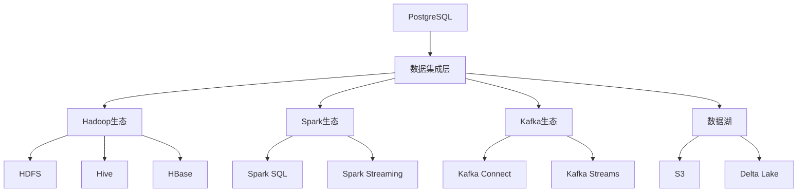
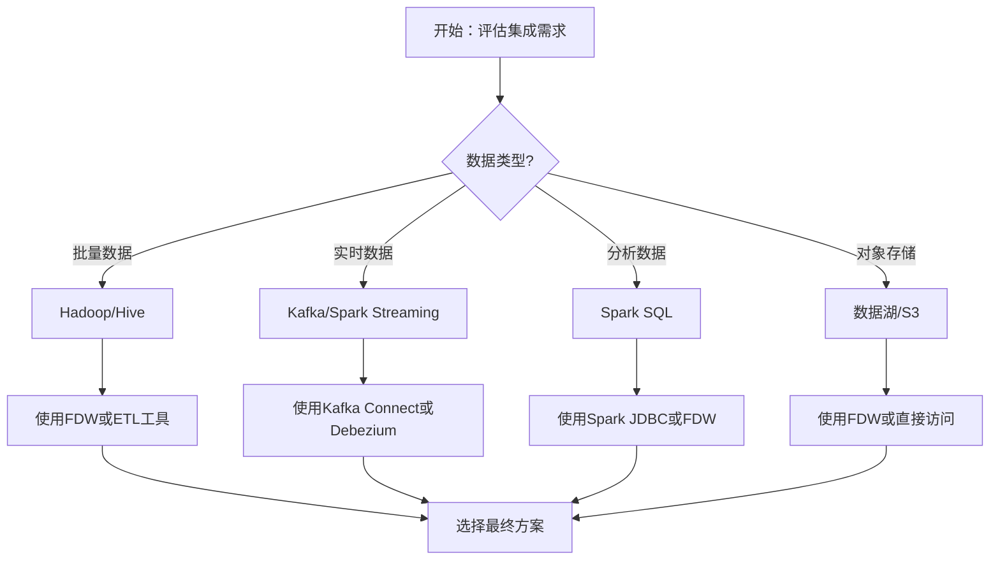
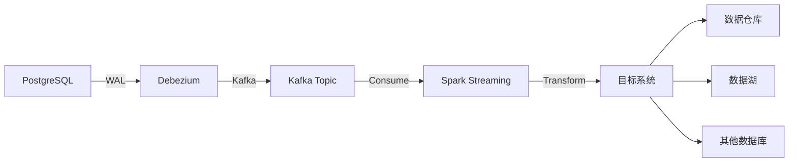

# PostgreSQL与大数据平台集成指南

## 元数据

- **文档版本**: v1.0
- **创建日期**: 2025-01
- **技术栈**: PostgreSQL 17+/18+ | Hadoop | Spark | Kafka | 数据湖 | 实时数据管道
- **难度级别**: ⭐⭐⭐⭐ (高级)
- **预计阅读**: 170分钟
- **前置要求**: 熟悉PostgreSQL基础、大数据平台基础

---

## 📋 完整目录

- [PostgreSQL与大数据平台集成指南](#postgresql与大数据平台集成指南)
  - [元数据](#元数据)
  - [📋 完整目录](#-完整目录)
  - [1. 大数据平台集成概述](#1-大数据平台集成概述)
    - [1.1 集成架构](#11-集成架构)
    - [1.2 集成选型决策流程图](#12-集成选型决策流程图)
  - [2. PostgreSQL与Hadoop集成](#2-postgresql与hadoop集成)
    - [2.1 HDFS集成场景](#21-hdfs集成场景)
    - [2.2 Hive集成场景](#22-hive集成场景)
    - [2.3 HBase集成场景](#23-hbase集成场景)
  - [3. PostgreSQL与Spark集成](#3-postgresql与spark集成)
    - [3.1 Spark SQL集成场景](#31-spark-sql集成场景)
    - [3.2 Spark Streaming集成场景](#32-spark-streaming集成场景)
  - [4. PostgreSQL与Kafka集成](#4-postgresql与kafka集成)
    - [4.1 Kafka Connect集成场景](#41-kafka-connect集成场景)
    - [4.2 实时数据管道场景](#42-实时数据管道场景)
  - [5. 数据湖集成](#5-数据湖集成)
    - [5.1 S3集成场景](#51-s3集成场景)
    - [5.2 Delta Lake集成场景](#52-delta-lake集成场景)
  - [6. 实时数据管道设计](#6-实时数据管道设计)
    - [6.1 CDC数据管道场景](#61-cdc数据管道场景)
    - [6.2 流式ETL场景](#62-流式etl场景)
  - [7. 综合选型案例](#7-综合选型案例)
  - [📚 参考资源](#-参考资源)
  - [📝 更新日志](#-更新日志)

---

## 1. 大数据平台集成概述

### 1.1 集成架构

**大数据平台集成架构**:



### 1.2 集成选型决策流程图



---

## 2. PostgreSQL与Hadoop集成

### 2.1 HDFS集成场景

**业务需求**:

```text
场景：PostgreSQL与HDFS集成
需求：
1. 访问HDFS数据
2. 批量导入导出
3. 数据同步
```

**实现方案**:

```sql
-- 使用hdfs_fdw扩展
CREATE EXTENSION hdfs_fdw;

-- 创建外部服务器
CREATE SERVER hdfs_server
FOREIGN DATA WRAPPER hdfs_fdw
OPTIONS (
    host 'namenode.example.com',
    port '9000',
    format 'parquet'
);

-- 创建外部表
CREATE FOREIGN TABLE hdfs_data (
    id INT,
    name TEXT,
    value NUMERIC
)
SERVER hdfs_server
OPTIONS (
    path '/data/table1',
    format 'parquet'
);

-- 查询HDFS数据
SELECT * FROM hdfs_data WHERE id > 1000;
```

### 2.2 Hive集成场景

**实现方案**:

```sql
-- 使用hive_fdw扩展
CREATE EXTENSION hive_fdw;

-- 创建外部服务器
CREATE SERVER hive_server
FOREIGN DATA WRAPPER hive_fdw
OPTIONS (
    host 'hive-server.example.com',
    port '10000',
    database 'default'
);

-- 创建外部表
CREATE FOREIGN TABLE hive_table (
    id INT,
    name TEXT,
    created_at TIMESTAMP
)
SERVER hive_server
OPTIONS (
    table 'hive_table'
);

-- 查询Hive数据
SELECT * FROM hive_table WHERE created_at > '2025-01-01';
```

---

## 3. PostgreSQL与Spark集成

### 3.1 Spark SQL集成场景

**业务需求**:

```text
场景：PostgreSQL与Spark SQL集成
需求：
1. Spark读取PostgreSQL数据
2. Spark写入PostgreSQL数据
3. 大规模数据分析
```

**实现方案**:

```python
# Spark读取PostgreSQL数据
from pyspark.sql import SparkSession

spark = SparkSession.builder \
    .appName("PostgreSQL-Spark-Integration") \
    .config("spark.jars", "/path/to/postgresql-42.7.0.jar") \
    .getOrCreate()

# 读取PostgreSQL数据
df = spark.read \
    .format("jdbc") \
    .option("url", "jdbc:postgresql://localhost:5432/mydb") \
    .option("dbtable", "users") \
    .option("user", "postgres") \
    .option("password", "password") \
    .load()

# 数据分析
result = df.filter(df.age > 30) \
    .groupBy("city") \
    .agg({"age": "avg", "id": "count"})

# 写入PostgreSQL
result.write \
    .format("jdbc") \
    .option("url", "jdbc:postgresql://localhost:5432/mydb") \
    .option("dbtable", "analytics_result") \
    .option("user", "postgres") \
    .option("password", "password") \
    .mode("overwrite") \
    .save()
```

---

## 4. PostgreSQL与Kafka集成

### 4.1 Kafka Connect集成场景

**业务需求**:

```text
场景：PostgreSQL与Kafka集成
需求：
1. PostgreSQL变更捕获（CDC）
2. 实时数据同步
3. 事件流处理
```

**实现方案**:

```json
// Kafka Connect PostgreSQL Source配置
{
  "name": "postgresql-source",
  "config": {
    "connector.class": "io.debezium.connector.postgresql.PostgresConnector",
    "database.hostname": "localhost",
    "database.port": "5432",
    "database.user": "postgres",
    "database.password": "password",
    "database.dbname": "mydb",
    "database.server.name": "postgresql-server",
    "table.whitelist": "public.users,public.orders",
    "plugin.name": "pgoutput",
    "slot.name": "debezium_slot",
    "publication.name": "debezium_pub"
  }
}
```

---

## 5. 数据湖集成

### 5.1 S3集成场景

**实现方案**:

```sql
-- 使用s3_fdw扩展
CREATE EXTENSION s3_fdw;

-- 创建外部服务器
CREATE SERVER s3_server
FOREIGN DATA WRAPPER s3_fdw
OPTIONS (
    aws_access_key_id 'YOUR_ACCESS_KEY',
    aws_secret_access_key 'YOUR_SECRET_KEY',
    region 'us-east-1'
);

-- 创建外部表
CREATE FOREIGN TABLE s3_data (
    id INT,
    data JSONB
)
SERVER s3_server
OPTIONS (
    bucket 'my-data-lake',
    object_path '/data/table1.parquet',
    format 'parquet'
);

-- 查询S3数据
SELECT * FROM s3_data WHERE id > 1000;
```

---

## 6. 实时数据管道设计

### 6.1 CDC数据管道场景

**架构设计**:



---

## 7. 综合选型案例

### 7.1 案例1：大规模数据分析系统

**业务背景**:
- 大规模数据分析
- 实时数据处理
- 多数据源集成

**实现方案**:

```text
架构设计：
1. PostgreSQL作为OLTP数据库
2. Spark作为分析引擎
3. Kafka作为消息队列
4. S3作为数据湖

数据流：
PostgreSQL → Kafka → Spark → S3 → PostgreSQL（结果）
```

---

## 📚 参考资源

### 官方文档

- [PostgreSQL FDW文档](https://www.postgresql.org/docs/current/postgres-fdw.html)
- [Spark JDBC文档](https://spark.apache.org/docs/latest/sql-data-sources-jdbc.html)
- [Kafka Connect文档](https://kafka.apache.org/documentation/#connect)

### 相关文档

- [数据湖与PostgreSQL集成](./数据湖/数据湖与PostgreSQL集成.md)
- [实时数据同步与CDC完整指南](../09-逻辑复制/实时数据同步与CDC完整指南.md)

---

## 📝 更新日志

- **2025-01**: 初始版本创建
  - 完成Hadoop集成
  - 完成Spark集成
  - 完成Kafka集成
  - 完成数据湖集成
  - 完成实时数据管道设计

---

**最后更新**: 2025年1月
**状态**: ✅ 完成
