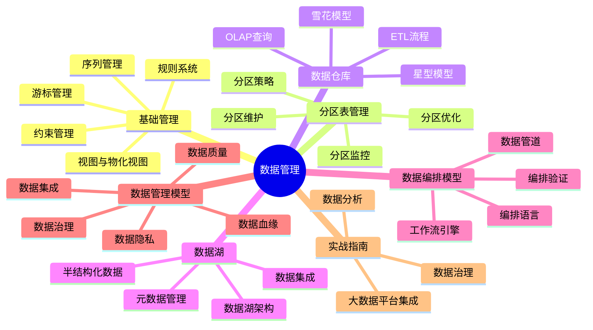
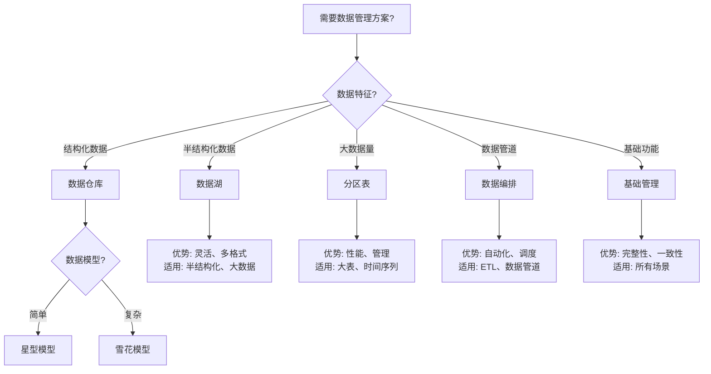

# 26-数据管理

> **文档总数**: 58个文档（包含README）
> **覆盖领域**: 数据管理模型、数据编排、数据治理、分区表、数据仓库、数据湖、基础管理
> **版本覆盖**: PostgreSQL 18.x (推荐) ⭐ | 17.x (推荐) | 16.x (兼容)
> **最后更新**: 2025年1月

---

## 📊 知识体系思维导图



---

## 📋 主题说明

本主题整合所有PostgreSQL数据管理相关内容，包括基础数据管理、数据管理模型（形式化理论）、数据编排模型（形式化理论）、数据仓库、数据湖、分区表管理等。

**文档分类**:

- **基础管理**: 包含实际可用的操作指南（约束、序列、视图等）
- **实战指南**: 包含完整实战案例的指南（数据分析、数据治理等）
- **理论模型**: 包含形式化理论文档（12系列、13系列），适合理论研究和深入理解
- **专项主题**: 分区表、数据仓库、数据湖等专项主题的实战指南

---

## 📚 核心文档

### 基础管理 ⭐ 推荐初学者

- **[基础管理/README.md](./基础管理/README.md)** - 基础管理子主题导航
- **[基础管理/约束管理.md](./基础管理/约束管理.md)** - 约束管理完整指南（主键、外键、唯一、检查、非空）
- **[基础管理/序列管理.md](./基础管理/序列管理.md)** - 序列管理完整指南（序列生成、配置、管理）
- **[基础管理/视图与物化视图.md](./基础管理/视图与物化视图.md)** - 视图与物化视图完整指南
- **[基础管理/规则系统.md](./基础管理/规则系统.md)** - 规则系统完整指南（可更新视图、查询重写）
- **[基础管理/游标管理.md](./基础管理/游标管理.md)** - 游标管理完整指南

### 分区表管理 ⭐ 推荐实战

- **[分区表管理/README.md](./分区表管理/README.md)** - 分区表管理子主题导航
- **[分区表管理/分区表管理基础.md](./分区表管理/分区表管理基础.md)** - 分区表管理基础
- **[分区表管理/PostgreSQL分区表高级优化指南.md](./分区表管理/PostgreSQL分区表高级优化指南.md)** - 分区表高级优化指南
- **[分区表管理/【深入】PostgreSQL分区表高级优化指南.md](../02-查询与优化/README.md)** - 分区表深入优化指南

### 数据仓库 ⭐ 推荐实战

- **[数据仓库/README.md](./数据仓库/README.md)** - 数据仓库子主题导航
- **[数据仓库/数据仓库设计指南.md](./数据仓库/数据仓库设计指南.md)** - 数据仓库设计指南
- **[数据仓库/OLAP查询优化.md](./数据仓库/OLAP查询优化.md)** - OLAP查询优化详解
- **[数据仓库/星型雪花模型.md](./数据仓库/星型雪花模型.md)** - 星型雪花模型设计指南
- **[数据仓库/ETL流程设计.md](./数据仓库/ETL流程设计.md)** - ETL流程设计指南
- **[数据仓库/数据仓库最佳实践.md](./数据仓库/数据仓库最佳实践.md)** - 数据仓库最佳实践

### 数据湖 ⭐ 推荐实战

- **[数据湖/README.md](./数据湖/README.md)** - 数据湖子主题导航
- **[数据湖/数据湖完整指南.md](./数据湖/数据湖完整指南.md)** - 数据湖完整指南
- **[数据湖/数据湖架构设计.md](./数据湖/数据湖架构设计.md)** - 数据湖架构设计指南
- **[数据湖/数据湖与PostgreSQL集成.md](./数据湖/数据湖与PostgreSQL集成.md)** - 数据湖与PostgreSQL集成指南
- **[数据湖/半结构化数据处理.md](./数据湖/半结构化数据处理.md)** - 半结构化数据处理指南
- **[数据湖/元数据管理.md](./数据湖/元数据管理.md)** - 元数据管理指南

### 数据管理模型 📚 理论文档

- **[数据管理模型/README.md](./数据管理模型/README.md)** - 数据管理模型子主题导航
- **[数据管理模型/12.01-数据血缘-why_where_how形式语义.md](./数据管理模型/12.01-数据血缘-why_where_how形式语义.md)** ⭐ 推荐（包含详细实现示例）
- **[数据管理模型/12.02-数据库数据仓库模型-OLAP查询与多维分析的形式化.md](./数据管理模型/12.02-数据库数据仓库模型-OLAP查询与多维分析的形式化.md)** - 数据仓库模型（形式化）
- **[数据管理模型/12.03-数据库数据湖模型-半结构化数据与元数据管理的形式化.md](./数据管理模型/12.03-数据库数据湖模型-半结构化数据与元数据管理的形式化.md)** - 数据湖模型（形式化）
- **[数据管理模型/12.04-数据库数据网格模型-分布式数据治理与访问控制的形式化.md](./数据管理模型/12.04-数据库数据网格模型-分布式数据治理与访问控制的形式化.md)** - 数据网格模型（形式化）
- 更多形式化理论文档请参考 [数据管理模型/README.md](./数据管理模型/README.md)

### 数据编排模型 📚 理论文档

- **[数据编排模型/README.md](./数据编排模型/README.md)** - 数据编排模型子主题导航
- **[数据编排模型/13.01-数据库数据管道模型-管道编排与调度优化的形式化.md](./数据编排模型/13.01-数据库数据管道模型-管道编排与调度优化的形式化.md)** - 数据管道模型（形式化）
- **[数据编排模型/13.02-数据库数据编排模型-工作流引擎与状态管理的形式化.md](./数据编排模型/13.02-数据库数据编排模型-工作流引擎与状态管理的形式化.md)** - 工作流引擎模型（形式化）
- 更多形式化理论文档请参考 [数据编排模型/README.md](./数据编排模型/README.md)

### 实战指南 ⭐⭐⭐ 强烈推荐

- **[数据治理与数据质量完整指南.md](./数据治理与数据质量完整指南.md)** ⭐⭐⭐⭐⭐ 新增
  - 数据治理框架（数据质量、数据安全、数据合规、数据血缘、元数据管理）
  - 数据质量评估方法（完整性、准确性、一致性、及时性、有效性、唯一性）
  - 数据质量监控（实时监控、自动化监控、告警机制）
  - 数据血缘分析（数据溯源、影响分析、变更追踪）
  - 数据目录管理（元数据管理、数据字典、业务术语）
  - 数据合规性管理（GDPR、HIPAA、SOC2合规）
  - 综合选型案例（企业级数据治理系统）
  - **字数**: 约28,000字
  - **状态**: ✅ 已完成

- **[数据分析完整实战指南.md](./数据分析完整实战指南.md)** ⭐⭐⭐⭐⭐
  - 数据分析完整实战指南
  - 包含实际案例和最佳实践

- **[PostgreSQL与大数据平台集成指南.md](./PostgreSQL与大数据平台集成指南.md)** ⭐⭐⭐⭐⭐ 新增
  - PostgreSQL与Hadoop集成（HDFS、Hive、HBase）
  - PostgreSQL与Spark集成（Spark SQL、Spark Streaming）
  - PostgreSQL与Kafka集成（Kafka Connect、实时数据管道）
  - 数据湖集成（S3、Delta Lake）
  - 实时数据管道设计（CDC数据管道、流式ETL）
  - 综合选型案例（大规模数据分析系统）
  - **字数**: 约25,000字
  - **状态**: ✅ 已完成

---

## 🎯 使用建议

### 初学者

1. **基础管理** → 学习约束、序列、视图等基础功能
2. **分区表管理** → 学习如何处理大表
3. **数据仓库** → 学习OLAP和分析型数据库设计

### 实战应用

1. **数据分析完整实战指南** → 数据分析实战
2. **数据治理与数据质量完整指南** → 数据治理实战
3. **PostgreSQL与大数据平台集成指南** → 大数据集成实战
4. **数据仓库/数据湖** → 专项主题实战

### 理论研究者

1. **数据管理模型** → 深入研究数据管理理论
2. **数据编排模型** → 深入研究编排理论

---

## ⚠️ 重要提示

### 理论文档 vs 实战文档

- **理论文档**（12系列、13系列）: 包含大量数学公式、Haskell代码和形式化定义，适合理论研究和深入理解，但内容较为抽象。
- **实战文档**: 包含详细的操作步骤、实际案例和最佳实践，可直接用于项目开发。

### 文档选择建议

- **需要立即应用**: 优先选择基础管理、实战指南、专项主题文档
- **需要深入理解**: 选择数据管理模型、数据编排模型理论文档
- **需要完整解决方案**: 选择实战指南（数据治理、数据分析、大数据集成）

---

---

## 📊 数据管理方案选型决策树



---

## 📊 数据管理方案对比矩阵

| 方案 | 数据类型 | 性能 | 灵活性 | 复杂度 | 适用场景 | 文档位置 |
| --- | --- | --- | --- | --- | --- | --- |
| **基础管理** | 结构化 | ⭐⭐⭐⭐ | ⭐⭐⭐ | ⭐⭐ | 所有场景 | [基础管理/](./基础管理/) |
| **数据仓库** | 结构化 | ⭐⭐⭐⭐ | ⭐⭐⭐ | ⭐⭐⭐ | OLAP、分析 | [数据仓库/](./数据仓库/) |
| **数据湖** | 多格式 | ⭐⭐⭐ | ⭐⭐⭐⭐⭐ | ⭐⭐⭐⭐ | 大数据、半结构化 | [数据湖/](./数据湖/) |
| **分区表** | 结构化 | ⭐⭐⭐⭐⭐ | ⭐⭐ | ⭐⭐ | 大表、时间序列 | [分区表管理/](./分区表管理/) |
| **数据编排** | 多格式 | ⭐⭐⭐ | ⭐⭐⭐⭐ | ⭐⭐⭐⭐ | ETL、数据管道 | [数据编排模型/](./数据编排模型/) |

---

## 📚 文档来源

本主题整合了以下源目录的文档：

- `DataBaseTheory/12-数据管理模型/` - 数据管理模型理论文档
- `DataBaseTheory/13-数据编排/` - 数据编排模型理论文档
- `PostgreSQL培训/05-数据管理/` - PostgreSQL基础管理实战文档

**原则**: 所有文档均为复制，原文件保持不变。

---

## 📋 目录结构

```text
26-数据管理/
├── README.md                          # 主导航文档
├── 基础管理/                          # ⭐ 基础管理（实战）
│   ├── README.md
│   ├── 约束管理.md
│   ├── 序列管理.md
│   ├── 规则系统.md
│   ├── 视图与物化视图.md
│   └── 游标管理.md
├── 分区表管理/                        # ⭐ 分区表管理（实战）
│   ├── README.md
│   ├── 分区表管理基础.md
│   ├── PostgreSQL分区表高级优化指南.md
│   └── ...
├── 数据仓库/                          # ⭐ 数据仓库（实战）
│   ├── README.md
│   ├── 数据仓库设计指南.md
│   ├── OLAP查询优化.md
│   └── ...
├── 数据湖/                            # ⭐ 数据湖（实战）
│   ├── README.md
│   ├── 数据湖完整指南.md
│   ├── 数据湖架构设计.md
│   └── ...
├── 数据管理模型/                      # 📚 数据管理模型（理论）
│   ├── README.md
│   ├── 12.01-数据血缘-why_where_how形式语义.md  ⭐ 推荐（含实现示例）
│   ├── 12.02-数据库数据仓库模型-...
│   └── ...
├── 数据编排模型/                      # 📚 数据编排模型（理论）
│   ├── README.md
│   ├── 13.01-数据库数据管道模型-...
│   └── ...
└── 实战指南/                          # ⭐⭐⭐ 实战指南（根目录）
    ├── 数据治理与数据质量完整指南.md
    ├── 数据分析完整实战指南.md
    └── PostgreSQL与大数据平台集成指南.md
```

---

## ✅ 文档整理状态

- ✅ **基础管理**: 已整理到 `基础管理/` 文件夹，包含完整的README
- ✅ **分区表管理**: 已整理到 `分区表管理/` 文件夹，删除重复文档
- ✅ **数据仓库**: 已整理，删除重复的形式化理论文档
- ✅ **数据湖**: 已整理，删除重复的形式化理论文档
- ✅ **数据管理模型**: 已整理到 `数据管理模型/` 文件夹，包含完整的README
- ✅ **数据编排模型**: 已整理到 `数据编排模型/` 文件夹，包含完整的README
- ✅ **临时文件**: 已删除 `code_example_status_report.md`
- ✅ **主README**: 已更新，反映新的目录结构

---

## 🔗 相关文档

- [17-数据模型设计](../17-数据模型设计/README.md) - 数据模型设计
- [05-安全与合规](../05-安全与合规/README.md) - 数据安全和合规
- [02-查询与优化](../02-查询与优化/README.md) - 查询优化（包含分区裁剪理论）

---

**最后更新**: 2025年1月
**状态**: ✅ 文档整理完成，目录结构清晰，理论文档与实战文档已分类
