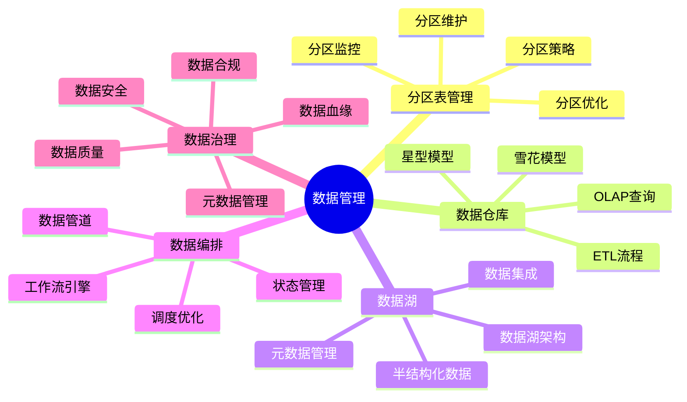
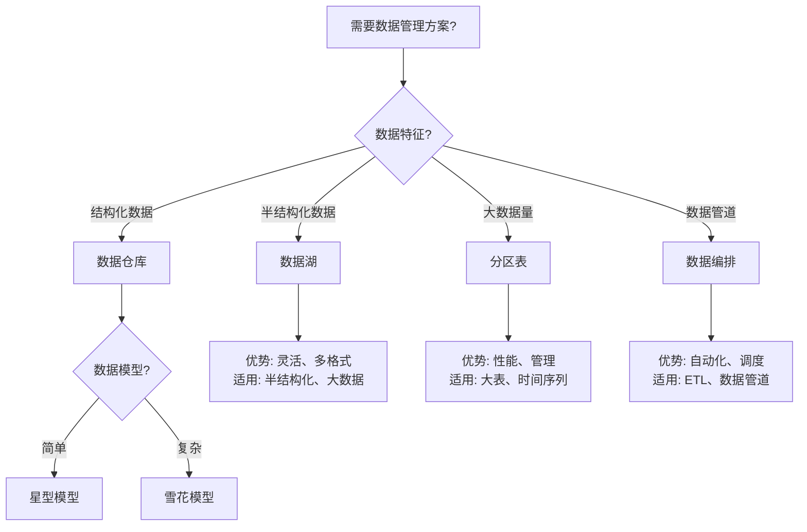

# 26-数据管理

> **文档总数**: 33个文档
> **覆盖领域**: 数据管理模型、数据编排、数据治理、分区表、数据仓库、数据湖
> **版本覆盖**: PostgreSQL 18.x (推荐) ⭐ | 17.x (推荐) | 16.x (兼容)
> **最后更新**: 2025年1月

---

## 📊 知识体系思维导图

---

## 📋 主题说明

本主题整合所有PostgreSQL数据管理相关内容，包括数据管理模型、数据编排方法、数据治理策略等。

---

## 📚 核心文档

### 分区表管理

- **[分区表管理/README.md](./分区表管理/README.md)** - 分区表管理子主题导航
- **[分区表管理/分区表管理基础.md](./分区表管理/分区表管理基础.md)** - 分区表管理基础
- **[分区表管理/PostgreSQL分区表高级优化指南.md](./分区表管理/PostgreSQL分区表高级优化指南.md)** - 分区表高级优化指南

### 数据仓库

- **[数据仓库/README.md](./数据仓库/README.md)** - 数据仓库子主题导航
- **[数据仓库/数据仓库设计指南.md](./数据仓库/数据仓库设计指南.md)** - 数据仓库设计指南
- **[数据仓库/OLAP查询优化.md](./数据仓库/OLAP查询优化.md)** - OLAP查询优化详解
- **[数据仓库/星型雪花模型.md](./数据仓库/星型雪花模型.md)** - 星型雪花模型设计指南
- **[数据仓库/ETL流程设计.md](./数据仓库/ETL流程设计.md)** - ETL流程设计指南
- **[数据仓库/数据仓库最佳实践.md](./数据仓库/数据仓库最佳实践.md)** - 数据仓库最佳实践

### 数据湖

- **[数据湖/README.md](./数据湖/README.md)** - 数据湖子主题导航
- **[数据湖/数据湖完整指南.md](./数据湖/数据湖完整指南.md)** - 数据湖完整指南
- **[数据湖/数据湖架构设计.md](./数据湖/数据湖架构设计.md)** - 数据湖架构设计指南
- **[数据湖/数据湖与PostgreSQL集成.md](./数据湖/数据湖与PostgreSQL集成.md)** - 数据湖与PostgreSQL集成指南
- **[数据湖/半结构化数据处理.md](./数据湖/半结构化数据处理.md)** - 半结构化数据处理指南
- **[数据湖/元数据管理.md](./数据湖/元数据管理.md)** - 元数据管理指南

### 数据管理模型

- **[12.02-数据库数据仓库模型-OLAP查询与多维分析的形式化.md](./12.02-数据库数据仓库模型-OLAP查询与多维分析的形式化.md)** - 数据仓库模型
- **[12.03-数据库数据湖模型-半结构化数据与元数据管理的形式化.md](./12.03-数据库数据湖模型-半结构化数据与元数据管理的形式化.md)** - 数据湖模型
- **[12.04-数据库数据网格模型-分布式数据治理与访问控制的形式化.md](./12.04-数据库数据网格模型-分布式数据治理与访问控制的形式化.md)** - 数据网格模型

### 数据编排

- **[13.01-数据库数据管道模型-管道编排与调度优化的形式化.md](./13.01-数据库数据管道模型-管道编排与调度优化的形式化.md)** - 数据管道模型
- **[13.02-数据库数据编排模型-工作流引擎与状态管理的形式化.md](./13.02-数据库数据编排模型-工作流引擎与状态管理的形式化.md)** - 数据编排模型

### 数据治理

- **[12.09-数据库数据治理模型-治理策略与合规性检查的形式化.md](./12.09-数据库数据治理模型-治理策略与合规性检查的形式化.md)** - 数据治理模型
- **[12.07-数据库数据质量模型-质量评估与清洗策略的形式化.md](./12.07-数据库数据质量模型-质量评估与清洗策略的形式化.md)** - 数据质量模型
- **[数据治理与数据质量完整指南.md](./数据治理与数据质量完整指南.md)** ⭐⭐⭐⭐⭐ ⭐ 新增
  - 数据治理框架（数据质量、数据安全、数据合规、数据血缘、元数据管理）
  - 数据质量评估方法（完整性、准确性、一致性、及时性、有效性、唯一性）
  - 数据质量监控（实时监控、自动化监控、告警机制）
  - 数据血缘分析（数据溯源、影响分析、变更追踪）
  - 数据目录管理（元数据管理、数据字典、业务术语）
  - 数据合规性管理（GDPR、HIPAA、SOC2合规）
  - 综合选型案例（企业级数据治理系统）
  - **字数**: 约28,000字
  - **状态**: ✅ 已完成

- **[PostgreSQL与大数据平台集成指南.md](./PostgreSQL与大数据平台集成指南.md)** ⭐⭐⭐⭐⭐ ⭐ 新增
  - PostgreSQL与Hadoop集成（HDFS、Hive、HBase）
  - PostgreSQL与Spark集成（Spark SQL、Spark Streaming）
  - PostgreSQL与Kafka集成（Kafka Connect、实时数据管道）
  - 数据湖集成（S3、Delta Lake）
  - 实时数据管道设计（CDC数据管道、流式ETL）
  - 综合选型案例（大规模数据分析系统）
  - **字数**: 约25,000字
  - **状态**: ✅ 已完成

---

## 🎯 使用建议

### 分区表管理

1. 学习分区表管理基础，了解分区表概念
2. 参考分区表高级优化指南进行优化
3. 掌握分区表维护和监控方法

### 数据管理

1. 学习数据管理模型
2. 实施数据编排策略
3. 建立数据治理体系

---

## 📚 文档来源

本主题整合了以下源目录的文档：

- `DataBaseTheory/12-数据管理模型/`
- `DataBaseTheory/13-数据编排/`
- `PostgreSQL培训/05-数据管理/`

**原则**: 所有文档均为复制，原文件保持不变。

---

## 📊 数据管理方案选型决策树

---

## 📊 数据管理方案对比矩阵

| 方案 | 数据类型 | 性能 | 灵活性 | 复杂度 | 适用场景 |
|------|---------|------|--------|--------|---------|
| **数据仓库** | 结构化 | ⭐⭐⭐⭐ | ⭐⭐⭐ | ⭐⭐⭐ | OLAP、分析 |
| **数据湖** | 多格式 | ⭐⭐⭐ | ⭐⭐⭐⭐⭐ | ⭐⭐⭐⭐ | 大数据、半结构化 |
| **分区表** | 结构化 | ⭐⭐⭐⭐⭐ | ⭐⭐ | ⭐⭐ | 大表、时间序列 |
| **数据编排** | 多格式 | ⭐⭐⭐ | ⭐⭐⭐⭐ | ⭐⭐⭐⭐ | ETL、数据管道 |

---

## 🔗 相关文档

- [17-数据模型设计](../17-数据模型设计/README.md) - 数据模型设计
- [05-安全与合规](../05-安全与合规/README.md) - 数据安全和合规

---

**最后更新**: 2025年1月
**状态**: ✅ 文档整合完成
