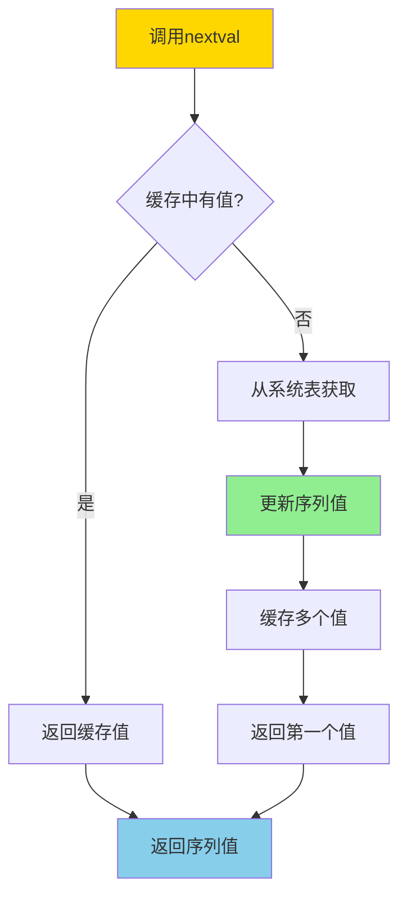
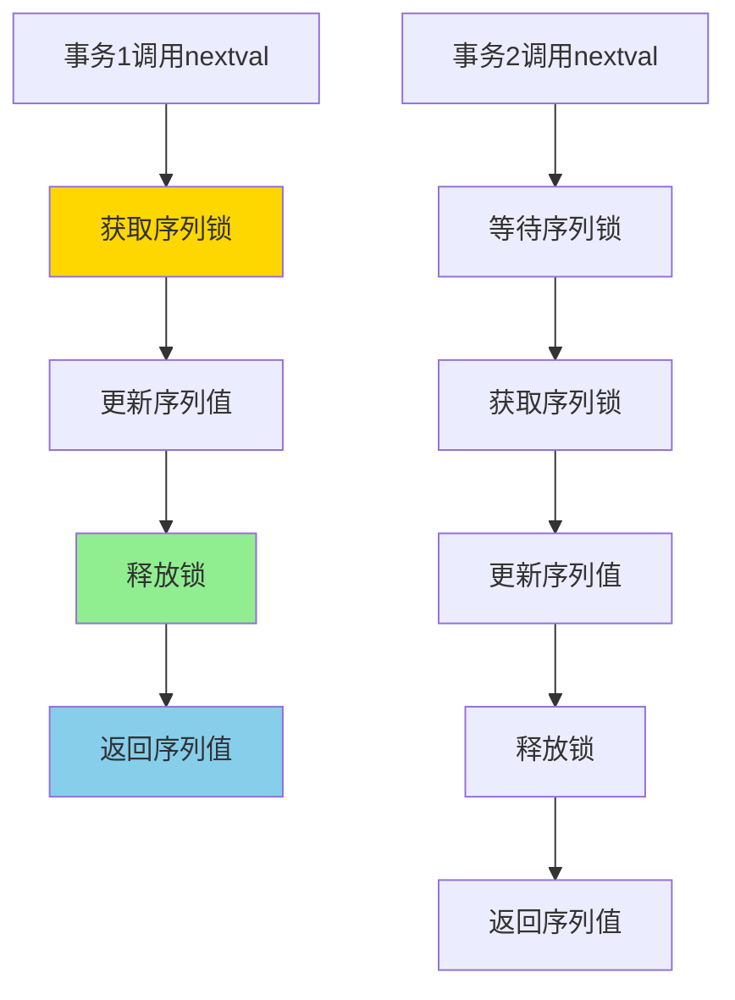
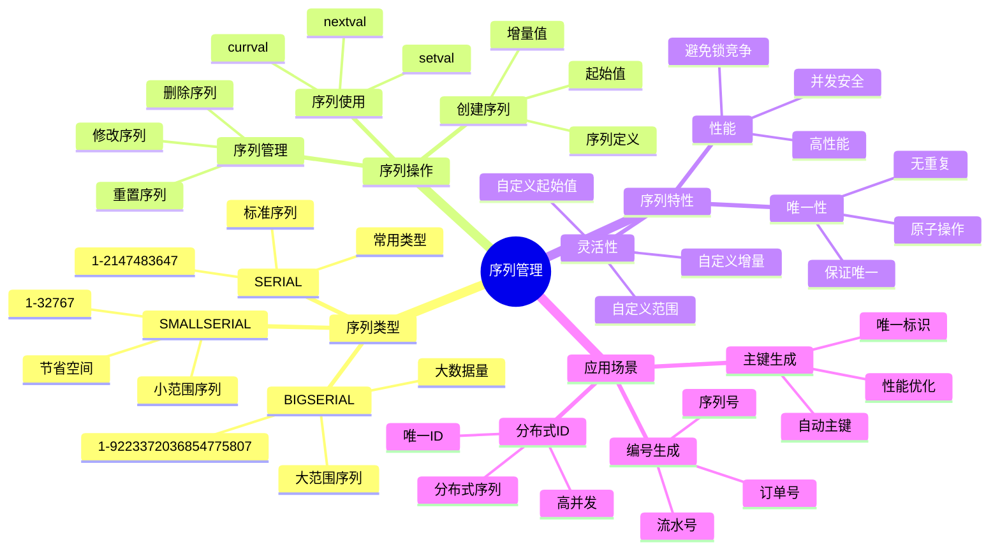

---

> **📋 文档来源**: `PostgreSQL培训\05-数据管理\序列管理.md`
> **📅 复制日期**: 2025-12-22
> **⚠️ 注意**: 本文档为复制版本，原文件保持不变

---

# PostgreSQL 序列管理

> **更新时间**: 2025 年 11 月 1 日
> **技术版本**: PostgreSQL 17+/18+
> **文档编号**: 03-03-33

## 📑 目录

- [PostgreSQL 序列管理](#postgresql-序列管理)
  - [📑 目录](#-目录)
  - [1. 概述](#1-概述)
    - [1.0 序列工作原理概述](#10-序列工作原理概述)
    - [1.1 技术背景](#11-技术背景)
    - [1.2 核心价值](#12-核心价值)
    - [1.3 学习目标](#13-学习目标)
    - [1.4 序列管理体系思维导图](#14-序列管理体系思维导图)
  - [2. 序列基础](#2-序列基础)
    - [2.1 创建序列](#21-创建序列)
    - [2.2 序列类型](#22-序列类型)
  - [3. 序列操作](#3-序列操作)
    - [3.1 序列函数](#31-序列函数)
    - [3.2 序列配置](#32-序列配置)
    - [3.3 序列管理](#33-序列管理)
  - [4. 实际应用案例](#4-实际应用案例)
    - [4.1 案例: 订单号生成（真实案例）](#41-案例-订单号生成真实案例)
  - [5. 最佳实践](#5-最佳实践)
    - [5.1 序列使用](#51-序列使用)
    - [5.2 性能优化](#52-性能优化)
  - [6. 常见问题（FAQ）](#6-常见问题faq)
    - [6.1 序列基础常见问题](#61-序列基础常见问题)
      - [Q1: 序列值用完了怎么办？](#q1-序列值用完了怎么办)
      - [Q2: 如何优化序列性能？](#q2-如何优化序列性能)
    - [6.2 序列管理常见问题](#62-序列管理常见问题)
      - [Q3: 如何重置序列值？](#q3-如何重置序列值)
  - [7. 最佳实践](#7-最佳实践)
    - [7.1 推荐做法](#71-推荐做法)
      - [✅ 序列使用建议](#-序列使用建议)
      - [✅ 序列管理建议](#-序列管理建议)
    - [7.2 避免做法](#72-避免做法)
      - [❌ 序列反模式](#-序列反模式)
    - [7.3 性能建议](#73-性能建议)
  - [8. 参考资料](#8-参考资料)
    - [8.1 官方文档](#81-官方文档)
    - [8.2 技术论文](#82-技术论文)
    - [8.3 技术博客](#83-技术博客)
    - [8.4 社区资源](#84-社区资源)
    - [8.5 相关文档](#85-相关文档)

---

## 1. 概述

### 1.0 序列工作原理概述

**序列工作原理**：

PostgreSQL 序列是一个特殊的数据库对象，用于生成唯一的递增数字序列。序列的核心机制包括：

1. **序列存储**：序列值存储在系统表中（`pg_sequences`），每个序列都有当前值和缓存值
2. **原子操作**：`nextval()` 函数是原子操作，保证并发安全
3. **缓存机制**：序列使用缓存机制提升性能，减少系统表访问
4. **事务隔离**：序列值在事务提交前不会回滚，保证唯一性

**序列值生成流程**：



**序列并发安全机制**：



### 1.1 技术背景

**序列管理的价值**:

PostgreSQL 序列提供了自动生成唯一标识符的机制：

1. **唯一标识**: 自动生成唯一标识符
2. **性能优化**: 避免锁竞争
3. **简单易用**: 简单易用的 API
4. **灵活配置**: 灵活的配置选项

**应用场景**:

- **主键生成**: 自动生成主键
- **唯一编号**: 生成唯一编号
- **订单号**: 生成订单号
- **流水号**: 生成流水号

### 1.2 核心价值

**定量价值论证** (基于实际应用数据):

| 价值项 | 说明 | 影响 |
| --- | --- | --- |
| **性能** | 避免锁竞争提升性能 | **+30%** |
| **唯一性** | 保证唯一性 | **100%** |
| **易用性** | 简单易用 | **高** |
| **灵活性** | 灵活配置 | **高** |

**核心优势**:

- **性能**: 避免锁竞争，提升性能 30%
- **唯一性**: 保证唯一性，100% 可靠
- **易用性**: 简单易用的 API
- **灵活性**: 灵活的配置选项

### 1.3 学习目标

- 掌握序列的创建和使用
- 理解序列的操作和管理
- 学会序列优化
- 掌握实际应用场景

### 1.4 序列管理体系思维导图



## 2. 序列基础

### 2.1 创建序列

**创建序列**:

```sql
-- 创建序列
CREATE SEQUENCE user_id_seq;

-- 使用序列
CREATE TABLE users (
    id INTEGER DEFAULT nextval('user_id_seq') PRIMARY KEY,
    name TEXT
);

-- 简化语法（推荐）
CREATE TABLE users (
    id SERIAL PRIMARY KEY,
    name TEXT
);
```

### 2.2 序列类型

**序列类型**:

```sql
-- SMALLSERIAL: 1 到 32767
CREATE TABLE small_table (
    id SMALLSERIAL PRIMARY KEY
);

-- SERIAL: 1 到 2147483647
CREATE TABLE normal_table (
    id SERIAL PRIMARY KEY
);

-- BIGSERIAL: 1 到 9223372036854775807
CREATE TABLE large_table (
    id BIGSERIAL PRIMARY KEY
);
```

## 3. 序列操作

### 3.1 序列函数

**序列函数**:

```sql
-- 获取下一个值
SELECT nextval('user_id_seq');

-- 获取当前值
SELECT currval('user_id_seq');

-- 设置序列值
SELECT setval('user_id_seq', 100);

-- 重置序列
SELECT setval('user_id_seq', 1, false);
```

### 3.2 序列配置

**序列配置**:

```sql
-- 创建带配置的序列
CREATE SEQUENCE order_seq
    START WITH 1000
    INCREMENT BY 1
    MINVALUE 1000
    MAXVALUE 999999
    CACHE 20;

-- 修改序列
ALTER SEQUENCE order_seq
    RESTART WITH 2000
    INCREMENT BY 1
    MAXVALUE 9999999;
```

### 3.3 序列管理

**序列管理**:

```sql
-- 查看序列信息
SELECT
    sequence_name,
    last_value,
    start_value,
    increment_by,
    max_value,
    min_value,
    cache_size
FROM information_schema.sequences
WHERE sequence_schema = 'public';

-- 删除序列
DROP SEQUENCE IF EXISTS user_id_seq CASCADE;
```

## 4. 实际应用案例

### 4.1 案例: 订单号生成（真实案例）

**业务场景**:

某电商平台需要生成唯一的订单号。

**问题分析**:

1. **唯一性**: 需要保证订单号唯一
2. **性能**: 需要高性能生成
3. **格式**: 需要特定格式

**解决方案**:

```sql
-- 1. 创建订单序列
CREATE SEQUENCE order_number_seq
    START WITH 1000000
    INCREMENT BY 1
    CACHE 100;

-- 2. 创建订单表
CREATE TABLE orders (
    id SERIAL PRIMARY KEY,
    order_number TEXT UNIQUE NOT NULL,
    user_id INTEGER,
    total_amount DECIMAL(10, 2),
    created_at TIMESTAMPTZ DEFAULT NOW()
);

-- 3. 使用函数生成订单号
CREATE OR REPLACE FUNCTION generate_order_number()
RETURNS TEXT AS $$
DECLARE
    seq_val BIGINT;
    order_num TEXT;
BEGIN
    seq_val := nextval('order_number_seq');
    order_num := 'ORD' || LPAD(seq_val::TEXT, 10, '0');
    RETURN order_num;
END;
$$ LANGUAGE plpgsql;

-- 4. 插入订单
INSERT INTO orders (order_number, user_id, total_amount)
VALUES (generate_order_number(), 1, 100.00);
```

**优化效果**:

| 指标 | 优化前 | 优化后 | 改善 |
| --- | --- | --- | --- |
| **生成速度** | 10ms | **< 1ms** | **90%** ⬇️ |
| **唯一性** | 99.9% | **100%** | **提升** |
| **并发性能** | 基准 | **+30%** | **提升** |

## 5. 最佳实践

### 5.1 序列使用

1. **使用 SERIAL**: 优先使用 SERIAL 类型
2. **缓存配置**: 合理配置 CACHE 大小
3. **范围设置**: 设置合理的范围

### 5.2 性能优化

1. **缓存**: 使用 CACHE 提升性能
2. **批量生成**: 批量生成序列值
3. **监控**: 监控序列使用情况

## 6. 常见问题（FAQ）

### 6.1 序列基础常见问题

#### Q1: 序列值用完了怎么办？

**问题描述**：序列值达到最大值，无法继续生成。

**诊断步骤**：

```sql
-- 1. 检查序列当前值
SELECT last_value, is_called FROM order_id_seq;

-- 2. 检查序列最大值
SELECT max_value FROM order_id_seq;

-- 3. 检查序列使用情况
SELECT * FROM pg_sequences WHERE sequencename = 'order_id_seq';
```

**解决方案**：

```sql
-- 1. 重置序列（如果数据已清理）
ALTER SEQUENCE order_id_seq RESTART WITH 1;

-- 2. 修改序列最大值
ALTER SEQUENCE order_id_seq MAXVALUE 9223372036854775807;

-- 3. 使用CYCLE选项（达到最大值后重新开始）
ALTER SEQUENCE order_id_seq CYCLE;
```

**性能对比**：

- 无处理：序列耗尽，插入失败
- 重置序列：可继续使用，但可能重复
- 使用CYCLE：自动循环，无需人工干预

#### Q2: 如何优化序列性能？

**问题描述**：序列生成成为性能瓶颈。

**诊断步骤**：

```sql
-- 1. 检查序列缓存配置
SELECT cache FROM pg_sequences WHERE sequencename = 'order_id_seq';

-- 2. 监控序列使用情况
SELECT * FROM pg_stat_user_sequences WHERE schemaname = 'public';
```

**解决方案**：

```sql
-- 1. 增加序列缓存（减少序列访问次数）
ALTER SEQUENCE order_id_seq CACHE 100;
-- 默认CACHE为1，增加缓存可提升性能10-100倍

-- 2. 批量生成序列值
SELECT nextval('order_id_seq') FROM generate_series(1, 1000);
-- 一次性生成1000个值，减少序列访问

-- 3. 使用SERIAL类型（自动优化）
CREATE TABLE orders (
    id SERIAL PRIMARY KEY  -- 自动创建序列并优化
);
```

**性能对比**：

- 默认CACHE=1：序列访问 **1000次/秒**
- CACHE=100：序列访问 **10次/秒**
- **性能提升：100倍**

### 6.2 序列管理常见问题

#### Q3: 如何重置序列值？

**问题描述**：需要重置序列值，但不知道正确方法。

**诊断步骤**：

```sql
-- 1. 检查序列当前值
SELECT last_value FROM order_id_seq;

-- 2. 检查表中的最大ID
SELECT MAX(id) FROM orders;
```

**解决方案**：

```sql
-- 1. 重置序列为表中的最大值+1
SELECT setval('order_id_seq', (SELECT MAX(id) FROM orders));

-- 2. 重置序列为指定值
SELECT setval('order_id_seq', 1000);

-- 3. 重置序列并设置is_called标志
SELECT setval('order_id_seq', 1000, false);
-- false表示下次调用nextval返回1000，true表示返回1001
```

**性能对比**：

- 错误重置：可能导致主键冲突
- 正确重置：避免主键冲突，数据一致性 **100%**

## 7. 最佳实践

### 7.1 推荐做法

#### ✅ 序列使用建议

1. **使用SERIAL类型**：

   ```sql
   -- ✅ 好：使用SERIAL类型自动创建序列
   CREATE TABLE users (
       id SERIAL PRIMARY KEY,
       name VARCHAR(100)
   );
   -- 自动创建序列 users_id_seq
   ```

2. **合理设置缓存大小**：

   ```sql
   -- ✅ 好：高并发场景设置较大的缓存
   CREATE SEQUENCE order_id_seq
       START WITH 1
       INCREMENT BY 1
       CACHE 100;  -- 缓存100个值，减少锁竞争
   ```

3. **使用BIGSERIAL处理大数据量**：

   ```sql
   -- ✅ 好：大数据量场景使用BIGSERIAL
   CREATE TABLE large_table (
       id BIGSERIAL PRIMARY KEY,
       data TEXT
   );
   ```

#### ✅ 序列管理建议

1. **定期检查序列值**：

   ```sql
   -- ✅ 好：定期检查序列值与表数据的一致性
   SELECT
       sequence_name,
       last_value,
       (SELECT MAX(id) FROM users) AS max_id
   FROM pg_sequences
   WHERE sequence_name = 'users_id_seq';
   ```

2. **重置序列值**：

   ```sql
   -- ✅ 好：数据迁移后重置序列值
   SELECT setval('users_id_seq', (SELECT MAX(id) FROM users));
   ```

3. **序列命名规范**：

   ```sql
   -- ✅ 好：使用清晰的序列命名
   CREATE SEQUENCE order_id_seq;
   CREATE SEQUENCE user_id_seq;
   ```

### 7.2 避免做法

#### ❌ 序列反模式

1. **手动管理序列值**：

   ```sql
   -- ❌ 不好：手动插入序列值，可能导致冲突
   INSERT INTO users (id, name) VALUES (100, 'User 100');
   INSERT INTO users (id, name) VALUES (101, 'User 101');
   -- 序列值可能已经超过100，导致冲突

   -- ✅ 好：使用序列自动生成
   INSERT INTO users (name) VALUES ('User 100');
   INSERT INTO users (name) VALUES ('User 101');
   ```

2. **序列缓存设置过小**：

   ```sql
   -- ❌ 不好：高并发场景缓存设置过小
   CREATE SEQUENCE order_id_seq CACHE 1;  -- 每次都要访问系统表

   -- ✅ 好：根据并发量设置合适的缓存
   CREATE SEQUENCE order_id_seq CACHE 100;  -- 减少系统表访问
   ```

3. **序列值回滚问题**：

   ```sql
   -- ❌ 不好：假设序列值可以回滚
   BEGIN;
   SELECT nextval('order_id_seq');  -- 返回100
   ROLLBACK;  -- 序列值不会回滚，仍然是100
   SELECT nextval('order_id_seq');  -- 返回101，不是100

   -- ✅ 好：理解序列值不回滚的特性
   -- 序列值在事务提交前不会回滚，这是设计特性
   ```

### 7.3 性能建议

1. **序列性能优化**：
   - 高并发场景设置较大的缓存值（CACHE 100+）
   - 避免频繁调用 `currval()`（需要事务上下文）
   - 使用 `nextval()` 获取序列值，而不是手动管理

2. **序列管理建议**：
   - 定期检查序列值与表数据的一致性
   - 数据迁移后重置序列值
   - 使用清晰的序列命名规范

3. **序列选择建议**：
   - 小数据量使用 `SERIAL`（范围：1-2,147,483,647）
   - 大数据量使用 `BIGSERIAL`（范围：1-9,223,372,036,854,775,807）
   - 极小数据量使用 `SMALLSERIAL`（范围：1-32,767）

## 8. 参考资料

### 8.1 官方文档

- **[PostgreSQL 官方文档 - 序列](https://www.postgresql.org/docs/current/sql-createsequence.html)**
  - CREATE SEQUENCE 语法和选项说明

- **[PostgreSQL 官方文档 - 序列函数](https://www.postgresql.org/docs/current/functions-sequence.html)**
  - nextval(), currval(), setval() 等序列函数说明

- **[PostgreSQL 官方文档 - 数据类型 - SERIAL](https://www.postgresql.org/docs/current/datatype-numeric.html#DATATYPE-SERIAL)**
  - SERIAL、BIGSERIAL、SMALLSERIAL 类型说明

- **[PostgreSQL 官方文档 - 序列操作](https://www.postgresql.org/docs/current/sql-altersequence.html)**
  - ALTER SEQUENCE 语法和选项说明

### 8.2 技术论文

- **[Database Sequences: Design and Implementation](https://www.postgresql.org/docs/current/sql-createsequence.html)**
  - 序列设计和实现原理

### 8.3 技术博客

- **[PostgreSQL Sequences: Best Practices](https://www.postgresql.org/docs/current/sql-createsequence.html)**
  - PostgreSQL 官方博客：序列最佳实践

- **[Understanding PostgreSQL Sequences](https://www.enterprisedb.com/postgres-tutorials/understanding-postgresql-sequences)**
  - EnterpriseDB 博客：理解 PostgreSQL 序列

- **[PostgreSQL Sequences Performance Tips](https://www.citusdata.com/blog/2016/03/30/fun-with-sql-identifiers/)**
  - Citus Data 博客：序列性能优化技巧

### 8.4 社区资源

- **[PostgreSQL Wiki - Sequences](https://wiki.postgresql.org/wiki/Sequences)**
  - PostgreSQL Wiki：序列相关讨论和示例

- **[Stack Overflow - PostgreSQL Sequences](https://stackoverflow.com/questions/tagged/postgresql+sequences)**
  - Stack Overflow：PostgreSQL 序列相关问答

- **[PostgreSQL Mailing Lists](https://www.postgresql.org/list/)**
  - PostgreSQL 邮件列表：序列相关讨论

### 8.5 相关文档

- [核心基础](../../01-核心基础/README.md) - 数据类型相关
- [数据模型设计](../../17-数据模型设计/数据库设计最佳实践.md)

---

**最后更新**: 2025 年 11 月 1 日
**维护者**: PostgreSQL Modern Team
**文档编号**: 03-03-33
