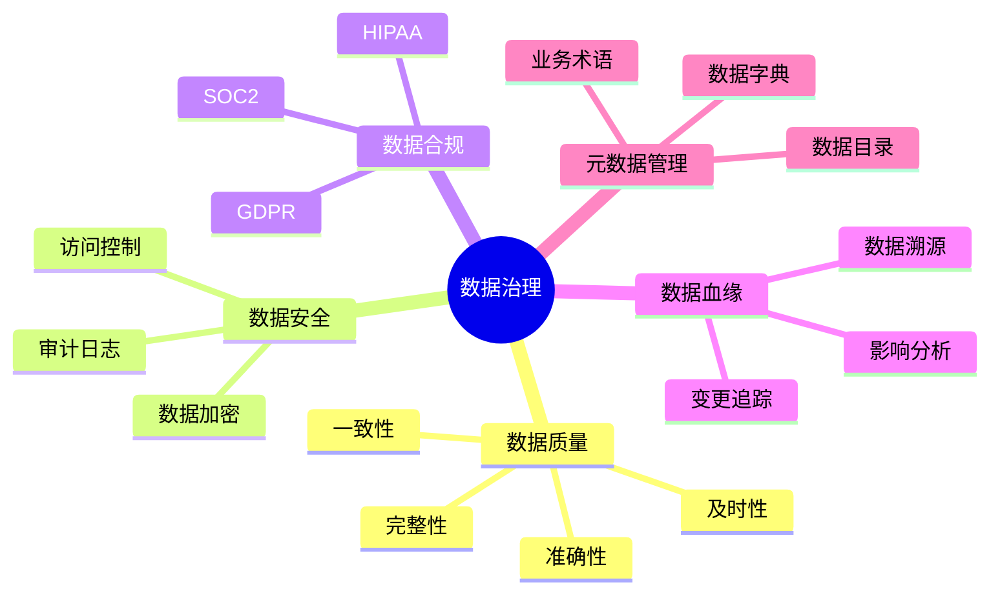
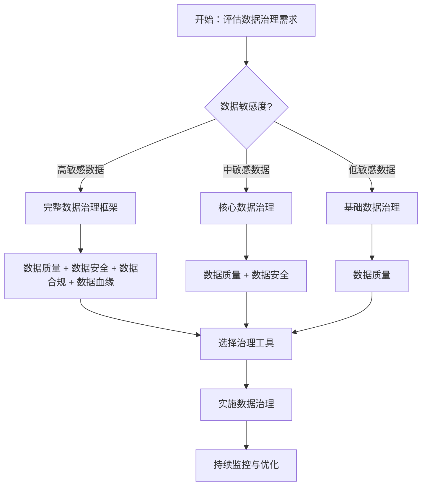

# PostgreSQL数据治理与数据质量完整指南

## 元数据

- **文档版本**: v1.0
- **创建日期**: 2025-01
- **技术栈**: PostgreSQL 17+/18+ | 数据治理 | 数据质量 | 数据血缘 | 合规性
- **难度级别**: ⭐⭐⭐⭐ (高级)
- **预计阅读**: 180分钟
- **前置要求**: 熟悉PostgreSQL基础、数据管理基础

---

## 📋 完整目录

- [PostgreSQL数据治理与数据质量完整指南](#postgresql数据治理与数据质量完整指南)
  - [元数据](#元数据)
  - [📋 完整目录](#-完整目录)
  - [1. 数据治理概述](#1-数据治理概述)
    - [1.1 数据治理框架](#11-数据治理框架)
    - [1.2 数据治理决策流程图](#12-数据治理决策流程图)
  - [2. 数据质量评估方法](#2-数据质量评估方法)
    - [2.1 数据质量维度](#21-数据质量维度)
    - [2.2 数据质量评估实现](#22-数据质量评估实现)
  - [3. 数据质量监控](#3-数据质量监控)
    - [3.1 实时监控场景](#31-实时监控场景)
    - [3.2 自动化监控实现](#32-自动化监控实现)
  - [4. 数据血缘分析](#4-数据血缘分析)
    - [4.1 数据血缘追踪](#41-数据血缘追踪)
  - [5. 数据目录管理](#5-数据目录管理)
    - [5.1 元数据管理](#51-元数据管理)
  - [6. 数据合规性管理](#6-数据合规性管理)
    - [6.1 GDPR合规场景](#61-gdpr合规场景)
    - [6.2 合规性检查实现](#62-合规性检查实现)
  - [7. 综合选型案例](#7-综合选型案例)
    - [7.1 案例1：企业级数据治理系统](#71-案例1企业级数据治理系统)
  - [📚 参考资源](#-参考资源)
    - [官方文档](#官方文档)
    - [相关文档](#相关文档)
  - [📝 更新日志](#-更新日志)

---

## 1. 数据治理概述

### 1.1 数据治理框架

数据治理是确保数据资产得到有效管理和使用的框架和流程。

**核心组件**:



### 1.2 数据治理决策流程图



---

## 2. 数据质量评估方法

### 2.1 数据质量维度

**数据质量六大维度**:

1. **完整性（Completeness）**: 数据是否完整
2. **准确性（Accuracy）**: 数据是否准确
3. **一致性（Consistency）**: 数据是否一致
4. **及时性（Timeliness）**: 数据是否及时
5. **有效性（Validity）**: 数据是否符合规则
6. **唯一性（Uniqueness）**: 数据是否唯一

### 2.2 数据质量评估实现

**完整性评估**:

```sql
-- 创建数据质量评估函数
CREATE OR REPLACE FUNCTION assess_data_quality(
    p_table_name TEXT,
    p_schema_name TEXT DEFAULT 'public'
)
RETURNS TABLE (
    dimension TEXT,
    score NUMERIC,
    issues_count BIGINT,
    total_records BIGINT
) AS $$
BEGIN
    RETURN QUERY
    WITH quality_metrics AS (
        SELECT
            'completeness' AS dimension,
            COUNT(*) FILTER (WHERE required_field IS NOT NULL) * 100.0 / COUNT(*) AS score,
            COUNT(*) FILTER (WHERE required_field IS NULL) AS issues_count,
            COUNT(*) AS total_records
        FROM information_schema.tables t
        JOIN information_schema.columns c ON t.table_name = c.table_name
        WHERE t.table_schema = p_schema_name
          AND t.table_name = p_table_name
    )
    SELECT * FROM quality_metrics;
END;
$$ LANGUAGE plpgsql;
```

---

## 3. 数据质量监控

### 3.1 实时监控场景

**业务需求**:

```text
场景：实时数据质量监控
需求：
1. 实时监控数据质量
2. 自动告警
3. 质量报告
4. 趋势分析
```

### 3.2 自动化监控实现

**监控配置**:

```sql
-- 创建数据质量监控表
CREATE TABLE data_quality_monitoring (
    id BIGSERIAL PRIMARY KEY,
    table_name TEXT NOT NULL,
    dimension TEXT NOT NULL,
    score NUMERIC NOT NULL,
    threshold NUMERIC DEFAULT 95.0,
    status TEXT CHECK (status IN ('PASS', 'WARN', 'FAIL')),
    checked_at TIMESTAMPTZ DEFAULT NOW()
);

-- 创建监控函数
CREATE OR REPLACE FUNCTION monitor_data_quality()
RETURNS void AS $$
DECLARE
    rec RECORD;
    quality_score NUMERIC;
BEGIN
    FOR rec IN SELECT table_name FROM information_schema.tables WHERE table_schema = 'public'
    LOOP
        SELECT score INTO quality_score
        FROM assess_data_quality(rec.table_name);

        INSERT INTO data_quality_monitoring (table_name, dimension, score, status)
        VALUES (
            rec.table_name,
            'overall',
            quality_score,
            CASE
                WHEN quality_score >= 95 THEN 'PASS'
                WHEN quality_score >= 80 THEN 'WARN'
                ELSE 'FAIL'
            END
        );
    END LOOP;
END;
$$ LANGUAGE plpgsql;
```

---

## 4. 数据血缘分析

### 4.1 数据血缘追踪

**血缘追踪实现**:

```sql
-- 创建数据血缘表
CREATE TABLE data_lineage (
    id BIGSERIAL PRIMARY KEY,
    source_table TEXT NOT NULL,
    source_column TEXT,
    target_table TEXT NOT NULL,
    target_column TEXT,
    transformation TEXT,
    created_at TIMESTAMPTZ DEFAULT NOW()
);

-- 血缘查询函数
CREATE OR REPLACE FUNCTION get_lineage(
    p_table_name TEXT,
    p_direction TEXT DEFAULT 'downstream'  -- 'upstream' or 'downstream'
)
RETURNS TABLE (
    level INT,
    table_name TEXT,
    column_name TEXT,
    transformation TEXT
) AS $$
BEGIN
    IF p_direction = 'downstream' THEN
        RETURN QUERY
        WITH RECURSIVE lineage AS (
            SELECT 0 AS level, p_table_name AS table_name, NULL::TEXT AS column_name, NULL::TEXT AS transformation
            UNION ALL
            SELECT l.level + 1, dl.target_table, dl.target_column, dl.transformation
            FROM data_lineage dl
            JOIN lineage l ON dl.source_table = l.table_name
        )
        SELECT * FROM lineage;
    ELSE
        RETURN QUERY
        WITH RECURSIVE lineage AS (
            SELECT 0 AS level, p_table_name AS table_name, NULL::TEXT AS column_name, NULL::TEXT AS transformation
            UNION ALL
            SELECT l.level + 1, dl.source_table, dl.source_column, dl.transformation
            FROM data_lineage dl
            JOIN lineage l ON dl.target_table = l.table_name
        )
        SELECT * FROM lineage;
    END IF;
END;
$$ LANGUAGE plpgsql;
```

---

## 5. 数据目录管理

### 5.1 元数据管理

**元数据目录实现**:

```sql
-- 创建数据目录表
CREATE TABLE data_catalog (
    id BIGSERIAL PRIMARY KEY,
    table_name TEXT NOT NULL,
    column_name TEXT,
    data_type TEXT,
    description TEXT,
    business_owner TEXT,
    technical_owner TEXT,
    classification TEXT,  -- 'PUBLIC', 'INTERNAL', 'CONFIDENTIAL', 'RESTRICTED'
    tags TEXT[],
    created_at TIMESTAMPTZ DEFAULT NOW(),
    updated_at TIMESTAMPTZ DEFAULT NOW()
);

-- 自动同步元数据
CREATE OR REPLACE FUNCTION sync_metadata()
RETURNS void AS $$
DECLARE
    rec RECORD;
BEGIN
    FOR rec IN
        SELECT
            t.table_name,
            c.column_name,
            c.data_type
        FROM information_schema.tables t
        JOIN information_schema.columns c ON t.table_name = c.table_name
        WHERE t.table_schema = 'public'
    LOOP
        INSERT INTO data_catalog (table_name, column_name, data_type)
        VALUES (rec.table_name, rec.column_name, rec.data_type)
        ON CONFLICT (table_name, column_name) DO UPDATE
        SET data_type = EXCLUDED.data_type,
            updated_at = NOW();
    END LOOP;
END;
$$ LANGUAGE plpgsql;
```

---

## 6. 数据合规性管理

### 6.1 GDPR合规场景

**业务需求**:

```text
场景：GDPR合规管理
需求：
1. 数据分类
2. 访问控制
3. 数据删除（被遗忘权）
4. 数据导出
5. 审计日志
```

### 6.2 合规性检查实现

**GDPR合规检查**:

```sql
-- 创建合规性检查表
CREATE TABLE compliance_checks (
    id BIGSERIAL PRIMARY KEY,
    check_type TEXT NOT NULL,  -- 'GDPR', 'HIPAA', 'SOC2'
    table_name TEXT NOT NULL,
    check_result TEXT,  -- 'PASS', 'FAIL', 'WARN'
    issues TEXT[],
    checked_at TIMESTAMPTZ DEFAULT NOW()
);

-- GDPR合规检查函数
CREATE OR REPLACE FUNCTION check_gdpr_compliance()
RETURNS TABLE (
    table_name TEXT,
    compliance_status TEXT,
    issues TEXT[]
) AS $$
DECLARE
    issues_list TEXT[];
BEGIN
    RETURN QUERY
    SELECT
        dc.table_name,
        CASE
            WHEN dc.classification IS NULL THEN 'FAIL'
            WHEN dc.business_owner IS NULL THEN 'WARN'
            ELSE 'PASS'
        END AS compliance_status,
        ARRAY_AGG(
            CASE
                WHEN dc.classification IS NULL THEN 'Missing data classification'
                WHEN dc.business_owner IS NULL THEN 'Missing business owner'
            END
        ) FILTER (WHERE dc.classification IS NULL OR dc.business_owner IS NULL) AS issues
    FROM data_catalog dc
    GROUP BY dc.table_name, dc.classification, dc.business_owner;
END;
$$ LANGUAGE plpgsql;
```

---

## 7. 综合选型案例

### 7.1 案例1：企业级数据治理系统

**业务背景**:

- 大型企业数据治理
- 多数据源
- 严格合规要求

**实现方案**:

```text
架构设计：
1. 数据质量监控（实时监控 + 定期评估）
2. 数据血缘追踪（自动追踪 + 手动补充）
3. 数据目录管理（自动同步 + 业务补充）
4. 合规性管理（GDPR + HIPAA + SOC2）

工具选型：
- 数据质量：PostgreSQL内置 + 自定义函数
- 数据血缘：ProvSQL扩展
- 数据目录：PostgreSQL表 + 前端界面
- 合规性：PostgreSQL RLS + 审计日志
```

---

## 📚 参考资源

### 官方文档

- [PostgreSQL数据质量文档](https://www.postgresql.org/docs/)
- [ProvSQL数据溯源扩展](https://github.com/PierreSenellart/provsql)

### 相关文档

- [数据质量管理指南](../17-数据模型设计/09.05-数据质量管理指南.md)
- [数据溯源与血缘分析完整指南](../05-安全与合规/【深入】数据溯源与血缘分析完整指南.md)
- [数据治理模型](../26-数据管理/README.md)

---

## 📝 更新日志

- **2025-01**: 初始版本创建
  - 完成数据治理框架
  - 完成数据质量评估方法
  - 完成数据质量监控
  - 完成数据血缘分析
  - 完成数据目录管理
  - 完成数据合规性管理

---

**最后更新**: 2025年1月
**状态**: ✅ 完成
