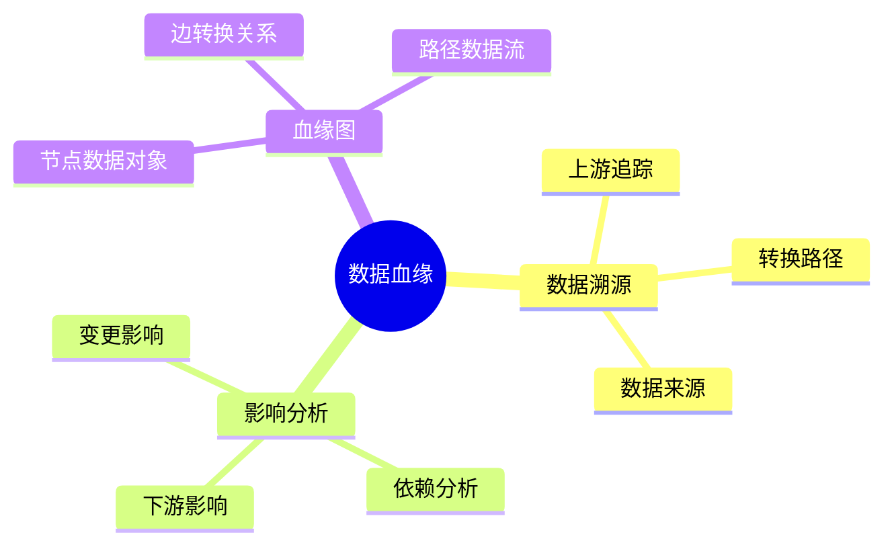
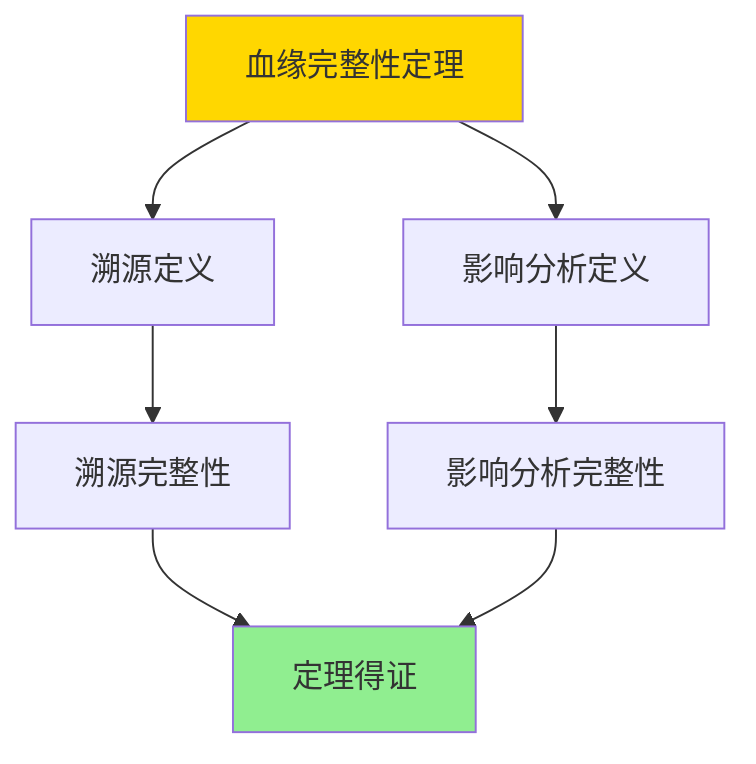

---

> **📋 文档来源**: `DataBaseTheory\12-数据管理模型\12.06-数据库数据血缘模型-数据溯源与影响分析的形式化.md`
> **📅 复制日期**: 2025-12-22
> **⚠️ 注意**: 本文档为复制版本，原文件保持不变

---

# 数据库数据血缘模型-数据溯源与影响分析的形式化

> **文档版本**: v1.0
> **最后更新**: 2025-01-16
> **版本覆盖**: PostgreSQL 18.x (推荐) ⭐ | 17.x (推荐) | 16.x (兼容)
> **文档状态**: ✅ 内容已完成

---

## 📋 目录

- [数据库数据血缘模型-数据溯源与影响分析的形式化](#数据库数据血缘模型-数据溯源与影响分析的形式化)
  - [📋 目录](#-目录)
  - [1. 概述](#1-概述)
    - [1.0 数据库数据血缘模型工作原理概述](#10-数据库数据血缘模型工作原理概述)
    - [1.1 本文档的范围](#11-本文档的范围)
  - [2. 核心内容](#2-核心内容)
    - [2.1 数据溯源](#21-数据溯源)
    - [2.2 影响分析](#22-影响分析)
  - [3. 形式化定义](#3-形式化定义)
    - [3.1 血缘模型形式化](#31-血缘模型形式化)
  - [4. 定理与证明](#4-定理与证明)
    - [4.1 血缘完整性定理](#41-血缘完整性定理)
  - [5. 实际应用](#5-实际应用)
    - [5.1 PostgreSQL 18数据血缘实现](#51-postgresql-18数据血缘实现)
      - [5.1.1 血缘图模型](#511-血缘图模型)
    - [5.2 实际应用场景](#52-实际应用场景)
      - [场景1：数据溯源查询](#场景1数据溯源查询)
      - [场景2：影响分析查询](#场景2影响分析查询)
  - [6. 相关文档](#6-相关文档)
    - [5.1 理论基础文档](#51-理论基础文档)
  - [7. 参考文献](#7-参考文献)
    - [6.1 核心理论文献](#61-核心理论文献)
    - [6.2 PostgreSQL实现相关](#62-postgresql实现相关)
    - [6.3 相关文档](#63-相关文档)

---

## 1. 概述

### 1.0 数据库数据血缘模型工作原理概述

**数据血缘**：

数据血缘追踪数据的来源、转换和依赖关系，支持数据溯源和影响分析。

**血缘模型思维导图**：



### 1.1 本文档的范围

本文档涵盖：

- **数据溯源**：向上追踪数据来源
- **影响分析**：向下分析数据影响
- **实际应用**：数据血缘系统

---

## 2. 核心内容

### 2.1 数据溯源

**溯源算法**：

```haskell
-- 数据溯源
lineage :: DataObject -> [DataObject]
lineage obj =
    let sources = upstream(obj)
    in sources ++ concatMap lineage sources
```

### 2.2 影响分析

**影响分析算法**：

```haskell
-- 影响分析
impact :: DataObject -> [DataObject]
impact obj =
    let dependents = downstream(obj)
    in dependents ++ concatMap impact dependents
```

---

## 3. 形式化定义

### 3.1 血缘模型形式化

**血缘模型**：

```haskell
-- 血缘模型形式化
LineageModel = (O, T, →)
where
    O = data object set
    T = transformation set
    → = transformation relation
```

**溯源和影响分析**：

```haskell
-- 溯源：向上追踪
lineage :: DataObject -> [DataObject]
lineage obj = {o | o →* obj}  -- 所有可达的上游对象

-- 影响分析：向下追踪
impact :: DataObject -> [DataObject]
impact obj = {o | obj →* o}  -- 所有可达的下游对象
```

---

## 4. 定理与证明

### 4.1 血缘完整性定理

**定理1（血缘完整性）**：

对于血缘模型LineageModel = (O, T, →)和数据对象obj ∈ O，溯源lineage(obj)包含所有产生obj的数据对象，影响分析impact(obj)包含所有依赖obj的数据对象。

**形式化表述**：

设血缘模型LineageModel = (O, T, →)，数据对象obj ∈ O。则：

- lineage(obj) = {o ∈ O | o →* obj}（所有上游对象）
- impact(obj) = {o ∈ O | obj →* o}（所有下游对象）

**证明**：

**步骤1：溯源定义**：

- 溯源lineage(obj)定义为所有通过转换关系→可达的上游对象
- 即lineage(obj) = {o ∈ O | o →*obj}，其中→*是→的传递闭包

**步骤2：溯源完整性**：

- 对于任意产生obj的数据对象o：
  - 如果o直接产生obj，则o → obj，因此o ∈ lineage(obj)
  - 如果o间接产生obj（通过中间转换），则o →* obj，因此o ∈ lineage(obj)
  - 因此所有产生obj的对象都在lineage(obj)中

**步骤3：影响分析定义**：

- 影响分析impact(obj)定义为所有通过转换关系→可达的下游对象
- 即impact(obj) = {o ∈ O | obj →* o}

**步骤4：影响分析完整性**：

- 对于任意依赖obj的数据对象o：
  - 如果o直接依赖obj，则obj → o，因此o ∈ impact(obj)
  - 如果o间接依赖obj（通过中间转换），则obj →* o，因此o ∈ impact(obj)
  - 因此所有依赖obj的对象都在impact(obj)中

**步骤5：结论**：

- 血缘完整性定理得证

**证明树**：



---

## 5. 实际应用

### 5.1 PostgreSQL 18数据血缘实现

#### 5.1.1 血缘图模型

**PostgreSQL 18血缘追踪**：

PostgreSQL 18通过递归CTE和图查询实现数据血缘追踪。

**血缘表结构**：

```sql
-- 场景：企业数据血缘系统
-- 1. 创建血缘表
CREATE TABLE data_lineage (
    lineage_id UUID PRIMARY KEY DEFAULT gen_random_uuid(),
    source_object_id UUID NOT NULL,
    target_object_id UUID NOT NULL,
    transformation_type VARCHAR(50) NOT NULL,  -- 'SELECT', 'JOIN', 'AGGREGATE', etc.
    transformation_definition TEXT,
    created_at TIMESTAMPTZ DEFAULT NOW()
);

CREATE INDEX idx_lineage_source ON data_lineage(source_object_id);
CREATE INDEX idx_lineage_target ON data_lineage(target_object_id);

-- 2. 数据对象表
CREATE TABLE data_objects (
    object_id UUID PRIMARY KEY DEFAULT gen_random_uuid(),
    object_name VARCHAR(200) NOT NULL,
    object_type VARCHAR(50) NOT NULL,  -- 'TABLE', 'VIEW', 'COLUMN', etc.
    schema_name VARCHAR(100),
    table_name VARCHAR(200),
    column_name VARCHAR(200),
    created_at TIMESTAMPTZ DEFAULT NOW()
);

CREATE INDEX idx_objects_name ON data_objects(object_name);
CREATE INDEX idx_objects_type ON data_objects(object_type);
```

### 5.2 实际应用场景

#### 场景1：数据溯源查询

**业务背景**：

数据工程师需要追踪报表数据的来源，了解数据是如何从原始表经过多步转换生成的。

**PostgreSQL 18实现**：

```sql
-- 场景：数据溯源查询
-- 1. 完整溯源查询（递归）
CREATE OR REPLACE FUNCTION trace_lineage(
    p_target_object_id UUID,
    p_max_depth INTEGER DEFAULT 10
)
RETURNS TABLE (
    object_id UUID,
    object_name VARCHAR,
    object_type VARCHAR,
    depth INTEGER,
    path UUID[]
) AS $$
BEGIN
    RETURN QUERY
    WITH RECURSIVE lineage_path AS (
        -- 基础情况：目标对象
        SELECT
            do.object_id,
            do.object_name,
            do.object_type,
            0 as depth,
            ARRAY[do.object_id] as path
        FROM data_objects do
        WHERE do.object_id = p_target_object_id

        UNION ALL

        -- 递归情况：上游对象
        SELECT
            do.object_id,
            do.object_name,
            do.object_type,
            lp.depth + 1,
            lp.path || do.object_id
        FROM data_objects do
        JOIN data_lineage dl ON do.object_id = dl.source_object_id
        JOIN lineage_path lp ON dl.target_object_id = lp.object_id
        WHERE lp.depth < p_max_depth
          AND NOT (do.object_id = ANY(lp.path))  -- 防止循环
    )
    SELECT * FROM lineage_path
    ORDER BY depth, object_name;
END;
$$ LANGUAGE plpgsql;

-- 2. 使用示例
SELECT * FROM trace_lineage(
    (SELECT object_id FROM data_objects WHERE object_name = 'sales_report')
);

-- 3. 可视化血缘路径
SELECT
    depth,
    object_name,
    object_type,
    array_to_string(path, ' -> ') as lineage_path
FROM trace_lineage(
    (SELECT object_id FROM data_objects WHERE object_name = 'sales_report')
)
ORDER BY depth;
```

#### 场景2：影响分析查询

**业务背景**：

当修改某个表或列时，需要分析哪些下游对象会受到影响，以便评估变更影响范围。

**PostgreSQL 18实现**：

```sql
-- 场景：影响分析查询
-- 1. 完整影响分析查询（递归）
CREATE OR REPLACE FUNCTION analyze_impact(
    p_source_object_id UUID,
    p_max_depth INTEGER DEFAULT 10
)
RETURNS TABLE (
    object_id UUID,
    object_name VARCHAR,
    object_type VARCHAR,
    depth INTEGER,
    impact_type VARCHAR  -- 'DIRECT', 'INDIRECT'
) AS $$
BEGIN
    RETURN QUERY
    WITH RECURSIVE impact_chain AS (
        -- 基础情况：直接依赖
        SELECT
            do.object_id,
            do.object_name,
            do.object_type,
            1 as depth,
            'DIRECT'::VARCHAR as impact_type
        FROM data_objects do
        JOIN data_lineage dl ON do.object_id = dl.target_object_id
        WHERE dl.source_object_id = p_source_object_id

        UNION ALL

        -- 递归情况：间接依赖
        SELECT
            do.object_id,
            do.object_name,
            do.object_type,
            ic.depth + 1,
            'INDIRECT'::VARCHAR
        FROM data_objects do
        JOIN data_lineage dl ON do.object_id = dl.target_object_id
        JOIN impact_chain ic ON dl.source_object_id = ic.object_id
        WHERE ic.depth < p_max_depth
    )
    SELECT * FROM impact_chain
    ORDER BY depth, impact_type, object_name;
END;
$$ LANGUAGE plpgsql;

-- 2. 使用示例
SELECT * FROM analyze_impact(
    (SELECT object_id FROM data_objects WHERE object_name = 'customers' AND column_name = 'email')
);

-- 3. 影响分析报告
SELECT
    impact_type,
    object_type,
    COUNT(*) as affected_count,
    array_agg(object_name ORDER BY object_name) as affected_objects
FROM analyze_impact(
    (SELECT object_id FROM data_objects WHERE object_name = 'customers' AND column_name = 'email')
)
GROUP BY impact_type, object_type
ORDER BY impact_type, object_type;
```

---

---

## 6. 相关文档

### 5.1 理论基础文档

- [形式语言与证明：总论](./1.1.25-形式语言与证明-总论.md)
- [理论基础导航](./README.md)

---

## 7. 参考文献

### 6.1 核心理论文献

- **Buneman, P., et al. (2001). "Why and Where: A Characterization of Data Provenance."**
  - 会议: ICDT 2001
  - **重要性**: 数据血缘的经典论文
  - **核心贡献**: 提出了溯源和影响分析

- **Cheney, J., et al. (2009). "Provenance in Databases: Why, How, and Where."**
  - 会议: Foundations and Trends in Databases 2009
  - **重要性**: 数据血缘的综述
  - **核心贡献**: 总结了血缘追踪方法

### 6.2 PostgreSQL实现相关

- **PostgreSQL扩展 - 数据血缘](<https://github.com/postgresql/data-lineage>)**
  - PostgreSQL数据血缘扩展

### 6.3 相关文档

- [数据血缘-why_where_how形式语义](./12.01-数据血缘-why_where_how形式语义.md)
- [理论基础导航](../README.md)

---

**最后更新**: 2025-01-16
**维护者**: Documentation Team
**状态**: ✅ 内容已完成
