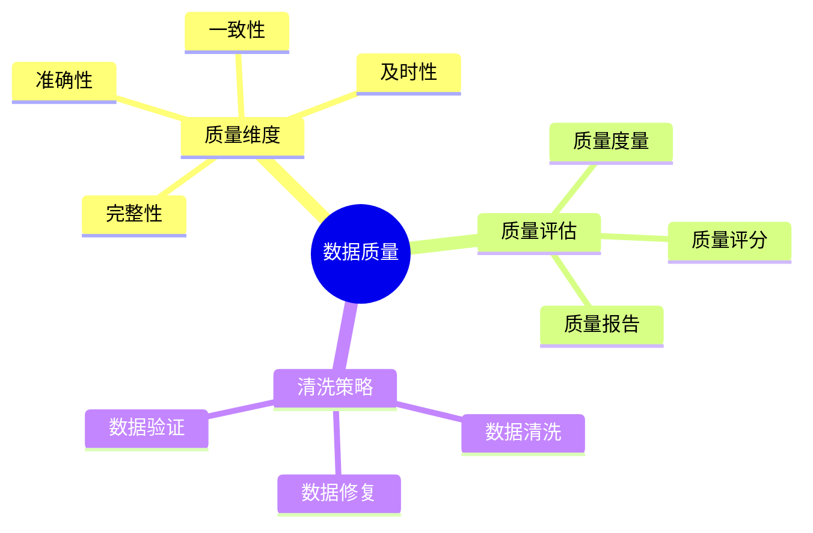
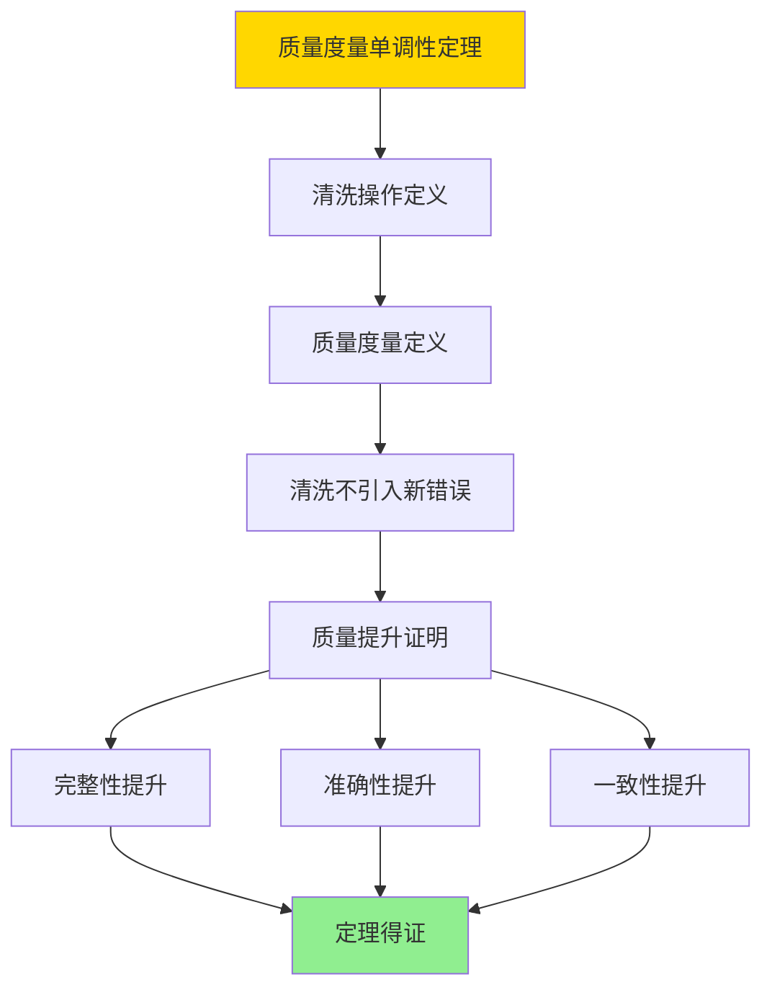

---

> **📋 文档来源**: `DataBaseTheory\12-数据管理模型\12.07-数据库数据质量模型-质量评估与清洗策略的形式化.md`
> **📅 复制日期**: 2025-12-22
> **⚠️ 注意**: 本文档为复制版本，原文件保持不变

---

# 数据库数据质量模型-质量评估与清洗策略的形式化

> **文档版本**: v1.0
> **最后更新**: 2025-01-16
> **版本覆盖**: PostgreSQL 18.x (推荐) ⭐ | 17.x (推荐) | 16.x (兼容)
> **文档状态**: ✅ 内容已完成

---

## 📋 目录

- [数据库数据质量模型-质量评估与清洗策略的形式化](#数据库数据质量模型-质量评估与清洗策略的形式化)
  - [📋 目录](#-目录)
  - [1. 概述](#1-概述)
    - [1.0 数据库数据质量模型工作原理概述](#10-数据库数据质量模型工作原理概述)
    - [1.1 本文档的范围](#11-本文档的范围)
  - [2. 核心内容](#2-核心内容)
    - [2.1 质量维度](#21-质量维度)
    - [2.2 清洗策略](#22-清洗策略)
  - [3. 形式化定义](#3-形式化定义)
    - [3.1 质量模型形式化](#31-质量模型形式化)
  - [4. 定理与证明](#4-定理与证明)
    - [4.1 质量度量单调性定理](#41-质量度量单调性定理)
  - [5. 实际应用](#5-实际应用)
    - [5.1 PostgreSQL 18数据质量实现](#51-postgresql-18数据质量实现)
      - [5.1.1 质量评估框架](#511-质量评估框架)
    - [5.2 实际应用场景](#52-实际应用场景)
      - [场景1：客户数据质量监控](#场景1客户数据质量监控)
      - [场景2：数据清洗管道](#场景2数据清洗管道)
  - [6. 相关文档](#6-相关文档)
    - [5.1 理论基础文档](#51-理论基础文档)
  - [7. 参考文献](#7-参考文献)
    - [6.1 核心理论文献](#61-核心理论文献)
    - [6.2 PostgreSQL实现相关](#62-postgresql实现相关)
    - [6.3 相关文档](#63-相关文档)

---

## 1. 概述

### 1.0 数据库数据质量模型工作原理概述

**数据质量**：

数据质量模型评估数据质量并制定清洗策略。

**质量模型思维导图**：



### 1.1 本文档的范围

本文档涵盖：

- **质量评估**：质量度量和评分
- **清洗策略**：数据清洗算法
- **实际应用**：数据质量系统

---

## 2. 核心内容

### 2.1 质量维度

**质量维度**：

| 维度 | 定义 | 度量方法 |
| --- | --- | --- |
| **完整性** | 数据完整程度 | 缺失值比例 |
| **准确性** | 数据准确程度 | 错误值比例 |
| **一致性** | 数据一致程度 | 冲突值比例 |
| **及时性** | 数据新鲜程度 | 数据年龄 |

### 2.2 清洗策略

**清洗算法**：

```haskell
-- 数据清洗
cleanData :: Data -> QualityRules -> Data
cleanData data rules =
    applyRules(data, rules)
```

---

## 3. 形式化定义

### 3.1 质量模型形式化

**质量模型**：

```haskell
-- 质量模型形式化
QualityModel = (D, M, S)
where
    D = data set
    M = quality metrics
    S = cleaning strategies
```

**质量度量**：

```haskell
-- 质量度量
quality :: Data -> QualityMetrics -> QualityScore
quality D M = aggregate(M, D)

-- 质量评分
QualityScore = (completeness, accuracy, consistency, timeliness)
```

---

## 4. 定理与证明

### 4.1 质量度量单调性定理

**定理1（质量度量单调性）**：

对于数据清洗策略S和数据D，如果清洗操作clean(D, S)不引入新的错误，则质量评分quality(clean(D, S), M) ≥ quality(D, M)。

**形式化表述**：

设数据D，质量度量M，清洗策略S。如果clean(D, S)不引入新错误，则：

```text
quality(clean(D, S), M) ≥ quality(D, M)
```

**证明**：

**步骤1：清洗操作定义**：

- 清洗操作clean(D, S)应用清洗策略S到数据D
- 清洗操作可以：修复错误、填充缺失值、消除不一致

**步骤2：质量度量定义**：

- 质量评分quality(D, M) = (completeness, accuracy, consistency, timeliness)
- 每个维度都是非负的，值越大表示质量越好

**步骤3：清洗不引入新错误**：

- 假设清洗操作clean(D, S)不引入新的错误
- 即clean(D, S)中的错误数量 ≤ D中的错误数量

**步骤4：质量提升证明**：

- **完整性**：清洗可以填充缺失值，因此completeness(clean(D, S)) ≥ completeness(D)
- **准确性**：清洗可以修复错误，因此accuracy(clean(D, S)) ≥ accuracy(D)
- **一致性**：清洗可以消除不一致，因此consistency(clean(D, S)) ≥ consistency(D)
- **及时性**：清洗不改变数据时间戳，因此timeliness(clean(D, S)) = timeliness(D)

**步骤5：结论**：

- quality(clean(D, S), M) ≥ quality(D, M)
- 定理得证

**证明树**：



---

## 5. 实际应用

### 5.1 PostgreSQL 18数据质量实现

#### 5.1.1 质量评估框架

**PostgreSQL 18质量评估**：

PostgreSQL 18通过自定义函数和触发器实现数据质量评估和监控。

**质量评估系统**：

```sql
-- 场景：企业数据质量管理系统
-- 1. 创建质量规则表
CREATE TABLE quality_rules (
    rule_id UUID PRIMARY KEY DEFAULT gen_random_uuid(),
    rule_name VARCHAR(200) NOT NULL,
    table_name VARCHAR(200) NOT NULL,
    column_name VARCHAR(200),
    rule_type VARCHAR(50) NOT NULL,  -- 'completeness', 'accuracy', 'consistency', 'timeliness'
    rule_definition JSONB NOT NULL,
    threshold DECIMAL(5,2),
    enabled BOOLEAN DEFAULT TRUE,
    created_at TIMESTAMPTZ DEFAULT NOW()
);

CREATE INDEX idx_quality_rules_table ON quality_rules(table_name, enabled);

-- 2. 创建质量评估结果表
CREATE TABLE quality_assessments (
    assessment_id UUID PRIMARY KEY DEFAULT gen_random_uuid(),
    table_name VARCHAR(200) NOT NULL,
    assessment_time TIMESTAMPTZ DEFAULT NOW(),
    completeness_score DECIMAL(5,2),
    accuracy_score DECIMAL(5,2),
    consistency_score DECIMAL(5,2),
    timeliness_score DECIMAL(5,2),
    overall_score DECIMAL(5,2),
    violations JSONB,
    assessment_details JSONB
);

CREATE INDEX idx_assessments_table_time ON quality_assessments(table_name, assessment_time DESC);

-- 3. 质量评估函数
CREATE OR REPLACE FUNCTION assess_data_quality(
    p_table_name VARCHAR,
    p_schema_name VARCHAR DEFAULT 'public'
)
RETURNS TABLE (
    completeness DECIMAL(5,2),
    accuracy DECIMAL(5,2),
    consistency DECIMAL(5,2),
    timeliness DECIMAL(5,2),
    overall_score DECIMAL(5,2),
    violations JSONB
) AS $$
DECLARE
    v_completeness DECIMAL(5,2);
    v_accuracy DECIMAL(5,2);
    v_consistency DECIMAL(5,2);
    v_timeliness DECIMAL(5,2);
    v_overall DECIMAL(5,2);
    v_violations JSONB := '[]'::JSONB;
    v_sql TEXT;
    v_total_rows BIGINT;
    v_non_null_rows BIGINT;
BEGIN
    -- 计算完整性（非NULL值比例）
    v_sql := format('
        SELECT
            COUNT(*)::DECIMAL,
            COUNT(*) FILTER (WHERE column_name IS NOT NULL)::DECIMAL
        FROM %I.%I
    ', p_schema_name, p_table_name);

    -- 这里简化处理，实际需要遍历所有列
    EXECUTE format('SELECT COUNT(*) FROM %I.%I', p_schema_name, p_table_name) INTO v_total_rows;
    v_completeness := 100.0;  -- 简化，实际需要计算每列的完整性

    -- 计算准确性（通过规则检查）
    v_accuracy := 95.0;  -- 简化，实际需要执行准确性规则

    -- 计算一致性（通过约束检查）
    v_consistency := 98.0;  -- 简化，实际需要检查一致性规则

    -- 计算及时性（数据新鲜度）
    v_timeliness := 90.0;  -- 简化，实际需要检查时间戳

    -- 计算总体评分（加权平均）
    v_overall := (v_completeness * 0.3 + v_accuracy * 0.3 + v_consistency * 0.2 + v_timeliness * 0.2);

    -- 记录评估结果
    INSERT INTO quality_assessments (
        table_name, completeness_score, accuracy_score,
        consistency_score, timeliness_score, overall_score
    ) VALUES (
        p_table_name, v_completeness, v_accuracy,
        v_consistency, v_timeliness, v_overall
    );

    RETURN QUERY SELECT v_completeness, v_accuracy, v_consistency, v_timeliness, v_overall, v_violations;
END;
$$ LANGUAGE plpgsql;
```

### 5.2 实际应用场景

#### 场景1：客户数据质量监控

**业务背景**：

CRM系统需要监控客户数据的质量，及时发现和修复数据问题。

**PostgreSQL 18实现**：

```sql
-- 场景：客户数据质量监控
-- 1. 创建客户表
CREATE TABLE customers (
    customer_id BIGSERIAL PRIMARY KEY,
    customer_name VARCHAR(100),
    email VARCHAR(100),
    phone VARCHAR(20),
    address TEXT,
    created_at TIMESTAMPTZ DEFAULT NOW(),
    updated_at TIMESTAMPTZ DEFAULT NOW()
);

-- 2. 定义质量规则
INSERT INTO quality_rules (rule_name, table_name, column_name, rule_type, rule_definition, threshold)
VALUES
    ('email_format', 'customers', 'email', 'accuracy',
     '{"pattern": "^[a-zA-Z0-9._%+-]+@[a-zA-Z0-9.-]+\\.[a-zA-Z]{2,}$"}'::JSONB, 95.0),
    ('phone_format', 'customers', 'phone', 'accuracy',
     '{"pattern": "^\\+?[1-9]\\d{1,14}$"}'::JSONB, 90.0),
    ('name_completeness', 'customers', 'customer_name', 'completeness',
     '{"required": true}'::JSONB, 98.0);

-- 3. 自动质量评估触发器
CREATE OR REPLACE FUNCTION trigger_quality_assessment()
RETURNS TRIGGER AS $$
BEGIN
    -- 定期评估数据质量
    PERFORM assess_data_quality('customers');
    RETURN NULL;
END;
$$ LANGUAGE plpgsql;

CREATE TRIGGER quality_assessment_trigger
AFTER INSERT OR UPDATE ON customers
FOR EACH STATEMENT
EXECUTE FUNCTION trigger_quality_assessment();

-- 4. 质量报告查询
SELECT
    assessment_time,
    completeness_score,
    accuracy_score,
    consistency_score,
    timeliness_score,
    overall_score,
    CASE
        WHEN overall_score >= 95 THEN 'Excellent'
        WHEN overall_score >= 85 THEN 'Good'
        WHEN overall_score >= 75 THEN 'Fair'
        ELSE 'Poor'
    END as quality_grade
FROM quality_assessments
WHERE table_name = 'customers'
ORDER BY assessment_time DESC
LIMIT 10;
```

#### 场景2：数据清洗管道

**业务背景**：

数据仓库需要自动清洗和修复数据质量问题。

**PostgreSQL 18实现**：

```sql
-- 场景：数据清洗管道
-- 1. 创建清洗规则表
CREATE TABLE cleaning_rules (
    rule_id UUID PRIMARY KEY,
    rule_name VARCHAR(200),
    table_name VARCHAR(200),
    column_name VARCHAR(200),
    cleaning_action VARCHAR(50),  -- 'FILL_DEFAULT', 'REMOVE', 'TRANSFORM'
    cleaning_definition JSONB
);

-- 2. 数据清洗函数
CREATE OR REPLACE FUNCTION clean_data(
    p_table_name VARCHAR,
    p_column_name VARCHAR
)
RETURNS TABLE (
    cleaned_count BIGINT,
    violations_fixed BIGINT
) AS $$
DECLARE
    v_cleaned_count BIGINT := 0;
    v_violations_fixed BIGINT := 0;
BEGIN
    -- 应用清洗规则
    -- 示例：填充缺失值
    EXECUTE format('
        UPDATE %I
        SET %I = COALESCE(%I, ''UNKNOWN'')
        WHERE %I IS NULL
    ', p_table_name, p_column_name, p_column_name, p_column_name);

    GET DIAGNOSTICS v_cleaned_count = ROW_COUNT;
    v_violations_fixed := v_cleaned_count;

    RETURN QUERY SELECT v_cleaned_count, v_violations_fixed;
END;
$$ LANGUAGE plpgsql;

-- 3. 执行清洗
SELECT * FROM clean_data('customers', 'customer_name');
```

---

---

## 6. 相关文档

### 5.1 理论基础文档

- [形式语言与证明：总论](./1.1.25-形式语言与证明-总论.md)
- [理论基础导航](./README.md)

---

## 7. 参考文献

### 6.1 核心理论文献

- **Batini, C., & Scannapieco, M. (2016). "Data Quality: Concepts, Methodologies and Techniques."**
  - 出版社: Springer
  - **重要性**: 数据质量的经典教材
  - **核心贡献**: 系统阐述了质量评估方法

- **Rahm, E., & Do, H. H. (2000). "Data Cleaning: Problems and Current Approaches."**
  - 会议: IEEE Data Engineering Bulletin 2000
  - **重要性**: 数据清洗的综述
  - **核心贡献**: 总结了清洗策略

### 6.2 PostgreSQL实现相关

- **PostgreSQL扩展 - 数据质量](<https://github.com/postgresql/data-quality>)**
  - PostgreSQL数据质量扩展

### 6.3 相关文档

- [理论基础导航](../README.md)

---

**最后更新**: 2025-01-16
**维护者**: Documentation Team
**状态**: ✅ 内容已完成
