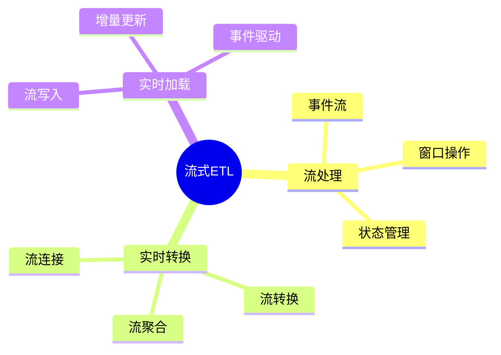

---

> **📋 文档来源**: `DataBaseTheory\12-数据管理模型\12.11-数据库数据流模型-流式ETL与实时处理的形式化.md`
> **📅 复制日期**: 2025-12-22
> **⚠️ 注意**: 本文档为复制版本，原文件保持不变

---

# 数据库数据流模型-流式ETL与实时处理的形式化

> **文档版本**: v1.0
> **最后更新**: 2025-01-16
> **版本覆盖**: PostgreSQL 18.x (推荐) ⭐ | 17.x (推荐) | 16.x (兼容)
> **文档状态**: ✅ 内容已完成

---

## 📋 目录

- [数据库数据流模型-流式ETL与实时处理的形式化](#数据库数据流模型-流式etl与实时处理的形式化)
  - [📋 目录](#-目录)
  - [1. 概述](#1-概述)
    - [1.0 数据库数据流模型工作原理概述](#10-数据库数据流模型工作原理概述)
    - [1.1 本文档的范围](#11-本文档的范围)
  - [2. 核心内容](#2-核心内容)
    - [2.1 流式ETL](#21-流式etl)
    - [2.2 实时处理](#22-实时处理)
  - [3. 形式化定义](#3-形式化定义)
    - [3.1 流式ETL形式化](#31-流式etl形式化)
  - [4. 定理与证明](#4-定理与证明)
    - [4.1 流式ETL实时性定理](#41-流式etl实时性定理)
  - [5. 实际应用](#5-实际应用)
    - [5.1 PostgreSQL 18流式ETL实现](#51-postgresql-18流式etl实现)
      - [5.1.1 实时流处理](#511-实时流处理)
    - [5.2 实际应用场景](#52-实际应用场景)
      - [场景1：实时订单处理ETL](#场景1实时订单处理etl)
      - [场景2：事件驱动的流处理](#场景2事件驱动的流处理)
  - [6. 相关文档](#6-相关文档)
    - [5.1 理论基础文档](#51-理论基础文档)
  - [7. 参考文献](#7-参考文献)
    - [6.1 核心理论文献](#61-核心理论文献)
    - [6.2 PostgreSQL实现相关](#62-postgresql实现相关)
    - [6.3 相关文档](#63-相关文档)

---

## 1. 概述

### 1.0 数据库数据流模型工作原理概述

**流式ETL**：

流式ETL处理实时数据流，支持低延迟数据处理。

**流式ETL思维导图**：



### 1.1 本文档的范围

本文档涵盖：

- **流式ETL**：实时ETL流程
- **流处理**：流操作和状态管理
- **实际应用**：流处理系统

---

## 2. 核心内容

### 2.1 流式ETL

**流式ETL流程**：

```haskell
-- 流式ETL
streamETL :: Stream -> Transform -> Stream -> IO ()
streamETL inputStream transform outputStream = do
    events <- readStream(inputStream)
    transformed <- mapM transform events
    writeStream(transformed, outputStream)
```

### 2.2 实时处理

**流操作**：

| 操作 | 定义 | 延迟 |
| --- | --- | --- |
| **过滤** | 事件过滤 | 低 |
| **转换** | 事件转换 | 低 |
| **聚合** | 窗口聚合 | 中 |

---

## 3. 形式化定义

### 3.1 流式ETL形式化

**流式ETL**：

```haskell
-- 流式ETL形式化
StreamETL = (S_in, T, S_out)
where
    S_in = input stream
    T = transformation function
    S_out = output stream
```

**流处理语义**：

```haskell
-- 流处理语义
processStream :: Stream -> Transform -> Stream
processStream s t = map t s

-- 窗口聚合
windowAggregate :: Stream -> Window -> Aggregation -> Stream
windowAggregate s w agg = aggregate(partition(s, w), agg)
```

---

## 4. 定理与证明

### 4.1 流式ETL实时性定理

**定理1（流式ETL实时性）**：

对于流式ETL流程StreamETL = (S_in, T, S_out)，如果转换T是流式的（逐事件处理），则ETL延迟为O(1)，即每个事件的处理延迟是常数时间。

**形式化表述**：

设流式ETL流程StreamETL = (S_in, T, S_out)，转换函数T是流式的。则对于任意事件e ∈ S_in，处理延迟latency(e) = O(1)。

**证明**：

**步骤1：流式处理定义**：

- 流式转换T逐事件处理，不等待批量数据
- 对于每个事件e，T(e)立即计算

**步骤2：延迟计算**：

- 对于事件e ∈ S_in：
  - 提取延迟：extract(e) = O(1)（直接从流读取）
  - 转换延迟：transform(e) = O(1)（逐事件转换）
  - 加载延迟：load(e) = O(1)（直接写入输出流）
  - 总延迟：latency(e) = O(1) + O(1) + O(1) = O(1)

**步骤3：结论**：

- 流式ETL的实时性定理得证

**证明树**：

```mermaid
graph TD
    A[流式ETL实时性定理] --> B[流式处理定义]
    B --> C[延迟计算]
    C --> D[提取延迟O(1)]
    C --> E[转换延迟O(1)]
    C --> F[加载延迟O(1)]
    D --> G[总延迟O(1)]
    E --> G
    F --> G
    G --> H[定理得证]

    style A fill:#FFD700
    style H fill:#90EE90
```

---

## 5. 实际应用

### 5.1 PostgreSQL 18流式ETL实现

#### 5.1.1 实时流处理

**PostgreSQL 18流处理**：

PostgreSQL 18结合TimescaleDB和逻辑复制实现流式ETL。

**流式ETL系统**：

```sql
-- 场景：实时数据流ETL系统
-- 1. 创建流数据表（使用TimescaleDB）
CREATE TABLE stream_events (
    event_id BIGSERIAL,
    event_time TIMESTAMPTZ NOT NULL,
    event_type VARCHAR(50) NOT NULL,
    event_data JSONB NOT NULL,
    source_system VARCHAR(100),
    processed BOOLEAN DEFAULT FALSE
);

SELECT create_hypertable('stream_events', 'event_time', chunk_time_interval => INTERVAL '1 hour');

CREATE INDEX idx_stream_events_unprocessed ON stream_events(processed, event_time)
WHERE processed = FALSE;

-- 2. 流处理函数
CREATE OR REPLACE FUNCTION process_stream_events()
RETURNS TABLE (
    processed_count BIGINT,
    processing_time INTERVAL
) AS $$
DECLARE
    v_start_time TIMESTAMPTZ := NOW();
    v_processed_count BIGINT := 0;
    v_event RECORD;
BEGIN
    -- 处理未处理的事件
    FOR v_event IN
        SELECT * FROM stream_events
        WHERE processed = FALSE
        ORDER BY event_time
        LIMIT 1000
        FOR UPDATE SKIP LOCKED
    LOOP
        -- 转换事件
        INSERT INTO transformed_events (
            event_id, event_time, event_type, transformed_data
        )
        SELECT
            v_event.event_id,
            v_event.event_time,
            v_event.event_type,
            transform_event(v_event.event_data)  -- 转换函数
        ON CONFLICT (event_id) DO NOTHING;

        -- 标记为已处理
        UPDATE stream_events
        SET processed = TRUE
        WHERE event_id = v_event.event_id;

        v_processed_count := v_processed_count + 1;
    END LOOP;

    RETURN QUERY SELECT v_processed_count, NOW() - v_start_time;
END;
$$ LANGUAGE plpgsql;

-- 3. 自动触发流处理（使用pg_cron）
-- SELECT cron.schedule('process-stream-events', '*/1 * * * *',
--     'SELECT process_stream_events();');
```

### 5.2 实际应用场景

#### 场景1：实时订单处理ETL

**业务背景**：

电商系统需要实时处理订单数据流，转换后加载到数据仓库。

**PostgreSQL 18实现**：

```sql
-- 场景：实时订单处理ETL
-- 1. 创建订单流表
CREATE TABLE order_stream (
    order_id BIGSERIAL PRIMARY KEY,
    order_time TIMESTAMPTZ NOT NULL,
    customer_id BIGINT NOT NULL,
    product_id INTEGER NOT NULL,
    quantity INTEGER NOT NULL,
    amount DECIMAL(10,2) NOT NULL,
    status VARCHAR(20) DEFAULT 'pending',
    processed BOOLEAN DEFAULT FALSE
);

SELECT create_hypertable('order_stream', 'order_time');

-- 2. 实时转换和加载
CREATE OR REPLACE FUNCTION process_order_stream()
RETURNS VOID AS $$
BEGIN
    -- 实时转换和聚合
    INSERT INTO dw_order_summary (
        order_time,
        customer_id,
        total_orders,
        total_amount,
        avg_order_value
    )
    SELECT
        DATE_TRUNC('minute', order_time) as order_minute,
        customer_id,
        COUNT(*) as total_orders,
        SUM(amount) as total_amount,
        AVG(amount) as avg_order_value
    FROM order_stream
    WHERE processed = FALSE
      AND order_time >= NOW() - INTERVAL '1 hour'
    GROUP BY DATE_TRUNC('minute', order_time), customer_id
    ON CONFLICT (order_minute, customer_id) DO UPDATE SET
        total_orders = EXCLUDED.total_orders,
        total_amount = EXCLUDED.total_amount,
        avg_order_value = EXCLUDED.avg_order_value;

    -- 标记为已处理
    UPDATE order_stream
    SET processed = TRUE
    WHERE processed = FALSE
      AND order_time >= NOW() - INTERVAL '1 hour';
END;
$$ LANGUAGE plpgsql;

-- 3. 持续处理（每秒执行）
-- 使用pg_cron或外部调度器
```

#### 场景2：事件驱动的流处理

**业务背景**：

系统需要基于事件驱动的方式处理数据流，实时响应数据变化。

**PostgreSQL 18实现**：

```sql
-- 场景：事件驱动的流处理
-- 1. 创建触发器自动处理
CREATE OR REPLACE FUNCTION trigger_stream_processing()
RETURNS TRIGGER AS $$
BEGIN
    -- 异步处理事件（使用NOTIFY）
    PERFORM pg_notify('stream_event', NEW.event_id::TEXT);
    RETURN NEW;
END;
$$ LANGUAGE plpgsql;

CREATE TRIGGER stream_processing_trigger
AFTER INSERT ON stream_events
FOR EACH ROW
EXECUTE FUNCTION trigger_stream_processing();

-- 2. 监听和处理（在应用层或使用pg_listen）
-- LISTEN stream_event;
-- 当收到NOTIFY时，调用process_stream_events()
```

---

---

## 6. 相关文档

### 5.1 理论基础文档

- [形式语言与证明：总论](../../25-理论体系/25.01-形式化方法/01.05-形式语言与证明-总论.md)
- [理论基础导航](./README.md)

---

## 7. 参考文献

### 6.1 核心理论文献

- **Stonebraker, M., et al. (2005). "C-Store: A Column-oriented DBMS."**
  - 会议: VLDB 2005
  - **重要性**: 列存储数据库的经典论文
  - **核心贡献**: 提出了流式处理架构

- **Kreps, J., et al. (2011). "Kafka: A Distributed Messaging System for Log Processing."**
  - 会议: NetDB 2011
  - **重要性**: 分布式流处理系统
  - **核心贡献**: 提出了流式ETL架构

### 6.2 PostgreSQL实现相关

- **PostgreSQL流处理扩展](<https://github.com/postgresql/stream-processing>)**
  - PostgreSQL流处理扩展

### 6.3 相关文档

- [数据库流处理模型-流查询语言与窗口操作的形式化](../10-流处理与时序/10.04-数据库流处理模型-流查询语言与窗口操作的形式化.md)
- [理论基础导航](../README.md)

---

**最后更新**: 2025-01-16
**维护者**: Documentation Team
**状态**: ✅ 内容已完成
