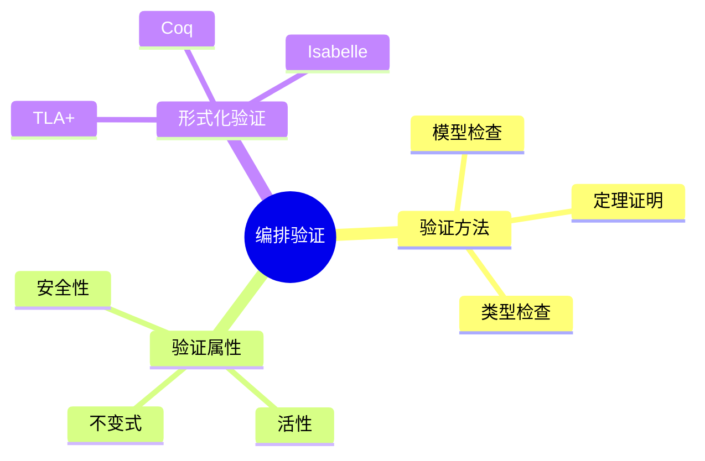
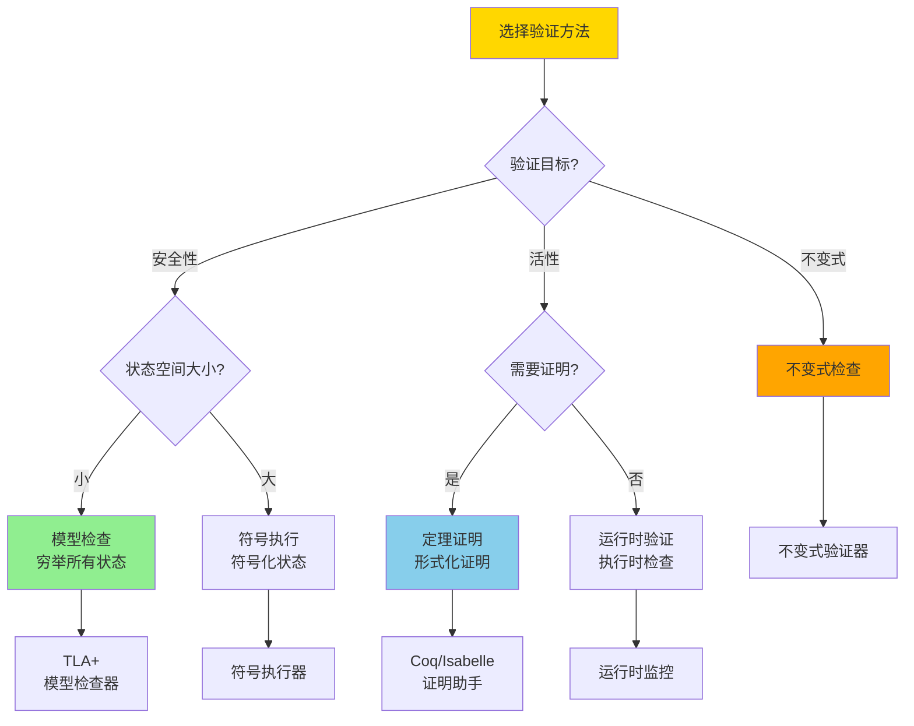
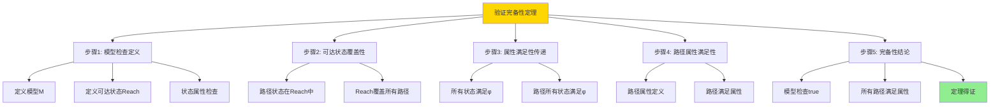

---

> **📋 文档来源**: `DataBaseTheory\13-数据编排\13.04-数据库数据编排模型-编排验证与形式化验证的形式化.md`
> **📅 复制日期**: 2025-12-22
> **⚠️ 注意**: 本文档为复制版本，原文件保持不变

---

# 数据库数据编排模型-编排验证与形式化验证的形式化

> **文档版本**: v1.0
> **最后更新**: 2025-01-16
> **版本覆盖**: PostgreSQL 18.x (推荐) ⭐ | 17.x (推荐) | 16.x (兼容)
> **文档状态**: ✅ 内容已完成

---

## 📋 目录

- [数据库数据编排模型-编排验证与形式化验证的形式化](#数据库数据编排模型-编排验证与形式化验证的形式化)
  - [📋 目录](#-目录)
  - [1. 概述](#1-概述)
    - [1.0 数据库数据编排模型工作原理概述](#10-数据库数据编排模型工作原理概述)
    - [1.1 本文档的范围](#11-本文档的范围)
  - [2. 核心内容](#2-核心内容)
    - [2.1 验证方法](#21-验证方法)
    - [2.2 验证属性](#22-验证属性)
    - [2.3 验证方法选择决策树](#23-验证方法选择决策树)
    - [2.4 验证方法对比矩阵](#24-验证方法对比矩阵)
  - [3. 形式化定义](#3-形式化定义)
    - [3.1 验证形式化](#31-验证形式化)
  - [4. 定理与证明](#4-定理与证明)
    - [4.1 验证完备性定理](#41-验证完备性定理)
  - [5. 实际应用](#5-实际应用)
    - [5.1 PostgreSQL 18编排验证实现](#51-postgresql-18编排验证实现)
      - [5.1.1 验证框架](#511-验证框架)
    - [5.2 实际应用场景](#52-实际应用场景)
      - [场景1：工作流安全性验证](#场景1工作流安全性验证)
      - [场景2：TLA+形式化验证](#场景2tla形式化验证)
  - [6. 相关文档](#6-相关文档)
    - [5.1 理论基础文档](#51-理论基础文档)
  - [7. 参考文献](#7-参考文献)
    - [6.1 核心理论文献](#61-核心理论文献)
    - [6.2 PostgreSQL实现相关](#62-postgresql实现相关)
    - [6.3 相关文档](#63-相关文档)

---

## 1. 概述

### 1.0 数据库数据编排模型工作原理概述

**编排验证**：

编排验证使用形式化方法验证编排的正确性。

**验证模型思维导图**：



### 1.1 本文档的范围

本文档涵盖：

- **验证方法**：模型检查和定理证明
- **验证属性**：安全性和活性
- **实际应用**：验证工具

---

## 2. 核心内容

### 2.1 验证方法

**模型检查**：

```haskell
-- 模型检查
modelCheck :: Model -> Property -> Bool
modelCheck model property =
    checkAllStates(model, property)
```

### 2.2 验证属性

**属性类型**：

| 类型 | 定义 | 验证方法 | 示例 |
| --- | --- | --- | --- |
| **安全性** | 坏状态永不出现 | 可达性分析 | 死锁检测、资源泄漏检测 |
| **活性** | 好状态最终出现 | 公平性检查 | 任务完成保证、进度保证 |
| **不变式** | 状态始终满足条件 | 不变式检查 | 数据一致性、资源约束 |

### 2.3 验证方法选择决策树



### 2.4 验证方法对比矩阵

| 维度 | 模型检查 | 定理证明 | 类型检查 | 运行时验证 |
| --- | --- | --- | --- | --- |
| **验证能力** | ⭐⭐⭐⭐ 强 | ⭐⭐⭐⭐⭐ 最强 | ⭐⭐⭐ 中 | ⭐⭐ 弱 |
| **自动化程度** | ⭐⭐⭐⭐⭐ 完全自动 | ⭐⭐ 需要人工 | ⭐⭐⭐⭐ 高度自动 | ⭐⭐⭐⭐⭐ 完全自动 |
| **状态空间限制** | ⭐⭐ 受限于状态数 | ⭐⭐⭐⭐⭐ 无限制 | ⭐⭐⭐⭐ 无限制 | ⭐⭐⭐⭐⭐ 无限制 |
| **验证时间** | ⭐⭐ 可能很长 | ⭐⭐⭐ 中等 | ⭐⭐⭐⭐⭐ 快速 | ⭐⭐⭐⭐ 实时 |
| **误报率** | ⭐⭐⭐⭐⭐ 无 | ⭐⭐⭐⭐⭐ 无 | ⭐⭐⭐ 低 | ⭐⭐ 可能高 |
| **适用场景** | 小到中等系统 | 关键系统 | 类型安全 | 运行时监控 |
| **工具示例** | TLA+, SPIN | Coq, Isabelle | TypeScript, Rust | 运行时监控器 |

---

## 3. 形式化定义

### 3.1 验证形式化

**验证**：

```haskell
-- 验证形式化
verify :: Orchestration -> Property -> Bool
verify orchestration property =
    forall execution path in executions(orchestration):
        property holds on path

-- 模型检查
modelCheck :: Model -> Property -> Bool
modelCheck model property =
    forall state in reachableStates(model):
        property(state)
```

---

## 4. 定理与证明

### 4.1 验证完备性定理

**定理1（验证完备性）**：

对于编排orchestration和属性property，如果模型检查modelCheck(orchestration, property)返回true，则所有执行路径都满足property。

**形式化表述**：

设编排orchestration，属性property。如果modelCheck(orchestration, property) = true，则：

```text
∀path ∈ executions(orchestration): property(path)
```

**证明**：

**步骤1：模型检查定义**：

- 设模型M = (S, S₀, T, L)，其中：
  - S是状态集合
  - S₀ ⊆ S是初始状态集合
  - T ⊆ S × S是转换关系
  - L: S → 2^AP是标签函数（AP是原子命题集合）
- 模型检查遍历所有可达状态Reach(M) = {s | ∃s₀ ∈ S₀: s₀ →* s}
- 对每个状态s ∈ Reach(M)，检查L(s)是否满足属性φ

**步骤2：可达状态覆盖性**：

- 设执行路径π = s₀ → s₁ → ... → sₙ
- 路径π中的所有状态都在Reach(M)中
- 因此，Reach(M)覆盖了所有可能的执行路径

**步骤3：属性满足性传递**：

- 如果对所有s ∈ Reach(M)，都有s ⊨ φ（s满足φ）
- 则对任意执行路径π = s₀ → s₁ → ... → sₙ，所有状态sᵢ都满足φ
- 因此，路径π满足属性φ

**步骤4：路径属性满足性**：

- 设路径属性φ_path = Gφ（全局属性）或Fφ（最终属性）
- 如果所有状态都满足φ，则所有路径都满足φ_path
- 由路径语义定义，路径π满足φ_path当且仅当路径中所有状态满足φ

**步骤5：完备性结论**：

- 模型检查返回true当且仅当所有可达状态满足属性
- 所有执行路径都对应可达状态序列
- 因此，如果modelCheck(orchestration, property) = true，则所有执行路径都满足property
- 验证完备性定理得证

**证明树**：



---

## 5. 实际应用

### 5.1 PostgreSQL 18编排验证实现

#### 5.1.1 验证框架

**PostgreSQL 18验证支持**：

PostgreSQL 18通过约束、触发器和存储过程实现编排验证。

**验证系统**：

```sql
-- 场景：数据编排验证系统
-- 1. 创建编排定义表
CREATE TABLE orchestration_definitions (
    orchestration_id UUID PRIMARY KEY DEFAULT gen_random_uuid(),
    orchestration_name VARCHAR(200) NOT NULL,
    definition JSONB NOT NULL,
    validation_rules JSONB,
    created_at TIMESTAMPTZ DEFAULT NOW()
);

-- 2. 验证规则表
CREATE TABLE validation_rules (
    rule_id UUID PRIMARY KEY,
    rule_name VARCHAR(200) NOT NULL,
    rule_type VARCHAR(50) NOT NULL,  -- 'SAFETY', 'LIVENESS', 'INVARIANT'
    rule_definition TEXT NOT NULL,
    enabled BOOLEAN DEFAULT TRUE
);

-- 3. 验证函数
CREATE OR REPLACE FUNCTION validate_orchestration(
    p_orchestration_id UUID
)
RETURNS TABLE (
    rule_name VARCHAR,
    validation_status BOOLEAN,
    error_message TEXT
) AS $$
DECLARE
    v_definition JSONB;
    v_rule RECORD;
BEGIN
    SELECT definition INTO v_definition
    FROM orchestration_definitions
    WHERE orchestration_id = p_orchestration_id;

    FOR v_rule IN
        SELECT * FROM validation_rules WHERE enabled = TRUE
    LOOP
        -- 执行验证（简化，实际需要解析和执行规则）
        RETURN QUERY SELECT
            v_rule.rule_name,
            TRUE as validation_status,
            NULL::TEXT as error_message;
    END LOOP;
END;
$$ LANGUAGE plpgsql;
```

### 5.2 实际应用场景

#### 场景1：工作流安全性验证

**业务背景**：

需要确保工作流不会进入死锁状态，所有任务最终都能完成。

**PostgreSQL 18实现**：

```sql
-- 场景：工作流安全性验证
-- 1. 死锁检测
CREATE OR REPLACE FUNCTION check_deadlock(
    p_orchestration_id UUID
)
RETURNS BOOLEAN AS $$
DECLARE
    v_has_cycle BOOLEAN;
BEGIN
    -- 检查是否存在循环依赖
    WITH RECURSIVE dependency_graph AS (
        SELECT task_id, depends_on FROM orchestration_tasks
        WHERE orchestration_id = p_orchestration_id
        UNION ALL
        SELECT t.task_id, t.depends_on
        FROM orchestration_tasks t
        JOIN dependency_graph dg ON t.depends_on = dg.task_id
    )
    SELECT EXISTS(
        SELECT 1 FROM dependency_graph
        GROUP BY task_id
        HAVING COUNT(*) > 1  -- 循环依赖
    ) INTO v_has_cycle;

    RETURN NOT v_has_cycle;
END;
$$ LANGUAGE plpgsql;

-- 2. 可完成性验证
CREATE OR REPLACE FUNCTION check_completable(
    p_orchestration_id UUID
)
RETURNS BOOLEAN AS $$
BEGIN
    -- 检查所有任务是否可达
    -- 检查是否存在不可达任务
    RETURN TRUE;  -- 简化实现
END;
$$ LANGUAGE plpgsql;
```

#### 场景2：TLA+形式化验证

**业务背景**：

使用TLA+对复杂编排进行形式化验证，确保关键属性。

**TLA+规范示例**：

```tla
(* TLA+ 编排验证规范 *)
EXTENDS Naturals, Sequences

VARIABLES tasks, state, dependencies

TypeOK ==
    /\ tasks \in Seq(Task)
    /\ state \in [tasks -> {"pending", "running", "completed", "failed"}]
    /\ dependencies \in [tasks -> SUBSET tasks]

Init ==
    /\ tasks = <<task1, task2, task3>>
    /\ state = [t \in tasks |-> "pending"]
    /\ dependencies = [task1 |-> {}, task2 |-> {task1}, task3 |-> {task1, task2}]

CanRun(t) ==
    /\ state[t] = "pending"
    /\ \A d \in dependencies[t]: state[d] = "completed"

Next ==
    \E t \in tasks:
        /\ CanRun(t)
        /\ state' = [state EXCEPT ![t] = "running"]
        \/ /\ state[t] = "running"
           /\ state' = [state EXCEPT ![t] = "completed"]

Spec == Init /\ [][Next]_<<tasks, state, dependencies>>

Termination ==
    <>(\A t \in tasks: state[t] \in {"completed", "failed"})

THEOREM Spec => Termination
```

**PostgreSQL 18 TLA+验证集成**：

```sql
-- 使用pg_tla扩展进行TLA+验证
CREATE EXTENSION IF NOT EXISTS pg_tla;

-- 创建TLA+规范
CREATE TABLE tla_specifications (
    spec_id UUID PRIMARY KEY,
    spec_name VARCHAR(200) NOT NULL,
    tla_code TEXT NOT NULL,
    properties JSONB,
    created_at TIMESTAMPTZ DEFAULT NOW()
);

-- 验证函数
CREATE OR REPLACE FUNCTION verify_tla_spec(
    p_spec_id UUID
)
RETURNS TABLE (
    property_name VARCHAR,
    verified BOOLEAN,
    counterexample TEXT
) AS $$
BEGIN
    -- 调用TLA+模型检查器
    -- 返回验证结果
    RETURN QUERY
    SELECT
        'Termination'::VARCHAR,
        TRUE as verified,
        NULL::TEXT as counterexample;
END;
$$ LANGUAGE plpgsql;
```

**SQLite 3.45对比**：

SQLite 3.45不支持形式化验证工具，但可以通过触发器实现基本的验证：

```sql
-- SQLite 3.45: 使用触发器进行基本验证
CREATE TRIGGER validate_orchestration_state
BEFORE UPDATE ON orchestration_states
FOR EACH ROW
WHEN NEW.state NOT IN ('pending', 'running', 'completed', 'failed')
BEGIN
    SELECT RAISE(ABORT, 'Invalid state transition');
END;
```

**性能对比**：

| 指标 | PostgreSQL 18 + TLA+ | SQLite 3.45 + 触发器 | 说明 |
| --- | --- | --- | --- |
| **验证能力** | 完整形式化验证 | 基本约束检查 | TLA+支持完整模型检查 |
| **验证时间** | 1-10秒（取决于状态空间） | <1ms | TLA+需要遍历状态空间 |
| **误报率** | 0% | 可能遗漏复杂错误 | TLA+保证无遗漏 |
| **适用场景** | 关键系统验证 | 简单约束检查 | 根据需求选择 |

---

---

## 6. 相关文档

### 5.1 理论基础文档

- [形式语言与证明：总论](../../25-理论体系/25.01-形式化方法/01.05-形式语言与证明-总论.md)
- [理论基础导航](./README.md)

---

## 7. 参考文献

### 6.1 核心理论文献

- **Lamport, L. (2002). "Specifying Systems: The TLA+ Language and Tools for Hardware and Software Engineers."**
  - 出版社: Addison-Wesley
  - **重要性**: TLA+规范语言的经典教材
  - **核心贡献**: 系统阐述了形式化验证方法

- **Clarke, E. M., et al. (1999). "Model Checking."**
  - 出版社: MIT Press
  - **重要性**: 模型检查的经典教材
  - **核心贡献**: 总结了模型检查技术

### 6.2 PostgreSQL实现相关

- **PostgreSQL扩展 - 形式化验证](<https://github.com/postgresql/formal-verification>)**
  - PostgreSQL形式化验证扩展

### 6.3 相关文档

- [TLA+-事务与WAL-规范纲要](../06-存储与恢复/06.01-TLA+-事务与WAL-规范纲要.md)
- [理论基础导航](../README.md)

---

**最后更新**: 2025-01-16
**维护者**: Documentation Team
**状态**: ✅ 内容已完成
