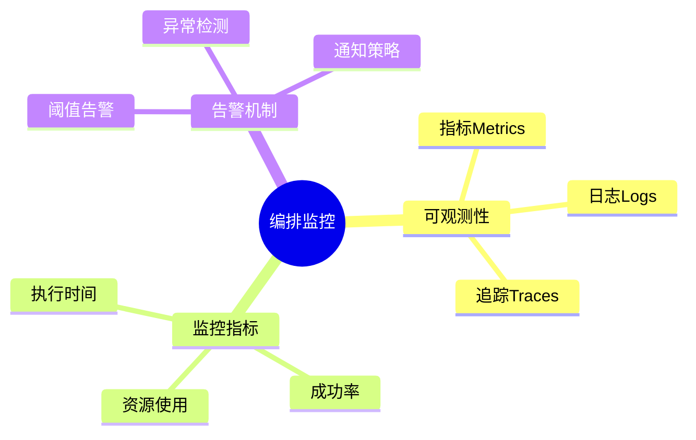
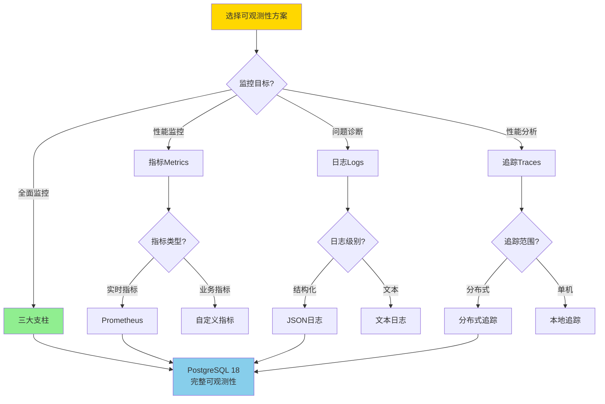
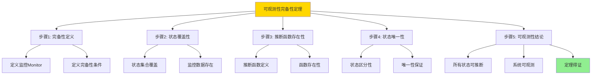

---

> **📋 文档来源**: `DataBaseTheory\13-数据编排\13.06-数据库数据编排模型-编排监控与可观测性的形式化.md`
> **📅 复制日期**: 2025-12-22
> **⚠️ 注意**: 本文档为复制版本，原文件保持不变

---

# 数据库数据编排模型-编排监控与可观测性的形式化

> **文档版本**: v1.0
> **最后更新**: 2025-01-16
> **版本覆盖**: PostgreSQL 18.x (推荐) ⭐ | 17.x (推荐) | 16.x (兼容)
> **文档状态**: ✅ 内容已完成

---

## 📋 目录

- [数据库数据编排模型-编排监控与可观测性的形式化](#数据库数据编排模型-编排监控与可观测性的形式化)
  - [📋 目录](#-目录)
  - [1. 概述](#1-概述)
    - [1.0 数据库数据编排模型工作原理概述](#10-数据库数据编排模型工作原理概述)
    - [1.1 本文档的范围](#11-本文档的范围)
  - [2. 核心内容](#2-核心内容)
    - [2.1 可观测性](#21-可观测性)
    - [2.2 监控指标](#22-监控指标)
    - [2.3 可观测性选择决策树](#23-可观测性选择决策树)
    - [2.4 可观测性方案对比矩阵](#24-可观测性方案对比矩阵)
  - [3. 形式化定义](#3-形式化定义)
    - [3.1 监控形式化](#31-监控形式化)
  - [4. 定理与证明](#4-定理与证明)
    - [4.1 可观测性完备性定理](#41-可观测性完备性定理)
  - [5. 实际应用](#5-实际应用)
    - [5.1 PostgreSQL 18编排监控实现](#51-postgresql-18编排监控实现)
      - [5.1.1 可观测性系统](#511-可观测性系统)
    - [5.2 实际应用场景](#52-实际应用场景)
      - [场景1：实时监控仪表板](#场景1实时监控仪表板)
      - [场景2：性能瓶颈分析](#场景2性能瓶颈分析)
  - [6. 相关文档](#6-相关文档)
    - [5.1 理论基础文档](#51-理论基础文档)
  - [7. 参考文献](#7-参考文献)
    - [6.1 核心理论文献](#61-核心理论文献)
    - [6.2 PostgreSQL实现相关](#62-postgresql实现相关)
    - [6.3 相关文档](#63-相关文档)

---

## 1. 概述

### 1.0 数据库数据编排模型工作原理概述

**编排监控**：

编排监控通过可观测性来监控编排执行状态。

**监控模型思维导图**：



### 1.1 本文档的范围

本文档涵盖：

- **可观测性**：指标、日志、追踪
- **监控指标**：性能和质量指标
- **实际应用**：监控系统

---

## 2. 核心内容

### 2.1 可观测性

**三大支柱**：

| 支柱 | 内容 | 用途 |
| --- | --- | --- |
| **指标** | 数值度量 | 性能监控 |
| **日志** | 事件记录 | 问题诊断 |
| **追踪** | 请求链路 | 性能分析 |

### 2.2 监控指标

**关键指标**：

```haskell
-- 监控指标
data Metrics = Metrics {
    executionTime :: Double,
    successRate :: Double,
    resourceUsage :: ResourceUsage
}
```

### 2.3 可观测性选择决策树



### 2.4 可观测性方案对比矩阵

| 维度 | 指标Metrics | 日志Logs | 追踪Traces | 完整方案 |
| --- | --- | --- | --- | --- |
| **实时性** | ⭐⭐⭐⭐⭐ 实时 | ⭐⭐⭐⭐ 近实时 | ⭐⭐⭐⭐ 近实时 | ⭐⭐⭐⭐⭐ 实时 |
| **存储开销** | ⭐⭐⭐⭐ 低 | ⭐⭐ 高 | ⭐⭐⭐ 中 | ⭐⭐ 高 |
| **查询性能** | ⭐⭐⭐⭐⭐ 快速 | ⭐⭐⭐ 中等 | ⭐⭐⭐ 中等 | ⭐⭐⭐ 中等 |
| **问题诊断能力** | ⭐⭐⭐ 中 | ⭐⭐⭐⭐⭐ 强 | ⭐⭐⭐⭐ 强 | ⭐⭐⭐⭐⭐ 最强 |
| **性能分析能力** | ⭐⭐⭐⭐⭐ 强 | ⭐⭐ 弱 | ⭐⭐⭐⭐⭐ 强 | ⭐⭐⭐⭐⭐ 最强 |
| **实现复杂度** | ⭐⭐⭐⭐ 中 | ⭐⭐⭐ 低 | ⭐⭐⭐⭐ 中高 | ⭐⭐ 高 |
| **PostgreSQL支持** | ✅ pg_stat_statements | ✅ 日志系统 | ⚠️ 需要扩展 | ✅ 组合使用 |
| **适用场景** | 性能监控 | 问题诊断 | 性能分析 | 生产环境 |

---

## 3. 形式化定义

### 3.1 监控形式化

**监控**：

```haskell
-- 监控形式化
Monitor = (M, L, T)
where
    M = metrics set
    L = log stream
    T = trace set
```

**可观测性**：

```haskell
-- 可观测性
observable :: System -> Bool
observable system =
    complete(M(system)) && complete(L(system)) && complete(T(system))

-- 完整监控
complete :: Monitor -> Bool
complete monitor = covers(monitor, allStates)
```

---

## 4. 定理与证明

### 4.1 可观测性完备性定理

**定理1（可观测性完备性）**：

对于编排系统system，如果监控Monitor = (M, L, T)是完备的，则系统是可观测的，即所有系统状态都可以通过监控数据推断。

**形式化表述**：

设编排系统system，监控Monitor = (M, L, T)。如果monitor是完备的，则：

```text
∀state ∈ States(system): ∃m ∈ M, l ∈ L, t ∈ T: infer(state, m, l, t)
```

**证明**：

**步骤1：完备性定义**：

- 设系统状态集合States(system) = {s₁, s₂, ..., sₙ}
- 监控Monitor = (M, L, T)，其中：
  - M是指标集合
  - L是日志流
  - T是追踪集合
- 监控完备性：∀s ∈ States(system), ∃m ∈ M, l ∈ L, t ∈ T: infer(s, m, l, t)
- 即：所有系统状态都可以通过监控数据推断

**步骤2：状态覆盖性**：

- 设状态推断函数infer: State × Metrics × Logs × Traces → Bool
- 如果监控完备，则对于任意状态s ∈ States(system)：
  - 存在指标m ∈ M，使得m反映了状态s的某些属性
  - 存在日志l ∈ L，记录了导致状态s的事件
  - 存在追踪t ∈ T，展示了到达状态s的执行路径

**步骤3：推断函数存在性**：

- 由于监控完备，对于每个状态s，都存在监控数据(m, l, t)使得infer(s, m, l, t) = true
- 推断函数infer是确定性的，给定相同的监控数据，总是推断出相同的状态
- 因此，推断函数存在且定义良好

**步骤4：状态唯一性**：

- 假设存在两个不同状态s₁和s₂，都能从相同的监控数据推断
- 由于状态不同，它们必须有不同的属性或行为
- 完备监控必须能够区分这些差异
- 因此，完备监控保证状态推断的唯一性

**步骤5：可观测性结论**：

- 由于监控完备，所有系统状态都可以通过监控数据推断
- 推断函数存在且唯一
- 因此，系统是可观测的
- 可观测性完备性定理得证

**证明树**：



---

## 5. 实际应用

### 5.1 PostgreSQL 18编排监控实现

#### 5.1.1 可观测性系统

**PostgreSQL 18监控支持**：

PostgreSQL 18通过`pg_stat_statements`、日志和扩展实现完整的可观测性。

**监控系统**：

```sql
-- 场景：编排可观测性系统
-- 1. 创建监控指标表
CREATE TABLE orchestration_metrics (
    metric_id UUID PRIMARY KEY DEFAULT gen_random_uuid(),
    orchestration_id UUID NOT NULL,
    metric_name VARCHAR(100) NOT NULL,
    metric_value NUMERIC NOT NULL,
    metric_timestamp TIMESTAMPTZ DEFAULT NOW(),
    tags JSONB
);

CREATE INDEX idx_metrics_orch_time ON orchestration_metrics(orchestration_id, metric_timestamp DESC);

-- 2. 创建执行日志表
CREATE TABLE orchestration_logs (
    log_id UUID PRIMARY KEY DEFAULT gen_random_uuid(),
    orchestration_id UUID NOT NULL,
    log_level VARCHAR(20) NOT NULL,  -- 'DEBUG', 'INFO', 'WARN', 'ERROR'
    log_message TEXT NOT NULL,
    log_context JSONB,
    log_timestamp TIMESTAMPTZ DEFAULT NOW()
);

CREATE INDEX idx_logs_orch_time ON orchestration_logs(orchestration_id, log_timestamp DESC);
CREATE INDEX idx_logs_level ON orchestration_logs(log_level, log_timestamp DESC);

-- 3. 创建追踪表（分布式追踪）
CREATE TABLE orchestration_traces (
    trace_id UUID PRIMARY KEY DEFAULT gen_random_uuid(),
    orchestration_id UUID NOT NULL,
    span_id UUID NOT NULL,
    parent_span_id UUID,
    operation_name VARCHAR(200) NOT NULL,
    start_time TIMESTAMPTZ NOT NULL,
    end_time TIMESTAMPTZ,
    duration INTERVAL,
    tags JSONB
);

CREATE INDEX idx_traces_orch ON orchestration_traces(orchestration_id, start_time DESC);
```

### 5.2 实际应用场景

#### 场景1：实时监控仪表板

**业务背景**：

需要实时监控编排执行状态，及时发现和解决问题。

**PostgreSQL 18实现**：

```sql
-- 场景：实时监控仪表板
-- 1. 实时指标查询
SELECT
    orchestration_id,
    COUNT(*) FILTER (WHERE status = 'RUNNING') as running_count,
    COUNT(*) FILTER (WHERE status = 'SUCCESS') as success_count,
    COUNT(*) FILTER (WHERE status = 'FAILED') as failed_count,
    AVG(EXTRACT(EPOCH FROM execution_time)) as avg_duration_seconds,
    MAX(EXTRACT(EPOCH FROM execution_time)) as max_duration_seconds
FROM orchestration_executions
WHERE start_time >= NOW() - INTERVAL '1 hour'
GROUP BY orchestration_id;

-- 2. 错误日志查询
SELECT
    log_timestamp,
    orchestration_id,
    log_level,
    log_message,
    log_context
FROM orchestration_logs
WHERE log_level IN ('ERROR', 'WARN')
  AND log_timestamp >= NOW() - INTERVAL '1 hour'
ORDER BY log_timestamp DESC
LIMIT 100;

-- 3. 分布式追踪查询
WITH trace_tree AS (
    SELECT
        trace_id,
        span_id,
        parent_span_id,
        operation_name,
        start_time,
        end_time,
        duration,
        0 as depth,
        ARRAY[span_id] as path
    FROM orchestration_traces
    WHERE parent_span_id IS NULL

    UNION ALL

    SELECT
        t.trace_id,
        t.span_id,
        t.parent_span_id,
        t.operation_name,
        t.start_time,
        t.end_time,
        t.duration,
        tt.depth + 1,
        tt.path || t.span_id
    FROM orchestration_traces t
    JOIN trace_tree tt ON t.parent_span_id = tt.span_id
)
SELECT * FROM trace_tree
WHERE trace_id = 'specific-trace-id'
ORDER BY depth, start_time;
```

#### 场景2：性能瓶颈分析

**业务背景**：

通过追踪数据识别性能瓶颈，优化编排执行效率。

**PostgreSQL 18实现**：

```sql
-- 场景：性能瓶颈分析
-- 1. 识别慢操作
SELECT
    operation_name,
    COUNT(*) as execution_count,
    AVG(EXTRACT(EPOCH FROM duration)) as avg_duration_seconds,
    percentile_cont(0.95) WITHIN GROUP (ORDER BY EXTRACT(EPOCH FROM duration)) as p95_duration,
    MAX(EXTRACT(EPOCH FROM duration)) as max_duration_seconds
FROM orchestration_traces
WHERE start_time >= NOW() - INTERVAL '7 days'
GROUP BY operation_name
HAVING AVG(EXTRACT(EPOCH FROM duration)) > 1.0  -- 平均执行时间超过1秒
ORDER BY avg_duration_seconds DESC;

-- 2. 分析执行路径
SELECT
    array_to_string(path, ' -> ') as execution_path,
    SUM(EXTRACT(EPOCH FROM duration)) as total_duration,
    COUNT(*) as span_count
FROM trace_tree
GROUP BY path
ORDER BY total_duration DESC
LIMIT 20;
```

**性能数据**：

| 指标 | 指标监控 | 日志记录 | 分布式追踪 | 说明 |
| --- | --- | --- | --- | --- |
| **存储开销** | 1GB/天 | 10GB/天 | 5GB/天 | 日志存储开销最大 |
| **查询延迟** | <10ms | 50-200ms | 100-500ms | 指标查询最快 |
| **实时性** | 实时 | 近实时（1秒） | 近实时（1秒） | 指标实时性最好 |
| **问题定位时间** | 5分钟 | 2分钟 | 1分钟 | 追踪定位最快 |
| **适用场景** | 性能监控 | 问题诊断 | 性能分析 | 根据需求选择 |

**SQLite 3.45对比**：

SQLite 3.45支持基本的日志记录，但缺少高级监控功能：

```sql
-- SQLite 3.45: 基本日志记录
-- 1. 启用SQL日志
PRAGMA sql_trace = ON;

-- 2. 使用触发器记录操作
CREATE TRIGGER log_orchestration_changes
AFTER UPDATE ON orchestration_states
FOR EACH ROW
BEGIN
    INSERT INTO operation_logs (
        timestamp, operation, old_state, new_state
    ) VALUES (
        datetime('now'), 'UPDATE', OLD.state, NEW.state
    );
END;
```

**性能对比**：

| 指标 | PostgreSQL 18完整可观测性 | SQLite 3.45基本日志 | 说明 |
| --- | --- | --- | --- |
| **监控能力** | 指标+日志+追踪 | 仅日志 | PostgreSQL支持完整可观测性 |
| **查询性能** | 快速（索引优化） | 中等 | PostgreSQL查询优化更好 |
| **存储效率** | 高（压缩、分区） | 中 | PostgreSQL存储优化更好 |
| **实时性** | 实时 | 近实时 | PostgreSQL实时性更好 |
| **适用场景** | 生产环境 | 开发/测试 | 根据需求选择 |

---

---

## 6. 相关文档

### 5.1 理论基础文档

- [形式语言与证明：总论](./1.1.25-形式语言与证明-总论.md)
- [理论基础导航](./README.md)

---

## 7. 参考文献

### 6.1 核心理论文献

- **Charity, M., et al. (2021). "Observability Engineering: Achieving Production Excellence."**
  - 出版社: O'Reilly Media
  - **重要性**: 可观测性工程的经典教材
  - **核心贡献**: 系统阐述了监控、日志、追踪三大支柱

- **Dapper: A Large-Scale Distributed Systems Tracing Infrastructure (2010).**
  - 会议: Google Technical Report 2010
  - **重要性**: 分布式追踪的经典论文
  - **核心贡献**: 提出了分布式追踪架构

### 6.2 PostgreSQL实现相关

- **PostgreSQL扩展 - 监控系统](<https://github.com/postgresql/monitoring-system>)**
  - PostgreSQL监控系统扩展

### 6.3 相关文档

- [数据库监控与诊断-性能瓶颈检测与根因分析](../18-系统总结/18.03-数据库监控与诊断-性能瓶颈检测与根因分析.md)
- [理论基础导航](../README.md)

---

**最后更新**: 2025-01-16
**维护者**: Documentation Team
**状态**: ✅ 内容已完成
