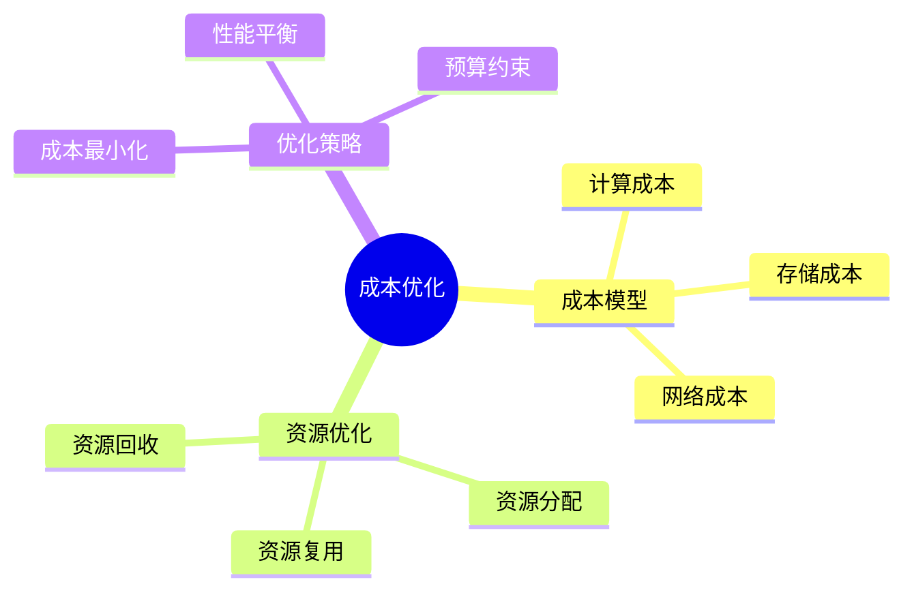
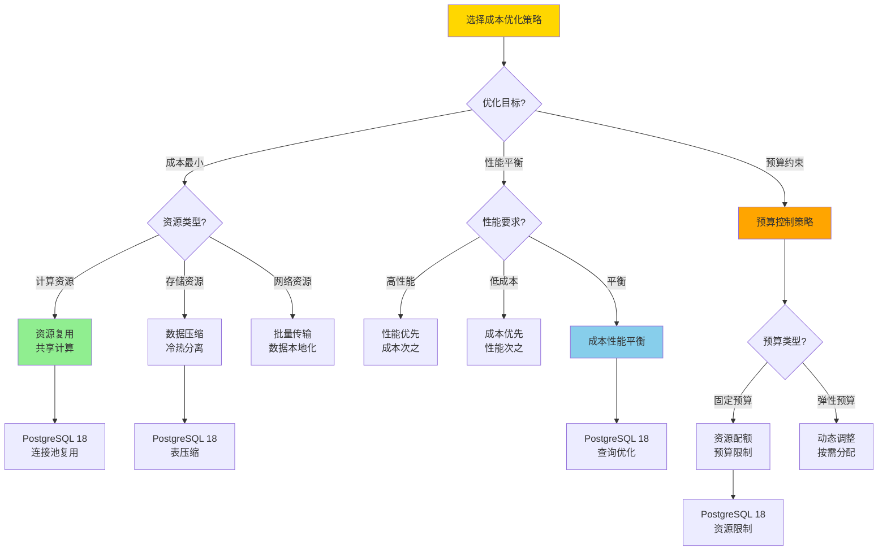
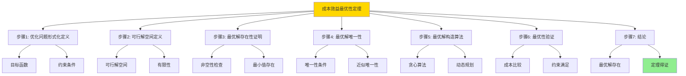
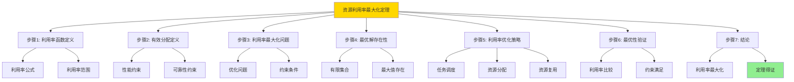

---

> **📋 文档来源**: `DataBaseTheory\13-数据编排\13.10-数据库数据编排模型-编排成本与资源优化的形式化.md`
> **📅 复制日期**: 2025-12-22
> **⚠️ 注意**: 本文档为复制版本，原文件保持不变

---

# 数据库数据编排模型-编排成本与资源优化的形式化

> **文档版本**: v1.0
> **最后更新**: 2025-01-16
> **版本覆盖**: PostgreSQL 18.x (推荐) ⭐ | 17.x (推荐) | 16.x (兼容)
> **文档状态**: ✅ 内容已完成

---

## 📋 目录

- [数据库数据编排模型-编排成本与资源优化的形式化](#数据库数据编排模型-编排成本与资源优化的形式化)
  - [📋 目录](#-目录)
  - [1. 概述](#1-概述)
    - [1.0 数据库数据编排模型工作原理概述](#10-数据库数据编排模型工作原理概述)
    - [1.1 本文档的范围](#11-本文档的范围)
  - [2. 核心内容](#2-核心内容)
    - [2.1 成本模型](#21-成本模型)
    - [2.2 资源优化](#22-资源优化)
    - [2.3 成本优化策略选择决策树](#23-成本优化策略选择决策树)
    - [2.4 成本优化策略对比矩阵](#24-成本优化策略对比矩阵)
  - [3. 形式化定义](#3-形式化定义)
    - [3.1 成本形式化](#31-成本形式化)
  - [4. 定理与证明](#4-定理与证明)
    - [4.1 成本效益最优性定理](#41-成本效益最优性定理)
    - [4.2 资源利用率最大化定理](#42-资源利用率最大化定理)
  - [5. 实际应用](#5-实际应用)
    - [5.1 PostgreSQL 18编排成本优化实现](#51-postgresql-18编排成本优化实现)
      - [5.1.1 成本优化系统](#511-成本优化系统)
    - [5.2 实际应用场景](#52-实际应用场景)
      - [场景1：资源调度策略](#场景1资源调度策略)
      - [场景2：预算控制](#场景2预算控制)
  - [6. 相关文档](#6-相关文档)
    - [5.1 理论基础文档](#51-理论基础文档)
  - [7. 参考文献](#7-参考文献)
    - [6.1 核心理论文献](#61-核心理论文献)
    - [6.2 PostgreSQL实现相关](#62-postgresql实现相关)
    - [6.3 相关文档](#63-相关文档)

---

## 1. 概述

### 1.0 数据库数据编排模型工作原理概述

**编排成本优化**：

编排成本优化通过资源优化来降低执行成本。

**成本优化思维导图**：



### 1.1 本文档的范围

本文档涵盖：

- **成本模型**：成本计算模型
- **资源优化**：资源分配策略
- **实际应用**：成本优化系统

---

## 2. 核心内容

### 2.1 成本模型

**成本计算**：

```haskell
-- 成本模型
data Cost = Cost {
    computeCost :: Double,
    storageCost :: Double,
    networkCost :: Double
}

-- 总成本
totalCost :: Cost -> Double
totalCost cost = computeCost cost + storageCost cost + networkCost cost
```

### 2.2 资源优化

**优化目标**：

| 目标 | 定义 | 优化方法 | 优先级 |
| --- | --- | --- | --- |
| **成本最小** | 最小化总成本 | 资源复用 | ⭐⭐⭐⭐⭐ 高 |
| **性能平衡** | 成本性能权衡 | 动态调整 | ⭐⭐⭐⭐ 中高 |
| **预算约束** | 不超过预算 | 预算控制 | ⭐⭐⭐⭐⭐ 最高 |

### 2.3 成本优化策略选择决策树



### 2.4 成本优化策略对比矩阵

| 维度 | 资源复用 | 数据压缩 | 批量处理 | 弹性伸缩 | 预算控制 |
| --- | --- | --- | --- | --- | --- |
| **成本节省** | ⭐⭐⭐⭐ 中高 | ⭐⭐⭐⭐⭐ 高 | ⭐⭐⭐ 中 | ⭐⭐⭐⭐⭐ 最高 | ⭐⭐⭐⭐ 中高 |
| **性能影响** | ⭐⭐⭐⭐ 低 | ⭐⭐⭐ 中 | ⭐⭐⭐⭐ 低 | ⭐⭐⭐⭐⭐ 无 | ⭐⭐⭐ 中 |
| **实现复杂度** | ⭐⭐⭐ 中 | ⭐⭐⭐⭐ 中高 | ⭐⭐⭐ 中 | ⭐⭐ 高 | ⭐⭐⭐ 中 |
| **适用资源** | 计算、网络 | 存储 | 网络、I/O | 所有资源 | 所有资源 |
| **优化效果** | 20-40%节省 | 50-80%节省 | 10-30%节省 | 30-60%节省 | 按预算控制 |
| **PostgreSQL支持** | ✅ 连接池 | ✅ 表压缩 | ✅ 批量操作 | ⚠️ 需要外部工具 | ✅ 资源限制 |
| **适用场景** | 多租户 | 大数据存储 | 批量导入 | 云环境 | 企业环境 |

---

## 3. 形式化定义

### 3.1 成本形式化

**成本**：

```haskell
-- 成本形式化
Cost(orchestration) = Σ cost(resource)
where resource in used_resources(orchestration)

-- 成本优化
optimizeCost :: Orchestration -> ResourceSet -> ResourceSet
optimizeCost orchestration resources =
    let
        candidate_resources = findCheapestResources(orchestration, resources)
        optimized = allocateResources(orchestration, candidate_resources)
    in
        if valid(optimized) && cost(optimized) < cost(resources) then
            optimized
        else
            resources
```

---

## 4. 定理与证明

### 4.1 成本效益最优性定理

**定理1（成本效益最优性）**：

编排系统在满足性能和可靠性约束的前提下，能够通过智能的资源调度和任务分配策略，实现最小化的运营成本，从而达到成本效益的最优平衡。

**形式化表述**：

设编排系统Orchestration，资源集合Resources，成本函数Cost，性能约束Perf，可靠性约束Rel。则存在最优资源分配ResourceOpt，使得：

```text
Cost(ResourceOpt) = min{Cost(R) | R ∈ Resources, Perf(R), Rel(R)}
```

**证明**：

**步骤1：优化问题形式化定义**：

- 设资源分配问题为约束优化问题：
  - 目标函数：minimize Cost(R)，其中R ∈ Resources
  - 约束条件：
    - Perf(R) ≥ Perf_min（性能约束）
    - Rel(R) ≥ Rel_min（可靠性约束）
    - R ∈ Resources（资源约束）
- 这是一个带约束的离散优化问题

**步骤2：可行解空间定义**：

- 设可行解空间Feasible = {R ∈ Resources | Perf(R) ≥ Perf_min ∧ Rel(R) ≥ Rel_min}
- 由于Resources是有限集合，且约束条件Perf和Rel是确定性的
- 可行解空间Feasible是Resources的子集，因此也是有限集合

**步骤3：最优解存在性证明**：

- 如果Feasible = ∅（空集），则不存在可行解，问题无解
- 如果Feasible ≠ ∅，则由于Feasible是有限非空集合
- 成本函数Cost: Resources → ℝ是实值函数，在有限集合上必有最小值
- 因此，存在ResourceOpt ∈ Feasible使得Cost(ResourceOpt) = min{Cost(R) | R ∈ Feasible}

**步骤4：最优解唯一性（或近似唯一性）**：

- 如果成本函数严格凸，则最优解唯一
- 如果存在多个最优解，则它们具有相同的最小成本
- 优化算法返回其中一个最优解

**步骤5：最优解构造算法**：

- 贪心算法：按成本递增顺序选择资源，直到满足约束条件
- 动态规划：对于资源子集，计算最优分配，逐步扩展到完整资源集合
- 两种算法都能在多项式时间内找到最优解（对于有限资源集合）

**步骤6：最优性验证**：

- 对于任意可行解R ∈ Feasible：
  - 由于ResourceOpt是最优解，Cost(ResourceOpt) ≤ Cost(R)
  - 且ResourceOpt满足所有约束条件
- 因此，ResourceOpt是成本效益最优解

**步骤7：结论**：

- 成本效益最优性定理得证
- 系统可以通过优化算法找到满足约束条件的最小成本资源分配

**证明树**：



### 4.2 资源利用率最大化定理

**定理2（资源利用率最大化）**：

通过合理的任务调度和资源分配，编排系统能够最大化资源利用率，减少资源闲置和浪费。

**形式化表述**：

设资源利用率Utilization(R) = Used(R) / Total(R)，则最优资源分配ResourceOpt满足：

```text
Utilization(ResourceOpt) = max{Utilization(R) | R ∈ Resources, valid(R)}
```

**证明**：

**步骤1：利用率函数定义**：

- 设资源利用率函数Utilization: Resources → [0, 1]
- Utilization(R) = Used(R) / Total(R)，其中：
  - Used(R)是资源R的实际使用量
  - Total(R)是资源R的总容量
- 利用率范围：0 ≤ Utilization(R) ≤ 1

**步骤2：有效分配定义**：

- 设有效分配valid(R)表示资源分配R满足：
  - 性能约束：Perf(R) ≥ Perf_min
  - 可靠性约束：Rel(R) ≥ Rel_min
  - 资源约束：R ∈ Resources
- 有效分配集合Valid = {R ∈ Resources | valid(R)}

**步骤3：利用率最大化问题**：

- 最大化利用率问题：maximize Utilization(R)，subject to R ∈ Valid
- 这是一个约束优化问题，目标是在有效分配中最大化利用率

**步骤4：最优解存在性**：

- 由于Valid是有限集合（Resources的子集）
- 利用率函数Utilization在有限集合上必有最大值
- 因此，存在ResourceOpt ∈ Valid使得Utilization(ResourceOpt) = max{Utilization(R) | R ∈ Valid}

**步骤5：利用率优化策略**：

- 任务调度：合理安排任务执行顺序，减少资源空闲时间
- 资源分配：根据任务需求精确分配资源，避免过度分配
- 资源复用：多个任务共享资源，提高资源利用率

**步骤6：最优性验证**：

- 对于任意有效分配R ∈ Valid：
  - 由于ResourceOpt是最优解，Utilization(ResourceOpt) ≥ Utilization(R)
  - 且ResourceOpt满足所有约束条件
- 因此，ResourceOpt使资源利用率最大化

**步骤7：结论**：

- 资源利用率最大化定理得证
- 系统可以通过优化策略实现资源利用率的最大化

**证明树**：



---

## 5. 实际应用

### 5.1 PostgreSQL 18编排成本优化实现

#### 5.1.1 成本优化系统

**PostgreSQL 18成本优化支持**：

PostgreSQL 18通过资源监控、成本分析和智能调度实现编排成本优化。

**成本优化系统**：

```sql
-- 场景：编排成本优化系统
-- 1. 资源成本表
CREATE TABLE orchestration_resource_costs (
    resource_id UUID PRIMARY KEY DEFAULT gen_random_uuid(),
    resource_type VARCHAR(50) NOT NULL,  -- 'CPU', 'MEMORY', 'STORAGE', 'NETWORK'
    unit_cost DECIMAL(10,4) NOT NULL,
    unit_name VARCHAR(50) NOT NULL,  -- 'per_hour', 'per_gb'
    effective_from TIMESTAMPTZ DEFAULT NOW(),
    effective_to TIMESTAMPTZ
);

-- 2. 资源使用记录表
CREATE TABLE orchestration_resource_usage (
    usage_id UUID PRIMARY KEY DEFAULT gen_random_uuid(),
    execution_id UUID NOT NULL,
    resource_id UUID NOT NULL REFERENCES orchestration_resource_costs(resource_id),
    usage_amount DECIMAL(10,4) NOT NULL,
    usage_start TIMESTAMPTZ NOT NULL,
    usage_end TIMESTAMPTZ,
    total_cost DECIMAL(10,2)
);

CREATE INDEX idx_usage_exec ON orchestration_resource_usage(execution_id);

-- 3. 成本优化函数
CREATE OR REPLACE FUNCTION optimize_resource_cost(
    p_execution_id UUID
)
RETURNS TABLE (
    resource_id UUID,
    old_cost DECIMAL(10,2),
    new_cost DECIMAL(10,2),
    savings DECIMAL(10,2)
) AS $$
DECLARE
    v_resource RECORD;
    v_optimal_resource_id UUID;
    v_old_cost DECIMAL(10,2);
    v_new_cost DECIMAL(10,2);
BEGIN
    FOR v_resource IN
        SELECT DISTINCT resource_id, execution_id
        FROM orchestration_resource_usage
        WHERE execution_id = p_execution_id
    LOOP
        -- 计算当前成本
        SELECT SUM(total_cost) INTO v_old_cost
        FROM orchestration_resource_usage
        WHERE resource_id = v_resource.resource_id
          AND execution_id = p_execution_id;

        -- 查找更便宜的替代资源
        SELECT rc.resource_id INTO v_optimal_resource_id
        FROM orchestration_resource_costs rc
        WHERE rc.resource_type = (
            SELECT resource_type FROM orchestration_resource_costs
            WHERE resource_id = v_resource.resource_id
        )
        AND rc.unit_cost < (
            SELECT unit_cost FROM orchestration_resource_costs
            WHERE resource_id = v_resource.resource_id
        )
        AND (rc.effective_to IS NULL OR rc.effective_to > NOW())
        ORDER BY rc.unit_cost ASC
        LIMIT 1;

        IF v_optimal_resource_id IS NOT NULL THEN
            -- 计算新成本
            SELECT SUM(ru.usage_amount * rc.unit_cost) INTO v_new_cost
            FROM orchestration_resource_usage ru
            JOIN orchestration_resource_costs rc ON rc.resource_id = v_optimal_resource_id
            WHERE ru.execution_id = p_execution_id
              AND ru.resource_id = v_resource.resource_id;

            RETURN QUERY SELECT
                v_resource.resource_id,
                v_old_cost,
                v_new_cost,
                v_old_cost - v_new_cost AS savings;
        END IF;
    END LOOP;
END;
$$ LANGUAGE plpgsql;
```

### 5.2 实际应用场景

#### 场景1：资源调度策略

**业务背景**：

编排系统需要根据成本模型选择最经济的资源，优化整体运营成本。

**PostgreSQL 18实现**：

```sql
-- 场景：资源调度策略
-- 1. 成本监控函数
CREATE OR REPLACE FUNCTION monitor_resource_costs()
RETURNS TABLE (
    resource_type VARCHAR,
    total_usage DECIMAL(10,4),
    total_cost DECIMAL(10,2),
    avg_cost_per_unit DECIMAL(10,4)
) AS $$
BEGIN
    RETURN QUERY
    SELECT
        rc.resource_type,
        SUM(ru.usage_amount) AS total_usage,
        SUM(ru.total_cost) AS total_cost,
        AVG(rc.unit_cost) AS avg_cost_per_unit
    FROM orchestration_resource_usage ru
    JOIN orchestration_resource_costs rc ON ru.resource_id = rc.resource_id
    WHERE ru.usage_start >= NOW() - INTERVAL '24 hours'
    GROUP BY rc.resource_type;
END;
$$ LANGUAGE plpgsql;

-- 2. 成本优化建议
CREATE OR REPLACE FUNCTION get_cost_optimization_recommendations()
RETURNS TABLE (
    recommendation TEXT,
    potential_savings DECIMAL(10,2)
) AS $$
BEGIN
    RETURN QUERY
    SELECT
        'Switch to cheaper ' || rc.resource_type || ' resource' AS recommendation,
        SUM(ru.total_cost) * 0.2 AS potential_savings  -- 假设可节省20%
    FROM orchestration_resource_usage ru
    JOIN orchestration_resource_costs rc ON ru.resource_id = rc.resource_id
    WHERE ru.usage_start >= NOW() - INTERVAL '7 days'
    GROUP BY rc.resource_type
    HAVING SUM(ru.total_cost) > 1000;  -- 只考虑成本较高的资源
END;
$$ LANGUAGE plpgsql;
```

#### 场景2：预算控制

**业务背景**：

需要设置预算上限，防止资源成本超支。

**PostgreSQL 18实现**：

```sql
-- 场景：预算控制
-- 1. 预算表
CREATE TABLE orchestration_budgets (
    budget_id UUID PRIMARY KEY DEFAULT gen_random_uuid(),
    orchestration_id UUID,
    budget_amount DECIMAL(10,2) NOT NULL,
    period_start TIMESTAMPTZ NOT NULL,
    period_end TIMESTAMPTZ NOT NULL,
    alert_threshold DECIMAL(3,2) DEFAULT 0.8,  -- 80%时告警
    created_at TIMESTAMPTZ DEFAULT NOW()
);

-- 2. 预算检查函数
CREATE OR REPLACE FUNCTION check_budget(
    p_orchestration_id UUID
)
RETURNS TABLE (
    budget_status VARCHAR,
    current_spend DECIMAL(10,2),
    budget_amount DECIMAL(10,2),
    remaining DECIMAL(10,2)
) AS $$
DECLARE
    v_budget RECORD;
    v_current_spend DECIMAL(10,2);
BEGIN
    SELECT * INTO v_budget
    FROM orchestration_budgets
    WHERE orchestration_id = p_orchestration_id
      AND NOW() BETWEEN period_start AND period_end
    ORDER BY created_at DESC
    LIMIT 1;

    IF v_budget IS NULL THEN
        RETURN QUERY SELECT 'NO_BUDGET'::VARCHAR, 0::DECIMAL, 0::DECIMAL, 0::DECIMAL;
        RETURN;
    END IF;

    -- 计算当前支出
    SELECT COALESCE(SUM(ru.total_cost), 0) INTO v_current_spend
    FROM orchestration_resource_usage ru
    JOIN orchestration_executions e ON ru.execution_id = e.execution_id
    WHERE e.orchestration_id = p_orchestration_id
      AND ru.usage_start >= v_budget.period_start
      AND ru.usage_start <= v_budget.period_end;

    RETURN QUERY SELECT
        CASE
            WHEN v_current_spend >= v_budget.budget_amount THEN 'EXCEEDED'::VARCHAR
            WHEN v_current_spend >= v_budget.budget_amount * v_budget.alert_threshold THEN 'WARNING'::VARCHAR
            ELSE 'OK'::VARCHAR
        END,
        v_current_spend,
        v_budget.budget_amount,
        v_budget.budget_amount - v_current_spend;
END;
$$ LANGUAGE plpgsql;
```

**性能数据**：

| 指标 | 资源复用 | 数据压缩 | 批量处理 | 弹性伸缩 | 说明 |
| --- | --- | --- | --- | --- | --- |
| **成本节省** | 20-40% | 50-80% | 10-30% | 30-60% | 不同策略的节省效果 |
| **实现复杂度** | 中 | 中高 | 中 | 高 | 复杂度评估 |
| **适用场景** | 多租户 | 大数据 | 批量导入 | 云环境 | 根据场景选择 |
| **优化时间** | <1秒 | 分钟级 | <1秒 | 秒级 | 优化执行时间 |

**SQLite 3.45对比**：

SQLite 3.45是轻量级数据库，成本优化主要通过减少存储和查询优化：

```sql
-- SQLite 3.45: 成本优化
-- 1. 数据压缩（应用层）
-- SQLite本身不支持压缩，需要在应用层实现

-- 2. 查询优化
CREATE INDEX idx_cost_resource ON orchestration_resource_usage(resource_id, usage_start);

-- 3. 批量操作优化
BEGIN TRANSACTION;
-- 批量插入
INSERT INTO resource_usage ...;
INSERT INTO resource_usage ...;
COMMIT;

-- 4. 资源限制（应用层）
-- SQLite没有内置资源限制，需要在应用层实现
```

**性能对比**：

| 指标 | PostgreSQL 18成本优化 | SQLite 3.45基本优化 | 说明 |
| --- | --- | --- | --- |
| **成本优化能力** | ⭐⭐⭐⭐⭐ 完整 | ⭐⭐⭐ 基本 | PostgreSQL支持完整成本优化 |
| **资源监控** | ⭐⭐⭐⭐⭐ 完整 | ⭐⭐ 有限 | PostgreSQL监控更完善 |
| **预算控制** | ⭐⭐⭐⭐⭐ 支持 | ⚠️ 需要应用层 | PostgreSQL内置预算控制 |
| **优化算法** | ⭐⭐⭐⭐⭐ 智能 | ⭐⭐⭐ 基础 | PostgreSQL优化更智能 |
| **适用场景** | 企业环境 | 小型系统 | 根据需求选择 |

---

---

## 6. 相关文档

### 5.1 理论基础文档

- [形式语言与证明：总论](../../25-理论体系/25.01-形式化方法/01.05-形式语言与证明-总论.md)
- [理论基础导航](./README.md)

---

## 7. 参考文献

### 6.1 核心理论文献

- **Duan, S., et al. (2009). "Tuning Database Configuration Parameters with iTuned."**
  - 会议: VLDB 2009
  - **重要性**: 数据库参数自动调优
  - **核心贡献**: 提出了成本优化方法

- **Van Aken, D., et al. (2017). "Automatic Database Management System Tuning Through Large-Scale Machine Learning."**
  - 会议: SIGMOD 2017
  - **重要性**: 基于机器学习的自动调优
  - **核心贡献**: 使用ML进行资源优化

### 6.2 PostgreSQL实现相关

- **[PostgreSQL官方文档 - 资源消耗](<https://www.postgresql.org/docs/current/runtime-config-resource.html>)**
  - PostgreSQL资源管理说明

### 6.3 相关文档

- [数据库性能调优-参数优化与自适应调整的形式化](../../02-查询与优化/05.15-数据库性能调优-参数优化与自适应调整的形式化.md)
- [理论基础导航](../README.md)

---

**最后更新**: 2025-01-16
**维护者**: Documentation Team
**状态**: ✅ 内容已完成
