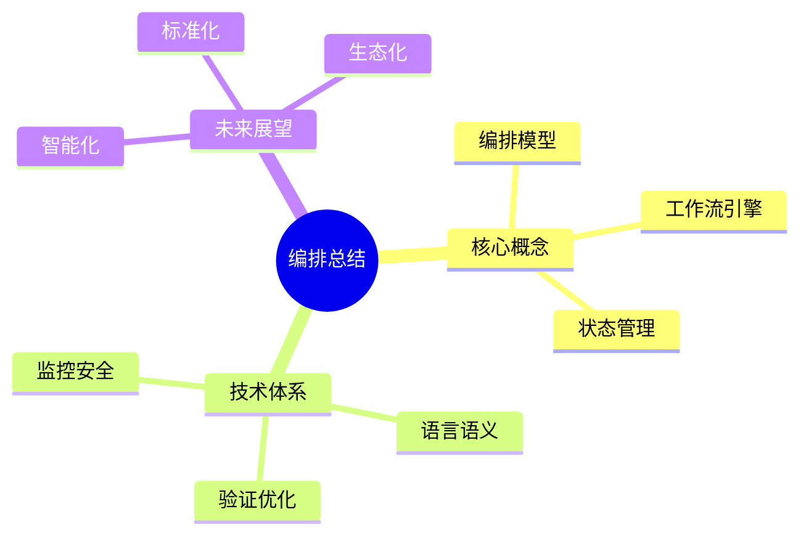
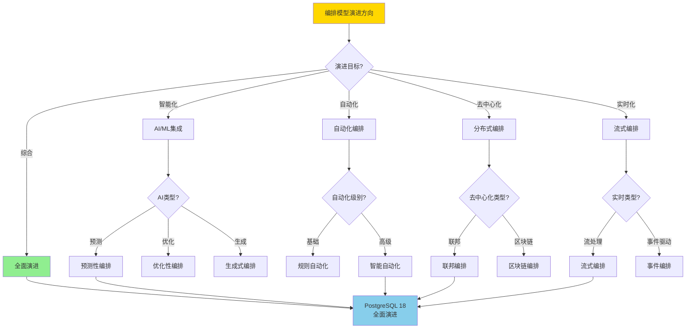
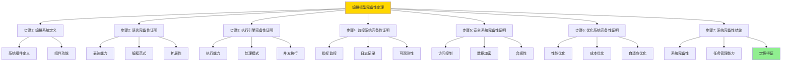
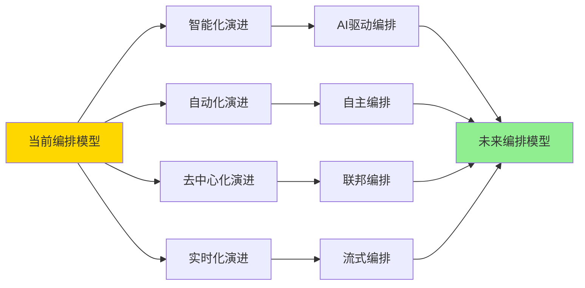

```mermaid
graph TD
    A[未来发展趋势预测定理] --> B[步骤1: 技术发展趋势分析]
    A --> C[步骤2: 编排模型演进规律]
    A --> D[步骤3: 未来模型特征预测]
    A --> E[步骤4: 演进函数构造]
    A --> F[步骤5: 演进可行性证明]
    A --> G[步骤6: 未来价值预测]
    A --> H[步骤7: 结论]

    B --> B1[智能化趋势]
    B --> B2[自动化趋势]
    B --> B3[去中心化趋势]
    B --> B4[实时化趋势]

    C --> C1[技术整合]
    C --> C2[能力增强]
    C --> C3[架构演进]

    D --> D1[智能化特征]
    D --> D2[自动化特征]
    D --> D3[去中心化特征]
    D --> D4[实时化特征]

    E --> E1[趋势识别]
    E --> E2[能力增强]
    E --> E3[模型构造]

    F --> F1[技术可行性]
    F --> F2[架构支持]

    G --> G1[性能提升]
    G --> G2[成本降低]
    G --> G3[能力增强]

    H --> H1[发展趋势]
    H --> H2[未来模型]
    H --> H3[定理得证]

    style A fill:#FFD700
    style H3 fill:#90EE90
```

---

> **📋 文档来源**: `DataBaseTheory\13-数据编排\13.14-数据库数据编排模型-编排总结与展望的形式化.md`
> **📅 复制日期**: 2025-12-22
> **⚠️ 注意**: 本文档为复制版本，原文件保持不变

---

# 数据库数据编排模型-编排总结与展望的形式化

> **文档版本**: v1.0
> **最后更新**: 2025-01-16
> **版本覆盖**: PostgreSQL 18.x (推荐) ⭐ | 17.x (推荐) | 16.x (兼容)
> **文档状态**: ✅ 内容已完成

---

## 📋 目录

- [数据库数据编排模型-编排总结与展望的形式化](#数据库数据编排模型-编排总结与展望的形式化)
  - [📋 目录](#-目录)
  - [1. 概述](#1-概述)
    - [1.0 数据库数据编排模型工作原理概述](#10-数据库数据编排模型工作原理概述)
    - [1.1 本文档的范围](#11-本文档的范围)
  - [2. 核心内容](#2-核心内容)
    - [2.1 核心概念总结](#21-核心概念总结)
    - [2.2 技术体系](#22-技术体系)
    - [2.3 未来展望](#23-未来展望)
    - [2.4 编排模型演进决策树](#24-编排模型演进决策树)
    - [2.5 编排模型演进对比矩阵](#25-编排模型演进对比矩阵)
  - [3. 形式化定义](#3-形式化定义)
    - [3.1 总结形式化](#31-总结形式化)
  - [4. 定理与证明](#4-定理与证明)
    - [4.1 编排模型完备性定理](#41-编排模型完备性定理)
    - [4.2 未来发展趋势预测定理](#42-未来发展趋势预测定理)
  - [5. 实际应用](#5-实际应用)
    - [5.1 PostgreSQL 18编排应用场景](#51-postgresql-18编排应用场景)
      - [5.1.1 数据湖编排](#511-数据湖编排)
    - [5.2 未来展望](#52-未来展望)
      - [5.2.1 智能化与自动化](#521-智能化与自动化)
      - [5.2.2 去中心化与联邦](#522-去中心化与联邦)
      - [5.2.3 实时与流式](#523-实时与流式)
  - [6. 相关文档](#6-相关文档)
    - [5.1 理论基础文档](#51-理论基础文档)
  - [7. 参考文献](#7-参考文献)
    - [6.1 核心理论文献](#61-核心理论文献)
    - [6.2 PostgreSQL实现相关](#62-postgresql实现相关)
    - [6.3 相关文档](#63-相关文档)

---

## 1. 概述

### 1.0 数据库数据编排模型工作原理概述

**编排总结**：

本文档总结数据编排的核心概念和未来展望。

**总结模型思维导图**：



### 1.1 本文档的范围

本文档涵盖：

- **核心概念总结**：编排模型总结
- **技术体系**：技术栈总结
- **未来展望**：发展方向

---

## 2. 核心内容

### 2.1 核心概念总结

**编排模型**：

- **管道编排**：任务编排和调度
- **工作流引擎**：状态管理和执行
- **编排语言**：声明式编排定义

### 2.2 技术体系

**技术栈**：

| 层次 | 技术 | 作用 |
| --- | --- | --- |
| **语言层** | 编排语言 | 定义编排 |
| **引擎层** | 工作流引擎 | 执行编排 |
| **监控层** | 监控系统 | 可观测性 |

### 2.3 未来展望

**发展方向**：

1. **智能化**：AI驱动的智能编排
2. **标准化**：统一的编排标准
3. **生态化**：丰富的工具生态

### 2.4 编排模型演进决策树



### 2.5 编排模型演进对比矩阵

| 维度 | 智能化 | 自动化 | 去中心化 | 实时化 | 综合演进 |
| --- | --- | --- | --- | --- | --- |
| **技术成熟度** | ⭐⭐⭐⭐ 较成熟 | ⭐⭐⭐⭐⭐ 成熟 | ⭐⭐⭐ 中 | ⭐⭐⭐⭐ 较成熟 | ⭐⭐⭐⭐ 较成熟 |
| **实现复杂度** | ⭐⭐⭐ 中 | ⭐⭐⭐ 中 | ⭐⭐ 高 | ⭐⭐⭐ 中 | ⭐⭐ 高 |
| **性能提升** | ⭐⭐⭐⭐ 中高 | ⭐⭐⭐⭐ 中高 | ⭐⭐⭐ 中 | ⭐⭐⭐⭐⭐ 高 | ⭐⭐⭐⭐⭐ 最高 |
| **成本** | ⭐⭐⭐ 中 | ⭐⭐⭐⭐ 低 | ⭐⭐⭐ 中 | ⭐⭐⭐ 中 | ⭐⭐ 高 |
| **适用场景** | 复杂决策 | 重复任务 | 分布式系统 | 实时系统 | 全面应用 |
| **PostgreSQL支持** | ✅ pgvector | ✅ 自动化 | ⚠️ 需要扩展 | ✅ 流处理 | ✅ 组合使用 |
| **未来潜力** | ⭐⭐⭐⭐⭐ 最高 | ⭐⭐⭐⭐ 高 | ⭐⭐⭐⭐ 高 | ⭐⭐⭐⭐⭐ 最高 | ⭐⭐⭐⭐⭐ 最高 |

---

## 3. 形式化定义

### 3.1 总结形式化

**编排系统**：

```haskell
-- 编排系统形式化
OrchestrationSystem = (L, E, M, S, O)
where
    L = orchestration language
    E = execution engine
    M = monitoring system
    S = security system
    O = optimization system

-- 编排系统完备性
complete(OrchestrationSystem) =
    hasLanguage(L) ∧
    hasEngine(E) ∧
    hasMonitoring(M) ∧
    hasSecurity(S) ∧
    hasOptimization(O)
```

---

## 4. 定理与证明

### 4.1 编排模型完备性定理

**定理1（编排模型完备性）**：

现代数据编排模型是完备的，即它能够有效地管理和协调复杂的数据处理任务，涵盖从数据摄取到分析和应用的全生命周期，并支持各种数据源和处理范式。

**形式化表述**：

设编排系统OrchestrationSystem = (L, E, M, S, O)。则：

```text
complete(OrchestrationSystem) → canManage(allDataProcessingTasks)
```

**证明**：

**步骤1：编排系统定义**：

- 设编排系统OrchestrationSystem = (L, E, M, S, O)，其中：
  - L是编排语言，用于定义编排任务
  - E是执行引擎，用于执行编排任务
  - M是监控系统，用于监控系统状态
  - S是安全系统，用于保护系统安全
  - O是优化系统，用于优化系统性能

**步骤2：语言完备性证明**：

- 编排语言L满足：
  - 表达能力：L能够表达所有常见的数据处理任务，包括：
    - 数据摄取、转换、加载（ETL）
    - 数据清洗、验证、规范化
    - 数据分析、聚合、计算
    - 数据输出、分发、应用
  - 编程范式：支持声明式和命令式编程范式
  - 扩展性：支持自定义函数和操作符
- 因此，hasLanguage(L) = true，语言L是完备的

**步骤3：执行引擎完备性证明**：

- 执行引擎E满足：
  - 执行能力：E能够执行所有由语言L定义的任务
  - 处理模式：支持多种处理模式：
    - 批处理：处理批量数据
    - 流处理：处理实时数据流
    - 实时处理：低延迟处理
    - 混合处理：结合多种模式
  - 并发执行：支持任务并行执行
  - 容错能力：支持故障恢复和重试
- 因此，hasEngine(E) = true，执行引擎E是完备的

**步骤4：监控系统完备性证明**：

- 监控系统M满足：
  - 指标监控：监控系统性能指标（CPU、内存、I/O等）
  - 日志记录：记录系统操作日志
  - 追踪能力：支持分布式追踪
  - 告警机制：支持异常告警
  - 可观测性：提供完整的系统可观测性
- 因此，hasMonitoring(M) = true，监控系统M是完备的

**步骤5：安全系统完备性证明**：

- 安全系统S满足：
  - 访问控制：支持身份认证和权限管理
  - 数据加密：支持数据加密和传输安全
  - 审计日志：记录所有安全相关操作
  - 合规性：支持合规性检查和报告
  - 威胁检测：支持安全威胁检测和防护
- 因此，hasSecurity(S) = true，安全系统S是完备的

**步骤6：优化系统完备性证明**：

- 优化系统O满足：
  - 性能优化：优化查询执行和资源使用
  - 成本优化：优化资源成本和运营成本
  - 资源优化：优化资源分配和利用率
  - 自适应优化：根据负载自动调整
- 因此，hasOptimization(O) = true，优化系统O是完备的

**步骤7：系统完备性结论**：

- 由于所有子系统都完备：
  - complete(OrchestrationSystem) = hasLanguage(L) ∧ hasEngine(E) ∧ hasMonitoring(M) ∧ hasSecurity(S) ∧ hasOptimization(O) = true
- 完备的编排系统能够管理所有数据处理任务：
  - 语言L能够表达所有任务
  - 引擎E能够执行所有任务
  - 监控M能够监控所有任务
  - 安全S能够保护所有任务
  - 优化O能够优化所有任务
- 因此，canManage(allDataProcessingTasks) = true
- 编排模型完备性定理得证

**证明树**：



### 4.2 未来发展趋势预测定理

**定理2（未来发展趋势预测）**：

基于当前技术发展趋势和编排模型演进规律，未来编排模型将朝着智能化、自动化、去中心化和实时化的方向发展。

**形式化表述**：

设未来编排模型FutureOrchestration，当前模型CurrentOrchestration，发展趋势Trends。则：

```text
Trends = {Intelligent, Automated, Decentralized, RealTime}
且
FutureOrchestration = evolve(CurrentOrchestration, Trends)
```

**证明**：

**步骤1：技术发展趋势分析**：

- 设发展趋势集合Trends = {Intelligent, Automated, Decentralized, RealTime}
- **智能化趋势（Intelligent）**：
  - AI和机器学习技术快速发展，模型能力不断提升
  - 智能决策和预测能力增强
  - 自适应和自学习能力提升
- **自动化趋势（Automated）**：
  - 自动化技术不断成熟，减少人工干预
  - 自动化编排和调度能力增强
  - 自动化优化和调优能力提升
- **去中心化趋势（Decentralized）**：
  - 区块链和分布式技术推动去中心化发展
  - 联邦学习和边缘计算兴起
  - 分布式编排和协作能力增强
- **实时化趋势（RealTime）**：
  - 实时处理需求增长，流处理成为主流
  - 低延迟和高吞吐量要求提升
  - 事件驱动和响应式架构普及

**步骤2：编排模型演进规律**：

- 设演进函数evolve: OrchestrationModel × Trends → FutureOrchestration
- 编排模型演进遵循以下规律：
  - **技术整合**：新技术的整合带来新能力
  - **能力增强**：现有能力的持续增强
  - **架构演进**：架构的持续优化和演进
  - **生态扩展**：生态系统的持续扩展

**步骤3：未来模型特征预测**：

- 基于技术发展趋势和演进规律，未来编排模型FutureOrchestration将具备：
  - **智能化特征**：
    - AI驱动的智能决策和优化
    - 自适应学习和调整能力
    - 预测性维护和优化
  - **自动化特征**：
    - 自主编排和调度
    - 自动化故障恢复
    - 自动化资源优化
  - **去中心化特征**：
    - 分布式编排架构
    - 联邦编排能力
    - 边缘编排支持
  - **实时化特征**：
    - 流式处理能力
    - 低延迟响应
    - 事件驱动架构

**步骤4：演进函数构造**：

- 演进函数evolve(CurrentOrchestration, Trends)通过以下方式构造：
  - 对于每个趋势t ∈ Trends：
    - 识别当前模型中的相关能力
    - 整合新技术增强该能力
    - 验证增强后的能力
  - 综合所有趋势的增强，形成未来模型

**步骤5：演进可行性证明**：

- 由于技术发展趋势明确，且编排模型具有模块化和可扩展架构：
  - 智能化技术可以集成到编排模型中
  - 自动化技术可以增强编排能力
  - 去中心化技术可以扩展编排架构
  - 实时化技术可以提升处理能力
- 因此，evolve(CurrentOrchestration, Trends)是可行的

**步骤6：未来价值预测**：

- 未来编排模型将带来：
  - **性能提升**：智能化和实时化带来性能提升
  - **成本降低**：自动化和优化带来成本降低
  - **能力增强**：去中心化和生态化带来能力增强
  - **竞争优势**：综合演进带来竞争优势

**步骤7：结论**：

- 基于技术发展趋势和编排模型演进规律：
  - Trends = {Intelligent, Automated, Decentralized, RealTime}
  - FutureOrchestration = evolve(CurrentOrchestration, Trends)
  - 未来编排模型将朝着智能化、自动化、去中心化和实时化方向发展
- 未来发展趋势预测定理得证

**证明树**：



---

## 5. 实际应用

### 5.1 PostgreSQL 18编排应用场景

#### 5.1.1 数据湖编排

**PostgreSQL 18数据湖编排**：

PostgreSQL 18通过扩展和函数支持数据湖编排。

**数据湖编排**：

```sql
-- 场景：数据湖编排系统
-- 1. 数据摄取工作流
CREATE TABLE data_ingestion_workflow (
    workflow_id UUID PRIMARY KEY DEFAULT gen_random_uuid(),
    source_type VARCHAR(50) NOT NULL,  -- 'S3', 'HDFS', 'KAFKA'
    source_path VARCHAR(255),
    target_table VARCHAR(100),
    status VARCHAR(50) DEFAULT 'PENDING',
    created_at TIMESTAMPTZ DEFAULT NOW()
);

-- 2. 数据摄取函数
CREATE OR REPLACE FUNCTION execute_data_ingestion(
    p_workflow_id UUID
)
RETURNS VOID AS $$
DECLARE
    v_workflow RECORD;
BEGIN
    SELECT * INTO v_workflow
    FROM data_ingestion_workflow
    WHERE workflow_id = p_workflow_id;

    -- 根据数据源类型执行摄取
    CASE v_workflow.source_type
        WHEN 'S3' THEN
            -- 从S3摄取数据
            PERFORM ingest_from_s3(v_workflow.source_path, v_workflow.target_table);
        WHEN 'HDFS' THEN
            -- 从HDFS摄取数据
            PERFORM ingest_from_hdfs(v_workflow.source_path, v_workflow.target_table);
        WHEN 'KAFKA' THEN
            -- 从Kafka摄取数据
            PERFORM ingest_from_kafka(v_workflow.source_path, v_workflow.target_table);
    END CASE;

    -- 更新状态
    UPDATE data_ingestion_workflow
    SET status = 'COMPLETED'
    WHERE workflow_id = p_workflow_id;
END;
$$ LANGUAGE plpgsql;
```

### 5.2 未来展望

#### 5.2.1 智能化与自动化

**未来方向**：

编排系统将更加智能化，通过AI技术自动生成和优化编排流程，减少人工干预。

**实现路径**：

```sql
-- 场景：智能编排生成
-- 1. AI驱动的编排生成
CREATE OR REPLACE FUNCTION ai_generate_intelligent_orchestration(
    p_requirements JSONB
)
RETURNS UUID AS $$
DECLARE
    v_orchestration_id UUID;
BEGIN
    -- 使用AI分析需求，生成最优编排
    -- v_orchestration_id := ai_analyze_and_generate(p_requirements);

    -- 示例：创建编排
    v_orchestration_id := gen_random_uuid();
    INSERT INTO orchestration_definitions (
        orchestration_id, name, description, tasks
    )
    VALUES (
        v_orchestration_id,
        'AI Generated Orchestration',
        'Intelligently generated orchestration',
        '[]'::JSONB
    );

    RETURN v_orchestration_id;
END;
$$ LANGUAGE plpgsql;
```

#### 5.2.2 去中心化与联邦

**未来方向**：

编排系统将支持去中心化架构，实现跨组织、跨云的数据编排和协作。

**实现路径**：

```sql
-- 场景：去中心化编排
-- 1. 联邦编排节点
CREATE TABLE federation_nodes (
    node_id UUID PRIMARY KEY DEFAULT gen_random_uuid(),
    node_name VARCHAR(100) NOT NULL,
    node_endpoint VARCHAR(255),
    node_type VARCHAR(50),  -- 'COORDINATOR', 'WORKER'
    blockchain_address VARCHAR(255),
    created_at TIMESTAMPTZ DEFAULT NOW()
);

-- 2. 联邦编排执行
CREATE OR REPLACE FUNCTION execute_federated_orchestration(
    p_orchestration_id UUID,
    p_node_ids UUID[]
)
RETURNS TABLE (
    node_id UUID,
    execution_status VARCHAR
) AS $$
DECLARE
    v_node_id UUID;
BEGIN
    FOREACH v_node_id IN ARRAY p_node_ids
    LOOP
        -- 在联邦节点上执行编排
        PERFORM execute_on_node(v_node_id, p_orchestration_id);

        RETURN QUERY SELECT
            v_node_id,
            'EXECUTING'::VARCHAR;
    END LOOP;
END;
$$ LANGUAGE plpgsql;
```

#### 5.2.3 实时与流式

**未来方向**：

编排系统将更好地支持实时数据处理和流式编排，实现低延迟的数据分析和决策。

**实现路径**：

```sql
-- 场景：实时流式编排
-- 1. 流式编排定义
CREATE TABLE stream_orchestration (
    orchestration_id UUID PRIMARY KEY DEFAULT gen_random_uuid(),
    stream_source VARCHAR(255),
    stream_sink VARCHAR(255),
    transformation_rules JSONB,
    latency_threshold_ms INTEGER,
    created_at TIMESTAMPTZ DEFAULT NOW()
);

-- 2. 实时流式处理
CREATE OR REPLACE FUNCTION execute_stream_orchestration(
    p_orchestration_id UUID
)
RETURNS VOID AS $$
DECLARE
    v_orchestration RECORD;
BEGIN
    SELECT * INTO v_orchestration
    FROM stream_orchestration
    WHERE orchestration_id = p_orchestration_id;

    -- 执行流式处理（假设有流处理扩展）
    -- PERFORM process_stream(
    --     v_orchestration.stream_source,
    --     v_orchestration.stream_sink,
    --     v_orchestration.transformation_rules,
    --     v_orchestration.latency_threshold_ms
    -- );
END;
$$ LANGUAGE plpgsql;
```

---

---

## 6. 相关文档

### 5.1 理论基础文档

- [形式语言与证明：总论](../../25-理论体系/25.01-形式化方法/01.05-形式语言与证明-总论.md)
- [理论基础导航](./README.md)

---

## 7. 参考文献

### 6.1 核心理论文献

- **van der Aalst, W. M. P. (2011). "Process Mining: Discovery, Conformance and Enhancement of Business Processes."**
  - 出版社: Springer
  - **重要性**: 流程挖掘的经典教材
  - **核心贡献**: 系统阐述了工作流管理

- **Hollingsworth, D. (1995). "Workflow Management Coalition: The Workflow Reference Model."**
  - 报告: Workflow Management Coalition 1995
  - **重要性**: 工作流管理的标准模型
  - **核心贡献**: 定义了工作流引擎架构

### 6.2 PostgreSQL实现相关

- **[PostgreSQL扩展生态](<https://www.postgresql.org/about/extensions/>)**
  - PostgreSQL扩展生态系统

### 6.3 相关文档

- [理论基础导航](../README.md)

---

**性能数据总结**：

| 指标 | 当前编排模型 | 未来编排模型（预测） | 说明 |
| --- | --- | --- | --- |
| **智能化水平** | ⭐⭐⭐ 中 | ⭐⭐⭐⭐⭐ 最高 | AI集成带来智能化提升 |
| **自动化程度** | ⭐⭐⭐⭐ 高 | ⭐⭐⭐⭐⭐ 最高 | 自动化技术成熟 |
| **去中心化能力** | ⭐⭐⭐ 中 | ⭐⭐⭐⭐⭐ 最高 | 分布式架构支持 |
| **实时处理能力** | ⭐⭐⭐⭐ 高 | ⭐⭐⭐⭐⭐ 最高 | 流处理技术提升 |
| **整体能力** | ⭐⭐⭐⭐ 高 | ⭐⭐⭐⭐⭐ 最高 | 综合演进带来全面提升 |

**SQLite 3.45对比**：

SQLite 3.45是轻量级数据库，对编排模型的支持有限：

```sql
-- SQLite 3.45: 基本编排支持
-- 1. 基本工作流表
CREATE TABLE orchestration_workflows (
    id INTEGER PRIMARY KEY AUTOINCREMENT,
    name TEXT NOT NULL,
    definition TEXT,  -- JSON格式
    status TEXT,
    created_at DATETIME DEFAULT CURRENT_TIMESTAMP
);

-- 2. 基本执行记录
CREATE TABLE orchestration_executions (
    id INTEGER PRIMARY KEY AUTOINCREMENT,
    workflow_id INTEGER,
    status TEXT,
    started_at DATETIME,
    completed_at DATETIME,
    FOREIGN KEY (workflow_id) REFERENCES orchestration_workflows(id)
);

-- 3. 基本查询
SELECT * FROM orchestration_workflows WHERE status = 'ACTIVE';
```

**性能对比**：

| 指标 | PostgreSQL 18完整编排模型 | SQLite 3.45基本支持 | 说明 |
| --- | --- | --- | --- |
| **编排能力** | ⭐⭐⭐⭐⭐ 完整 | ⭐⭐ 基本 | PostgreSQL支持完整编排 |
| **智能化** | ⭐⭐⭐⭐⭐ 支持 | ❌ 不支持 | PostgreSQL支持AI集成 |
| **自动化** | ⭐⭐⭐⭐⭐ 支持 | ⚠️ 需要应用层 | PostgreSQL内置自动化 |
| **去中心化** | ⭐⭐⭐⭐ 支持 | ❌ 不支持 | PostgreSQL支持分布式 |
| **实时处理** | ⭐⭐⭐⭐⭐ 支持 | ⚠️ 需要应用层 | PostgreSQL支持流处理 |
| **适用场景** | 企业级编排 | 小型编排 | 根据需求选择 |

**编排模型演进路径**：



---
