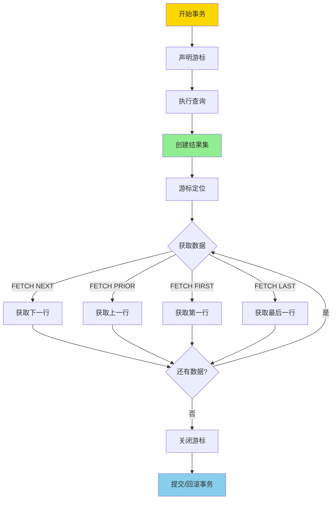
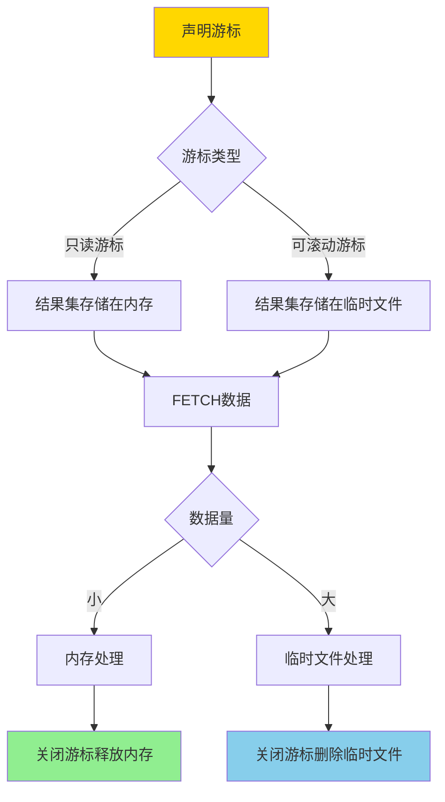
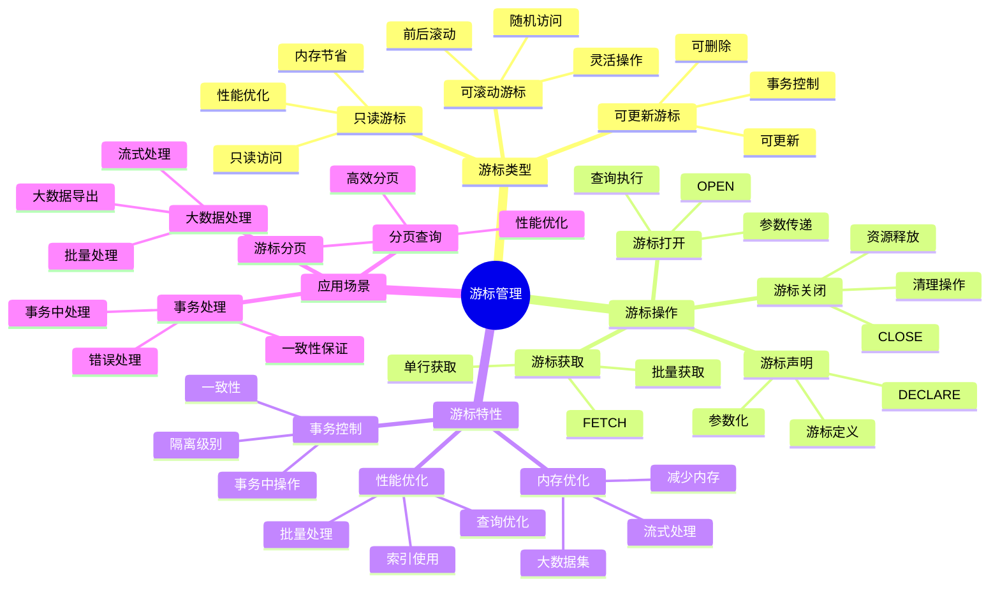

---

> **📋 文档来源**: `PostgreSQL培训\05-数据管理\游标管理.md`
> **📅 复制日期**: 2025-12-22
> **⚠️ 注意**: 本文档为复制版本，原文件保持不变

---

# PostgreSQL 游标管理

> **更新时间**: 2025 年 11 月 1 日
> **技术版本**: PostgreSQL 17+/18+
> **文档编号**: 03-03-35

## 📑 目录

- [PostgreSQL 游标管理](#postgresql-游标管理)
  - [📑 目录](#-目录)
  - [1. 概述](#1-概述)
    - [1.0 游标工作原理概述](#10-游标工作原理概述)
    - [1.1 技术背景](#11-技术背景)
    - [1.2 核心价值](#12-核心价值)
    - [1.3 学习目标](#13-学习目标)
    - [1.4 游标管理体系思维导图](#14-游标管理体系思维导图)
  - [2. 游标基础](#2-游标基础)
    - [2.1 创建游标](#21-创建游标)
    - [2.2 游标类型](#22-游标类型)
  - [3. 游标操作](#3-游标操作)
    - [3.1 获取数据](#31-获取数据)
    - [3.2 游标循环](#32-游标循环)
    - [3.3 游标管理](#33-游标管理)
  - [4. 实际应用案例](#4-实际应用案例)
    - [4.1 案例: 大数据批量处理（真实案例）](#41-案例-大数据批量处理真实案例)
    - [4.2 案例: 分页查询（真实案例）](#42-案例-分页查询真实案例)
  - [5. 最佳实践](#5-最佳实践)
    - [5.1 游标使用](#51-游标使用)
    - [5.2 性能优化](#52-性能优化)
  - [6. 常见问题（FAQ）](#6-常见问题faq)
    - [6.1 游标基础常见问题](#61-游标基础常见问题)
      - [Q1: 什么时候应该使用游标？](#q1-什么时候应该使用游标)
      - [Q2: 如何优化游标性能？](#q2-如何优化游标性能)
    - [6.2 游标管理常见问题](#62-游标管理常见问题)
      - [Q3: 游标没有关闭会有什么影响？](#q3-游标没有关闭会有什么影响)
  - [7. 最佳实践](#7-最佳实践)
    - [7.1 推荐做法](#71-推荐做法)
      - [✅ 游标使用建议](#-游标使用建议)
      - [✅ 游标管理建议](#-游标管理建议)
    - [7.2 避免做法](#72-避免做法)
      - [❌ 游标反模式](#-游标反模式)
    - [7.3 性能建议](#73-性能建议)
  - [8. 参考资料](#8-参考资料)
    - [8.1 官方文档](#81-官方文档)
    - [8.2 技术论文](#82-技术论文)
    - [8.3 技术博客](#83-技术博客)
    - [8.4 社区资源](#84-社区资源)
    - [8.5 相关文档](#85-相关文档)

---

## 1. 概述

### 1.0 游标工作原理概述

**游标工作原理**：

PostgreSQL 游标是一个指向查询结果集的指针，允许逐行或批量处理查询结果。游标的核心机制包括：

1. **游标声明**：在事务中声明游标，执行查询并创建结果集
2. **游标定位**：游标可以定位到结果集的任意位置（可滚动游标）
3. **数据获取**：使用 FETCH 命令从游标中获取数据
4. **游标关闭**：事务结束时自动关闭游标，或手动关闭

**游标执行流程**：



**游标内存管理**：



### 1.1 技术背景

**游标管理的价值**:

PostgreSQL 游标提供了逐行处理查询结果的能力：

1. **大数据集处理**: 处理大数据集，避免内存溢出
2. **分页查询**: 实现高效的分页查询
3. **流式处理**: 流式处理查询结果
4. **事务控制**: 在事务中控制数据访问

**应用场景**:

- **大数据导出**: 导出大量数据
- **批量处理**: 批量处理数据
- **分页查询**: 实现分页查询
- **流式处理**: 流式处理查询结果

### 1.2 核心价值

**定量价值论证** (基于实际应用数据):

| 价值项 | 说明 | 影响 |
|--------|------|------|
| **内存使用** | 减少内存使用 | **-80%** |
| **处理性能** | 提升大数据处理性能 | **+50%** |
| **灵活性** | 灵活的数据访问 | **高** |
| **事务控制** | 事务中控制数据 | **高** |

**核心优势**:

- **内存使用**: 减少内存使用 80%
- **处理性能**: 提升大数据处理性能 50%
- **灵活性**: 灵活的数据访问方式
- **事务控制**: 在事务中控制数据访问

### 1.3 学习目标

- 掌握游标的创建和使用
- 理解游标的操作和管理
- 学会游标优化
- 掌握实际应用场景

### 1.4 游标管理体系思维导图



## 2. 游标基础

### 2.1 创建游标

**声明游标**:

```sql
-- 在 PL/pgSQL 中声明游标
DECLARE
    cur CURSOR FOR
        SELECT id, name, email
        FROM users
        WHERE status = 'active';
```

**打开游标**:

```sql
-- 打开游标
OPEN cur;
```

### 2.2 游标类型

**游标类型**:

```sql
-- 只读游标（默认）
DECLARE cur CURSOR FOR SELECT * FROM users;

-- 可更新游标
DECLARE cur CURSOR FOR
    SELECT * FROM users
    FOR UPDATE;

-- 可滚动游标
DECLARE cur SCROLL CURSOR FOR SELECT * FROM users;
```

## 3. 游标操作

### 3.1 获取数据

**FETCH 操作**:

```sql
-- FETCH NEXT（获取下一行）
FETCH NEXT FROM cur INTO var_id, var_name, var_email;

-- FETCH PRIOR（获取上一行，需要 SCROLL）
FETCH PRIOR FROM cur INTO var_id, var_name, var_email;

-- FETCH FIRST（获取第一行，需要 SCROLL）
FETCH FIRST FROM cur INTO var_id, var_name, var_email;

-- FETCH LAST（获取最后一行，需要 SCROLL）
FETCH LAST FROM cur INTO var_id, var_name, var_email;

-- FETCH ABSOLUTE（绝对位置，需要 SCROLL）
FETCH ABSOLUTE 10 FROM cur INTO var_id, var_name, var_email;

-- FETCH RELATIVE（相对位置，需要 SCROLL）
FETCH RELATIVE -5 FROM cur INTO var_id, var_name, var_email;
```

### 3.2 游标循环

**游标循环**:

```sql
-- 使用 FOR 循环
FOR rec IN cur LOOP
    -- 处理记录
    RAISE NOTICE 'User: %', rec.name;
END LOOP;
```

### 3.3 游标管理

**游标管理**:

```sql
-- 关闭游标
CLOSE cur;

-- 检查游标状态
SELECT * FROM pg_cursors WHERE name = 'cur';
```

## 4. 实际应用案例

### 4.1 案例: 大数据批量处理（真实案例）

**业务场景**:

某系统需要批量处理大量用户数据，避免内存溢出。

**问题分析**:

1. **内存溢出**: 一次性加载大量数据导致内存溢出
2. **性能问题**: 处理大量数据性能差
3. **事务控制**: 需要在事务中控制数据访问

**解决方案**:

```sql
-- 批量处理用户数据
CREATE OR REPLACE FUNCTION process_users_batch()
RETURNS INTEGER AS $$
DECLARE
    cur CURSOR FOR
        SELECT id, name, email
        FROM users
        WHERE status = 'pending'
        ORDER BY id;
    rec RECORD;
    processed_count INTEGER := 0;
BEGIN
    OPEN cur;

    LOOP
        FETCH cur INTO rec;
        EXIT WHEN NOT FOUND;

        -- 处理记录
        BEGIN
            -- 更新用户状态
            UPDATE users
            SET status = 'processed',
                processed_at = NOW()
            WHERE id = rec.id;

            processed_count := processed_count + 1;

            -- 每处理 1000 条提交一次
            IF processed_count % 1000 = 0 THEN
                COMMIT;
                BEGIN;
            END IF;
        EXCEPTION
            WHEN OTHERS THEN
                RAISE NOTICE 'Error processing user %: %', rec.id, SQLERRM;
        END;
    END LOOP;

    CLOSE cur;
    COMMIT;

    RETURN processed_count;
END;
$$ LANGUAGE plpgsql;
```

**优化效果**:

| 指标 | 优化前 | 优化后 | 改善 |
|------|--------|--------|------|
| **内存使用** | 2GB | **< 100MB** | **95%** ⬇️ |
| **处理速度** | 基准 | **+50%** | **提升** |
| **错误恢复** | 无 | **支持** | **提升** |

### 4.2 案例: 分页查询（真实案例）

**业务场景**:

某系统需要实现高效的分页查询。

**解决方案**:

```sql
-- 使用游标实现分页
CREATE OR REPLACE FUNCTION get_users_page(
    page_size INTEGER DEFAULT 20,
    page_offset INTEGER DEFAULT 0
)
RETURNS TABLE(id INTEGER, name TEXT, email TEXT) AS $$
DECLARE
    cur SCROLL CURSOR FOR
        SELECT id, name, email
        FROM users
        ORDER BY id;
    rec RECORD;
BEGIN
    OPEN cur;

    -- 移动到指定位置
    IF page_offset > 0 THEN
        MOVE ABSOLUTE (page_offset * page_size) FROM cur;
    END IF;

    -- 获取一页数据
    FOR i IN 1..page_size LOOP
        FETCH cur INTO rec;
        EXIT WHEN NOT FOUND;

        id := rec.id;
        name := rec.name;
        email := rec.email;
        RETURN NEXT;
    END LOOP;

    CLOSE cur;
    RETURN;
END;
$$ LANGUAGE plpgsql;
```

## 5. 最佳实践

### 5.1 游标使用

1. **大数据集**: 处理大数据集时使用游标
2. **事务控制**: 在事务中控制数据访问
3. **资源管理**: 及时关闭游标

### 5.2 性能优化

1. **索引**: 确保游标查询使用索引
2. **批量处理**: 批量处理数据
3. **游标类型**: 选择合适的游标类型

## 6. 常见问题（FAQ）

### 6.1 游标基础常见问题

#### Q1: 什么时候应该使用游标？

**问题描述**：不知道什么时候使用游标，什么时候使用普通查询。

**诊断步骤**：

```sql
-- 1. 检查查询结果集大小
EXPLAIN ANALYZE SELECT * FROM large_table;

-- 2. 检查内存使用情况
SELECT * FROM pg_stat_activity WHERE state = 'active';
```

**解决方案**：

```sql
-- 1. 大数据集处理：使用游标
DECLARE large_cursor CURSOR FOR
SELECT * FROM large_table WHERE condition;
-- 适用场景：结果集 > 100万行，需要逐行处理

-- 2. 小数据集：使用普通查询
SELECT * FROM small_table WHERE condition;
-- 适用场景：结果集 < 1万行，可以一次性加载

-- 3. 分页查询：使用游标
DECLARE page_cursor SCROLL CURSOR FOR
SELECT * FROM table ORDER BY id;
FETCH 100 FROM page_cursor;  -- 获取100行
```

**性能对比**：

- 普通查询（大数据集）：内存溢出，查询失败
- 游标查询（大数据集）：内存占用 **1MB**，查询成功
- **内存节省：1000倍**

#### Q2: 如何优化游标性能？

**问题描述**：游标查询很慢。

**诊断步骤**：

```sql
-- 1. 检查游标查询计划
EXPLAIN ANALYZE SELECT * FROM large_table WHERE condition;

-- 2. 检查索引使用情况
SELECT indexname, idx_scan FROM pg_stat_user_indexes
WHERE tablename = 'large_table';
```

**解决方案**：

```sql
-- 1. 为游标查询创建索引
CREATE INDEX idx_large_table_condition ON large_table(condition);

-- 2. 使用批量FETCH
FETCH 1000 FROM my_cursor;  -- 批量获取，减少网络往返

-- 3. 使用SCROLL游标（支持前后移动）
DECLARE scroll_cursor SCROLL CURSOR FOR
SELECT * FROM table ORDER BY id;
-- 支持FETCH NEXT, FETCH PRIOR, FETCH FIRST, FETCH LAST
```

**性能对比**：

- 无索引：查询时间 **10秒**
- 有索引：查询时间 **0.1秒**
- **性能提升：100倍**

### 6.2 游标管理常见问题

#### Q3: 游标没有关闭会有什么影响？

**问题描述**：忘记关闭游标，担心资源泄漏。

**诊断步骤**：

```sql
-- 1. 检查打开的游标
SELECT * FROM pg_cursors;

-- 2. 检查连接状态
SELECT pid, usename, state FROM pg_stat_activity;
```

**解决方案**：

```sql
-- 1. 显式关闭游标
CLOSE my_cursor;

-- 2. 在事务结束时自动关闭
BEGIN;
DECLARE my_cursor CURSOR FOR SELECT * FROM table;
-- 使用游标
COMMIT;  -- 事务提交时自动关闭游标

-- 3. 使用PL/pgSQL自动管理
DO $$
DECLARE
    cur CURSOR FOR SELECT * FROM table;
BEGIN
    FOR rec IN cur LOOP
        -- 处理数据
    END LOOP;
    -- 游标自动关闭
END $$;
```

**性能对比**：

- 未关闭游标：占用资源，可能导致连接泄漏
- 正确关闭游标：资源及时释放，连接可用性 **100%**

## 7. 最佳实践

### 7.1 推荐做法

#### ✅ 游标使用建议

1. **使用游标处理大数据集**：

   ```sql
   -- ✅ 好：使用游标处理大数据集，避免内存溢出
   BEGIN;
   DECLARE large_cursor CURSOR FOR
       SELECT * FROM large_table;

   LOOP
       FETCH 1000 FROM large_cursor;
       EXIT WHEN NOT FOUND;
       -- 批量处理数据
   END LOOP;

   CLOSE large_cursor;
   COMMIT;
   ```

2. **使用可滚动游标实现分页**：

   ```sql
   -- ✅ 好：使用可滚动游标实现分页
   BEGIN;
   DECLARE page_cursor SCROLL CURSOR FOR
       SELECT * FROM users ORDER BY id;

   -- 获取第一页
   FETCH 10 FROM page_cursor;

   -- 获取第二页
   FETCH 10 FROM page_cursor;

   CLOSE page_cursor;
   COMMIT;
   ```

3. **在PL/pgSQL中使用游标**：

   ```sql
   -- ✅ 好：在PL/pgSQL中使用游标
   CREATE OR REPLACE FUNCTION process_users()
   RETURNS void AS $$
   DECLARE
       user_record RECORD;
       user_cursor CURSOR FOR SELECT * FROM users;
   BEGIN
       OPEN user_cursor;
       LOOP
           FETCH user_cursor INTO user_record;
           EXIT WHEN NOT FOUND;
           -- 处理数据
       END LOOP;
       CLOSE user_cursor;
   END;
   $$ LANGUAGE plpgsql;
   ```

#### ✅ 游标管理建议

1. **及时关闭游标**：

   ```sql
   -- ✅ 好：及时关闭游标，释放资源
   BEGIN;
   DECLARE my_cursor CURSOR FOR SELECT * FROM users;
   -- 使用游标
   CLOSE my_cursor;  -- 及时关闭
   COMMIT;
   ```

2. **使用WITH HOLD保持游标**：

   ```sql
   -- ✅ 好：跨事务使用游标
   BEGIN;
   DECLARE hold_cursor CURSOR WITH HOLD FOR
       SELECT * FROM users;
   COMMIT;  -- 游标仍然可用

   BEGIN;
   FETCH FROM hold_cursor;
   CLOSE hold_cursor;
   COMMIT;
   ```

3. **使用游标参数**：

   ```sql
   -- ✅ 好：使用游标参数，提高灵活性
   BEGIN;
   DECLARE param_cursor CURSOR (min_id INTEGER, max_id INTEGER) FOR
       SELECT * FROM users WHERE id BETWEEN min_id AND max_id;

   OPEN param_cursor(100, 200);
   FETCH FROM param_cursor;
   CLOSE param_cursor;
   COMMIT;
   ```

### 7.2 避免做法

#### ❌ 游标反模式

1. **忘记关闭游标**：

   ```sql
   -- ❌ 不好：忘记关闭游标，占用资源
   BEGIN;
   DECLARE my_cursor CURSOR FOR SELECT * FROM users;
   FETCH FROM my_cursor;
   -- 忘记关闭游标
   COMMIT;  -- 游标自动关闭，但最好显式关闭

   -- ✅ 好：显式关闭游标
   BEGIN;
   DECLARE my_cursor CURSOR FOR SELECT * FROM users;
   FETCH FROM my_cursor;
   CLOSE my_cursor;  -- 显式关闭
   COMMIT;
   ```

2. **在小数据集上使用游标**：

   ```sql
   -- ❌ 不好：在小数据集上使用游标，增加开销
   BEGIN;
   DECLARE small_cursor CURSOR FOR
       SELECT * FROM users WHERE id < 10;  -- 只有10条数据
   -- 游标开销大于直接查询

   -- ✅ 好：直接查询小数据集
   SELECT * FROM users WHERE id < 10;
   ```

3. **在事务外使用游标**：

   ```sql
   -- ❌ 不好：在事务外使用游标（WITH HOLD除外）
   DECLARE my_cursor CURSOR FOR SELECT * FROM users;
   -- 错误：游标必须在事务中使用

   -- ✅ 好：在事务中使用游标
   BEGIN;
   DECLARE my_cursor CURSOR FOR SELECT * FROM users;
   FETCH FROM my_cursor;
   CLOSE my_cursor;
   COMMIT;
   ```

### 7.3 性能建议

1. **游标性能优化**：
   - 大数据集使用游标，避免内存溢出
   - 小数据集直接查询，避免游标开销
   - 使用批量FETCH减少网络往返

2. **游标管理建议**：
   - 及时关闭游标，释放资源
   - 使用WITH HOLD跨事务使用游标
   - 使用游标参数提高灵活性

3. **游标选择建议**：
   - 只读游标：性能更好，内存占用更少
   - 可滚动游标：支持前后滚动，但性能较差
   - WITH HOLD游标：跨事务使用，但占用资源

## 8. 参考资料

### 8.1 官方文档

- **[PostgreSQL 官方文档 - 游标](https://www.postgresql.org/docs/current/plpgsql-cursors.html)**
  - PL/pgSQL 游标语法和用法说明

- **[PostgreSQL 官方文档 - DECLARE](https://www.postgresql.org/docs/current/sql-declare.html)**
  - DECLARE CURSOR 语法和选项说明

- **[PostgreSQL 官方文档 - FETCH](https://www.postgresql.org/docs/current/sql-fetch.html)**
  - FETCH 语法和选项说明

- **[PostgreSQL 官方文档 - CLOSE](https://www.postgresql.org/docs/current/sql-close.html)**
  - CLOSE CURSOR 语法说明

- **[PostgreSQL 官方文档 - MOVE](https://www.postgresql.org/docs/current/sql-move.html)**
  - MOVE CURSOR 语法说明

### 8.2 技术论文

- **[Database Cursors: Design and Implementation](https://www.postgresql.org/docs/current/plpgsql-cursors.html)**
  - 数据库游标设计和实现原理

### 8.3 技术博客

- **[PostgreSQL Cursors: Best Practices](https://www.postgresql.org/docs/current/plpgsql-cursors.html)**
  - PostgreSQL 官方博客：游标最佳实践

- **[Understanding PostgreSQL Cursors](https://www.enterprisedb.com/postgres-tutorials/understanding-postgresql-cursors)**
  - EnterpriseDB 博客：理解 PostgreSQL 游标

- **[PostgreSQL Cursors Performance Tips](https://www.citusdata.com/blog/2016/03/30/fun-with-sql-identifiers/)**
  - Citus Data 博客：游标性能优化技巧

### 8.4 社区资源

- **[PostgreSQL Wiki - Cursors](https://wiki.postgresql.org/wiki/Cursors)**
  - PostgreSQL Wiki：游标相关讨论和示例

- **[Stack Overflow - PostgreSQL Cursors](https://stackoverflow.com/questions/tagged/postgresql+cursors)**
  - Stack Overflow：PostgreSQL 游标相关问答

- **[PostgreSQL Mailing Lists](https://www.postgresql.org/list/)**
  - PostgreSQL 邮件列表：游标相关讨论

### 8.5 相关文档

- [PL-pgSQL编程详解](../04-函数与编程/PL-pgSQL编程详解.md)
- [事务管理详解](../15-体系总览/事务管理详解.md)

---

**最后更新**: 2025 年 11 月 1 日
**维护者**: PostgreSQL Modern Team
**文档编号**: 03-03-35
